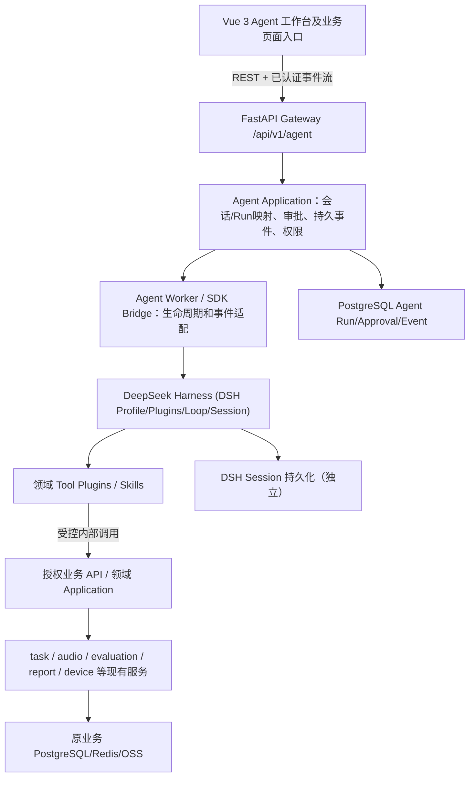

# 04 前后端改造方案：DeepSeek Harness 集成落地

> 基线：`V9.7.31`（按该分支实际代码目录核对），2026-10-08。状态：**实施方案，尚未开发/验证**。
> 
> 上位决策：[00_DeepSeek_Harness统一迁移设计.md](00_DeepSeek_Harness统一迁移设计.md)。功能需求见 [01_功能介绍.md](01_功能介绍.md)，场景见 [02_用户场景.md](02_用户场景.md)；[03_技术设计文档.md](03_技术设计文档.md) 的自研 Agent Runtime 部分为旧设计。
> 
> 原则：**Agent 核心全部采用 DeepSeek Harness (DSH)，保留现有 Vue 业务界面和 FastAPI/HTTP/gRPC 领域服务。** 这不是重新开发一套第二 Agent Loop，也不是直接在原前端嵌入 DSH 原生 Web UI。

## 1. 代码现状与改造边界

已核对的 `V9.7.31` 路径和事实：

| 现有位置 | 当前事实 | 建议改造 |
|---|---|---|
| `frontend/src/App.vue`、`frontend/src/router/index.ts` | 侧边栏导航 + Hash Router + 权限 meta | 增加“智能助手”入口与 `/agent` 路由；原有页面保留 |
| `frontend/src/views/` | Tasks、TestCaseManager、ReportView、LogView、AudioImport、Device 等业务页面 | 新建 `views/Agent/`，并在现有详情页加“交给 Agent 分析”上下文入口 |
| `frontend/src/composables/`、`store/` | 按领域拆分用例与状态 | 新增 `composables/agent/` 和 Agent Run/会话 Store |
| `frontend/src/infrastructure/api/`、`dto/`、`adapters/`、`http/client.ts` | API 请求封装已有 JWT；基础架构强调 snake_case DTO→camelCase Domain | 增加 Agent API、DTO、Adapter；事件流另封装独立传输端口 |
| `frontend/src/infrastructure/socket/taskChannel.ts` | 已存在测试任务实时通道 | 原任务通道继续维护；Agent 事件使用独立 SSE |
| `api_gateway/app.py`、`routes/` | FastAPI + AuthMiddleware + 领域路由，已有 `/api/v1/tasks` 等路径 | 注册 `/api/v1/agent` 路由，不重构业务路由 |
| `api_gateway/routes/sse_bp.py` | Redis PubSub 流式订阅；`/api/v1/sse/events`；没有持久游标重放 | Agent 专用持久事件端点，不直接套用现有全局 Redis 流 |
| `api_gateway/application/services/auth/dependencies.py` | 已有 `require_permission` | 增加 Agent 专用权限，继续在领域服务端细粒度二次校验 |
| `task_service`、`device_service` 等 | 现有领域执行能力 | 通过窄工具 Adapter 调用，**不移植到 DSH 内部** |
| `docker/docker-compose.yml` | PostgreSQL、Redis、rustfs 和多个 Python 服务 | 增加受限 DSH Worker/Container 与 Agent 配置 |
| `api_gateway/config/config.py` | `AUTH_MODE` 默认为 `off` | 非本地试验禁用 off；新增 Agent 开关和安全配置 |

### 必须先修正的现实安全问题

1. `api_gateway/config/config.py` 当前 `AUTH_MODE='off'` 的默认行为不可用作生产 Agent 认证；生产环境 fail-closed，未配置有效身份服务时 `AGENT_ENABLED=false`。
2. `api_gateway/routes/task_bp.py` 的 `POST /{task_id}/stop` 当前缺少显式 `require_permission('task:execute')` 依赖；实施时补齐并检查其他写端点。**DSH 不能通过调用旧路由绕过授权**。
3. `api_gateway/routes/sse_bp.py` 订阅 `task_logs/task_progress/sse_events` 全局频道，没有按 Agent 会话/用户隔离与持久重放；Agent 不能直接复用其广播语义。
4. `api_gateway/app.py` 的 CORS 配置为通配 origin；在生产启用带凭据 Agent 请求前应收紧 origin、跨站策略及代理鉴权。
5. `frontend/src/infrastructure/http/client.ts` 主要面向一次性 HTTP/ Electron IPC 请求；流式 SSE 必须设计浏览器与 Electron 双通道，不假设现有 `request()` 能持续传送 token 增量。

## 2. 目标拓扑（不做双 Runtime）



- **DSH 自身所有 Agent 决策与工具调度**：模型流、Tool Calling、上下文、Session、Agent Loop 由 DSH 提供，团队不编写第二套同类通用内核。
- **我方 Agent Application 不负责替代 DSH 思考**：只负责身份、Run 映射、业务阶段/长任务、审批、幂等、持久事件与恢复对账。
- **DSH 不是直接面向浏览器的公网服务**：UI 只访问 Gateway；服务间通信受认证、限流与网络隔离保护。
- **禁止 DSH 进程持有跨域写库权限/真实设备密钥**：Tool Plugin 调用后端窄 API；插件里的模型数据、用户输入和工具参数都不被视为可信授权依据。

### 如何调用 DSH（需要先做兼容性 Spike）

上游提供 Node.js/TypeScript 的 Profile+Plugin 系统，以及 Python SDK（SDK 使用外部 DSH Runtime、JSON-RPC 协议）。**不能假定上游提供适用于本系统的现成多租户 HTTP Agent 服务。**

首选实现为：FastAPI Agent Application 创建 Run → 专用 Worker 用受版本锁定的 DSH SDK/Profile 驱动 Agent → Worker 转发标准化事件回 Gateway → Gateway 持久化并通知前端；Tool Plugins 使用受限服务凭据/一次性授权上下文向现有领域服务执行操作。Node.js Plugin 在 DSH 进程运行，Python Gateway 不直接 import TS 插件。

Spike 必须验证：SDK 会话新建/续用、流式输出、工具执行拦截/拒绝、取消与超时、插件挂载、DSH Session 恢复、Worker 异常退出及多用户隔离；依据结果决定 Worker 采用 Python SDK 驱动还是 TypeScript SDK 包装，**两者不得同时变成独立 Agent 执行器**。绑定固定版本，不依赖移动的 master。

## 3. 前端改造

### 3.1 新增目录建议（与现有架构保持一致）

```text
frontend/src/
  views/Agent/
    AgentWorkspace.vue               # 会话导航、对话与执行时间线组合页面
    agentWorkspace.css               # 与现有主题一致
  components/agent/
    AgentMessageList.vue             # AI/用户消息与工具证据
    AgentComposer.vue                # 输入框、关联业务对象与附件
    AgentTimeline.vue                # Run 步骤、耗时、状态、错误
    AgentToolCallCard.vue            # 工具调用与可追溯证据
    AgentApprovalCard.vue            # 结构化操作提案 + 审批
    AgentContextCard.vue             # 任务/设备/报告资源卡片
    AgentRunHeader.vue               # 暂停/取消/恢复状态
  composables/agent/
    useAgentSession.ts               # 创建会话、发送消息、历史加载
    useAgentEvents.ts                # 断线续传、事件去重、连接状态
    useAgentApproval.ts              # 审批用例
    useAgentTaskContext.ts           # 从现有页面装配业务资源引用
  store/agentStore.ts                # Run/会话 UI ReadModel（Pinia）
  domain/model/agent.ts              # camelCase + discriminated unions
  domain/model/agentEvent.ts
  infrastructure/api/agentApi.ts     # REST API；DTO 由 Adapter 转 Domain
  infrastructure/dto/agentDto.ts
  infrastructure/adapters/agentAdapter.ts
  infrastructure/stream/agentEvents.ts # fetch streaming / Electron bridge
```

以上为**拟新增**目录，不代表现有仓库已有这些文件。遵循当前前端分层：Presentation 不直接操作 DTO/HTTP，Domain 不引用第三方 SDK，API 的 snake_case 到 camelCase 在 Infrastructure 完成。状态必须可由服务端重新加载，不依赖浏览器内存作为唯一事实。

### 3.2 页面与交互

**新增 `/agent` 智能助手工作台**：左侧历史会话；中间对话（可编辑用户目标）；右侧“计划/工具调用/运行时间线/关联资源”；底部输入。移动或窄窗口改为标签切换。支持将会话关联到 test task、报告、设备或测试用例。

**现有页面不重写**：在 `Tasks.vue`、`LogView`、`ReportView`、`TestCaseManager`、`Device` 等页面增加“使用 Agent 分析/创建”入口，导航到 `/agent?taskId=...` 或传入受校验资源上下文；Agent 根据资源 ID 向后端读取业务数据，不直接把页面全量 DOM/报告塞进 Prompt。原来的手工流程继续可用。

**审批 UI**：必须显示资源、操作、参数 diff/摘要、影响范围、审批截止时间以及“批准/拒绝”。同一审批使用 `approvalId`，按钮操作只发送决议，不传客户端篡改后的执行参数。决议后重新获取最新状态；过期/并发执行显示明确错误。

**进度 UI**：区分 `模型正在思考`、`工具执行中`、`等待审批`、`业务任务在后端运行`、`Agent Run 完成`。Agent 文本结束不等于业务任务已结束。工具结果卡片提供任务/报告/日志原页面链接。

**Electron 特别处理**：现有 `http/client.ts` 包含 Electron IPC 一次性请求分支。对 Agent 流式响应，优先在隔离前端访问同源 Gateway 的授权 fetch stream；若 Electron 环境需要主进程转发，则增加独立流 IPC（包括关闭/取消及 token 隔离），不得通过会缓存完整响应的 `apiRequest` 假装 SSE。

### 3.3 前端 Domain 事件

`AgentEvent` 使用可辨识联合类型；最少包括 `sequence`、`runId`、`type`、`createdAt`、`data`，其中 `data` 随类型校验。类型至少覆盖：
`run_started`、`assistant_delta`、`tool_proposed`、`approval_required`、`tool_started`、`tool_completed`、`run_progress`、`run_completed`、`run_failed`、`run_cancelled`。

注意 `assistant_delta` 仅为暂态显示，服务端需要提供已提交的完整 assistant 消息快照；连接重放时以消息 ID/增量序列去重，不能重复拼接已接收文本。事件缺口回补、`Last-Event-ID` 与接收端游标规则必须有测试。UI 不渲染未经净化的 Markdown/HTML，也不展示内部凭据或敏感工具参数。

## 4. 后端改造

### 4.1 Gateway / Application / Infrastructure 目录

```text
api_gateway/
  routes/agent_bp.py                        # REST、审批、SSE、取消
  schemas/agent/                             # 请求/响应 Pydantic DTO
  application/agent/
    run_service.py                           # Run 与业务生命周期
    session_service.py                       # 用户会话映射与权限
    approval_service.py                      # 不可变提案与幂等决议
    event_service.py                         # 事件持久化与序号
    policy_service.py                        # tool/action 权限和风险策略
    ports/                                   # WorkerClient、EventRepo 等端口
  domain/agent/                              # AgentRun/Approval/RunEvent 模型
  infrastructure/agent/
    worker_client.py                         # 调用隔离 DSH Worker
    run_repository.py                        # PostgreSQL
    event_repository.py
    approval_repository.py
    domain_tool_gateway.py                   # 原有业务 Application API 封装

agent_worker/                                # **新增** DSH Worker 模块/构建上下文
  README.md
  profiles/                                  # 受版本控制的 profile / patch
  plugins/                                   # TS 业务 Tool Plugins
    task/
    diagnostics/
    evaluation/
    audio/
    device/
    driver_proposal/
  bridge/                                    # SDK 宿主进程、事件协议（非自研 Loop）

docker/Dockerfile.agent_worker               # **新增**
docker/docker-compose.yml                    # 新增 agent_worker 服务（内部网络）
```

模块建议采用现有仓库 `api_gateway/application` 和 `infrastructure` 分层。上面只是目录计划；最后应服从代码库 import、配置注入、数据库迁移机制，不生造第二套 ORM/认证中间件。

### 4.2 Gateway API 契约（建议版，不是现成接口）

统一前缀 `/api/v1/agent`，身份取自 `AuthMiddleware` 注入的 `request.state.user_id`；不允许请求体指定执行用户。

| Method | Endpoint | 用途 | 权限 |
|---|---|---|---|
| `POST` | `/sessions` | 创建用户会话 | `agent:use` |
| `GET` | `/sessions` | 列出当前用户会话（分页） | `agent:use` |
| `GET` | `/sessions/{session_id}` | 查询会话/已完成消息 | 会话归属 |
| `POST` | `/sessions/{session_id}/runs` | 提交一条目标，返回 `run_id` | `agent:use` |
| `GET` | `/runs/{run_id}` | 读取 Run 快照与业务关联 | Run 归属 |
| `GET` | `/runs/{run_id}/events` | 有序持久事件流、游标续传 | Run 归属 |
| `POST` | `/runs/{run_id}/cancel` | 取消尚未执行的后续步骤 | `agent:use` + 归属 |
| `GET` | `/runs/{run_id}/approvals` | 查询待审批提案 | Run 归属 |
| `POST` | `/approvals/{approval_id}/decision` | 批准/拒绝，不接受修改原提案参数 | 对应业务操作权限 |
| `GET` | `/health` | 内部就绪/版本/依赖诊断（不暴露凭据） | 运维 |

写接口建议统一支持 `Idempotency-Key` 和 `request_id`；如使用重试机制，服务端保存请求摘要并校验 Key 与内容一致。返回业务状态和 `run_id` 的 JSON，而非阻塞直到 LLM 完成。Agent Run、任务 `task_id`、DSH `session_id` 是三个不同实体，必须明确映射。

**创建 Run 请求例子：**

```json
{
  "message": "分析任务123失败的用例，给我一个重试方案",
  "context": {"resource_type": "task", "resource_id": "123"},
  "mode": "interactive"
}
```

**Run 已接受响应（示意）：**

```json
{
  "run_id": "run_abc123",
  "session_id": "ses_001",
  "status": "queued",
  "events_url": "/api/v1/agent/runs/run_abc123/events"
}
```

仅向模型传入受校验的资源引用。即使请求中提供 `context.resource_id`，仍须重新验证此用户对该任务有 `task:read` 权限。

### 4.3 SSE 与续传契约

`GET /runs/{run_id}/events` 采用持久化事件序号；每条事件包含 `id: <sequence>`、`event: <type>` 和 JSON `data`。通过 `Last-Event-ID` 或 `after_sequence` 断点续传：先查数据库补齐，再订阅短期 Redis 通知，连接期间仍以数据库 sequence 校验缺口，避免读 DB/订阅之间丢事件。一个 `run_id` 的 sequence 单调递增，事件授权按用户/租户隔离。

鉴于现有 JWT 放在 `Authorization` 请求头，浏览器原生 `EventSource` 无法便捷传自定义 Bearer Header；建议优先 `fetch` + ReadableStream（或经过校验的短时单用途 stream ticket），不要把长期 JWT 加到 URL。Proxy 必须关闭缓冲并发送心跳。前端断线不自动取消后台业务任务。

### 4.4 PostgreSQL 运行数据（建议）

在现有迁移体系里新增：

- `agent_sessions`：`session_id`、owner、title、created_at、DSH session 映射、权限域。
- `agent_runs`：`run_id`、session、owner、status、关联业务资源、budget、start/end、failure_reason。
- `agent_run_events`：(`run_id`, `sequence`) 唯一、`type`、`created_at`、脱敏 `payload`；用于断线续传。
- `agent_approvals`：`approval_id`、run、用户/资源/工具版本、不可变参数摘要、风险等级、到期/决定/执行结果。
- `agent_tool_actions`：`idempotency_key` 唯一、actor、目标业务动作、请求摘要、结果引用、状态；防止多次请求造成重复副作用。
- `agent_task_links`：Run 与业务 `task_id` 的多对多关联；报告生成后可反向导航。

索引建议：session owner、run owner/status、(`run_id`, `sequence`)、approval status/expiry、action 幂等键。DSH Session Log 和我方事件是不同视图：**DSH 负责模型上下文与对话恢复，我方存储负责业务状态与审批真相**。敏感音频或完整日志不进入事件表；存文件/对象存储仅记录授权引用。

### 4.5 Tool Plugin 到现有服务的映射

先用少量高价值工具验证链路，不把 61 个能力一次性注册：

| DSH Plugin 工具示例 | 原系统建议复用入口 | 备注 |
|---|---|---|
| `task_get_status` | `GET /api/v1/tasks/{id}`、`/{id}/progress` | 只读；服务端校验归属 |
| `task_get_case_results` | `GET /api/v1/tasks/{id}/cases/{case_id}/results` | 分页/脱敏/输出限额 |
| `log_query` | `GET /api/v1/logs` / LogQueryService | 仅查当前用户可访问数据，避免全局日志外泄 |
| `evaluation_get_results` | 现有 evaluation/report 应用服务 | 优先通过业务稳定 API/Port |
| `task_retry_propose` | 提案存储 → 审批后 `POST /api/v1/tasks/{id}/retry` | DSH 不直接调用重试写路由 |
| `driver_create_proposal` | UiAutoDev 元素 → 驱动提案服务 | 静态校验/隔离测试/审批才发布 |
| `code_search`（可选） | 授权仓库 `rg` 只读适配器 | 禁用任意 Shell/遍历宿主机 |

需给每个工具定义输入/输出 JSON Schema、permission、risk、timeout、audit、idempotency 及最大输出；优先使用上游 DSH ToolDefinition/Plugin 机制。Tool Plugin 只持有受限内部服务凭据，操作者的授权上下文需由可信 Gateway 签发/绑定并由目标服务验证，**不得信任模型填的 user_id/role 或 task_id**。

## 5. 一条完整业务链路

用户在现有 `Tasks.vue` 点击“用 Agent 分析本次失败”：

1. 前端用 `task_id` 导航 `/agent` 并创建 session/run；Gateway 检查用户 `task:read` 及资源访问。
2. Gateway 保存 `AgentRun=queued`，Worker 创建/恢复受限 DSH Session，按场景只暴露只读工具。
3. DSH 调用 `task_get_status`、`task_get_case_results`、`log_query`；结果由原业务服务提供，Gateway 在用户可见事件中留最小证据引用。
4. DSH 输出失败归因、证据与重试用例建议。若用户要求执行，DSH 提交 `task_retry_propose`，但不立即重试。
5. Gateway 保存不可变 Approval，Agent Run 进入 `waiting_approval`；前端通过 SSE 显示结构化确认卡片。
6. 用户批准后，服务端重新验证 `task:execute`、task 状态、approval 到期/唯一性及幂等 Key；调用既有 TaskLifecycleService/领域 API。
7. 业务测试任务异步运行，前端继续用原任务状态接口/Socket.IO 观察进度；Agent Run 保留任务引用并可恢复检查。
8. 测试完成后，DSH 通过报告/结果工具读取新旧对比并生成结论；前端显示报告链接、引用证据与最终状态。

**业务任务成功、Run 完成、模型回合结束是三种不同状态**；任何故障恢复先依据业务服务查询实际副作用结果，禁止重复执行可能已经成功的步骤。

## 6. 部署与运行

`docker/docker-compose.yml` 新增 `agent_worker`（固定 DSH 版本镜像、专用非 root 用户、容器内只读挂载、限制网络/CPU/内存和日志），Gateway 通过内部网络访问；**禁止暴露 DSH 端口到公网**。设置 `AGENT_ENABLED=false` 默认关闭、`DSH_PROFILE`、`DSH_VERSION`、Worker endpoint、运行并发数、事件保留策略、审批超时、工具预算；凭据从部署 Secret 注入。

上线约束：上游 README 和 SAFETY 显示 DSH 为开发者预览、未安全审计，可能执行 Shell/代码并访问宿主资源。默认 `sdk-minimal` 使用高权限 Shell，不能直接拿来接生产 API；须使用经审计的最小 Profile、移除通用 Shell/任意文件访问/无约束浏览器等能力，只挂载经过代码审查的 Plugin。检查 SDK/Profile 是否会向模型提供方上传 DSH Session 日志，按公司数据策略禁用或授权并做脱敏。没有隔离条件则只在一次性实验环境启用。

必须留有全局熔断（Agent OFF 不影响原系统）、逐租户并发额度、Tool 超时/输出上限、Run 预算、审计追踪、版本回退与业务任务停止能力。AI 服务故障应不影响人工测试流程。

## 7. 任务清单（可以按 PR 拆分）

| 阶段 | 后端交付 | 前端交付 | 验收 |
|---|---|---|---|
| F0 基础审计 | DSH 版本锁定、SDK Spike、Profile 最小权限、现有路由权限核查 | 确定 Agent 原型与事件模型 | 接入与安全边界被证实；旧功能无回归 |
| F1 只读闭环 | Agent Worker + Bridge、Run/Session/Event 持久化、3 个只读工具、独立 SSE | `/agent` 工作台、对话、时间线、断线重连 | 查询任务/日志并生成引用证据的结果 |
| F2 业务入口 | 上下文鉴权、资源引用、可追溯 Tool Result | Tasks/Report/Log 页面深链接入口 | 不泄漏无权限资源；来源可导航 |
| F3 写操作审批 | Approval/幂等状态机、Retry 提案、审计和恢复 | ApprovalCard、确认/拒绝/过期/并发提示 | 重复点击或重放只执行一次 |
| F4 设备/驱动 | UiAutoDev 受限数据、驱动代码提案、沙盒校验和受控发布 | 元素卡片、diff/发布审阅 | 未审批不可发布或操控设备 |
| F5 推广 | 工具分域、评估集、告警/成本/并发/灰度开关 | 更多业务入口、运行管理页 | 完成率、权限、延迟、故障恢复达标 |

### 具体回归测试清单

- 前端：Domain/DTO Adapter 单测、SSE 分块/重放/缺口/中断恢复、重复 token 不拼接、审批按钮禁重、路由权限、Electron 与 Web 双端。
- Gateway：认证与对象级授权、`AUTH_MODE=off` 的生产阻断、任意用户无法访问他人 Run/事件、过期/重复/并发 Approval、Idempotency-Key 冲突、SSE cursor 断线回放。
- DSH：模型失败、工具 Schema 拒绝、超时/取消、Plugin 加载失败、重启恢复、Session 归属、模型生成命令无法访问宿主敏感目录。
- 业务：测试任务已经启动但 Worker 崩溃时不重复创建/重试、业务任务中止独立于 Agent 取消、设备授权与租用、驱动未批准不会写生产。
- 运维：压力（长连接/并发 Run）、事件保留与清理、CPU/内存/Token 预算、Agent 关闭后手工功能正常、固定版本升级/回滚可重复。

## 8. 代码实施决策

**第一批推荐 PR**：
1. `F0-1`：固定 DSH 版本与安全 Profile/SDK Spike（隔离环境），记录可运行配置与限制。
2. `F0-2`：补齐 Agent 相关资源授权及已知旧路由越权风险；为 Agent API 定义 Pydantic/TypeScript 协议。
3. `F1-1`：后端 `/api/v1/agent` + 持久 Run/Event + Worker 桥接 + `task_get_status`/日志只读工具。
4. `F1-2`：前端 `/agent` 页面 + Pinia ReadModel + 流式客户端 + 失败诊断时间线。
5. `F3-1`：提案-审批-幂等-重试闭环，再扩展其他写工具。

明确**不做**：在 Python Gateway 再实现一套 LangChain/Agent Loop；一次性重写 61 个业务工具；把 DSH Web UI 直接替换现有 Vue；把 Redis PubSub 当事件唯一存储；把任意 Shell 当默认生产工具；为了“Agent 化”重写音频、设备、评估领域服务。

## 9. 参考依据

- 本仓库 `V9.7.31`：`frontend/src/App.vue`、`router/index.ts`、`infrastructure/http/client.ts`、`infrastructure/api/tasksApi.ts`、`api_gateway/app.py`、`routes/sse_bp.py`、`routes/task_bp.py`、`middleware.py`、`config/config.py`、`docker/docker-compose.yml`。
- DSH 项目：https://github.com/deepseek-ai/deepseek-harness
- 官方架构：https://github.com/deepseek-ai/deepseek-harness/blob/master/docs/architecture.md
- SDK 协议：https://github.com/deepseek-ai/deepseek-harness/blob/master/packages/sdk/README.zh.md
- Python SDK：https://github.com/deepseek-ai/deepseek-harness/blob/master/docs/user/guide/python-sdk.zh.md
- Plugin：https://github.com/deepseek-ai/deepseek-harness/blob/master/docs/user/develop/basic/index.zh.md
- 安全声明：https://github.com/deepseek-ai/deepseek-harness/blob/master/SAFETY.md
