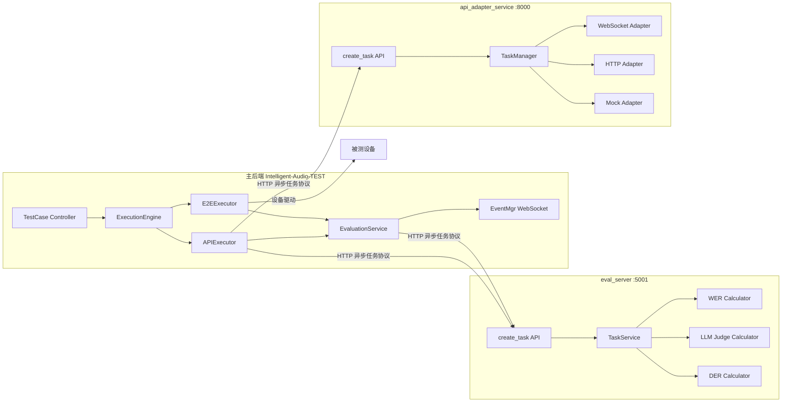
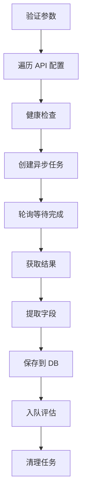
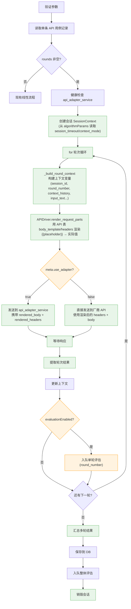
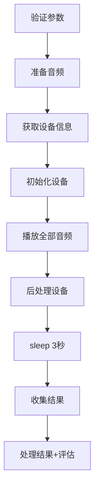
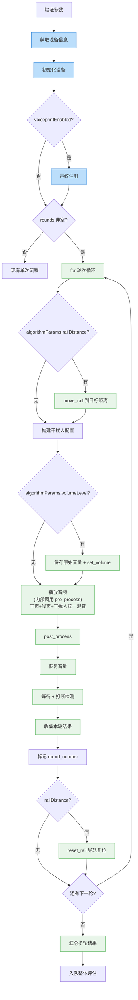
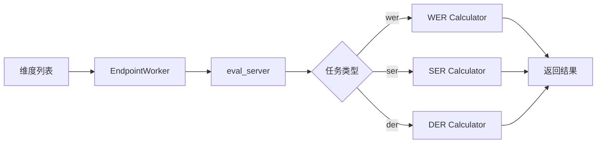
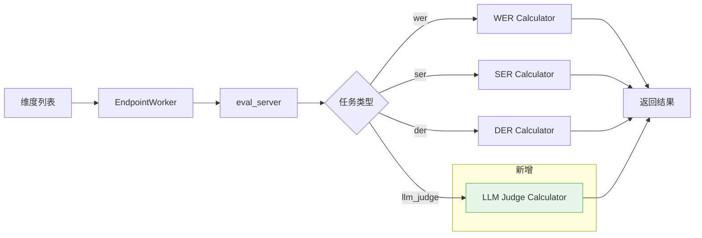
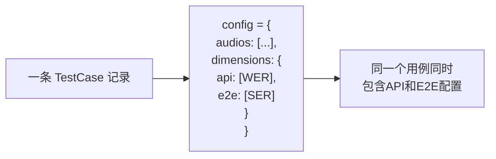
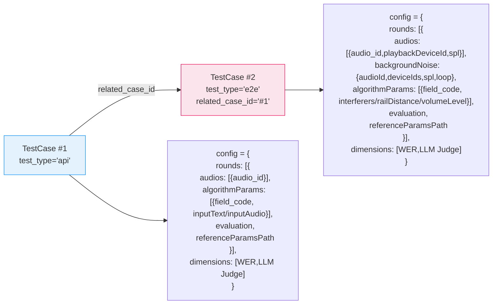

# voice_llm 改造方案总览

## 1. 背景与目标

### 背景
现有智能音频测试平台支持 translation（翻译）、asr（语音识别）、speaker_recognition（声纹识别）、tts（语音合成）等算法类型的自动化测试。voice_llm（语音交互大模型）作为新的测试类型，需要支持多轮对话、声纹注册、干扰人播放、导轨距离控制、被测设备音量控制、全双工打断检测等能力。

### 目标
- 新增 `algorithm_type = 'voice_llm'` 测试类型
- 支持 API 多轮会话测试和 E2E 端到端多轮测试
- 主后端仅做编排，评估计算委托给 eval_server 微服务
- API 适配通过 api_adapter_service 微服务完成

---

## 2. 三服务架构拓扑

**协作关系**：
- **主后端**：用例管理、任务调度、执行编排、进度推送、结果存储
- **eval_server**：纯计算服务，接收评估任务（WER/LLM Judge/DER），异步返回结果
- **api_adapter_service**：适配不同厂商的 API 协议，将统一的 create_task 请求转换为厂商特定格式

---

## 3. 核心能力矩阵

| 能力 | API 测试 | E2E 测试 | 说明 |
|------|:--------:|:--------:|------|
| 多轮会话 | ✓ | ✓ | 按轮次执行输入→等待→收集 |
| 会话上下文管理 | ✓ | — | SessionContext 维护对话历史（从 algorithmParams 读取 session_timeout/context_mode） |
| 声纹注册 | — | ✓ | 播放注册音频 + 等待确认（从 algorithmParams 读取 voiceprintEnabled） |
| 干扰人播放 | — | ✓ | algorithmParams.interferers，复用 play_overlap→play_multi 按设备分组统一混音 |
| 导轨控制 | — | ✓ | algorithmParams.railDistance→move_rail，设备驱动框架集成 |
| 被测设备音量控制 | — | ✓ | algorithmParams.volumeLevel→set_volume，ADB/HDC 设置系统音量 |
| 全双工打断检测 | — | ✓ | algorithmParams.interruptionEnabled，播放期间监听打断信号 |
| 单轮评估 | ✓ | ✓ | 每轮独立评估（round_number 0-indexed，可选） |
| LLM Judge 评估 | ✓ | ✓ | 基于 LLM 的语义评估 |

---

## 4. 改造前后流程图对比

### 图1：API 测试执行流程

#### Before（现有流程）

#### After（配置驱动多轮流程，模板驱动）

> 绿色框 = 多轮通用步骤，橙色框 = 配置条件分支
> 
> **模板驱动**：请求格式由 API 表的 `meta.body_template` + `meta.headers` 定义，多轮流程只提供额外的上下文变量（`session_id`、`round_number`、`context_history` 等），通过 `APIDriver.render_request_parts()` 统一渲染。不同厂商只需修改 API 表配置，无需改代码。

### 图2：E2E 测试执行流程

#### Before（现有流程）

#### After（配置驱动多轮流程）

> 蓝色框 = 循环外一次性步骤，绿色框 = 循环内每轮步骤

### 图3：评估流程

#### Before（现有流程）

#### After（新增维度 + 配置驱动）

**额外变化**：
- 新增 `round_number` 参数支持单轮评估（0-indexed，NULL 表示整体评估）
- 多轮评估结果聚合逻辑（按维度分组取平均，写入 `algorithm_result.aggregated`，整体评估 `round_number=NULL`）
- 新增 LLM Judge Calculator

### 图4：用例数据流

#### Before（现有流程）

#### After（voice_llm 双记录架构）

**核心差异**：
- Before：一条记录，config.dimensions 嵌套 `{api:[], e2e:[]}`
- After：API 单条记录（test_type='api'）+ E2E 记录（related_case_id 指向 API 记录），config 扁平化为 `{rounds:[], dimensions:[]}`
- API rounds：audios[]（简化，仅 audio_id）+ algorithmParams（含 inputText/inputAudio）
- E2E rounds：audios[]（含 playbackDeviceId/spl）+ backgroundNoise（顶层，带 loop）+ algorithmParams（含 interferers/railDistance/volumeLevel 等）
- algorithmParams 统一为 `[{field_code, field_value}]` 数组格式

---

## 5. 改动文件清单总览

### 后端（Intelligent-Audio-TEST/backend/）

| 文件 | 改动类型 | 说明 |
|------|---------|------|
| `models/models.py` | 修改 | TestCase 新增 test_type, related_case_id |
| `models/algorithm_models.py` | 修改 | CaseAlgorithmParam 新增 scope |
| `schemas/testcase.py` | 修改 | 新增 RoundConfig 等 Schema 类型 |
| `controllers/testcase_controller.py` | 修改 | 双记录 CRUD 适配 |
| `controllers/algorithm_controller.py` | 修改 | scope 过滤支持 |
| `algorithm/field_mapper.py` | 修改 | voice_llm 字段定义 |
| `algorithm/case_parameter_extractor.py` | 修改 | voice_llm 参数提取 |
| `algorithm/reference_params_generator.py` | 修改 | voice_llm 参考参数生成 |
| `algorithm/algorithm_result_field_mapper.py` | 修改 | voice_llm 输出映射 |
| `utils/api_driver.py` | 修改 | 新增 `render_request_parts()` 方法，统一渲染 headers + body 模板 |
| `utils/api_executor.py` | 重构 | 多轮会话（模板驱动，rounds 非空时），新增 `_build_round_context()`、`_get_vendor_api_url()` |
| `utils/e2e_executor.py` | 重构 | 多轮循环（配置驱动，rounds 非空时） |
| `utils/evaluation_service.py` | 修改 | llm_judge 分发、round_number |
| `utils/evaluation_api_client.py` | 修改 | 多轮对话请求体 |
| `utils/evaluation_result_processor.py` | 修改 | 多轮结果聚合 |
| `utils/base_executor.py` | 修改 | 评估入队适配 |
| `utils/execution_engine.py` | 修改 | 多轮进度 |
| `utils/event_manager.py` | 修改 | round_progress 事件 |
| `utils/device_result_collector.py` | 修改 | 多轮采集 |
| `utils/reevaluation_executor.py` | 修改 | 多轮重新评估 |
| `device_driver/base_driver.py` | 修改 | 新增 set_volume/get_volume/move_rail/reset_rail/detect_interruption |
| `device_driver/harmony_driver.py` | 修改 | 音量/导轨/打断具体实现 |
| `device_driver/android_driver.py` | 修改 | 音量控制实现 |
| `device_driver/driver_factory.py` | 修改 | 导轨驱动注册 |

### 前端（Intelligent-Audio-TEST/frontend/src/）

| 文件 | 改动类型 | 说明 |
|------|---------|------|
| `components/common/test-case/TestCaseModal/types.ts` | 修改 | 新增类型定义 |
| `shared/types/businessTypes.ts` | 修改 | TaskType 扩展 |
| `utils/api.ts` | 修改 | voice_llm API 支持 |
| `components/common/test-case/TestCaseListContainer.vue` | 修改 | test_type 列+筛选 |
| `components/common/test-case/AddTestCaseModal.vue` | 修改 | test_type 选择 |
| `components/common/test-case/TestCaseModal/CaseForm.vue` | 重构 | test_type 驱动表单 |
| `store/testCaseStore.ts` | 修改 | test_type 状态管理 |
| `components/common/test-case/TestCaseModal/useAudioConfig.ts` | 修改 | 按 test_type 区分 |
| `components/common/test-case/TestCaseModal/useDimensionConfig.ts` | 修改 | 维度扁平化 |
| `components/algorithm/DynamicForm.vue` | 修改 | scope 过滤 |
| `views/APITest.vue` + `APITestLogic/apiTest.ts` | 修改 | test_type 筛选 |
| `views/E2ETest.vue` + composables | 修改 | test_type 筛选 |
| `components/TestExecutionComponent.vue` | 修改 | 多轮进度 |
| `composables/useTaskProgress.ts` | 修改 | 多轮显示 |
| `components/common/TestCaseReportDetail.vue` | 修改 | 多轮结果 |
| `services/reportService.ts` | 修改 | 多轮数据 |
| `views/AlgorithmConfigPage.vue` | 修改 | voice_llm 注册 |
| `views/Evaluation.vue` | 修改 | llm_judge 维度 |
| **新增** `components/common/test-case/TestCaseModal/RoundConfigEditor.vue` | 新增 | 多轮配置编辑器 |
| **新增** `components/common/test-case/TestCaseModal/SessionConfigEditor.vue` | 新增 | 会话配置编辑器 |
| **新增** `components/common/test-case/TestCaseModal/VoiceprintConfigEditor.vue` | 新增 | 声纹注册编辑器 |
| **新增** `components/common/test-case/TestCaseModal/InterfererConfigEditor.vue` | 新增 | 干扰人配置编辑器 |
| **新增** `components/common/test-case/TestCaseModal/RoundEvaluationEditor.vue` | 新增 | 单轮评估编辑器 |

### eval_server

| 文件 | 改动类型 | 说明 |
|------|---------|------|
| `app/controllers/api.py` | 修改 | 新任务类型支持 |
| `app/controllers/health.py` | 修改 | 动态类型 |
| `app/services/task_service.py` | 修改 | 新 Calculator 注册 |
| `app/utils/concurrency.py` | 修改 | 动态 _stats |
| `app/services/remote_service.py` | 修改 | 新类型端点匹配 |
| `app/services/wer_calculator.py` | 修改 | 多轮 WER |
| **新增** `app/services/llm_judge_calculator.py` | 新增 | LLM Judge 评估 |

### api_adapter_service

| 文件 | 改动类型 | 说明 |
|------|---------|------|
| `app/main.py` | 修改 | 对话模式支持 |
| `services/task_manager.py` | 修改 | 轮次结果 |
| `adapters/mock_adapter.py` | 修改 | mock 多轮响应 |
| `config/application.yml` | 修改 | voice_llm 配置 |
| **新增** `adapters/http_adapter.py` | 新增 | HTTP 文本适配器 |

---

## 6. 不变部分清单

以下模块不需要改动：
- 用户认证与权限管理
- 设备管理（设备注册、设备列表）
- 音频管理（音频上传、音频列表）
- 播放设备管理
- 任务创建/管理（仅传递多轮进度信息）
- 报告生成框架（数据源扩展，框架不变）
- 现有算法类型（translation/asr/tts/speaker_recognition）的全部逻辑
- 数据库连接和迁移框架

---

## 相关文档

- [README.md](README.md) — 文档导航索引
- [backend/data-model/01_TestCase模型新增字段.md](backend/data-model/01_TestCase模型新增字段.md) — 数据模型改造起点
- [backend/api-executor/12_api_executor多轮会话主循环.md](backend/api-executor/12_api_executor多轮会话主循环.md) — API 执行器改造
- [backend/e2e-executor/17_e2e_executor多轮循环.md](backend/e2e-executor/17_e2e_executor多轮循环.md) — E2E 执行器改造
