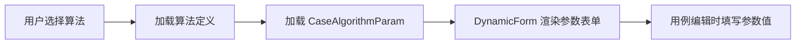
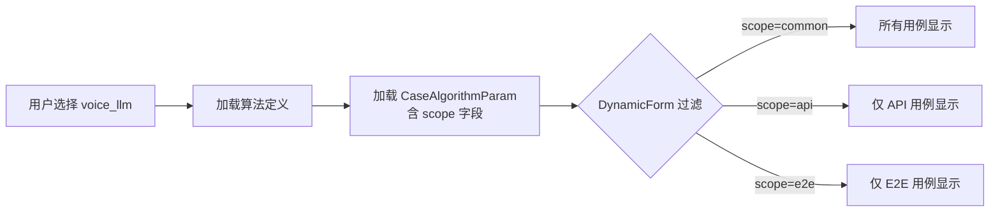

# 第 1 步：选算法 — 步骤总览

## 当前架构

用户在 AlgorithmSelectionPanel 中选择算法类型（如 STT、TTS、enhance 等），系统加载该算法的用例级参数供后续用例编辑使用。

### 当前数据流



### 当前关键组件

| 组件/模块 | 职责 |
|-----------|------|
| `AlgorithmConfigPage.vue` | 管理算法定义的增删改查（注册新算法、配置参数、配置映射） |
| `AlgorithmSelectionPanel.vue` | 用户在测试流程中选择算法类型 |
| `DynamicForm.vue` | 根据 CaseAlgorithmParam 动态渲染参数表单 |
| `CaseAlgorithmParam` 表 | 存储每个算法的用例级参数定义 |
| `FieldMapper` | 定义算法的设备字段、API字段、评估字段 |

### 当前参数模型

```python
# CaseAlgorithmParam 现有字段
class CaseAlgorithmParam:
    algorithm_type = Column(String)     # 算法类型
    param_code = Column(String)         # 参数编码
    param_name = Column(String)         # 参数名称
    param_type = Column(String)         # 参数类型
    required = Column(Boolean)          # 是否必填
    default_value = Column(String)      # 默认值
    options_source = Column(String)     # 选项来源
    # ... 其他字段
    # 无 scope 字段 — 所有参数对所有用例可见
```

---

## 改造后架构

voice_llm 作为新算法注册，参数新增 `scope` 字段控制适用范围（common/api/e2e），DynamicForm 根据 scope 和当前 test_type 过滤显示。

### 改造后数据流



### 改造要点

#### 1. 后端：scope 字段

```python
# CaseAlgorithmParam 新增字段
scope = Column(String(10), nullable=False, default='common')
# 取值：'common'（通用）、'api'（仅API用例）、'e2e'（仅E2E用例）
```

#### 2. 后端：voice_llm 种子数据

注册 9 个参数，按 scope 分布：

| scope | 参数示例 | 说明 |
|-------|---------|------|
| common | `overlap_rate`, `source_language` | API 和 E2E 用例都需要 |
| api | `inputText`, `inputAudio` | 仅 API 输入 |
| e2e | `railDistance`, `volumeLevel`, `interruptionEnabled` | 仅 E2E 物理环境 |

> **algorithmParams 格式**：用户填写的参数值以 `[{field_code, field_value}]` 数组格式存储在 `round.algorithmParams` 中，而非扁平字典。例如 `[{field_code: 'railDistance', field_value: 50}, {field_code: 'volumeLevel', field_value: 80}]`。

> **backgroundNoise 在 round 级别**：`backgroundNoise` 不属于 `algorithmParams`，而是直接存储在 round 配置中（带 `loop` 属性），由 `round_config.get('backgroundNoise')` 读取。

> **API 单记录 / E2E 双记录**：API 测试用例为单记录结构，E2E 测试用例为双记录结构（包含主记录和参考记录），两者在提交和返回的数据结构上有差异。

#### 3. 后端：FieldMapper 新增 voice_llm 字段

```python
# field_mapper.py 新增 voice_llm 分支
def get_reference_field_codes(self, algorithm_type):
    if algorithm_type == 'voice_llm':
        return ['reference_text', 'llm_response', 'session_rounds', 'total_latency']
```

#### 4. 前端：DynamicForm scope 过滤

```ts
// DynamicForm.vue 接收 scope 过滤参数
const filteredParams = computed(() =>
  allParams.filter(p =>
    p.scope === 'common' || p.scope === currentTestType.value
  )
)
```

#### 5. 前端：api.ts 扩展

```ts
// algorithmApi 新增接口支持 scope 参数
algorithmApi.getParams(algorithmType, { scope?: 'common' | 'api' | 'e2e' })
```

---

## 本步骤涉及的文档

| 服务 | 文档 | 说明 |
|------|------|------|
| 后端 | `02_CaseAlgorithmParam_scope字段` | 参数新增 scope 字段 |
| 后端 | `06_algorithm_Schema与Controller` | scope 字段 CRUD + 接口过滤 |
| 后端 | `07_voice_llm算法参数种子数据` | voice_llm 参数 INSERT 记录 |
| 后端 | `08_field_mapper_voice_llm映射` | voice_llm 字段定义 |
| 前端 | `03_api.ts算法API扩展` | algorithmApi 接口扩展 |
| 前端 | `15_DynamicForm_scope过滤` | 按 scope + test_type 过滤参数 |

---

## 不变部分

- AlgorithmSelectionPanel 的算法选择逻辑不变
- AlgorithmConfigPage 的整体页面结构不变
- DynamicForm 的表单渲染引擎不变（仅增加过滤条件）
- 其他已有算法（STT/TTS/enhance）的参数定义不变
