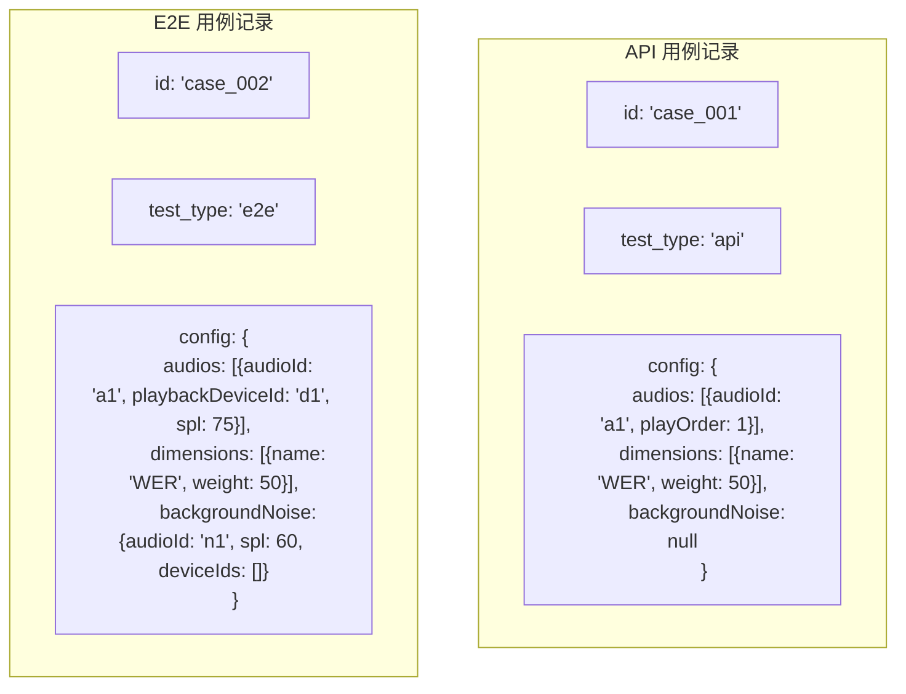
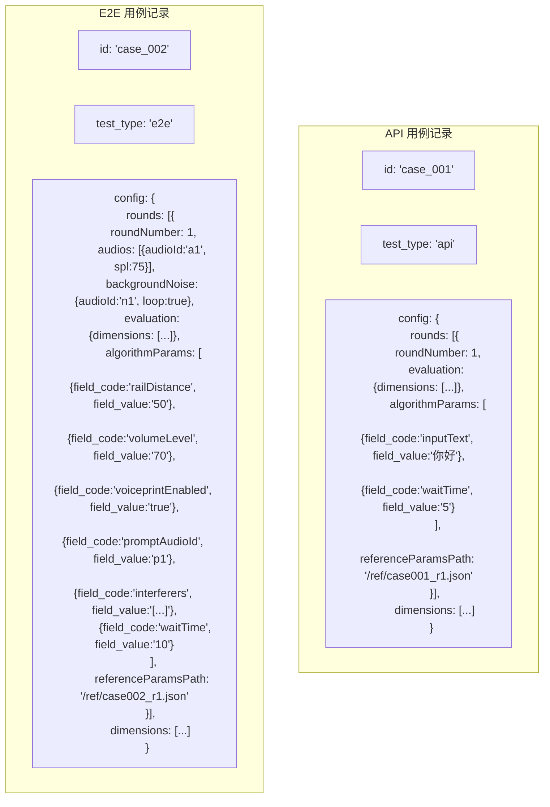

# 第 2 步：选用例 — 步骤总览

## 当前架构（已完成双记录迁移）

已采用**双记录架构**：一个逻辑用例拆分为 API 和 E2E 两条独立数据库记录。每条记录的 config 是扁平的。

### 当前数据模型



### 当前关键组件

| 组件 | 职责 | 状态 |
|------|------|------|
| `TestCaseListContainer.vue` | 用例列表展示、按 test_type 筛选 | 已完成 |
| `CaseForm.vue` | 用例编辑表单 | 部分（无 voice_llm 配置区域） |
| `useAudioConfig.ts` | 音频配置管理 | 已完成 |
| `useDimensionConfig.ts` | 评测维度管理（扁平数组） | 已完成 |
| `testCaseStore.ts` | Pinia 状态管理 | 已完成 |
| `testcase_controller.py` | 后端双记录 CRUD | 已完成 |
| `models.py` | TestCase 模型（含 test_type） | 已完成 |

---

## 已完成改造

### 后端

| 改造项 | 状态 |
|--------|------|
| TestCase 模型新增 `test_type` 字段 | 已完成 |
| DDL 迁移脚本 (`split_testcase_by_type.py`) | 已完成 |
| testcase_controller 双记录 CRUD（创建/更新/查询/删除/复制） | 已完成 |
| testcase Schema 新增 `test_type` 字段 | 已完成 |
| case_parameter_extractor 支持 `test_type` 参数 | 已完成 |
| reference_params_generator 使用 `_record_test_type` 处理双记录 | 已完成 |
| audio_controller 创建用例时使用记录级 test_type | 已完成 |
| **TestCaseUploadConfig schema + MergeChunksRequest.test_case_config** | **已完成** (2026-07-06) |
| **_build_rounds_from_files（multi_round / single_round_multi_audio 模式）** | **已完成** (2026-07-06) |
| **_create_test_case_from_audio 支持 rounds_config 参数** | **已完成** (2026-07-06) |
| **merge_chunks 两处透传 test_case_config** | **已完成** (2026-07-06) |
| **rounds 模式下同步调用 ReferenceParamsGenerator.apply_to_config** | **已完成** (2026-07-06) |
| **testcase_controller 标签视图 view=tag + _get_tag_view** | **已完成** (2026-07-06) |

### 前端

| 改造项 | 状态 |
|--------|------|
| config.dimensions 从 `{api:[], e2e:[]}` 扁平化为 `[]` | 已完成 |
| AudioConfig.testType 保留（兼容期），用例级 test_type 已生效 | 已完成 |
| backgroundNoise 统一为 `{audioId, spl, deviceIds}` 对象 | 已完成 |
| audios 统一为扁平数组（不再区分 apiAudios/dryAudios） | 已完成 |
| testCaseStore 批量操作适配扁平格式 | 已完成 |
| normalizeTestCaseConfig 简化（移除旧格式兼容层） | 已完成 |
| 报告组件移除旧格式兼容层（历史报告已删除重建） | 已完成 |
| 上传配置 apiDimensions/e2eDimensions 合并逻辑 | 已完成 |
| **testCaseStore 新增 tagViewData/fetchTagView（标签视图数据层）** | **已完成** (2026-07-06) |
| **testCaseManager 新增 viewMode 切换 + refreshCurrentView** | **已完成** (2026-07-06) |
| **TestCaseListContainer 视图切换器 + 标签视图展示** | **已完成** (2026-07-06) |
| **DetailViewModal 标注任意字段动态列 + data 顶层字段编辑** | **已完成** (2026-07-06) |
| **folderParser.ts 文件夹解析工具（extractAudioFiles/buildRoundsConfig/buildTestCaseConfig）** | **已完成** (2026-07-06) |
| **audioImport.ts 集成 folderParser，构建 testCaseConfig 并传入 mergeChunks** | **已完成** (2026-07-06) |

---

## 待实现：用例结构化配置（轮次为顶层）

用例配置采用**轮次为顶层**架构：`config` 为 `{ rounds, dimensions }`，每一轮是完全自包含的配置单元。round 顶层放结构性字段，算法参数统一在 `algorithmParams` 中（`[{field_code, field_value}]` 格式，由 `case_algorithm_params` 表驱动）。

同时废弃 `reference_params`、`algorithm_params` 数据库列。

### 核心设计原则

- **轮次为顶层单元**：每一轮包含该轮所需的全部配置
- **每轮完全自包含**：不同轮次可以有不同的导轨距离、音量、声纹、Prompt、干扰人等
- **复制机制**：添加新轮次时，允许复制一整轮信息，或用户勾选需要复制的部分到下一轮
- **config 结构**：`{ rounds, dimensions }` — rounds 为核心数据，dimensions 为整体评估维度
- **废弃独立列**：`reference_params`、`algorithm_params` 数据库列废弃
- **referenceParams 存文件、config 存路径**：上传音频时自动生成参考文本文件，用户可在前端编辑，`rounds[].referenceParamsPath` 存文件路径，保持 config JSON 轻量
- **JSON 字段（非关联表）**：rounds 存储在 `config` JSON 列中，始终整体读写
- **API/E2E 共用结构**：同一个 `rounds[]` 结构，不同字段按 test_type 选择性渲染
- **编辑器显示条件仅看 test_type**（api/e2e），不看 algorithmType
- **结构性字段 vs 表驱动参数分离**：
  - 结构性字段（round 顶层，Schema 固定）：`roundNumber`、`audios`、`backgroundNoise`、`evaluation`、`referenceParamsPath`
  - 表驱动参数（`round.algorithmParams`）：由 `case_algorithm_params` 表定义，`[{field_code, field_value}]` 格式，新增参数只需 INSERT 不改代码
- **无 SessionConfigEditor**：会话参数不在原始需求中
- **无 waitTime 在轮次顶层**：waitTime 移入 algorithmParams，E2E 等待设备响应完成由引擎自动判定，API 由 session_timeout 控制

### config 整体结构

```json
{
  "rounds": [
    {
      "roundNumber": 1,
      "audios": [{ "audio_id": "a1", "playbackDeviceId": "d1", "spl": 75, "playOrder": 1 }],
      "backgroundNoise": { "audioId": "n1", "spl": 60, "deviceIds": [], "loop": true },
      "evaluation": { "enabled": true, "dimensions": [{ "dimension_id": 1, "dimension_name": "WER", "params": {} }] },
      "algorithmParams": [
        { "field_code": "interferers", "field_value": "[{\"id\":\"int1\",\"audioId\":\"intf1\",\"spl\":60}]" },
        { "field_code": "railDistance", "field_value": "50" },
        { "field_code": "volumeLevel", "field_value": "70" },
        { "field_code": "voiceprintEnabled", "field_value": "true" },
        { "field_code": "promptAudioId", "field_value": "prompt_001" }
      ],
      "referenceParamsPath": "/data/ref/case_001_round_1.json"
    }
  ],
  "dimensions": [
    { "dimension_id": 1, "dimension_name": "WER", "params": { "case_sensitive": false } }
  ]
}
```

> **分层规则**：round 顶层放结构性字段（Schema 固定，不随算法变化），`algorithmParams` 放表驱动参数（由 `case_algorithm_params` 表定义，新增参数只需 INSERT）。`backgroundNoise` 是 E2E 基础环境配置，放在 round 顶层。

### referenceParams 存储策略

| 项目 | 说明 |
|------|------|
| 生成时机 | 用户上传音频并关联到轮次时，`ReferenceParamsGenerator` 自动从 `AudioAnnotation` 生成参考文本，写入文件 |
| 存储位置 | 文件系统（如 `/data/ref/{case_id}_round_{n}.json`） |
| config 中 | `rounds[].referenceParamsPath` — 只存文件路径（字符串） |
| 用户可编辑 | 前端提供查看/编辑界面：读取文件内容 → 用户修改 → 保存回文件 |
| 读取时机 | 执行测试时，按路径读取文件 |
| 体积 | config 始终 KB 级；referenceParams 文件可达 MB 级但不影响 config |

### referenceParams 生命周期

```
上传音频 → 音频标注(AudioAnnotation) → ReferenceParamsGenerator 自动生成文件
→ 文件路径写入 rounds[].referenceParamsPath
→ 用户在前端可查看/编辑文件内容
→ 执行测试时按路径读取
```

### 用例编辑窗（CaseForm）结构

| 区域 | 说明 | 适用 |
|------|------|------|
| 基本信息 | 名称、描述、分组、标签、算法选择 | 通用 |
| 算法参数 | DynamicForm — 用例级算法标量参数（scope 过滤） | 通用 |
| **轮次编辑器** | `config.rounds[]` — 核心编辑区域 | 通用 |
| ↳ 每轮包含 | 音频配置、噪声、评估、参考字段(路径)、算法参数（含inputText/inputAudio/waitTime/railDistance/volumeLevel/voiceprintEnabled/promptAudioId/interferers等） | — |
| 轮次操作 | 添加轮次（含复制选项）、删除轮次、拖拽排序 | — |

### 轮次内配置区域（RoundConfigItem 内部结构）

| 区域 | 字段 | API | E2E | 说明 |
|------|------|-----|-----|------|
| 音频配置 | audios[] | 简化 | 完整 | API 仅 audioId+playOrder，E2E 含设备+SPL |
| 背景噪声 | backgroundNoise | — | 是 | 噪声音频+设备+SPL+loop（轮次顶层） |
| 评估维度 | evaluation | 是 | 是 | 本轮独立评估维度 |
| 参考字段 | referenceParamsPath | 是 | 是 | 自动生成文件路径，用户可编辑 |
| 算法参数 | algorithmParams[{field_code,field_value}] | 是 | 是 | 含inputText/inputAudio/waitTime/railDistance/volumeLevel/voiceprintEnabled/promptAudioId/interferers等 |

### 废弃字段说明

| 废弃项 | 原位置 | 新位置 | 说明 |
|--------|--------|--------|------|
| `config.audios` | config 顶层 | `rounds[].audios` | 音频下沉到每轮 |
| `config.dimensions` | config 顶层 | `rounds[].evaluation.dimensions` | 维度下沉到每轮 |
| `config.backgroundNoise` | config 顶层 | `rounds[].backgroundNoise` | 噪声下沉到每轮 |
| `config.voiceprintRegistration` | config 顶层 | `rounds[].algorithmParams` | 声纹移入算法参数 |
| `config.interferers` | config 顶层 | `rounds[].algorithmParams` | 干扰人移入算法参数 |
| `config.railDistance` | config 顶层 | `rounds[].algorithmParams` | 导轨移入算法参数 |
| `config.volumeLevel` | config 顶层 | `rounds[].algorithmParams` | 音量移入算法参数 |
| `config.promptAudioId` | config 顶层 | `rounds[].algorithmParams` | Prompt 移入算法参数 |
| `config.interruption` | config 顶层 | `rounds[].algorithmParams` | 打断移入算法参数 |
| `config.roundEvaluation` | config 顶层 | `rounds[].evaluation` | 评估下沉到每轮 |
| `reference_params` | TestCase 独立列 | 文件 + `rounds[].referenceParamsPath` | 废弃独立列 |
| `algorithm_params` | TestCase 独立列 | `rounds[].algorithmParams` | 废弃独立列 |

### E2E 每轮执行步骤

| # | 步骤 | 配置来源 | 是否必须 | 说明 |
|---|------|---------|---------|------|
| 1 | 参数验证 + 加载数据 | — | 必须 | 已有 |
| 2 | **for 轮次 in rounds** | `config.rounds[]` | 必须 | 遍历每轮 |
| 2a | **导轨初始化** | `round.algorithmParams[railDistance]` | 可选 | 有值时 `driver.move_rail()` |
| 2b | **设置设备音量** | `round.algorithmParams[volumeLevel]` | 可选 | 有值时 `driver.set_volume()` |
| 2c | **声纹注册** | `round.algorithmParams[voiceprintEnabled]` | 可选 | enabled 时播放注册音频+等待 |
| 2d | **Prompt 播放** | `round.algorithmParams[promptAudioId]` | 可选 | 有值时播放前置音频 |
| 2e | 预处理（pre_process） | — | 必须 | 已有 |
| 2f | 播放干声+噪声+干扰人 | `round.audios/noise/algorithmParams[interferers]` | 必须 | play_overlap 统一混音 |
| 2g | 等待响应 | `round.algorithmParams[waitTime]` | 必须 | 已有 |
| 2h | 收集本轮结果 | — | 必须 | 已有 |
| 2i | **单轮评估** | `round.evaluation` + 读取 `referenceParamsPath` | 可选 | enabled 时独立评估 |
| 2j | **恢复音量/导轨** | — | 可选 | 本轮设了才恢复 |
| 3 | 后处理 + 采集结果 | — | 必须 | 已有 |
| 4 | 结果存储 + 整体评估 | — | 必须 | 已有 |

### 目标数据模型



### 待实现清单

#### 后端（5项）

| # | 改造项 | 文档 |
|---|--------|------|
| 1 | Config JSON 重构为 `{ rounds[] }` — 所有字段下沉到轮次 | `03_Config_JSON扁平化设计.md` |
| 2 | Schema 重构 RoundConfigItem（完整子结构）+ 废弃 reference_params/algorithm_params/dimensions | `04_testcase_Schema新类型.md` |
| 3 | case_parameter_extractor 适配（从 rounds[] 提取参数） | `09_case_parameter_extractor适配.md` |
| 4 | reference_params_generator 适配（上传时按轮生成文件，config 存路径，用户可编辑） | `10_reference_params_generator适配.md` |
| 5 | 数据迁移：旧 config 转换为 rounds[] 格式 | `35_数据迁移方案.md` |

#### 前端（8项）

| # | 改造项 | 文档 |
|---|--------|------|
| 1 | types.ts 重构 RoundConfigItem + config 只剩 rounds | `01_types.ts新接口定义.md` |
| 2 | businessTypes.ts 适配新接口 | `02_businessTypes适配.md` |
| 3 | CaseForm 重构为轮次为核心的编辑窗 | `06_CaseForm_test_type驱动.md` |
| 4 | RoundConfigEditor 重构（每轮完整配置+复制机制） | `10_RoundConfigEditor.md` |
| 5 | VoiceprintConfigEditor 作为轮次子组件 | `12_VoiceprintConfigEditor.md` |
| 6 | InterfererConfigEditor 作为轮次子组件 | `13_InterfererConfigEditor.md` |
| 7 | RoundEvaluationEditor 作为轮次子组件 | `14_RoundEvaluationEditor.md` |
| 8 | UploadOptions 双记录自动生成 | `23_UploadOptions_test_type.md` |

### 编辑器组件（4个通用编辑器 → 轮次子组件）

| 组件 | 用途 | 显示条件 | 位置变化 |
|------|------|---------|---------|
| `RoundConfigEditor` | 轮次管理主编辑器（添加/删除/排序/复制轮次） | 通用 | CaseForm 主区域 |
| `VoiceprintConfigEditor` | 声纹注册配置 | 每轮内，E2E 用例 | 从 config 顶层移入 rounds[].algorithmParams |
| `InterfererConfigEditor` | 干扰人配置 | 每轮内，E2E 用例 | 从 config 顶层移入 rounds[].algorithmParams |
| `RoundEvaluationEditor` | 单轮评估维度配置 | 每轮内 | 从 config 顶层移入 rounds[] |

> **注意**：SessionConfigEditor 已移除。session_timeout、context_mode 不在原始需求中。llm_judge_model 属于评估微服务配置，不在用例中配置。

### config 字段对照表

| 字段 | 旧位置 | 新位置 | API | E2E | 说明 |
|------|--------|--------|-----|-----|------|
| audios | config.audios[] | rounds[].audios[] | 简化 | 完整 | 下沉到每轮 |
| dimensions | config 顶层 | **废弃** → rounds[].evaluation.dimensions | — | — | 每轮自带评估维度 |
| backgroundNoise | config 顶层 | rounds[].backgroundNoise | — | 是 | 下沉到每轮（轮次顶层） |
| rounds | config.rounds[]（简单） | config.rounds[]（完整） | 是 | 是 | 大幅扩展 |
| voiceprintRegistration | config 顶层 | rounds[].algorithmParams | — | 是 | 移入算法参数 |
| interferers | config 顶层 | rounds[].algorithmParams | — | 是 | 移入算法参数 |
| roundEvaluation | config 顶层 | rounds[].evaluation | 是 | 是 | 下沉到每轮 |
| railDistance | config 顶层 | rounds[].algorithmParams | — | 是 | 移入算法参数 |
| volumeLevel | config 顶层 | rounds[].algorithmParams | — | 是 | 移入算法参数 |
| promptAudioId | config 顶层 | rounds[].algorithmParams | — | 是 | 移入算法参数 |
| interruption | config 顶层 | rounds[].algorithmParams | — | 是 | 移入算法参数 |
| reference_params | TestCase 列 | 文件 + rounds[].referenceParamsPath | 是 | 是 | 存文件，config 存路径 |
| algorithm_params | TestCase 列 | rounds[].algorithmParams | 是 | 是 | 废弃独立列 |

---

## 本步骤涉及的文档

| 服务 | 文档数 | 已完成 | 待实现 |
|------|--------|--------|--------|
| 后端 | 5个 | 01_TestCase模型、05_controller双记录CRUD | 03_Config扁平化、04_Schema新类型、09_参数提取、10_参考参数 |
| 前端 | 14个 | 04_列表、05_创建、07_Store、08_音频配置、09_维度配置 | 01_types、02_businessTypes、06_CaseForm、10~14_四个编辑器、23_上传、24_算法页、25_评估页 |

---

## 不变部分

- 分组管理（TestCaseGroup）不变
- 标签管理（batchAddTags/batchRemoveTags）不变
- 拖拽排序音频列表不变
- 导入/导出功能不变
- AddTestCaseModal 的基本选取逻辑不变
