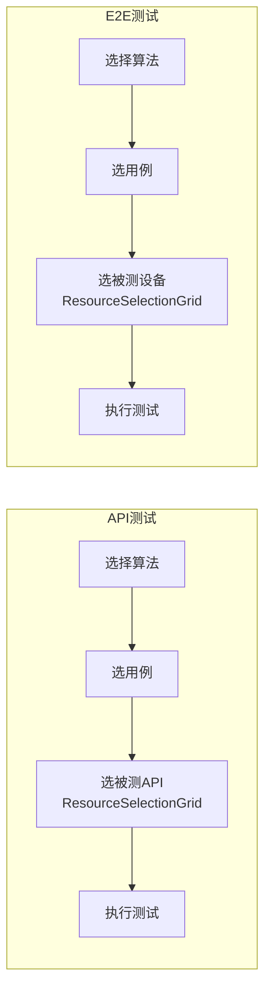
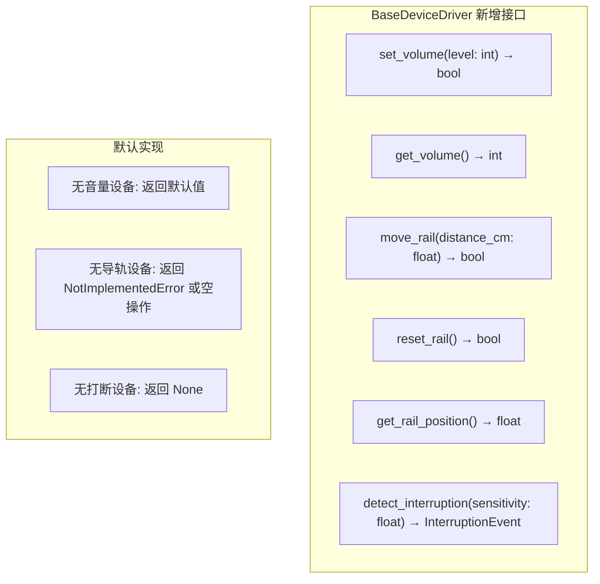

# 第 3 步：选设备/API — 步骤总览

## 当前架构

API 测试在 ResourceSelectionGrid 中选择被测 API 端点；E2E 测试选择被测物理设备。设备驱动（BaseDeviceDriver）提供扫描、初始化、解锁、获取结果等基础接口。

### 当前数据流



### 当前设备驱动接口

```python
class BaseDeviceDriver:
    def scan(self): ...                              # 扫描设备
    def initialize(self, device_sn, ...): ...        # 初始化
    def unlock(self, device_sn): ...                 # 解锁
    def get_results(self, device_sn, ...): ...       # 获取结果
    def pre_process(self, device_sn, ...): ...       # 预处理
    def post_process(self, device_sn, ...): ...      # 后处理
    def is_locked(self, device_sn): ...              # 检查锁屏
    # 无音量控制、导轨控制、打断检测接口
```

### 当前前端页面

| 页面 | 文件 | 职责 |
|------|------|------|
| APITest.vue | `views/APITest.vue` | 5步向导：选算法→选用例→选API→执行→结果 |
| E2ETest.vue | `views/E2ETest.vue` | 5步向导：选算法→选用例→选设备→执行→结果 |
| apiTest.ts | `views/APITestLogic/apiTest.ts` | API 测试主逻辑 |
| useE2eView.ts | `composables/useE2eView.ts` | E2E 测试主逻辑（703行） |

---

## 改造后架构

voice_llm 的 E2E 测试需要设备支持三项新能力：**音量控制**、**导轨控制**、**打断检测**。这些能力集成到 BaseDeviceDriver 框架中，不创建独立控制器。

> **参数来源**：音量（`volumeLevel`）、导轨距离（`railDistance`）、打断开关（`interruptionEnabled`）、干扰人（`interferers`）、声纹注册（`voiceprintEnabled`）等参数均从 `round.algorithmParams` 读取（`[{field_code, field_value}]` 格式），不再从 config 顶层或 round 顶层直接读取。

### 改造后设备驱动接口



### 改造要点

#### 1. 被测设备音量控制

```python
# base_driver.py 新增
def set_volume(self, level: int) -> bool:
    """设置被测设备系统音量（0-100）"""
    return True  # 默认空操作

def get_volume(self) -> int:
    """获取当前音量"""
    return -1  # -1 表示不支持
```

**各驱动实现**：
- HarmonyOS：通过 HDC 命令 `hdc shell audioctl -s {level}`
- Android：通过 ADB 命令 `adb shell media volume --set {level}`
- 不支持的驱动：返回默认值

**与 SPL 校准的区别**：
| 属性 | SPL 校准 | 设备音量控制 |
|------|---------|-------------|
| 控制对象 | 播放设备（音箱） | 被测设备（手机/平板） |
| 控制方式 | 声压计+功放调节 | ADB/HDC 系统命令 |
| 用途 | 控制测试环境声压级 | 控制被测设备接收音量 |

#### 2. 导轨控制集成

```python
# base_driver.py 新增
def move_rail(self, distance_cm: float) -> bool:
    """移动导轨到指定距离"""
    raise NotImplementedError("此设备不支持导轨控制")

def reset_rail(self) -> bool:
    """导轨复位到初始位置"""
    raise NotImplementedError("此设备不支持导轨控制")

def get_rail_position(self) -> float:
    """获取当前导轨位置（cm）"""
    return 0.0
```

**设计原则**：
- 导轨控制集成到 device_driver 框架，不单独创建 RailController
- 无导轨的设备类型使用默认实现（NotImplementedError 或空操作）
- 有导轨的驱动类覆盖实现
- E2E 执行器在 try/finally 中确保 reset_rail 安全复位

#### 3. 打断检测接口

```python
# base_driver.py 新增
def detect_interruption(self, sensitivity: float = 0.5) -> Optional[dict]:
    """检测全双工打断事件
    
    Returns:
        None: 不支持打断检测
        {'timestamp': float, 'duration': float, 'intensity': float}: 打断事件
    """
    return None  # 默认不支持
```

#### 4. 前端页面适配

**APITest.vue**：
- 用例筛选支持 `test_type='api'`
- voice_llm 算法自动发现
- 5 步向导流程不变

**E2ETest.vue**：
- 用例筛选支持 `test_type='e2e'`
- 设备选择适配（检查设备是否支持 voice_llm 所需能力）
- 显示设备能力标签（音量控制/导轨/打断检测）

---

## 本步骤涉及的文档

| 服务 | 文档 | 说明 |
|------|------|------|
| 后端 | `18_被测设备音量控制` | base_driver 新增 set_volume/get_volume |
| 后端 | `29_设备驱动导轨控制集成` | base_driver 新增 move_rail/reset_rail |
| 后端 | `33_device_driver打断检测接口` | base_driver 新增 detect_interruption |
| 前端 | `16_APITest页面适配` | APITest.vue 用例筛选 |
| 前端 | `17_E2ETest页面适配` | E2ETest.vue 设备选择适配 |

---

## 不变部分

- APITest.vue / E2ETest.vue 的 5 步向导结构不变
- ResourceSelectionGrid 组件不变
- API 端点的选择逻辑不变（按 algorithmType 过滤）
- 设备的扫描、初始化、解锁等基础接口不变
- useDeviceManagement composable 不变
