# 第 4 步：执行测试 — 步骤总览

## 当前架构

测试执行是平台的核心流程：创建任务 → 启动 → 执行器运行 → 实时进度推送 → 评估 → 结果存储。

### 当前执行流程

```mermaid
graph TD
    subgraph API测试执行
        A1[创建任务] --> A2[APIExecutor.execute_api_case]
        A2 --> A3[遍历API]
        A3 --> A4[上传音频到 api_adapter]
        A4 --> A5[轮询等待结果]
        A5 --> A6[存储 TestResult]
        A6 --> A7[评估入队]
    end

    subgraph E2E测试执行
        B1[创建任务] --> B2[E2EExecutor.execute_e2e_case]
        B2 --> B3["_prepare_rounds 设备准备<br/>(并行 initialize + pre_process<br/>预创建 TestResult)"]
        B3 --> B4[启动全局背景噪声<br/>case_config.background_noise]
        B4 --> B5["_run_rounds_loop 多轮循环<br/>每轮: 环境设备setup → 声纹注册<br/>→ play_round → collect_results<br/>→ 单轮评估入队 → 环境恢复"]
        B5 --> B6["_finalize_rounds 收尾<br/>get_final_results → build_algorithm_result<br/>→ 整体评估 → process_results"]
        B6 --> B7[停止全局背景噪声]
        B7 --> B8[teardown_devices]
    end

    subgraph 评估
        C1[EvaluationService<br/>EndpointWorker 多端点] --> C2[异步任务提交 eval_server<br/>create_task → 轮询]
        C2 --> C3["WER/SER/CPWER/DER/<br/>LLM Judge/turn_taking/env_judge"]
        C3 --> C4[回写 TestResultDimension]
        C4 --> C5["RoundAggregator 多轮聚合<br/>algorithm_result.aggregated"]
    end
```



### 当前执行器特点

| 特点 | API | E2E |
|------|-----|-----|
| 执行模式 | 单轮线性（可选多轮会话） | 配置驱动多轮循环（`case_config.rounds` 非空时进入） |
| 组件委托 | 单类实现 | E2EExecutor 委托 E2EDeviceManager（设备）/ E2ECollector（采集）/ E2EAggregator（聚合）+ PlaybackOrchestrator（播放） |
| 并发控制 | Semaphore 限制 | 设备操作并行（device_control_pool） |
| 超时策略 | `audio_duration × 1.5` | 干声播放时长驱动，等待播放完成 |
| 结果结构 | 单条 algorithm_result | `rounds[]` + `aggregated`，raw_results 持久化到 result_data_path |
| 评估 | 整体评估 | 每轮评估（round_number=N）+ 整体评估（round_number=None）+ 聚合 |

### 当前三服务协作

```
主后端 → api_adapter_service → 被测 API 厂商
主后端 → eval_server → WER/SER/DER/LLM Judge 等计算
```

---

## 改造后架构

voice_llm 改造引入了**多轮循环**能力。核心设计原则是**配置驱动**：环境设备（导轨）、声纹注册、全局背景噪声、干扰人、多轮循环、单轮评估等都是**通用能力**，由用例配置（`case_config`）决定是否执行，不绑定特定算法类型。设备音量控制由**设备驱动**（BaseDeviceDriver.pre_process）自行管理，不再由执行器编排。

### 改造后执行流程

```mermaid
graph TD
    subgraph API多轮会话
        A1[创建任务] --> A2{case_config.rounds?}
        A2 -->|有| A3[创建 SessionContext]
        A2 -->|无| A_OLD[现有单次API流程]
        A3 --> A4["for 轮次 in rounds:"]
        A4 --> A5[构建轮次请求]
        A5 --> A6[发送到 api_adapter]
        A6 --> A7[等待响应]
        A7 --> A8[更新上下文]
        A8 --> A9{evaluationEnabled?}
        A9 -->|是| A10[单轮评估入队]
        A9 -->|否| A4
        A10 --> A4
        A4 --> A11[汇总结果]
        A11 --> A12[销毁 Session]
        A12 --> A13[存储 algorithm_result]
    end

    subgraph E2E多轮循环-配置驱动
        B1[创建任务] --> B2["_prepare_rounds<br/>设备并行初始化<br/>预创建 TestResult"]
        B2 --> B3{"case_config<br/>background_noise?"}
        B3 -->|有| B3A[启动全局背景噪声<br/>跨轮次持续播放]
        B3 -->|无| B4
        B3A --> B4{case_config.rounds?}
        B4 -->|有| B5["for 轮次 in rounds:<br/>_execute_single_round"]
        B4 -->|无| B_OLD[现有单次E2E流程]
        B5 --> B6["环境设备 setup<br/>(round.algorithmParams.rail_distance)"]
        B6 --> B7["声纹注册(每轮)<br/>play_voiceprint"]
        B7 --> B8["播放音频<br/>(干声+噪声+干扰人统一 audio_to_play<br/>走 play_overlap 混音)"]
        B8 --> B9[等待干声播放完成]
        B9 --> B10[收集毫秒播放时间戳<br/>+ collect_results 偏移校正]
        B10 --> B11{round.evaluation.enabled?}
        B11 -->|是| B11A[单轮评估入队<br/>round_number=N]
        B11 -->|否| B12
        B11A --> B12[环境设备恢复 teardown]
        B12 --> B5
        B5 --> B13["_finalize_rounds<br/>get_final_results(可覆写)<br/>→ build_algorithm_result<br/>→ 写 result_data_path"]
        B13 --> B14{顶层 dimensions?}
        B14 -->|有| B14A[整体评估入队<br/>round_number=None]
        B14 -->|无| B15
        B14A --> B15[停止全局背景噪声]
        B15 --> B16[teardown_devices<br/>驱动并行收尾]
    end
```



### 改造要点

#### 1. API 多轮会话（5个文档）

> 配置驱动：`case_config.rounds` 非空时进入多轮循环

| 模块 | 说明 |
|------|------|
| `api_executor` 多轮分支 | `case_config.rounds` 非空 → 多轮循环 |
| `SessionContext` | 维护 session_id、上下文历史、轮次结果 |
| 轮次请求构建 | `_send_round_request()` 构建 `{session_id, round, input, context}` |
| 轮次超时策略 | `session_timeout` 替代 `audio_duration × 1.5` |
| 结果存储 | `algorithm_result = {rounds: [...], session_id, total_latency}` |

#### 2. E2E 多轮循环（6个文档）

> **核心原则：配置驱动，非算法绑定。** 环境设备、声纹注册、全局背景噪声、干扰人、多轮循环、单轮评估均为**通用能力**，由用例配置中的对应字段触发执行。

| 模块 | 触发条件 | 说明 |
|------|---------|------|
| 执行器委托 | 始终 | E2EExecutor → E2EDeviceManager / E2ECollector / E2EAggregator |
| 环境设备（导轨） | `round.algorithmParams.rail_distance` 非空 | E2EDeviceManager.setup_env_devices_for_round → rail 设备 setup({'distance_cm'}) → 每轮结束 teardown 恢复 |
| 全局背景噪声 | `case_config.background_noise` | 阶段1.5 启动、阶段3.5 停止；player_type `global_noise_*`，跨轮次持续；轮次级背景噪声自动跳过 |
| 声纹注册 | `round.algorithmParams.voiceprint` 对象（兼容旧格式5字段） | **每轮执行**；playback_orchestrator.play_voiceprint 播放 |
| 多轮循环 | `config.rounds` 非空 | 六阶段：prepare → 全局噪声 → rounds loop → finalize → 停噪声 → teardown |
| 干扰人播放 | `round.algorithmParams.interferers` 非空 | 统一 `audio_to_play` 模型走 play_overlap；同设备冲突的干扰人自动跳过 |
| 每轮结果收集 | 多轮循环中自动触发 | E2ECollector.collect_results：播放偏移计算 + extra_params 注入 |
| 单轮评估 | `round.evaluation.enabled` | `evaluate_case(round_number=N)`，维度取 `rounds[N].evaluation.dimensions` |
| 整体评估 | 顶层 `config.dimensions` 非空 | `evaluate_case(round_number=None)` |
| 结果存储 | `_finalize_rounds` | `build_algorithm_result` → `write_result_data_file` 持久化 raw_results → result_data_path |

> **统一音频模型**：干声、噪声、干扰人统一为 `audio_to_play` 格式走 playback_orchestrator 的 `play_overlap` 代码路径。噪声 `loop` 行为由用例配置控制，不再引擎硬编码。
>
> **音量控制**：已下沉至设备驱动（BaseDeviceDriver.set_volume/pre_process），执行器不再编排音量设置与复位。

#### 3. 评估扩展（主后端 5 个 + eval_server 6 个）

**主后端**：
| 模块 | 说明 |
|------|------|
| `evaluation_service` 多端点架构 | EndpointWorker 按 endpoint_url 分组消费队列，状态机 queued→running→calculating |
| 单轮评估 | `evaluate_case(round_number=...)` 支持单轮/整体，rounds_list 统一构建 |
| `evaluation_api_client` 适配 | 全异步任务流程（create_task → wait_for_task_completion），支持文件上传与端点 fallback |
| 多轮聚合 | `RoundAggregator.aggregate_round_results` 按维度分组取算术平均，写 `algorithm_result.aggregated` + round_number=NULL 整体维度记录 |
| `base_executor` 评估入队 | `_evaluate_result(round_number=...)` |

**eval_server**：
| 模块 | 说明 |
|------|------|
| create_task 新类型 | 支持 llm_judge |
| LLM Judge 计算器 | llm_judge/calculator（strategy 模式），保留每轮结构不折叠 |
| ConcurrencyManager | _stats 动态初始化 |
| 多轮 WER 聚合 | `_prepare_params` 将 rounds 同名字段按 `\n` 折叠成单文本计算 |
| remote_service 适配 | 新类型端点匹配 |
| health 动态类型 | 健康检查动态返回 |

#### 4. api_adapter_service 扩展（6个文档）

| 模块 | 说明 |
|------|------|
| HTTP 适配器 | 新增 http_adapter.py（REST 协议） |
| 会话状态管理 | session_id + context_history 存储 |
| create_task 对话模式 | 文本/音频双通道输入 |
| task_manager 轮次结果 | 帧结果 → 轮次结果重构 |
| mock_adapter | mock 多轮对话响应 |
| application.yml | voice_llm vendor 配置 |

#### 5. 基础设施（4个文档）

| 模块 | 说明 |
|------|------|
| execution_engine | 任务调度支持多轮进度 |
| event_manager | WebSocket 推送"第 N/M 轮" |
| E2ECollector + device_result_collector | 每轮采集 + 播放偏移校正 + 时间对齐 |
| 前端进度组件 | TestExecutionComponent + useTaskProgress 适配多轮 |

---

## 本步骤涉及的文档

| 服务 | 文档数 | 说明 |
|------|--------|------|
| 后端 | 19个 | API 执行器、E2E 执行器、评估服务、基础设施 |
| eval_server | 7个 | 评估微服务扩展 |
| api_adapter | 6个 | API 适配微服务扩展 |
| 前端 | 2个 | 执行进度显示适配 |
| **合计** | **34个** | 改造量最大的步骤 |

---

## 不变部分

- 任务创建 API（tasksApi.create）不变
- 任务启动/停止/暂停控制不变
- 任务调度框架（ExecutionEngine 的核心调度逻辑）不变
- 进度推送的基础设施（WebSocket/SSE）不变
- 未配置 `rounds`/声纹/环境设备/全局噪声等选项的用例执行流程不变
