# 第 4 步：执行测试 — 步骤总览

## 当前架构

测试执行是平台的核心流程：创建任务 → 启动 → 执行器运行 → 实时进度推送 → 评估 → 结果存储。

### 当前执行流程

```mermaid
graph TD
    subgraph API测试执行
        A1[创建任务] --> A2[APIExecutor.execute_api_case]
        A2 --> A3[遍历API]
        A3 --> A4[上传音频到 api_adapter]
        A4 --> A5[轮询等待结果]
        A5 --> A6[存储 TestResult]
        A6 --> A7[评估入队]
    end

    subgraph E2E测试执行
        B1[创建任务] --> B2[E2EExecutor.execute_e2e_case]
        B2 --> B3[设备初始化]
        B3 --> B4[播放全部音频]
        B4 --> B5["sleep(3s) 等待"]
        B5 --> B6[收集结果]
        B6 --> B7[存储 TestResult]
        B7 --> B8[评估入队]
    end

    subgraph 评估
        C1[EvaluationService] --> C2[发送到 eval_server]
        C2 --> C3[WER/SER/DER 计算]
        C3 --> C4[回写 TestResultDimension]
    end
```



### 当前执行器特点

| 特点 | API | E2E |
|------|-----|-----|
| 执行模式 | 单轮线性 | 一次性播放+收集 |
| 并发控制 | Semaphore 限制 | 按设备并行 |
| 超时策略 | `audio_duration × 1.5` | 固定等待 3 秒 |
| 结果结构 | 单条 algorithm_result | 单条 algorithm_result |
| 评估 | 整体评估 | 整体评估 |

### 当前三服务协作

```
主后端 → api_adapter_service → 被测 API 厂商
主后端 → eval_server → WER/SER/DER 计算
```

---

## 改造后架构

voice_llm 改造引入了**多轮循环**能力。核心设计原则是**配置驱动**：声纹注册、导轨控制、音量控制、干扰人、多轮循环、单轮评估等都是**通用能力**，由用例配置（`case_config`）决定是否执行，不绑定特定算法类型。

### 改造后执行流程

```mermaid
graph TD
    subgraph API多轮会话
        A1[创建任务] --> A2{case_config.rounds?}
        A2 -->|有| A3[创建 SessionContext]
        A2 -->|无| A_OLD[现有单次API流程]
        A3 --> A4["for 轮次 in rounds:"]
        A4 --> A5[构建轮次请求]
        A5 --> A6[发送到 api_adapter]
        A6 --> A7[等待响应]
        A7 --> A8[更新上下文]
        A8 --> A9{evaluationEnabled?}
        A9 -->|是| A10[单轮评估入队]
        A9 -->|否| A4
        A10 --> A4
        A4 --> A11[汇总结果]
        A11 --> A12[销毁 Session]
        A12 --> A13[存储 algorithm_result]
    end

    subgraph E2E多轮循环-配置驱动
        B1[创建任务] --> B2{"algorithmParams<br/>railDistance?"}
        B2 -->|有| B3[导轨初始化]
        B2 -->|无| B4
        B3 --> B4{"algorithmParams<br/>volumeLevel?"}
        B4 -->|有| B4A[设置设备音量]
        B4 -->|无| B5
        B4A --> B5{"algorithmParams<br/>voiceprintEnabled?"}
        B5 -->|是| B5A[声纹注册 Step 0]
        B5 -->|否| B6
        B5A --> B6{case_config.rounds?}
        B6 -->|有| B7["for 轮次 in rounds:"]
        B6 -->|无| B_OLD[现有单次E2E流程]
        B7 --> B8["播放音频(干声+噪声+干扰人统一混音)"]
        B8 --> B9[等待响应]
        B9 --> B11[收集本轮结果]
        B11 --> B12{evaluationEnabled?}
        B12 -->|是| B12A[单轮评估入队]
        B12 -->|否| B7
        B12A --> B7
        B7 --> B13[音量复位]
        B13 --> B14[导轨复位]
        B14 --> B15[汇总结果]
    end
```



### 改造要点

#### 1. API 多轮会话（5个文档）

> 配置驱动：`case_config.rounds` 非空时进入多轮循环

| 模块 | 说明 |
|------|------|
| `api_executor` 多轮分支 | `case_config.rounds` 非空 → 多轮循环 |
| `SessionContext` | 维护 session_id、上下文历史、轮次结果 |
| 轮次请求构建 | `_send_round_request()` 构建 `{session_id, round, input, context}` |
| 轮次超时策略 | `session_timeout` 替代 `audio_duration × 1.5` |
| 结果存储 | `algorithm_result = {rounds: [...], session_id, total_latency}` |

#### 2. E2E 多轮循环（6个文档）

> **核心原则：配置驱动，非算法绑定。** 声纹注册、导轨控制、音量控制、干扰人、多轮循环、单轮评估均为**通用能力**，由用例配置中的对应字段触发执行。

| 模块 | 触发条件 | 说明 |
|------|---------|------|
| 导轨控制 | `algorithmParams.railDistance` 非空 | move_rail → 测试 → reset_rail |
| 音量控制 | `algorithmParams.volumeLevel` 非空 | set_volume → 测试 → 恢复 |
| 声纹注册 | `algorithmParams.voiceprintEnabled` | 播放注册音频 + 等待（Step 0 预设置） |
| 多轮循环 | `config.rounds` 非空 | for 轮次 → 播放/等待/收集 |
| 干扰人播放 | `algorithmParams.interferers` 非空 | 复用 play_multi 混音（与噪声/干声统一模型） |
| 每轮结果收集 | 多轮循环中自动触发 | 每轮独立采集 |
| 单轮评估 | `round.evaluation.enabled` | 每轮可选评估 |
| 结果存储 | 多轮循环完成后 | `{rounds: [...], aggregated: {avg_wer, avg_llm_judge, avg_latency}}` |

> **统一音频模型**：干扰人、噪声、干声在引擎中走完全相同的 `play_multi` 代码路径。噪声的 `loop`（循环播放）行为也由用例配置 `backgroundNoise.loop` 控制，不再引擎硬编码。

#### 3. 评估扩展（主后端 5 个 + eval_server 6 个）

**主后端**：
| 模块 | 说明 |
|------|------|
| `evaluation_service` llm_judge 分发 | 新增 llm_judge 维度路由 |
| 单轮评估 | `evaluate_case(round_number=...)` 支持单轮 |
| `evaluation_api_client` 适配 | 多轮数据结构请求体 |
| 多轮聚合 | 加权平均计算多轮结果 |
| `base_executor` 评估入队 | `_evaluate_result(round_number=...)` |

**eval_server**：
| 模块 | 说明 |
|------|------|
| create_task 新类型 | 支持 llm_judge |
| LLM Judge 计算器 | 新增 llm_judge_calculator.py |
| ConcurrencyManager | _stats 动态初始化 |
| 多轮 WER 聚合 | 每轮 WER + 全局聚合 |
| remote_service 适配 | 新类型端点匹配 |
| health 动态类型 | 健康检查动态返回 |

#### 4. api_adapter_service 扩展（6个文档）

| 模块 | 说明 |
|------|------|
| HTTP 适配器 | 新增 http_adapter.py（REST 协议） |
| 会话状态管理 | session_id + context_history 存储 |
| create_task 对话模式 | 文本/音频双通道输入 |
| task_manager 轮次结果 | 帧结果 → 轮次结果重构 |
| mock_adapter | mock 多轮对话响应 |
| application.yml | voice_llm vendor 配置 |

#### 5. 基础设施（4个文档）

| 模块 | 说明 |
|------|------|
| execution_engine | 任务调度支持多轮进度 |
| event_manager | WebSocket 推送"第 N/M 轮" |
| device_result_collector | 每轮单独采集 + 时间对齐 |
| 前端进度组件 | TestExecutionComponent + useTaskProgress 适配多轮 |

---

## 本步骤涉及的文档

| 服务 | 文档数 | 说明 |
|------|--------|------|
| 后端 | 19个 | API 执行器、E2E 执行器、评估服务、基础设施 |
| eval_server | 7个 | 评估微服务扩展 |
| api_adapter | 6个 | API 适配微服务扩展 |
| 前端 | 2个 | 执行进度显示适配 |
| **合计** | **34个** | 改造量最大的步骤 |

---

## 不变部分

- 任务创建 API（tasksApi.create）不变
- 任务启动/停止/暂停控制不变
- 任务调度框架（ExecutionEngine 的核心调度逻辑）不变
- 进度推送的基础设施（WebSocket/SSE）不变
- 未配置 `rounds`/声纹/导轨/音量等选项的用例执行流程不变
