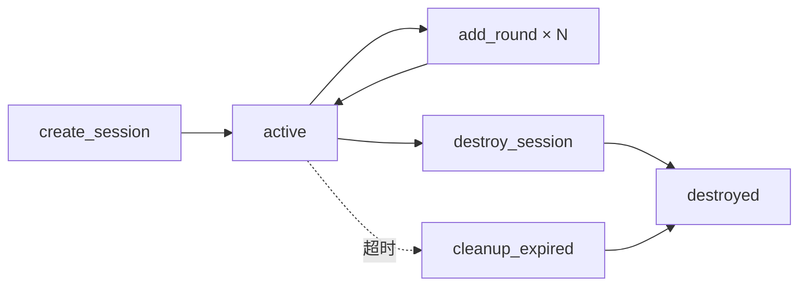

# 02 — 会话状态管理

> **所属步骤**：04_执行测试 → api_adapter  
> **改造类型**：新增  
> **涉及文件**：`api_adaper_service/services/session_store.py`（新建）

---

## 背景

voice_llm 多轮对话需要维护会话状态：`session_id`、上下文历史、轮次结果。现有 `TaskManager` 仅管理单任务的帧级结果，无会话概念。

需要新增 `SessionStore` 管理多轮对话的会话状态。

---

## 改造内容

### 1. 新文件 `session_store.py`

```python
"""Session state management for voice_llm multi-round dialog."""

import time
import threading
from typing import Optional
from utils.logger import logger


class SessionStore:
    """
    多轮对话会话状态存储。

    管理每个 session_id 的：
    - 上下文历史（对话轮次记录）
    - 轮次结果
    - 会话元数据
    """

    def __init__(self):
        self._sessions = {}
        self._lock = threading.Lock()

    def create_session(
        self,
        session_id: str,
        task_id: str,
        context_mode: str = 'full',
        max_history_rounds: int = 10,
        session_timeout: int = 60,
    ) -> dict:
        """创建新会话"""
        with self._lock:
            session = {
                'session_id': session_id,
                'task_id': task_id,
                'context_mode': context_mode,
                'max_history_rounds': max_history_rounds,
                'session_timeout': session_timeout,
                'context_history': [],
                'round_results': [],
                'created_at': time.time(),
                'last_active': time.time(),
                'status': 'active',
            }
            self._sessions[session_id] = session
            logger.info(f'Session created: {session_id} for task {task_id}')
            return session

    def get_session(self, session_id: str) -> Optional[dict]:
        """获取会话状态"""
        with self._lock:
            return self._sessions.get(session_id)

    def add_round(
        self,
        session_id: str,
        round_idx: int,
        input_text: str,
        output_text: str,
        latency: float,
    ):
        """添加一轮对话记录"""
        with self._lock:
            session = self._sessions.get(session_id)
            if not session:
                logger.warning(f'Session not found: {session_id}')
                return

            round_data = {
                'round': round_idx,
                'input': input_text,
                'output': output_text,
                'latency': latency,
                'timestamp': time.time(),
            }

            session['round_results'].append(round_data)
            session['context_history'].append({
                'role': 'user',
                'content': input_text,
            })
            session['context_history'].append({
                'role': 'assistant',
                'content': output_text,
            })
            session['last_active'] = time.time()

    def get_context(self, session_id: str) -> list:
        """
        获取当前上下文（用于传递给下一轮请求）。

        根据 context_mode 返回不同范围的上下文：
        - 'full': 完整历史
        - 'sliding_window': 最近 max_history_rounds 轮
        """
        with self._lock:
            session = self._sessions.get(session_id)
            if not session:
                return []

            history = session['context_history']
            mode = session['context_mode']
            max_rounds = session['max_history_rounds']

            if mode == 'sliding_window':
                # 每轮 = user + assistant = 2 条消息
                max_messages = max_rounds * 2
                return history[-max_messages:] if len(history) > max_messages else history
            else:
                return history

    def destroy_session(self, session_id: str):
        """销毁会话"""
        with self._lock:
            if session_id in self._sessions:
                self._sessions[session_id]['status'] = 'destroyed'
                del self._sessions[session_id]
                logger.info(f'Session destroyed: {session_id}')

    def cleanup_expired(self):
        """清理过期会话"""
        now = time.time()
        with self._lock:
            expired = [
                sid for sid, s in self._sessions.items()
                if now - s['last_active'] > s['session_timeout'] * 1.5
            ]
            for sid in expired:
                del self._sessions[sid]
                logger.info(f'Expired session cleaned: {sid}')

    def get_session_count(self) -> int:
        """获取活跃会话数"""
        return len(self._sessions)


# 单例
session_store = SessionStore()
```

### 2. 上下文模式对比

| 模式 | 说明 | 适用场景 |
|------|------|---------|
| `full` | 返回完整对话历史 | 短对话（< 10 轮） |
| `sliding_window` | 返回最近 N 轮 | 长对话，节省 token |

### 3. 生命周期



### 4. 线程安全

所有操作通过 `threading.Lock` 保护，支持多线程并发访问。会话字典的读写互斥。

---

## 不变部分

- TaskManager 不变
- 现有帧级结果管理不变

---

## 依赖关系

| 依赖文档 | 说明 |
|---------|------|
| `01_voice_llm_HTTP适配器` | 使用 get_context |
| `03_create_task对话模式` | 调用 create_session |
| `04_task_manager轮次结果` | 结果存储 |
