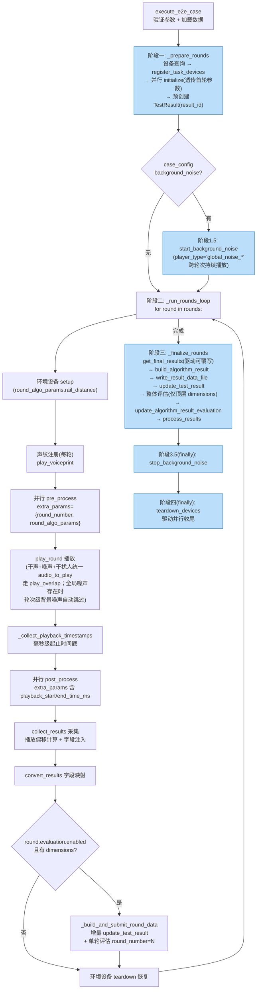

# 17_e2e_executor 多轮循环（轮次为顶层）

> 主文件：`backend/services/execution/e2e_executor.py`
> 委托组件：`e2e_device_manager.py`（设备）/ `e2e_collector.py`（采集）/ `e2e_aggregator.py`（聚合）
> 播放编排：`backend/services/audio/playback_orchestrator.py`

## 设计原则

1. **配置驱动**：根据 `case_config.rounds[]` 每轮的字段决定执行哪些能力
2. **每轮自包含**：每轮从自身 `round.algorithmParams` 读取全部配置参数（`_normalize_algorithm_params` 扁平化为 dict）
3. **执行器委托模式**：E2EExecutor 只编排流程，具体职责拆分给三个委托组件：
   - **E2EDeviceManager**：设备查询/初始化/预处理/后处理/teardown（全部经 device_control_pool 并行）、环境设备 setup/teardown、提示音播放
   - **E2ECollector**：`collect_results` 采集 + 播放偏移计算 + extra_params 注入
   - **E2EAggregator**：`build_algorithm_result` / `update_test_result` / `update_algorithm_result_evaluation` / `process_results`
4. **音量由驱动管理**：executor 不编排音量，`BaseDeviceDriver.pre_process` 设置、`post_process` 恢复
5. **环境设备统一管理**：`EnvDeviceFactory` + `BaseEnvDevice.setup()/teardown()`（已移至 E2EDeviceManager）

## 六阶段执行流程



> 蓝色框 = 循环外步骤（准备/收尾），白色框 = 循环内每轮步骤

## 代码结构

```python
class E2EExecutor(BaseExecutor):
    def __init__(self, execution_engine):
        super().__init__(execution_engine)
        self._playback_timestamps = {}
        # 委托组件
        self._device_manager = E2EDeviceManager(self)
        self._collector = E2ECollector(self)
        self._aggregator = E2EAggregator(self)

    def execute_e2e_case(self, task_id, tc_rel_id):
        data_result = self._validate_and_get_data(task_id, tc_rel_id)
        data = data_result['data']
        return self._execute_e2e_with_rounds(task_id, tc_rel_id, data)

    def _execute_e2e_with_rounds(self, task_id, tc_rel_id, data):
        # ── 阶段一：循环前准备 ──
        device_info_list, result_id = self._prepare_rounds(...)

        # ── 阶段 1.5：启动全局背景噪声（跨所有轮次持续播放） ──
        # 必须在 _prepare_rounds 之后（设备已初始化）、_run_rounds_loop 之前启动；
        # play_round 检测到全局背景噪声存在时会跳过轮次级背景噪声
        bg_started = playback_orchestrator.start_background_noise(case_config, task_id)

        # ── 阶段二：多轮循环 ──
        all_round_results, rounds_data, execution_success, last_adjusted_ref_params = \
            self._run_rounds_loop(...)

        # ── 阶段三：循环后聚合 + 评估 ──
        success = self._finalize_rounds(...)
        return success

        # finally（异常/成功都执行）:
        #   阶段 3.5: playback_orchestrator.stop_background_noise(task_id)
        #   阶段四:   self._device_manager.teardown_devices(device_info_list, ...)
```

### 阶段一：_prepare_rounds

```python
def _prepare_rounds(self, ...):
    """设备准备 + 预创建 TestResult，返回 (device_info_list, result_id)"""
    # 1. 设备准备（E2EDeviceManager）
    device_result = self._device_manager.get_device_info(task_id, case_config)
    device_info_list = device_result['data']['device_info_list']
    device_driver_factory.register_task_devices(task_id, device_info_list)

    # 2. 首轮自定义参数透传给 initialize（pcm_app、record_mode 等驱动级参数）
    first_round_params = _normalize_algorithm_params(data.get('case_algorithm_params') or {})
    for info in device_info_list:
        if info.get("driver"):
            info["driver"].set_task_id(task_id)
            info["driver"].set_test_case_id(test_case_id)
            info["driver"].set_device_id(info["device_id"])
    self._device_manager.initialize_devices(
        device_info_list, task_id, test_case_id=test_case_id,
        algorithm_type=algorithm_type, round_algo_params=first_round_params
    )

    # 3. 预创建 TestResult（执行期间增量更新）
    result_id = self._save_result(
        task_id=task_id, test_case_id=test_case_id,
        result_data={'multi_round': True, 'total_rounds': len(rounds)},
        algo_result={'test_type': 'e2e', 'algorithm_type': algorithm_type,
                     'total_rounds': len(rounds), 'rounds': [], 'aggregated': {}},
        algorithm_type=algorithm_type,
        device_id=first_device_id, api_id=None,
        execution_status='running', response_time=0, error_message=None
    )
    return device_info_list, result_id
```

### 阶段二：_execute_single_round（单轮执行）

```python
def _execute_single_round(self, ...):
    """单轮：环境设置 → 声纹注册 → 预处理 → 播放 → 后处理 → 采集 → 评估"""
    round_algo_params = _normalize_algorithm_params(round_config.get('algorithm_params', []))

    # 1. 环境设备 setup（E2EDeviceManager，setup 自动保存状态）
    env_states = self._device_manager.setup_env_devices_for_round(round_algo_params, task_id)

    # 2. 声纹注册（每轮执行）
    self._register_voiceprint(task_id, tc_rel_id, round_algo_params, test_case_id)

    # 3. 并行 pre_process（音量等由驱动自行管理）
    pre_ok = self._device_manager.pre_process_devices(
        device_info_list, task_id, test_case_id=test_case_id,
        extra_params={'round_number': round_idx, 'total_rounds': len(rounds), **round_algo_params},
    )

    # 4. 播放音频（干声+噪声+干扰人统一 audio_to_play 模型走 play_overlap）
    play_result = playback_orchestrator.play_round(
        round_config=round_config, task_id=task_id,
        case_config=case_config, test_case_id=test_case_id, round_number=round_number,
    )

    # 5. 收集播放时间戳（毫秒级起止时间）
    self._collect_playback_timestamps(task_id, play_result, case_config)

    # 6. 构建 post_process extra_params（含毫秒播放时间戳，供设备驱动使用）
    post_extra_params = {'round_number': round_idx, 'total_rounds': len(rounds), **round_algo_params}
    post_extra_params['playback_start_time_ms'] = round_start_ms      # 本轮最早播放开始
    post_extra_params['playback_end_time_ms'] = round_end_ms          # 本轮最晚播放结束
    post_extra_params['playback_timestamps_detail'] = [               # 逐音频明细
        {'audio_id', 'play_order', 'start_ms', 'end_ms'}, ...
    ]

    # 7. 并行 post_process（驱动自行恢复音量等）
    post_ok = self._device_manager.post_process_devices(..., extra_params=post_extra_params)

    # 8. 采集结果（E2ECollector：播放偏移计算 + extra_params 注入）
    round_results, adjusted_case_ref_params = self._collector.collect_results(...)
    for r in tagged_results:
        r['round_number'] = round_idx

    # 9. 字段映射：raw_results → target 字段（含 target__dim_N 维度专属 key）
    tagged_results = get_device_result_collector().convert_results(tagged_results, algorithm_type)

    # 10. 轮次内评估（构建 round_data + 增量更新 + 单轮评估入队）
    round_data = self._build_and_submit_round_data(...)

    # 11. 环境设备恢复（teardown 自动恢复到 setup 前的状态）
    self._device_manager.teardown_env_devices_for_round(env_states, task_id)
```

> 任一环节失败（pre_process/play_round/post_process 失败）都会先 teardown 环境设备再返回失败；`_run_rounds_loop` 检测到轮次失败会直接结束循环（设备状态已损坏，后续轮次无法正常执行）。

### _build_and_submit_round_data（单轮结果增量写入 + 评估入队）

```python
def _build_and_submit_round_data(self, ...):
    # 1. 按 field_mapper.get_mapped_device_output_fields 构建本轮 output
    #    （含 target__dim_N 维度专属 key，供评估阶段按维度取值）
    round_data = {
        'round': round_idx,
        'input': {'audio_name': ..., 'audio_path': ..., 'type': 'audio'},
        'output': round_output,
        'latency': latency,
        'evaluation': {},
    }

    # 2. 构建含已执行轮次 + 本轮的 algo_result（增量），使 _extract_round_eval_data 能正确索引
    current_algo_result = {
        'test_type': 'e2e', 'algorithm_type': algorithm_type,
        'total_rounds': len(rounds), 'rounds': accumulated_rounds, 'aggregated': {},
    }
    self._aggregator.update_test_result(result_id=result_id, algo_result=current_algo_result,
                                        execution_status='running', task_id=task_id)

    # 3. 检查本轮 evaluation.enabled 开关；enabled=False 或 dimensions 为空时跳过单轮评估
    if _round_eval_enabled:
        self._evaluate_result(..., round_number=round_idx, ...)
    return round_data
```

### 阶段三：_finalize_rounds

```python
def _finalize_rounds(self, ...):
    """构建最终 algo_result，提交整体评估，聚合维度分数，更新 TaskCase 状态"""

    # 1. 设备驱动 get_final_results 覆写（可选）
    #    覆写返回非 False 时，替代逐轮聚合，走与单轮采集相同的包装链路：
    #    raw_results → 包装 → convert_results
    final_results = driver.get_final_results(device_sn, ..., rounds_data=rounds_data,
                                             all_round_results=all_round_results, case_config=case_config)

    # 2. 构建最终 algo_result（E2EAggregator.build_algorithm_result）
    final_algo_result = self._aggregator.build_algorithm_result(task_id, all_round_results, case_config, algorithm_type)

    # 3. 持久化 raw_results 到文件（供重新评估时重新映射字段）
    result_data_to_save = {
        'multi_round': True,
        'total_rounds': len(all_round_results),
        'raw_results_list': copy.deepcopy(all_round_results),
        # last_adjusted_ref_params 存在时附带 'adjusted_reference_params'
    }
    result_data_path = write_result_data_file(task_id, test_case_id, device_sn, result_data_to_save)

    # 4. 最终写入 TestResult（含 result_data_path 与平均响应时间）
    self._aggregator.update_test_result(
        result_id=result_id, algo_result=final_algo_result,
        execution_status='completed' if execution_success else 'failed',
        response_time=avg_response_time,
        error_message=None if execution_success else "多轮测试存在失败轮次",
        task_id=task_id, result_data_path=result_data_path or None,
    )

    # 5. 整体评估：仅当配置了顶层 case_config.dimensions 时提交（round_number=None）
    if execution_success and _has_overall_dims:
        self._evaluate_result(..., round_number=None, ...)

    # 6. 聚合各轮评估分数（仅当存在单轮评估维度时执行）
    if _has_round_dims:
        self._aggregator.update_algorithm_result_evaluation(task_id, result_id)

    # 7. 更新 TaskCase 状态（复用预创建的 result_id，不重复创建 TestResult）
    success = self._aggregator.process_results(..., precreated_result_id=result_id, ...)
    return success
```

## 声纹注册（每轮执行）

声纹注册在 `_execute_single_round` 内**每轮执行**。配置从本轮 `algorithm_params` 提取：

```python
def _register_voiceprint(self, task_id, tc_rel_id, round_algo_params, test_case_id):
    """voiceprint 是单个对象 { audio_id, spl, playback_device_id, voiceprint_wait_time }
    存在即表示启用，不存在则未配置。兼容旧格式（5个拆分字段）。"""
    vp_obj = round_algo_params.get('voiceprint')
    if vp_obj and isinstance(vp_obj, dict):
        voiceprint_config = {
            'enabled': True,
            'audio_id': vp_obj.get('audio_id'),
            'playback_device_id': vp_obj.get('playback_device_id'),
            'spl': vp_obj.get('spl', 70.0),
            'wait_time': vp_obj.get('voiceprint_wait_time', 5.0),
        }
    else:
        # 兼容旧格式（5个拆分字段）
        voiceprint_config = {
            'enabled': round_algo_params.get('voiceprint_enabled', False),
            'audio_id': round_algo_params.get('voiceprint_audio_id'),
            'playback_device_id': round_algo_params.get('voiceprint_playback_device_id'),
            'spl': round_algo_params.get('voiceprint_spl', 70.0),
            'wait_time': round_algo_params.get('voiceprint_wait_time', 5.0),
        }
    if voiceprint_config.get('enabled'):
        if not playback_orchestrator.play_voiceprint(voiceprint_config, task_id):
            # 声纹注册失败 → 中止测试（RuntimeError）
            raise RuntimeError('声纹注册失败')
```

> 播放实现见 `04_执行测试/backend/19_声纹注册模块`。

## 环境设备管理（E2EDeviceManager）

环境设备方法已从 executor 移至 `E2EDeviceManager`，通过 `EnvDeviceFactory` + `BaseEnvDevice` 统一管理：

```python
# backend/services/execution/e2e_device_manager.py
def setup_env_devices_for_round(self, round_algo_params, task_id):
    """设置本轮环境设备（导轨等），返回状态列表供 teardown 恢复。"""
    from backend.utils.env_device import EnvDeviceFactory

    _ENV_DEVICE_PARAM_MAP = {
        'rail_distance': ('rail', lambda v: {'distance_cm': float(v)}),
        # 新增环境设备只需在此添加映射
    }

    env_states = []
    for param_key, (device_type, build_settings) in _ENV_DEVICE_PARAM_MAP.items():
        value = round_algo_params.get(param_key)
        if value is None:
            continue
        try:
            dev = EnvDeviceFactory.create(device_type)
            if dev and dev.is_available():
                state = dev.setup(build_settings(value))  # save_state + apply_settings
                env_states.append((dev, state))
        except Exception as e:
            self._log(level='WARNING', ...)  # 设置失败仅告警，不中断本轮
    return env_states

def teardown_env_devices_for_round(self, env_states, task_id):
    """恢复本轮环境设备到 setup 前的状态。"""
    for dev, state in env_states:
        try:
            dev.teardown(state)  # restore_state
        except Exception as e:
            self._log(level='WARNING', ...)
```

**新增环境设备只需 3 步**：
1. 实现 `BaseEnvDevice` 子类
2. 注册到 `EnvDeviceFactory`
3. 在 `_ENV_DEVICE_PARAM_MAP` 加一行映射

executor 循环体**零改动**。

## 全局背景噪声（用例级）

- 配置来源：`case_config.background_noise`（用例级，非轮次级）
- 启动时机：阶段 1.5（`_prepare_rounds` 之后、`_run_rounds_loop` 之前）
- 停止时机：阶段 3.5（finally 中，且必须在设备 teardown 之前，避免设备流已关闭后仍持有 stop_event）
- 播放通道：player_type `global_noise_*`，跨轮次持续播放
- 与轮次级背景噪声互斥：`play_round` 检测到全局背景噪声存在时自动跳过轮次级背景噪声
- 启动失败仅告警，继续执行（轮次级背景噪声仍可生效）

## 播放时间戳收集（_collect_playback_timestamps）

从 `play_result['audio_timelines']` 收集毫秒级时间戳（跳过 `is_noise` 时间线）：

| 字段 | 含义 |
|------|------|
| `audio_play_times[].playback_start_time_ms / playback_end_time_ms` | 逐音频播放起止（毫秒） |
| `audio_play_times[].actual_time / actual_end_time` | 实际播放起止（秒） |
| `audio_play_times[].actual_start_offset` | 时间轴偏移 |
| `audio_play_times[].is_overlap / overlap_rate / overlap_time` | 重叠播放信息（`CaseParameterExtractor.get_overlap_rate/time`） |
| `current_round_start_ms / current_round_end_ms` | 本轮最早开始/最晚结束（毫秒） |

时间戳经 post_process / collect_results 的 extra_params 传递给设备驱动，用于结果对齐。

## 音频混音模型

干声、噪声、干扰人在 playback_orchestrator 中统一混音，走完全相同的 `audio_to_play` 代码路径：

| 类型 | 来源 | 循环播放 | SPL 增益 | 延迟 |
|------|------|---------|---------|------|
| 干声 | `round.audios[]` | 否 | 按设备 SPL 映射 | 按 play_order/overlap 计算 |
| 噪声（轮次级） | `round.backgroundNoise` | 可配置（loop） | 按设备 SPL 映射 | 从 0开始；全局噪声存在时跳过 |
| 噪声（全局） | `case_config.background_noise` | 可配置（loop） | 按设备 SPL 映射 | 阶段1.5 启动，跨轮持续 |
| 干扰人 | `round.algorithmParams.interferers` | 可配置 | 按设备 SPL 映射 | 按 startDelay 配置；同设备冲突时跳过 |

```
playback_orchestrator.play_round(round_config, ...)
  └─ 干声解析 → 全局噪声跳过判断 → 干声/噪声/干扰人配置构建
       └─ play_overlap()
            └─ 统一 audio_to_play 混音
  └─ 等干声结束 → stop device_* 播放通道 → 返回毫秒时间戳
```

> 干扰人配置构建在 `backend/services/audio/playback_config_builder.py`（不在 executor 中），详见 `04_执行测试/backend/20_干扰人播放模块`。

## 与旧版流程对比

| 步骤 | 旧版 | 现行 |
|------|------|------|
| 执行编排 | executor 单类实现全部职责 | **委托模式**：E2EDeviceManager / E2ECollector / E2EAggregator |
| 设备获取/初始化 | 循环内每轮重复 | **循环外一次性**（`_prepare_rounds`），首轮参数透传 initialize |
| TestResult | 循环后一次性创建 | **预创建**（result_id），每轮增量 update，finalize 最终写 |
| 声纹注册 | 循环外一次性（case_config.voiceprint_config） | **每轮执行**（round.algorithmParams.voiceprint 对象） |
| 全局背景噪声 | 无 | **阶段1.5 启动 / 阶段3.5 停止**（case_config.background_noise） |
| 环境设备（导轨） | executor 内独立方法 | **E2EDeviceManager**（`rail_distance` 键 → EnvDeviceFactory） |
| 音量设置/恢复 | executor 内联代码 | **驱动自行管理**（pre_process/post_process） |
| 播放时间戳 | 无 | **毫秒级起止时间戳**收集，经 extra_params 传递驱动 |
| 结果收集 | executor 内 `_collect_results` | **E2ECollector.collect_results**（偏移计算+注入） |
| 收尾 | 无 | **get_final_results 驱动覆写** → write_result_data_file → **teardown_devices** |
| 单轮评估 | 无 | 每轮 `round_number=N`（受 evaluation.enabled/dimensions 控制） |
| 整体评估 | 循环后整体评估 | 仅当顶层 `config.dimensions` 非空时 `round_number=None` |
| 评估聚合 | 无 | `update_algorithm_result_evaluation` 回填轮次分数 |

## 引用关系

- ← `03_选设备API/backend/18_被测设备音量控制`
- ← `03_选设备API/backend/29_设备驱动导轨控制集成`
- → `04_执行测试/backend/19_声纹注册模块`
- → `04_执行测试/backend/20_干扰人播放模块`
- → `04_执行测试/backend/22_E2E每轮结果收集`
- → `04_执行测试/backend/23_E2E测试结果存储结构`
