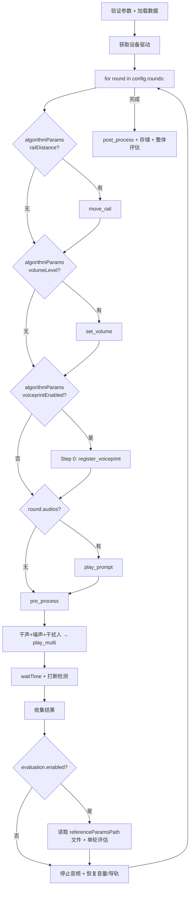

# 17_e2e_executor 多轮循环（轮次为顶层）

> 文件：`backend/utils/e2e_executor.py`

## 现状分析

现有 E2EExecutor.execute_e2e_case() 是线性执行，无多轮循环、无声纹/干扰人/打断等能力。

## 改造方案（轮次为顶层）

### 核心原则

1. **配置驱动**：根据 `config.rounds[]` 每轮的字段决定执行哪些能力
2. **每轮自包含**：每轮从自身 `round.algorithmParams` 读取全部配置参数
3. **algorithmParams 读取**：`CaseParameterExtractor.convert_params_to_dict(round.algorithmParams)` 转为 dict 后按 field_code 读取
4. **referenceParams 从文件读取**：`round.referenceParamsPath` → 读取文件
5. **轮末恢复**：每轮设置的设备环境在该轮结束时恢复

### 改造后执行流程



### 代码结构

```python
class E2EExecutor:
    def execute_e2e_case(self, app, task_id, tc_rel_id):
        config = test_case.config  # { rounds: [...] }
        rounds = config.get('rounds', [])
        device_info_list = self._get_device_drivers(task_id)

        # Step 0: 声纹注册（循环前预设置，从第1轮 algorithmParams 读取）
        if rounds:
            first_algo_params = CaseParameterExtractor.convert_params_to_dict(
                rounds[0].get('algorithmParams', [])
            )
            voiceprint_enabled = first_algo_params.get('voiceprintEnabled', 'false')
            if str(voiceprint_enabled).lower() == 'true':
                self._register_voiceprint(task_id, first_algo_params, device_info_list)

        try:
            result = self._execute_rounds(task_id, rounds, device_info_list)
        finally:
            self._final_cleanup(device_info_list)

        self._store_and_evaluate(task_id, result, config)

    def _execute_rounds(self, task_id, rounds, device_info_list):
        round_results = []

        for i, round_config in enumerate(rounds):
            self._emit_progress(f"第 {i + 1}/{len(rounds)} 轮")
            saved_state = {}

            # 从 algorithmParams 读取本轮参数
            algo_params = CaseParameterExtractor.convert_params_to_dict(
                round_config.get('algorithmParams', [])
            )

            # 1. 导轨（algorithmParams.railDistance）
            rail_distance = algo_params.get('railDistance')
            if rail_distance is not None:
                self._initialize_rail(task_id, device_info_list, float(rail_distance))
                saved_state['rail'] = True

            # 2. 音量（algorithmParams.volumeLevel）
            volume_level = algo_params.get('volumeLevel')
            if volume_level is not None:
                saved_state['volumes'] = self._set_device_volumes(
                    task_id, device_info_list, int(volume_level)
                )

            # 3. 声纹注册已在 Step 0 完成（循环前预设置）

            # 4. Prompt（从 round.audios 读取）
            audios = round_config.get('audios', [])
            if audios:
                self._play_prompt_audio(task_id, audios, device_info_list)

            # 5. 预处理
            self._pre_process(task_id, device_info_list)

            # 6. 混音播放（干扰人从 algorithmParams.interferers 读取）
            interferers_json = algo_params.get('interferers')
            interferers = json.loads(interferers_json) if interferers_json else []
            all_audio = (
                self._build_noise_configs(round_config.get('backgroundNoise'), device_info_list) +
                self._build_interferer_configs(task_id, interferers, device_info_list) +
                self._build_round_audio_configs(round_config, device_info_list)
            )
            audio_service.play_multi(task_id=task_id, audio_configs=all_audio)

            # 7. 等待 + 打断（algorithmParams.interruptionEnabled）
            wait_time = round_config.get('waitTime', 5)
            interruption_enabled = algo_params.get('interruptionEnabled', 'false')
            if str(interruption_enabled).lower() == 'true':
                sensitivity = float(algo_params.get('interruptionSensitivity', '0.5'))
                interruption_result = self._detect_interruption(
                    task_id, sensitivity, wait_time, device_info_list
                )
            else:
                time.sleep(wait_time)

            # 8. 收集结果
            round_result = self._collect_round_results(task_id, i, round_config, device_info_list)
            round_results.append(round_result)

            # 9. 停止音频
            audio_service.stop_task_audio(task_id)

            # 10. 单轮评估（从文件读取 referenceParams）
            eval_config = round_config.get('evaluation', {})
            if eval_config and eval_config.get('enabled'):
                ref_params = self._load_reference_params(round_config)
                self._evaluate_round_result(
                    task_id=task_id,
                    round_result=round_result,
                    round_number=i,
                    eval_dimensions=eval_config.get('dimensions', []),
                    reference_params=ref_params,
                )

            # 11. 恢复
            if 'volumes' in saved_state:
                self._restore_volumes(device_info_list, saved_state['volumes'])
            if saved_state.get('rail'):
                self._reset_rail(task_id, device_info_list)

        return {'rounds': round_results, 'round_count': len(round_results)}

    def _load_reference_params(self, round_config):
        """从文件读取参考文本"""
        path = round_config.get('referenceParamsPath')
        if path and os.path.exists(path):
            with open(path, 'r', encoding='utf-8') as f:
                return json.load(f)
        return {}
```

### 与现有流程对比

| 步骤 | 现有 | 改造后 |
|------|------|--------|
| 主循环 | 无 | for round in rounds（每轮自包含） |
| 导轨/音量/声纹/Prompt | 无 | 每轮从 round.algorithmParams 读取 |
| 参考字段 | TestCase.reference_params 列 | 从 round.referenceParamsPath 文件读取 |
| 评估 | 整体评估 | 每轮评估 + 整体评估 |
| 恢复 | 无 | 每轮末恢复 |
| 声纹注册 | 无 | Step 0 循环前预设置 |

## 引用关系

- ← `03_选设备API/backend/18_被测设备音量控制`
- ← `03_选设备API/backend/29_设备驱动导轨控制集成`
- → `04_执行测试/backend/19_声纹注册模块`
- → `04_执行测试/backend/20_干扰人播放模块`
- → `04_执行测试/backend/21_全双工打断检测`
- → `04_执行测试/backend/22_E2E每轮结果收集`
