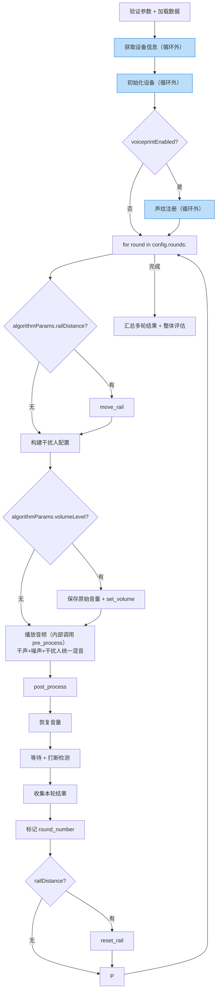

# 17_e2e_executor 多轮循环（轮次为顶层）

> 文件：`backend/utils/e2e_executor.py`

## 现状分析

现有 E2EExecutor.execute_e2e_case() 是线性执行，无多轮循环、无声纹/干扰人/打断等能力。

## 改造方案（轮次为顶层）

### 核心原则

1. **配置驱动**：根据 `config.rounds[]` 每轮的字段决定执行哪些能力
2. **每轮自包含**：每轮从自身 `round.algorithmParams` 读取全部配置参数
3. **algorithmParams 读取**：`_normalize_algorithm_params(round.algorithmParams)` 转为 dict 后按 field_code 读取
4. **referenceParams 从文件读取**：`round.referenceParamsPath` → 读取文件
5. **循环外一次性准备**：设备获取、初始化、声纹注册在循环外完成，避免每轮重复
6. **轮末恢复**：每轮设置的设备环境（音量、导轨）在该轮结束时恢复

### 改造后执行流程



> 蓝色框 = 循环外一次性步骤，其余 = 循环内每轮步骤

### 代码结构

```python
class E2EExecutor:
    def _execute_e2e_with_rounds(self, task_id, tc_rel_id, data):
        case_config = data['case_config']
        rounds = case_config.get('rounds', [])

        # ── 循环外：一次性设备准备 ──
        device_info_list = self._get_device_info(task_id, case_config)
        device_driver_factory.register_task_devices(task_id, device_info_list)
        self._initialize_devices(device_info_list, task_id, ...)

        # 声纹注册（循环前一次性执行）
        voiceprint_config = case_config.get('voiceprint_config', {})
        if voiceprint_config.get('enabled'):
            self._register_voiceprint(task_id, case_config, device_info_list)

        # ── 多轮循环 ──
        all_round_results = []

        for round_idx, round_config in enumerate(rounds):
            # 1. 准备本轮音频配置
            round_case_config = case_config.copy()
            round_case_config['audios'] = round_config.get('audios', [])
            playback_info = prepare_audio_playback_info(...)

            # 2. 提取本轮算法参数
            round_algo_params = _normalize_algorithm_params(
                round_config.get('algorithmParams', [])
            )

            # 3. 导轨控制
            rail_distance = round_algo_params.get('railDistance')
            if rail_distance:
                rail_controller = RailController()
                rail_controller.move_rail(float(rail_distance))

            # 4. 构建干扰人配置
            interferer_configs = self._build_interferer_configs(...)

            # 5. 音量设置（pre_process 前）
            volume_level = round_algo_params.get('volumeLevel')
            original_volumes = {}
            if volume_level:
                for info in device_info_list:
                    original_volumes[device_sn] = driver.get_volume(device_sn)
                    driver.set_volume(device_sn, int(volume_level))

            # 6. 播放音频（内部调用 pre_process）
            self._execute_audio_playback(...)

            # 7. post_process
            self._post_process_devices(device_info_list, task_id, ...)

            # 8. 恢复音量（post_process 后）
            for device_sn, original_vol in original_volumes.items():
                driver.set_volume(device_sn, original_vol)

            # 9. 等待 + 打断检测
            interruption_events = self._wait_and_detect_interruption(...)

            # 10. 收集本轮结果
            round_results = self._collect_results(...)
            for r in round_results:
                r['round_number'] = round_idx
            all_round_results.extend(round_results)

            # 11. 导轨复位
            if rail_controller:
                rail_controller.reset_rail()

        # ── 循环后：汇总 + 评估 ──
        self._process_results(task_id, ..., all_round_results, ...)
```

### 与现有流程对比

| 步骤 | 现有 | 改造后 |
|------|------|--------|
| 设备获取/初始化 | 循环内每轮重复 | **循环外一次性** |
| 声纹注册 | 循环内首轮（flag 控制） | **循环外一次性** |
| 主循环 | 无 | for round in rounds（每轮自包含） |
| 音量设置 | 独立 `_apply_round_device_settings` | 内联到 pre_process 前 |
| 音量恢复 | 独立 `_restore_round_device_settings` + finally | 内联到 post_process 后 |
| 导轨控制 | 独立方法 + saved_state | 内联到循环内 + 循环末复位 |
| 参考字段 | TestCase.reference_params 列 | 从 round.referenceParamsPath 文件读取 |
| 评估 | 整体评估 | 循环后按 round_number 分组评估 + 整体评估 |

### 已删除的方法

| 方法 | 原因 |
|------|------|
| `_apply_round_device_settings()` | 音量/导轨逻辑已内联到循环中 |
| `_restore_round_device_settings()` | 音量恢复紧跟 post_process，导轨复位在循环末尾 |

## 引用关系

- ← `03_选设备API/backend/18_被测设备音量控制`
- ← `03_选设备API/backend/29_设备驱动导轨控制集成`
- → `04_执行测试/backend/19_声纹注册模块`
- → `04_执行测试/backend/20_干扰人播放模块`
- → `04_执行测试/backend/21_全双工打断检测`
- → `04_执行测试/backend/22_E2E每轮结果收集`
