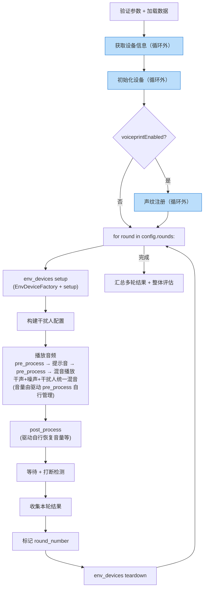

# 17_e2e_executor 多轮循环（轮次为顶层）

> 文件：`backend/services/execution/e2e_executor.py`

## 现状分析

现有 E2EExecutor.execute_e2e_case() 是线性执行，无多轮循环、无声纹/干扰人/打断等能力。

## 改造方案（轮次为顶层）

### 核心原则

1. **配置驱动**：根据 `config.rounds[]` 每轮的字段决定执行哪些能力
2. **每轮自包含**：每轮从自身 `round.algorithmParams` 读取全部配置参数
3. **algorithmParams 读取**：`_normalize_algorithm_params(round.algorithmParams)` 转为 dict 后按 field_code 读取
4. **referenceParams 从文件读取**：`round.referenceParamsPath` → 读取文件
5. **循环外一次性准备**：设备获取、初始化、声纹注册在循环外完成，避免每轮重复
6. **职责分离**：
   - **executor** 只编排流程，不直接操作音量/导轨等具体设备
   - **device_driver** 被测设备驱动自行管理音量（`pre_process` 设置，`post_process` 恢复）
   - **env_device** 环境设备通过 `EnvDeviceFactory` + `setup()`/`teardown()` 统一管理

### 改造后执行流程



> 蓝色框 = 循环外一次性步骤，其余 = 循环内每轮步骤

### 代码结构

```python
class E2EExecutor:
    def _execute_e2e_with_rounds(self, task_id, tc_rel_id, data):
        case_config = data['case_config']
        rounds = case_config.get('rounds', [])

        # ── 循环外：一次性设备准备 ──
        device_info_list = self._get_device_info(task_id, case_config)
        device_driver_factory.register_task_devices(task_id, device_info_list)
        self._initialize_devices(device_info_list, task_id, ...)

        # 声纹注册（循环前一次性执行）
        voiceprint_config = case_config.get('voiceprint_config', {})
        if voiceprint_config.get('enabled'):
            self._register_voiceprint(task_id, case_config, device_info_list)

        # ── 多轮循环 ──
        all_round_results = []

        for round_idx, round_config in enumerate(rounds):
            # 1. 准备本轮音频配置
            round_case_config = case_config.copy()
            round_case_config['audios'] = round_config.get('audios', [])
            playback_info = prepare_audio_playback_info(...)

            # 2. 提取本轮算法参数
            round_algo_params = _normalize_algorithm_params(
                round_config.get('algorithmParams', [])
            )

            # 3. 环境设备设置（导轨等，setup 自动保存状态）
            env_states = self._setup_env_devices_for_round(round_algo_params, task_id)

            # 4. 构建干扰人配置
            interferer_configs = self._build_interferer_configs(...)

            # 5. 播放音频（pre_process 由驱动自行管理音量）
            self._execute_audio_playback(
                ..., extra_audio_configs=interferer_configs
            )

            # 6. post_process（驱动自行恢复音量等）
            self._post_process_devices(device_info_list, task_id, ...)

            # 7. 等待 + 打断检测
            interruption_events = self._wait_and_detect_interruption(...)

            # 8. 收集本轮结果
            round_results = self._collect_results(...)
            for r in round_results:
                r['round_number'] = round_idx
            all_round_results.extend(round_results)

            # 9. 环境设备恢复（teardown 自动恢复到 setup 前的状态）
            self._teardown_env_devices_for_round(env_states, task_id)

        # ── 循环后：汇总 + 评估 ──
        self._process_results(task_id, ..., all_round_results, ...)
```

### 环境设备管理

环境设备（导轨、声压计、人工嘴等）通过 `EnvDeviceFactory` + `BaseEnvDevice` 统一管理：

```python
def _setup_env_devices_for_round(self, round_algo_params, task_id):
    """设置本轮环境设备，返回状态列表供 teardown 恢复。"""
    from backend.utils.env_device import EnvDeviceFactory

    _ENV_DEVICE_PARAM_MAP = {
        'railDistance': ('rail', lambda v: {'distance_cm': float(v)}),
        # 新增环境设备只需在此添加映射
    }

    env_states = []
    for param_key, (device_type, build_settings) in _ENV_DEVICE_PARAM_MAP.items():
        value = round_algo_params.get(param_key)
        if value is None:
            continue
        dev = EnvDeviceFactory.create(device_type)
        if dev and dev.is_available():
            state = dev.setup(build_settings(value))  # save_state + apply_settings
            env_states.append((dev, state))
    return env_states

def _teardown_env_devices_for_round(self, env_states, task_id):
    """恢复本轮环境设备到 setup 前的状态。"""
    for dev, state in env_states:
        dev.teardown(state)  # restore_state
```

**新增环境设备只需 3 步**：
1. 实现 `BaseEnvDevice` 子类
2. 注册到 `EnvDeviceFactory`
3. 在 `_ENV_DEVICE_PARAM_MAP` 加一行映射

executor 循环体**零改动**。

### 音频混音模型

干声、噪声、干扰人在 `play_multi` 中统一混音，走完全相同的代码路径：

| 类型 | 来源 | 循环播放 | SPL 增益 | 延迟 |
|------|------|---------|---------|------|
| 干声 | `round.audios[]` | 否 | 按设备 SPL 映射 | 按 play_order/overlap 计算 |
| 噪声 | `round.backgroundNoise` | 是（loop） | 按设备 SPL 映射 | 从 0 开始 |
| 干扰人 | `round.algorithmParams[interferers]` | 可配置 | 按设备 SPL 映射 | 按 startDelay 配置 |

```
_execute_audio_playback(..., extra_audio_configs=interferer_configs)
  └─ execute_audio_playback(dry + noise + extra_audio_configs)
       └─ play_overlap()
            └─ play_multi()  ← 干声 + 噪声 + 干扰人 统一混音
```

### 与现有流程对比

| 步骤 | 现有 | 改造后 |
|------|------|--------|
| 设备获取/初始化 | 循环内每轮重复 | **循环外一次性** |
| 声纹注册 | 循环内首轮（flag 控制） | **循环外一次性** |
| 主循环 | 无 | for round in rounds（每轮自包含） |
| 音量设置/恢复 | executor 内联代码 | **驱动自行管理**（pre_process/post_process） |
| 导轨控制 | 独立方法 + saved_state | **EnvDeviceFactory** + setup/teardown |
| 干扰人 | 无 | 作为 `extra_audio_configs` 与干声/噪声统一混音 |
| 参考字段 | TestCase.reference_params 列 | 从 round.referenceParamsPath 文件读取 |
| 评估 | 整体评估 | 循环后按 round_number 分组评估 + 整体评估 |

### 已删除的方法

| 方法 | 原因 |
|------|------|
| `_apply_round_device_settings()` | 音量由驱动管理，导轨由 EnvDeviceFactory 管理 |
| `_restore_round_device_settings()` | 同上 |

## 引用关系

- ← `03_选设备API/backend/18_被测设备音量控制`
- ← `03_选设备API/backend/29_设备驱动导轨控制集成`
- → `04_执行测试/backend/19_声纹注册模块`
- → `04_执行测试/backend/20_干扰人播放模块`
- → `04_执行测试/backend/21_全双工打断检测`
- → `04_执行测试/backend/22_E2E每轮结果收集`
