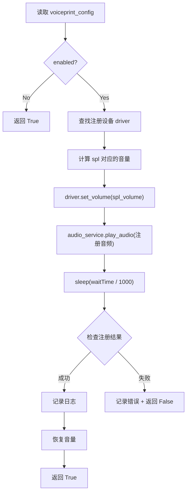

# 19 — 声纹注册模块

> **所属步骤**：04_执行测试 → backend  
> **改造类型**：新增模块  
> **涉及文件**：`backend/utils/e2e_executor.py`（新增 `_register_voiceprint()`）

---

## 背景

声纹注册是 E2E 测试的**通用能力**（不绑定特定算法类型）：在多轮对话开始前播放注册音频让被测设备采集说话人声纹特征，后续对话中设备据此识别说话人身份。

**触发条件**：用例配置 `case_config.voiceprint_config.enabled = true` 时执行，与算法类型无关。

声纹注册配置来自用例的 `voiceprint_config` 字段（JSON），结构如下：

```json
{
  "enabled": true,
  "audio": { "id": 12, "name": "register.wav", "path": "/audios/register.wav" },
  "device": { "id": 3, "name": "参考音箱" },
  "spl": 75,
  "waitTime": 3000
}
```

---

## 改造内容

### 1. `_register_voiceprint()` 方法签名

```python
def _register_voiceprint(
    self,
    task_id: str,
    voiceprint_config: dict,
    device_info_list: list[dict],
) -> bool:
    """
    播放声纹注册音频并等待注册完成。

    Returns:
        True 注册成功 / 不需要注册
        False 注册失败（应中止后续轮次）
    """
```

### 2. 执行流程



### 3. 核心逻辑

```python
def _register_voiceprint(self, task_id, algo_params, device_info_list):
    voiceprint_enabled = algo_params.get('voiceprintEnabled', 'false')
    if str(voiceprint_enabled).lower() != 'true':
        return True  # 无需注册

    audio_id = algo_params.get('voiceprintAudioId')
    device_id = algo_params.get('voiceprintDeviceId')
    spl = algo_params.get('voiceprintSpl')
    wait_time = int(algo_params.get('voiceprintWaitTime', '3000'))

    if not audio_id or not device_id:
        self._log('warning', '声纹注册配置不完整，跳过', task_id=task_id)
        return True

    # 查找注册设备对应的 driver
    target_driver = None
    for dev in device_info_list:
        if dev['device_id'] == device_info.get('id'):
            target_driver = dev['driver']
            break

    if target_driver is None:
        self._log('error', f'声纹注册设备 {device_info.get("name")} 未找到', task_id=task_id)
        return False

    original_volume = None
    try:
        # 保存原始音量并设置注册音量
        original_volume = target_driver.get_volume()
        if spl:
            target_driver.set_volume(spl)

        # 播放注册音频
        audio_path = audio_info.get('path', '')
        self._log('info', f'开始声纹注册: 播放 {audio_info.get("name")}', task_id=task_id)
        audio_service.play_audio(audio_path, target_driver)

        # 等待注册完成
        time.sleep(wait_time / 1000.0)

        self._log('info', '声纹注册完成', task_id=task_id)
        return True

    except Exception as e:
        self._log('error', f'声纹注册失败: {e}', task_id=task_id)
        return False

    finally:
        # 恢复原始音量
        if original_volume is not None:
            try:
                target_driver.set_volume(original_volume)
            except Exception:
                pass
```

### 4. 在 `execute_e2e_case` 中的调用位置

```python
# execute_e2e_case() 中（配置驱动，非算法绑定）

# 3. 声纹注册 ← 本文档
voiceprint_config = case_config.get('voiceprint_config', {})
if voiceprint_config.get('enabled'):
    if not self._register_voiceprint(task_id, voiceprint_config, device_info_list):
        self._log('error', '声纹注册失败，中止测试', task_id=task_id)
        return False
```

### 5. 日志输出示例

```
[INFO] [Task-001] 开始声纹注册: 播放 register.wav
[INFO] [Task-001] 声纹注册完成 (等待 3.0s)
```

---

## 不变部分

- 未配置 `voiceprintEnabled` 的用例不执行声纹注册（直接跳过）
- 音频播放服务 `audio_service` 不变
- 设备驱动框架不变

---

## 依赖关系

| 依赖文档 | 说明 |
|---------|------|
| `12_VoiceprintConfigEditor` (frontend) | 前端配置编辑器 |
| `18_被测设备音量控制` | `set_volume` / `get_volume` 接口 |
| `17_e2e_executor多轮循环` | 调用方入口 |
