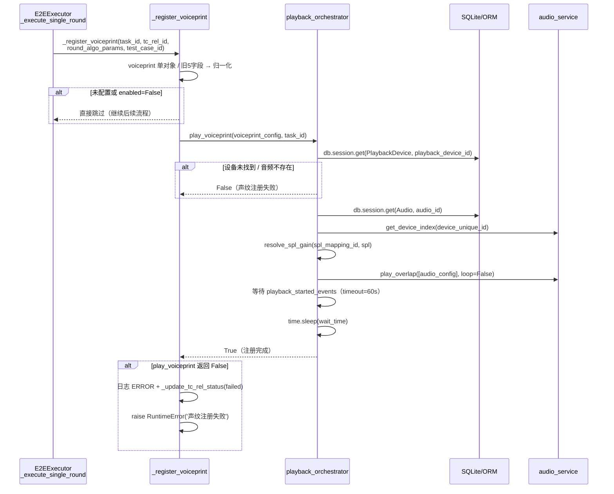

# 19. 声纹注册模块

> 源码位置：
> - 执行编排：`backend/services/execution/e2e_executor.py` → `_register_voiceprint()`（阶段二·每轮）
> - 播放实现：`backend/services/audio/playback_orchestrator.py` → `play_voiceprint()`
>
> 更新时间：2026-09（与当前代码对齐）

---

## 1. 模块定位

声纹注册（voiceprint registration）是 E2E 多轮测试中**每轮正式播放前**的准备步骤：

- 通过指定播放设备以目标 SPL 播放一段声纹注册音频；
- 等待 `wait_time` 秒，让被测设备的声纹识别算法完成注册/校准；
- 注册失败则**中止整个测试**（Raise RuntimeError）。

| 关注点 | 说明 |
| --- | --- |
| 执行时机 | **每轮**（`_execute_single_round` 内、`play_round` 之前），非循环外一次性 |
| 配置来源 | `round.algorithm_params.voiceprint`（单对象） |
| 播放方式 | `playback_orchestrator.play_voiceprint()`（SPL 增益驱动，非 set_volume） |
| 失败语义 | 中止测试：TC 关联状态置 failed + raise RuntimeError |
| 音量控制 | 无手工音量编排，由 `resolve_spl_gain()` 通过 SPL 映射表计算 gain |

---

## 2. 配置结构

### 2.1 新格式（当前主用）：单对象

`round.algorithm_params.voiceprint` 为**单对象**，字段存在即表示启用：

```json
{
  "algorithm_params": {
    "voiceprint": {
      "audio_id": 12,
      "spl": 70.0,
      "playback_device_id": 3,
      "voiceprint_wait_time": 5.0
    }
  }
}
```

| 字段 | 含义 | 默认值 |
| --- | --- | --- |
| `audio_id` | 声纹注册音频 ID（Audio 表主键） | 必填 |
| `playback_device_id` | 播放设备 ID（PlaybackDevice 表主键） | 必填 |
| `spl` | 目标声压级（dB SPL） | 70.0 |
| `voiceprint_wait_time` | 注册等待时长（秒） | 5.0 |

### 2.2 旧格式（兼容）：5 个拆分字段

```json
{
  "voiceprint_enabled": true,
  "voiceprint_audio_id": 12,
  "voiceprint_playback_device_id": 3,
  "voiceprint_spl": 70.0,
  "voiceprint_wait_time": 5.0
}
```

两种格式在 `_register_voiceprint()` 中归一化为同一内部结构：

```python
{ 'enabled': True, 'audio_id': ..., 'playback_device_id': ...,
  'spl': 70.0, 'wait_time': 5.0 }
```

---

## 3. 执行流程



### 3.1 执行器侧：`_register_voiceprint()`（每轮调用）

```python
def _register_voiceprint(self, task_id, tc_rel_id, round_algo_params, test_case_id):
    """从本轮 algorithm_params 提取声纹配置并执行注册

    voiceprint 是单个对象 { audio_id, spl, playback_device_id, voiceprint_wait_time }
    存在即表示启用，不存在则未配置。
    兼容旧格式（5个拆分字段）。
    """
    vp_obj = round_algo_params.get('voiceprint')
    if vp_obj and isinstance(vp_obj, dict):
        voiceprint_config = {
            'enabled': True,
            'audio_id': vp_obj.get('audio_id'),
            'playback_device_id': vp_obj.get('playback_device_id'),
            'spl': vp_obj.get('spl', 70.0),
            'wait_time': vp_obj.get('voiceprint_wait_time', 5.0),
        }
    else:
        # 兼容旧格式（5个拆分字段）
        voiceprint_config = {
            'enabled': round_algo_params.get('voiceprint_enabled', False),
            'audio_id': round_algo_params.get('voiceprint_audio_id'),
            'playback_device_id': round_algo_params.get('voiceprint_playback_device_id'),
            'spl': round_algo_params.get('voiceprint_spl', 70.0),
            'wait_time': round_algo_params.get('voiceprint_wait_time', 5.0),
        }
    if voiceprint_config.get('enabled'):
        if not playback_orchestrator.play_voiceprint(voiceprint_config, task_id):
            self._log(level='ERROR', content='声纹注册失败，中止测试',
                      task_id=task_id, test_case_id=test_case_id)
            self._update_tc_rel_status(tc_rel_id, execution_status='failed',
                                       status='failed', error_message='声纹注册失败')
            raise RuntimeError('声纹注册失败')
```

**调用位置**：`_execute_single_round()` 中，位于环境设备 setup 之后、`play_round` 之前，即每轮都执行一次。

### 3.2 播放侧：`play_voiceprint()`（playback_orchestrator）

```python
def play_voiceprint(self, vp_config, task_id):
    """播放声纹注册音频并等待注册完成。

    Returns:
        True: 注册成功 / 不需要注册
        False: 注册失败
    """
    if not vp_config or not vp_config.get('enabled'):
        return True

    # 1. 配置完整性检查（缺 audio_id / playback_device_id 仅告警跳过，不视为失败）
    if not audio_id or not playback_dev_id:
        self._log('WARNING', '声纹注册配置不完整 ...，跳过', task_id=task_id)
        return True

    # 2. 从 DB 加载 PlaybackDevice / Audio ORM 对象（缺失 → False）
    dev_obj = db.session.get(PlaybackDevice, playback_dev_id)
    audio_obj = db.session.get(Audio, audio_id)

    # 3. 设备索引与 SPL 增益
    device_index = self.audio_service.get_device_index(device_unique_id)
    gain = resolve_spl_gain(spl_mapping_id, spl)

    # 4. 构建统一 audio_to_play 配置（type='dry'，不循环）
    audio_config = {
        'file': audio_obj.file_path,
        'device_index': device_index,
        'channel': channel_index,
        'gain': gain,
        'delay': 0,
        'is_noise': False,
        'loop': False,
        'type': 'dry',
    }

    # 5. play_overlap 播放 + 等待真正开播后计时
    _, playback_started_events, _ = self.audio_service.play_overlap(
        task_id=task_id, audio_configs=[audio_config],
        overlap_time=0, overlap_rate=0, offset=0, loop=False,
    )
    for evt in playback_started_events:
        evt.wait(timeout=60)
    time.sleep(wait_time_sec)
    return True
```

**关键行为**：

| 行为 | 说明 |
| --- | --- |
| 未启用 | 返回 `True`，不阻塞流程 |
| 配置不完整（缺 audio_id/device_id） | `WARNING` 日志后返回 `True`（跳过，不视为失败） |
| 设备未找到 / 音频不存在 / 设备索引获取失败 / 播放异常 | 返回 `False` → 执行器中止测试 |
| SPL 增益 | `resolve_spl_gain()` 按设备 `current_spl_mapping_id` 查映射表计算 gain，**不调用 set_volume** |
| 开播判定 | 等待 `playback_started_events`（重采样等准备完成、真正出声后）才开始计时，避免注册时长被准备时间挤占 |

---

## 4. 与其他模块的关系

| 模块 | 关系 |
| --- | --- |
| [17_e2e_executor多轮循环.md](17_e2e_executor多轮循环.md) | `_execute_single_round()` 第 4 步调用声纹注册（每轮） |
| [20_干扰人播放模块.md](20_干扰人播放模块.md) | 同属每轮播前准备；声纹用 `type='dry'` 单独播，干扰人在 `play_round` 内合并播放 |
| 设备驱动（BaseDeviceDriver） | 无直接交互：声纹播放完全由 playback_orchestrator + audio_service 完成 |
| SPL 校准（resolve_spl_gain） | 声纹 SPL 经播放设备的 SPL 映射表转换为增益 |

---

## 5. 与旧版差异

| 项 | 旧版 | 当前 |
| --- | --- | --- |
| 配置来源 | `case_config.voiceprint_config`（用例级一次性） | `round.algorithm_params.voiceprint`（轮级、每轮） |
| 启用判定 | `voiceprint_config.enabled` 字段 | 新格式"对象存在即启用"；旧格式仍读 `voiceprint_enabled` |
| 执行次数 | 循环外一次 | **每轮一次** |
| 播放方式 | `driver.set_volume()` + `audio_service.play_audio()` + sleep | `playback_orchestrator.play_voiceprint()`：SPL→gain 映射 + `play_overlap` |
| 音量恢复 | 手动恢复原音量 | 无需：不用 set_volume，gain 由 SPL 映射表计算 |
| 失败行为 | 返回 False 由调用方决定 | 执行器统一处理：TC 状态置 failed + `raise RuntimeError` 中止 |
| 代码位置 | executor 内联实现 | 编排在 e2e_executor，实现在 playback_orchestrator |
