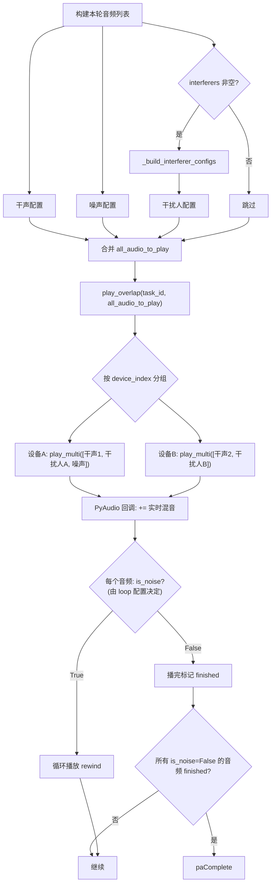

# 20 — 干扰人播放模块

> **所属步骤**：04_执行测试 → backend  
> **改造类型**：修改（复用现有引擎机制）  
> **涉及文件**：`backend/utils/e2e_executor.py`（新增 `_build_interferer_configs()`）、`backend/utils/audio_engine.py`（已有 `play_multi`，无需改动）

---

## 背景

干扰人播放是 E2E 测试的**通用能力**（不绑定特定算法类型）：在测试过程中由指定设备播放额外音频，模拟多人/噪声场景，测试被测设备的抗干扰能力。

**触发条件**：用例配置 `round_config.interferers` 非空数组时执行，与算法类型无关。

**核心设计原则**：干扰人不是特殊的播放概念，它和现有的噪声、干声一样，都是 `play_multi` 中的一个音频配置项。区别仅在于用例层的配置方式不同。

---

## 统一音频模型

引擎中所有音频（干声、噪声、干扰人）在 `play_multi` 回调里走**完全相同的代码路径**，每个音频的属性如下：

| 属性 | 类型 | 说明 | 干声 | 噪声 | 干扰人 |
|------|------|------|------|------|--------|
| `file` | str | 音频文件路径 | 有 | 有 | 有 |
| `device_index` | int | 物理设备索引 | 有 | 有 | 有 |
| `channel` | int | 输出通道 | 有 | 有 | 有 |
| `gain` | float | 软件增益（SPL→gain 映射） | 有 | 有 | 有 |
| `delay` | float | 延迟秒数（填充静音帧） | 按交叠计算 | 0 | startDelay |
| `is_noise` | bool | 循环播放 + 不计入干声完成判定 | `False` | **用户配置** | **用户配置** |
| `offset` | float | 文件内播放偏移 | 支持 | 支持 | 支持 |

### `is_noise` 的两个语义

```python
# play_multi 回调中：
use_loop = is_noise                          # 语义 1：是否循环播放
# ...
all_dry_finished = all(                      # 语义 2：是否参与"全部完成"判定
    dry_finished_list[i]
    for i in range(len(wave_files))
    if not audio_is_noise_list[i]            # is_noise=True 的音频被排除
)
if all_dry_finished:
    return paComplete                        # 所有非噪声音频播完 → stream 停止
```

噪声和干扰人的 `is_noise` 均由用例配置决定：
- **噪声**：`backgroundNoise.loop`（默认 `true`，兼容现有行为）→ `is_noise=True` 循环播放
- **干扰人**：`interferers[].loop` → `is_noise`
  - `loop=true` → `is_noise=True`（持续播放环境噪声，直到本轮结束被 stop）
  - `loop=false` → `is_noise=False`（播放一次干扰语音后自然结束）
- **干声**：始终 `is_noise=False`，播完标记 finished

> **引擎改动**：现有 `execute_audio_playback` 中噪声硬编码的 `'loop': True, 'is_noise': True`（第 675-676 行）需改为从 `background_noise.loop` 读取配置值，实现与干扰人完全一致的配置驱动模式。

---

## 干扰人配置结构

```json
[
  {
    "audio": { "id": 20, "name": "cafe_noise.wav", "path": "/audios/cafe_noise.wav" },
    "device": { "id": 5, "name": "干扰音箱A", "unique_id": "RME Fireface 802 [Ch 3]", "channel_index": 0 },
    "spl": 65,
    "startDelay": 500,
    "loop": true
  },
  {
    "audio": { "id": 21, "name": "someone_talking.wav", "path": "/audios/someone_talking.wav" },
    "device": { "id": 6, "name": "干扰音箱B", "unique_id": "RME Fireface 802 [Ch 5]", "channel_index": 0 },
    "spl": 70,
    "startDelay": 0,
    "loop": false
  }
]
```

每个干扰人支持的配置项与噪声/干声完全一致：

| 配置项 | 对应引擎属性 | 说明 |
|--------|------------|------|
| `audio.path` | `file` | 音频文件路径 |
| `device` | `device_index` + `channel` | 播放设备和通道 |
| `spl` | `gain` | 通过 `spl_to_gain()` 转为软件增益 |
| `startDelay` | `delay` | 延迟播放（ms → s，引擎填充静音帧） |
| `loop` | `is_noise` | `true`=循环播放直到本轮结束；`false`=播完自然结束 |

---

## 改造内容

### 1. `_build_interferer_configs()` — 干扰人配置转换

将用例配置中的干扰人格式转换为引擎的 `audio_to_play` 格式（与噪声、干声格式一致）：

```python
def _build_interferer_configs(
    self,
    task_id: str,
    interferer_config: list[dict],
    device_info_list: list[dict],
) -> list[dict]:
    """
    将干扰人配置转为 audio_to_play 格式，供 play_overlap 使用。
    输出格式与 execute_audio_playback 中的 audio_to_play 完全一致。
    """
    audio_to_play = []

    for idx, interferer in enumerate(interferer_config):
        audio_info = interferer.get('audio')
        device_info = interferer.get('device')
        spl = interferer.get('spl')
        start_delay_ms = interferer.get('startDelay', 0)
        loop = interferer.get('loop', False)

        if not audio_info or not device_info:
            self._log('warning', f'干扰人 {idx} 配置不完整，跳过', task_id=task_id)
            continue

        # 查找设备
        target_dev = None
        for dev in device_info_list:
            if dev['device_id'] == device_info.get('id'):
                target_dev = dev
                break

        if target_dev is None:
            self._log('warning', f'干扰人 {idx} 设备 {device_info.get("name")} 未找到',
                      task_id=task_id)
            continue

        device_index = target_dev.get('device_index')
        channel_index = target_dev.get('channel_index', 0)

        # SPL → 软件增益（与噪声/干声使用相同机制）
        gain = 1.0
        spl_mapping_id = target_dev.get('current_spl_mapping_id')
        if spl_mapping_id and spl:
            try:
                from backend.utils.spl_service import spl_service
                gain = spl_service.spl_to_gain(spl_mapping_id, spl)
            except Exception:
                gain = 1.0

        audio_to_play.append({
            'file': audio_info.get('path', ''),
            'device_index': device_index,
            'channel': channel_index,
            'gain': gain,
            'delay': start_delay_ms / 1000.0,   # ms → s
            'is_noise': loop,                     # loop=true → 循环播放
            'loop': loop,
        })

    return audio_to_play
```

### 2. 在多轮循环中的使用

干扰人音频与本轮主音频（干声）和噪声合并到同一个 `audio_to_play` 列表，统一交给 `play_overlap`：

```python
for round_idx, round_config in enumerate(rounds):
    # 1. 构建本轮干声配置（现有逻辑）
    main_audio_configs = self._build_round_audio_configs(
        task_id, round_config, device_info_list
    )

    # 2. 构建干扰人音频配置（如果有）
    interferer_configs = self._build_interferer_configs(
        task_id,
        round_config.get('interferers', []),
        device_info_list
    )

    # 3. 获取噪声配置（如果有，从 background_noise.loop 读取 is_noise）
    noise_configs = self._build_noise_configs(
        task_id, case_config, device_info_list
    )

    # 4. 三者合并到同一个列表（格式完全一致）
    all_audio_to_play = noise_configs + interferer_configs + main_audio_configs

    # 5. 统一交给引擎播放
    #    play_multi → 按 device_index 分组 → 同设备混音
    futures = audio_service.play_multi(
        task_id=task_id,
        audio_configs=all_audio_to_play,
        overlap_time=0,
        overlap_rate=0,
    )

    # 6. 等待响应（waitTime 期间所有音频都在播放）
    wait_time = round_config.get('waitTime', 3000) / 1000.0
    time.sleep(wait_time)

    # 7. 打断检测
    interruption = self._detect_interruption(
        task_id, round_config, device_info_list
    )

    # 8. 收集本轮结果
    round_result = self._collect_round_results(...)

    # 9. 停止本轮所有音频（包括循环的干扰人和噪声）
    audio_service.stop_task_audio(task_id)
```

### 3. 执行流程



### 4. 三种音频在引擎中的行为对比

```
play_multi 回调中的处理逻辑（所有音频走同一段代码）:

┌─ 噪声 loop=true（is_noise=True）← 默认，兼容现有行为
│    use_loop = True
│    播完 → rewind → 继续播
│    不参与 all_dry_finished 判定
│    停止方式: stop_task_audio() 或 stream 关闭时统一停止
│
├─ 噪声 loop=false（is_noise=False）← 用例可配置
│    use_loop = False         ← 和干声完全一样
│    播完 → 标记 dry_finished
│    参与 all_dry_finished 判定
│    停止方式: 播完自然结束
│
├─ 干扰人 loop=true（is_noise=True）
│    use_loop = True          ← 和噪声 loop=true 完全一样
│    播完 → rewind → 继续播
│    不参与 all_dry_finished 判定
│    停止方式: stop_task_audio() 统一停止
│
├─ 干扰人 loop=false（is_noise=False）
│    use_loop = False         ← 和干声完全一样
│    播完 → 标记 dry_finished
│    参与 all_dry_finished 判定
│    停止方式: 播完自然结束
│
└─ 干声（is_noise=False）
     use_loop = False
     播完 → 标记 dry_finished
     参与 all_dry_finished 判定
     所有干声播完 → stream 返回 paComplete
```

### 5. 设备分配场景

```
场景 1：干扰人和主音频在不同设备（最常见）
  设备 3（主播放）: play_multi([干声1, 干声2])       → 1 个 stream
  设备 5（干扰）:   play_multi([干扰人A(loop)])       → 1 个 stream
  设备 7（干扰）:   play_multi([干扰人B(单次)])       → 1 个 stream
  → 三个 stream 并行，无冲突

场景 2：干扰人和干声在同一设备
  设备 3: play_multi([干声1, 干声2, 干扰人A(loop)])  → 1 个 stream
  → 回调中 += 混音，设备锁不冲突

场景 3：干扰人、噪声、干声在同一设备
  设备 5: play_multi([噪声(loop=true), 干扰人A(loop), 干声1]) → 1 个 stream
  → 噪声和干扰人循环播放，干声播完后 all_dry_finished → stream 停止

场景 4：全部混合
  设备 3: play_multi([干声1, 干扰人A(loop), 噪声(loop=true)]) → 1 个 stream
  设备 5: play_multi([干声2, 干扰人B(单次)])             → 1 个 stream
  → 引擎按 device_index 自动分组，每组一个 worker

场景 5：噪声 loop=false（用例配置不循环）
  设备 5: play_multi([噪声(loop=false), 干声1]) → 1 个 stream
  → 噪声和干声均 is_noise=False，全部播完后 all_dry_finished → stream 自然停止
```

---

## 与前端 InterfererConfigEditor 的对应

前端编辑器配置的每个干扰人字段与引擎属性的映射：

```
┌─ InterfererConfigEditor (前端) ─────────────────────┐
│                                                      │
│  音频选择 ──────────→ audio.path → file              │
│  播放设备 ──────────→ device     → device_index      │
│  声压级 SPL ────────→ spl        → gain (spl_to_gain)│
│  启动延迟 ms ───────→ startDelay → delay (ms→s)      │
│  循环播放 ☑ ────────→ loop       → is_noise           │
│                                                      │
└──────────────────────────────────────────────────────┘
         │
         ▼
┌─ _build_interferer_configs ─────────────────────────┐
│  输出: audio_to_play 格式（与噪声/干声一致）          │
│  {file, device_index, channel, gain, delay, is_noise}│
└──────────────────────────────────────────────────────┘
         │
         ▼
┌─ play_overlap → play_multi ─────────────────────────┐
│  所有音频统一混音，不区分来源                         │
└──────────────────────────────────────────────────────┘
```

---

## 不变部分

- 未配置 `interferers` 的用例不产生额外音频配置（直接跳过）
- `play_multi()` 引擎接口不变
- `spl_to_gain()` / `_device_locks` / `active_players` 机制不变
- 设备驱动框架不变

## 引擎适配（小改动）

- `execute_audio_playback` 中噪声的 `is_noise` / `loop` 从硬编码 `True` 改为读取 `case_config.background_noise.loop`（默认 `True`，向后兼容）
- 改动点仅一处（第 675-676 行），不影响引擎其他逻辑

---

## 依赖关系

| 依赖文档 | 说明 |
|---------|------|
| `13_InterfererConfigEditor` (frontend) | 前端配置编辑器（含 loop 开关） |
| `17_e2e_executor多轮循环` | 调用方入口 |
| `audio_engine.py` 现有代码 | `play_multi`（小改动：噪声 loop 读取配置） |
