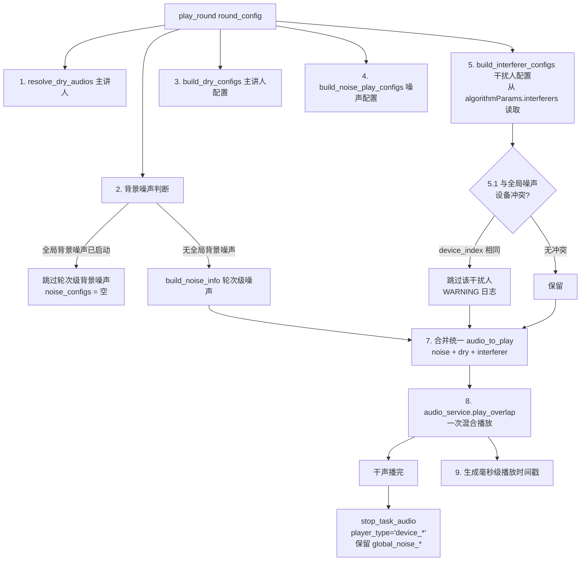

# 20. 干扰人播放模块

> 源码位置：
> - 配置构建：`backend/services/audio/playback_config_builder.py` → `build_interferer_configs()`（模块级函数）
> - 播放编排：`backend/services/audio/playback_orchestrator.py` → `play_round()`（第 5 步构建、统一合并播放）
>
> 更新时间：2026-09（与当前代码对齐）

---

## 1. 模块定位

干扰人（interferer）是 E2E 测试中叠加在主讲人语音之上的**竞争人声**音频，用于测试算法在干扰环境下的表现。

| 关注点 | 说明 |
| --- | --- |
| 配置来源 | `round.algorithm_params.interferers`（**数组**，轮级配置） |
| 构建位置 | `playback_config_builder.build_interferer_configs()`（**不在 executor**，executor 已无干扰人代码） |
| 触发位置 | `playback_orchestrator.play_round()` 内部读取并构建 |
| 统一模型 | 与干声/噪声统一为 `audio_to_play` 格式，一次 `play_overlap` 混合播放 |
| 停止方式 | 干声结束后 `stop_task_audio(task_id, player_type='device_*')`，**保留全局背景噪声** |
| 设备冲突 | 与全局背景噪声使用同一物理设备的干扰人会被**跳过**（PortAudio 流互斥） |

---

## 2. 配置结构

`round.algorithm_params.interferers` 为数组，每个元素描述一个干扰人。`build_interferer_configs()` **兼容三种存储结构**：

### 2.1 嵌套结构（前端 syncStructuredFields 生成）

```json
{
  "audio": { "id": 5, "name": "interferer_male.wav" },
  "device": { "id": 3 },
  "startDelay": 1500,
  "spl": 65.0,
  "loop": false
}
```

### 2.2 扁平 ID 结构（algorithm_params 独立列原样存储）

```json
{
  "audio_id": 5,
  "audio_name": "interferer_male.wav",
  "playback_device_id": 3,
  "start_delay": 1.5,
  "spl": 65.0,
  "loop": false
}
```

### 2.3 扁平名称结构（统一标注文件导入）

```json
{
  "audio": "interferer_male.wav",
  "playback_device_name": " playback-speaker-01",
  "spl": 65.0,
  "loop": false
}
```

### 2.4 字段语义与解析规则

| 字段 | 含义 | 解析规则 |
| --- | --- | --- |
| `audio` / `audio_id` / `audio_name` | 干扰人音频 | audio 为 dict 用嵌套；字符串按文件名兜底查库（name/original_filename），命中后**回填 id** |
| `device` / `playback_device_id` / `playback_device_name` | 播放设备 | device.id / playback_device_id 查 `PlaybackDevice` 主键；名称兜底 `filter_by(name=..., is_deleted=0)` |
| `spl` | 目标声压级 | 有 `spl_mapping_id` 且有 spl → `resolve_spl_gain()`；否则 gain=1.0 |
| `start_delay` / `startDelay` | 起播延迟 | **单位启发式**：嵌套结构毫秒、扁平结构秒；代码按 `> 100 视为毫秒` 换算为秒 |
| `loop` | 是否循环 | 独立字段，默认 False |

---

## 3. 构建流程：`build_interferer_configs()`

```python
def build_interferer_configs(task_id, interferer_config, audio_service):
    """构建干扰人 audio_to_play 配置。

    语义：
    - type='interferer'：不参与主讲人交叠时间轴
    - is_noise=False：音频类型为人声
    - loop：控制是否循环播放（独立字段）
    - delay：保留 startDelay（ms 转 s）
    """
    audio_to_play = []
    for idx, interferer in enumerate(interferer_config):
        # 1. 三种结构兼容归一化（嵌套 / 扁平ID / 扁平名称）
        ...
        # 2. 设备解析：playback_device_id 查 DB → 兜底按设备名查
        dev_obj = db.session.get(PlaybackDevice, playback_dev_id)
        if not dev_obj:
            dev_obj = PlaybackDevice.query.filter_by(name=_dev_name, is_deleted=0).first()
        ...
        # 3. 设备索引
        device_index = audio_service.get_device_index(device_unique_id)
        # 4. SPL 增益
        gain = resolve_spl_gain(spl_mapping_id, spl) if spl_mapping_id and spl else 1.0
        # 5. 音频文件解析：audio_id 查 DB → 兜底按 audio_name/original_filename 查并回填 id
        file_path = _resolve_audio_file_path(audio_info)
        ...
        # 6. start_delay 单位启发式：> 100 视为毫秒
        if start_delay_raw > 100:
            delay_s = start_delay_raw / 1000.0
        else:
            delay_s = start_delay_raw

        # 7. 统一 audio_to_play 格式
        audio_to_play.append({
            'file': file_path,
            'device_index': device_index,
            'channel': channel_index,
            'gain': gain,
            'delay': delay_s,
            'loop': bool(loop),
            'is_noise': False,
            'type': 'interferer',
        })
    return audio_to_play
```

**容错语义**：单个干扰人配置不完整（缺 audio/device、设备未找到、无文件路径、设备索引获取失败）只记 `WARNING` 并跳过该项，**不中断整轮播放**。

---

## 4. 播放编排：`play_round()` 中的干扰人



### 4.1 从 algorithmParams 读取（play_round 第 5 步）

```python
# 5. 构建干扰人 audio_to_play 配置（从 algorithmParams 读取）
from backend.utils.algorithm.case_parameter_extractor import _normalize_algorithm_params
round_algo_params = _normalize_algorithm_params(round_config.get('algorithm_params', []))
interferers = round_algo_params.get('interferers', [])
interferer_configs = build_interferer_configs(task_id, interferers, self.audio_service)
```

### 4.2 全局背景噪声设备冲突跳过（第 5.1 步）

```python
# 5.1 跳过与全局背景噪声使用相同设备的干扰人音频
# 同一设备无法同时打开两个 PortAudio 输出流，会导致 dev_lock 死锁
bg_noise_devices = self._get_background_noise_device_indices(task_id)
if bg_noise_devices and interferer_configs:
    interferer_configs = [
        c for c in interferer_configs
        if c.get('device_index') not in bg_noise_devices
    ]
```

### 4.3 统一合并播放（第 7~8 步）

```python
# 7. 合并三类音频为统一 audio_to_play 列表
audio_to_play = []
audio_to_play.extend(noise_configs)
audio_to_play.extend(dry_configs)
audio_to_play.extend(interferer_configs)

# 8. 执行播放（同步等待，干声结束后停噪声）
threads, playback_started_events, playback_finished_events = self.audio_service.play_overlap(
    task_id=task_id, audio_configs=audio_to_play,
    overlap_time=overlap_time, overlap_rate=overlap_rate,
    offset=0, loop=False, speakers_map=speakers_map, app=app,
)
```

### 4.4 每轮收尾：只停 device_*，保留全局噪声（第 8 步末尾）

```python
# 只停本轮 play_overlap 注册的 device_* player，保留全局背景噪声（global_noise_*）
self.audio_service.stop_task_audio(task_id, player_type='device_*')
```

| player_type | 生命周期 |
| --- | --- |
| `device_*` | 轮次级（主讲人/轮次噪声/干扰人），干声播完后即停 |
| `global_noise_*` | 用例级（全局背景噪声），跨轮次持续，由 `start_background_noise()` / `stop_background_noise()` 独立管理 |

---

## 5. 与统一音频模型的关系

干扰人与干声、噪声遵循**同一 audio_to_play 模型**（详见 [17_e2e_executor多轮循环.md](17_e2e_executor多轮循环.md) 音频混音模型章节）：

| 音频类型 | type | is_noise | loop | delay | 构建函数 |
| --- | --- | --- | --- | --- | --- |
| 主讲人干声 | `dry` | False | False | 交叠时间轴计算 | `build_dry_configs()` |
| 轮次级背景噪声 | `noise` | True | 由配置决定 | 0 | `build_noise_play_configs()` |
| 干扰人 | `interferer` | False | 独立字段 `loop` | `start_delay`（单位启发式） | `build_interferer_configs()` |
| 全局背景噪声 | `noise` | True | True | 0 | `playback_orchestrator.start_background_noise()` |

**关键差异**：干扰人 `type='interferer'`，**不参与主讲人交叠时间轴计算**（交叠只作用于干声），仅按自身 `delay` 延迟起播。

---

## 6. 与旧版差异

| 项 | 旧版 | 当前 |
| --- | --- | --- |
| 构建函数位置 | `_build_interferer_configs` 在 `e2e_executor.py` | `build_interferer_configs` 在 `playback_config_builder.py`（executor 无干扰人代码） |
| 配置来源 | `round_config.interferers` | `round.algorithmParams.interferers`（经 `_normalize_algorithm_params` 归一化） |
| 存储结构兼容 | 单一结构 | 三种结构兼容（嵌套 / 扁平ID / 扁平名称），含文件名查库回填 id |
| 播放方式 | 干扰人单独播放 | 与干声/噪声合并统一 `audio_to_play`，一次 `play_overlap` |
| 全局噪声共存 | `stop_task_audio(task_id)` 全部停止，全局噪声被误停 | `stop_task_audio(task_id, player_type='device_*')` 只停轮次级播放，保留全局噪声 |
| 同设备冲突 | 未处理 | 检测与全局噪声 device_index 冲突的干扰人并跳过（避免 PortAudio dev_lock 死锁） |
| SPL 控制 | set_volume 手动设置 | `resolve_spl_gain()` 增益映射，无 set_volume |
