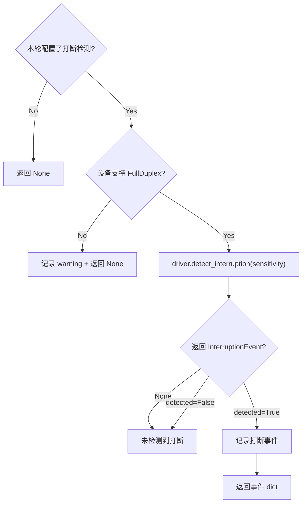

# 21 — 全双工打断检测

> **所属步骤**：04_执行测试 → backend  
> **改造类型**：新增模块  
> **涉及文件**：`backend/utils/e2e_executor.py`（新增 `_check_interruption()`）

---

## 背景

打断检测是 E2E 测试的**通用能力**（不绑定特定算法类型）：全双工模式下用户可以在设备播放音频时打断说话，E2E 测试需要检测这种打断事件，记录打断时间点，作为测试结果的一部分。

**触发条件**：用例配置 `round_config.interruption.enabled = true` 时执行，与算法类型无关。设备不支持时静默跳过（`NotImplementedError`）。

打断检测接口由 `base_driver.detect_interruption()` 提供（见 `33_device_driver打断检测接口.md`），返回 `Optional[InterruptionEvent]`：

```python
@dataclass
class InterruptionEvent:
    detected: bool           # 是否检测到打断
    timestamp: float         # 打断路径时间戳（秒）
    confidence: float        # 置信度 0-1
    method: str              # 检测方式: "device_log" | "signal_analysis"
```

---

## 改造内容

### 1. `_check_interruption()` 方法签名

```python
def _check_interruption(
    self,
    task_id: str,
    round_config: dict,
    device_info_list: list[dict],
) -> Optional[dict]:
    """
    检测本轮是否发生打断事件。

    Returns:
        打断事件 dict 或 None
        {
            "detected": True,
            "timestamp": 2.3,
            "confidence": 0.85,
            "method": "device_log"
        }
    """
```

### 2. 执行流程



### 3. 核心逻辑

```python
def _check_interruption(self, task_id, round_config, device_info_list):
    """检测本轮打断事件"""
    interruption_config = round_config.get('interruption', {})
    if not interruption_config.get('enabled', False):
        return None

    sensitivity = interruption_config.get('sensitivity', 'medium')

    # 遍历设备，尝试打断检测
    for dev in device_info_list:
        driver = dev.get('driver')
        if driver is None:
            continue

        try:
            event = driver.detect_interruption(sensitivity=sensitivity)

            if event is not None and event.detected:
                self._log(
                    'info',
                    f'检测到打断事件: 时间={event.timestamp:.2f}s, '
                    f'置信度={event.confidence:.2f}, 方式={event.method}',
                    task_id=task_id
                )
                return {
                    'detected': True,
                    'timestamp': event.timestamp,
                    'confidence': event.confidence,
                    'method': event.method,
                    'device_id': dev['device_id'],
                    'device_name': dev.get('device_name', ''),
                }

        except NotImplementedError:
            # 设备驱动未实现打断检测
            self._log(
                'debug',
                f'设备 {dev.get("device_name")} 不支持打断检测',
                task_id=task_id
            )
        except Exception as e:
            self._log(
                'warning',
                f'打断检测异常: {e}',
                task_id=task_id
            )

    return None
```

### 4. 打断结果在轮次数据中的存储

```json
{
  "round": 2,
  "input": { "audio": "round2.wav" },
  "output": { "asr_text": "...", "trans_text": "..." },
  "interruption": {
    "detected": true,
    "timestamp": 2.3,
    "confidence": 0.85,
    "method": "device_log",
    "device_id": 3,
    "device_name": "被测手机"
  },
  "latency": 1.5,
  "wait_time": 3000
}
```

### 5. 灵敏度配置说明

| sensitivity | 说明 | 典型场景 |
|-------------|------|---------|
| `low` | 仅检测明显的打断（大音量、长时间） | 强干扰环境 |
| `medium` | 默认灵敏度 | 普通办公环境 |
| `high` | 检测轻微的打断（咳嗽、简短插话） | 安静环境 |

灵敏度参数传递给 `driver.detect_interruption(sensitivity)`，具体实现由设备驱动决定。

---

## 不变部分

- 未配置 `algorithmParams.interruptionEnabled` 的用例不执行打断检测（直接返回 None）
- `base_driver` 基础方法不变
- 打断检测是可选能力，驱动未实现时静默跳过

---

## 依赖关系

| 依赖文档 | 说明 |
|---------|------|
| `33_device_driver打断检测接口` | `detect_interruption()` 接口定义 |
| `17_e2e_executor多轮循环` | 调用方入口 |
