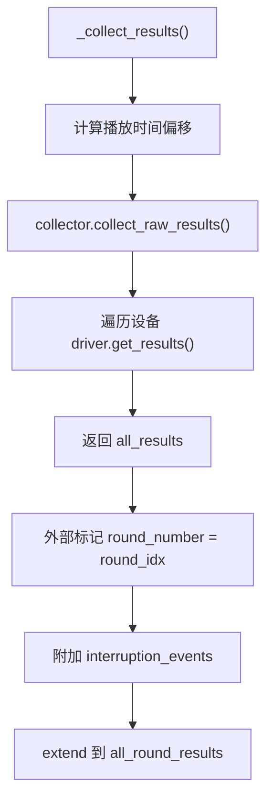

# 22 — E2E 每轮结果收集

> **所属步骤**：04_执行测试 → backend  
> **改造类型**：复用现有方法 + 轮次标记  
> **涉及文件**：`backend/utils/e2e_executor.py`（复用 `_collect_results()`）

---

## 背景

每轮结果收集是 E2E 测试多轮模式的**通用能力**（不绑定特定算法类型）：每轮对话需要独立收集设备输出结果（ASR 文本、翻译文本、RTTM/STM 等），每轮有独立的输入/输出/延迟。

**触发条件**：用例配置 `case_config.rounds` 非空数组时，每轮结束后调用。无 `rounds` 配置时走现有单次采集流程。

---

## 实现方案

### 设计决策：复用 `_collect_results()` 而非新增方法

实际实现中**没有新增** `_collect_round_results()` 方法，而是直接复用现有的 `_collect_results()` 方法，在外部手动标记 `round_number`。

**原因**：
- `_collect_results()` 已经封装了完整的采集链路（时间偏移计算 → `collector.collect_raw_results()` → 参考参数调整）
- 轮次标记只需在结果列表上追加 `round_number` 字段，无需独立方法
- `DeviceResultCollector` 层已有 `collect_round_results()` 方法（含 `_round`/`_round_start_time`/`_round_end_time` 标记），但 executor 层选择复用更成熟的 `collect_raw_results()` 链路

### 执行流程



### 核心逻辑

```python
# 在 _execute_e2e_with_rounds 的循环内：

# 收集本轮结果（复用现有方法）
collect_result = self._collect_results(
    task_id, test_case_id, device_info_list,
    algorithm_type=algorithm_type,
    case_reference_params=case_reference_params
)

# 解包（可能返回 tuple 含 adjusted_ref_params）
if isinstance(collect_result, tuple):
    round_results, adjusted_case_ref_params = collect_result
else:
    round_results = collect_result

# 附加打断事件
if interruption_events:
    for r in (round_results if isinstance(round_results, list) else [round_results]):
        r['interruption_events'] = interruption_events

# 标记 round_number (0-indexed)
tagged_results = round_results if isinstance(round_results, list) else [round_results]
for r in tagged_results:
    r['round_number'] = round_idx
all_round_results.extend(tagged_results)
```

### 多轮结果累积

所有轮次结果收集完毕后，在循环外统一处理：

```python
# 循环结束后
if not all_round_results:
    # 标记失败
    return False

# 统一处理 + 评估（按 round_number 分组）
self._process_results(
    task_id, case_name, tc_rel_id, test_case_id,
    all_round_results, case_config, ...
)
```

`_process_results()` 内部会：
1. 检测 `is_multi_round`（有 `round_number` 标记）
2. 按 `round_number` 分组结果
3. 构建多轮 `algorithm_result` 结构
4. 保存单条 `TestResult` 记录
5. 按轮次逐轮评估 + 整体评估

### 与 `DeviceResultCollector.collect_round_results()` 的关系

| 特性 | `collect_raw_results()` (当前使用) | `collect_round_results()` (collector 层已有) |
|------|-------------------------------------|----------------------------------------------|
| 调用方 | `e2e_executor._collect_results()` | 未被 executor 调用 |
| 轮次标记 | 外部手动标记 `round_number` | 内部自动标记 `_round`/`_round_start_time`/`_round_end_time` |
| 时间偏移 | 支持播放时间偏移计算 | 不支持 |
| 参考参数 | 支持 `adjusted_reference_params` | 不支持 |
| 成熟度 | 生产验证 | 已实现但未在生产路径中使用 |

---

## 不变部分

- `DeviceResultCollector` 核心采集逻辑不变
- `driver.get_results()` 接口不变
- `_collect_results()` 方法签名和内部逻辑不变
- 未配置 `rounds` 的用例继续使用现有单次采集流程

---

## 依赖关系

| 依赖文档 | 说明 |
|---------|------|
| `17_e2e_executor多轮循环` | 调用方入口 |
| `23_E2E测试结果存储结构` | 轮次结果如何写入 algorithm_result |
| `32_device_result_collector多轮采集` | collector 层的适配 |
