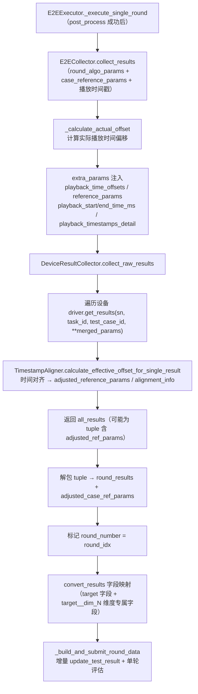

# 22 — E2E 每轮结果收集

> **所属步骤**：04_执行测试 → backend
> **改造类型**：复用现有方法 + 轮次标记
> **涉及文件**：
> - 执行编排：`backend/services/execution/e2e_executor.py` → `_execute_single_round()`（第 8~9 步）
> - 采集编排：`backend/services/execution/e2e_collector.py` → `E2ECollector.collect_results()`
> - 采集实现：`backend/services/device/device_result_collector.py` → `collect_raw_results()` / `convert_results()`

---

## 1. 背景

每轮结果收集是 E2E 测试多轮模式的**通用能力**（不绑定特定算法类型）：每轮对话需要独立收集设备输出结果（ASR 文本、翻译文本、RTTM/STM 等），每轮有独立的输入/输出/延迟。

**触发条件**：用例配置 `case_config.rounds` 非空数组时，每轮播放完成后调用。无 `rounds` 配置时走现有单次采集流程。

---

## 2. 收集链路总览



### 2.1 设计要点

| 要点 | 说明 |
| --- | --- |
| 委托模式 | executor 不直接采集，`self._collector`（E2ECollector）负责偏移计算与参数组装 |
| 复用链路 | E2ECollector 复用 `DeviceResultCollector.collect_raw_results()`，外部标记 `round_number` |
| 时间戳下沉 | 播放起止毫秒时间戳经 extra_params 传给设备驱动，由驱动自行统计时延 |
| 失败隔离 | pre/play/post 任一步失败 → 仅 teardown 本轮环境设备并返回空结果，不中断整体测试 |

---

## 3. 执行器侧代码

### 3.1 采集调用（_execute_single_round 内）

```python
# 采集结果
collect_result = self._collector.collect_results(
    task_id, test_case_id, device_info_list,
    algorithm_type=algorithm_type,
    case_reference_params=case_reference_params,
    round_algo_params=round_algo_params,
)
if isinstance(collect_result, tuple):
    round_results, adjusted_case_ref_params = collect_result
else:
    round_results, adjusted_case_ref_params = collect_result, None

tagged_results = round_results if isinstance(round_results, list) else [round_results]
for r in tagged_results:
    r['round_number'] = round_idx

# 字段映射：将 raw_results 映射为 target 字段（如 output_text、question_text 等）
tagged_results = get_device_result_collector().convert_results(tagged_results, algorithm_type)
```

### 3.2 失败分支（统一返回结构）

预处理/播放/后处理任一步失败时，本轮返回空结果，不中断整体多轮测试：

```python
return {
    'success': False,
    'tagged_results': [],
    'round_data': {'round': round_idx, 'input': {}, 'output': {},
                   'latency': None, 'evaluation': {}},
    'adjusted_ref_params': None,
}
```

### 3.3 每轮提交（_build_and_submit_round_data）

收集完成后立即（而非循环结束后）增量提交：

1. `E2EAggregator.log_case_result()` 记录用例结果日志；
2. 按 FieldMapper 构建本轮 `round_output`（target 字段 + `target__dim_N` 维度专属字段）；
3. 构建含**已执行轮次 + 本轮**的累积 algo_result，`update_test_result(result_id, execution_status='running')` 增量更新预创建的 TestResult；
4. 检查本轮 `evaluation.enabled` 与 `dimensions`，满足条件则 `self._evaluate_result(round_number=round_idx)` 提交单轮评估。

---

## 4. 采集器侧代码

### 4.1 E2ECollector.collect_results（偏移计算 + 参数注入）

```python
def collect_results(self, task_id, test_case_id, device_info_list, **kwargs):
    algorithm_type = kwargs.get('algorithm_type', 'translation')
    extra_params = {}
    round_algo_params = kwargs.pop('round_algo_params', None)
    if round_algo_params:
        extra_params.update(round_algo_params)

    playback_timestamps = self._executor._playback_timestamps.get(task_id)
    if playback_timestamps:
        audio_offsets = self._calculate_actual_offset(task_id, playback_timestamps)
        if audio_offsets:
            extra_params['playback_time_offsets'] = audio_offsets
            extra_params['reference_params'] = kwargs.get('case_reference_params')
            # 毫秒级播放起止时间戳 + 明细，供设备驱动统计时延
            extra_params['playback_start_time_ms'] = playback_timestamps.get('current_round_start_ms')
            extra_params['playback_end_time_ms'] = playback_timestamps.get('current_round_end_ms')
            extra_params['playback_timestamps_detail'] = [...]

    collector = get_device_result_collector()
    all_results = collector.collect_raw_results(
        task_id, test_case_id, device_info_list, extra_params,
        log_callback=log_callback, **kwargs
    )

    # 提取 adjusted_reference_params（按 result_type 分组），存在则返回 tuple
    adjusted_ref_params = {res['result_type']: res['adjusted_reference_params'] ...}
    result_to_return = (all_results, adjusted_ref_params) if adjusted_ref_params else all_results
    return result_to_return
```

### 4.2 偏移计算（_calculate_actual_offset）

```python
# actual_offset = 实际播放时刻 - 录音起始时刻 - 理论偏移
actual_offset = actual_time - record_start_time - theory_offset
# 按 "{audio_id}_{play_order}" 为 key 组织
audio_offsets[key] = {'audio_id': ..., 'play_order': ..., 'offset': actual_offset}
```

### 4.3 DeviceResultCollector.collect_raw_results（核心采集）

- 遍历 `device_info_list`，调用 `driver.get_results(device_sn, task_id, test_case_id, **merged_params)`；
- 每条结果包装为 `{device_id, device_name, device_sn, raw_results, result_type}`；
- 调用 `TimestampAligner.calculate_effective_offset_for_single_result()` 做时间对齐，写入 `adjusted_reference_params`（`or reference_params or []` 兜底）与 `alignment_info`；
- 异常分支 `setdefault` 保证字段全覆盖。

---

## 5. 与 `DeviceResultCollector.collect_round_results()` 的关系

collector 层存在 `collect_round_results()`（内部标记 `_round`/`_round_start_time`/`_round_end_time`），但 **executor 未使用**：

| 特性 | `collect_raw_results()`（当前使用） | `collect_round_results()`（collector 层已有，未被 executor 调用） |
|------|-------------------------------------|--------------------------------------------------------------|
| 调用方 | `E2ECollector.collect_results()` | 无 |
| 轮次标记 | 外部手动标记 `round_number` | 内部自动标记 `_round`/`_round_start_time`/`_round_end_time` |
| 时间偏移 | 支持播放时间偏移 + 毫秒时间戳注入 | 不支持 |
| 参考参数 | 支持 `adjusted_reference_params` + 对齐信息 | 不支持 |
| 成熟度 | 生产验证 | 已实现但未在生产路径中使用 |

---

## 6. 不变部分

- `DeviceResultCollector.collect_raw_results()` 核心采集逻辑不变
- `driver.get_results()` 接口不变
- `TimestampAligner` 对齐算法不变（详见 [32_device_result_collector多轮采集.md](32_device_result_collector多轮采集.md)）
- 未配置 `rounds` 的用例继续使用单次采集流程

---

## 7. 与旧版差异

| 项 | 旧版 | 当前 |
| --- | --- | --- |
| executor 路径 | `backend/utils/e2e_executor.py` | `backend/services/execution/e2e_executor.py` |
| 采集入口 | executor 内联 `_collect_results()` | 委托 `E2ECollector.collect_results()`（e2e_collector.py） |
| 循环外统一处理 `_process_results()` | 循环结束统一处理 + 评估 | **每轮**即时 `_build_and_submit_round_data` 增量更新 + 单轮评估；循环外 `_finalize_rounds` 收尾 |
| 打断事件附加 | 附加 `interruption_events` | 已移除（打断由设备驱动自行上报） |
| 最终持久化 | 仅写 TestResult | 增加 `write_result_data_file` 持久化 raw_results（见文档 23） |

---

## 8. 依赖关系

| 依赖文档 | 说明 |
|---------|------|
| [17_e2e_executor多轮循环](17_e2e_executor多轮循环.md) | 调用方入口（六阶段中的阶段二） |
| [23_E2E测试结果存储结构](23_E2E测试结果存储结构.md) | 轮次结果如何写入 algorithm_result 与 result_data_path |
| [32_device_result_collector多轮采集](32_device_result_collector多轮采集.md) | collector 层与时间对齐器 |
