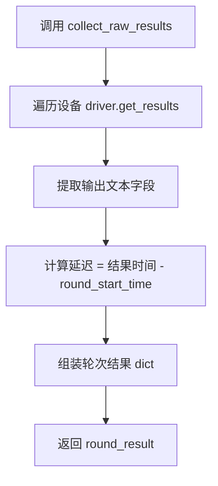

# 22 — E2E 每轮结果收集

> **所属步骤**：04_执行测试 → backend  
> **改造类型**：新增模块  
> **涉及文件**：`backend/utils/e2e_executor.py`（新增 `_collect_round_results()`）

---

## 背景

每轮结果收集是 E2E 测试多轮模式的**通用能力**（不绑定特定算法类型）：每轮对话需要独立收集设备输出结果（ASR 文本、翻译文本、RTTM/STM 等），每轮有独立的输入/输出/延迟。

**触发条件**：用例配置 `case_config.rounds` 非空数组时，每轮结束后调用。无 `rounds` 配置时走现有单次采集流程。

现有 `DeviceResultCollector.collect_raw_results()` 一次性采集所有设备结果。多轮模式需要在每轮结束后调用，将结果关联到对应的轮次编号。

---

## 改造内容

### 1. `_collect_round_results()` 方法签名

```python
def _collect_round_results(
    self,
    task_id: str,
    round_idx: int,
    round_config: dict,
    device_info_list: list[dict],
    round_start_time: float,
) -> dict:
    """
    收集单轮对话的设备输出结果。

    Returns:
        {
            "round": 0,
            "device_results": [...],
            "output_text": "...",
            "latency": 1.5
        }
    """
```

### 2. 执行流程



### 3. 核心逻辑

```python
def _collect_round_results(self, task_id, round_idx, round_config,
                            device_info_list, round_start_time):
    """收集单轮对话结果"""
    # 复用现有 DeviceResultCollector
    collector = self._get_result_mapper()

    # 采集设备原始输出
    raw_results = collector.collect_raw_results(
        task_id=task_id,
        test_case_id=self.current_test_case_id,
        device_info_list=device_info_list,
        extra_params={},
    )

    # 提取关键输出字段
    output_text = self._extract_output_text(raw_results, round_config)
    latency = self._calculate_round_latency(round_start_time)

    round_result = {
        'round': round_idx,
        'device_results': raw_results,
        'output_text': output_text,
        'latency': latency,
        'round_start_time': round_start_time,
        'round_end_time': time.time(),
    }

    self._log(
        'info',
        f'第 {round_idx + 1} 轮结果收集完成: 延迟={latency:.2f}s',
        task_id=task_id
    )

    return round_result

def _extract_output_text(self, raw_results, round_config):
    """从设备输出中提取文本结果"""
    for result in raw_results:
        # 优先取 ASR 文本
        for key in ['asr_text', 'source_text', 'stm_content']:
            if key in result and result[key]:
                return result[key]

    return ''

def _calculate_round_latency(self, round_start_time):
    """计算轮次延迟"""
    return time.time() - round_start_time
```

### 4. 多轮结果累积

在 `execute_e2e_case` 的循环中，每轮结果追加到 `all_round_results` 列表：

```python
all_round_results = []

for round_idx, round_config in enumerate(rounds):
    round_start = time.time()

    # 播放音频 + 干扰人 + 等待 + 打断检测 ...

    # 收集本轮结果
    round_result = self._collect_round_results(
        task_id, round_idx, round_config,
        device_info_list, round_start
    )

    # 附加打断信息
    if interruption:
        round_result['interruption'] = interruption

    all_round_results.append(round_result)
```

### 5. 与现有 `collect_raw_results` 的关系

| 特性 | 现有 `collect_raw_results` | `_collect_round_results` |
|------|---------------------------|-------------------------|
| 调用频率 | 一次 | 每轮一次 |
| 结果范围 | 所有设备一次性 | 所有设备本轮结果 |
| 时间对齐 | 全局对齐 | 本轮内对齐 |
| 返回值 | 原始结果列表 | 含轮次编号 + 延迟的结构化 dict |
| 底层调用 | `driver.get_results()` | 内部复用 `collect_raw_results` |

---

## 不变部分

- `DeviceResultCollector` 核心采集逻辑不变
- `driver.get_results()` 接口不变
- 未配置 `rounds` 的用例继续使用现有单次采集流程

---

## 依赖关系

| 依赖文档 | 说明 |
|---------|------|
| `17_e2e_executor多轮循环` | 调用方入口 |
| `23_E2E测试结果存储结构` | 轮次结果如何写入 algorithm_result |
| `32_device_result_collector多轮采集` | collector 层的适配 |
