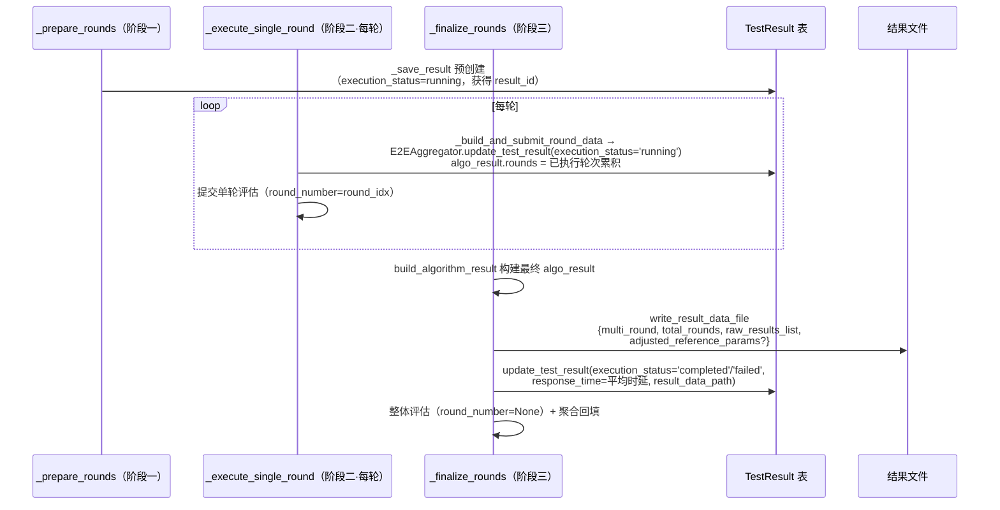

# 23 — E2E 测试结果存储结构

> **所属步骤**：04_执行测试 → backend
> **改造类型**：修改
> **涉及文件**：
> - 结果构建：`backend/services/execution/e2e_aggregator.py` → `E2EAggregator.build_algorithm_result()` / `update_algorithm_result_evaluation()`
> - 写入编排：`backend/services/execution/e2e_executor.py` → `_build_and_submit_round_data()` / `_finalize_rounds()`
> - 文件持久化：`backend/utils/common/result_data_store.py` → `write_result_data_file()`

---

## 1. 背景

多轮 E2E 测试（用例配置了 `rounds`）的 `algorithm_result` 需要包含多轮对话的完整信息：每轮输入/输出/延迟/评估分数。与 API 侧多轮结果结构（见 `16_API测试结果存储结构.md`）风格一致但字段不同。

**核心机制**：TestResult 记录在 `_prepare_rounds` 阶段**预创建**（获得 `result_id`），每轮增量更新，`_finalize_rounds` 最终写入并持久化原始结果文件。

---

## 2. TestResult 生命周期（三段式写入）



---

## 3. E2E 多轮 `algorithm_result` 结构

由 `E2EAggregator.build_algorithm_result(task_id, all_round_results, case_config, algorithm_type)` 构建：

```json
{
  "test_type": "e2e",
  "algorithm_type": "voice_llm",
  "total_rounds": 3,
  "rounds": [
    {
      "round": 0,
      "input": {
        "audio_name": "round1.wav",
        "audio_path": "/audios/round1.wav",
        "type": "audio"
      },
      "output": {
        "output_text": "今天天气怎么样",
        "output_text__dim_1": "今天天气怎么样"
      },
      "latency": 2.1,
      "wait_time": 5000,
      "evaluation": {
        "wer": 0.05,
        "llm_judge": 4.5
      }
    },
    {
      "round": 1,
      "input": { "audio_name": "round2.wav", "audio_path": "/audios/round2.wav", "type": "audio" },
      "output": { "output_text": "明天会下雨吗" },
      "latency": 1.5,
      "wait_time": 5000,
      "evaluation": { "wer": 0.08 }
    },
    {
      "round": 2,
      "input": { "audio_name": "round3.wav", "audio_path": "/audios/round3.wav", "type": "audio" },
      "output": { "output_text": "帮我设个闹钟" },
      "latency": 1.8,
      "wait_time": 5000,
      "evaluation": {}
    }
  ],
  "aggregated": {
    "avg_latency": 1.8,
    "avg_wer": null,
    "avg_llm_judge": null
  }
}
```

### 3.1 字段说明

| 字段 | 含义 | 来源 |
| --- | --- | --- |
| `rounds[].round` | 轮次索引（0-based） | 结果项的 `round_number` 标记 |
| `rounds[].input` | 本轮输入音频（名称/路径/type） | `case_config.rounds[round_idx].audios[0]` |
| `rounds[].output` | 映射后的输出字段 | `primary[target]`（通用）+ `primary[target__dim_N]`（维度专属），由 `convert_results` 写入 |
| `rounds[].latency` | 本轮响应时延 | `primary.response_time or primary.latency` |
| `rounds[].wait_time` | 本轮等待时长（秒） | `round_config.waitTime`，默认 **5000** |
| `rounds[].evaluation` | 本轮维度分数 | `update_algorithm_result_evaluation()` 从 DB 回填 |
| `aggregated.avg_latency` | 平均时延（4 位小数） | 构建时直接计算 |
| `aggregated.avg_wer` / `avg_llm_judge` | 占位字段（null） | 聚合计算由报告层（report_utils）直接查 DB 完成 |

### 3.2 已移除字段（与旧版差异）

| 旧字段 | 现状 |
| --- | --- |
| `session_id` | 已移除（E2E 场景无会话） |
| `rail_distance` | 已移除（导轨距离属环境设备参数，由 E2EDeviceManager 在轮级设置，不进结果结构） |
| `voiceprint_registered` | 已移除（声纹注册失败会直接 RuntimeError 中止，成功无需记录布尔） |
| `rounds[].interruption` | 已移除（打断信息由设备驱动自行上报/处理） |

---

## 4. 关键构建代码

### 4.1 build_algorithm_result（E2EAggregator）

```python
def build_algorithm_result(self, task_id, all_round_results, case_config, algorithm_type):
    """从多轮原始结果构建 algo_result 结构（rounds[] + aggregated）"""
    mapped_output_fields = get_field_mapper().get_mapped_device_output_fields(algorithm_type)

    # 按 round_number 分组
    rounds_by_index = {}
    for r in all_round_results:
        rounds_by_index.setdefault(r.get('round_number', 0), []).append(r)

    rounds_list = []
    latency_values = []
    for round_idx in sorted(rounds_by_index.keys()):
        primary = rounds_by_index[round_idx][0]
        round_config = case_rounds[round_idx] if round_idx < len(case_rounds) else {}
        first_audio = (round_config.get('audios') or [{}])[0]

        # output：通用 target 字段 + 维度专属 target__dim_N 字段
        round_output = {}
        for f in mapped_output_fields:
            target, dim_id = f.get('code'), f.get('dimension_id')
            if dim_id is not None:
                dim_key = f'{target}__dim_{dim_id}'
                if primary.get(dim_key) is not None:
                    round_output[dim_key] = primary[dim_key]
            if primary.get(target) is not None:
                round_output.setdefault(target, primary[target])

        latency = primary.get('response_time') or primary.get('latency')
        wait_time = round_config.get('waitTime', 5000) or 5000

        rounds_list.append({
            'round': round_idx,
            'input': {'audio_name': ..., 'audio_path': ..., 'type': 'audio'},
            'output': round_output,
            'latency': latency,
            'wait_time': wait_time,
            'evaluation': {},
        })

    return {
        'test_type': 'e2e',
        'algorithm_type': algorithm_type,
        'total_rounds': len(rounds_list),
        'rounds': rounds_list,
        'aggregated': {
            'avg_latency': round(sum(latency_values) / len(latency_values), 4) if latency_values else None,
            'avg_wer': None,
            'avg_llm_judge': None,
        },
    }
```

### 4.2 评估分数回填（update_algorithm_result_evaluation）

`_finalize_rounds` 中，仅当配置了单轮评估维度（`_has_round_dims`）时调用：

- 从 DB 查询各轮评估结果，回填 `algo_result.rounds[].evaluation`；
- **聚合不在该层计算**——整体维度分数由报告层（report_utils）直接查 DB 完成（见评估系列文档）。

---

## 5. raw_results 文件持久化（write_result_data_file）

`_finalize_rounds` 中，最终结果除写入 TestResult 外，还会将**未经映射的原始结果**持久化到文件，供**重新评估**时重新映射字段：

```python
result_data_to_save = {
    'multi_round': True,
    'total_rounds': len(all_round_results),
    'raw_results_list': copy.deepcopy(all_round_results),
}
if last_adjusted_ref_params:
    result_data_to_save['adjusted_reference_params'] = last_adjusted_ref_params

result_data_path = write_result_data_file(task_id, test_case_id, device_sn, result_data_to_save)
```

| 字段 | 含义 |
| --- | --- |
| `multi_round` | 固定 True（多轮 E2E 标记） |
| `total_rounds` | 实际采集的轮次数 |
| `raw_results_list` | 每轮 convert_results 前的原始包装结果（含 raw_results/result_type/adjusted_reference_params/alignment_info/round_number） |
| `adjusted_reference_params` | 最后一轮的调整后参考参数（按 result_type 分组），可选 |

`result_data_path` 写入 TestResult 记录，重评估流程从该文件加载 raw_results 重新走字段映射与评估链路。

---

## 6. 驱动覆写的最终结果（get_final_results）

`_finalize_rounds` 优先调用设备驱动覆写的 `get_final_results(rounds_data, all_round_results, case_config)`：

- 返回非 `False` → 以驱动返回的最终结果**替代**逐轮聚合，走与单轮采集相同的包装链路：`raw_results → 包装 → convert_results`，再进入 `build_algorithm_result`；
- 返回 `False` 或异常 → 回退到逐轮聚合（使用每轮已采集的 `all_round_results`）。

---

## 7. 与 API 侧结构的对比

| 字段 | API 多轮结果 | E2E 多轮结果 |
|------|------------|------------|
| `test_type` | `"api"` | `"e2e"` |
| `rounds[].input.type` | `"text"` 或 `"audio"` | `"audio"` |
| `rounds[].context` | 有 | 无 |
| `rounds[].output` | 映射字段 | 映射字段 + `target__dim_N` 维度专属字段 |
| `aggregated` | 聚合分数 | `avg_latency` 直接计算；分数聚合由报告层查 DB |

---

## 8. 不变部分

- `TestResult` 表结构不变（`algorithm_result` 仍为 JSONB 字段）
- 未配置 `rounds` 的用例 `algorithm_result` 结构不变（仍为单次结果）
- `_save_result` 的 DB 写入接口不变

---

## 9. 依赖关系

| 依赖文档 | 说明 |
|---------|------|
| `16_API测试结果存储结构` | API 侧结构（保持一致风格） |
| [17_e2e_executor多轮循环](17_e2e_executor多轮循环.md) | 三段式写入的调用方（六阶段） |
| [22_E2E每轮结果收集](22_E2E每轮结果收集.md) | 每轮结果来源 |
| 评估系列文档（RoundAggregator / EvaluationResultProcessor） | 分数回填与聚合的下游 |
