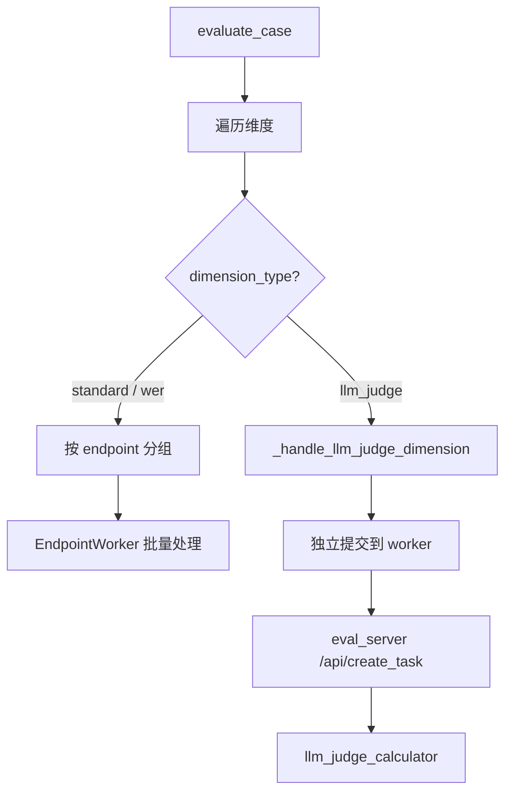

# 24 — evaluation_service llm_judge 分发

> **所属步骤**：04_执行测试 → backend  
> **改造类型**：修改  
> **涉及文件**：`backend/utils/evaluation_service.py`

---

## 背景

voice_llm 测试引入了新的评估维度类型 `llm_judge`，使用 LLM 对对话输出进行语义级评分。现有 `EvaluationService.evaluate_case()` 按维度分组并路由到 `EndpointWorker`，但不感知 `llm_judge` 的特殊性：需要额外的 prompt 模板、模型参数、较长的超时时间。

---

## 改造内容

### 1. 新增 llm_judge 维度识别

在 `evaluate_case()` 中，遍历维度配置时新增 `llm_judge` 类型识别：

```python
# evaluation_service.py → evaluate_case()
for dim in enabled_dimensions:
    dim_type = dim.get('dimension_type', 'standard')

    if dim_type == 'llm_judge':
        # llm_judge 维度单独处理，不走 endpoint_group 批处理
        self._handle_llm_judge_dimension(
            task_id=task_id,
            result_id=result_id,
            test_case_id=test_case_id,
            dim_data=dim,
            algorithm_result=algorithm_result,
            ref_texts=ref_texts,
            algorithm_type=algorithm_type,
            test_type=test_type,
        )
    else:
        # 现有逻辑：按 endpoint + task_type_code 分组
        key = (endpoint_url, task_type_code)
        endpoint_groups[key].append((dim, dimension_result_id))
```

### 2. `_handle_llm_judge_dimension()` 方法

```python
def _handle_llm_judge_dimension(self, task_id, result_id, test_case_id,
                                  dim_data, algorithm_result, ref_texts,
                                  algorithm_type, test_type):
    """处理 llm_judge 类型维度"""
    from dim_data import api_settings
    model = api_settings.get('model', 'gpt-4')
    prompt_template = api_settings.get('promptTemplate', '')
    max_tokens = api_settings.get('maxTokens', 1024)
    temperature = api_settings.get('temperature', 0.1)

    # 构建评估数据
    eval_data = {
        'task_type': 'llm_judge',
        'model': model,
        'prompt_template': prompt_template,
        'max_tokens': max_tokens,
        'temperature': temperature,
        'algorithm_result': algorithm_result,
        'ref_texts': ref_texts,
        'dim_id': dim_data['id'],
    }

    # 提交到 worker（使用 llm_judge 专用端点或通用端点）
    endpoint_url = dim_data.get('api_url') or self._get_llm_judge_endpoint()
    worker = self._get_or_create_worker(endpoint_url, dim_data)

    task_data = {
        'task_id': task_id,
        'result_id': result_id,
        'test_case_id': test_case_id,
        'algorithm_result': algorithm_result,
        'dim_data': dim_data,
        'eval_data': eval_data,
        'algorithm_type': algorithm_type,
        'test_type': test_type,
    }

    self._submit_to_endpoint_worker(task_data, worker)
```

### 3. llm_judge 与标准维度的路由对比



### 4. llm_judge 超时处理

```python
def _get_timeout_from_dim_config(self, dim_data, default_timeout=30):
    """提取超时配置"""
    dim_type = dim_data.get('dimension_type', 'standard')

    if dim_type == 'llm_judge':
        # llm_judge 默认超时更长（LLM 推理较慢）
        return dim_data.get('api_settings', {}).get('timeout', 120)

    # 现有逻辑
    api_settings = dim_data.get('api_settings', {})
    return api_settings.get('timeout', default_timeout)
```

### 5. EndpointWorker 中的 payload 构建适配

`EndpointWorker._execute_evaluation()` 中，需要区分 llm_judge 和普通维度的请求体格式：

```python
# _execute_evaluation() 中
dim_type = dim_data.get('dimension_type', 'standard')

if dim_type == 'llm_judge':
    # llm_judge 请求体包含额外的 model + prompt 参数
    payload = self.eval_service.api_client.build_llm_judge_payload(
        eval_data=eval_data,
        algorithm_result=algorithm_result,
        ref_texts=ref_texts,
    )
else:
    # 现有逻辑
    payload = self.eval_service.api_client.build_payload(...)
```

---

## 不变部分

- 现有 WER/SER/DER 维度的评估流程不变
- EndpointWorker 的队列模型不变
- `_post_evaluate_updates()` 状态更新逻辑不变
- 维度 CRUD 接口不变

---

## 依赖关系

| 依赖文档 | 说明 |
|---------|------|
| `25_Evaluation页面_llm_judge维度` (frontend) | 维度配置 UI |
| `25_evaluation_service单轮评估` | 单轮评估调用 |
| `03_LLM_Judge计算器` (eval_server) | 计算实现 |
