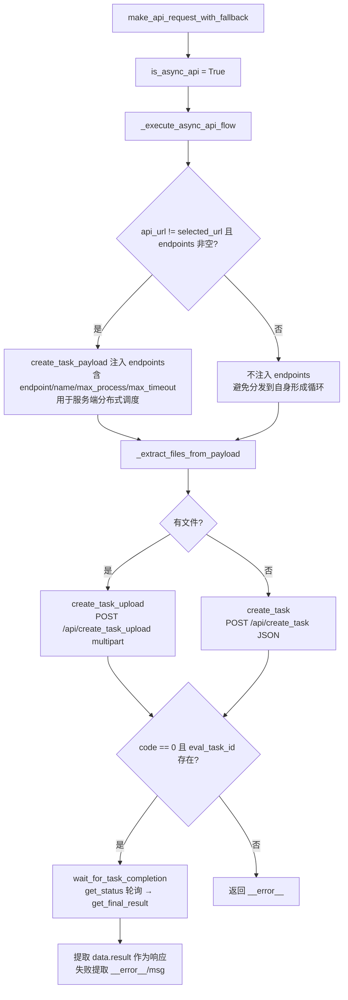

# 26 — evaluation_api_client 适配

> **所属步骤**：04_执行测试 → backend  
> **改造类型**：重构（组合架构）  
> **涉及文件**：`backend/services/evaluation/evaluation_api_client.py`  
> **关联文件**：`api_request_handler.py`（HTTP+异步任务流）、`payload_builder.py`（Payload 构建）、`evaluation_mixin.py`（统一日志+端点工具）、`evaluation_utils.py`（模板渲染）、`endpoint_worker.py`（端点消费 Worker）

---

## 背景

`evaluation_api_client.py` 负责向 `eval_server` 发起评估请求。已重构为**组合架构**：HTTP 请求与 Payload 构建分离到父类，客户端自身只负责端点配置、并发控制与异步任务编排。对外保持原有调用接口（`make_api_request_with_fallback`）不变。

```python
class evaluationApiClient(ApiRequestHandler, PayloadBuilder, EvaluationLoggerMixin):
    """
    继承 ApiRequestHandler（HTTP请求+异步任务流程）和 PayloadBuilder（Payload构建），
    对外保持原有接口不变。
    """
```

---

## 模块职责划分

| 类 | 文件 | 职责 |
|----|------|------|
| `evaluationApiClient` | evaluation_api_client.py | 端点配置、并发控制、异步任务流程编排、端点容灾切换 |
| `ApiRequestHandler` | api_request_handler.py | 裸 HTTP 请求、create_task、状态查询、结果获取、multipart 文件拆分 |
| `PayloadBuilder` | payload_builder.py | 按 body_template 渲染 Payload、文件转 base64 data URI |

---

## 客户端自身：初始化与配置化

```python
def __init__(self):
    self.endpoint_semaphores = {}   # 端点信号量 {endpoint: Semaphore}
    self.endpoint_configs = {}      # 端点配置缓存 {endpoint: max_process}
    self.thread_pool = None         # 全局线程池，动态创建
    self.global_lock = Lock()

    # 从统一配置文件加载并发配置（config_manager 配置化）
    self.max_queue_size = config_manager.get_value('evaluation_service', 'max_queue_size', 100)
    self.max_wait_time = config_manager.get_value('evaluation_service', 'max_wait_time', 30)
    self.default_max_concurrent = config_manager.get_value('evaluation_service', 'default_max_concurrent', 10)
```

### 端点并发控制

| 方法 | 说明 |
|------|------|
| `load_endpoint_configs(dimensions)` | 遍历维度的 `api_endpoints`，提取 `max_process`（兼容 `maxProcess`），已存在不覆盖 |
| `init_thread_pool()` | `ThreadPoolExecutor(max_workers=各端点 max_process 之和)`，仅在线程池不存在或已关闭时重建 |
| `_get_or_create_semaphore(endpoint, max_process)` | 为端点创建信号量（并发槽位） |
| `acquire_endpoint_slot(endpoint, timeout)` | 以 `max_wait_time` 为上限获取槽位（0.5s 分片轮询），超时返回 False |
| `release_endpoint_slot(endpoint)` | 释放槽位，`ValueError`（超发）降级为 WARNING |
| `select_endpoint(endpoints)` | 随机选一个入口。**服务端已具备分布式调度，客户端只做随机入口选择** |

> **并发控制现状**：`_get_or_create_semaphore` / `acquire_endpoint_slot` / `release_endpoint_slot` 已无任何生产调用方（保留为历史能力）。实际并发由 `EndpointWorker` 的多消费线程承担，见「并发模型汇总」。

### 端点选择与容灾（make_api_request_with_fallback）

```python
selected_url = api_url if api_url else self.select_endpoint(endpoints)
if not selected_url:
    return None, None
```

- 优先用维度级 `api_url`（Master 入口，支持分布式调度），否则从 `endpoints` 随机选
- **返回 `(selected_url, resp_data)` 元组**，供 Worker 记录实际使用的端点
- **全异步任务流**：`is_async_api = True` 硬编码，所有评测任务走异步任务 API
- 失败时仅在**未使用 api_url** 的情况下尝试备用端点（`_try_fallback_endpoints`），跳过无效 URL（非 http/https）

---

## 异步任务流程（_execute_async_api_flow）

所有评估请求都通过"创建任务 → 轮询等待 → 获取结果"三步完成：



### 关键点

- **task_type 兜底**：payload 无 `task_type` 时取 `dim_info.task_type_code`，再兜底 `'wer'`
- **endpoints 注入条件**：`endpoints and api_url and api_url != selected_url` —— 当 `api_url` 就是评估服务自身时不传，避免远程分发到自身
- **结果提取**：异步完成响应 `{code:0, data:{result:{...}}}`，取 `data.result`；失败统一返回 `{'__error__': msg}`，由结果处理层识别
- **wait_for_task_completion**：默认 `max_wait_time=600s`、`poll_interval=5s`（可传参覆盖），状态 `completed` → 拉取结果，`failed` → 返回 error

---

## 文件上传分流（ApiRequestHandler）

### _extract_files_from_payload（音频文件提取）

音频字段集合默认为 `{'record_file'}`（可传 `audio_field_names` 覆盖，来自 field_mapper 中 type='audio' 的字段）。遍历 payload 顶层与 `rounds` 列表：

| 场景 | 行为 |
|------|------|
| 单轮（rounds 只有 1 项） | 音频字段提到顶层上传，rounds JSON 里删掉该字段 |
| 多轮 | 每轮音频提取为 `rounds_{idx}_{field_name}`，rounds JSON 里该值替换为 `__MULTIPART__:rounds_{idx}_{field_name}` 占位符 |
| 顶层音频字段（data URI / 路径） | 提取为文件上传 |

支持的文件值形式：
- data URI（`data:audio/wav;base64,...`）→ 解码为字节流，按 MIME 映射扩展名（.wav/.mp3/.flac 等）
- 绝对路径（本地存在）
- 相对路径（`_resolve_relative_path`：先按工作目录解析，再按 `Config.STATIC_BASE_PATH` 解析，处理路径前缀重复）

**边界处理**：
- 长度 ≥ 4096 的非 data URI 字符串不视为文件（避免误判）
- 提取失败（文件不存在等）回退到 form_fields 原值
- **bool 值转小写**：multipart 会把 `True` 序列化成首字母大写，eval_server 白名单只认 `'true'/'false'`，统一转小写
- dict/list 序列化为 JSON 字符串

### create_task_upload（multipart 上传）

```python
create_task_url = f"{url}/api/create_task_upload"
resp = requests.post(create_task_url, data=form_fields, files=multipart_files, timeout=30)
```

### 分流决策（_execute_async_api_flow 内）

```python
form_fields, files = self._extract_files_from_payload(create_task_payload, audio_field_names=audio_field_names)
if files:
    create_response = self.create_task_upload(selected_url, form_fields, files, task_id=task_id)
else:
    create_response = self.create_task(selected_url, create_task_payload, task_id=task_id)
```

---

## Payload 构建（PayloadBuilder）

### build_payload（模板驱动）

```python
def build_payload(self, body_template, context, task_id=None, test_case_id=None, algorithm_type=None):
```

- `context` 预处理：含 `field_type` 的 dict 按类型处理；含 `text` 的 dict 取 `text`；其余原样传入
- `algorithm_type` 指定时从字段映射器收集 output 字段为 `special_fields`，含 text/json 双键的 dict（如 STM/RTTM 参考）整体保留
- body_template 为字符串 → `render_body_template` 渲染
- body_template 为 dict：
  - `rounds` 键：用模板首项渲染每轮字段（`{{placeholder}}` 从 rounds_data 按 key 取值；无 rounds_data 时用顶层 context 字段构造单轮）
  - 占位符在 context 中**无值或为空时不设置该字段**，让 eval_server 使用自身配置
  - 其余键：context 有值则覆盖，否则保留模板默认值

### _process_field_by_type（audio/file 转 data URI）

- `audio`/`file` 类型：路径 → `data:audio/wav;base64,...`；已是 data URI 原样返回
- 其他类型的字符串若是存在的文件路径：二进制扩展名（.wav/.mp3/.flac/.ogg/.m4a/.aac/.pcm/.opus/.amr/.wma/.webm/.mp4/.mpg/.mpeg/.avi/.mov/.mkv）转 data URI，文本文件直接读 UTF-8
- 读取失败/文件不存在 → 原样返回路径字符串

---

## 并发模型汇总（两级队列 + 多消费线程）


- **第一级（提交）**：`EvaluationService` 在 `_dispatch_groups` 中按维度分组，经 `global_lock` 确保线程池就绪后 `thread_pool.submit(_submit_to_endpoint_worker, ...)`，该函数仅 `worker.task_queue.put(task_data)` 入队
- **第二级（消费）**：每个端点一个 `EndpointWorker`（`evaluation_service.endpoint_workers`，懒创建 `_get_or_create_worker` / 预创建 `_load_all_endpoint_configs`），内部 `task_queue` + `max_concurrent` 个消费线程，`max_concurrent` 取端点 `max_process`（`maxProcess`）配置，默认 `default_max_concurrent=10`。消费线程从队列取任务后调用 `make_api_request_with_fallback` 逐个执行
- **端点信号量**：`endpoint_semaphores` / `acquire_endpoint_slot` / `release_endpoint_slot` 已无生产调用方，保留为历史能力
- Worker 侧 `task_data` 透传 `round_number` / `rounds` / 扁平评估字段（见 25 文档多轮透传）

---

## 不变部分

- 对外入口 `make_api_request_with_fallback` 签名与返回结构不变
- 错误统一收敛为 `{'__error__': msg}` 结构，由 `EvaluationResultProcessor` 识别处理（见 27 文档）
- 响应解析、维度记录更新逻辑不变

---

## 依赖关系

| 依赖文档 | 说明 |
|---------|------|
| `01_create_task新任务类型` (eval_server) | `POST /api/create_task` 接收端 |
| `25_evaluation_service单轮评估` | 调用方（evaluate_case → dispatch → Worker → api_client） |
| `27_evaluation_result_processor多轮聚合` | 结果解析（`__error__` 识别、data.result 结构） |
| `28_base_executor评估入队适配` | 评估触发入口 |