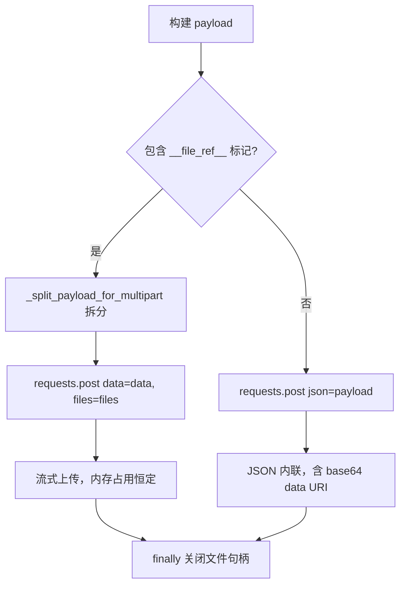

# 26 — evaluation_api_client 适配

> **所属步骤**：04_执行测试 → backend  
> **改造类型**：修改  
> **涉及文件**：`backend/utils/evaluation_api_client.py`

---

## 背景

`evaluation_api_client.py` 负责构建发送到 `eval_server` 的 HTTP 请求体。现有请求体格式针对 WER/SER/DER 等标准评估类型设计，需要扩展以支持 `llm_judge` 新类型，以及多轮对话的数据结构。

---

## 改造内容

### 1. 现有 `build_payload()` 签名

```python
def build_payload(
    self,
    task_type: str,
    algorithm_result: dict,
    ref_texts: dict,
    dim_data: dict,
    **kwargs
) -> dict:
```

### 2. 新增类型分支

```python
def build_payload(self, task_type, algorithm_result, ref_texts, dim_data, **kwargs):
    round_number = kwargs.get('round_number')

    # 如果是多轮评估，提取单轮数据
    if round_number is not None and isinstance(algorithm_result, dict):
        rounds = algorithm_result.get('rounds', [])
        if round_number < len(rounds):
            round_data = rounds[round_number]
            output_text = round_data.get('output', {}).get('asr_text', '')
        else:
            output_text = ''
    else:
        output_text = self._extract_output_text(algorithm_result, dim_data)

    ref_text = self._extract_ref_text(ref_texts, dim_data)

    if task_type == 'wer':
        return self._build_wer_payload(output_text, ref_text, dim_data)
    elif task_type == 'ser':
        return self._build_ser_payload(output_text, ref_text, dim_data)
    elif task_type == 'llm_judge':
        return self._build_llm_judge_payload(output_text, ref_text, dim_data)
    else:
        return self._build_generic_payload(task_type, output_text, ref_text, dim_data)
```

### 3. LLM Judge payload

```python
def _build_llm_judge_payload(self, output_text, ref_text, dim_data):
    api_settings = dim_data.get('api_settings', {})

    return {
        'task_type': 'llm_judge',
        'task_params': {
            'hypothesis': output_text,
            'reference': ref_text,
            'model': api_settings.get('model', 'gpt-4'),
            'prompt_template': api_settings.get('promptTemplate', ''),
            'max_tokens': api_settings.get('maxTokens', 1024),
            'temperature': api_settings.get('temperature', 0.1),
            'scoring_criteria': api_settings.get('scoringCriteria', []),
        }
    }
```

### 4. 通用 fallback payload

```python
def _build_generic_payload(self, task_type, output_text, ref_text, dim_data):
    """未明确适配的类型使用通用结构"""
    return {
        'task_type': task_type,
        'task_params': {
            'hypothesis': output_text,
            'reference': ref_text,
            **dim_data.get('api_settings', {}),
        }
    }
```

### 5. 请求体结构对比

| 类型 | task_type | task_params 关键字段 |
|------|-----------|-------------------|
| WER | `wer` | `asr_ref`, `asr_result`, `source_lang`, `target_lang` |
| SER | `ser` | `asr_ref`, `asr_result`, `source_lang`, `target_lang` |
| LLM Judge | `llm_judge` | `hypothesis`, `reference`, `model`, `prompt_template`, `max_tokens`, `temperature` |
| DER | `der` | `rttm_ref`, `stm_ref`, `rttm_res`, `stm_res` |

### 6. 大文件流式上传（multipart/form-data）

当设备/API/参考参数为音频文件路径时，评估服务需要读取文件内容。小文件以内联 base64 data URI 方式嵌入 JSON payload；大文件（超过 `MAX_INLINE_FILE_SIZE`）则自动切换为 multipart/form-data 流式上传，避免内存爆炸。

#### 6.1 大小限制常量

```python
MAX_INLINE_FILE_SIZE = 20 * 1024 * 1024  # 20MB
```

#### 6.2 文件读取与 data URI 转换

`_read_file_as_data_uri` 方法统一处理文件读取逻辑：

- 文件不存在时，原样返回路径字符串
- 文件大小超过 `MAX_INLINE_FILE_SIZE` 时，返回 `__file_ref__:<文件路径>` 标记，触发 multipart 上传路径
- 二进制音频文件（.wav/.mp3/.flac 等）编码为 `data:audio/wav;base64,...` 格式
- 文本文件直接以 UTF-8 字符串返回

```python
def _read_file_as_data_uri(self, file_path):
    if not os.path.isfile(file_path):
        return file_path
    file_size = os.path.getsize(file_path)
    if file_size > self.MAX_INLINE_FILE_SIZE:
        self._log(level='WARNING',
                  content=f'文件 {file_path} 大小 {file_size / 1024 / 1024:.1f}MB 超过限制，使用文件引用')
        return '__file_ref__:' + file_path
    # ... 读取并编码为 data URI ...
```

#### 6.3 multipart 自动切换

`make_api_request` 方法在发送 POST 请求前检测 payload 中是否包含 `__file_ref__:` 标记：

- **包含标记**：调用 `_split_payload_for_multipart` 将 payload 拆分为 `data`（JSON 字段）和 `files`（文件流），使用 `requests.post(url, data=data, files=files)` 流式上传，移除 `Content-Type` 头让 requests 自动设置 boundary
- **不包含标记**：保持原有 JSON 方式 `requests.post(url, json=payload)`

```python
def make_api_request(self, url, method, headers, payload, timeout=10):
    file_handles = []
    try:
        if method == 'GET':
            resp = requests.get(url, params=payload, headers=request_headers, timeout=timeout)
        else:
            if self._has_file_refs(payload):
                data, files = self._split_payload_for_multipart(payload)
                file_handles = [fh for (_, fh, _) in files.values()]
                request_headers.pop('Content-Type', None)
                resp = requests.post(url, data=data, files=files, headers=request_headers, timeout=timeout)
            else:
                resp = requests.post(url, json=payload, headers=request_headers, timeout=timeout)
        # ... 响应处理 ...
    finally:
        for fh in file_handles:
            try:
                fh.close()
            except Exception:
                pass
    return resp_data
```

#### 6.4 文件引用检测与 payload 拆分

- `_has_file_refs(payload)`：递归检测 payload 中是否存在 `__file_ref__:` 前缀字符串
- `_split_payload_for_multipart(payload)`：将 payload 拆分为 `data`（普通字段，dict/list 序列化为 JSON 字符串）和 `files`（文件流句柄，含文件名和 MIME 类型）

#### 6.5 上传方式决策流程



### 7. 日志安全防护

#### 7.1 问题

评估 payload 中可能包含 base64 编码的音频数据（体积膨胀约 33%），直接写入日志会导致日志文件爆炸。

#### 7.2 解决方案

新增 `_truncate_payload_for_log` 静态方法，在写入日志前截断超长值：

- 字符串值超过 200 字符时，截取前 80 字符并附加 `...(N chars)` 标注原始长度
- 递归处理嵌套 dict
- 非字符串值原样保留

```python
@staticmethod
def _truncate_payload_for_log(payload, max_value_len=200):
    if not isinstance(payload, dict):
        s = str(payload)
        return s if len(s) <= max_value_len * 2 else s[:max_value_len] + '...(truncated)'
    safe = {}
    for k, v in payload.items():
        if isinstance(v, str) and len(v) > max_value_len:
            safe[k] = v[:80] + f'...({len(v)} chars)'
        elif isinstance(v, dict):
            safe[k] = evaluationApiClient._truncate_payload_for_log(v, max_value_len)
        else:
            safe[k] = v
    return safe
```

所有日志输出 payload 的位置均使用截断后的副本，确保日志体积可控。

### 8. 评估参数文件路径读取

当设备参数、API 参数或参考参数为音频文件路径时，评估服务在构建 payload 时需要读取文件内容并传递给评估服务器。`_read_file_as_data_uri` 方法在 payload 构建阶段被调用，将文件路径转换为可传输的内容：

- 小文件：内联为 base64 data URI，嵌入 JSON payload
- 大文件：返回 `__file_ref__:` 标记，由 `make_api_request` 自动切换为 multipart 流式上传

---

## 不变部分

- 现有 WER/SER/DER payload 构建不变
- 响应解析逻辑不变（由 `EvaluationResultProcessor` 处理）
- HTTP 请求方式已扩展：小文件保持 JSON POST，大文件自动切换为 multipart/form-data 流式上传

---

## 依赖关系

| 依赖文档 | 说明 |
|---------|------|
| `01_create_task新任务类型` (eval_server) | eval_server 接收端 |
| `24_evaluation_service_llm_judge分发` | 调用方 |
| `25_evaluation_service单轮评估` | 多轮评估参数传递 |
