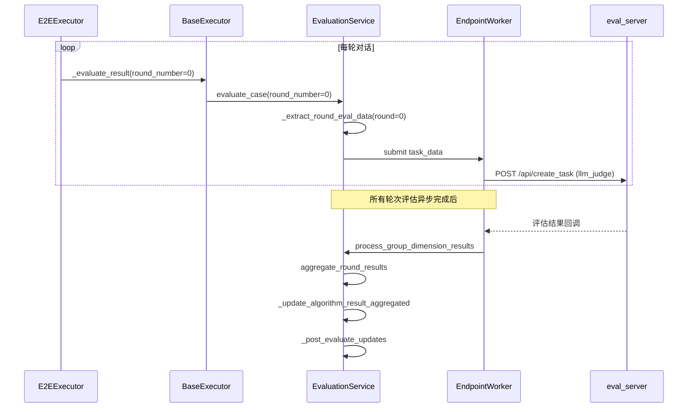

# 28 — base_executor 评估入队适配

> **所属步骤**：04_执行测试 → backend  
> **改造类型**：修改  
> **涉及文件**：`backend/utils/base_executor.py`

---

## 背景

`BaseExecutor._evaluate_result()` 是执行器调用评估的统一入口。现有实现传递整个 `TestResult` 的 `algorithm_result` 进行评估。多轮测试场景（用例配置了 `rounds` 时）需要支持按轮次编号入队单轮评估。

**触发条件**：用例配置 `round_config.evaluationEnabled = true` 时，对该轮次调用单轮评估。与算法类型无关。

---

## 改造内容

### 1. `_evaluate_result()` 新增 `round_number` 参数

```python
def _evaluate_result(
    self,
    task_id: str,
    result_id: int,
    test_case_id: int,
    case_params: dict = None,
    case_reference_params: dict = None,
    round_number: Optional[int] = None,  # 新增
):
    """
    提交评估任务。

    Args:
        round_number: 轮次编号。None=整体评估, 0-based=单轮评估
    """
```

### 2. 内部逻辑适配

```python
def _evaluate_result(self, task_id, result_id, test_case_id,
                      case_params=None, case_reference_params=None,
                      round_number=None):
    # ... 现有参数构建逻辑 ...

    # 构建完整参数
    full_case_params = {
        **(case_params or {}),
        **(case_reference_params or {}),
    }

    # 获取评估参数
    evaluation_params = CaseParameterExtractor.get_evaluation_params(
        full_case_params, algorithm_type
    )

    if not evaluation_params:
        self._log('debug', '无需评估', task_id=task_id)
        return

    # 调用评估服务，传入 round_number
    evaluation_service.evaluate_case(
        task_id=task_id,
        result_id=result_id,
        test_case_id=test_case_id,
        algorithm_result=self._get_algorithm_result(result_id),
        representative_dim_data=evaluation_params.get('dimensions', []),
        group_items=evaluation_params.get('group_items', []),
        algorithm_type=algorithm_type,
        test_type=evaluation_params.get('test_type', 'api'),
        round_number=round_number,  # 传递轮次编号
    )
```

### 3. 多轮循环中的调用方式

```python
# API 多轮循环 (api_executor.py)
for round_idx in range(total_rounds):
    # ... 发送请求、等待响应 ...

    if round_config.get('evaluationEnabled', False):
        self._evaluate_result(
            task_id=task_id,
            result_id=result_id,
            test_case_id=test_case_id,
            case_params=case_params,
            case_reference_params=case_reference_params,
            round_number=round_idx,
        )

# 所有轮次完成后，整体聚合评估（可选）
self._evaluate_result(
    task_id=task_id,
    result_id=result_id,
    test_case_id=test_case_id,
    case_params=case_params,
    case_reference_params=case_reference_params,
    round_number=None,  # 整体评估
)
```

```python
# E2E 多轮循环 (e2e_executor.py)
for round_idx, round_config in enumerate(rounds):
    # ... 播放、收集 ...

    if round_config.get('evaluationEnabled', False):
        self._evaluate_result(
            task_id=task_id,
            result_id=result_id,
            test_case_id=test_case_id,
            case_params=case_params,
            case_reference_params=case_reference_params,
            round_number=round_idx,
        )
```

### 4. 评估入队时序图



### 5. 向后兼容

```python
# 无 rounds 配置的用例调用不变
self._evaluate_result(
    task_id=task_id,
    result_id=result_id,
    test_case_id=test_case_id,
    case_params=case_params,
    case_reference_params=case_reference_params,
    # round_number 默认为 None → 整体评估
)
```

---

## 不变部分

- `_evaluate_result` 的基础参数构建逻辑不变
- `CaseParameterExtractor.get_evaluation_params()` 不变
- 未配置多轮评估的用例继续走整体评估（round_number=None）

---

## 依赖关系

| 依赖文档 | 说明 |
|---------|------|
| `25_evaluation_service单轮评估` | 评估服务端处理 |
| `12_api_executor多轮会话主循环` | API 侧调用方 |
| `17_e2e_executor多轮循环` | E2E 侧调用方 |
