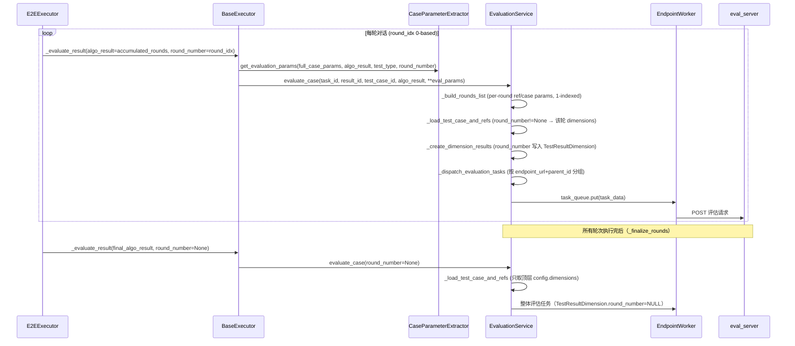

# 28 — base_executor 评估入队适配

> **所属步骤**：04_执行测试 → backend
> **改造类型**：修改
> **涉及文件**：`backend/services/execution/base_executor.py`

---

## 背景

`BaseExecutor._evaluate_result()` 是执行器调用评估的统一入口，负责把用例配置 + 算法结果组装成评估参数，提交给 `EvaluationService.evaluate_case()`。多轮测试场景（用例配置了 `rounds` 时）支持按轮次编号入队单轮评估（`round_number` 0-indexed），整体评估传 `round_number=None`。

---

## `_evaluate_result()` 完整签名（实际代码）

```python
def _evaluate_result(self, task_id, result_id, test_case_id, algo_result, case_config=None,
                    case_reference_params=None, algorithm_type='translation', test_type='api',
                    case_algorithm_params=None, round_number=None,
                    reference_params_col=None):
    """提交评估 - 通用方法

    Args:
        task_id: 任务ID
        result_id: 结果ID
        test_case_id: 用例ID
        algo_result: 算法结果
        case_config: 用例配置
        case_reference_params: 参考参数
        algorithm_type: 算法类型
        test_type: 测试类型 ('api' 或 'e2e')
        case_algorithm_params: 用例算法参数 (从 config.rounds[].algorithmParams 获取)
        round_number: 轮次编号 (None=整体评估, 0-indexed)
        reference_params_col: 按轮参考文本独立列（E2E 多轮场景）
    """
```

> **注意**：与早期设计相比，`algo_result` 是必传位置参数（不再由内部从 DB 读取），并新增 `case_config` / `case_algorithm_params` / `reference_params_col` 参数。

---

## 内部逻辑（实际代码）

### 1. 参数合并

```python
case_params = case_config or {}
algorithm_params = case_params.get('algorithm_params', case_params)

# case_algorithm_params：list[{field_code, field_value}] → dict 后合并进 algorithm_params
if case_algorithm_params:
    if isinstance(case_algorithm_params, list):
        case_algorithm_params_dict = {}
        for item in case_algorithm_params:
            if isinstance(item, dict) and 'field_code' in item:
                case_algorithm_params_dict[item['field_code']] = item.get('field_value')
        case_algorithm_params = case_algorithm_params_dict

    if isinstance(algorithm_params, dict):
        algorithm_params = {**case_algorithm_params, **algorithm_params}
    else:
        algorithm_params = case_algorithm_params

# reference_params：优先用调用方传入的 case_reference_params
if case_reference_params:
    reference_params = case_reference_params
else:
    reference_params = case_params.get('reference_params', {})
```

### 2. 构建 full_case_params 并提取评估参数

```python
full_case_params = {
    'algorithm_type': algorithm_type,
    'algorithm_params': algorithm_params,
    'reference_params': reference_params,
    'reference_params_col': reference_params_col,
    'rounds': case_config.get('rounds') if case_config else None,
}

eval_params = CaseParameterExtractor.get_evaluation_params(
    case_config=full_case_params,
    algorithm_result=algo_result,
    test_type=test_type,
    round_number=round_number
)

eval_params['algorithm_type'] = algorithm_type
eval_params['test_type'] = test_type
if round_number is not None:
    eval_params['round_number'] = round_number
if reference_params_col is not None:
    eval_params['reference_params_col'] = reference_params_col
```

### 3. 提交评估服务

```python
evaluation_service.evaluate_case(
    task_id, result_id, test_case_id, algo_result,
    **eval_params
)
```

---

## E2E 多轮循环中的触发条件（实际代码）

位于 `e2e_executor.py` → `_build_and_submit_round_data()` 尾部。

### 触发条件：`evaluation.enabled` + `dimensions` 双检查（snake_case）

```python
# 检查本轮 evaluation.enabled 开关，enabled 为 False 时跳过单轮评估
# 同时检查本轮 dimensions 是否为空，为空时也跳过单轮评估
_round_eval_enabled = True
if case_config:
    _case_rounds = case_config.get('rounds', [])
    if _case_rounds and round_idx < len(_case_rounds):
        _round_eval = _case_rounds[round_idx].get('evaluation', {})
        if isinstance(_round_eval, dict):
            if _round_eval.get('enabled', True) is False:
                _round_eval_enabled = False
            elif not _round_eval.get('dimensions'):
                _round_eval_enabled = False

if _round_eval_enabled:
    self._evaluate_result(
        task_id=task_id, result_id=result_id, test_case_id=test_case_id,
        algo_result=current_algo_result, case_config=case_config or {},
        case_reference_params=case_reference_params,
        algorithm_type=algorithm_type, test_type='e2e',
        case_algorithm_params=data.get('case_algorithm_params'),
        round_number=round_idx,
        reference_params_col=data.get('reference_params_col'),
    )
```

**规则表**：

| 条件 | 行为 |
|------|------|
| `evaluation.enabled` 缺省 | 默认 `True`（启用） |
| `evaluation.enabled = false` | 跳过单轮评估 |
| `evaluation.dimensions` 为空/缺失 | 跳过单轮评估 |
| 两者都满足 | 以 `round_number=round_idx`（0-based）入队单轮评估 |

> **命名注意**：配置读取的是 snake_case 的 `evaluation.enabled` / `evaluation.dimensions`，不存在 camelCase 的 `evaluationEnabled` 字段。

### algo_result 增量构建（保证单轮评估可索引）

```python
round_data = {
    'round': round_idx,
    'input': {'audio_name': audio_name, 'audio_path': audio_path, 'type': 'audio'},
    'output': round_output,
    'latency': latency,
    'evaluation': {},
}

# 构建含已执行轮次 + 本轮的 algo_result，使 _extract_round_eval_data(rounds[round_idx]) 能正确索引
accumulated_rounds = list(rounds_data) + [round_data]
current_algo_result = {
    'test_type': 'e2e',
    'algorithm_type': algorithm_type,
    'total_rounds': len(rounds),
    'rounds': accumulated_rounds,
    'aggregated': {},
}
```

### 整体评估触发（_finalize_rounds 阶段）

```python
# _has_round_dims：任一轮 evaluation.enabled 且 dimensions 非空
# _has_overall_dims：顶层 config.dimensions 非空

# 整体评估：仅当配置了顶层 config.dimensions（多轮聚合维度）时才提交
if execution_success and _has_overall_dims:
    self._evaluate_result(
        task_id=task_id, result_id=result_id, test_case_id=test_case_id,
        algo_result=final_algo_result, case_config=case_config or {},
        case_reference_params=case_reference_params,
        algorithm_type=algorithm_type, test_type='e2e',
        case_algorithm_params=case_algorithm_params,
        round_number=None,   # 整体评估
        reference_params_col=reference_params_col,
    )
```

---

## `_process_results` 中的 round_number 透传

API 执行器（`base_executor._process_results`）从每轮结果中透传 round_number：

```python
eval_item = {
    'result_id': result_id,
    'res': res,
    'test_case_id': test_case_id
}
# 多轮场景: 从结果中提取 round_number 透传到评估阶段
if 'round_number' in res:
    eval_item['round_number'] = res['round_number']
```

---

## 评估入队时序图



---

## 向后兼容

```python
# 无 rounds 配置的用例调用不变
self._evaluate_result(
    task_id=task_id,
    result_id=result_id,
    test_case_id=test_case_id,
    algo_result=algo_result,
    # round_number 默认 None → 整体评估
)
```

---

## 不变部分

- `CaseParameterExtractor.get_evaluation_params()` 接口不变
- `EvaluationService.evaluate_case()` 入口签名不变（kwargs 扩展）
- 未配置多轮评估的用例继续走整体评估（round_number=None）

---

## 依赖关系

| 依赖文档 | 说明 |
|---------|------|
| `25_evaluation_service单轮评估` | 评估服务端处理 |
| `12_api_executor多轮会话主循环` | API 侧调用方 |
| `17_e2e_executor多轮循环` | E2E 侧调用方 |
