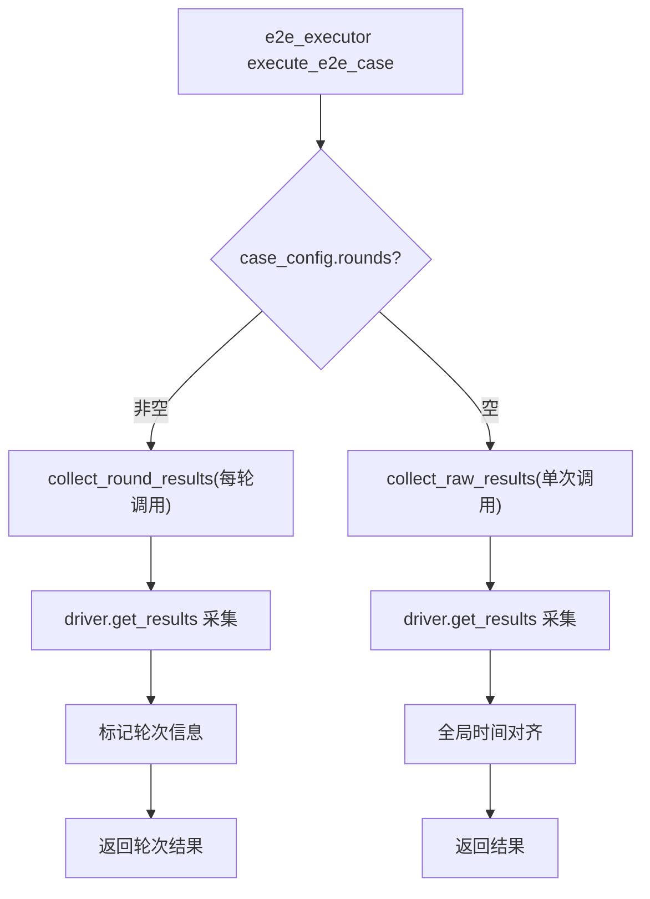

# 32 — device_result_collector 多轮采集

> **所属步骤**：04_执行测试 → backend  
> **改造类型**：修改  
> **涉及文件**：`backend/utils/device_result_collector.py`

---

## 背景

`DeviceResultCollector` 负责从设备驱动采集原始结果并进行时间对齐。多轮场景下（用例配置了 `rounds`），每轮需要独立采集结果并与该轮的参考参数对齐，而非一次性全局对齐。

现有 `collect_raw_results()` 方法设计为单次采集所有设备结果，使用全局时间对齐算法（content_alignment、max_overlap、gap_pattern 等）。多轮场景需要每轮独立对齐。

---

## 改造内容

### 1. 新增 `collect_round_results()` 方法

```python
def collect_round_results(
    self,
    task_id: str,
    test_case_id: int,
    device_info_list: list[dict],
    round_idx: int,
    round_config: dict,
    round_start_time: float,
) -> list[dict]:
    """
    采集单轮对话的设备结果。

    与 collect_raw_results 的区别：
    - 结果关联到具体轮次
    - 时间对齐范围限定在本轮
    - 参考参数来自本轮的 round_config

    Returns:
        本轮的设备结果列表
    """
```

### 2. 核心逻辑

```python
def collect_round_results(self, task_id, test_case_id, device_info_list,
                           round_idx, round_config, round_start_time):
    # 1. 采集原始结果（复用现有逻辑）
    raw_results = []
    for dev in device_info_list:
        driver = dev.get('driver')
        if driver is None:
            continue

        try:
            result = driver.get_results()
            if result:
                if isinstance(result, list):
                    for item in result:
                        item_copy = copy.deepcopy(item)
                        item_copy['_device_id'] = dev['device_id']
                        item_copy['_round'] = round_idx
                        raw_results.append(item_copy)
                elif isinstance(result, dict):
                    result_copy = copy.deepcopy(result)
                    result_copy['_device_id'] = dev['device_id']
                    result_copy['_round'] = round_idx
                    raw_results.append(result_copy)
        except Exception as e:
            logger.warning(f'设备 {dev.get("device_name")} 结果采集失败: {e}')

    # 2. 标记轮次信息
    for result in raw_results:
        result['_round_idx'] = round_idx
        result['_round_start_time'] = round_start_time
        result['_round_end_time'] = time.time()

    return raw_results
```

### 3. 多轮时间对齐策略

```python
def _align_round_results(self, raw_results, round_config, round_start_time):
    """
    对单轮结果进行时间对齐。

    策略：
    - 使用本轮的参考参数（round_config 中的 reference text）
    - 对齐窗口限定在本轮时间范围内
    """
    ref_text = round_config.get('referenceText', '')

    if not ref_text:
        return raw_results

    # 复用现有对齐算法，但限定范围
    aligned = self._calculate_effective_offset_for_single_result(
        raw_results=raw_results,
        reference_params={'text': ref_text},
        playback_time_offsets={'round_offset': round_start_time},
        algorithm_type='voice_llm',
    )

    return aligned
```

### 4. 与现有 `collect_raw_results` 的调用关系



### 5. 多轮结果合并

```python
# e2e_executor 中：
all_round_device_results = []

for round_idx, round_config in enumerate(rounds):
    round_results = collector.collect_round_results(
        task_id, test_case_id, device_info_list,
        round_idx, round_config, round_start_time
    )
    all_round_device_results.append({
        'round': round_idx,
        'results': round_results,
    })

# 最终写入 algorithm_result
```

### 6. 结果数据结构

```json
{
  "round": 0,
  "results": [
    {
      "_device_id": 3,
      "_round": 0,
      "_round_start_time": 1717560000.0,
      "_round_end_time": 1717560005.5,
      "asr_text": "今天天气怎么样",
      "stm_content": "file1 1 speaker1 0.0 2.5 <o> 今天天气怎么样"
    }
  ]
}
```

---

## 不变部分

- `collect_raw_results()` 现有接口不变（未配置 `rounds` 的用例继续使用）
- 时间对齐核心算法不变（content_alignment、max_overlap 等）
- `convert_results()` 不变
- `build_case_result_log()` 不变

---

## 依赖关系

| 依赖文档 | 说明 |
|---------|------|
| `22_E2E每轮结果收集` | 调用方（e2e_executor） |
| `23_E2E测试结果存储结构` | 结果存储格式 |
| `17_e2e_executor多轮循环` | 多轮循环入口 |
