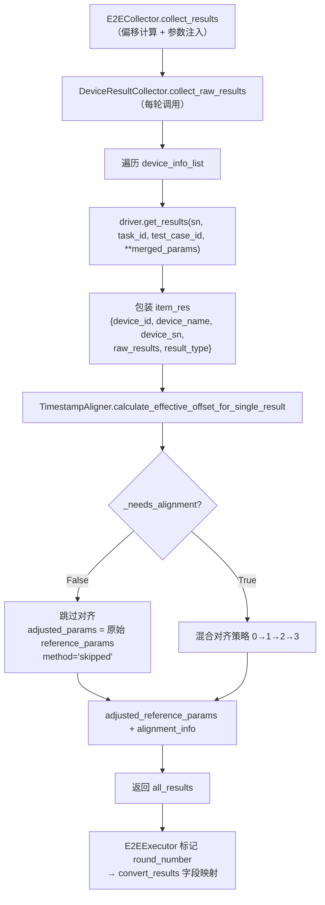

# 32 — device_result_collector 多轮采集

> **所属步骤**：04_执行测试 → backend
> **改造类型**：修改
> **涉及文件**：
> - 采集器：`backend/services/device/device_result_collector.py`（`DeviceResultCollector`）
> - 时间对齐器：`backend/services/device/timestamp_aligner.py`（`TimestampAligner`，对齐逻辑已从 collector 拆出）

---

## 1. 背景

`DeviceResultCollector` 负责从设备驱动采集原始结果并进行时间对齐。多轮场景下（用例配置了 `rounds`），每轮需要独立采集结果并与该轮的参考参数对齐，而非一次性全局对齐。

**当前架构**：对齐算法已拆分到独立的 `TimestampAligner` 类；collector 专注采集与包装。多轮采集的编排由 `E2ECollector`（见 [22_E2E每轮结果收集.md](22_E2E每轮结果收集.md)）完成。

---

## 2. 组件与调用关系



---

## 3. `collect_raw_results()`：生产链路使用的方法

```python
def collect_raw_results(self, task_id, test_case_id, device_info_list, extra_params,
                        log_callback=None, **kwargs):
    """采集原始结果

    Returns:
        list: 原始结果列表
    """
    playback_time_offsets = extra_params.get('playback_time_offsets', {})
    reference_params = extra_params.get('reference_params')
    algorithm_type = extra_params.get('algorithm_type') or kwargs.get('algorithm_type')

    for info in device_info_list:
        res = {'device_id': ..., 'device_name': ..., 'device_sn': ...}
        raw_results = info['driver'].get_results(
            info['device_sn'], task_id=task_id, test_case_id=test_case_id,
            **{**extra_params, **kwargs}   # 含 round_algo_params、毫秒时间戳等
        )

        # 列表结果：逐条包装；单条结果：直接包装
        item_res = {**res, 'raw_results': copy.deepcopy(result_item),
                    'result_type': result_item.get('result_type', 'default')}

        # 时间对齐（委托 TimestampAligner）
        alignment_result = self._aligner.calculate_effective_offset_for_single_result(
            result_item, reference_params, playback_time_offsets, algorithm_type
        )
        item_res['adjusted_reference_params'] = alignment_result.get('adjusted_params') or reference_params or []
        item_res['alignment_info'] = alignment_result.get('alignment_info')
```

**要点**：

| 要点 | 说明 |
| --- | --- |
| 参数透传 | `merged_params = {**extra_params, **kwargs}` 全部传给 `driver.get_results`，驱动按需取用（如 `playback_start_time_ms`） |
| 结果包装 | 每条结果独立包装 `{device_id, device_name, device_sn, raw_results, result_type}`；列表结果逐条展开 |
| 深拷贝 | `copy.deepcopy(result_item)` 隔离驱动内部状态 |
| 对齐委托 | 对齐逻辑在 `TimestampAligner`（见第 5 节），collector 只消费其返回值 |

---

## 4. `collect_round_results()`：已实现但未被 executor 使用

```python
def collect_round_results(self, task_id, test_case_id, device_info_list,
                          round_idx, round_config, round_start_time, log_callback=None):
    """
    采集单轮对话的设备结果。

    与 collect_raw_results 的区别：
    - 结果关联到具体轮次
    - 时间对齐范围限定在本轮
    - 参考参数来自本轮的 round_config
    """
    # driver.get_results(sn, task_id, test_case_id)   # 不透传 extra_params
    # 内部标记 _round / _round_start_time / _round_end_time
```

| 特性 | `collect_raw_results()`（**当前使用**） | `collect_round_results()`（未使用） |
|------|-------------------------------------|----------------------------------|
| 调用方 | `E2ECollector.collect_results()` | 无 |
| 轮次标记 | 外部手动标记 `round_number` | 内部自动标记 `_round`/`_round_start_time`/`_round_end_time` |
| extra_params 透传 | 支持（播放偏移/毫秒时间戳/轮次算法参数） | 不支持 |
| adjusted_reference_params | 支持 + alignment_info | 不支持 |
| 成熟度 | 生产验证 | 保留备用 |

---

## 5. TimestampAligner：时间对齐策略

`backend/services/device/timestamp_aligner.py`，对齐入口：

```python
def calculate_effective_offset_for_single_result(self, raw_results, reference_params,
                                                 playback_time_offsets, algorithm_type=None):
    """为单个设备结果计算 effective_offset 并调整参考参数

    采用混合对齐策略（按优先级）：
    0. 文本内容对齐 → 1. 最大重叠 → 2. 间隙模式 → 3. 首个时间戳 → 4. 兜底
    """
```

### 5.1 策略链

| 优先级 | 策略 | 说明 |
| --- | --- | --- |
| 0 | 文本内容对齐 `_try_content_alignment` | 按文本匹配计算偏移，置信度需达阈值 `CONTENT_ALIGNMENT_CONFIDENCE_THRESHOLD` |
| 1 | 最大重叠 `_try_max_overlap` | 时间线最大重叠对齐 |
| 2 | 间隙模式 `_try_gap_pattern` | 按时间间隙模式匹配 |
| 3 | 首个时间戳 `_try_first_timestamp` | 兜底，含丢句感知（missing_segment） |

对齐过程中提取设备/参考时间线段（`_extract_segments_from_result` / `_extract_segments_from_reference`），检测结果与参考的**段缺失**情况并写入 `alignment_info`。

### 5.2 对齐前置判断（_needs_alignment）

```python
def _needs_alignment(self, algorithm_type, reference_params):
    """判断是否需要进行时间对齐"""
    if not reference_params:
        return False
    # 1. 参考参数中必须有 rttm/stm 类型
    has_time_series_ref = any(
        p.get('type') in ('rttm', 'stm') for p in reference_params if isinstance(p, dict)
    )
    if not has_time_series_ref:
        return False
    # 2. 设备输出字段中必须有 stm/rttm 类型
    stm_codes = self.field_mapper.get_device_output_field_codes_by_type(algorithm_type, 'stm')
    rttm_codes = self.field_mapper.get_device_output_field_codes_by_type(algorithm_type, 'rttm')
    if not (stm_codes or rttm_codes):
        return False
    return True   # FieldMapper 查询异常时保守对齐（True）
```

| 条件 | 结果 |
|------|------|
| reference_params 为空 | 不对齐 |
| 参考参数中无 rttm/stm 类型 | 不对齐 |
| 设备输出字段中无 stm/rttm 类型 | 不对齐 |
| 以上均满足 | 进行对齐 |
| FieldMapper 查询异常 | 保守对齐（返回 True） |

跳过时 `alignment_info.method = 'skipped'`，`adjusted_params` 原样返回。

---

## 6. adjusted_reference_params 全覆盖保证

所有结果（无论是否对齐）统一包含 `adjusted_reference_params`，下游消费者可无差别访问。

### 6.1 覆盖路径

| 代码路径 | 处理方式 | 位置 |
|---------|---------|------|
| 对齐成功 | `alignment_result['adjusted_params']` | collector 97/112 行 |
| 对齐跳过（_needs_alignment=False） | aligner 返回原始 reference_params；collector `or reference_params or []` 兜底 | timestamp_aligner 95-97 行 |
| 驱动异常分支 | `res.setdefault('adjusted_reference_params', reference_params or [])` + `alignment_info={'method':'error','offset':0.0}` | collector 118-119 行 |
| 重评估链路 | `DeviceResultReextractor._calculate_adjusted_reference_params()` 重新计算 | device_result_reextractor.py |

### 6.2 关键代码（collector 侧兜底）

```python
# 正常路径兜底（list / dict 结果分支相同）
item_res['adjusted_reference_params'] = alignment_result.get('adjusted_params') or reference_params or []
item_res['alignment_info'] = alignment_result.get('alignment_info')

# 异常路径兜底
res.setdefault('adjusted_reference_params', reference_params or [])
res.setdefault('alignment_info', {'method': 'error', 'offset': 0.0})
```

---

## 7. `convert_results()`：字段映射

采集并标记 `round_number` 后，executor 调用 `get_device_result_collector().convert_results(all_results, algorithm_type)`：

- 按 FieldMapper 的 source_param → target_param 映射，把 `raw_results` 内的设备原始字段映射为统一 target 字段（如 `output_text`）；
- 维度专属输出写入 `target__dim_N` key（供评估阶段按维度取值）；
- 驱动覆写 `get_final_results` 的返回值也复用同一包装 + convert_results 链路（见文档 23 第 6 节）。

---

## 8. 不变部分

- 时间对齐核心算法不变（content_alignment、max_overlap、gap_pattern 等，仅物理位置拆至 TimestampAligner）
- `collect_raw_results()` 接口不变（单次/多轮用例共用）
- `convert_results()`、`build_case_result_log()` 不变
- 未配置 `rounds` 的用例继续使用同一 `collect_raw_results()` 流程

---

## 9. 依赖关系

| 依赖文档 | 说明 |
|---------|------|
| [22_E2E每轮结果收集](22_E2E每轮结果收集.md) | 调用方（E2ECollector 编排） |
| [23_E2E测试结果存储结构](23_E2E测试结果存储结构.md) | 结果包装与存储格式 |
| [17_e2e_executor多轮循环](17_e2e_executor多轮循环.md) | 多轮循环入口 |
