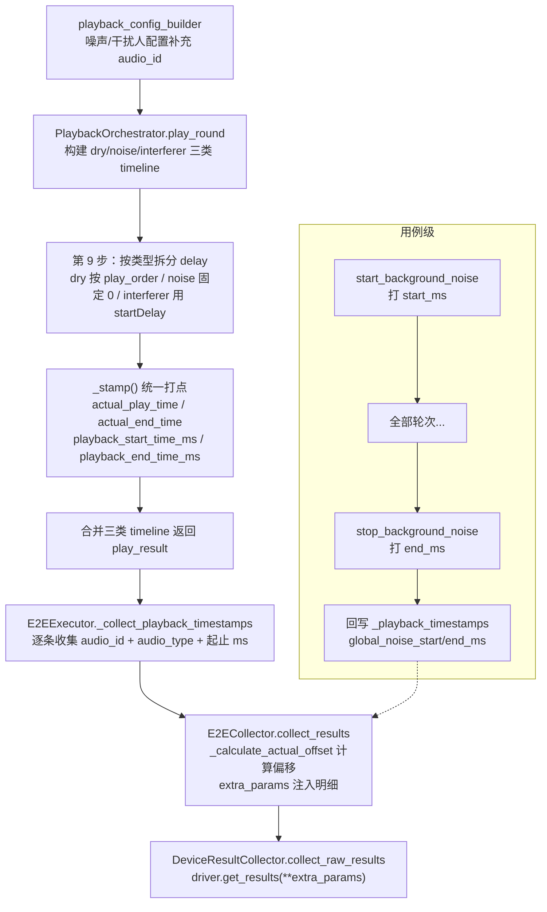

# 33 — 播放链路起止时间戳记录（主讲人 / 噪声 / 干扰人 / 全局背景噪声）

> **所属步骤**：04_执行测试 → backend
> **改造类型**：功能扩展（既有主讲人时间戳 → 四类音频全覆盖）
> **涉及文件**：
> - 时间轴构建：`backend/services/audio/audio_timeline.py` → `build_noise_timelines` / `build_interferer_timelines`
> - 配置构建：`backend/services/audio/playback_config_builder.py` → 噪声/干扰人配置补充 `audio_id`
> - 播放编排：`backend/services/audio/playback_orchestrator.py` → `play_round` 第 9 步、`start_background_noise` / `stop_background_noise`
> - 时间戳收集：`backend/services/execution/e2e_executor.py` → `_collect_playback_timestamps()`
> - 参数透传：`backend/services/execution/e2e_collector.py` → `collect_results()` / `_calculate_actual_offset()`

---

## 1. 背景

设备驱动做时延统计（如 RTTM 说话人分段与播放音频对齐）时，需要知道**录音窗口内每一段音频实际播放的起止时刻**。改造前只有主讲人（dry）音频记录了毫秒级起止时间戳，噪声与干扰人没有时间戳，设备端无法区分录音中的噪声段/干扰段，也无法校验干扰注入的时序正确性。

本设计将时间戳记录扩展到**四类音频**：

| audio_type | 含义 | 播放特征 |
| --- | --- | --- |
| `dry` | 主讲人（目标人） | 按 speaker 感知交叠公式计算 delay，逐条播放 |
| `noise` | 轮次级背景噪声 | delay=0 立即播放、强制 loop，持续到本轮硬停止 |
| `interferer` | 干扰人 | 按 `startDelay`（config['delay']）延迟播放，可 loop |
| 全局背景噪声（单独字段） | 跨轮次持续播放的用例级噪声 | 用例开始前启动，用例结束后停止 |

---

## 2. 数据流总览



---

## 3. 各层设计

### 3.1 时间轴构建（audio_timeline.py）

在既有 `build_audio_timelines`（dry，L331）之后新增两个纯函数：

| 函数 | 行号 | 语义 |
| --- | --- | --- |
| `build_noise_timelines(noise_configs)` | L408 | 噪声立即播放（start=0）且强制循环，end=音频时长；`audio=None`，`is_noise=True`，`audio_type='noise'` |
| `build_interferer_timelines(interferer_configs)` | L438 | 干扰人 start=`config['delay']`（秒），end=start+时长；`is_noise=False`，`audio_type='interferer'` |

要点：
- 纯函数、零副作用，duration 缺省时回退 `get_audio_duration(file_path)` 实测。
- `audio` 字段为 `None`（无 ORM 对象），audio_id 由 `config['audio_id']` 携带（见 3.2）。

### 3.2 配置层 audio_id 补齐（playback_config_builder.py）

| 构建函数 | 变更 |
| --- | --- |
| `build_noise_play_configs` | 配置 dict 新增 `'audio_id': n_config.get('audio_id')` |
| `build_interferer_configs` | 配置 dict 新增 `'audio_id': audio_info.get('id')` |

dry 配置沿用既有来源（`build_audio_timelines` 的 `audio` ORM 对象携带 id）。

### 3.3 播放编排打点（playback_orchestrator.py）

#### play_round 第 9 步（L208-265）

1. **delay 按类型拆分**（L220-230）——关键陷阱：
   - `noise` / `interferer` 的 `play_order` 缺省均为 0，若沿用旧 `{play_order: delay}` 统一索引，会**覆盖主讲人首条的 delay**。
   - 拆分为：`dry_delay_map`（按 play_order）、`noise_delays`（按配置顺序）、`interferer_delays`（按配置顺序）。
2. **统一打点函数 `_stamp`**（L232-239）：写入 `audio_type`、`actual_play_time`/`actual_end_time`（秒）与 `playback_start_time_ms`/`playback_end_time_ms`（毫秒）。
3. **三类打点语义**：

| 类型 | start | end |
| --- | --- | --- |
| dry | 播放开始 + 时间轴 delay（保持原语义） | 本轮硬停止时刻 |
| noise | 播放开始 + 0 | 本轮硬停止时刻（循环至脏停止） |
| interferer | 播放开始 + startDelay | 非循环：`min(start+时长, 停止时刻)`；循环或时长未知：停止时刻 |

4. 三类 timeline 合并返回（L264-265），`total_duration` 等待逻辑仍只基于主讲人（不变）。

#### 全局背景噪声启停打点

| 位置 | 行为 |
| --- | --- |
| `__init__` | 新增 `self._bg_noise_timestamps = {}`（task_id → `{audio_id, start_ms, end_ms}`） |
| `start_background_noise` | 等待 `playback_started_event` 真正开始后打 `start_ms`（首次启动才记录，重复调用不覆盖） |
| `stop_background_noise` | 发出 `stop_event` 前打 `end_ms` |
| `get_background_noise_timestamps(task_id)` | 查询接口；未启动返回 `None`，播放中 `end_ms=None` |

### 3.4 时间戳收集（e2e_executor.py `_collect_playback_timestamps`，L562-610）

- **删除旧死代码**：原 `if timeline.get('is_noise'): continue` 在旧设计中永远不命中（timeline 里根本没有噪声条目）；扩展后 noise 进入 timeline，改为真实纳入。
- **audio_id 解析顺序**：`timeline['audio']` ORM 对象 → `config['audio_id']` 兜底 → 仍为空则跳过。
- **audio_type 解析**：`timeline['audio_type']` 优先，缺省按 `is_noise` 推导，兜底 `'dry'`（兼容未打点的调用方）。
- 收集条目结构见 §4；同时以三类条目的 min(start_ms)/max(end_ms) 更新 `current_round_start_ms` / `current_round_end_ms`。
- **全局噪声桥接**：`start_background_noise` 成功后把 `start_ms`/`audio_id` 写入 `self._playback_timestamps[task_id]`（`global_noise_start_ms` / `global_noise_audio_id`）；finally 中 `stop_background_noise` 后回写 `global_noise_end_ms`。

### 3.5 参数透传（e2e_collector.py）

`collect_results()` 在 `extra_params` 注入两组字段（L44-71）：

1. `playback_time_offsets`：`_calculate_actual_offset` 计算（L121），**key 改为 `{audio_type}_{audio_id}_{play_order}`**——防止同一音频既当主讲人又当噪声/干扰人时的键冲突；取值端只消费 `values[0]['offset']`，key 格式变化无影响。
2. `playback_timestamps_detail`（L54）与 `global_noise_timestamps`（L67）：结构见 §4。

---

## 4. 数据契约（extra_params 注入给设备驱动）

### 4.1 playback_timestamps_detail（轮次级，每轮刷新）

```json
[
  {
    "audio_id": 12,
    "audio_type": "dry | noise | interferer",
    "play_order": 0,
    "start_ms": 1730000000000,
    "end_ms": 1730000012000
  }
]
```

### 4.2 global_noise_timestamps（用例级，跨所有轮次）

```json
{
  "audio_id": 15,
  "start_ms": 1729999990000,
  "end_ms": 1730000060000
}
```

### 4.3 audio_play_times 内部账本条目（executor 持有）

```python
{
    'audio_id', 'audio_type', 'play_order',
    'actual_time', 'actual_end_time',           # 秒
    'playback_start_time_ms', 'playback_end_time_ms',
    'actual_start_offset',                      # 理论时间轴偏移（秒）
    'is_overlap', 'overlap_rate', 'overlap_time'  # 仅对 dry 有意义
}
```

---

## 5. 边界情况与语义说明

| 场景 | 行为 |
| --- | --- |
| 干扰人音频比轮次短且非循环 | end 按时长推算（`min(start+duration, 停止时刻)`） |
| 干扰人 loop 或时长未知 | end=本轮硬停止时刻 |
| 轮次级噪声 | 恒 loop，end=硬停止时刻（"脏停止"语义） |
| 用例配置 `has_background_noise`（全局噪声） | 轮次级噪声跳过，由 `global_noise_timestamps` 承担；`start_background_noise` 失败仅告警，继续轮次 |
| 全局噪声播放中逐轮采集 | `end_ms` 尚为 `None`，设备驱动用 `start_ms` + 本轮 `playback_end_time_ms` 界定噪声段；用例结束后最终账本补齐 `end_ms` |
| 全局噪声未配置/未启动 | 不注入 `global_noise_timestamps`，不影响原链路 |
| `start_background_noise` 重复调用 | 首次记录的 `start_ms` 不被覆盖 |
| timeline 无 audio_id | 跳过该条（不产生时间戳记录） |

## 6. 消费方

设备驱动通过 `driver.get_results(sn, task_id, test_case_id, **extra_params)` 接收：
- 每轮 `playback_timestamps_detail` + `global_noise_timestamps` → 定位录音中 dry/noise/interferer/global_noise 各段；
- `playback_time_offsets`（键含 audio_type）→ 计算实际播放偏移，用于时间对齐。
