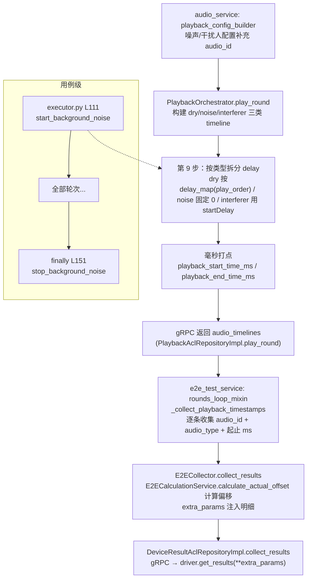

# 33 — 播放链路起止时间戳记录（主讲人 / 噪声 / 干扰人 / 全局背景噪声）

> **所属步骤**：04_执行测试 → backend
> **改造类型**：功能扩展（既有主讲人时间戳 → 四类音频全覆盖）
> **涉及文件**（V9.7.31 微服务架构）：
> - 时间轴构建：`audio_service/infrastructure/audio/audio_timeline.py` → `build_audio_timelines`（dry，L321）
> - 辅助时间轴：`audio_service/infrastructure/audio/playback_orchestrator.py` → `_build_auxiliary_audio_timelines`（L524，噪声/干扰人合并实现）
> - 配置构建：`audio_service/infrastructure/audio/playback_config_builder.py` → `build_noise_play_configs`（L347）/ `build_interferer_configs`（L401）补充 `audio_id`
> - 播放编排：`audio_service/infrastructure/audio/playback_orchestrator.py` → `play_round` 第 9 步（L216-245）、`start_background_noise`（L256）/ `stop_background_noise`（L364）
> - 时间戳收集：`e2e_test_service/application/services/e2e_executor/rounds_loop_mixin.py` → `_collect_playback_timestamps()`（L288）
> - 参数透传：`e2e_test_service/application/services/e2e_collector.py` → `collect_results()`（L20）/ `e2e_test_service/domain/services/e2e_calculation_service.py` → `calculate_actual_offset()`（L30）

---

## 1. 背景

设备驱动做时延统计（如 RTTM 说话人分段与播放音频对齐）时，需要知道**录音窗口内每一段音频实际播放的起止时刻**。改造前只有主讲人（dry）音频记录了毫秒级起止时间戳，噪声与干扰人没有时间戳，设备端无法区分录音中的噪声段/干扰段，也无法校验干扰注入的时序正确性。

本设计将时间戳记录扩展到**四类音频**：

| audio_type | 含义 | 播放特征 |
| --- | --- | --- |
| `dry` | 主讲人（目标人） | 按 speaker 感知交叠公式计算 delay，逐条播放 |
| `noise` | 轮次级背景噪声 | delay=0 立即播放、强制 loop，持续到本轮硬停止 |
| `interferer` | 干扰人 | 按 `startDelay`（config['delay']）延迟播放，可 loop |
| 全局背景噪声（单独字段） | 跨轮次持续播放的用例级噪声 | 用例开始前启动，用例结束后停止 |

---

## 2. 数据流总览

V9.7.31 中播放编排（audio_service）与执行循环（e2e_test_service）已拆分为两个微服务，`audio_timelines` 经 gRPC 序列化（audio ORM 对象退化为 dict/字符串）返回给执行侧：



---

## 3. 各层设计

### 3.1 时间轴构建（audio_service/infrastructure/audio/）

dry 时间轴沿用既有 `build_audio_timelines`（audio_timeline.py L321）；噪声/干扰人在 **V9.7.31 合并为单个静态方法** `_build_auxiliary_audio_timelines`（playback_orchestrator.py L524-542，V9.7.10 为两个独立函数）：

| 函数 | 行号 | 语义 |
| --- | --- | --- |
| `build_audio_timelines(dry_audios_info, ...)` | audio_timeline.py L321 | 主讲人时间轴（speaker 感知），dry 条目含 ORM `audio` 对象 |
| `_build_auxiliary_audio_timelines(noise_configs, interferer_configs, dry_timelines)` | playback_orchestrator.py L524 | 噪声立即播放（start=0）且 end=dry 时间轴终点；干扰人 start=`config['delay']`（秒）、end=start+时长；条目 `audio=None`、`is_noise` 按 config 推导 |

要点：
- 辅助条目为纯数据 dict（零副作用），duration 缺省回退 `build_*_configs` 已实测的值；`audio` 字段为 `None`，audio_id 由 `config['audio_id']` 携带。
- 合并入口两处：`play_round` L169-171（正式播放）与 `preview` L462-465（预览异步场景，end 用理论值）。

### 3.2 配置层 audio_id 补齐（playback_config_builder.py）

| 构建函数 | 行号 | 变更 |
| --- | --- | --- |
| `build_noise_play_configs` | L347 | 配置 dict 新增 `'audio_id': noise_audio_id`（L395） |
| `build_interferer_configs` | L401 | 配置 dict 新增 `'audio_id': interferer_audio_id`（L524，扁平/嵌套双格式解析后取 `id or audio_id`） |

dry 配置沿用既有来源（`build_dry_configs` L341 的 `'audio_id': audio_config.get('audio_id')`）。

### 3.3 播放编排打点（playback_orchestrator.py）

#### play_round 第 9 步（L216-245）

1. **delay 按类型拆分**——关键陷阱：
   - `noise` / `interferer` 的 `play_order` 缺省均为 0，若沿用旧 `{play_order: delay}` 统一索引，会**覆盖主讲人首条的 delay**。
   - V9.7.31 实现：`delay_map` 只承载 dry（L225）；辅助类型走 `is_auxiliary` 独立分支（L229-236），noise delay 固定 0、interferer delay 取 `config['delay']`。
2. **毫秒打点**（L241-245）：统一写 `playback_start_time_ms` / `playback_end_time_ms`（`int(round(秒 * 1000))`）。
3. **三类打点语义**：

| 类型 | start | end |
| --- | --- | --- |
| dry | 播放开始 + 时间轴 delay（保持原语义） | 本轮硬停止时刻 |
| noise | 播放开始 + 0 | 本轮硬停止时刻（循环至脏停止） |
| interferer | 播放开始 + startDelay | 非循环：`start+时长`；循环或时长未知：硬停止时刻 |

4. 三类 timeline 已在步骤 7 合并（L162-171），`total_duration` 等待逻辑仍只基于主讲人（不变）。预览路径 `preview`（L485-513）同样打点，end 用理论值估算。

#### 全局背景噪声启停（L256-380）

| 位置 | 行为 |
| --- | --- |
| `start_background_noise`（L256-346） | 复用 `build_noise_info({}, case_config)` 强制取用例级配置；`loop=True/is_noise=True/type='noise'`；按设备分组 `play_multi`，player_key=`global_noise_<device_index>` 注册独立 player_type；等待 `playback_started_event` 真正开始 |
| `stop_background_noise`（L364-380） | 仅对 `global_noise_*` 前缀 player 发 stop_event 并清理 |
| `has_background_noise`（L382-405） | play_round 判断是否跳过轮次级噪声的依据 |
| `_get_background_noise_device_indices`（L348-362） | 冲突检测：与全局噪声同设备的干扰人在步骤 5.1（L137-151）跳过 |

**调用时机**：`e2e_test_service/application/services/e2e_executor/executor.py` —— `_prepare_rounds` 之后、`_run_rounds_loop` 之前调用 `start_background_noise`（L111），`finally` 中调用 `stop_background_noise`（L151），均经 `PlaybackAclRepositoryImpl` gRPC 转发（playback_acl_repository_impl.py L79/L98）。

> **注意（V9.7.31 现状）**：启停方法**未打点** `start_ms`/`end_ms`，也未提供 `get_background_noise_timestamps` 查询接口（V9.7.10 已打点），详见 §7 差异 1。

### 3.4 时间戳收集（rounds_loop_mixin.py `_collect_playback_timestamps`，L288-343）

每轮 `play_round` 成功后调用（L124-126）：

- **audio_id 解析顺序**（L307-312）：`config['audio_id']` 优先（gRPC JSON 往返后 `audio` ORM 对象退化为 dict/字符串）→ `getattr(audio_obj, 'id')` → `timeline['file']` 兜底；仍为空则该条 audio_id 为 None（不跳过，字段保留）。
- **audio_type 收集**（L337-338）：`is_noise` 按 `timeline['is_noise'] or config['is_noise']` 推导；`audio_type` 取 `config['type']`。
- **轮次起止归并**（L340-343）：以全部条目的 min(start_ms)/max(end_ms) 更新 `current_round_start_ms` / `current_round_end_ms`。
- **全局噪声桥接（已补齐）**：`executor.py` 在 `start_background_noise` 成功后将 `global_noise_audio_id`/`global_noise_start_ms` 写入 `self._playback_timestamps[task_id]`（L113-117），`finally` 中 `stop_background_noise` 返回完整记录后回写 `global_noise_end_ms`（L160-163）；账本写入均为 `setdefault`/`if not in`，不覆盖已有字段。

### 3.5 参数透传（e2e_collector.py + e2e_calculation_service.py）

`collect_results()` 在 `extra_params` 注入（L48-67）：

1. `playback_time_offsets`：`E2ECalculationService.calculate_actual_offset`（domain/services/e2e_calculation_service.py L30-71）计算；**key 为 `{audio_type}_{audio_id}_{play_order}`**（L62，audio_type 缺失兜底 `'dry'`），返回值逐条含 `audio_type`；噪声/干扰人跳过对齐基准（L49），取值端只消费 `values[0]['offset']`，key 格式无功能影响。
2. `playback_start_time_ms`/`playback_end_time_ms`（轮级，L53-55）与 `playback_timestamps_detail`（L59-67，每条含 `audio_type`）：结构见 §4。
3. **`global_noise_timestamps`（已补齐）**：`collect_results` 在 `if playback_timestamps:` 块内独立注入（L70-75，不依赖 `audio_offsets` 非空），取自 executor 桥接的 `global_noise_*` 字段。

另有轮次内即时注入：`rounds_loop_mixin.py` L136-149 在 `post_process_devices` 的 `extra_params` 中提前注入轮级起止 + 明细（设备后处理阶段即可用时延窗口）。

---

## 4. 数据契约（extra_params 注入给设备驱动）

### 4.1 playback_timestamps_detail（轮次级，每轮刷新）

```json
[
  {
    "audio_id": 12,
    "play_order": 0,
    "start_ms": 1730000000000,
    "end_ms": 1730000012000
  }
]
```

> 注入明细每条含 `audio_type`（`dry`/`noise`/`interferer`，直传账本 `audio_play_times` 中收集的 `config['type']`），设备侧可按段类型精确切分。

### 4.2 global_noise_timestamps（用例级，跨所有轮次）

```json
{
  "audio_id": 15,
  "start_ms": 1729999990000,
  "end_ms": 1730000060000
}
```

与 V9.7.10 契约对齐，已注入；播放中（未 stop）`end_ms` 为 `null`。仅当 executor 桥接了 `global_noise_start_ms` 才注入（未配置全局噪声的用例无此字段）。

### 4.3 audio_play_times 内部账本条目（executor 持有）

```python
{
    'audio_id', 'audio_type', 'play_order',
    'actual_time', 'actual_end_time',           # 秒
    'playback_start_time_ms', 'playback_end_time_ms',
    'actual_start_offset',                      # 理论时间轴偏移（秒）
    'is_overlap', 'overlap_rate', 'overlap_time',  # 仅对 dry 有意义
    'is_noise'                                  # 与 audio_type 双字段冗余，兼容旧判断
}
```

---

## 5. 边界情况与语义说明

| 场景 | 行为 |
| --- | --- |
| 干扰人音频比轮次短且非循环 | end 按时长推算（`start + duration`） |
| 干扰人 loop 或时长未知 | end=本轮硬停止时刻（"脏停止"语义） |
| 轮次级噪声 | 恒 loop，end=硬停止时刻 |
| 用例配置 `background_noise`（全局噪声） | play_round L99-103 跳过轮次级噪声，由 `start_background_noise` 跨轮次承担；启动失败仅告警，继续轮次 |
| 全局噪声与干扰人设备冲突 | 步骤 5.1 跳过同设备干扰人（PortAudio 同设备仅允许一个输出流，避免 dev_lock 死锁） |
| 全局噪声播放中逐轮采集 | `collect_results` 每轮注入 `global_noise_timestamps`（播放中 `end_ms=null`），设备驱动以 `start_ms` + 本轮 `playback_end_time_ms` 界定噪声段 |
| 全局噪声未配置/未启动 | `start_background_noise` 直接返回 True，不影响原链路 |
| `start_background_noise` 重复调用 | 按设备分组重建 player 注册；打点记录 `setdefault` 登记、`start_ms` 仅首次补记，重复调用不覆盖 |
| gRPC 序列化后 audio 丢失 | audio_id 解析回退链 `config['audio_id'] → audio_obj.id → timeline['file']` |
| timeline 无 audio_id | 该条 audio_id 为 None 仍入账本，`calculate_actual_offset` 跳过（L52-53） |

## 6. 消费方

设备驱动通过 `driver.get_results(sn, task_id, test_case_id, **extra_params)` 接收：
- 每轮 `playback_timestamps_detail`（每条含 `audio_type`，+ 轮级 `playback_start_time_ms`/`playback_end_time_ms`）→ 定位录音中各段音频窗口，按段类型（dry/noise/interferer）精确切分；
- `playback_time_offsets` → 计算实际播放偏移，用于时间对齐（仅 dry 参与基准）；
- `global_noise_timestamps` → 界定跨轮次全局噪声段（用例级，跨所有轮次）。

## 7. 与 V9.7.10 的实现差异（1-4 已补齐）

| # | 能力 | V9.7.10 | V9.7.31 现状 | 影响 |
| --- | --- | --- | --- | --- |
| 1 | 全局噪声打点 | `start/stop_background_noise` 打 `start_ms`/`end_ms`，提供 `get_background_noise_timestamps(task_id)` | **已补齐**：orchestrator `_bg_noise_timestamps` 账本 `setdefault` 登记，`playback_started_event` 等待后补记 `start_ms`（仅首次）、stop 前打 `end_ms`（不覆盖），查询接口 L402-409 | — |
| 2 | detail 含 audio_type | `playback_timestamps_detail` 每条含 `audio_type` | **已补齐**：mixin L141 与 collector L59 注入均补 `audio_type` | — |
| 3 | `global_noise_timestamps` 注入 | `collect_results` 额外注入用例级字段 | **已补齐**：executor 桥接（start L113-117 / stop 回写 L160-163）+ collector 注入（L70-75） | — |
| 4 | offset key 前缀 | `{audio_type}_{audio_id}_{play_order}` 防键冲突 | **已补齐**：key 前缀 `audio_type`（兜底 `'dry'`，L62），返回值逐条含 `audio_type` | — |
| 5 | 辅助时间轴实现 | `build_noise_timelines` / `build_interferer_timelines` 两个独立纯函数 | 合并为 `_build_auxiliary_audio_timelines` 单函数 | 等价，无影响 |
| 6 | 进程边界 | 单体进程直调 | audio_service/e2e_test_service 跨 gRPC，audio ORM 序列化 | 促成 audio_id 三级回退解析（§3.4） |

补齐记录（2026-09-09，1-4 完成）：实际改动面跨 8 个文件——
`audio_service`：`playback_orchestrator.py`（打点账本 + 启停打点 + 查询接口）、`servicers.py`（两个 action 的 `data` 组装 `timestamps` 字段，JSON 透传无需改 proto）；
`e2e_test_service`：`playback_acl_repository_impl.py`（start/stop 解析 `resp.data`，返回 `Optional[Dict]`）+ `playback_acl_repository.py`（接口签名同步）、`executor.py`（启停打点桥接回写账本）、`rounds_loop_mixin.py`（detail 补 `audio_type`）、`e2e_collector.py`（detail 补 `audio_type` + `global_noise_timestamps` 注入）、`e2e_calculation_service.py`（offset key 前缀）。

验证：py_compile 8 文件通过；离线验证 27/27 ALL PASS（`calculate_actual_offset` 真实调用 5 项、orchestrator 打点行为模拟 5 项、collector 注入行为模拟 3 项、源码锚点断言 14 项）。
