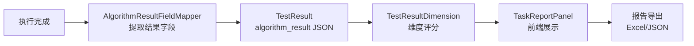
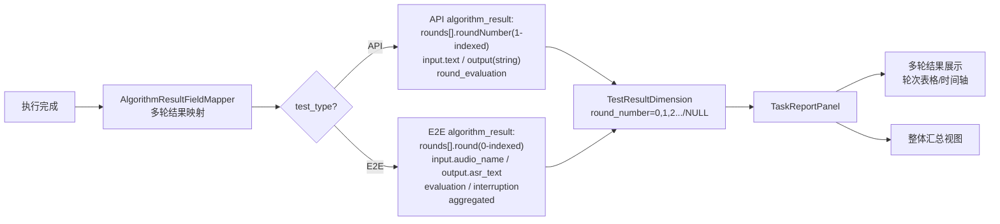

# 第 5 步：查看结果 — 步骤总览

## 当前架构

任务执行完成后，结果存储在 TestResult 和 TestResultDimension 表中。前端通过 TaskReportPanel 查看报告，支持结果对比和导出。

### 当前数据流



### 当前结果结构

voice_llm 根据 test_type 分为 API 和 E2E 两种结果结构：

```python
# API algorithm_result JSON
{
    "session_id": "a1b2c3d4-...",
    "round_count": 4,
    "total_latency": 6.60,
    "context_mode": "full",
    "history_count": 4,
    "error": null,
    "rounds": [
        {
            "roundNumber": 1,            # 1-indexed
            "input": { "text": "你好..." },
            "output": "今天北京...",       # string
            "latency": 1.23,
            "response_metrics": { "first_token_latency": 0.3, "tokens_per_second": 25 },
            "round_evaluation": { "wer": 0.02, "bleu": 0.95, "llm_judge": 4.9 }
        }
    ]
    # 注意：API 没有顶层 aggregated
}

# E2E algorithm_result JSON
{
    "test_type": "e2e",
    "algorithm_type": "voice_llm",
    "session_id": null,
    "rail_distance": 50,
    "voiceprint_registered": false,
    "total_rounds": 3,
    "rounds": [
        {
            "round": 0,                   # 0-indexed
            "input": { "audio_name": "round1.wav", "audio_path": "/audios/round1.wav", "type": "audio" },
            "output": { "asr_text": "今天天气怎么样", "device_raw": [...] },
            "interruption": null,
            "latency": 2.1,
            "wait_time": 5000,
            "evaluation": { "wer": 0.05, "bleu": 0.92, "llm_judge": 4.5 }
        }
    ],
    "aggregated": {
        "avg_wer": 0.067,
        "avg_bleu": 0.883,
        "avg_llm_judge": 4.3,
        "avg_latency": 1.83,
        "interruption_count": 1
    }
}

# TestResultDimension（维度评分）
# Per-round: round_number = 0, 1, 2, ... (0-indexed)
# Overall:   round_number = NULL
{
    "dimension_name": "WER",
    "score": 95.0,
    "weight": 50,
    "round_number": 0       # 0-indexed; NULL 表示整体
}
```

### 当前关键组件

| 组件/模块 | 职责 |
|-----------|------|
| `algorithm_result_field_mapper.py` | 从 algorithm_result JSON 提取字段映射 |
| `reevaluation_executor.py` | 重新评估已有结果 |
| `TaskReportPanel.vue` | 前端报告展示 |
| `TestCaseReportDetail.vue` | 单条用例结果详情 |
| `reportService.ts` | 报告数据服务层 |

---

## 改造后架构

多轮测试（用例配置了 `rounds`）的结果从**单条记录**变为**多轮数组**，前端需要展示每轮独立的输入/输出/延迟/评分，以及整体汇总。API 和 E2E 的结果结构不同，需分别处理。

### 改造后数据流



### 改造要点

#### 1. 后端：结果字段映射

```python
# algorithm_result_field_mapper.py 新增 voice_llm 分支
def get_output_fields(self, algorithm_type, test_type=None):
    if algorithm_type == 'voice_llm':
        if test_type == 'e2e':
            return {
                'test_type': '测试类型',
                'algorithm_type': '算法类型',
                'session_id': '会话 ID',
                'rail_distance': '导轨距离',
                'voiceprint_registered': '声纹注册状态',
                'total_rounds': '总轮次数',
                'rounds': '轮次结果数组',
                'aggregated': '聚合指标',
            }
        else:  # api
            return {
                'session_id': '会话 ID',
                'round_count': '轮次数',
                'total_latency': '总延迟',
                'context_mode': '上下文模式',
                'history_count': '历史轮数',
                'error': '错误信息',
                'rounds': '轮次结果数组',
            }
```

#### 2. 后端：重新评估适配

```python
# reevaluation_executor.py 适配多轮结果
def reevaluate(self, test_result_id):
    result = get_test_result(test_result_id)
    if result.algorithm_type == 'voice_llm':
        test_type = result.test_type
        for round_data in result.algorithm_result['rounds']:
            # API: roundNumber(1-indexed) → round_number(0-indexed)
            # E2E: round(0-indexed) → round_number(0-indexed)
            if test_type == 'api':
                round_number = round_data['roundNumber'] - 1
                evaluation = round_data.get('round_evaluation', {})
            else:
                round_number = round_data['round']
                evaluation = round_data.get('evaluation', {})
            self.evaluate_round(round_data, round_number, evaluation)
    else:
        self.evaluate_single(result)
```

#### 3. 前端：多轮结果展示

```vue
<!-- TestCaseReportDetail.vue 新增多轮视图 -->
<template v-if="isVoiceLLM">
  <!-- 轮次表格 -->
  <el-table :data="displayRounds">
    <el-table-column :label="roundLabel" width="60">
      <template #default="{ row }">
        {{ row.roundNumber ?? row.round }}
      </template>
    </el-table-column>
    <el-table-column label="输入">
      <template #default="{ row }">
        {{ row.input?.text || row.input?.audio_name || '—' }}
      </template>
    </el-table-column>
    <el-table-column label="输出">
      <template #default="{ row }">
        {{ typeof row.output === 'string' ? row.output : row.output?.asr_text || '—' }}
      </template>
    </el-table-column>
    <el-table-column prop="latency" label="延迟(s)" width="80" />
    <el-table-column label="评估" width="80">
      <template #default="{ row }">
        {{ (row.round_evaluation || row.evaluation)?.score ?? '—' }}
      </template>
    </el-table-column>
    <el-table-column label="打断" width="80" v-if="isE2E">
      <template #default="{ row }">
        {{ row.interruption?.detected ? '是' : '—' }}
      </template>
    </el-table-column>
  </el-table>

  <!-- 整体汇总 -->
  <div class="summary">
    <span>总轮次: {{ result.round_count || result.total_rounds }}</span>
    <span>总延迟: {{ result.total_latency }}s</span>
    <span v-if="aggregatedMetrics">平均评分: {{ aggregatedMetrics.avg_llm_judge }}</span>
  </div>
</template>
```

#### 4. 前端：报告对比适配

```vue
<!-- SpecificCaseComparisonComponent.vue -->
<!-- 多轮结果在对比视图中的展示 -->
<template v-if="hasMultiRoundResults">
  <div v-for="round in mergedRounds" class="round-comparison">
    <h4>第 {{ round.roundNumber ?? round.round }} 轮</h4>
    <ComparisonTable :items="round.comparisons" />
  </div>
</template>
```

#### 5. 前端：reportService 多轮数据

```ts
// reportService.ts 新增多轮结果解析
function parseMultiRoundResult(algorithmResult: any, testType?: string): MultiRoundResult {
  const isE2E = testType === 'e2e' || algorithmResult.test_type === 'e2e'
  return {
    rounds: algorithmResult.rounds.map(r => {
      if (isE2E) {
        return {
          round: r.round,                          // 0-indexed
          input: { audio_name: r.input?.audio_name, audio_path: r.input?.audio_path, type: r.input?.type },
          output: { asr_text: r.output?.asr_text, device_raw: r.output?.device_raw },
          latency: r.latency,
          evaluation: r.evaluation,
          interruption: r.interruption,
        }
      } else {
        return {
          roundNumber: r.roundNumber,              // 1-indexed
          input: { text: r.input?.text },
          output: r.output,                        // string
          latency: r.latency,
          round_evaluation: r.round_evaluation,
        }
      }
    }),
    summary: isE2E
      ? {
          totalRounds: algorithmResult.total_rounds,
          aggregated: algorithmResult.aggregated,
        }
      : {
          totalRounds: algorithmResult.round_count,
          totalLatency: algorithmResult.total_latency,
          averageScore: calculateAverageScore(algorithmResult.rounds, 'round_evaluation'),
        }
  }
}
```

---

## 本步骤涉及的文档

| 服务 | 文档 | 说明 |
|------|------|------|
| 后端 | `11_algorithm_result_field_mapper适配` | 多轮输出字段映射（区分 API/E2E） |
| 后端 | `34_reevaluation_executor适配` | 重新评估支持多轮结果（区分 API/E2E） |
| 前端 | `20_TestCaseReportDetail多轮结果` | 报告详情展示多轮数据（区分 API/E2E） |
| 前端 | `21_报告对比组件适配` | SpecificCase/CaseCategory 对比视图（区分 API/E2E） |
| 前端 | `22_reportService多轮数据` | 报告服务层多轮结果处理（区分 API/E2E） |

---

## 不变部分

- TaskReportPanel 的整体布局不变
- 报告导出功能（Excel/JSON）的基础逻辑不变
- 未配置 `rounds` 的用例结果展示不变
- TestResult / TestResultDimension 表结构不变
- 报告发布/审核流程不变
