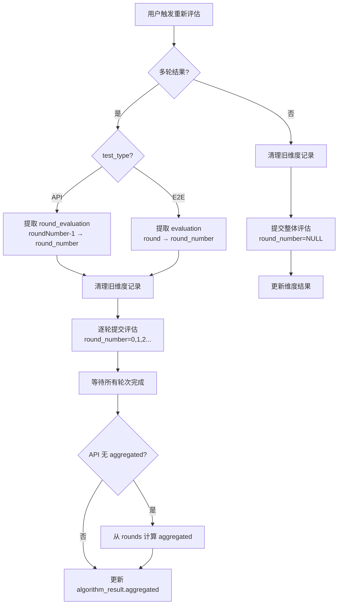

# 34 — reevaluation_executor 适配

> **所属步骤**：05_查看结果 → backend  
> **改造类型**：修改  
> **涉及文件**：`backend/utils/reevaluation_executor.py`（或 `task_controller.py` 中的重新评估逻辑）

---

## 背景

平台的"重新评估"功能允许用户对已完成的任务重新运行评估（如评估维度配置变更后）。voice_llm 多轮结果的 `algorithm_result` 包含 `rounds` 数组，重新评估需要逐轮或整体重新计算。

API 和 E2E 的结果结构不同：
- **API**：每轮用 `round_evaluation` 存储评估数据，`roundNumber` 为 1-indexed，无顶层 `aggregated`
- **E2E**：每轮用 `evaluation` 存储评估数据，`round` 为 0-indexed，有顶层 `aggregated`

---

## 改造内容

### 1. 重新评估入口适配

```python
def reevaluate_task(task_id: int, options: dict = None):
    """
    重新评估任务的所有测试结果。

    Args:
        task_id: 任务 ID
        options: {
            "round_numbers": [0, 1, 2],  # 指定轮次（0-indexed，可选）
            "dimension_ids": [5, 6],      # 指定维度（可选）
        }
    """
    options = options or {}

    task = Task.query.get(task_id)
    if not task:
        raise ValueError(f'Task {task_id} not found')

    test_results = TestResult.query.filter_by(task_id=task_id).all()

    for result in test_results:
        algorithm_result = result.algorithm_result
        if isinstance(algorithm_result, str):
            algorithm_result = json.loads(algorithm_result)

        # 检查是否为多轮结果
        if algorithm_result and 'rounds' in algorithm_result:
            test_type = result.test_type or algorithm_result.get('test_type', 'api')
            _reevaluate_multi_round(result, algorithm_result, test_type, options)
        else:
            _reevaluate_single(result, algorithm_result, options)
```

### 2. 多轮重新评估（区分 API / E2E）

```python
def _reevaluate_multi_round(result, algorithm_result, test_type, options):
    """重新评估多轮结果 — 区分 API 和 E2E"""
    rounds = algorithm_result.get('rounds', [])
    target_rounds = options.get('round_numbers')

    if target_rounds is None:
        target_rounds = list(range(len(rounds)))

    # 清理旧的维度评估记录
    TestResultDimension.query.filter_by(
        test_result_id=result.id
    ).delete()

    is_e2e = test_type == 'e2e'

    # 逐轮重新评估
    for round_idx in target_rounds:
        if round_idx < len(rounds):
            round_data = rounds[round_idx]

            # 提取评估数据：API 用 round_evaluation，E2E 用 evaluation
            if is_e2e:
                evaluation = round_data.get('evaluation', {})
                round_number = round_data.get('round', round_idx)  # 0-indexed
            else:
                evaluation = round_data.get('round_evaluation', {})
                # API 的 roundNumber 是 1-indexed，转为 0-indexed
                round_number = round_data.get('roundNumber', round_idx + 1) - 1

            evaluation_service.evaluate_case(
                task_id=str(result.task_id),
                result_id=result.id,
                test_case_id=result.test_case_id,
                algorithm_result=algorithm_result,
                representative_dim_data=options.get('dimensions', []),
                group_items=options.get('group_items', []),
                algorithm_type=result.algorithm_type,
                test_type=test_type,
                round_number=round_number,  # 统一为 0-indexed
            )

    # 聚合结果会在所有轮次评估完成后自动触发
    # (见 27_evaluation_result_processor多轮聚合)

    # API 结果没有顶层 aggregated，需从 rounds 中计算或由后端补充
    if not is_e2e and not algorithm_result.get('aggregated'):
        _compute_and_store_api_aggregated(result, algorithm_result)
```

### 3. API 聚合计算（无顶层 aggregated 时）

```python
def _compute_and_store_api_aggregated(result, algorithm_result):
    """API 结果没有顶层 aggregated，从 rounds 的 round_evaluation 中计算"""
    rounds = algorithm_result.get('rounds', [])
    if not rounds:
        return

    evals = [r.get('round_evaluation', {}) for r in rounds if r.get('round_evaluation')]

    if evals:
        aggregated = {
            'avg_wer': sum(e.get('wer', 0) for e in evals) / len(evals),
            'avg_llm_judge': sum(e.get('llm_judge', 0) for e in evals) / len(evals),
            'avg_latency': sum(r.get('latency', 0) for r in rounds) / len(rounds),
        }
        algorithm_result['aggregated'] = aggregated
        result.algorithm_result = algorithm_result
        db.session.commit()
```

### 4. 单轮重新评估（非多轮结果）

```python
def _reevaluate_single(result, algorithm_result, options):
    """重新评估单轮结果（现有逻辑）"""
    TestResultDimension.query.filter_by(
        test_result_id=result.id
    ).delete()

    evaluation_service.evaluate_case(
        task_id=str(result.task_id),
        result_id=result.id,
        test_case_id=result.test_case_id,
        algorithm_result=algorithm_result,
        representative_dim_data=options.get('dimensions', []),
        group_items=options.get('group_items', []),
        algorithm_type=result.algorithm_type,
        test_type=result.test_type,
        round_number=None,  # 单轮结果 round_number = NULL
    )
```

### 5. 前端调用

```typescript
// 重新评估 API
async function reevaluateTask(taskId: number, options?: {
  roundNumbers?: number[];  // 0-indexed
  dimensionIds?: number[];
}) {
  return await tasksApi.reevaluate(taskId, options);
}
```

### 6. 重新评估流程图



---

## 不变部分

- 重新评估的 API 端点路径不变
- 非 voice_llm 任务的重新评估逻辑不变
- 维度配置查询不变

---

## 依赖关系

| 依赖文档 | 说明 |
|---------|------|
| `27_evaluation_result_processor多轮聚合` | 多轮聚合 |
| `25_evaluation_service单轮评估` | 单轮评估调用 |
| `22_reportService多轮数据` (frontend) | 前端触发和展示 |
