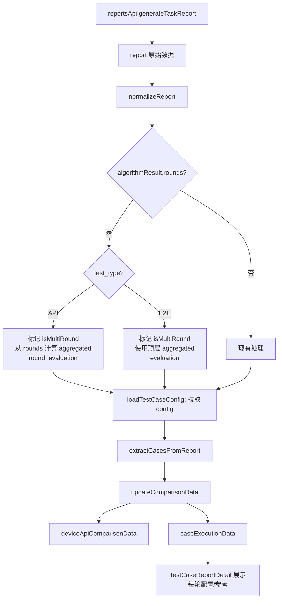

# 22 — reportService 多轮数据

> **所属步骤**：05_查看结果 → frontend  
> **改造类型**：修改  
> **涉及文件**：`frontend/src/services/reportService.ts`

---

## 背景

`reportService` 负责报告数据的获取、转换和状态管理。voice_llm 多轮结果的 `algorithm_result` 结构（含 `rounds` 数组和 `aggregated` 字段）需要在报告数据管道中正确处理。

API 和 E2E 的结果结构不同：
- **API**：`rounds[].roundNumber` (1-indexed)，`rounds[].input.text`，`rounds[].output` (string)，`rounds[].round_evaluation`，无顶层 `aggregated`
- **E2E**：`rounds[].round` (0-indexed)，`rounds[].input.audio_name/audio_path/type`，`rounds[].output.asr_text/device_raw`，`rounds[].evaluation`，有顶层 `aggregated`

同时，每轮的**配置回顾**（audios、backgroundNoise、algorithmParams）和**参考参数**（通过 `referenceParamsPath` 引用文件）也应在数据层打通，便于 `TestCaseReportDetail` 展示。

---

## 改造内容

### 1. `viewTaskReport` 适配

```typescript
async function viewTaskReport(taskId: number) {
  const response = await reportsApi.generateTaskReport(taskId);
  const report = normalizeReport(response.data);

  if (report.detailedResults) {
    for (const detail of report.detailedResults) {
      const algoResult = detail.algorithmResult;
      if (typeof algoResult === 'string') {
        try { detail.algorithmResult = JSON.parse(algoResult); } catch { /* keep as string */ }
      }

      if (detail.algorithmResult?.rounds) {
        detail.isMultiRound = true;
        detail.roundCount = detail.algorithmResult.rounds.length;
        detail.testType = detail.algorithmResult.test_type || detail.testType || 'api';

        // E2E: 直接使用顶层 aggregated
        // API: 没有顶层 aggregated，从 rounds 的 round_evaluation 中计算
        if (detail.algorithmResult.aggregated) {
          detail.aggregated = detail.algorithmResult.aggregated;
        } else if (detail.testType === 'api') {
          detail.aggregated = computeAggregatedFromRounds(
            detail.algorithmResult.rounds, 'round_evaluation'
          );
        } else {
          detail.aggregated = {};
        }
      }

      // 关联 testcase 的 config（用于在报告中展示每轮配置回顾）
      if (detail.testCaseId) {
        detail.testCaseConfig = await loadTestCaseConfig(detail.testCaseId);
      }
    }
  }
}

function computeAggregatedFromRounds(rounds: any[], evalKey: string): Record<string, number> {
  const evals = rounds.map(r => r[evalKey]).filter(Boolean);
  if (evals.length === 0) return {};
  return {
    avg_wer: evals.reduce((s, e) => s + (e.wer || 0), 0) / evals.length,
    avg_llm_judge: evals.reduce((s, e) => s + (e.llm_judge || 0), 0) / evals.length,
    avg_latency: rounds.reduce((s, r) => s + (r.latency || 0), 0) / rounds.length,
  };
}

async function loadTestCaseConfig(testCaseId: number) {
  const tc = await casesApi.getTestCase(testCaseId);
  return tc?.config || null;
}
```

### 2. `extractCasesFromReport` 适配

```typescript
function extractCasesFromReport(report: any): CaseExecutionItem[] {
  const cases: CaseExecutionItem[] = [];

  for (const detail of report.detailedResults || []) {
    const testType = detail.testType || 'api';
    const caseItem: CaseExecutionItem = {
      testCaseId: detail.testCaseId,
      testCaseName: detail.testCaseName,
      testType,
      isMultiRound: detail.isMultiRound || false,
      roundCount: detail.roundCount || 0,
      testCaseConfig: detail.testCaseConfig,
    };

    if (detail.isMultiRound && detail.aggregated) {
      caseItem.metrics = {};
      for (const [key, value] of Object.entries(detail.aggregated)) {
        if (typeof value === 'number') {
          caseItem.metrics[key] = value;
        }
      }
    } else {
      caseItem.metrics = {};
      for (const dim of detail.dimensions || []) {
        if (dim.score !== null) {
          caseItem.metrics[dim.name] = dim.score;
        }
      }
    }

    cases.push(caseItem);
  }

  return cases;
}
```

### 3. `updateComparisonData` 适配

```typescript
function updateComparisonData() {
  const deviceData: DeviceAPIComparisonItem[] = [];

  for (const device of devices.value) {
    const deviceCases = caseExecutionData.value.filter(
      c => c.deviceId === device.id || c.apiId === device.id
    );

    const metricSums: Record<string, { sum: number; count: number }> = {};

    for (const c of deviceCases) {
      for (const [key, value] of Object.entries(c.metrics || {})) {
        if (typeof value === 'number' && value !== null) {
          if (!metricSums[key]) metricSums[key] = { sum: 0, count: 0 };
          metricSums[key].sum += value;
          metricSums[key].count += 1;
        }
      }
    }

    const avgMetrics: Record<string, number> = {};
    for (const [key, { sum, count } of Object.entries(metricSums)) {
      avgMetrics[key] = count > 0 ? sum / count : 0;
    }

    deviceData.push({
      id: device.id,
      name: device.name,
      type: device.type,
      totalCases: deviceCases.length,
      completedCases: deviceCases.filter(c => c.status === 'completed').length,
      successRate: calculateSuccessRate(deviceCases),
      avgMetrics,
    });
  }

  deviceApiComparisonData.value = deviceData;
}
```

### 4. CaseExecutionItem 接口扩展（区分 API / E2E）

```typescript
interface CaseExecutionItem {
  testCaseId: number;
  testCaseName: string;
  testType?: string;  // 'api' | 'e2e'
  deviceId?: number;
  apiId?: number;
  status: string;
  metrics: Record<string, number>;
  isMultiRound: boolean;
  roundCount: number;
  rounds?: Array<
    | ApiRoundData    // testType === 'api'
    | E2ERoundData    // testType === 'e2e'
  >;
  testCaseConfig?: {
    rounds: Array<{
      roundNumber?: number;
      audios?: any[];
      backgroundNoise?: any;
      algorithmParams?: Array<{ field_code: string; field_value: string }>;
      referenceParamsPath?: string;
    }>;
    dimensions?: any[];
  };
}

// API 多轮结果
interface ApiRoundData {
  roundNumber: number;                    // 1-indexed
  input: { text?: string };
  output: string;                         // string
  latency: number;
  response_metrics?: { first_token_latency?: number; tokens_per_second?: number };
  round_evaluation?: Record<string, number>;  // API 用 round_evaluation
}

// E2E 多轮结果
interface E2ERoundData {
  round: number;                          // 0-indexed
  input: { audio_name?: string; audio_path?: string; type?: string };
  output: { asr_text?: string; device_raw?: any[] };
  latency: number;
  wait_time?: number;
  evaluation?: Record<string, number>;    // E2E 用 evaluation
  interruption?: { detected: boolean; timestamp: number } | null;
}
```

### 5. 报告导出适配

```typescript
function exportReport(reportId: number, format: string) {
  return reportsApi.export(reportId, {
    format,
    expand_rounds: true,
  });
}
```

### 6. 数据流



---

## 不变部分

- 报告生成 API 不变
- Socket.IO `report_generated` 监听不变
- 报告保存/发布/导出接口不变
- 非多轮结果的处理不变

---

## 依赖关系

| 依赖文档 | 说明 |
|---------|------|
| `20_TestCaseReportDetail多轮结果` | 报告详情展示（含每轮配置与参考） |
| `21_报告对比组件适配` | 对比数据消费方 |
| `02_选用例/backend/03_Config_JSON扁平化设计.md` | config 结构定义 |
| `34_reevaluation_executor适配` | 重新评估触发 |
