# voice_llm 改造技术文档

## 项目概述

本文档集为 **语音交互大模型（voice_llm）测试能力改造** 项目的完整技术设计文档。改造目标是在现有智能音频测试平台中新增 voice_llm 测试类型，支持多轮会话、声纹注册、干扰人播放、导轨控制、设备音量控制、全双工打断检测等能力。

**核心架构**：双记录用例架构（test_type=api/e2e）+ 三服务协作（主后端 + eval_server + api_adapter_service）

**文档总计**：75 个技术设计文档 + 本导航索引，按 **5 步测试流程** 组织，每步内按服务（backend/frontend/eval_server/api_adapter）分目录。

---

## 5 步测试流程

```
┌──────────┐   ┌──────────┐   ┌──────────────┐   ┌──────────┐   ┌──────────┐
│ 1.选算法  │──▶│ 2.选用例  │──▶│ 3.选设备/API  │──▶│ 4.执行测试 │──▶│ 5.查看结果 │
└──────────┘   └──────────┘   └──────────────┘   └──────────┘   └──────────┘
  Algorithm      TestCase       Resource           Execution      Report
  Selection       List          Selection           Engine         Panel
```

---

## 目录结构

```
doc/voice_llm/
│
├── README.md                                          # 导航索引（本文档）
├── 00_改造方案总览.md                                   # 改造前后流程图 + 架构全景
│
├── 01_选算法/                                         # === 第 1 步：选算法（7个文档）===
│   ├── 00_步骤总览.md                                   # 当前架构 vs 改造后架构
│   ├── backend/                                       # -- 后端 --
│   │   ├── 02_CaseAlgorithmParam_scope字段.md           # scope: common/api/e2e
│   │   ├── 06_algorithm_Schema与Controller.md           # scope 字段 CRUD + 接口过滤
│   │   ├── 07_voice_llm算法参数种子数据.md              # voice_llm 参数 INSERT 记录
│   │   └── 08_field_mapper_voice_llm映射.md             # voice_llm 字段定义
│   └── frontend/                                      # -- 前端 --
│       ├── 03_api.ts算法API扩展.md                      # algorithmApi voice_llm 支持
│       └── 15_DynamicForm_scope过滤.md                  # 按 scope + test_type 过滤参数
│
├── 02_选用例/                                         # === 第 2 步：选用例（22个文档）===
│   ├── 00_步骤总览.md                                   # 双记录架构 + 扁平化配置
│   ├── backend/                                       # -- 后端 --
│   │   ├── 01_TestCase模型新增字段.md                   # test_type + related_case_id
│   │   ├── 03_Config_JSON扁平化设计.md                  # API/E2E 各自独立 config 结构
│   │   ├── 04_testcase_Schema新类型.md                  # RoundConfig/VoiceprintConfig 等
│   │   ├── 05_testcase_controller双记录CRUD.md          # 创建/更新/查询适配双记录
│   │   ├── 09_case_parameter_extractor适配.md           # voice_llm 评估参数提取
│   │   └── 10_reference_params_generator适配.md         # voice_llm 参考参数生成
│   └── frontend/                                      # -- 前端 --
│       ├── 01_types.ts新接口定义.md                     # RoundConfig/VoiceprintConfig 等
│       ├── 02_businessTypes适配.md                      # TaskType 扩展
│       ├── 04_TestCaseListContainer_test_type.md        # 列表增加 test_type 列 + 筛选
│       ├── 05_AddTestCaseModal_test_type选择.md         # 新建用例选择 test_type
│       ├── 06_CaseForm_test_type驱动.md                 # test_type 驱动 + 加载参数定义
│       ├── 07_testCaseStore_test_type处理.md            # Store 层 test_type 状态管理
│       ├── 08_useAudioConfig_test_type适配.md           # 音频配置 Hook 按 test_type 区分
│       ├── 09_useDimensionConfig扁平维度.md             # dimensions 从 {api,e2e} 改为数组
│       ├── 10_RoundConfigEditor.md                      # 轮次编辑器（参数驱动，DynamicForm）
│       ├── 11_SessionConfigEditor.md                    # 会话配置编辑器（已移除，通过 DynamicForm 替代）
│       ├── 12_VoiceprintConfigEditor.md                 # 声纹注册编辑器（DynamicForm 子编辑器）
│       ├── 13_InterfererConfigEditor.md                 # 干扰人配置编辑器（DynamicForm 子编辑器）
│       ├── 14_RoundEvaluationEditor.md                  # 单轮评估配置编辑器（E2E）
│       ├── 23_UploadOptions_test_type.md                # 音频上传选项 test_type 适配
│       └── 25_Evaluation页面_llm_judge维度.md            # 评估维度管理 llm_judge 类型
│
├── 03_选设备API/                                      # === 第 3 步：选设备/API（6个文档）===
│   ├── 00_步骤总览.md                                   # 设备驱动扩展（音量/导轨/打断）
│   ├── backend/                                       # -- 后端 --
│   │   ├── 18_被测设备音量控制.md                        # base_driver 新增 set_volume
│   │   ├── 29_设备驱动导轨控制集成.md                    # 导轨控制集成到 device_driver 框架
│   │   └── 33_device_driver打断检测接口.md              # base_driver 新增 detect_interruption
│   └── frontend/                                      # -- 前端 --
│       ├── 16_APITest页面适配.md                        # APITest.vue + useApiTest.ts
│       └── 17_E2ETest页面适配.md                        # E2ETest.vue + useE2eTest.ts
│
├── 04_执行测试/                                       # === 第 4 步：执行测试（35个文档）===
│   ├── 00_步骤总览.md                                   # 多轮循环 + 评估扩展 + 微服务协作
│   ├── backend/                                       # -- 后端（19个）--
│   │   ├── 12_api_executor多轮会话主循环.md              # execute_api_case 配置驱动多轮会话（rounds 非空时）
│   │   ├── 13_SessionContext会话管理器.md                # 会话创建/上下文维护/销毁
│   │   ├── 14_轮次请求构建.md                           # _send_round_request 设计
│   │   ├── 15_轮次超时策略.md                           # session_timeout 替代 audio_duration
│   │   ├── 16_API测试结果存储结构.md                    # algorithm_result 含 rounds 数组
│   │   ├── 17_e2e_executor多轮循环.md                   # execute_e2e_case 配置驱动多轮循环（rounds 非空时）
│   │   ├── 19_声纹注册模块.md                           # 播放注册音频 + 等待
│   │   ├── 20_干扰人播放模块.md                         # 复用 play_overlap + play_multi 混音
│   │   ├── 21_全双工打断检测.md                         # _detect_interruption 设计
│   │   ├── 22_E2E每轮结果收集.md                       # _collect_round_results
│   │   ├── 23_E2E测试结果存储结构.md                    # 含 rounds/rail/voiceprint
│   │   ├── 24_evaluation_service_llm_judge分发.md       # llm_judge 维度路由
│   │   ├── 25_evaluation_service单轮评估.md             # round_number 参数支持
│   │   ├── 26_evaluation_api_client适配.md              # 多轮对话数据结构请求体
│   │   ├── 27_evaluation_result_processor多轮聚合.md    # 多轮评估结果处理
│   │   ├── 28_base_executor评估入队适配.md              # _evaluate_result round_number
│   │   ├── 30_execution_engine多轮进度.md               # 任务调度支持多轮进度
│   │   ├── 31_event_manager多轮进度推送.md              # WebSocket 推送"第 N/M 轮"
│   │   └── 32_device_result_collector多轮采集.md        # 每轮单独采集 + 对齐
│   ├── eval_server/                                   # -- 评估微服务（6个）--
│   │   ├── 01_create_task新任务类型.md                  # 支持 llm_judge
│   │   ├── 02_LLM_Judge计算器.md                       # llm_judge_calculator.py 新增
│   │   ├── 03_ConcurrencyManager动态类型.md             # _stats 动态初始化
│   │   ├── 04_多轮WER聚合.md                           # 多轮对话 WER 计算 + 聚合
│   │   ├── 05_remote_service适配.md                     # 新类型端点匹配 + 参数转发
│   │   └── 06_health动态类型.md                         # 健康检查动态返回类型
│   ├── api_adapter/                                   # -- API适配微服务（6个）--
│   │   ├── 01_voice_llm_HTTP适配器.md                   # 新增 http_adapter.py
│   │   ├── 02_会话状态管理.md                           # session_id + context 存储
│   │   ├── 03_create_task对话模式.md                    # 文本/音频双通道输入
│   │   ├── 04_task_manager轮次结果.md                   # 帧结果→轮次结果重构
│   │   ├── 05_mock_adapter_voice_llm.md                # mock 多轮对话响应
│   │   └── 06_application_yml配置扩展.md               # voice_llm vendor 配置
│   └── frontend/                                      # -- 前端（2个）--
│       ├── 18_TestExecutionComponent多轮进度.md         # 执行进度显示多轮信息
│       └── 19_useTaskProgress多轮显示.md                # WebSocket 进度适配多轮
│
├── 05_查看结果/                                       # === 第 5 步：查看结果（6个文档）===
│   ├── 00_步骤总览.md                                   # 多轮结果展示 + 重新评估
│   ├── backend/                                       # -- 后端 --
│   │   ├── 11_algorithm_result_field_mapper适配.md      # voice_llm 输出字段映射
│   │   └── 34_reevaluation_executor适配.md             # 重新评估支持多轮结果
│   └── frontend/                                      # -- 前端 --
│       ├── 20_TestCaseReportDetail多轮结果.md           # 报告详情展示多轮数据
│       ├── 21_报告对比组件适配.md                        # SpecificCase/CaseCategory 等
│       └── 22_reportService多轮数据.md                  # 报告服务层多轮结果处理
│
└── 35_数据迁移方案.md                                  # DDL + 拆分脚本 + 验证 + 回滚

├── 98_API用例端到端示例.md                              # 完整示例: API配置→执行→评估→报告
└── 99_E2E用例端到端示例.md                              # 完整示例: E2E配置→执行→评估→报告
```

---

## 文档速查表

> **路径约定**：表中的"路径"列省略根目录 `doc/voice_llm/`，直接写步骤文件夹起的相对路径。

### 后端文档（35个，编号 01-35）

| 编号 | 所属步骤 | 路径 | 功能说明 |
|------|---------|------|---------|
| 01 | 02_选用例 | `02_选用例/backend/01_TestCase模型新增字段.md` | test_type + related_case_id |
| 02 | 01_选算法 | `01_选算法/backend/02_CaseAlgorithmParam_scope字段.md` | scope: common/api/e2e |
| 03 | 02_选用例 | `02_选用例/backend/03_Config_JSON扁平化设计.md` | 参数驱动 config 结构（algorithmParams 统一存储） |
| 04 | 02_选用例 | `02_选用例/backend/04_testcase_Schema新类型.md` | RoundConfigItem Schema（参数驱动版） |
| 05 | 02_选用例 | `02_选用例/backend/05_testcase_controller双记录CRUD.md` | 创建/更新/查询适配双记录 |
| 06 | 01_选算法 | `01_选算法/backend/06_algorithm_Schema与Controller.md` | scope 字段 CRUD + 种子数据 |
| 07 | 01_选算法 | `01_选算法/backend/07_voice_llm算法参数种子数据.md` | voice_llm case_algorithm_params 种子数据（参数驱动） |
| 08 | 01_选算法 | `01_选算法/backend/08_field_mapper_voice_llm映射.md` | voice_llm 字段定义（动态映射，无硬编码分支） |
| 09 | 02_选用例 | `02_选用例/backend/09_case_parameter_extractor适配.md` | voice_llm 评估参数提取 |
| 10 | 02_选用例 | `02_选用例/backend/10_reference_params_generator适配.md` | voice_llm 参考参数生成 |
| 11 | 05_查看结果 | `05_查看结果/backend/11_algorithm_result_field_mapper适配.md` | voice_llm 输出字段映射 |
| 12 | 04_执行测试 | `04_执行测试/backend/12_api_executor多轮会话主循环.md` | execute_api_case 配置驱动多轮会话 |
| 13 | 04_执行测试 | `04_执行测试/backend/13_SessionContext会话管理器.md` | 会话创建/上下文维护/销毁 |
| 14 | 04_执行测试 | `04_执行测试/backend/14_轮次请求构建.md` | _send_round_request 设计 |
| 15 | 04_执行测试 | `04_执行测试/backend/15_轮次超时策略.md` | session_timeout 替代 audio_duration |
| 16 | 04_执行测试 | `04_执行测试/backend/16_API测试结果存储结构.md` | algorithm_result 含 rounds 数组 |
| 17 | 04_执行测试 | `04_执行测试/backend/17_e2e_executor多轮循环.md` | execute_e2e_case 配置驱动多轮循环 |
| 18 | 03_选设备API | `03_选设备API/backend/18_被测设备音量控制.md` | base_driver 新增 set_volume + E2E 集成 |
| 19 | 04_执行测试 | `04_执行测试/backend/19_声纹注册模块.md` | 播放注册音频 + 等待 |
| 20 | 04_执行测试 | `04_执行测试/backend/20_干扰人播放模块.md` | 复用 play_overlap + play_multi 混音 |
| 21 | 04_执行测试 | `04_执行测试/backend/21_全双工打断检测.md` | _detect_interruption 设计 |
| 22 | 04_执行测试 | `04_执行测试/backend/22_E2E每轮结果收集.md` | _collect_round_results |
| 23 | 04_执行测试 | `04_执行测试/backend/23_E2E测试结果存储结构.md` | 含 rounds/rail/voiceprint |
| 24 | 04_执行测试 | `04_执行测试/backend/24_evaluation_service_llm_judge分发.md` | llm_judge 维度路由 |
| 25 | 04_执行测试 | `04_执行测试/backend/25_evaluation_service单轮评估.md` | round_number 参数支持 |
| 26 | 04_执行测试 | `04_执行测试/backend/26_evaluation_api_client适配.md` | 多轮对话数据结构请求体 |
| 27 | 04_执行测试 | `04_执行测试/backend/27_evaluation_result_processor多轮聚合.md` | 多轮评估结果处理 |
| 28 | 04_执行测试 | `04_执行测试/backend/28_base_executor评估入队适配.md` | _evaluate_result round_number |
| 29 | 03_选设备API | `03_选设备API/backend/29_设备驱动导轨控制集成.md` | 导轨控制集成到 device_driver 框架 |
| 30 | 04_执行测试 | `04_执行测试/backend/30_execution_engine多轮进度.md` | 任务调度支持多轮进度 |
| 31 | 04_执行测试 | `04_执行测试/backend/31_event_manager多轮进度推送.md` | WebSocket 推送"第 N/M 轮" |
| 32 | 04_执行测试 | `04_执行测试/backend/32_device_result_collector多轮采集.md` | 每轮单独采集 + 对齐 |
| 33 | 03_选设备API | `03_选设备API/backend/33_device_driver打断检测接口.md` | base_driver 新增 detect_interruption |
| 34 | 05_查看结果 | `05_查看结果/backend/34_reevaluation_executor适配.md` | 重新评估支持多轮结果 |
| 35 | 数据迁移 | `35_数据迁移方案.md` | DDL + 拆分脚本 + 验证 + 回滚 |

### 前端文档（25个，编号 01-25）

| 编号 | 所属步骤 | 路径 | 功能说明 |
|------|---------|------|---------|
| 01 | 02_选用例 | `02_选用例/frontend/01_types.ts新接口定义.md` | RoundConfigItem（参数驱动版）+ 子编辑器接口 |
| 02 | 02_选用例 | `02_选用例/frontend/02_businessTypes适配.md` | TaskType 扩展 |
| 03 | 01_选算法 | `01_选算法/frontend/03_api.ts算法API扩展.md` | algorithmApi voice_llm 支持 |
| 04 | 02_选用例 | `02_选用例/frontend/04_TestCaseListContainer_test_type.md` | 列表增加 test_type 列 + 筛选 |
| 05 | 02_选用例 | `02_选用例/frontend/05_AddTestCaseModal_test_type选择.md` | 新建用例选择 test_type |
| 06 | 02_选用例 | `02_选用例/frontend/06_CaseForm_test_type驱动.md` | test_type 驱动 + 加载参数定义传给 RoundConfigEditor |
| 07 | 02_选用例 | `02_选用例/frontend/07_testCaseStore_test_type处理.md` | Store 层 test_type 状态管理 |
| 08 | 02_选用例 | `02_选用例/frontend/08_useAudioConfig_test_type适配.md` | 音频配置 Hook 按 test_type 区分 |
| 09 | 02_选用例 | `02_选用例/frontend/09_useDimensionConfig扁平维度.md` | dimensions 从 {api,e2e} 改为数组 |
| 10 | 02_选用例 | `02_选用例/frontend/10_RoundConfigEditor.md` | 轮次编辑器（参数驱动，DynamicForm 渲染） |
| 11 | 02_选用例 | `02_选用例/frontend/11_SessionConfigEditor.md` | 会话配置编辑器（已移除，通过 DynamicForm 替代） |
| 12 | 02_选用例 | `02_选用例/frontend/12_VoiceprintConfigEditor.md` | 声纹注册编辑器（DynamicForm 子编辑器） |
| 13 | 02_选用例 | `02_选用例/frontend/13_InterfererConfigEditor.md` | 干扰人配置编辑器（DynamicForm 子编辑器） |
| 14 | 02_选用例 | `02_选用例/frontend/14_RoundEvaluationEditor.md` | 单轮评估配置编辑器 |
| 15 | 01_选算法 | `01_选算法/frontend/15_DynamicForm_scope过滤.md` | 根据 scope + test_type 过滤参数 |
| 16 | 03_选设备API | `03_选设备API/frontend/16_APITest页面适配.md` | APITest.vue + useApiTest.ts |
| 17 | 03_选设备API | `03_选设备API/frontend/17_E2ETest页面适配.md` | E2ETest.vue + useE2eTest.ts |
| 18 | 04_执行测试 | `04_执行测试/frontend/18_TestExecutionComponent多轮进度.md` | 执行进度显示多轮信息 |
| 19 | 04_执行测试 | `04_执行测试/frontend/19_useTaskProgress多轮显示.md` | WebSocket 进度适配多轮 |
| 20 | 05_查看结果 | `05_查看结果/frontend/20_TestCaseReportDetail多轮结果.md` | 报告详情展示多轮数据 |
| 21 | 05_查看结果 | `05_查看结果/frontend/21_报告对比组件适配.md` | SpecificCase/CaseCategory 等 |
| 22 | 05_查看结果 | `05_查看结果/frontend/22_reportService多轮数据.md` | 报告服务层多轮结果处理 |
| 23 | 02_选用例 | `02_选用例/frontend/23_UploadOptions_test_type.md` | 音频上传选项 test_type 适配 |
| 24 | 02_选用例 | `02_选用例/frontend/24_AlgorithmConfigPage_voice_llm.md` | 算法配置管理 voice_llm 注册 |
| 25 | 02_选用例 | `02_选用例/frontend/25_Evaluation页面_llm_judge维度.md` | 评估维度管理 llm_judge 类型 |

### eval_server 文档（6个，编号 01-06）

| 编号 | 所属步骤 | 路径 | 功能说明 |
|------|---------|------|--------|
| 01 | 04_执行测试 | `04_执行测试/eval_server/01_create_task新任务类型.md` | 支持 llm_judge |
| 02 | 04_执行测试 | `04_执行测试/eval_server/02_LLM_Judge计算器.md` | llm_judge_calculator.py 新增 |
| 03 | 04_执行测试 | `04_执行测试/eval_server/03_ConcurrencyManager动态类型.md` | _stats 动态初始化 |
| 04 | 04_执行测试 | `04_执行测试/eval_server/04_多轮WER聚合.md` | 多轮对话 WER 计算 + 聚合 |
| 05 | 04_执行测试 | `04_执行测试/eval_server/05_remote_service适配.md` | 新类型端点匹配 + 参数转发 |
| 06 | 04_执行测试 | `04_执行测试/eval_server/06_health动态类型.md` | 健康检查动态返回类型 |

### api_adapter 文档（6个，编号 01-06）

| 编号 | 所属步骤 | 路径 | 功能说明 |
|------|---------|------|---------|
| 01 | 04_执行测试 | `04_执行测试/api_adapter/01_voice_llm_HTTP适配器.md` | 新增 http_adapter.py |
| 02 | 04_执行测试 | `04_执行测试/api_adapter/02_会话状态管理.md` | session_id + context 存储 |
| 03 | 04_执行测试 | `04_执行测试/api_adapter/03_create_task对话模式.md` | 文本/音频双通道输入 |
| 04 | 04_执行测试 | `04_执行测试/api_adapter/04_task_manager轮次结果.md` | 帧结果→轮次结果重构 |
| 05 | 04_执行测试 | `04_执行测试/api_adapter/05_mock_adapter_voice_llm.md` | mock 多轮对话响应 |
| 06 | 04_执行测试 | `04_执行测试/api_adapter/06_application_yml配置扩展.md` | voice_llm vendor 配置 |

### 其他文档（4个）

| 编号 | 路径 | 功能说明 |
|------|------|---------|
| 00 | `00_改造方案总览.md` | 改造前后流程图对比 + 三服务架构全景 |
| 98 | `98_API用例端到端示例.md` | 完整示例: API配置→执行→评估→报告 |
| 99 | `99_E2E用例端到端示例.md` | 完整示例: E2E配置→执行→评估→报告 |
| — | `README.md` | 导航索引（本文档） |

---

## 按 5 步流程阅读（推荐）

测试流程分为 5 步：**选算法 → 选用例 → 选设备/API → 执行测试 → 查看结果**。下面按每一步涉及的前后端改动组织文档，方便按需阅读。

### 前置：全局理解（2个文档）

| 文档 | 路径 | 说明 |
|------|------|------|
| README.md | `doc/voice_llm/README.md` | 文档结构和术语 |
| 00_改造方案总览 | `doc/voice_llm/00_改造方案总览.md` | 改造前后流程图对比 + 三服务架构全景 |
| 数据迁移方案 | `doc/voice_llm/35_数据迁移方案.md` | DDL变更 + 数据迁移脚本（改造前提） |

---

### 第 1 步：选算法

> 用户在 AlgorithmSelectionPanel 选择算法类型，voice_llm 需要注册为新算法并定义用例级参数。

| 层 | 路径 | 说明 |
|----|------|------|
| **总览** | `01_选算法/00_步骤总览` | **先读此文档**：当前架构 vs 改造后架构 |
| 后端 | `01_选算法/backend/02_CaseAlgorithmParam_scope字段` | 参数新增 scope(common/api/e2e) |
| 后端 | `01_选算法/backend/06_algorithm_Schema与Controller` | scope 字段 CRUD + 接口过滤 |
| 后端 | `01_选算法/backend/07_voice_llm算法参数种子数据` | voice_llm 参数 INSERT 记录 |
| 后端 | `01_选算法/backend/08_field_mapper_voice_llm映射` | voice_llm 字段定义 |
| 前端 | `01_选算法/frontend/03_api.ts算法API扩展` | algorithmApi voice_llm 支持 |
| 前端 | `01_选算法/frontend/15_DynamicForm_scope过滤` | 按 scope + test_type 过滤参数 |

---

### 第 2 步：选用例

> 用户在 TestCaseListContainer 选择/创建/编辑用例。voice_llm 采用双记录架构，用例编辑表单需要大量改造。

> **先读** `02_选用例/00_步骤总览` — 了解双记录架构和扁平化配置

#### 2.1 数据模型（后端基础）

| 层 | 路径 | 说明 |
|----|------|------|
| 后端 | `02_选用例/backend/01_TestCase模型新增字段` | test_type + related_case_id |
| 后端 | `02_选用例/backend/03_Config_JSON扁平化设计` | API/E2E 各自独立 config 结构 |
| 后端 | `02_选用例/backend/04_testcase_Schema新类型` | RoundConfig/VoiceprintConfig 等 |
| 后端 | `02_选用例/backend/05_testcase_controller双记录CRUD` | 创建/更新/查询适配双记录 |
| 后端 | `02_选用例/backend/09_case_parameter_extractor适配` | voice_llm 评估参数提取 |
| 后端 | `02_选用例/backend/10_reference_params_generator适配` | voice_llm 参考参数生成 |

#### 2.2 前端类型与状态层

| 层 | 路径 | 说明 |
|----|------|------|
| 前端 | `02_选用例/frontend/01_types.ts新接口定义` | RoundConfig/VoiceprintConfig 等接口 |
| 前端 | `02_选用例/frontend/02_businessTypes适配` | TaskType 扩展 |
| 前端 | `02_选用例/frontend/07_testCaseStore_test_type处理` | Store 层 test_type 状态管理 |

#### 2.3 前端用例列表与创建

| 层 | 路径 | 说明 |
|----|------|------|
| 前端 | `02_选用例/frontend/04_TestCaseListContainer_test_type` | 列表增加 test_type 列 + 筛选 |
| 前端 | `02_选用例/frontend/05_AddTestCaseModal_test_type选择` | 新建用例选择 test_type |

#### 2.4 前端用例编辑表单

| 层 | 路径 | 说明 |
|----|------|------|
| 前端 | `02_选用例/frontend/06_CaseForm_test_type驱动` | test_type 驱动 + 加载参数定义传给 RoundConfigEditor |
| 前端 | `02_选用例/frontend/08_useAudioConfig_test_type适配` | 音频配置 Hook 按 test_type 区分 |
| 前端 | `02_选用例/frontend/09_useDimensionConfig扁平维度` | dimensions 从 {api,e2e} 改为数组 |
| 前端 | `02_选用例/frontend/23_UploadOptions_test_type` | 音频上传选项 test_type 适配 |

#### 2.5 前端新增编辑器组件

| 层 | 路径 | 说明 |
|----|------|------|
| 前端 | `02_选用例/frontend/10_RoundConfigEditor` | 轮次编辑器（参数驱动，DynamicForm 渲染） |
| 前端 | `02_选用例/frontend/11_SessionConfigEditor` | 会话配置编辑器（已移除，通过 DynamicForm 替代） |
| 前端 | `02_选用例/frontend/12_VoiceprintConfigEditor` | 声纹注册编辑器（DynamicForm 子编辑器） |
| 前端 | `02_选用例/frontend/13_InterfererConfigEditor` | 干扰人配置编辑器（DynamicForm 子编辑器） |
| 前端 | `02_选用例/frontend/14_RoundEvaluationEditor` | 单轮评估配置编辑器 |
| 前端 | `02_选用例/frontend/25_Evaluation页面_llm_judge维度` | 评估维度管理 llm_judge 类型 |

---

### 第 3 步：选设备 / 选 API

> API 测试选被测 API（ResourceSelectionGrid），E2E 测试选被测设备。voice_llm 需要设备支持音量控制和导轨控制。

> **先读** `03_选设备API/00_步骤总览` — 了解设备驱动扩展（音量/导轨/打断）

| 层 | 路径 | 说明 |
|----|------|------|
| 后端 | `03_选设备API/backend/18_被测设备音量控制` | base_driver 新增 set_volume + E2E 集成 |
| 后端 | `03_选设备API/backend/29_设备驱动导轨控制集成` | 导轨控制集成到 device_driver 框架 |
| 后端 | `03_选设备API/backend/33_device_driver打断检测接口` | base_driver 新增 detect_interruption |
| 前端 | `03_选设备API/frontend/16_APITest页面适配` | APITest.vue + useApiTest.ts |
| 前端 | `03_选设备API/frontend/17_E2ETest页面适配` | E2ETest.vue + useE2eTest.ts |

---

### 第 4 步：执行测试

> 任务创建 → 启动 → 多轮执行 → 实时进度推送。这是改造量最大的步骤，涉及 API 多轮会话、E2E 多轮循环、声纹注册、干扰人、打断检测、评估等。

> **先读** `04_执行测试/00_步骤总览` — 了解多轮循环、评估扩展、微服务协作全景

#### 4.1 API 多轮会话执行

| 层 | 路径 | 说明 |
|----|------|------|
| 后端 | `04_执行测试/backend/12_api_executor多轮会话主循环` | execute_api_case 配置驱动多轮会话 |
| 后端 | `04_执行测试/backend/13_SessionContext会话管理器` | 会话创建/上下文维护/销毁 |
| 后端 | `04_执行测试/backend/14_轮次请求构建` | _send_round_request 设计 |
| 后端 | `04_执行测试/backend/15_轮次超时策略` | session_timeout 替代 audio_duration |
| 后端 | `04_执行测试/backend/16_API测试结果存储结构` | algorithm_result 含 rounds 数组 |
| api_adapter | `04_执行测试/api_adapter/01_voice_llm_HTTP适配器` | 新增 http_adapter.py |
| api_adapter | `04_执行测试/api_adapter/02_会话状态管理` | session_id + context 存储 |
| api_adapter | `04_执行测试/api_adapter/03_create_task对话模式` | 文本/音频双通道输入 |
| api_adapter | `04_执行测试/api_adapter/04_task_manager轮次结果` | 帧结果→轮次结果重构 |
| api_adapter | `04_执行测试/api_adapter/05_mock_adapter_voice_llm` | mock 多轮对话响应 |
| api_adapter | `04_执行测试/api_adapter/06_application_yml配置扩展` | voice_llm vendor 配置 |

#### 4.2 E2E 多轮循环执行

| 层 | 路径 | 说明 |
|----|------|------|
| 后端 | `04_执行测试/backend/17_e2e_executor多轮循环` | execute_e2e_case 配置驱动多轮循环 |
| 后端 | `04_执行测试/backend/19_声纹注册模块` | 播放注册音频 + 等待 |
| 后端 | `04_执行测试/backend/20_干扰人播放模块` | 复用 play_overlap + play_multi 混音 |
| 后端 | `04_执行测试/backend/21_全双工打断检测` | _detect_interruption 设计 |
| 后端 | `04_执行测试/backend/22_E2E每轮结果收集` | _collect_round_results |
| 后端 | `04_执行测试/backend/23_E2E测试结果存储结构` | 含 rounds/rail/voiceprint |

#### 4.3 评估（主后端 + eval_server）

| 层 | 路径 | 说明 |
|----|------|------|
| 后端 | `04_执行测试/backend/24_evaluation_service_llm_judge分发` | llm_judge 维度路由 |
| 后端 | `04_执行测试/backend/25_evaluation_service单轮评估` | round_number 参数支持 |
| 后端 | `04_执行测试/backend/26_evaluation_api_client适配` | 多轮对话数据结构请求体 |
| 后端 | `04_执行测试/backend/27_evaluation_result_processor多轮聚合` | 多轮评估结果处理 |
| 后端 | `04_执行测试/backend/28_base_executor评估入队适配` | _evaluate_result round_number |
| eval_server | `04_执行测试/eval_server/01_create_task新任务类型` | 支持 llm_judge |
| eval_server | `04_执行测试/eval_server/02_LLM_Judge计算器` | llm_judge_calculator.py 新增 |
| eval_server | `04_执行测试/eval_server/03_ConcurrencyManager动态类型` | _stats 动态初始化 |
| eval_server | `04_执行测试/eval_server/04_多轮WER聚合` | 多轮对话 WER 计算 + 聚合 |
| eval_server | `04_执行测试/eval_server/05_remote_service适配` | 新类型端点匹配 + 参数转发 |
| eval_server | `04_执行测试/eval_server/06_health动态类型` | 健康检查动态返回类型 |

#### 4.4 基础设施（进度推送 + 结果采集）

| 层 | 路径 | 说明 |
|----|------|------|
| 后端 | `04_执行测试/backend/30_execution_engine多轮进度` | 任务调度支持多轮进度 |
| 后端 | `04_执行测试/backend/31_event_manager多轮进度推送` | WebSocket 推送"第 N/M 轮" |
| 前端 | `04_执行测试/frontend/18_TestExecutionComponent多轮进度` | 执行进度显示多轮信息 |
| 前端 | `04_执行测试/frontend/19_useTaskProgress多轮显示` | WebSocket 进度适配多轮 |

---

### 第 5 步：查看结果

> 任务完成后生成报告、查看多轮结果详情、对比分析。

> **先读** `05_查看结果/00_步骤总览` — 了解多轮结果展示和重新评估

| 层 | 路径 | 说明 |
|----|------|------|
| 后端 | `05_查看结果/backend/11_algorithm_result_field_mapper适配` | voice_llm 输出字段映射 |
| 后端 | `05_查看结果/backend/34_reevaluation_executor适配` | 重新评估支持多轮结果 |
| 前端 | `05_查看结果/frontend/20_TestCaseReportDetail多轮结果` | 报告详情展示多轮数据 |
| 前端 | `05_查看结果/frontend/21_报告对比组件适配` | SpecificCase/CaseCategory 等 |
| 前端 | `05_查看结果/frontend/22_reportService多轮数据` | 报告服务层多轮结果处理 |

---

## 文档引用关系

```mermaid
graph TD
    subgraph 总览
        README[README] --> T00[00_改造方案总览]
    end

    subgraph 01_选算法
        D02[02_scope字段] --> D06[06_algorithm Schema]
        D02 --> D07[07_种子数据]
        D02 --> G08[08_field_mapper]
        F15[15_DynamicForm] --> D02
    end

    subgraph 02_选用例
        D01[01_TestCase模型] --> D03[03_Config扁平化]
        D01 --> D04[04_Schema新类型]
        D01 --> D05[05_双记录CRUD]
        F01[01_types.ts] --> F06[06_CaseForm]
        F01 --> F10[10_RoundConfigEditor]
        F01 --> F11[11_SessionConfigEditor 已移除]
        F01 --> F12[12_VoiceprintConfigEditor]
        F01 --> F13[13_InterfererConfigEditor]
        F01 --> F14[14_RoundEvaluationEditor]
        F02[02_businessTypes] --> F04[04_ListContainer]
        F02 --> F05[05_AddTestCaseModal]
        F15 --> F06
        D01 --> G09[09_参数提取]
        G09 --> G10[10_参考参数生成]
    end

    subgraph 03_选设备API
        E18[18_设备音量控制] --> I29[29_导轨控制集成]
        E21[21_打断检测] --> I33[33_打断检测接口]
    end

    subgraph 04_执行测试
        A12[12_API多轮主循环] --> A13[13_SessionContext]
        A12 --> A14[14_轮次请求]
        A12 --> A15[15_超时策略]
        A12 --> A16[16_API结果存储]
        E17[17_E2E多轮循环] --> E18
        E17 --> E19[19_声纹注册]
        E17 --> E20[20_干扰人播放]
        E17 --> E21
        E17 --> E22[22_每轮结果收集]
        E17 --> E23[23_E2E结果存储]
        A16 --> V24[24_llm_judge分发]
        E23 --> V24
        V24 --> V25[25_单轮评估]
        V24 --> V26[26_api_client适配]
        V25 --> V27[27_多轮聚合]
        V25 --> V28[28_评估入队]
        V24 --> ES01[eval_create_task]
        V26 --> ES01
        ES01 --> ES03[eval_LLM_Judge]
        ES01 --> ES05[eval_多轮WER]
        A14 --> AD01[adapter_HTTP适配器]
        A13 --> AD02[adapter_会话管理]
        AD01 --> AD03[adapter_create_task]
        AD01 --> AD04[adapter_task_manager]
    end

    subgraph 05_查看结果
        A16 --> G11[11_结果映射]
        E23 --> G11
        G11 --> F20[20_报告详情]
        F20 --> F21[21_对比组件]
        F22[22_reportService] --> F20
    end
```



---

## 术语表

| 术语 | 说明 |
|------|------|
| voice_llm | 语音交互大模型，本次改造新增的测试算法类型 |
| test_type | 测试类型标识，取值 `api` 或 `e2e`，标记用例所属的测试通道 |
| 双记录架构 | E2E 用例创建时同时生成 API 记录，通过 `related_case_id` 互指；API 用例也可独立存在（单条记录） |
| Config 扁平化 | API 和 E2E 用例各自存储扁平的 config JSON，不再嵌套 `{api:{}, e2e:{}}` 结构 |
| 参数驱动 | 用例表单字段由 `case_algorithm_params` 表定义驱动，DynamicForm 动态渲染，不硬编码 |
| scope | CaseAlgorithmParam 的适用范围标记：`common`（通用）/ `api` / `e2e` |
| SessionContext | API 多轮会话的上下文管理器，维护 session_id 和对话历史 |
| RoundConfigItem | 单轮配置项，包含结构性字段（roundNumber/audios/backgroundNoise(E2E)/evaluation/algorithmParams/referenceParamsPath） |
| algorithmParams | RoundConfigItem 中的统一参数存储字段，`[{field_code, field_value}]` 数组格式，由 case_algorithm_params 表驱动 |
| VoiceprintConfig | 声纹注册配置，作为 DynamicForm 子编辑器数据结构，值存储在 algorithmParams 中 |
| InterfererConfig | 干扰人配置，作为 DynamicForm 子编辑器数据结构，值存储在 algorithmParams 中 |
| RoundEvaluationConfig | 单轮评估配置，控制每轮是否独立评估 |
| LLM Judge | 基于大语言模型的评估维度，由 eval_server 调用外部 LLM API 评分 |
| WER | Word Error Rate，词错误率，语音识别核心评估指标 |
| 导轨控制 | 通过设备驱动框架控制导轨移动，自动调整被测设备与麦克风的物理距离 |
| 被测设备音量控制 | 通过设备驱动（ADB/HDC）设置被测设备的系统音量级别 |
| 全双工打断 | 被测设备在播放语音时能够检测并响应外部语音输入（打断当前播放） |
| backgroundNoise | E2E 轮次顶层的背景噪声配置，含 audioId/deviceIds/spl/loop 属性，loop 控制循环播放 |
| 统一音频模型 | 干声/噪声/干扰人统一为 `{file, device_index, channel, gain, delay, is_noise}` 格式，play_overlap→play_multi 按设备分组混音；is_noise=True 循环播放且不计入完成判定 |
| eval_server | 评估微服务（Flask, port 5001），执行 WER/LLM Judge 等评估任务 |
| api_adapter_service | API适配微服务（Flask, port 8000），适配不同厂商的 API 协议 |

---

## 文档格式约定

- **文件命名**：`NN_文档名.md`，NN 为两位编号，与目录结构中的文件名一致
- **目录层级**：`步骤 > 服务`，例如 `04_执行测试/backend/`、`04_执行测试/eval_server/`
- **每个文档结构**：
  1. 标题 + 涉及文件路径
  2. 现状分析（现有代码/接口描述）
  3. 改造方案（新增/修改的具体设计）
  4. 代码示例或伪代码
  5. 与其他文档的引用关系
- **代码引用**：使用 `文件路径:行号` 格式，如 `backend/models/models.py:132`
- **流程图**：使用 Mermaid 语法
