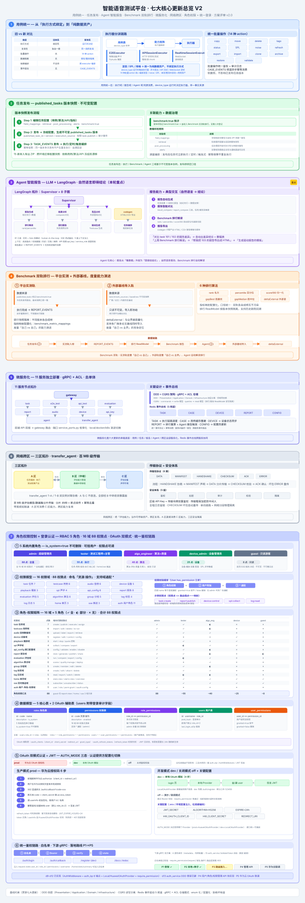

# 智能语音测试平台 · 新功能总览主文档（方案评审版）

> 版本：v1.1（方案评审版 · 已补充核心更新亮点视角）
> 日期：2026-09-14
> 评审对象：七大待开发功能域的整体方案，非单一功能详细设计
> 配套图表：[主架构图V2](./主架构图V2.svg)

---

## 1. 文档说明

### 1.1 背景与目的

平台现有功能文档散落在 `V9.7.10` / `V9.7.31` 两套代码库、`功能设计文档` / `agent化` 等多个目录下，彼此独立、缺乏统一的架构语言与整体蓝图，导致方案评审时无法快速建立全局认知。

本文档将以下**七大待开发功能域**整合为一份可评审的整体方案，回答三个问题：

1. **要做成什么样** —— 七大功能域的目标、范围与核心价值；
2. **怎么搭骨架** —— 统一架构基线（DDD + CQRS + 事件驱动 + 微服务 + 配置化/enum 化）；
3. **先做什么后做什么** —— 功能域间的依赖关系与分阶段实施路线。

### 1.2 范围

| 功能域 | 代码基线 | 核心文档 |
|---|---|---|
| A. 测试执行体系（含混音 / SPL） | V9.7.31 微服务版 | `01_测试执行/*`（UseCase 总览 / 架构设计 / 时序 / 流式推送等）+ `03_音频处理/音频引擎功能总述.md` |
| B. 任务管理 | V9.7.10 | `02_任务管理/*`（任务管理 / 任务发布 / 任务合并 / 数据导入导出） |
| C. 用例管理 | V9.7.10 | `07_用例管理/用例管理功能设计文档.md` |
| D. 报告管理 + Benchmark | V9.7.10 | `05_报告管理/*`（报告管理 / 报告Benchmark排行功能设计文档） |
| E. Agent 化 | V9.7.10 | `agent化/*`（功能介绍 / 用户场景 / 技术设计） |
| F. 微服务化 + 跨区网络传输 | V9.7.31 | `09_跨区网络传输方案.md` + `01_测试执行/02_架构设计.md` |

### 1.3 术语约定

- **camelCase 与 snake_case**：前端只见 camelCase（Domain），Infrastructure 层是唯一知道 snake_case 的层，由适配器/ DTO 完成转换。
- **端口（Ports）**：DDD 中的接口边界，如 `RealtimeDevicePort`、`TaskGatewayPort`。
- **ACL（防腐层）**：微服务间通过 gRPC + ACL 仓储模式消费对方领域，不直接依赖内部实现。
- **Benchmark 双轨**：排行数据的两条来源轨道——平台实测（任务结果沉淀）与外部基线导入（不可变快照），经统一指标映射后参与排行。
- **SPL**：输出声压级（Sound Pressure Level）。通过 device / api_id 到分贝值的对称映射，使 E2E / API / Realtime 三种执行方式音量口径统一。

---

## 2. 现状与问题

### 2.1 现状画像

- **V9.7.10**：单体 Flask + Vue3 + PostgreSQL + WebSocket，功能齐全（音频、用例、任务、评估、报告、设备、算法配置），但为后续演进设下了全部基线。
- **V9.7.31**：已完成测试执行域的**微服务化改造设计**（11 服务、gRPC、Redis 分布式协同），作为本轮改造的先行试水。

### 2.2 核心痛点

| # | 痛点 | 影响 |
|---|---|---|
| P1 | 文档散乱，无统一蓝图 | 评审、排期、交接成本高 |
| P2 | 单体部署、单区运行 | 横向扩展难、跨区协作无法落地（A 区需 C 区算法评估） |
| P3 | 任务管理能力弱 | 无版本发布、无数据迁移手段、合并/回滚靠人工 |
| P4 | 人工操作密集 | 建用例、配算法、跑任务、看报告均为手动，效率低 |
| P5 | 用例与执行方式强耦合 | 无法跨执行方式复用与批量维护，用例资产难以独立沉淀 |
| P6 | 结果停留在单次报告，无基准对比 | 缺乏可横向对比的 Benchmark 资产，能力演进无法度量 |
| P7 | 代码质量参差 | 魔法字符串/数字、大函数、重复代码、无统一枚举与配置 |

### 2.3 本轮核心更新亮点一览

相较 V9.7.10 现状，本轮七大功能域的核心更新要点如下：

| # | 核心更新 | 旧状态（V9.7.10 现状） | 新状态（本轮方案） |
|---|---|---|---|
| **1** | **用例统一** | 用例绑定执行方式（E2E/API/Realtime 各自一套），难以复用、批量维护靠手动 | 用例沉淀为**纯数据资产**，`device_type` 运行时决定执行器，14 种批量 action 统一维护，CASE_EVENTS 异步解耦 |
| **2** | **任务发布** | 任务仅临时运行，无版本发布概念，回滚/追溯靠人肉 | `published_tasks` 版本快照（v1→v2→v3），不可变配置，7 条数据校验，`benchmark:true` 钩子关联 Benchmark 实测轨 |
| **3** | **Agent 化 - 尤其智能报告** | 无智能助手；看报告、对比报告、分析 Benchmark 排行全靠手工操作页面 | LLM + LangGraph 驱动，Agent 可**自动生成/分析/解读报告和 Benchmark 排行**，子图 include「报告生成」「结果分析」「竞品分析」，自然语言即得结论 |
| **4** | **Benchmark 双轨排行** | 执行结果停留在单次报告，无横向对比、无法度量能力演进 | **平台实测轨**（任务标记 benchmark:true）+ **外部基线导入轨**（不可变快照）双轨排行，6 种排行算法（rank/percentile/score100/gapBest/gapMedian/deltaExternal），指标映射配置化 |
| **5** | **微服务化** | 单体 Flask，横向扩展难、服务间耦合高 | 11 服务独立部署（gateway/task/e2e_test/api_test/evaluation/report/audio/device/agent/api_key/transfer_agent），端口集中管理，gRPC + ACL 通信 |
| **6** | **网络跨区** | 单区部署，A 区与 C 区算法评估能力无法共享 | 三区拓扑（A↔B 双向、B→C 单向），`transfer_agent` + 传输包协议 + 分片续传 + 幂等去重 + 5 层安全，A 区可消费 C 区评估能力 |
| **7** | **角色权限 + 登录** | 无统一认证；接口全量开放，权限靠前端隐藏控制 | **OAuth 双模式**（dev 本地 / prod 华为云 / off 跳过）统一登录；**RBAC 5 角色**（admin/tester/algo_engineer/device_admin/guest）+ 55+ 权限点（16 权限域，`资源:操作` 命名）；AuthMiddleware 注入 JWT → `request.state`，路由层 `require_permission` 按需校验；用户/角色/权限管理 API 待实现 |

### 2.4 愿景一句话

> 以**统一的架构基线**（DDD + CQRS + 事件驱动 + 微服务 + 配置化）为骨架，把**测试执行引擎（含混音/SPL）、任务管理链路、用例资产、报告与 Benchmark 双轨、Agent 智能助手、跨区协同传输、角色权限与统一登录**七大能力整合为一个可演进、可扩展、可评审的完整体系。

---

## 3. 总体架构（配主 SVG）



主架构图自上而下分为七块（编号区块）：

1. **七大功能域总览（A~G）**：从测试数据（用例）到执行、评估、报告、Benchmark、Agent、跨区协同、角色权限与统一登录的完整能力地图；
2. **统一架构基线**：七大功能域必须遵守的地基（评审红线：enum 化 / 配置化 / 拒绝魔法数字与硬编码）；
3. **微服务 + 跨区网络传输**：11 服务集中管理、三区部署拓扑与 `transfer_agent` 传输通道；
4. **Agent 化**：LLM + LangGraph Supervisor + 8 子图 + 61 工具，交互与 Solo 双模式；
5. **数据资产闭环**：报告 + Benchmark 双轨（D）、用例管理（C）、混音引擎 / SPL 映射（A）；
6. **实施路线 + 横切纪律**：P0~P3 分阶段路线与贯穿七域的公共约束；
7. **角色权限 + 统一登录（G）**：RBAC 5 角色 / 16 权限域 55+ 权限点 + OAuth 双模式认证（dev/prod/off）、JWT 签发与 AuthMiddleware 鉴权链路。

横切约束贯穿各层：**DDD 四层纪律、CQRS 通道分离、enum 化、配置化、拒绝坏味道**。

---

## 4. 七大功能域总览

| 功能域 | 核心价值 | 关键输入（已有基础） | 关键输出（本轮新增） | 状态 |
|---|---|---|---|---|
| **A. 测试执行（含混音/SPL）** | 多设备类型统一执行、流式结果、音量口径对称 | V9.7.31 微服务架构设计、E2E/API/Realtime 三类执行器、混音与SPL映射图 | 微服务化落地、Adapter 体系、混音/SPL 对称映射、CQRS 改造 | 设计完成，待实施 |
| **B. 任务管理** | 任务全生命周期：发布/合并/迁移 | V9.7.10 任务管理、合并设计 | `published_tasks` 版本快照、15 表导入导出、审计 | 设计完成，待实施 |
| **C. 用例管理** | 用例纯数据资产、批量维护、跨执行方式复用 | V9.7.10 用例模型 | 14 种批量 action、device_type → 执行器分发、CASE_EVENTS | 设计完成，待实施 |
| **D. 报告 + Benchmark** | 报告资产化 + 基准对比双轨排行 | V9.7.10 报告 7 表、评估维度 | Benchmark 实测轨 + 外部基线导入、排行算法、指标映射配置化 | 设计完成，待实施 |
| **E. Agent 化** | LLM + LangGraph 智能助手，自然语言驱动全流程 | V9.7.10 Agent 三件套（功能/场景/技术） | 61 工具、Supervisor+8 子图、SSE、human-in-the-loop | 设计完成，待实施 |
| **F. 微服务化 + 跨区** | 三区隔离协作、百 MB 级数据跨区传输、评估能力共享 | V9.7.31 服务拓扑、跨区方案 | `transfer_agent`、4 类传输包、分片续传、能力注册表 | 方案定稿，待实施 |
| **G. 角色权限 + 登录认证** | 统一登录与鉴权，接口权限收敛到服务端 | RBAC 数据模型（5 表）、OAuth 方案（双模式） | AuthMiddleware + `require_permission` 路由校验、JWT 签发、用户/角色/权限管理 API | d9-d12 已实现，d13 微服务化骨架已建 |

---

## 5. 统一架构基线（贯穿七大域）

所有功能域必须遵守以下基线，是评审的第一检查项。

### 5.1 DDD 四层纪律

```
Presentation   views/ + components/        只见 camelCase Domain + composables（Ports）
Application    composables/ + store/       编排用例、缓存 ReadModel，只见 Domain
Domain         domain/model/ + enums.ts    camelCase、零依赖、无索引签名兜底
Infrastructure api/ + adapters/ + dto/ + http/   唯一知道 snake_case 的层
```

> 铁律：**先重构，再管消费方**；上层不得越过 Application 直接触达 Infrastructure。

### 5.2 CQRS

- **Command 侧**：仅写，走事件发布（如 `TASK_EVENTS`、`CASE_EVENTS`）；幂等、事务。
- **Query 侧**：仅读，缓存 ReadModel（任务列表、报告快照、Benchmark 排行），不产生副作用。
- 同一个聚合可以 Command 模型与 Query 模型分离建模（如 `test_tasks` + 报告 ReadModel）。

### 5.3 事件驱动

| 维度 | 约定 |
|---|---|
| 通道 | Redis EventBus 频道：`TASK_EVENTS` / `CASE_EVENTS` / `DEVICE_EVENTS` / `REPORT_EVENTS` / `CONFIG_EVENTS` |
| 任务队列 | Redis `task:queue`（LPUSH / BRPOP）+ 孤儿任务收养 |
| 消息可靠性 | 跨区场景使用传输包协议（`transfer_id` / `signature` / `ttl`）保证幂等去重 |
| 消息队列取舍 | 不额外引入 MQ，Redis EventBus + 分布式锁/信号量满足当前规模；未来超标再评估 Kafka/RabbitMQ |

### 5.4 微服务化

- 11 个后端服务，端口集中管理在 `shared/config/service_ports.py`；
- 跨服务通信统一 gRPC + ACL 仓储模式（如 `api_test_service.proto`、`evaluation_service.proto`、`audio_service.proto RenderAudioStream`）；
- 多副本与实例亲和：`api_test_service` 双副本，Realtime WS 长连接**实例内闭环** + 会话亲和路由。

### 5.5 配置化与 enum 化（评审红线）

- **拒绝魔法数字 / 魔法字符串 / 硬编码**：所有状态、类型、通道名、策略参数进枚举与配置；
- 示例清单：`DeviceType` / `APIProtocol` / `OutputType` / `CalibrationStatus` / `TransferPackageType` / `TaskStatus` / `PublishedTaskStatus` / `BenchmarkSourceType` / `MixMode`；
- Benchmark 指标映射、SPL 映射配置、混音转换顺序等业务口径均入配置，保证单一事实源；
- 分开发 / 生产环境配置，环境差异收敛到配置文件。

---

## 6. 功能域详述

### 6.1 功能域 A：测试执行体系（含混音 / SPL）

**目标**：以统一引擎支撑多种设备类型（physical / http_api / websocket_api）的测试执行，支持流式推送、结果评估与重新评估，并在不同执行方式间保持**音量口径对称**。

**关键设计**：

- **路由分发**：`device_type` 决定执行方式 —— physical → `e2e_test_service:5002`；http_api / websocket_api → `api_test_service:5003`；E2E 与 Realtime 行为对称。
- **执行模式矩阵**：非实时（一次性任务）/ 流式（Realtime 双通道，frame + summary）。
- **CQRS 与事件驱动**：命令进执行队列，结果通过 `REPORT_EVENTS` 推送，评估异步执行。
- **分布式协同**：物理设备互斥（分布式锁）、Realtime 实例内闭环、孤儿任务收养、运行时状态三层划分。
- **Adapter 体系（P1 新建）**：`infrastructure/adapters/*`，支持新增厂商适配器（厂商协议差异隔离在 Infrastructure 层）。
- **重新评估**：任务结果可重新评估/重新提取，评估维度隔离与报告聚合。

**混音引擎 / SPL 映射（与 V9.7.10 检测引擎对齐）**：

- **渲染双路径**：`AudioStreamOrchestrator` 统一编排 `RenderAudioFile`（文件渲染）与 `RenderAudioStream`（gRPC 流式渲染，`audio_service.proto`）。
- **固定转换顺序**：`AudioFormatAdapter` 固定转换链 —— **位深 → float32 归一化 → resample_poly 重采样 → 声道**（含 5.1 声道、16k 采样率校准），顺序即契约，杜绝魔改。
- **Speaker 感知交叠**：`speakers_map` 交集判断决定是否并行；噪声合并轮次级 > 全局级；多轨 `play_multi` 同流混合（`+=`），压缩增益做 RMS 补偿。
- **SPL 对称映射**：`SPLMappingService`（device → DB）与 `ApiRmsSplService`（api_id → DB）双路径求解；无映射时回退 `_linear_approx`（gain = 10^((target-65)/20)）；输出音量校准后 E2E / API / Realtime 三种方式结果对称可比。

**与 V9.7.10 的差异要点**：API 地址、数据模型（`TaskCase` 增 `device_type` / `device_id`）、gRPC 契约、枚举化迁移，共 15 项适配差异（见 `01_测试执行/01_UseCase总览.md`）。

### 6.2 功能域 B：任务管理

**目标**：任务全生命周期管理，支持发布、合并、导入导出，形成可追溯、可回滚的任务资产。

**三个子能力**：

1. **任务发布**
   - 新表 `published_tasks`（id / source_task_id / version / is_current / snapshot_config / published_by / published_at / status = published | archived）；
   - **不可变版本快照**：v1 → v2 → v3，发布后配置不可变，与 `test_tasks.status` 分离；
   - 可发布状态：completed / failed / stopped / pending；7 条数据校验规则；
   - `test_tasks` 增加追溯字段：`published_task_id` / `published_task_version` / `execution_source`；
   - 权限编码 `task.publish`，审计事件 `PUBLISHED_TASK_CREATED` 等；
   - **Benchmark 钩子**：任务可标记 `benchmark:true`，作为 Benchmark 实测轨的数据源（见 6.4）。

2. **任务合并**：合并配置 / 执行 / 结果管理，合并后的任务可独立执行与统计。

3. **任务数据导入导出**
   - 15 张表 + 磁盘文件打包 ZIP，`manifest.json` 元数据描述；
   - 导出包结构：`manifest.json` + `db/*.json` + `files/` + `meta/dimensions.json`；
   - 导入：ID 自动判断（冲突重映射，`id_mappings` 表 + 15 条外键转换规则）、文件路径重写、预检、事务回滚；
   - 导入后可重新评估 / 重新执行；SocketIO 进度推送。

**接口**：`POST /api/v1/data-transfer/export`、`/import/preview`、`/import`、`/import/progress`；`POST /published-tasks`、`execute`、`versions`、`archive`。

### 6.3 功能域 C：用例管理（纯数据）

**目标**：将用例沉淀为**纯数据资产**，与执行方式解耦；支持统一批量维护，供测试执行域按 `device_type` 在运行时选择执行器消费。

**关键设计**：

- **纯数据不绑执行方式**：用例只描述数据、前置条件、断言依赖与配置引用，不含任何执行方式信息；用例变更不直接触发执行。
- **device_type 决定执行器**：执行侧在运行时按 `device_type` 分派 —— physical → `E2EExecutor`；http_api / websocket_api → `APISessionExecutor`；实时/长连接场景 → `RealtimeSessionExecutor`；执行器注册表可配置扩展。
- **批量操作 action 分发（14 种）**：批量新增 / 编辑 / 复制 / 移动 / 启停 / 标签 / 维度 / 算法绑定 / 删除等，统一经 `CASE_EVENTS` 频道异步处理，命令幂等。
- **与报告 / Benchmark 的衔接**：用例执行结果沉淀到报告域，作为 Benchmark 排行的基础单元（见 6.4）。
- **事件驱动**：用例仓内变更发布 `CASE_EVENTS`，任务执行、报告聚合、Agent 工具按需订阅，不直接依赖执行侧实现。

### 6.4 功能域 D：报告管理 + Benchmark 双轨排行

**目标**：报告资产化管理，并叠加 **Benchmark 双轨排行**，让每次执行结果可横向对比、可衡量能力演进。

**报告管理**：

- 报告 7 表模型（报告主表 + 结果 / 得分 / 维度 / 对比 / 日志 / 附件）；
- 报告对比、导出；评估维度隔离与聚合（与 6.1 重新评估联动）。

**Benchmark 双轨排行**：

- **轨 1 · 平台实测**：任务发布时标记 `benchmark:true`（`published_tasks` 钩子）→ 执行得分进入排行数据；可多版本任务对比。
- **轨 2 · 外部基线导入**：`benchmark_sources` / `baselines` 表承载第三方测评结果，导入即**不可变快照**，附来源、指标、审计；接口如 `baseline/bps_import`。
- **指标映射配置化**：外部指标名 ↔ 平台指标名映射可配置（`指标映射` + `score100` 换算），保证双轨**口径统一、可合并排行**。
- **排行算法**：`rank` / `percentile` / `score100` / `gapBest` / `gapMedian` / `deltaExternal`；排行结果作为 ReadModel 缓存（Query 侧），不直接写报告主链路。

### 6.5 功能域 E：Agent 化（重点：智能报告 / Benchmark 解读）

**目标**：LLM 驱动的智能助手，以自然语言完成「建用例 → 配算法 → 跑任务 → 看报告/Benchmark → 生成驱动」全流程，支持交互模式与 Solo 模式。

**本轮更新重点 —— 智能报告能力（V9.7.10 无）**：

- **报告自动生成**：Agent 依据任务结果/评估维度，自动产出结构化报告（结论先行 + 数据支撑），替代人工排版；
- **报告智能对比**：`result_compare` / `report_compare` 工具，指定 taskIds / reportIds 即得差异结论（gapBest / gapMedian / deltaExternal 口径一致）；
- **Benchmark 排行解读**：Agent 读取排行 ReadModel，自动解释 rank / percentile / score100 等指标准位与差距归因；
- **报告撰写与导出**：驱动生成（codegen）子图可产出报告模板 / HTML / CSV 导出脚本，报告结论直接回流 CASE_EVENTS / REPORT_EVENTS 供二次消费。

**关键设计**：

- **技术选型**：LangGraph + langchain-openai + PostgreSQL Checkpointer + SSE 流式输出（`stream_mode = ['messages', 'updates']`）。
- **拓扑**：Supervisor 模式 + 8 个子图（audio / testcase / task / analysis / compare / codegen / log / algo），共 **61 个工具**（音频入 5 / 用例 10 / 标签 4 / 维度 5 / 算法 5 / 任务 7 / SPL 4 / 播放设备 3 / 结果分析 7 / 报告对比 2 / 日志 4 / 驱动生成 3 / 系统概览 2）。
- **human-in-the-loop**：`interrupt()` + `Command(resume=...)`，SSE 端点 `/api/v1/agent/chat/stream`、`/chat/resume`、`/device/element-picked`。
- **上下文管理（5 层）**：工具结果压缩 / State 分区 / 消息窗口 / Checkpointer / 子图隔离。
- **Solo 模式**：自主循环，`recursion_limit = 50`，每 5 轮 check-in 一次；UiAutoDev 设备驱动生成（事件驱动截图交互：`generate_driver_from_elements` → `register_driver_to_factory` → `debug_execute_step`）。
- **沙盒设计**：AST 静态检查 + Docker（当前），未来扩展更严格隔离。
- **前端**：`useAgent.ts` / `useElementPicker.ts`，对话面板元素卡片交互。

### 6.6 功能域 F：微服务化 + 跨区网络传输

**目标**：三区（A/B/C）隔离部署下实现评估能力共享与数据同步，A 区可消费 C 区的算法评估能力，报告 / 用例 / Benchmark 数据跨区共享。

**拓扑与约束**：

- A ↔ B 双向、B → C 单向、**A 与 C 不直连**；B 为评估中枢；
- 百 MB 级数据传输；用例执行跨区；评估能力分布在不同区；数据隔离。

**关键设计**：

- **`transfer_agent` 微服务**（T-A / T-B 双实例）：DDD 四层目录，负责打包、分片、签名、续传、校验；
- **传输包协议**：`transfer_id` / `pkg_type` / `signature` / `ttl` / `ephemeral`；包类型：`EVAL_REQUEST` / `EVAL_RESULT` / `REPORT_SYNC` / `DATA_SYNC` / `C_REPORT` / `C_RESULT`；
- **分片传输**：4 MB/片、断点续传、幂等去重；
- **评估能力注册表**：`LOCAL` vs `THIRD_PARTY_C`，A 区发起请求 → B 中转 → C 执行 → 结果回传（8 步完整流程）；
- **B → C 三种适配形态**：multipart / 特征提取 / 预签名 URL；
- **安全（5 层）**：网络隔离 / 访问控制 / 签名 / 内容校验 / 审计；
- **选型**：主线方案（高优）—— C 不部署完整栈，仅经传输链路提供评估；备选方案（低优）—— C 部署完整微服务栈，增加 `C_REPORT` / `C_RESULT` 包类型。

---

### 6.7 功能域 G：角色权限控制（RBAC）+ 统一登录认证

#### 6.7.1 现状与目标

**现状痛点**：

| 问题 | 说明 |
|---|---|
| 无统一认证 | 接口全量开放，未登录亦可访问全部 REST 端点 |
| 权限靠前端隐藏 | 后端不做校验，仅前端按角色隐藏菜单/按钮，绕过前端即可越权 |
| 身份不可追溯 | 无用户体系，审计无法回答「谁创建了任务、谁发布了报告」 |
| 微服务无身份边界 | F 域 11 服务化后，各微服务无法识别调用者身份与权限 |

**目标**：

1. **统一登录**：OAuth 双模式（dev 本地 / prod 华为云 / off 跳过），一套 JWT 贯通全部微服务；
2. **权限收敛到服务端**：RBAC 5 角色 + 16 权限域 55+ 权限点，路由层 `require_permission` 强校验，前端隐藏仅作体验优化；
3. **与微服务打通**：下游服务经 gRPC 消费用户身份（方案 A 透传 / 方案 B 自验）；
4. **管理闭环**：用户 / 角色 / 权限管理 API（`user_bp` / `role_bp`）由 `admin` 独占。

#### 6.7.2 角色体系（RBAC）

5 个系统内置角色，`is_system=true` 不可删除，权限点可按需调整：

| 角色 | name | 对应业务角色 | 权限范围 | 权限点数 |
|---|---|---|---|---|
| 超级管理员 | `admin` | — | 全部权限（含用户/角色/权限管理），持有 `*` 通配 | 全部 |
| 测试工程师 | `tester` | 测试工程师 + 测试主管 | 用例/音频/任务/报告/评估/算法参数读写 + 执行 + Solo 批量；不含设备/SPL 管理、算法定义管理、报告发布、用户角色管理 | ~55 |
| 算法工程师 | `algo_engineer` | 算法工程师 + 质量负责人 | 报告/评估/算法配置读写 + 报告发布/对比/趋势分析；不可执行测试与设备操作 | ~40 |
| 设备管理员 | `device_admin` | 设备管理员 | 被测设备/播放设备/SPL/首页/SSE 全权管理；不含用例/任务/报告/算法/用户角色管理 | ~25 |
| 游客 | `guest` | — | 报告只读 + 对比 + 首页统计 + SSE + 认证；不可看日志、不可执行任何写操作 | ~8 |

**业务角色 → 系统角色映射（Agent 场景）**：

| 业务角色 | 系统角色 | 典型需求 |
|---|---|---|
| 测试工程师 | `tester` | 快速建用例、跑测试、出报告 |
| 测试主管 | `tester` | 批量任务、Solo 无人值守、结果对比 |
| 算法工程师 | `algo_engineer` | 看报告、结果对比、找优化方向、算法配置 |
| 质量负责人 | `algo_engineer` | 报告审阅、趋势分析、跨任务对比、报告发布 |
| 设备管理员 | `device_admin` | 新设备接入、驱动生成、设备健康、SPL 校准 |

> 未来可新增自定义角色，由 `admin` 分配权限点。

#### 6.7.3 权限模型

**命名规范**：`资源:操作`，`Permission.name` 与之对应；支持 `*` 通配（仅 `admin` 持有）。共 **16 个权限域、88 个权限点**（含 5 个认证端点）。

以下按域列出全部权限点及其对应端点（源文档 `RBAC权限划分.md` §3.1~§3.16）：

**① 任务管理（task）— 8 点**

| 权限点 | 说明 | 代表端点 |
|---|---|---|
| `task:read` | 查看任务列表/详情/进度/统计 | `GET /api/v1/tasks`、`GET /tasks/{id}` |
| `task:create` | 创建任务 | `POST /api/v1/tasks` |
| `task:update` | 修改任务 | `PUT /api/v1/tasks/{id}` |
| `task:delete` | 删除任务 | `DELETE /api/v1/tasks/{id}` |
| `task:execute` | 启动/停止/重试/控制 | `POST /tasks/{id}/start`、`POST /tasks/{id}/stop` |
| `task:merge` | 合并任务 | `POST /api/v1/tasks/merge` |
| `task:batch` | 批量操作 | `POST /api/v1/tasks/batch-action` |
| `task:reextract` | 重新提取设备结果 | `POST /api/v1/tasks/{id}/reextract` |

**② 测试用例（testcase）— 7 点**

| 权限点 | 说明 | 代表端点 |
|---|---|---|
| `testcase:read` | 查看用例列表/详情/统计 | `GET /api/v1/testcases`、`GET /testcases/{id}` |
| `testcase:create` | 创建用例 | `POST /api/v1/testcases` |
| `testcase:update` | 修改用例/参考参数 | `PUT /api/v1/testcases/{id}` |
| `testcase:delete` | 删除用例 | `DELETE /api/v1/testcases/{id}` |
| `testcase:copy` | 复制用例 | `POST /api/v1/testcases/{id}/copy` |
| `testcase:preview` | 预览执行/停止 | `POST /testcases/{id}/preview` |
| `testcase:import_export` | 导入/导出/模板下载 | `POST /testcases/export`、`POST /testcases/import` |

**③ 音频管理（audio）— 6 点**

| 权限点 | 说明 | 代表端点 |
|---|---|---|
| `audio:read` | 查看音频详情/标签/流播放 | `GET /audios/{id}`、`GET /audios/tags` |
| `audio:upload` | 上传/导入/录制（含分片） | `POST /audios/by-ids`、`POST /audios/url-import`、`POST /audios/upload/*` |
| `audio:update` | 修改元数据/算法/标注 | `PUT /audios/{id}/metadata` |
| `audio:delete` | 删除音频 | `DELETE /api/v1/audios/{id}` |
| `audio:convert` | 转码/音频预览 | `POST /audios/{id}/convert` |
| `audio:folder` | 文件夹树管理 | `POST /api/v1/audios/folder-tree` |

**④ 被测设备（device）— 5 点**

| 权限点 | 说明 | 代表端点 |
|---|---|---|
| `device:read` | 查看设备列表/详情/状态 | `GET /api/v1/test-devices`、`GET /test-devices/{id}` |
| `device:create` | 新增设备 | `POST /api/v1/test-devices` |
| `device:update` | 修改设备 | `PUT /api/v1/test-devices/{id}` |
| `device:delete` | 删除设备 | `DELETE /api/v1/test-devices/{id}` |
| `device:control` | 健康检查/扫描/测试 | `POST /test-devices/health-check`、`POST /test-devices/scan` |

**⑤ 播放设备（playback）— 5 点**

| 权限点 | 说明 | 代表端点 |
|---|---|---|
| `playback:read` | 查看播放设备列表/详情 | `GET /api/v1/playback-devices` |
| `playback:create` | 新增播放设备 | `POST /api/v1/playback-devices` |
| `playback:update` | 修改/关联 SPL | `PUT /api/v1/playback-devices/{id}` |
| `playback:delete` | 删除播放设备 | `DELETE /api/v1/playback-devices/{id}` |
| `playback:control` | 扫描/测试 | `POST /playback-devices/scan` |

**⑥ 声压级映射（spl）— 5 点**

| 权限点 | 说明 | 代表端点 |
|---|---|---|
| `spl:read` | 查看 SPL 映射/历史/统计 | `GET /api/v1/spl`、`GET /spl/{id}` |
| `spl:create` | 创建 SPL 映射 | `POST /api/v1/spl` |
| `spl:update` | 修改/校准 | `PUT /api/v1/spl/{id}`、`POST /spl/{id}/calibrate` |
| `spl:delete` | 删除 SPL 映射 | `DELETE /api/v1/spl/{id}` |
| `spl:test_tone` | 测试音播放/停止 | `POST /api/v1/spl/test-tone` |

**⑦ API 配置（api_config）— 5 点**

| 权限点 | 说明 | 代表端点 |
|---|---|---|
| `api_config:read` | 查看 API 列表/详情 | `GET /api/v1/apis` |
| `api_config:create` | 新增 API 配置 | `POST /api/v1/apis` |
| `api_config:update` | 修改 API 配置 | `PUT /api/v1/apis/{id}` |
| `api_config:delete` | 删除 API 配置 | `DELETE /api/v1/apis/{id}` |
| `api_config:test` | 测试/停止测试连接 | `POST /apis/{id}/health` |

**⑧ 报告（report）— 7 点**

| 权限点 | 说明 | 代表端点 |
|---|---|---|
| `report:read` | 查看报告列表/详情/进度 | `GET /api/v1/reports`、`GET /reports/{id}` |
| `report:create` | 生成任务报告 | `POST /api/v1/reports/generate-task` |
| `report:update` | 修改报告 | `PUT /api/v1/reports/{id}` |
| `report:delete` | 删除报告/批量删除 | `DELETE /api/v1/reports/{id}` |
| `report:publish` | 发布报告 | `POST /api/v1/reports/{id}/publish` |
| `report:compare` | 报告对比/导出/均值 | `POST /reports/compare`、`POST /reports/export` |
| `report:download_log` | 下载用例日志 | `GET /api/v1/reports/{id}/cases/{cid}/logs/download` |

**⑨ 评估维度（evaluation）— 5 点**

| 权限点 | 说明 | 代表端点 |
|---|---|---|
| `evaluation:read` | 查看维度/选项/分类 | `GET /evaluation/dimensions` |
| `evaluation:execute` | 触发重新评估 | `POST /api/v1/evaluation/task/reevaluate` |
| `evaluation:dim_manage` | 维度 CRUD / 批量 / 计算 | `POST /evaluation/dimensions`、`DELETE /evaluation/dimensions/{id}` |
| `evaluation:category_manage` | 评估分类 CRUD | `POST /evaluation/categories` |
| `evaluation:import_export` | 维度导入/导出 | `POST /evaluation/dimensions/import` |

**⑩ 算法配置（algorithm）— 5 点**

| 权限点 | 说明 | 代表端点 |
|---|---|---|
| `algorithm:read` | 查看算法定义/分组/参数 | `GET /algorithm/definitions`、`GET /algorithm/params` |
| `algorithm:definition_manage` | 算法定义 CRUD | `POST /algorithm/definitions` |
| `algorithm:group_manage` | 算法分组 CRUD | `POST /algorithm/groups` |
| `algorithm:param_manage` | 算法参数 CRUD | `POST /algorithm/params` |
| `algorithm:case_param_manage` | 用例算法参数 CRUD | `POST /algorithm/case-params` |

**⑪ 用例分组（group）— 4 点**

| 权限点 | 说明 | 代表端点 |
|---|---|---|
| `group:read` | 查看用例分组列表 | `GET /api/v1/groups` |
| `group:create` | 创建分组 | `POST /api/v1/groups` |
| `group:update` | 修改分组/移动用例 | `PUT /api/v1/groups/{id}` |
| `group:delete` | 删除分组 | `DELETE /api/v1/groups/{id}` |

**⑫ 标签管理（tag）— 4 点**

| 权限点 | 说明 | 代表端点 |
|---|---|---|
| `tag:read` | 查看标签/分类 | `GET /api/v1/tags`、`GET /tags/categories` |
| `tag:create` | 创建标签/分类 | `POST /api/v1/tags`、`POST /tags/categories` |
| `tag:update` | 修改标签/分类/批量 | `PUT /api/v1/tags/{id}` |
| `tag:delete` | 删除标签/分类 | `DELETE /api/v1/tags/{id}` |

**⑬ 日志（log）— 3 点**

| 权限点 | 说明 | 代表端点 |
|---|---|---|
| `log:read` | 查看日志/统计/归档 | `GET /api/v1/logs`、`GET /logs/stats` |
| `log:manage` | 清空/归档/删除归档 | `POST /logs/clear`、`POST /logs/archive` |
| `log:websocket` | WebSocket 日志推送 | `WS /api/v1/logs` |

**⑭ 首页（home）— 2 点**

| 权限点 | 说明 | 代表端点 |
|---|---|---|
| `home:read` | 首页统计汇总/详情 | `GET /api/v1/home/stats/summary` |
| `home:refresh` | 刷新首页统计 | `POST /api/v1/home/stats/refresh` |

**⑮ 实时事件（sse）— 1 点**

| 权限点 | 说明 | 代表端点 |
|---|---|---|
| `sse:read` | 订阅 SSE 事件流 | `GET /api/v1/sse/events` |

**⑯ 用户角色与认证管理（user / role / permission / auth）— 16 点**

| 权限点 | 说明 | 计划端点 |
|---|---|---|
| `user:read` | 查看用户列表/详情 | `GET /api/v1/auth/users` |
| `user:create` | 创建用户 | `POST /api/v1/auth/register`(dev) |
| `user:update` | 修改用户信息/状态 | `PUT /api/v1/auth/users/{id}` |
| `user:delete` | 禁用/删除用户 | `DELETE /api/v1/auth/users/{id}` |
| `user:assign_role` | 分配用户角色 | `POST /api/v1/auth/users/{id}/role` |
| `user:grant_permission` | 授予/撤销附加权限 | `POST /api/v1/auth/users/{id}/permissions` |
| `role:read` | 查看角色列表/详情/权限 | `GET /api/v1/auth/roles` |
| `role:create` | 创建自定义角色 | `POST /api/v1/auth/roles` |
| `role:update` | 修改角色/权限分配 | `PUT /api/v1/auth/roles/{id}` |
| `role:delete` | 删除自定义角色 | `DELETE /api/v1/auth/roles/{id}` |
| `permission:read` | 查看所有权限点 | `GET /api/v1/auth/permissions` |
| `auth:login` | 登录 | `GET/POST /api/v1/auth/login` |
| `auth:callback` | OAuth 回调 | `GET /api/v1/auth/callback` |
| `auth:refresh` | 刷新令牌 | `POST /api/v1/auth/refresh` |
| `auth:logout` | 登出 | `POST /api/v1/auth/logout` |
| `auth:me` | 获取当前用户信息 | `GET /api/v1/auth/me` |

> 以上 16 域共 88 个权限点；`user` / `role` / `permission` 域的管理类 API 仅 `admin` 可访问，其余认证端点（auth:*）所有角色均可访问。

**角色-权限完整矩阵（16 域 × 5 角色）**：

> `✓` = 拥有，`✗` = 无。`admin` 持有全部权限（统一标 `✓`），不再单列。

| 域 | 权限点 | admin | tester | algo_engineer | device_admin | guest |
|---|---|---|---|---|---|---|
| **任务** | task:read | ✓ | ✓ | ✓ | ✗ | ✗ |
| | task:create | ✓ | ✓ | ✗ | ✗ | ✗ |
| | task:update | ✓ | ✓ | ✗ | ✗ | ✗ |
| | task:delete | ✓ | ✓ | ✗ | ✗ | ✗ |
| | task:execute | ✓ | ✓ | ✗ | ✗ | ✗ |
| | task:merge | ✓ | ✓ | ✗ | ✗ | ✗ |
| | task:batch | ✓ | ✓ | ✗ | ✗ | ✗ |
| | task:reextract | ✓ | ✓ | ✗ | ✗ | ✗ |
| **用例** | testcase:read | ✓ | ✓ | ✓ | ✗ | ✗ |
| | testcase:create | ✓ | ✓ | ✗ | ✗ | ✗ |
| | testcase:update | ✓ | ✓ | ✗ | ✗ | ✗ |
| | testcase:delete | ✓ | ✓ | ✗ | ✗ | ✗ |
| | testcase:copy | ✓ | ✓ | ✗ | ✗ | ✗ |
| | testcase:preview | ✓ | ✓ | ✗ | ✗ | ✗ |
| | testcase:import_export | ✓ | ✓ | ✗ | ✗ | ✗ |
| **音频** | audio:read | ✓ | ✓ | ✓ | ✗ | ✗ |
| | audio:upload | ✓ | ✓ | ✗ | ✗ | ✗ |
| | audio:update | ✓ | ✓ | ✗ | ✗ | ✗ |
| | audio:delete | ✓ | ✓ | ✗ | ✗ | ✗ |
| | audio:convert | ✓ | ✓ | ✗ | ✗ | ✗ |
| | audio:folder | ✓ | ✓ | ✗ | ✗ | ✗ |
| **被测设备** | device:read | ✓ | ✓ | ✗ | ✓ | ✗ |
| | device:create | ✓ | ✗ | ✗ | ✓ | ✗ |
| | device:update | ✓ | ✗ | ✗ | ✓ | ✗ |
| | device:delete | ✓ | ✗ | ✗ | ✓ | ✗ |
| | device:control | ✓ | ✗ | ✗ | ✓ | ✗ |
| **播放设备** | playback:read | ✓ | ✗ | ✗ | ✓ | ✗ |
| | playback:create | ✓ | ✗ | ✗ | ✓ | ✗ |
| | playback:update | ✓ | ✗ | ✗ | ✓ | ✗ |
| | playback:delete | ✓ | ✗ | ✗ | ✓ | ✗ |
| | playback:control | ✓ | ✗ | ✗ | ✓ | ✗ |
| **声压级** | spl:read | ✓ | ✗ | ✗ | ✓ | ✗ |
| | spl:create | ✓ | ✗ | ✗ | ✓ | ✗ |
| | spl:update | ✓ | ✗ | ✗ | ✓ | ✗ |
| | spl:delete | ✓ | ✗ | ✗ | ✓ | ✗ |
| | spl:test_tone | ✓ | ✗ | ✗ | ✓ | ✗ |
| **API 配置** | api_config:read | ✓ | ✓ | ✓ | ✗ | ✗ |
| | api_config:create | ✓ | ✓ | ✗ | ✗ | ✗ |
| | api_config:update | ✓ | ✓ | ✗ | ✗ | ✗ |
| | api_config:delete | ✓ | ✓ | ✗ | ✗ | ✗ |
| | api_config:test | ✓ | ✓ | ✗ | ✗ | ✗ |
| **报告** | report:read | ✓ | ✓ | ✓ | ✗ | ✓ |
| | report:create | ✓ | ✓ | ✓ | ✗ | ✗ |
| | report:update | ✓ | ✓ | ✓ | ✗ | ✗ |
| | report:delete | ✓ | ✓ | ✗ | ✗ | ✗ |
| | report:publish | ✓ | ✗ | ✓ | ✗ | ✗ |
| | report:compare | ✓ | ✓ | ✓ | ✗ | ✓ |
| | report:download_log | ✓ | ✓ | ✓ | ✗ | ✗ |
| **评估** | evaluation:read | ✓ | ✓ | ✓ | ✗ | ✗ |
| | evaluation:execute | ✓ | ✓ | ✗ | ✗ | ✗ |
| | evaluation:dim_manage | ✓ | ✓ | ✓ | ✗ | ✗ |
| | evaluation:category_manage | ✓ | ✓ | ✓ | ✗ | ✗ |
| | evaluation:import_export | ✓ | ✓ | ✓ | ✗ | ✗ |
| **算法** | algorithm:read | ✓ | ✓ | ✓ | ✗ | ✗ |
| | algorithm:definition_manage | ✓ | ✗ | ✓ | ✗ | ✗ |
| | algorithm:group_manage | ✓ | ✗ | ✓ | ✗ | ✗ |
| | algorithm:param_manage | ✓ | ✗ | ✓ | ✗ | ✗ |
| | algorithm:case_param_manage | ✓ | ✓ | ✓ | ✗ | ✗ |
| **用例分组** | group:read | ✓ | ✓ | ✓ | ✗ | ✗ |
| | group:create | ✓ | ✓ | ✗ | ✗ | ✗ |
| | group:update | ✓ | ✓ | ✗ | ✗ | ✗ |
| | group:delete | ✓ | ✓ | ✗ | ✗ | ✗ |
| **标签** | tag:read | ✓ | ✓ | ✓ | ✗ | ✗ |
| | tag:create | ✓ | ✓ | ✗ | ✗ | ✗ |
| | tag:update | ✓ | ✓ | ✗ | ✗ | ✗ |
| | tag:delete | ✓ | ✓ | ✗ | ✗ | ✗ |
| **日志** | log:read | ✓ | ✓ | ✓ | ✗ | ✗ |
| | log:manage | ✓ | ✓ | ✗ | ✗ | ✗ |
| | log:websocket | ✓ | ✓ | ✓ | ✗ | ✗ |
| **首页** | home:read | ✓ | ✓ | ✓ | ✓ | ✓ |
| | home:refresh | ✓ | ✓ | ✗ | ✗ | ✗ |
| **SSE** | sse:read | ✓ | ✓ | ✓ | ✓ | ✓ |
| **用户角色** | user:read | ✓ | ✗ | ✗ | ✗ | ✗ |
| | user:create | ✓ | ✗ | ✗ | ✗ | ✗ |
| | user:update | ✓ | ✗ | ✗ | ✗ | ✗ |
| | user:delete | ✓ | ✗ | ✗ | ✗ | ✗ |
| | user:assign_role | ✓ | ✗ | ✗ | ✗ | ✗ |
| | user:grant_permission | ✓ | ✗ | ✗ | ✗ | ✗ |
| | role:read | ✓ | ✗ | ✗ | ✗ | ✗ |
| | role:create | ✓ | ✗ | ✗ | ✗ | ✗ |
| | role:update | ✓ | ✗ | ✗ | ✗ | ✗ |
| | role:delete | ✓ | ✗ | ✗ | ✗ | ✗ |
| | permission:read | ✓ | ✗ | ✗ | ✗ | ✗ |
| **认证** | auth:login~me（5 点） | ✓ | ✓ | ✓ | ✓ | ✓ |

**角色权限点数汇总**：

| 角色 | 权限点数 | 范围 |
|---|---|---|
| `admin` | 全部 88 点 | 含用户/角色/权限管理 |
| `tester` | ~55 点 | 用例/音频/任务/报告/评估/算法参数读写 + 执行；不含设备/SPL/算法定义管理/报告发布/用户角色管理 |
| `algo_engineer` | ~40 点 | 报告/评估/算法配置读写 + 报告发布/对比；不含测试执行/设备/用户角色 |
| `device_admin` | ~25 点 | 被测设备/播放设备/SPL/首页/SSE；不含用例/任务/报告/算法 |
| `guest` | ~8 点 | 报告只读 + 对比 + 首页统计 + SSE + 认证 |

**校验逻辑 `User.has_permission()`**（已实现，定义在 auth_service domain 层）：

```python
def has_permission(self, perm_name: str) -> bool:
    """三步校验：角色权限 → 用户附加权限 → * 通配"""
    # 第 1 步：角色权限匹配
    if self.role:
        for rp in self.role.permissions:  # role_permissions
            if rp.name == perm_name or rp.name == '*':
                return True
    # 第 2 步：用户附加权限（差量覆盖）
    for up in self.user_permissions:
        if up.name == perm_name:
            return up.granted  # True=授予, False=撤销
    # 第 3 步：* 通配（仅 admin 持有该 permission row）
    return False
```

> 校验顺序：先看角色底表（命中即通过），再看用户级覆盖（可撤销角色中已有权限或追加额外权限），最后 `*` 通配留给 admin 兜底。

#### 6.7.4 认证体系（OAuth 双模式 + JWT）

**模式切换**（环境变量 `AUTH_MODE` 配置化，唯一入口 `AuthService` 按模式分派）：

| AUTH_MODE | 认证提供方 | 行为 | 适用场景 |
|---|---|---|---|
| `dev` | `LocalOAuthProvider` | 本地 OAuth Server（mock 授权码模式），自动创建测试用户（默认 admin 角色），无需外网 | 本地开发 / 单元测试 / CI |
| `prod` | `HuaweiOAuthProvider` | 华为云 OAuth 授权码模式，需 `HW_OAUTH_*` 配置完整 | 生产部署 |
| `off` | — | 完全跳过认证，注入默认开发用户（`user_id=0` / `role_id=0` / 空权限） | 临时调试 / 升级过渡期 |

**配置项清单（`.env` / `.env.example`）**：

```bash
# ===== 认证配置 =====
AUTH_MODE=dev                      # dev(本地OAuth) / prod(华为云OAuth) / off(无认证)

# JWT 配置
JWT_SECRET=your-jwt-secret-key-change-in-production   # 生产必须替换，禁止硬编码
JWT_EXPIRE_HOURS=24                # token 有效期（小时）
JWT_ALGORITHM=HS256

# 开发模式 - 本地 OAuth
DEV_OAUTH_CLIENT_ID=local_dev_client
DEV_OAUTH_CLIENT_SECRET=local_dev_secret
DEV_OAUTH_REDIRECT_URI=http://localhost:8000/api/v1/auth/callback
DEV_DEFAULT_USERNAME=dev_user      # 本地登录默认账号
DEV_DEFAULT_PASSWORD=dev_password  # 本地登录默认密码
DEV_DEFAULT_ROLE=admin             # 本地默认用户角色

# 生产模式 - 华为云 OAuth
HW_OAUTH_CLIENT_ID=
HW_OAUTH_CLIENT_SECRET=
HW_OAUTH_REDIRECT_URI=http://your-domain/api/v1/auth/callback
HW_OAUTH_AUTHORIZE_URL=https://oauth.huaweicloud.com/oauth2/authorize
HW_OAUTH_TOKEN_URL=https://oauth.huaweicloud.com/oauth2/token
HW_OAUTH_USERINFO_URL=https://oauth.huaweicloud.com/oauth2/userinfo
```

**生产模式（华为云 OAuth 授权码）完整时序**：

```
前端                          网关 (api_gateway)                华为云
  │                             │                                │
  │  ① GET /api/v1/auth/login   │                                │
  │ ─────────────────────────►  │                                │
  │                             │  AuthService.get_login_url()   │
  │                             │  构造 authorize URL            │
  │  ② 302 → 华为云授权页       │  (client_id+redirect_uri+      │
  │ ◄─────────────────────────  │   scope+state)                 │
  │                             │                                │
  │  ③ 浏览器跳转华为云授权页    │                                │
  │  ────────────────────────────────────────────────────────►  │
  │  用户在华为云登录并授权       │                                │
  │ ◄────────────────────────────────────────────────────────   │
  │  ④ 302 → /auth/callback?code=xxx&state=xxx                  │
  │                             │                                │
  │  ⑤ GET /auth/callback       │                                │
  │  ─────────────────────────►  │                                │
  │                             │  AuthService.handle_callback:  │
  │                             │  a. POST /oauth2/token         │
  │                             │    (code→access_token)         │
  │                             │  ───────────────────────────►  │
  │                             │  {access_token}                │
  │                             │  ◄───────────────────────────  │
  │                             │  b. GET /oauth2/userinfo       │
  │                             │    (Bearer token→用户信息)      │
  │                             │  ───────────────────────────►  │
  │                             │  {name,email,unionid,picture}  │
  │                             │  ◄───────────────────────────  │
  │                             │  c. _find_or_create_user       │
  │                             │    (oauth_provider+oauth_id 幂等)│
  │                             │  d. 装配权限列表 → 签发 JWT      │
  │  ⑥ 200 {access_token,       │                                │
  │     token_type, expires_in, │                                │
  │     user}                   │                                │
  │ ◄─────────────────────────  │                                │
  │                             │                                │
  │  后续请求: Authorization: Bearer xxx                         │
  │  ─────────────────────────►  AuthMiddleware: 解析→注入→路由   │
```

**开发模式（本地 OAuth）完整时序**：

```
前端                          网关 (api_gateway)
  │                             │
  │  ① GET /api/v1/auth/login   │
  │ ─────────────────────────►  │
  │  ② 返回本地登录页 HTML       │
  │     (用户名/密码 表单)       │
  │ ◄─────────────────────────  │
  │  ③ POST /api/v1/auth/login  │
  │     {username, password}    │
  │ ─────────────────────────►  │
  │                             │  LocalOAuthProvider:
  │                             │  a. 校验 DEV_DEFAULT_USERNAME/PASSWORD
  │                             │  b. 查找/创建本地 User（默认 admin 角色）
  │                             │  c. 装配权限列表 → 签发 JWT (HS256)
  │  ④ 200 {access_token, user} │
  │ ◄─────────────────────────  │
  │  后续请求: 同生产模式         │
```

**`off` 模式行为**：`AuthMiddleware` 直接注入 `user_id=0 / role_id=0 / permissions=[]` 放行，白名单与 Bearer 校验全部跳过——用于升级过渡期兼容未接入登录的旧服务，上线后应收敛为 `dev` / `prod`。

**JWT 规范**：

| 项 | 值 | 说明 |
|---|---|---|
| 算法 | HS256（`JWT_ALGORITHM`） | 对称签名，密钥不进代码仓库 |
| 有效期 | 24 小时（`JWT_EXPIRE_HOURS=24`） | 到期由前端引导重新登录 |
| payload | `user_id` / `username` / `role_id` / `permissions` / `iat` / `exp` | permissions 为权限点字符串数组，随 token 下发 |
| 密钥 | `JWT_SECRET`（.env 注入） | 禁止硬编码；生产环境长度 ≥ 32 字符 |
| 刷新 | `/auth/refresh` 无状态重签 | 换发新 JWT，不落库；如需强失效可扩展 Redis 黑名单 |

**auth_bp 端点（5 个）**：

| 端点 | 方法 | 用途 | 白名单 |
|---|---|---|---|
| `/api/v1/auth/login` | GET / POST | 登录入口：prod 返回 302 授权 URL / dev 返回登录表单并接收提交 | ✅ |
| `/api/v1/auth/callback` | GET | OAuth 回调：code + state → 换取用户 → 签发 JWT | ✅ |
| `/api/v1/auth/register` | POST | 注册（**仅 dev 模式**开放） | ✅（dev） |
| `/api/v1/auth/refresh` | POST | 刷新 token（无状态重签，换发新 JWT） | ❌ |
| `/api/v1/auth/logout` | POST | 登出（JWT 无状态 —— 前端删 token；如需强失效，token 进 Redis 黑名单） | ❌ |
| `/api/v1/auth/me` | GET | 当前用户信息（user_id / username / role_id / permissions） | ❌ |

**白名单路由汇总**（`AuthMiddleware.PUBLIC_PATHS`，免鉴权）：

| 路由前缀 | 说明 |
|---|---|
| `/api/v1/auth/login` | 登录入口 |
| `/api/v1/auth/callback` | OAuth 回调 |
| `/api/v1/auth/register` | 注册（仅 dev 模式） |
| `/docs`、`/openapi.json`、`/redoc` | API 文档 |
| `/api/v1/home/stats/summary` | 首页公开统计（可选放开） |

#### 6.7.5 鉴权链路（网关层）

**AuthMiddleware（请求入口，双模式分派）**：

```
请求 → CORSMiddleware → AuthMiddleware → 路由
                          │
        ┌─────────────────┼───────────────────┐
        ▼                 ▼                   ▼
 AUTH_MODE=off      白名单路由跳过       提取 Bearer token
 （注入默认用户）   （/auth/login、/auth/  → TokenService.verify
                    callback、/auth/       → 注入 request.state：
                    register(仅dev)、       user_id / role_id /
                    /docs、/openapi.json）   permissions / username
```

**核心实现（`api_gateway/middleware.py`）**：

```python
class AuthMiddleware(BaseHTTPMiddleware):
    """认证中间件 - 双模式支持"""

    # 无需认证的路由前缀（白名单）
    PUBLIC_PATHS = [
        '/api/v1/auth/login',
        '/api/v1/auth/callback',
        '/api/v1/auth/register',  # 仅 dev 模式
        '/docs', '/openapi.json', '/redoc',
    ]

    async def dispatch(self, request, call_next):
        auth_mode = config.AUTH_MODE  # dev / prod / off

        # 1. off 模式：完全跳过认证，注入默认开发用户
        if auth_mode == 'off':
            request.state.user_id = 0
            request.state.role_id = 0
            request.state.permissions = []
            return await call_next(request)

        # 2. 白名单路由：跳过认证
        path = request.url.path
        if any(path.startswith(p) for p in self.PUBLIC_PATHS):
            return await call_next(request)

        # 3. 提取 Bearer token
        auth_header = request.headers.get('Authorization', '')
        if not auth_header.startswith('Bearer '):
            return _unauthorized('缺少认证令牌')
        token = auth_header[7:]

        # 4. JWT 校验 + 注入身份
        try:
            payload = TokenService.verify(token)
            request.state.user_id = payload['user_id']
            request.state.role_id = payload['role_id']
            request.state.permissions = payload['permissions']
            request.state.username = payload['username']
        except Exception as e:
            return _unauthorized(f'令牌无效: {e}')

        return await call_next(request)
```

**路由层强校验（`api_gateway/application/services/auth/dependencies.py`）**：

```python
def require_permission(request: Request, perm: str):
    """路由级权限校验：request.state.permissions 不含目标权限点（且非 *）→ 403"""
    permissions = request.state.permissions or []
    if perm not in permissions and '*' not in permissions:
        raise HTTPException(403, f'缺少权限: {perm}')

# 路由示例（B 域任务创建）
@router.post('')
def create_task(request: Request):
    require_permission(request, 'task:create')   # ← 先校验，再执行业务
    ...
```

> 未接入 `require_permission` 的路由暂保持默认放行，按业务模块逐步铺开（结算优先级见 6.7.7）。

**下游微服务消费身份（两种方案）**：

| 方案 | 做法 | 权衡 |
|---|---|---|
| A · 透传（轻量） | 网关在 gRPC metadata 携带 `user_id` / `permissions`，下游直接信任 | 实现简单、无额外 RTT；信任链集中在网关 |
| B · 自验（安全） | 下游调 `auth_service.ValidateToken` / `GetUserPermissions` 自行校验 | 权限变更实时生效；多一次服务调用 |

> 推荐：内网服务间走 A，跨区 / 对外敏感操作走 B。

#### 6.7.6 数据模型与种子数据

**5 张表**（PO 下沉至 `auth_service`，DDD Infrastructure 层，`infrastructure/persistence/models/user_models.py`）：

```
users ──role_id──> roles ──< role_permissions >── permissions
  │                                                        ▲
  └──< user_permissions >──────────────────────────────────┘
        (granted=true: 授予 / granted=false: 撤销)
```

| 表 | 模型 | 用途 |
|---|---|---|
| `roles` | Role | 角色定义，`name` 唯一，`is_system` 标记内置角色（不可删） |
| `permissions` | Permission | 权限点定义，`name` 格式 `资源:操作` |
| `role_permissions` | RolePermission | 角色-权限多对多映射 |
| `users` | User | 用户，`role_id` 关联角色；含 OAuth 绑定字段（oauth_provider / oauth_id / unionid / nickname / avatar / last_login_at / last_login_ip） |
| `user_permissions` | UserPermission | 用户附加权限，`granted` 控制授予 / 撤销方向 |

> 另含 OAuth 辅助表：`oauth_clients`（OAuth 客户端）、`oauth_refresh_tokens`（刷新令牌）。

**种子数据 SQL**（首次部署由初始化脚本 / migration 执行，示例）：

```sql
-- 1. 角色表（5 系统内置角色，is_system=true 不可删除）
INSERT INTO roles (name, description, is_system) VALUES
('admin',        '超级管理员',                        true),
('tester',       '测试工程师（含测试主管）',           true),
('algo_engineer','算法工程师（含质量负责人）',         true),
('device_admin', '设备管理员',                        true),
('guest',        '游客',                              true);

-- 2. 权限表（节选示例，完整 88 点见 6.7.3）
INSERT INTO permissions (name, description) VALUES
('task:read',    '查看任务'),
('task:create',  '创建任务'),
('task:execute', '执行/控制任务'),
('report:publish','发布报告'),
('device:control','设备控制'),
('user:assign_role','分配用户角色'),
('role:delete',  '删除角色'),
('*',            '超级通配（仅 admin）');

-- 3. 角色-权限映射（admin → '*' 通配；其余角色按 6.7.3 矩阵关联）
-- admin
INSERT INTO role_permissions (role_id, permission_id)
SELECT r.id, p.id FROM roles r CROSS JOIN permissions p WHERE r.name = 'admin';
-- tester（示例：任务域全部读写 + 报告只读）
INSERT INTO role_permissions (role_id, permission_id)
SELECT r.id, p.id FROM roles r, permissions p
WHERE r.name = 'tester' AND p.name IN ('task:read','task:create','task:execute','report:read','report:compare');
```

> 校验逻辑见 6.7.3 `User.has_permission()`：角色底表命中即通过 → 用户附加权限（`user_permissions`）可差量授予/撤销 → `*` 通配仅 admin 兜底。

#### 6.7.7 实施状态与路线

| 阶段 | 内容 | 状态 |
|---|---|---|
| d9 | 认证骨架：AuthMiddleware + TokenService + auth_bp 5 端点 | ✅ 已实现 |
| d10 | LocalOAuthProvider（本地登录页 + JWT 签发） | ✅ 已实现 |
| d11 | HuaweiOAuthProvider（授权码模式，token/userinfo 换取） | ✅ 已实现 |
| d12 | `require_permission` 路由层校验（含 `*` 通配判断） | ✅ 已实现 |
| d13 | `auth_service` 微服务化（DDD 四层骨架 + run_all.py 纳入启动） | ⚠️ 骨架已建，docker-compose 未纳入 |
| P4 | 用户 / 角色 / 权限管理 API（user_bp / role_bp） | 待实现 |
| 铺开 | 各业务路由按模块接入 `require_permission` | 待铺开 |

**落地优先级（P1→P5，对齐 `RBAC权限划分.md` §6.4）**：

| 优先级 | 内容 | 说明 |
|---|---|---|
| P1 | `AuthMiddleware` + `TokenService` + `auth_bp` 路由（登录/回调/刷新/登出/me） | **已完成**（认证骨架） |
| P2 | 开发模式 `LocalOAuthProvider` + 种子数据初始化 | **已完成**（本地开发可用） |
| P3 | 路由层接入 `require_permission`（按业务模块逐步铺开） | 进行中：B 域任务路由先行试点，其余模块滚动接入 |
| P4 | 用户 / 角色 / 权限管理 API（`user_bp` / `role_bp`） | 待实现：补全「权限收敛到服务端」闭环 |
| P5 | 华为云 OAuth Provider（生产模式） | **已完成 Provider**；待生产联调（client_id/secret/域名回调配置） |

**评审建议**：

1. 「AUTH_MODE=off 过渡」必须配套上线收敛窗口：生产环境默认 `prod`，`off` 仅允许临时调试，禁止长期驻留；
2. P4（管理 API）建议优先完成 —— 否则角色/权限变更只能走种子脚本，无法满足「谁改了什么」的审计诉求；
3. 敏感端点（report:publish、device:control、user:*、role:*）优先接入 `require_permission`，公开读端点（home:read、report:read）次之；
4. 下游微服务鉴权：先统一走方案 A（透传）跑通链路，跨区/敏感服务切换方案 B（自验）。

> **风险提示**：管理 API 未上线前，角色/权限变更只能走种子脚本；JWT 无状态意味着权限变更需等 token 过期（最长 24h）才生效——若需实时失效，方案 B（自验）+ Redis 黑名单。

---

## 7. 功能域间依赖关系

```
┌──────────────┐  用例消费    ┌────────────────┐
│ C. 用例管理   │───────────► │ A. 测试执行      │
└──────────────┘              └───────┬────────┘
       ▲            工具集            │ 得分数据
       │                              ▼
┌──────────────┐  ┌────────────────────────────┐
│ E. Agent 化   │─►│ D. 报告 + Benchmark 双轨    │◄── B. 任务管理（benchmark:true）
└──────────────┘  └────────────────────────────┘
       ▲                        │ 跨区同步（REPORT_SYNC / DATA_SYNC）
       │                        ▼
       └───────────┐   ┌────────────────────────┐
                   └──►│ F. 微服务化 + 跨区传输   │
                       └────────────────────────┘
```

| 依赖 | 说明 | 方向 |
|---|---|---|
| C → A | 用例管理（纯数据）被测试执行消费，`device_type` 决定执行器 | 强 |
| A → D | 执行得分进入报告与 Benchmark 实测轨排行 | 强 |
| C → D | 用例执行结果沉淀至报告 / Benchmark | 强 |
| B → D | `published_tasks` 标记 `benchmark:true` 提供实测轨数据源 | 中 |
| A / B / D → F | 执行、任务、报告 / Benchmark 数据的跨区同步依赖传输链路 | 强 |
| E → A/B/C/D | Agent 工具集消费测试、任务、用例、报告领域能力（任务 7 工具、用例 10 工具、报告对比 2 工具等） | 强 |
| E → F | Agent 编排与检查点使用共享基础设施，但设计上不依赖具体服务部署形态 | 弱 |
| F → 各域 | 传输链路是跨区场景的公共数据底座 | 基础设施 |
| G → A~F | 认证鉴权是全域横切能力：所有路由经 `AuthMiddleware` 鉴权 + `require_permission` 校验，下游微服务经 gRPC 消费用户身份（方案 A 透传 / 方案 B 自验） | 横切 |

---

## 8. 实施路线

### 阶段划分（原则：先骨架后血肉、先单区后跨区、先手动后智能）

| 阶段 | 范围 | 里程碑 | 依赖 |
|---|---|---|---|
| **P0 基线固化** | 统一架构基线落地：DDD 四层纪律、enum 化清单、配置化、环境分离；确认 11 服务代码基线 | 基线检查单通过，评审红线零违反 | 无 |
| **P1 核心域上量（单区）** | A. 测试执行微服务化（路由 / Adapter / CQRS）+ 混音 / SPL 接入 · B. 任务发布与导入导出 · C. 用例管理 · D. 报告 7 表 + Benchmark 双轨上线 | A/B/C/D 在单区可交付；Benchmark 口径统一（实测 vs 外部基线换算规则冻结） | P0 |
| **P2 Agent 化** | E. LangGraph 编排、61 工具分层接入、SSE、human-in-the-loop、Solo 模式 | Agent 可完成端到端样例流程（建用例→跑任务→看报告/Benchmark） | A、B、C、D（工具消费方） |
| **P3 跨区协同** | F. `transfer_agent`、传输包协议、分片续传、能力注册表、三区联调 | A↔B→C 评估链路贯通，报告 / 用例 / Benchmark 跨区同步 | A、B（P1 产物） |

### 风险提示

- **并行开发冲突**：A 域 gRPC 契约冻结后，C/E 域工具与 F 域传输方可并行；
- **接口冻结顺序**：`api_test_service.proto` / `evaluation_service.proto` / `audio_service.proto` 优先冻结，作为全员消费契约；
- **Benchmark 口径**：外部基线与平台实测的映射换算规则须在 P1 冻结（指标映射配置化），否则双轨排行不可合并；
- **过渡策略**：V9.7.10 单体与 V9.7.31 微服务并存期，用网关与 ACL 双向兼容，避免一次性切换。

---

## 9. 方案评审关注点（评审清单）

### 9.1 架构一致性
- [ ] 七域是否都遵守 DDD 四层纪律（Presentation / Application / Domain / Infrastructure）？
- [ ] CQRS 是否严格 Command 写 / Query 读分离？Benchmark 排行 ReadModel 有无 Query 写副作用？
- [ ] 事件通道命名与职责是否统一（5 大频道：TASK / CASE / DEVICE / REPORT / CONFIG）？跨区包类型是否与单区事件语义对齐？
- [ ] 是否做到 enum 化、配置化、零魔法数字/字符串？
- [ ] Benchmark 双轨（平台实测 / 外部基线）排行口径是否对外一致？指标映射是否配置化（单一事实源）？
- [ ] 混音转换顺序（位深 → float32 → 重采样 → 声道）是否以配置/契约固化？SPL 双路径映射与回退策略是否明确？
- [ ] 前后端字段命名是否有统一适配机制（camelCase ↔ snake_case 收敛于 Infrastructure）？

### 9.2 依赖与边界
- [ ] 微服务间是否全部经 gRPC + ACL？有无绕过网关直连？
- [ ] Agent 工具是否只经 Application 层消费领域能力？
- [ ] 用例是否保持**纯数据**（不绑执行方式）？`device_type` → 执行器注册表是否达成共识？
- [ ] 用例批量 action（14 种）是否均走 `CASE_EVENTS` 且命令幂等？
- [ ] 任务发布快照（`published_tasks`）与执行任务（`test_tasks`）的状态是否真正解耦？`benchmark:true` 标记与版本快照是否兼容？
- [ ] 导入导出的 15 表依赖顺序与 ID 重映射规则是否覆盖全部关联场景？

### 9.3 可靠性
- [ ] 跨区传输：分片、断点续传、幂等去重、TTL、限速是否齐备？
- [ ] 事件消费是否幂等？孤儿任务收养、Realtime 实例内闭环是否可验证？
- [ ] 导入导出事务回滚与预检是否完整？
- [ ] 外部基线导入是否为不可变快照 + 审计？来源 / 指标 / 版本校验是否完整？
- [ ] SPL 无映射回退（`_linear_approx`）是否可观测 / 可追踪？混音交叠的轮次级顺序是否有据可查？

### 9.4 安全与合规
- [ ] 跨区 5 层安全（网络/访问/签名/内容/审计）是否落实？签名防篡改？
- [ ] Agent 沙盒（AST + Docker）是否足以防止恶意工具执行？
- [ ] 权限编码（如 `task.publish`、`benchmark.manage`）与审计事件是否覆盖重要变更？
- [ ] 外部基准来源是否可信证明 / 数据校验通过才可入库？
- [ ] 是否所有受限端点按资源收敛到服务端（RBAC 权限点映射完整、`require_permission` 已接入）？是否存在靠前端隐藏兜底的越权路径？
- [ ] 认证模式是否收敛到 `AUTH_MODE` 三态？生产环境是否强制 `prod`（华为云 OAuth）且 `JWT_SECRET` 走密钥注入（无硬编码）？
- [ ] JWT 是否只承载最小声明（user_id / username / role_id / permissions）？过期与刷新策略（`JWT_EXPIRE_HOURS`）是否明确？登出强失效（Redis 黑名单）是否符合合规要求？
- [ ] 系统角色（`is_system=true`）是否不可删除、权限可调整？用户/角色/权限管理 API 是否仅 `admin` 可访问？
- [ ] 下游微服务身份校验是否明确（方案 A 透传 / 方案 B 自验）？跨区或对外敏感操作是否强制方案 B？

---

## 10. 附录：文档索引

| 功能域 | 文档 | 位置 |
|---|---|---|
| 通用 | 前后端字段命名适配机制 | `11_数据映射/`（V9.7.10） |
| A | UseCase 总览 / 架构设计 / 流程图 / 类设计 | `01_测试执行/`（V9.7.31，含 `svg/09_DDD四层与实施路线.svg`） |
| A | 流式推送 / 混音与 SPL 映射 / 端到端测试 | `01_测试执行/`（V9.7.31） |
| A | 音频引擎功能总述（混音 / SPL / 渲染） | `03_音频处理/音频引擎功能总述.md`（V9.7.10） |
| A | 路由与废弃 / 评估与前端 | `01_测试执行/`（V9.7.10） |
| B | 任务管理 / 任务发布 / 任务合并 | `02_任务管理/`（V9.7.10） |
| B | 任务数据导入导出 | `02_任务管理/任务数据导入导出功能设计文档.md`（V9.7.10） |
| C | 用例管理功能设计文档 | `07_用例管理/用例管理功能设计文档.md`（V9.7.10） |
| D | 报告管理功能设计文档 | `05_报告管理/报告管理功能设计文档.md`（V9.7.10） |
| D | 报告 Benchmark 排行功能设计文档 | `05_报告管理/报告Benchmark排行功能设计文档.md`（V9.7.10） |
| E | 功能介绍 / 用户场景 / 技术设计 | `agent化/`（V9.7.10） |
| F | 跨区网络传输方案 | `09_跨区网络传输方案.md`（V9.7.31） |
| F | 微服务架构设计与分布式协同 | `01_测试执行/02_架构设计.md`（V9.7.31） |
| G | RBAC 权限划分 | `docs/RBAC权限划分.md`（V9.7.31） |
| G | OAuth 认证方案设计 | `docs/oauth.md`（V9.7.31） |

---

*本文档为方案评审入口文档，各章节详细设计以附录索引中的专题文档为准。评审结论后，本总览将随专题文档同步更新。*