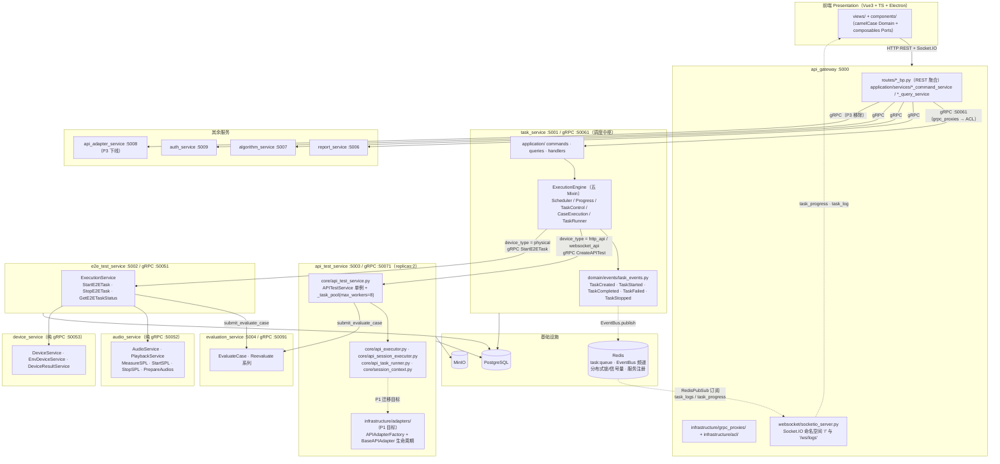
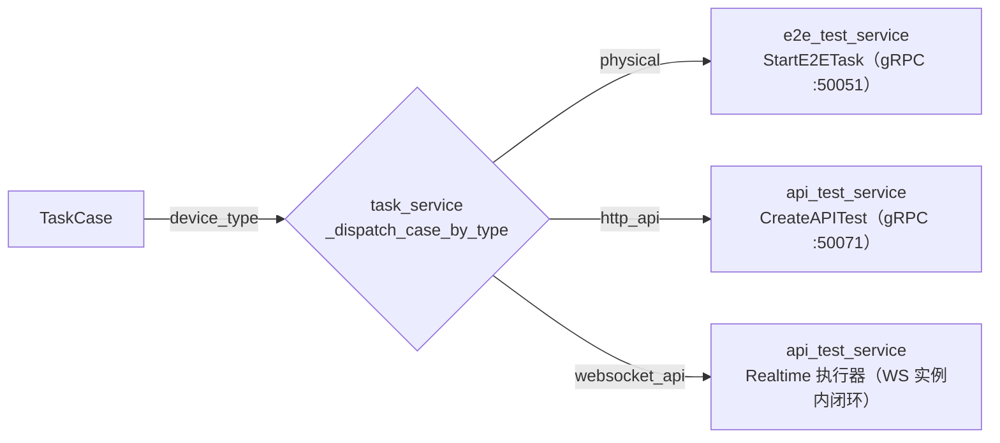
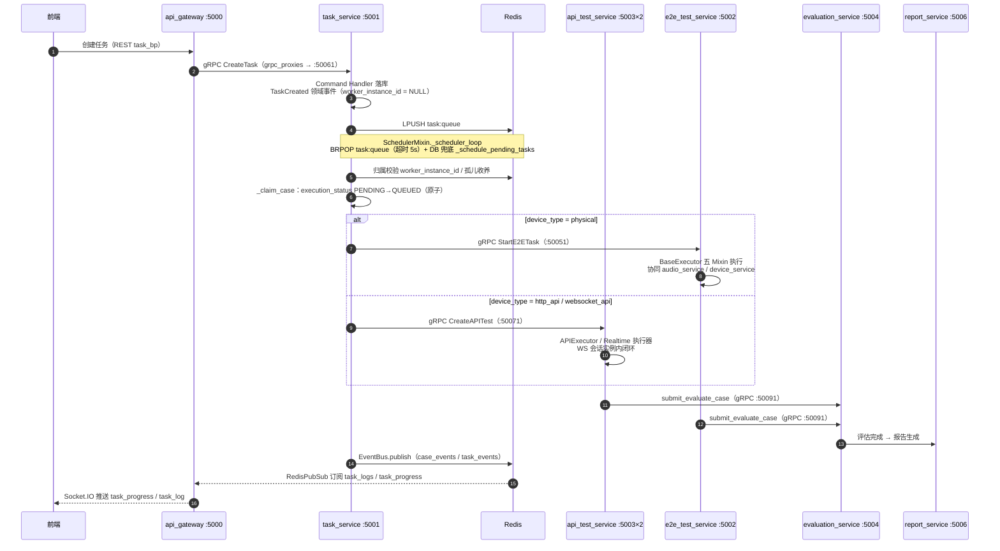

# 02 架构设计 —— 测试执行（V9.7.31 微服务版）

> **版本**：V9.7.31 v1.0（2026-09-10）
> **适配自**：V9.7.10《02_架构设计》v3.1
> **架构基线**：DDD + CQRS + 微服务 + Redis 分布式

【适配说明】本文档由 V9.7.10 单体架构版《02_架构设计》v3.1 适配而来。**设计语义不变**（device_type 路由分发、APIAdapter 生命周期体系、E2E / Realtime 执行、SPL 映射），**落位按 V9.7.31 服务边界重组**：不新建服务、不引入 MQ，跨服务通信一律 gRPC（ACL 仓储模式），分布式协同复用 Redis EventBus + `task:queue`。文中所有端口、路径、类名均已对照 V9.7.31 真实代码核验（`shared/config/service_ports.py`、`run_all.py`、`docker/docker-compose.yml`、`task_service/core/execution_engine/`、`shared/utils/redis_pubsub.py`、`shared/utils/distributed_coordinator.py` 等），与实际不符处按实际书写。

---

## 一、背景与问题

### 1.1 V9.7.10 遗留问题（单体视角）

V9.7.10 中，调度、执行、评估、报告全部位于单一 backend 进程内：

| # | 问题 | 单体表现 |
|---|------|---------|
| 1 | 路由分发耦合 | `ExecutionEngine` 在进程内按 `device_type` 直接实例化执行器，无法独立伸缩 |
| 2 | Realtime 长连接不可扩展 | WS 会话与调度器同进程，单体无法水平扩展 |
| 3 | 互斥控制进程内化 | physical 设备互斥、endpoint 并发控制均为进程内 dict/锁，多进程部署即失效 |
| 4 | 魔法值硬编码 | `device_type`、端口、并发上限散落为魔法字符串/魔法数字 |
| 5 | 无环境区分 | 开发/生产启动方式与配置混用 |

### 1.2 V9.7.31 微服务化后的新问题域

服务拆分（`run_all.py` 编排 11 个后端服务）之后，问题从"进程内如何分层"升级为"跨服务如何协同"：

1. **按 device_type 分发**从进程内函数调用变为跨服务 gRPC 路由（task_service → api_test_service / e2e_test_service）；
2. **api_test_service 以 replicas:2 多副本部署**（`docker/docker-compose.yml` 中 `deploy: replicas: 2`），Realtime WS 长连接必须**实例内闭环**，禁止跨实例迁移；
3. **physical 设备是全局独占资源**，互斥控制必须从进程内锁升级为 Redis 分布式锁（`shared/infrastructure/distributed_coordinator.py`）；
4. **调度器从单进程循环升级为多实例竞争消费**：`task:queue`（Redis List，LPUSH/BRPOP）+ `worker_instance_id` 归属校验 + 孤儿收养；
5. **运行时状态必须在"内存视图 / Redis 真相源 / DB 持久化"三层间明确归属**（见第五章 5.5 节）。

---

## 二、设计目标

1. **语义不变**：device_type 路由、APIAdapter 生命周期（initialize / pre_process / send / recv / post_process / teardown）、E2E 与 Realtime 行为对称、SPL 映射语义全部保留；
2. **落位按服务边界**：调度中枢落 task_service，API 执行落 api_test_service，physical 执行落 e2e_test_service，评估落 evaluation_service；
3. **不新建服务、不引入 MQ**：分布式协同复用 Redis（EventBus 发布订阅 + `task:queue` 队列 + 分布式锁/信号量 + 服务注册）；
4. **跨服务一律 gRPC（ACL 仓储模式）**：网关与各服务通过 `infrastructure/grpc_proxies/`、`infrastructure/acl/` 隔离 proto 细节；
5. **魔法值一律枚举/配置化**：`shared/models/common_enums.py`（后端）与 `frontend/src/domain/enums.ts`（前端镜像）承载枚举；`shared/config/service_ports.py` 承载端口；`shared/config/concurrency_config.json` 承载并发参数；
6. **分开发/生产环境**：开发环境 `run_all.py` 本地编排，生产环境 `docker/docker-compose.yml` 容器编排（api_test_service replicas:2）；
7. **先重构，再管消费方**：proto 契约与领域模型先行（P0），消费方（网关、前端）随后切换。

---

## 三、总体架构

### 3.1 服务拓扑与总体架构图



### 3.2 服务清单与端口

端口唯一真相源为 `shared/config/service_ports.py`，禁止各服务硬编码：

| 服务 | HTTP 端口 | gRPC 端口 | 职责 | 部署形态 |
|------|-----------|-----------|------|---------|
| api_gateway | 5000 | — | REST 聚合、鉴权、Socket.IO/SSE 事件回推 | 单实例 |
| task_service | 5001 | 50061 | 调度中枢（ExecutionEngine）、任务 CQRS | 单实例 |
| e2e_test_service | 5002 | 50051 | physical 设备测试执行（ExecutionService） | 单实例 |
| api_test_service | 5003 | 50071 | http_api / websocket_api 执行 | **replicas:2** |
| evaluation_service | 5004 | 50091 | 用例评估（EvaluateCase / Reevaluate 系列） | 单实例 |
| report_service | 5006 | — | 报告生成 | 单实例 |
| algorithm_service | 5007 | — | 算法结果获取 | 单实例 |
| api_adapter_service | 5008 | 50081 | 旧适配服务（**P3 下线**） | 单实例 |
| auth_service | 5009 | — | 认证鉴权 | 单实例 |
| audio_service | — | 50052 | 音频播放 / 混音 / SPL 测量 | 纯 gRPC |
| device_service | — | 50053 | 设备管理 / 环境设备 / 结果提取 | 纯 gRPC |

【适配说明】`docker/docker-compose.yml` 中 api_adapter_service 容器内监听 8000，但向注册表注册 5008；此不一致属遗留，P3 下线时一并消除。

### 3.3 device_type 路由分发（跨服务）

V9.7.10 中 `ExecutionEngine` 在进程内按 device_type 选择执行器；V9.7.31 中该语义升级为 **task_service 内判定 + gRPC 跨服务分发**：



- 枚举承载：`DeviceType`（`PHYSICAL` / `HTTP_API` / `WEBSOCKET_API`）——【适配说明】**待新增**至 `shared/models/common_enums.py`，前端镜像待新增至 `frontend/src/domain/enums.ts`；
- 判定位置：`task_service/core/execution_engine/mixins/task_dispatch.py` 的 `_dispatch_case_by_type` ——【适配说明】**现状仍按 `task.type == 'api'` 判定，P0 改造为按 `TaskCase.device_type` 判定**（`task_models.py` 中 `TaskCase` 现无 `device_type` 列）；
- 占位原子性：下发前经 `_claim_case` 将 `execution_status` 由 `PENDING` → `QUEUED` 原子占用，防止重复下发。

### 3.4 与 device_service 的对称关系

（对应源文档 3.3「与 device_driver 对称关系」，语义保留、名称按现服务化落位。）

两类执行对"被测对象"的驱动方式完全对称，且共用同一套 `BaseExecutor` 五 Mixin（`shared/infrastructure/base_executor/_base.py`：`ControlMixin` / `LoggingMixin` / `ParamsMixin` / `ResultsMixin` / `DbMixin`）：

| 维度 | e2e_test_service（physical） | api_test_service（http_api / websocket_api） |
|------|------------------------------|----------------------------------------------|
| 驱动对象 | 物理设备（经 device_service gRPC :50053） | HTTP 端点 / WS 会话 |
| 设备侧协作 | device_service（DeviceService / EnvDeviceService / DeviceResultService） | —（端点即被测对象） |
| 音频侧协作 | audio_service（PlaybackService / AudioService，gRPC :50052） | 同左（播放 / SPL 换算） |
| 结果回收 | DeviceResultService.CollectResult | core/api_result_processor.py |
| 评估出口 | 统一经 `submit_evaluate_case`（gRPC :50091） | 同左 |

### 3.5 E2E 与 Realtime 行为对称映射

（对应源文档 3.5，语义保留、按微服务边界重排。）

| 行为 | E2E（physical） | Realtime（websocket_api） |
|------|-----------------|---------------------------|
| 承载服务 | e2e_test_service `ExecutionService.StartE2ETask` | api_test_service Realtime 执行器（P1 落位 `application/services/realtime_session_executor.py`） |
| 会话形态 | 设备指令流（串口/驱动） | WS 长连接，**实例内闭环**（见 5.2） |
| 音频下发 | audio_service `PlaybackService.StartPlayback` | `RenderAudioStream`（server-streaming）——【适配说明】**audio_service.proto 待新增该 RPC** |
| SPL 测量 | `AudioService.MeasureSPL / StartSPL / StopSPL` | SPL 映射换算（配置经 `SPLConfigService` 下发） |
| 结果提取 | `DeviceResultService.CollectResult` | `core/api_result_processor.py` |
| 评估 | `submit_evaluate_case` → evaluation_service | 同左（多模态字段见 7.2） |
| 互斥约束 | 设备全局独占（DistributedLock，见 5.3） | endpoint 并发上限（DistributedSemaphore，见 5.3） |

### 3.6 Adapter 体系落位（api_test_service 内部）

V9.7.10 的 `APIAdapterFactory` + `BaseAPIAdapter` 生命周期（initialize → pre_process → send → recv → post_process → teardown）语义**原样保留**，落位如下：

| 组成 | V9.7.31 落位 | 现状 |
|------|--------------|------|
| APIAdapterFactory（工厂） | `api_test_service/infrastructure/adapters/` | 【适配说明】**待建（P1）** |
| BaseAPIAdapter（生命周期模板） | 同上 | 【适配说明】**待建（P1）** |
| HTTP 适配 / Realtime（WS）适配 | 同上，按 `APIProtocol`（`HTTP` / `WEBSOCKET`，**待新增枚举**）分型 | 【适配说明】**待建（P1）** |
| 执行器（过渡实现） | `core/api_executor.py`、`core/api_session_executor.py`、`core/api_task_runner.py`、`core/session_context.py`、`core/api_result_processor.py` | 已存在，P1 按 DDD 迁移至 `application/services/` |
| 引擎外壳 | `core/api_test_service.py`：`APITestService` 单例 + `_APIEngineAdapter`（stop_flags / pause_flags / api_entry_status 内存实现）+ `_task_pool = ThreadPoolExecutor(max_workers=8)`，懒加载 APIExecutor | 已存在 |

`infrastructure/adapters/` 是 api_test_service 唯一允许出现协议细节（报文格式、WS 帧协议）的位置，符合 DDD「Infrastructure 唯一知道外部格式」的分层约束；并发上限等参数从 `shared/config/concurrency_config.json`（api_executor 节）读取，禁止硬编码。

### 3.7 前后端统一设计（DDD 四层镜像）

前端与后端遵循同一套四层结构与命名纪律：

| 层 | 前端 | 后端服务（以 api_test_service 为例） |
|----|------|--------------------------------------|
| Presentation | `views/` + `components/`，只见 camelCase Domain 与 composables（Ports） | `api_gateway/routes/*_bp.py` + `schemas/` |
| Application | `composables/` + `store/`，编排用例、缓存 ReadModel | `application/commands|queries|handlers/` |
| Domain | `domain/model/` + `domain/enums.ts`，零依赖、无索引签名兜底 | `domain/entities|value_objects|events|services/` |
| Infrastructure | `api/` + `adapters/` + `dto/` + `http/`，唯一知道 snake_case | `infrastructure/grpc_proxies|acl|persistence|oss/` + `interfaces/grpc/` |

- 前端枚举镜像：`frontend/src/domain/enums.ts` 已有 `TaskStatus / TaskType / ExecutionStatus / EvaluationStatus / TestType / RoundMode / ViewMode / UploadStatus / FieldType / ReportStatus / HttpStatus / DeviceStatus / LogLevel / ApiEndpointStatus`；【适配说明】**待镜像新增** `DeviceType / OutputType / CalibrationStatus`。
- 网关侧 ReadModel：`api_gateway/infrastructure/read_models/read_models.py` 缓存查询视图，与前端 Application 层的 ReadModel 缓存对称。

---

## 四、测试执行数据流

### 4.1 全链路时序



### 4.2 各阶段职责划分

| 阶段 | 责任服务 | 关键组件 | 关键约束 |
|------|---------|---------|---------|
| 创建 | api_gateway → task_service | 网关 `task_command_service` → task_service `application/commands/` + `handlers/` | Command 只写；`TaskCreated` 事件经 EventBus 广播 |
| 启动 | task_service | `LPUSH task:queue` | 任务归属 `worker_instance_id = NULL`，待调度认领 |
| 调度 | task_service | `mixins/scheduler.py`：`_scheduler_loop`（`BRPOP` + `DEFAULT_BRPOP_TIMEOUT = 5`）、`_consume_redis_queue`、`_schedule_pending_tasks`（DB 兜底） | E2E 全局互斥（`running_e2e`）、API 互斥（`running_apis` 集合）；`_claim_case` 原子占位 |
| 分发 | task_service | `mixins/task_dispatch.py` `_dispatch_case_by_type` | 按 `TaskCase.device_type` 路由（P0 改造点） |
| 执行 | api_test_service / e2e_test_service | `APITestService`（线程池 max_workers=8）/ `ExecutionService`；共用 `BaseExecutor` 五 Mixin | Realtime 会话实例内闭环；`APIConcurrencyManager` 控制 API 并发 |
| 评估 | evaluation_service | `EvaluateCase` / `Reevaluate` 系列 | 执行器统一经 `submit_evaluate_case` 调用 |
| 报告 | report_service | 评估完成事件触发 | `REPORT_EVENTS` 频道广播 |
| 事件回推 | api_gateway | `app.py::_start_redis_subscriber` → `RedisPubSub().subscribe(['task_logs', 'task_progress'])` → `ws_manager.emit_sync` / `broadcast_log_sync` → Socket.IO；`routes/sse_bp.py` 另订阅 `sse_events` | 命名空间 `'/'` 推 `task_progress` / `report_generated` / `secondary_compare_generated`；`'/ws/logs'` 推 `task_log`（支持 `subscribe_task` / `unsubscribe_task` / `set_filter`） |

【适配说明】跨服务调用全部为 gRPC；阶段间解耦全部通过 Redis（队列 + 频道），不引入 MQ。

---

## 五、分布式部署设计（重点）

### 5.1 部署拓扑

| 环境 | 编排入口 | 形态 |
|------|---------|------|
| 开发 | `run_all.py` | 11 个后端服务本地进程顺序启动 + redis / postgres / minio 本地拉起 + 前端 Vite dev server（`VITE_API_TARGET` 指向 5000） |
| 生产 | `docker/docker-compose.yml` | 容器编排；**api_test_service `deploy: replicas: 2`**，其余服务单副本 |

多副本只出现在 api_test_service，原因：HTTP/WS 用例占执行时长绝对大头，且 Realtime WS 会话为有状态长连接（见 5.2）；e2e_test_service 保持单副本（physical 设备全局独占，5.3）。

### 5.2 Realtime WS 长连接的实例内闭环

【适配说明】本节为 V9.7.31 新增设计约束（源文档无），源于 api_test_service 多副本。

**约束**：Realtime（websocket_api）会话的 WS 连接由**创建它的那个 api_test_service 实例独占持有**，会话全生命周期（连接建立 → 指令下发 → 音频流 → 结果回收 → 断开）禁止跨实例迁移。

**机制**：

1. **认领即绑定**：task_service 经 `_claim_case` 占位用例后，将 `task_id → api_test 实例` 的绑定写入 Redis（复用 `shared/utils/redis_pubsub.py::RedisStore` 的 Hash + TTL 形态），实例标识来自 `shared/utils/service_registry.py::RedisServiceRegistry`（`service:instances` Hash，TTL 15s，心跳间隔 `ttl // 3`）；
2. **亲和路由**：后续 `StopAPITest` / `GetAPITestStatus` 等调用经注册表定位到**持有实例**直达（`get_one` / `get_alive_ids`），避免打到无会话副本；
3. **失败自愈**：持有实例崩溃时，心跳过期由 task_service `_adopt_orphan_tasks` 收养（见 5.4），会话内中间态用例回退 `PENDING` 重新调度——代价是该 Realtime 会话重建，属可接受的有损恢复；
4. **落位**：会话上下文现状存于 `core/session_context.py`（实例内存）；P1 迁移至 `application/services/realtime_session_executor.py` 后，内存闭包语义不变，仅绑定元数据落 Redis。

**反例（禁止）**：跨实例共享 WS 连接池、把会话状态全量塞 Redis 每帧同步——前者破坏单写者原则，后者把高频音频流变成 Redis 热点。

### 5.3 physical 互斥与同 endpoint 并发控制

互斥原语全部来自 `shared/infrastructure/distributed_coordinator.py`，受环境变量 `DISTRIBUTED_COORDINATOR_ENABLED` 开关控制：

| 原语 | 实现 | 降级行为 |
|------|------|---------|
| `DistributedLock` | `SET NX EX` + 随机 token + Lua CAS 释放 | Redis 不可用时**降级放行**（开发环境单机调试友好；生产环境必须开启开关，见 5.6/第九章） |
| `DistributedSemaphore` | Lua 原子 `INCR`/`DECR` + `EXPIRE`，进程内 `BoundedSemaphore` 兜底 | Redis 不可用时退化为进程内信号量 |

**（a）physical 设备全局互斥**

- 场景：同一物理设备同一时刻只能被一个 e2e 用例占用；
- 方案：`DistributedLock`，key 规划 `lock:task:physical:{device_id}`——【适配说明】key 前缀需在 `common_enums.py::RedisKeyPrefix` 中枚举化（现状该枚举已有，扩充成员即可）；
- 辅助：`set_flag` / `clear_flag` / `is_flag_set` 承载 stop/pause 等控制标志位，替代进程内 `stop_flags` / `pause_flags` 的跨实例可见性缺口。

**（b）同 endpoint 并发控制**

- 场景：对同一 API endpoint 的并发用例数存在上限（防止被测端过载）；
- 现状两处：
  - API 粒度：`api_test_service/core/api_concurrency_manager.py::APIConcurrencyManager` 已实现 `DistributedSemaphore`，key 为 `_API_SEM_KEY_PREFIX = 'api:sem:'` + `{api_id}`，即 **`api:sem:{api_id}`**，进程内 `BoundedSemaphore` 兜底；
  - endpoint 粒度：`task_service/core/execution_engine/mixins/case_execution.py::_update_endpoint_health` 现为**进程内 dict**——【适配说明】**P2 改造为 Redis 分布式信号量**，key 规划 `sem:api:endpoint:{host}`，上限值入 `concurrency_config.json`（api_executor 节新增 `max_per_endpoint`），消灭魔法数字。
- E2E 全局互斥：`ExecutionEngine` 现以进程内 `running_e2e` 集合互斥（`_schedule_pending_tasks`）；e2e_test_service 单副本下成立，多副本化时升级为 `DistributedSemaphore` / `set_flag`（预留，不提前实现）。

### 5.4 worker_instance_id 与中断恢复（孤儿收养）

- **归属落库**：`task_models.py::Task` 已含 `worker_instance_id` 列；任务被某实例消费后写回该实例标识；
- **消费侧校验**：`mixins/scheduler.py::_consume_redis_queue` 在 `BRPOP` 取出任务后校验 `worker_instance_id` 归属，非本实例持有的任务不执行；
- **抢占原语**：`distributed_coordinator.py::try_claim_task / release_task_claim` 提供原子抢占；
- **心跳过期判定**：`RedisServiceRegistry`（`service:instances` Hash，TTL 15s，心跳间隔 `ttl // 3`）中实例 key 消失即判定失联；
- **收养流程**（`_adopt_orphan_tasks`）：心跳过期实例名下的任务解除归属 → 处于中间态（`status_constants.py` 中 `ACTIVE_*` 集合：`EXECUTING` / `QUEUED` 等）的用例回退 `PENDING` → 重新入队；
- **状态判定集合**：`shared/utils/status_constants.py` 的 `FINISHED_*` / `ACTIVE_*` / `INTERRUPTED_*` frozenset 统一判定，禁止魔法字符串比较。

### 5.5 运行时状态归属三层划分

**原则：进程内存只是视图，Redis 是运行时真相源，DB 是持久化真相源；任何跨实例决策不得只依赖内存视图。**

| 状态 | 内存视图（进程内） | Redis 真相源 | DB 持久化 |
|------|--------------------|--------------|-----------|
| 执行引擎工作台 | `ExecutionEngine`：`workers` / `stop_flags` / `pause_flags` / `api_executors` / `task_queue` / `running_tasks` / `running_apis` / `running_e2e` / `task_locks` / `task_progress_cache` / `round_progress_cache` / `task_completion_events`（`execution_engine/__init__.py`） | —（实例私有，重启即弃） | — |
| Realtime 会话上下文 | `core/session_context.py` | `task_id → 实例` 绑定（RedisStore Hash + TTL，见 5.2） | — |
| API 并发 | `BoundedSemaphore` 兜底 | `api:sem:{api_id}`（DistributedSemaphore） | — |
| endpoint 并发 | — | `sem:api:endpoint:{host}`（P2 新增） | — |
| physical 互斥 | — | `lock:task:physical:{device_id}`（P2 枚举化） | — |
| 控制标志（stop/pause） | `stop_flags` / `pause_flags`（本实例可见） | `set_flag` / `clear_flag` / `is_flag_set`（跨实例可见） | — |
| 服务发现 | — | `service:instances`（Hash）+ `service:set:{service_name}`（Set），TTL 15s | — |
| 任务归属 | — | 抢占标记（`try_claim_task`） | `Task.worker_instance_id` |
| 任务/用例状态 | 进度缓存 | 事件频道（瞬时） | `TaskStatus` / `TaskCaseStatus` / `execution_status`（唯一真相源） |
| 进度推送 | `task_progress_cache` / `round_progress_cache` | `RedisPubSub.publish_progress` → `task_progress` 频道 | 落库 |
| 日志 | — | `RedisPubSub.publish_log` → `task_logs` 频道 | 落库 |
| 评估结果 / 报告 | — | `REPORT_EVENTS` 频道（瞬时） | PostgreSQL + MinIO |

### 5.6 生产环境开关纪律

- `DISTRIBUTED_COORDINATOR_ENABLED = true`（生产强制）；开发单机可关闭以获得 Redis 故障降级放行；
- Redis 生产环境按需开启持久化（开发环境 `run_all.py` 以 `--save '' --appendonly no` 启动，定位为**纯运行时状态存储**，不持久化——故"Redis 真相源"语义仅覆盖运行时窗口，终态一律落 DB）。

---

## 六、CQRS 与事件驱动

### 6.1 task_service command / query 分离

```
task_service/
├─ application/
│  ├─ commands/        # 写命令：CreateTask / StartTask / StopTask / PauseTask …
│  ├─ queries/         # 读查询：任务列表 / 详情 / 进度
│  └─ handlers/        # 命令与查询处理器（Command 只写 DB，Query 只读）
├─ domain/
│  └─ events/task_events.py
└─ infrastructure/persistence/models/task_models.py
```

- Command 侧：`CreateTask` 落库（`worker_instance_id = NULL`、状态 `PENDING`）→ 发出 `TaskCreated` 领域事件 → `LPUSH task:queue`；
- Query 侧：进度查询优先读 Redis 进度缓存（`task_progress_cache`），详情读 DB，禁止 Query 反向触发写；
- 网关同构：`api_gateway/application/services/` 下每个域均为 `*_command_service.py` + `*_query_service.py` 成对出现（task / api / evaluation / report / device / audio / playback / spl / algorithm / testcase / tag / group / log），经 `infrastructure/grpc_proxies/` 访问下游。

### 6.2 领域事件模式

`task_service/domain/events/task_events.py`：

- 基类 `TaskEvent`：**frozen dataclass**，不可变、可序列化；
- 派生：`TaskCreated` / `TaskStarted` / `TaskCompleted` / `TaskFailed` / `TaskStopped`；
- 传播链：领域事件 → `EventBus.publish(channel: EventChannel, event_type: EventType, payload)` → Redis 频道 → 订阅方（执行引擎 `_on_task_event` / `_on_case_event`，由 `start_event_subscribers` 启动订阅）。

### 6.3 Redis EventBus 频道规划

【适配说明】不引入 MQ；频道即总线。`shared/utils/redis_pubsub.py` 承载全部订阅发布能力，频道名一律来自枚举，禁止散落魔法字符串。

**领域事件总线（`EventBus` + `EventChannel` / `EventType` 枚举）**：

| EventChannel（枚举值） | 承载 EventType（枚举值） | 发布方 | 订阅方 |
|------------------------|--------------------------|--------|--------|
| `TASK_EVENTS`（`task_events`） | `task_created` / `task_completed` / `task_failed` / `task_stopped` | task_service Command Handler | ExecutionEngine、api_gateway（回推） |
| `CASE_EVENTS`（`case_events`） | `case_execution_completed` / `case_evaluation_completed` / `case_failed` | 执行器（BaseExecutor）、evaluation_service | ExecutionEngine（`_on_case_event`）、report_service |
| `DEVICE_EVENTS`（`device_events`） | `device_status_changed` | e2e_test_service / device_service | ExecutionEngine、前端设备面板 |
| `REPORT_EVENTS`（`report_events`） | `report_generated` | report_service | api_gateway（Socket.IO `report_generated`） |
| `CONFIG_EVENTS`（`config_events`） | `dimension_config_changed` | api_gateway / 配置服务 | 各服务缓存失效 |

**进度/日志通道（`RedisPubSub`，与领域事件分道）**：

| 频道 | API | 消费方 |
|------|-----|--------|
| `task_progress` | `RedisPubSub.publish_progress(task_id, progress_data)` | api_gateway `app.py::_start_redis_subscriber` → Socket.IO `'/'` |
| `task_logs` | `RedisPubSub.publish_log(task_id, log_data)` | api_gateway → Socket.IO `'/ws/logs'`（`task_log` 事件，支持按 sid 过滤与 task 订阅）；`routes/sse_bp.py` SSE 亦订阅 |
| `sse_events` | 直发 | 仅 `routes/sse_bp.py`（SSE 通道专用） |

`RedisStore`（Hash + TTL）承接轻量运行时 KV（实例绑定等，见 5.2/5.5）；阻塞消费统一走 `create_blocking_redis_client`（`socket_timeout=None`，供 `BRPOP`）。

---

## 七、数据模型与 gRPC 契约

### 7.1 数据模型迁移

`task_service/infrastructure/persistence/models/task_models.py`：`Task` / `TaskTag` / `TaskCase` / `TaskDevice` / `TaskAPI` / `TaskMergeRelation`。

| 变更 | 内容 | 状态 |
|------|------|------|
| 已具备 | `Task.worker_instance_id`（分布式归属，见 5.4） | 已存在 |
| 待迁移 | `TaskCase` 增加 `device_type`（`DeviceType` 枚举值）与 `device_id` 列，路由判定由 `task.type` 迁至用例级 | 【适配说明】P0 |
| 不变 | `TaskDevice` / `TaskAPI` 承载设备与 API 关联配置 | 已存在 |

### 7.2 gRPC 契约扩展（proto 为唯一跨服务契约）

`shared/proto/` 下契约现状与扩展点：

| proto | 服务（现核验） | 扩展点 |
|-------|----------------|--------|
| `api_test_service.proto` | `APITestService`：`CreateAPITest` / `StartAPITest` / `StopAPITest` / `GetAPITestStatus` + API 配置 CRUD | 【适配说明】`StartAPITestRequest` 现仅 `task_id`，**增加 `device_type` / `device_id`**；调度侧 `_execute_api_case` 现调 `CreateAPITest`，随契约演进收敛到 `StartAPITest` |
| `e2e_service.proto` | `ExecutionService`：`StartE2ETask` / `StopE2ETask` / `GetE2ETaskStatus`；`DeviceResultService`：`CollectResult` / `ReextractResult`；`SPLConfigService` / `DeviceConfigService` / `PlaybackConfigService` | 无需扩展 |
| `evaluation_service.proto` | `EvaluationService`：`EvaluateCase` / `Reevaluate` / `ReevaluateMultiRound` / `ReevaluateSingle`；`EvaluationConfigService` / `EvaluationDataService` | 【适配说明】`EvaluateCaseRequest` 现仅 `task_id` / `result_id` / `test_case_id` / `algorithm_result` / `eval_params`，**增加 `device_type`、`user_wav` / `ai_wav`、`rounds`、`first_frame_ms`、`event_log`、`frame_results`**（支撑多模态 E2E 评估） |
| `audio_service.proto` | `AudioService`：`PlayAudio` / `StopAudio` / `MeasureSPL` / `StartSPL` / `StopSPL` / `PrepareAudios`；`PlaybackService`：`StartPlayback` / `StopPlayback`；`AudioConfigService` | 【适配说明】**新增 `RenderAudioStream`（server-streaming）**，支撑 Realtime 音频混音流式下发 |
| `device_service.proto` | `DeviceService` / `DeviceResultService`（`ReextractResult`）/ `EnvDeviceService` / `DeviceConfigService` / `PlaybackConfigService` / `SPLConfigService` | 无需扩展 |

---

## 八、枚举与配置

### 8.1 枚举化清单

后端唯一落点 `shared/models/common_enums.py`，前端镜像 `frontend/src/domain/enums.ts`：

| 枚举 | 成员 | 后端现状 | 前端现状 |
|------|------|---------|---------|
| `DeviceType` | `PHYSICAL`（physical）/ `HTTP_API`（http_api）/ `WEBSOCKET_API`（websocket_api） | 【适配说明】**待新增** | 【适配说明】**待镜像** |
| `APIProtocol` | `HTTP` / `WEBSOCKET` | **待新增**（Adapter 分型依据） | **待镜像** |
| `OutputType` | `AUDIO` / `TEXT` / `VIDEO` / `IMAGE` | **待新增** | **待镜像** |
| `CalibrationStatus` | `CALIBRATED` / `UNCALIBRATED` | **待新增** | **待镜像** |
| `TestType` / `TaskStatus` / `ReportStatus` / `ReportType` / `FieldType` / `ViewMode` / `RedisKeyPrefix` / `EvalTaskStatus` | — | 已存在 | 对应枚举已存在 |
| 状态双轨 | `TaskStatus` / `TaskCaseStatus` / `ExecutionStatus` / `EvaluationStatus` + `FINISHED_*` / `ACTIVE_*` / `INTERRUPTED_*` frozenset | `shared/utils/status_constants.py` 已存在 | `ExecutionStatus` / `EvaluationStatus` 已存在 |

### 8.2 配置化清单

| 配置 | 落点 | 内容 |
|------|------|------|
| 端口 | `shared/config/service_ports.py` | 全部 HTTP/gRPC 端口常量（见 3.2 表），服务启动与调用方一律引用，禁止硬编码 |
| 环境覆盖 | `shared/infrastructure/config.py::BaseConfig` | `DATABASE_URL` / `REDIS_URL` / `OSS_*` / `SERVICE_HOST` + 各下游服务 gRPC host/port 环境变量；各服务 `config/config.py` 继承（如 `api_test_service/config/config.py`：`PORT = 5003`、`GRPC_PORT = 50071`） |
| 并发 | `shared/config/concurrency_config.json` | 现有 `api_executor` / `evaluation_service` / `execution_engine` / `grpc` / `device_timing` 节；【适配说明】**新增 `api_executor.max_per_endpoint`**（endpoint 信号量上限）、信号量 TTL 等 |
| 分布式开关 | 环境变量 `DISTRIBUTED_COORDINATOR_ENABLED` | 见 5.6 |
| 任务队列 | `task_service/.../mixins/scheduler.py`：`TASK_QUEUE_KEY = 'task:queue'`、`DEFAULT_BRPOP_TIMEOUT = 5` | 队列 key 与阻塞超时常量化 |

---

## 九、分环境配置矩阵

| 维度 | 开发环境（`run_all.py`） | 生产环境（`docker/docker-compose.yml`） |
|------|--------------------------|------------------------------------------|
| 进程形态 | 11 个后端服务本地进程顺序启动，前端 Vite dev server | 容器编排；api_test_service `replicas: 2` |
| 端口 | `shared/config/service_ports.py`（本地直连） | 同源常量 + 容器端口映射（遗留：api_adapter_service 容器内 8000 → 注册 5008） |
| Redis | `redis-server --save '' --appendonly no`（纯运行时状态，不持久化） | redis 容器，可按需开启持久化；`REDIS_URL` 注入 |
| PostgreSQL / MinIO | 本地进程 | postgres / minio 容器，`DATABASE_URL` / `OSS_*` 注入 |
| 分布式协调 | `DISTRIBUTED_COORDINATOR_ENABLED` 可关闭（`DistributedLock` 降级放行，便于单机调试） | **强制开启**（多副本互斥、锁、信号量依赖 Redis） |
| 服务发现 | `RedisServiceRegistry` 心跳（TTL 15s） | 同左；实例故障由 `docker` 重启 + `_adopt_orphan_tasks` 收养兜底 |
| Realtime 闭环 | 单实例天然成立 | 依赖 5.2 实例内闭环 + 会话亲和路由 |
| 前端接入 | Vite 代理 `VITE_API_TARGET` → `http://localhost:5000` | 静态托管 + 反向代理 5000（Socket.IO 走同源，`cors_allowed_origins='*'` 仅限开发） |
| 配置加载 | `.env` / 环境变量 → `BaseConfig` | compose `environment` 注入 → `BaseConfig` |
| api_adapter_service | 参与启动（过渡） | 参与启动（过渡），**P3 移除** |

---

## 十、网关与前端落位

### 10.1 api_gateway（:5000）

- **REST 聚合**：`routes/` 下按域拆分蓝图（`task_bp` / `api_bp` / `execution_bp` / `evaluation_bp` / `device_bp` / `audio_bp` / `playback_bp` / `spl_bp` / `report_bp` / `log_bp` / `algorithm_bp` / `testcase_bp` / `tag_bp` / `group_bp` / `auth_bp` / `home_bp` / `sse_bp`），无业务逻辑，仅协议转换与聚合；
- **gRPC 代理（ACL）**：`infrastructure/grpc_proxies/` 按下游服务分文件（task / execution / evaluation / report / device / audio / spl / algorithm / auth / api_config 等），`domain/repositories/acl/` 定义端口接口、`infrastructure/acl/` 给出 gRPC 实现——网关是 snake_case 到 camelCase 的转换边界；
- **事件回推**：`websocket/socketio_server.py`（python-socketio ASGI）双命名空间：`'/'` 推 `task_progress` / `report_generated` / `secondary_compare_generated`；`'/ws/logs'` 推 `task_log`（`subscribe_task` / `unsubscribe_task` / `set_filter` 事件，`_SocketIOCompatManager` 维护 sid→过滤器和 task→sid 房间）；后台线程 `app.py::_start_redis_subscriber` 订阅 `task_logs` / `task_progress` 后经 `emit_sync` / `broadcast_log_sync` 桥接至事件循环；`connection_manager.py` 保留旧原生 WebSocket 兼容实现；`routes/sse_bp.py` 提供 SSE 备用通道（订阅 `task_logs` / `task_progress` / `sse_events`）。

### 10.2 前端（DDD 四层镜像）

- Presentation：`views/` + `components/` 只消费 camelCase Domain 与 composables（Ports），Socket.IO 客户端接入 `'/'` 与 `'/ws/logs'`；
- Application：`composables/` + `store/` 编排用例、缓存 ReadModel（与网关 `read_models.py` 对称）；
- Domain：`domain/model/` + `domain/enums.ts` 零依赖、无索引签名兜底；
- Infrastructure：`api/` + `adapters/` + `dto/` + `http/`，**唯一知道 snake_case** 的层，DTO 与 proto 字段一一对应。

---

## 十一、实施阶段计划（P0 ~ P3）

| 阶段 | 目标 | 交付物 | 涉及文件（真实路径） |
|------|------|--------|----------------------|
| **P0 契约与数据** | 枚举、proto、数据模型先行 | ① `common_enums.py` 新增 `DeviceType` / `APIProtocol` / `OutputType` / `CalibrationStatus`，`RedisKeyPrefix` 扩充锁/信号量前缀；② `TaskCase` 增列 `device_type` / `device_id` + 迁移脚本；③ proto 扩展（`StartAPITestRequest`、`EvaluateCaseRequest`、`RenderAudioStream`）；④ `_dispatch_case_by_type` 改按 `TaskCase.device_type`；⑤ 前端 `enums.ts` 镜像新增 | `shared/models/common_enums.py`、`task_service/infrastructure/persistence/models/task_models.py`、`task_service/core/execution_engine/mixins/task_dispatch.py`、`shared/proto/*.proto`、`frontend/src/domain/enums.ts` |
| **P1 api_test_service DDD 落位** | 执行器与 Adapter 体系归位 | ① `application/services/api_session_executor.py`、`realtime_session_executor.py` 新建（自 `core/` 迁移）；② `infrastructure/adapters/` 新建：`APIAdapterFactory` + `BaseAPIAdapter` 生命周期（initialize / pre_process / send / recv / post_process / teardown），按 `APIProtocol` 分 HTTP / WS 适配；③ 会话绑定元数据落 Redis（`RedisStore`） | `api_test_service/application/services/`、`api_test_service/infrastructure/adapters/`、`api_test_service/core/`（迁移退役）、`api_test_service/core/session_context.py` |
| **P2 分布式协同** | 多副本正确性 | ① `_update_endpoint_health` 改造为 `DistributedSemaphore`（`sem:api:endpoint:{host}`，上限入 `concurrency_config.json`）；② physical 互斥落 `DistributedLock`（`lock:task:physical:{device_id}`）；③ `running_e2e` / `running_apis` 多副本升级方案预留；④ replicas:2 全链路联调（调度、收养、亲和路由） | `task_service/core/execution_engine/mixins/case_execution.py`、`shared/infrastructure/distributed_coordinator.py`、`shared/config/concurrency_config.json`、`docker/docker-compose.yml` |
| **P3 api_adapter_service 下线** | 收敛服务数量 | ① 能力并入 api_test_service Adapter 体系；② 网关 `grpc_proxies` 切换调用方；③ 从 `run_all.py` / `docker-compose.yml` 移除服务与 `service_ports.py` 相关常量 | `api_adapter_service/`（删除）、`api_gateway/infrastructure/grpc_proxies/`、`run_all.py`、`docker/docker-compose.yml`、`shared/config/service_ports.py` |

---

## 附录 A：12 项落位总表

| # | 领域 | V9.7.10 落位 | V9.7.31 落位 | 关键文件 |
|---|------|--------------|--------------|----------|
| 1 | 调度 / 路由 | ExecutionEngine 进程内分发 | task_service ExecutionEngine 五 Mixin + device_type gRPC 路由 | `task_service/core/execution_engine/mixins/{scheduler,task_dispatch,case_execution}.py` |
| 2 | 执行器 | E2E / API / Realtime 三执行器同进程 | e2e_test_service `ExecutionService`；api_test_service 执行器（P1 迁 `application/services/`） | `shared/infrastructure/base_executor/_base.py`（五 Mixin） |
| 3 | Adapter 体系 | APIAdapterFactory + BaseAPIAdapter（单体 core） | `api_test_service/infrastructure/adapters/`（P1 新建），生命周期语义不变 | 同上 |
| 4 | 音频混音 | 单体 audio 模块 | audio_service（gRPC :50052）`AudioService` / `PlaybackService`；`RenderAudioStream` server-streaming 待增 | `shared/proto/audio_service.proto` |
| 5 | SPL 映射 | e2e 内部配置 | `SPLConfigService`（e2e / device proto 双侧）+ 网关 `spl_command/query_service` | `shared/proto/{e2e_service,device_service}.proto` |
| 6 | 数据模型 | Task / TaskCase | `Task.worker_instance_id` 已有；`TaskCase` 增 `device_type` / `device_id`（P0） | `task_service/infrastructure/persistence/models/task_models.py` |
| 7 | 分布式 | 进程内锁 / dict | `DistributedLock` / `DistributedSemaphore` / `RedisServiceRegistry` / 孤儿收养 | `shared/infrastructure/distributed_coordinator.py`、`shared/utils/service_registry.py` |
| 8 | 枚举 | 硬编码字符串 | `common_enums.py` 增 4 枚举 + 前端 `enums.ts` 镜像；状态双轨 `status_constants.py` | `shared/models/common_enums.py`、`frontend/src/domain/enums.ts` |
| 9 | 配置 | 硬编码端口/上限 | `service_ports.py` 集中端口 + `BaseConfig` 环境覆盖 + `concurrency_config.json` 并发 | `shared/config/`、`shared/infrastructure/config.py` |
| 10 | 网关 | 单体内路由 | api_gateway：bp 蓝图 + grpc_proxies ACL + Socket.IO/SSE 回推 | `api_gateway/`（app.py、websocket/、routes/） |
| 11 | 前端 | 页面直连 | DDD 四层镜像，Infrastructure 唯一知道 snake_case | `frontend/src/{views,components,composables,store,domain,api}/` |
| 12 | 评估 | 单体评估模块 | evaluation_service（gRPC :50091）`EvaluateCase` / `Reevaluate` 系列；`EvaluateCaseRequest` 扩多模态字段 | `shared/proto/evaluation_service.proto` |

## 附录 B：与 V9.7.10 源文档章节对应关系

| 源文档章节 | 本文档章节 | 适配要点 |
|-----------|-----------|---------|
| 一、背景与问题 | 一 | 单体问题 + 微服务化新问题域 |
| 二、设计目标 | 二 | 增加不建服务/不引 MQ、gRPC ACL、枚举配置化、分环境 |
| 3.1 总体架构图 | 3.1 | 重画为 11 服务拓扑（mermaid，标注端口/gRPC/Redis） |
| 3.2 路由分发 | 3.3 | 进程内判定 → task_service 判定 + gRPC 分发 |
| 3.3 与 device_driver 对称关系 | 3.4 | 落位 device_service / audio_service 协同 |
| 3.4 文件结构 | 3.6 + 各章落位表 | 按服务边界重排 |
| 3.5 E2E vs Realtime 行为对称映射 | 3.5 | 语义保留，补 Realtime 实例内闭环 |
| 3.6 前后端统一设计 | 3.7 + 十 | DDD 四层镜像 + 网关/前端落位 |
| —（新增） | 四、数据流 | 全链路时序图 |
| —（新增） | 五、分布式部署设计 | 多副本、互斥、收养、三层状态 |
| —（新增） | 六、CQRS 与事件驱动 | command/query、领域事件、频道规划 |
| —（新增） | 九、分环境配置矩阵 | 开发/生产对照 |
| —（新增） | 十一、实施阶段计划 | P0~P3 |
