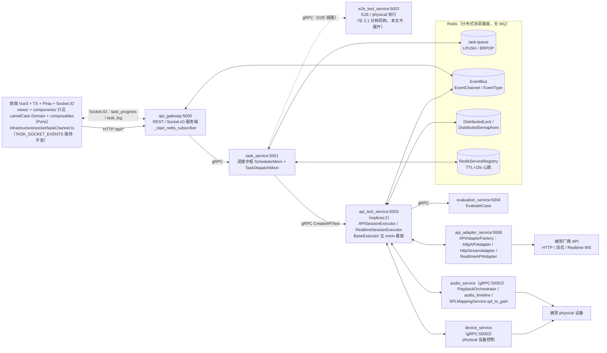
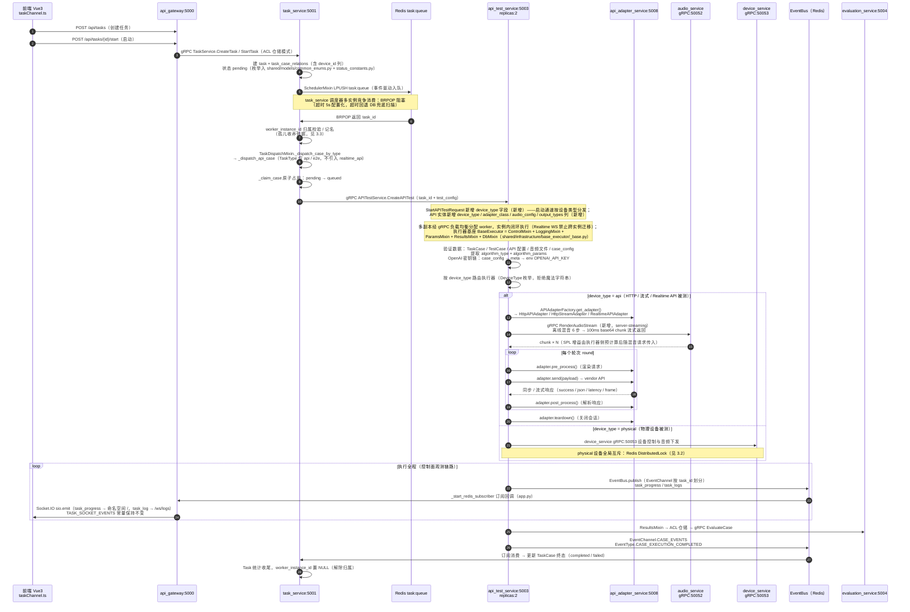
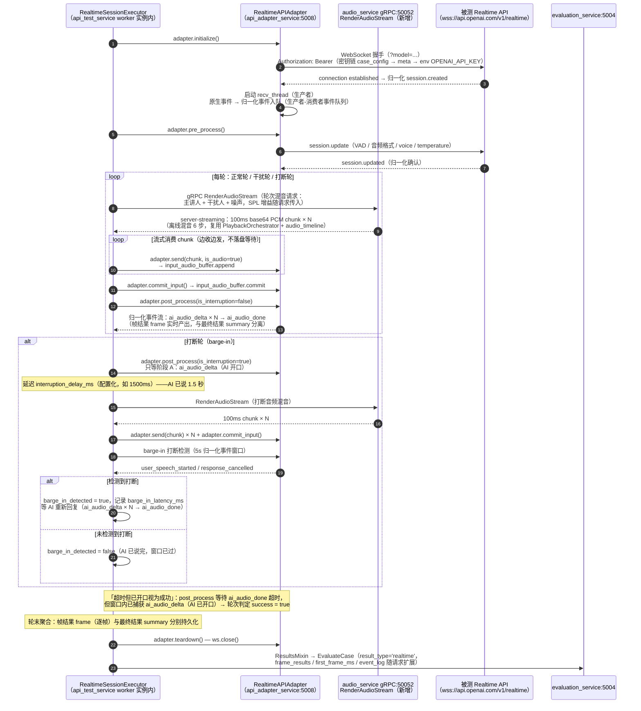
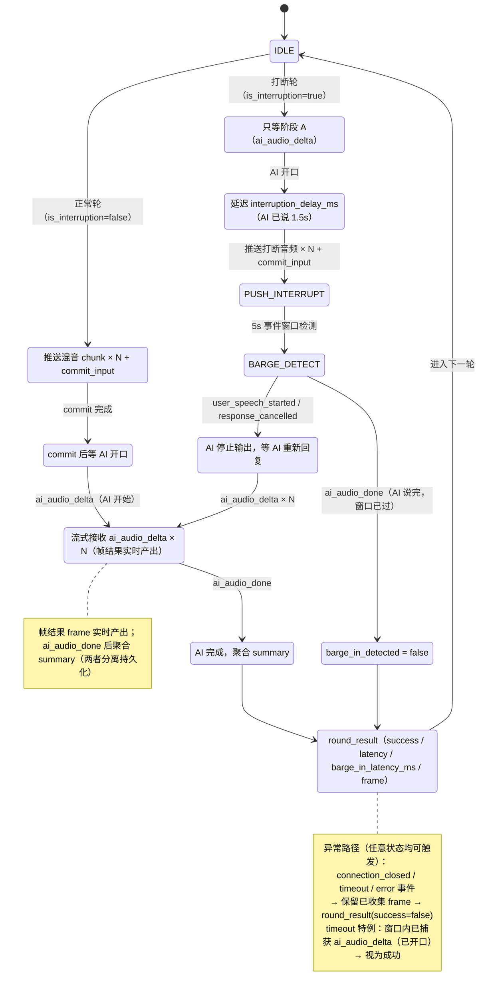
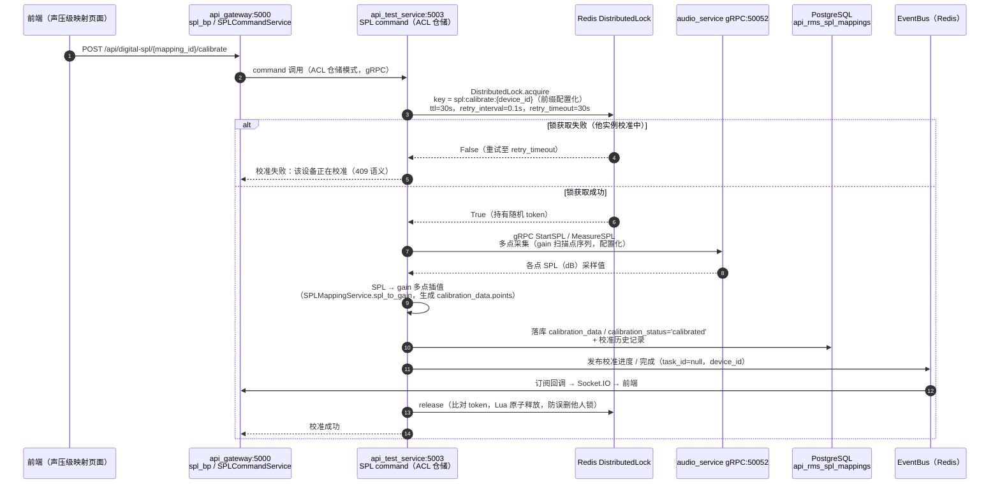
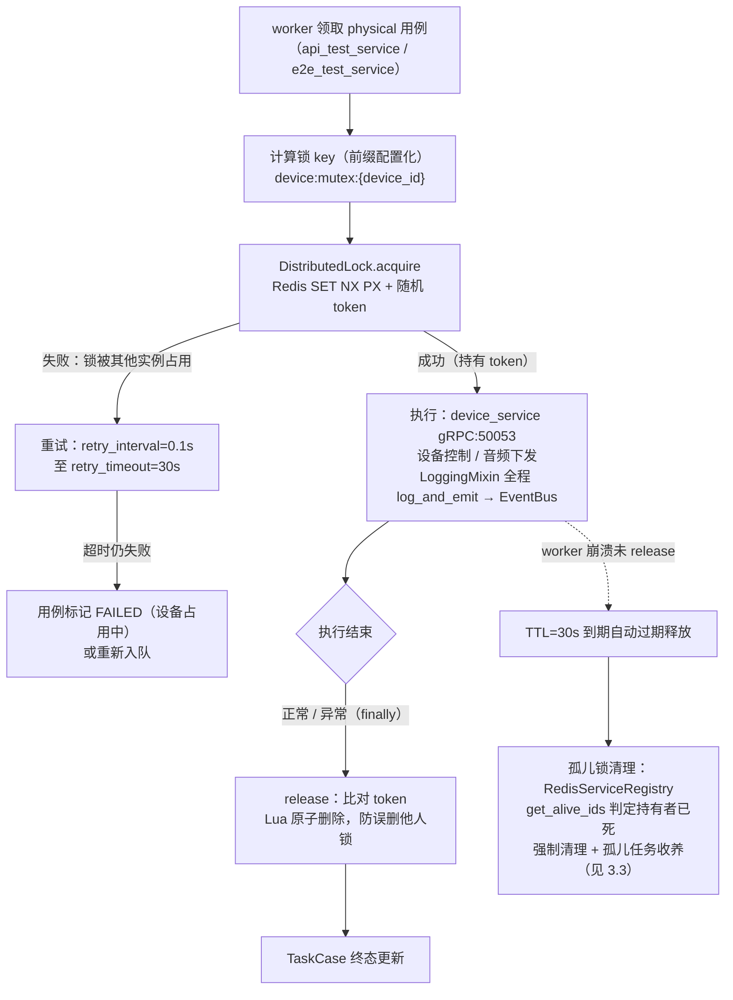
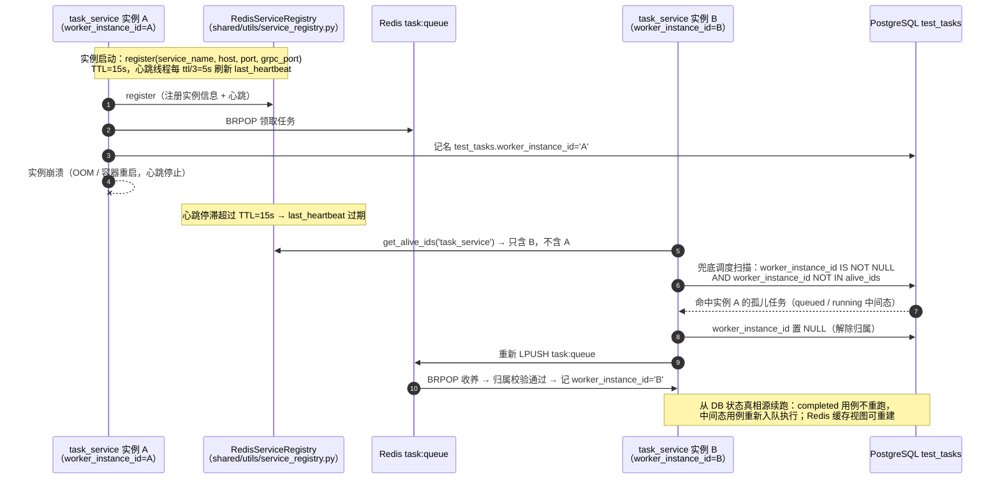
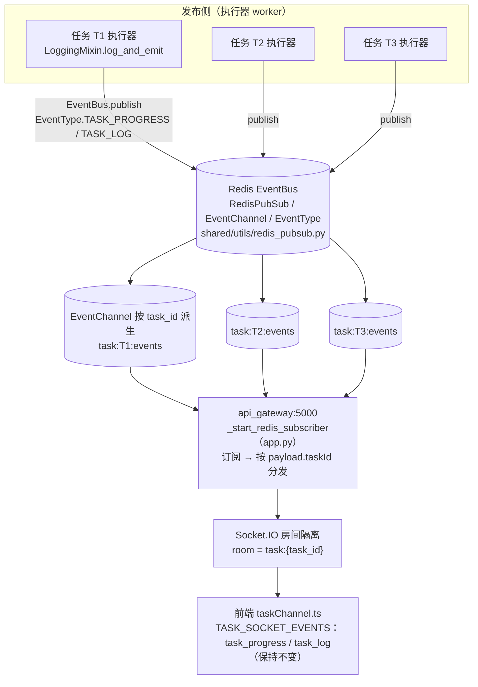

# 03 流程图 —— 测试执行（V9.7.31 微服务版）

> 版本：v1.0（V9.7.31 适配版，2026-09-10，适配自 V9.7.10 v3.0/v3.1）
> 架构基线：DDD + CQRS + 微服务 + 分布式部署；跨服务通信一律 gRPC（`shared/proto` 11 个 proto + ACL 仓储模式），无 MQ；事件走 Redis EventBus（`shared/utils/redis_pubsub.py` 的 RedisPubSub / EventBus / EventChannel / EventType）；分布式协调走 Redis（`shared/utils/distributed_coordinator.py` 的 DistributedLock / DistributedSemaphore、`shared/utils/service_registry.py` 的 RedisServiceRegistry）

【适配说明】本文档由 V9.7.10《03_流程图》v3.0 适配而来。源文档为单体进程内 ASCII 流程图（调度、执行、混音、事件推送同进程）；V9.7.31 拆分为 12 微服务后，全部流程改用 mermaid 重画，participant 即服务名，跨服务边界以 gRPC / Redis 队列 / EventBus 显式标注。设计语义不变（device_type 路由分发、APIAdapter 生命周期体系、Realtime 全双工执行、SPL 校准映射），落位按服务边界重组；与源文档的适配差异在各图下方以【适配说明】标注，新增能力标（新增）。

---

## 一、总览：服务拓扑与图例

### 1.1 测试执行相关服务拓扑

12 微服务中与测试执行直接相关的 8 个如下（auth / algorithm / report 等服务与本流程无直接交互，略）：

图例：实线 = 同步调用（HTTP / gRPC）；虚线 = 事件 / 推送链路；Redis 与 PostgreSQL 为共享基础设施。

### 1.2 流程清单与源文档对应关系

| 本文章节 | 流程 | 对应源文档（V9.7.10 v3.0） | 类型 |
|---|---|---|---|
| 2.1 | API 测试任务全链路时序图 | 4.1 HTTP API 测试流程 | 适配重画（分布式落位） |
| 2.2 | Realtime 全双工时序图 | 4.2 Realtime API 测试流程 | 适配重画（混音下沉 + 事件归一化） |
| 2.3 | Realtime 轮次状态机 | 4.3 轮次状态机 | 适配重画（归一化事件名） |
| 3.1 | SPL 校准流程 | 无（跨服务化后新增协调视图） | 新增 |
| 3.2 | physical 设备互斥流程 | 无（进程内 dict 无需图示） | 新增 |
| 3.3 | 孤儿任务收养流程 | 无（单进程无孤儿问题） | 新增 |
| 3.4 | 多任务事件隔离流程图 | 无（进程内回调无隔离问题） | 新增 |

---

## 二、端到端流程图

### 2.1 API 测试任务全链路时序图（适配自源 4.1）

**关键分支与异常路径**

- **device_type 路由三分支**：HTTP / 流式 / Realtime API 被测统一走 api_adapter_service 的 Adapter 体系（HttpAPIAdapter / HttpStreamAdapter / RealtimeAPIAdapter），音频供给统一走 audio_service `RenderAudioStream`（新增，server-streaming）；physical 被测走 device_service gRPC，互斥由 Redis DistributedLock 保障（见 3.2）。Realtime 分支展开见 2.2。
- **调度异常**：BRPOP 5s 超时无消息 → 回退 DB 兜底扫描（pending 任务）；`_claim_case` 原子更新影响行数 ≠ 1（被他实例抢占）→ 静默跳过，不重复执行。
- **执行异常**：gRPC CreateAPITest 失败 / worker 执行抛异常 → TaskCase 直接置 FAILED + error_message，经 EventBus `_emit_alert` 告知前端；单用例失败不阻断任务主循环。
- **评估解耦**：评估提交后即发布 `CASE_EXECUTION_COMPLETED`（channel `CASE_EVENTS`），task_service 订阅消费，执行器不做进程内等待；评估失败不影响执行终态落库。

【适配说明：源 4.1 为单体 ExecutionEngine 进程内 `thread_pools[task_id]` + submit 的线程池模型；V9.7.31 落位为 task_service 多实例调度器竞争消费 Redis task:queue（BRPOP + worker_instance_id 记名），经 gRPC APITestService 分发至 api_test_service 多副本 worker——Redis 队列解决调度器多实例竞争，副本扩展由 gRPC 负载均衡承担。源 4.1 的「解析可用端点 + 按 Σmax_process 计算线程池 + 进程内信号量（按 api_id 互斥）」升级为 DistributedSemaphore（`shared/utils/distributed_coordinator.py`，max_count 经 `shared/config/concurrency_config.json` 配置化）。源文档按 task.type 区分 HTTP / WS 的入口废弃：TaskType 不引入 realtime_api，Realtime 语义由 device_type（枚举化）承担，废弃 task.type / test_type。]

### 2.2 Realtime 全双工时序图（适配自源 4.2）

**关键分支与异常路径**

- **归一化事件 11 种**（recv_thread 生产、主线程消费，队列解耦网络抖动）：`ai_audio_delta` / `ai_audio_done` / `ai_text_delta` / `ai_text_done` / `user_speech_started` / `user_speech_stopped` / `response_cancelled` / `error` / `session.created` / `session.updated` / `connection_closed`。OpenAI 原生事件映射示例：`response.audio.delta → ai_audio_delta`、`input_audio_buffer.speech_started → user_speech_started`、`response.cancelled → response_cancelled`、`response.done → ai_audio_done`。
- **异常路径（任意轮次状态可触发）**：`connection_closed` → 保留已收集 frame → round_result(success=false)；等待超时 → 同上，但已捕获 `ai_audio_delta`（已开口）视为成功；`error` 事件 → round_result(success=false, error=msg)。
- **会话粘性**：Realtime WS 长连接与执行器实例绑定，实例内闭环；多副本部署下实例崩溃即会话失败，由 3.3 孤儿收养机制将用例重新入队。

【适配说明：① 混音下沉——源 4.2 由 AudioStreamOrchestrator 在消费侧进程内 `chunk_audio([speaker, interferer])` 混音；V9.7.31 混音不放消费侧，下沉 audio_service 新增 server-streaming RPC `RenderAudioStream`（离线混音 6 步 → 100ms base64 chunk 流式返回，`SAMPLE_RATE=24000` 等常量配置化），执行器仅做流式消费；轮次级混音缓冲 > 全局级的语义保留，噪声不再单独推送，由轮次混音请求参数表达。② 事件归一化——源 4.2 图中的 `response.audio.delta` / `input_audio_buffer.speech_started` 等原生事件名，全部替换为 11 种归一化事件。③ SPL 增益——由 api_test_service 侧 `RmsSplService.spl_to_gain(api_id)` 预计算后随混音请求传入，audio_service 不感知 SPL 语义。④ 评估——`EvaluateCaseRequest` 扩展 device_type / first_frame_ms / event_log / frame_results，`result_type='realtime'`。]

### 2.3 Realtime 轮次状态机（适配自源 4.3）

【适配说明：源 4.3 状态机的事件名替换为归一化事件（`response.audio.delta → ai_audio_delta`、`response.audio.done → ai_audio_done`、`input_audio_buffer.speech_started → user_speech_started`、`response.cancelled → response_cancelled`、`connection_closed / error` 直通）；`interruption_delay_ms`、5s barge-in 窗口等参数全部配置化，拒绝魔法数字。状态语义与源 4.3 一致：正常轮走 SENDING → AI_THINKING → AI_SPEAKING → AI_DONE；打断轮走 WAIT_AI_START → 延迟 → 推打断音频 → 检测窗口 → BARGE_IN（成功）或 BARGE_FAIL（失败）。]

---

## 三、分布式协调流程（V9.7.31 新增视图）

### 3.1 SPL 校准流程

**关键分支与异常路径**

- **多 worker 并发互斥**：api_test_service replicas:2 + task_service 多实例部署下，同一设备可能被多个实例同时发起校准；Redis 分布式锁保证同一 device_id 全局串行。
- **执行中校准互斥**：测试执行期间播放测试音与任务音频冲突，播放前校验存在运行中的 E2E 任务则拒绝（403），避免后端扬声器抢占。
- **异常路径**：采集中途失败 → finally 释放锁 + `calibration_status` 回滚 failed + EventBus 发布失败事件；锁 TTL=30s 到期自动过期，防止持锁实例崩溃造成死锁（配合 3.3 孤儿收养）。

【适配说明：V9.7.10 校准在单进程内执行，无跨进程并发问题；V9.7.31 多 worker（api_test_service replicas:2 + 调度器多实例）下新增 Redis DistributedLock 防并发校准同一设备（新增协调逻辑）。校准链路：api_gateway /api/digital-spl → api_test_service command（ACL 仓储模式）→ 分布式锁 → audio_service gRPC 采集 → SPL → gain 多点插值 → api_rms_spl_mappings 落库。]

### 3.2 physical 设备互斥流程

**关键分支与异常路径**

- **获取失败**：0.1s 间隔重试至 30s 超时；仍失败则用例失败或重新入队，不阻塞其他用例。
- **释放安全**：release 校验随机 token，Lua 脚本原子「比对 + 删除」，避免 A 的超时锁被 B 的释放误删。
- **持有者崩溃**：TTL 到期自动过期 → Registry 心跳判定实例已死 → 孤儿锁强制清理 + 任务收养（见 3.3）。
- **并发上限类控制**（非互斥）：同一 API 的并发执行权用 DistributedSemaphore（key、max_count、ttl 配置化），acquire(timeout) 超时放弃。

【适配说明：V9.7.10 physical 设备互斥为进程内 dict（单进程线程池下有效），多副本部署即失效；V9.7.31 升级为 Redis DistributedLock / DistributedSemaphore（`shared/utils/distributed_coordinator.py`），跨实例全局生效。]

### 3.3 孤儿任务收养流程

**关键分支与异常路径**

- **误杀防护**：BRPOP 领取后先做归属校验（`worker_instance_id ∈ {NULL, 本实例}`），不属于本实例的中间态任务不处理，避免多实例互相误杀存活任务。
- **启动恢复**：实例重启后仅恢复归属本实例（或未归属）的中间态任务，避免误杀其他存活实例的任务。
- **边界**：心跳 TTL=15s 与兜底扫描间隔均配置化；收养期间原实例恰好复活（网络分区恢复）→ 由归属校验 + 原子置 NULL 保证只有一个实例持有。

【适配说明：V9.7.10 单进程无孤儿问题；V9.7.31 多实例部署引入 worker_instance_id 多实例机制（`scripts/migrations/202609/add_worker_instance_id.py` 为 test_tasks 增列并建索引），RedisServiceRegistry TTL 心跳失效 → get_alive_ids 判死 → 兜底调度重新入队收养。]

### 3.4 多任务事件隔离流程图

**隔离层级（四层递进）**

1. **Redis 频道层**：EventChannel 按 task_id 派生频道 `task:{task_id}:events`，任务间事件物理隔离；进度 / 日志类高频事件经全局频道 `task_progress` / `task_logs` 发布时 payload 亦携带 taskId。
2. **网关过滤层**：api_gateway `_start_redis_subscriber` 统一订阅，按 `payload.taskId` 过滤分发，不转发无关任务事件。
3. **Socket.IO 房间层**：按 `room = task:{task_id}` 推送，前端仅收到已订阅任务的事件。
4. **前端路由层**：taskChannel.ts 按 taskId 路由至对应任务视图 / Pinia store，多任务页面并行打开互不串扰。

**异常路径**：Socket.IO 断线重连后按 taskId 重新入房；事件链路丢失不影响正确性——DB 是唯一真相源，进度可由 task_service ReadModel 重建（CQRS 读模型兜底）。

【适配说明：V9.7.10 `log_and_emit` 为进程内直发（日志回调 + WebSocket 同进程推送），不存在跨任务隔离问题；V9.7.31 执行器与网关分属不同进程，统一收敛为 EventBus 发布 + api_gateway 转发 Socket.IO，隔离从「进程内存边界」升级为「Redis 频道 + taskId 过滤 + Socket.IO 房间」三层机制。前端契约不变：TASK_SOCKET_EVENTS（task_progress / task_log）保持不变。]

---

## 四、流程清单小结

| # | 流程 | 跨服务边界 | 分布式协调点 |
|---|---|---|---|
| 2.1 | API 测试任务全链路 | FE→GW→TS→ATS→AAS/AU/DS→EV | task:queue 竞争消费、worker_instance_id 记名、DistributedSemaphore |
| 2.2 | Realtime 全双工 | RSE↔AAS↔vendor WS、AU 流式供给 | 实例内闭环（禁止跨实例迁移）、事件队列 |
| 2.3 | Realtime 轮次状态机 | —（实例内） | 归一化事件、配置化参数 |
| 3.1 | SPL 校准 | GW→ATS→AU→DB | DistributedLock（同设备串行） |
| 3.2 | physical 设备互斥 | ATS/E2E→DS | DistributedLock + TTL + 孤儿锁清理 |
| 3.3 | 孤儿任务收养 | TS 多实例 + Registry + DB | TTL 心跳、归属校验、重新入队 |
| 3.4 | 多任务事件隔离 | worker→EventBus→GW→Socket.IO→FE | EventChannel 按 task_id、房间隔离 |
