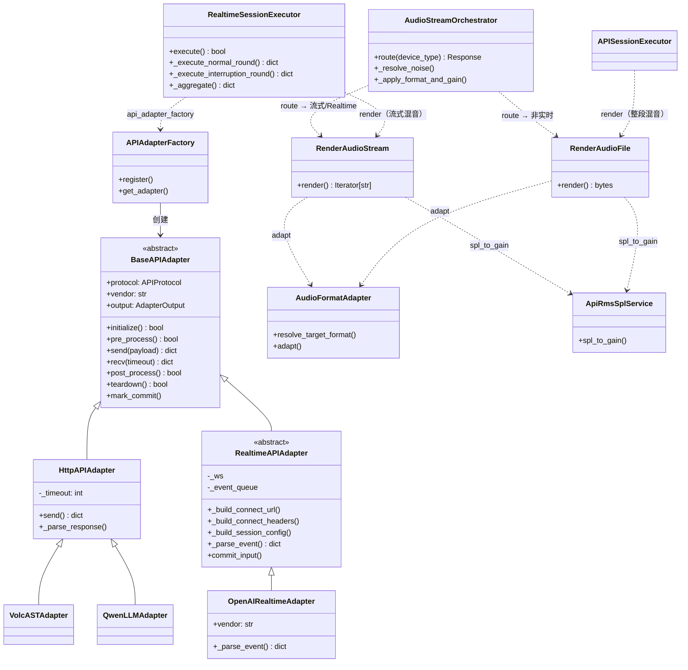

# 类设计

> 版本：v3.1 | 日期：2026-09-10 | 状态：最终方案
>
> **说明**：本文档只描述类设计（职责、关键属性、方法签名、类间关系），
> 不包含实现代码。实现细节见对应源码文件注释。

---

## 五、类设计

### 5.1 BaseAPIAdapter — 基类

> 源码：`backend/utils/clients/base_api_adapter.py`

**职责**：API 适配器基类，与 `BaseDeviceDriver` 对称的生命周期设计。

厂商适配原则：
- 不同厂商 API 返回字段不同，所有厂商特定字段的解读由子类 `_parse_event` 负责；
- 基类只定义通用接口和统一属性，不绑死任何厂商字段；
- executor 只调用通用接口（send/recv/post_process），只读 `adapter.output`。

**APIProtocol 枚举**

| 枚举值 | 协议 | 通信方向 | 实时性 | 典型场景 |
|--------|------|---------|--------|---------|
| `HTTP` | HTTP 1.x | 请求-响应 | 非实时 | 一次性 POST 完整音频，等完整 JSON 响应 |
| `SSE` | HTTP（`text/event-stream`） | 服务端→客户端单向流 | 实时 | HTTP 流式发送 chunk，SSE 逐条推送结果 |
| `WEBSOCKET` | WebSocket（`ws://wss://`） | 双向全双工 | 实时 | WebSocket 全双工实时语音交互，支持打断 |

**AdapterOutput 统一输出结构**（executor 只读此结构，不直接访问厂商字段）

| 字段 | 类型 | 说明 |
|------|------|------|
| `audio` | bytes | AI 音频 PCM（多帧拼接） |
| `text` | str | AI 文本（多 token 累积） |
| `video_chunks` | list | AI 视频帧列表 |
| `images` | list | AI 图片列表（URL 或 base64） |
| `event_log` | list | 归一化事件时间线 `[(ts, type, data)]` |
| `raw_event_log` | list | 原始事件时间线 `[(ts, raw_event)]` |
| `latency_ms` | int | 首帧/首 token 延迟 |
| `frame_results` | list | 逐帧结果列表 `[{ts, type, payload}]` |

**关键属性**（均在 `__init__` 初始化）

| 属性 | 说明 |
|------|------|
| `api_config` / `case_config` / `meta` | 配置来源；`meta = api_config.meta` |
| `target_format` | 目标输出格式（`AudioFormatAdapter.resolve_target_format(api_config)`，未配置回退 24kHz/s16/mono） |
| `_frame_timestamps / _frame_types / _frame_payloads` | 帧级中间状态（逐帧结果） |
| `_ai_audio_chunks / _ai_text_chunks / _ai_video_chunks / _ai_images` | 最终结果聚合缓存 |
| `_event_log / _raw_event_log` | 归一化 / 原始事件时间线 |
| `_latency_ms / _first_frame_ts / _commit_ts` | 首帧延迟相关 |
| `_task_id / _test_case_id / _connected` | 执行上下文与连接状态 |

**方法签名**（生命周期 + 输出属性 + 帧记录工具 + 公共工具）

```python
class BaseAPIAdapter:
    # ── 生命周期（子类可覆盖） ──
    def initialize(self, **kwargs) -> bool: ...     # 默认 True
    def pre_process(self, **kwargs) -> bool: ...    # 默认 True
    def send(self, payload, **kwargs) -> dict: ...  # 抽象，子类必须实现
    def recv(self, timeout=60, **kwargs) -> dict: ...  # 默认返回 {}
    def post_process(self, **kwargs) -> bool: ...   # 默认 True
    def teardown(self, **kwargs) -> bool: ...       # 默认 True

    # ── 统一输出（executor 唯一取数入口） ──
    @property
    def output(self) -> AdapterOutput: ...

    # ── 帧记录工具（子类 _parse_event 调用） ──
    def _record_frame(self, frame_type: str, payload: Any = None): ...
    def _record_raw_event(self, raw_event: dict): ...
    def _mark_first_frame(self): ...   # 标记首帧时间戳，计算延迟
    def mark_commit(self): ...         # 标记 commit 时间戳

    # ── 公共工具（自 APIDriver 复用） ──
    def _log(self, level='INFO', content='', **kwargs): ...
    def _check_stop(self, operation_name="") -> bool: ...   # 停止/暂停事件检查
    def _render_payload(self, template, context): ...        # 模板渲染
    def render_request_parts(self, context_data): ...        # 渲染 headers + body
    def _replace_placeholders(self, text, context): ...
    def _extract_by_path(self, data, path): ...              # a.b.c / a.0 路径取值
```

### 5.2 HttpAPIAdapter — HTTP 适配器（HTTP 非实时 + SSE 流式）

> 源码：`backend/utils/clients/http_api_adapter.py`

**职责**：HTTP 协议族适配器，覆盖两种调用模式：

| 模式 | `APIProtocol` | 调用方式 | 响应处理 |
|------|---------------|---------|---------|
| **HTTP 非实时** | `HTTP` | 一次性 POST 完整音频 | 单响应解析（完整 JSON） |
| **SSE 流式** | `SSE` | 逐 chunk 推送 | `all_responses` 逐条聚合（事件流解析） |

`send()` 返回结构与 `APIDriver.execute()` 完全一致，消费方无缝迁移。协议由 `case_config.protocol` 或端点判定（见 `APIAdapterFactory.get_adapter`）。

**关键属性**：`_timeout` — 请求超时（`api_config.max_timeout`，默认 30s）。

**方法签名**

```python
class HttpAPIAdapter(BaseAPIAdapter):
    protocol = APIProtocol.HTTP

    def initialize(self, **kwargs) -> bool:
        # 可选健康检查：health_endpoint 存在时 GET 探测；
        # 404/405 视为路径不存在跳过，>=400 失败，异常忽略
        ...

    def send(self, payload, **kwargs) -> dict: ...
    def _parse_response(self, resp_info): ...
        # 非流式：单响应解析（biz_code 非 '0' 视为业务错误，提取 asr/trans/结束标志）
        # 流式：all_responses 逐条聚合（append_mode 决定拼接还是取最新）
```

**send() 返回结构**

| 字段 | 说明 |
|------|------|
| `success` | 状态码 2xx 且无错误 |
| `latency` / `status_code` / `raw_response` / `error` / `json` | 原始请求结果 |
| `asr` / `trans` | 识别/翻译文本 |
| `is_sentence_end` / `is_session_end` | 结束标志 |
| `biz_code` / `biz_msg` | 业务码/业务消息 |

**子类（仅声明 vendor，复用全部逻辑）**

```python
class VolcASTAdapter(HttpAPIAdapter):
    vendor = "volc_ast"

class QwenLLMAdapter(HttpAPIAdapter):
    vendor = "qwen_llm"
```

### 5.3 RealtimeAPIAdapter — WebSocket 流式基类

> 源码：`backend/utils/clients/realtime_api_adapter.py`

**职责**：WebSocket 全双工流式适配器基类，连接跨多轮保持。

**与 HttpAPIAdapter 的核心差异**

| 阶段 | HttpAPIAdapter | RealtimeAPIAdapter |
|------|----------------|--------------------|
| `initialize` | requests.Session | 建立 WebSocket 连接 |
| `send` | 完整请求 | 推送音频 chunk / JSON 指令 |
| `recv` | 同步返回 | 阻塞等待事件队列 |
| `post_process` | 立即返回 | 等 AI 回复完成 |
| 生命周期 | 用完即弃 | 连接跨多轮保持 |

**帧结果 & 最终结果约定**
- 基类维护 `_ai_audio_chunks / _frame_timestamps / _event_log` 等统一属性；
- 子类 `_parse_event` 调用 `_record_frame()` / `_mark_first_frame()` 写入帧结果；
- executor 通过 `adapter.output` 获取最终聚合结果，永远不直接访问厂商字段（如 `event["delta"]`）。

**关键属性**：`_ws` / `_event_queue` / `_recv_thread` / `_chunk_duration_ms`(100ms) / `_ai_complete` / `barge_in_detected` / `barge_in_latency_ms`。

**方法签名**（子类需覆盖：`_build_connect_url` / `_build_connect_headers` / `_build_session_config` / `_parse_event`）

```python
class RealtimeAPIAdapter(BaseAPIAdapter):
    protocol = APIProtocol.WEBSOCKET

    # ── 生命周期 ──
    def initialize(self, **kwargs) -> bool: ...   # create_connection + 启动接收线程
    def pre_process(self, **kwargs) -> bool: ...  # 发送 session.update，等待确认
    def send(self, payload, **kwargs) -> dict: ...  # is_audio → 音频 chunk，否则 JSON
    def recv(self, timeout=60, **kwargs) -> dict: ...  # 从队列取原始事件 → _parse_event
    def post_process(self, **kwargs) -> bool: ...
        # is_interruption=True → _wait_ai_speaking（等 AI 开始回复）
        # else → _wait_ai_complete（等 AI 完整回复）
    def teardown(self, **kwargs) -> bool: ...     # 关闭 WebSocket

    # ── 子类覆盖点 ──
    def _build_connect_url(self): ...             # 抛 NotImplementedError
    def _build_connect_headers(self): ...         # 抛 NotImplementedError
    def _build_session_config(self, kwargs): ...  # 抛 NotImplementedError
    def _parse_event(self, event): ...            # 默认原样返回

    # ── 内部 ──
    def _recv_loop(self): ...              # 接收线程：bytes → binary 事件，str → JSON
    def _send_json(self, data): ...
    def _send_audio_chunk(self, pcm_base64): ...  # input_audio_buffer.append
    def _wait_ai_speaking(self, start_timeout=25) -> bool: ...
    def _wait_ai_complete(self, start_timeout=25, end_timeout=60) -> bool: ...

    # ── 便捷属性（指向 output） ──
    @property
    def ai_audio(self) -> bytes: ...
    @property
    def event_log(self) -> list: ...
    @property
    def frame_results(self) -> list: ...
```

**`_parse_event` 职责**（子类必须实现）
1. 记录原始事件：`self._record_raw_event(event)`
2. 解析厂商特定字段 → 映射到统一事件类型
3. AI 音频 delta → `_ai_audio_chunks.append(decoded_bytes)` + `_mark_first_frame()` + `_record_frame('ai_audio_delta', delta)`
4. 用户说话 → `barge_in_detected = True` + `_record_frame('user_speech_started')`
5. 回复取消 → `barge_in_detected = True`
6. 回复完成 → `_ai_complete = True`

### 5.4 OpenAIRealtimeAdapter — ChatGPT Realtime

> 源码：`backend/utils/clients/openai_realtime_adapter.py`

**职责**：解读 OpenAI 特有事件字段 → 写入基类统一属性。executor 永远不直接访问 OpenAI 字段。

`vendor = "openai"`，协议 WEBSOCKET。

**事件映射表**

| OpenAI 原始事件 | → 归一化类型 | 帧记录 / 副作用 |
|-----------------|--------------|-----------------|
| `response.audio.delta` | `ai_audio_delta` | base64 解码追加 `_ai_audio_chunks` + `_mark_first_frame` |
| `response.audio.done` / `response.done` | `ai_audio_done` | `_ai_complete=True` |
| `input_audio_buffer.speech_started` | `user_speech_started` | `barge_in_detected=True` |
| `input_audio_buffer.speech_stopped` | `user_speech_stopped` | — |
| `response.cancelled` | `response_cancelled` | `barge_in_detected=True` |
| `response.text.delta` | `ai_text_delta` | 追加 `_ai_text_chunks` |
| `response.text.done` | `ai_text_done` | — |
| `error` | `error` | `_record_frame('error', msg)` |
| `session.created` / `session.updated` | 同型透传 | `_record_frame` |

**方法签名**

```python
class OpenAIRealtimeAdapter(RealtimeAPIAdapter):
    vendor = "openai"

    def _build_connect_url(self): ...
        # model + base_url 来自 case_config，默认 gpt-4o-realtime-preview
    def _build_connect_headers(self): ...
        # Authorization: Bearer {api_key}；OpenAI-Beta: realtime=v1
    def _build_session_config(self, kwargs): ...
        # turn_detection(server_vad)、pcm16、modalities 等，全部可配置
    def _parse_event(self, event: dict) -> dict: ...

    def commit_input(self): ...   # mark_commit() + 发送 input_audio_buffer.commit
    def create_response(self, instructions=None): ...  # 发送 response.create
```

> 注意：OpenAI 的 `delta` 字段是 base64 编码的 PCM，其他厂商可能用不同编码方式。
> 该解码逻辑只属于本适配器，不应出现在基类或 executor 中。

### 5.5 APIAdapterFactory — 工厂

> 源码：`backend/utils/clients/api_adapter_factory.py`

**职责**：API 适配器工厂，与 `DeviceDriverFactory` 对称。按 `(protocol, vendor)` 注册表创建适配器，支持运行时 `register` 扩展。

**默认注册表**

| (protocol, vendor) | 适配器 | 模式 |
|--------------------|--------|------|
| `('http', 'volc_ast')` | `VolcASTAdapter` | 非实时 |
| `('http', 'qwen_llm')` | `QwenLLMAdapter` | 非实时 |
| `('http', 'default')` | `HttpAPIAdapter` | 非实时 |
| `('sse', 'default')` | `HttpAPIAdapter`（stream=True） | 流式（SSE） |
| `('sse', 'volc_ast')` | `VolcASTAdapter`（stream=True） | 流式（SSE） |
| `('websocket', 'openai')` / `('websocket', 'openai_realtime')` | `OpenAIRealtimeAdapter` | 流式（WS） |

**方法签名**

```python
class APIAdapterFactory:
    def __init__(self): ...
    def register(self, protocol, vendor, adapter_cls): ...

    def get_adapter(self, api_config, case_config=None,
                    task_id=None, test_case_id=None):
        # 1. vendor 来源：api_config.vendor → meta.vendor → 'default'
        # 2. protocol 判定优先级：
        #    a. case_config.protocol 显式指定（'http' / 'sse' / 'websocket'）
        #    b. endpoint 前缀：ws://wss:// → websocket
        #    c. endpoint 无特殊前缀 + 显式 stream=True → sse
        #    d. 回退 http（非实时）
        # 3. 查注册表：websocket 未注册抛 ValueError，http/sse 未注册回退 default
        ...

api_adapter_factory = APIAdapterFactory()   # 单例
```

### 5.6 AudioStreamOrchestrator — 混音路径编排路由层

> 源码：`backend/services/audio/audio_stream_orchestrator.py`

**职责**：**编排路由层**——接收执行设备类型（`device_type`），分发到具体混音路径。自身不直接实现混音，但统一持有两条 API 路径的公共前置逻辑（噪声合并、格式适配、RMS/SPL 增益）。

```
AudioStreamOrchestrator.route(device_type)
├── http_api + stream=False → RenderAudioFile（unary RPC：整段混音 → 完整 PCM → 整文件 POST）
├── http_api + stream=True  → RenderAudioStream（server-streaming RPC：逐帧流式混音 → 100ms chunk）
├── websocket_api           → RenderAudioStream（server-streaming RPC，同上）
└── physical                → device_driver（E2E，PyAudio callback 实时混音，不经此处）
```

**与 E2E 的区别**
- E2E：多路音频 → `device_driver` PyAudio callback 实时混音 → 物理设备播放；
- API 非实时：多路音频 → `RenderAudioFile` 等所有音频齐了一次性混整段 → 完整 PCM → 整文件 POST；
- API 流式/Realtime：多路音频 → `RenderAudioStream` 一边收 chunk 一边逐帧混 → 100ms base64 chunk → SSE/WS 推送。

**噪声合并优先级**（与 E2E playback_orchestrator 一致）：轮次级 `background_noise` > case 级 `background_noise`；有轮次噪声 → 混轮次噪声；有全局噪声 → 混全局噪声；俩都有 → 混轮次噪声。由 Orchestrator 公共方法 `_resolve_noise` 处理。

**方法签名**

```python
class AudioStreamOrchestrator:
    @staticmethod
    def route(device_type: str, request) -> Response:
        # 编排路由：根据执行模式分发到具体混音路径
        # - device_type == 'http_api' 且 stream=False → RenderAudioFile (unary)
        # - device_type == 'http_api' 且 stream=True  → RenderAudioStream (server-streaming)
        # - device_type == 'websocket_api'            → RenderAudioStream (server-streaming)
        # - device_type == 'physical'                 → device_driver（E2E，不经此处）
        ...

    @staticmethod
    def _resolve_noise(round_config, global_bg) -> dict | None:
        # 公共前置：按轮次级 > 全局级合并噪声配置
        ...

    @staticmethod
    def _apply_format_and_gain(sources, api, target_format) -> list[np.ndarray]:
        # 公共前置：Step 2 格式适配 + Step 3 RMS 补偿/SPL 增益
        # RenderAudioFile / RenderAudioStream 共用，避免重复代码
        ...
```

### 5.6a RenderAudioFile — HTTP 非实时混音（unary RPC）

> 源码：`backend/services/audio/render_audio_file.py`

**职责**：HTTP 非实时混音 RPC（**unary**：一次请求 → 完整音频文件响应）。

- 混音时机：**执行中，等所有音频齐了 → 一次性混整段**；
- 混音产物：完整 PCM（不切片）；
- 结果交付：整文件 POST（wav/pcm 容器包装）。

**方法签名**

```python
class RenderAudioFile:
    @staticmethod
    def render(audios_config, audio_loader, background_noise=None,
               api_id=None, target_format=None) -> bytes:
        # audios_config: [{audio_id, type, delay, play_order, spl, ...}]（主讲人+干扰人）
        # audio_loader: 加载 PCM 的回调 (audio_id) -> bytes
        # background_noise: 噪声配置（已由 Orchestrator._resolve_noise 合并）或 None
        # api_id: 被测 API ID（查 RMS→SPL 映射）
        # target_format: {'sample_rate', 'bit_depth', 'channels'}
        # 步骤: Step 1-4 共用（加载 / 格式适配 / RMS+SPL / 时间轴）
        #       → Step 5A 整段混音（一次性混完整段）
        #       → Step 6A 整段量化输出（wav/pcm 包装，无切片）
        # 返回: 完整 PCM bytes（由 executor 做容器包装 → 一次性 POST）
        ...
```

### 5.6b RenderAudioStream — HTTP 流式 / Realtime 混音（server-streaming RPC）

> 源码：`backend/services/audio/render_audio_stream.py`

**职责**：流式混音 RPC（**server-streaming**：请求 → chunk 流式响应）。

- 混音时机：**执行中，一边收 chunk 一边逐帧混**；
- 混音产物：100ms base64 PCM chunk（`chunk_samples = 采样率 × 100ms`）；
- 结果交付：逐 chunk 推送（SSE / WS）。

**方法签名**

```python
class RenderAudioStream:
    @staticmethod
    def render(audios_config, audio_loader, background_noise=None,
               api_id=None, target_format=None, chunk_duration_ms=100) -> Iterator[str]:
        # 参数同 RenderAudioFile，chunk_duration_ms 默认 100ms
        # 步骤: Step 1-4 共用（加载 / 格式适配 / RMS+SPL / 时间轴）
        #       → Step 5B 逐帧流式混音（100ms 滑动窗口）
        #       → Step 6B 逐窗口量化 → base64 PCM chunk
        # 返回: Iterator[str]，逐 chunk yield（executor 决定 SSE 还是 WS 推送）
        ...
```

### 5.6c AudioFormatAdapter — 音频格式适配器

> 源码：`backend/services/audio/audio_format_adapter.py`

**背景**：不同被测 API 的采样率/位深/通道数要求不同（OpenAI 24k/16bit/mono、
电话线路 8k/16bit/mono、部分厂商 44.1k/24bit/stereo），而音频库素材格式五花八门。
不同采样率的样本无法直接叠加，混音前必须统一适配到 `api.audio_config` 声明的目标格式。

**BitDepth 枚举**

| 枚举值 | 名称 | 字节数 | 满量程 |
|--------|------|--------|--------|
| `S16` | s16 | 2 | 32768 |
| `S24` | s24 | 3 | 8388608 |
| `S32` | s32 | 4 | 2147483648 |

**AudioFormat（不可变 dataclass）**：`sample_rate`(Hz) / `bit_depth`(BitDepth) / `channels`(1=mono, 2=stereo)。

**方法签名**（转换顺序固定：位深归一化 → 采样率 → 通道，三种 API executor 共用）

```python
class AudioFormatAdapter:
    DEFAULT_FORMAT = {'sample_rate': 24000, 'bit_depth': 's16', 'channels': 1}

    @staticmethod
    def resolve_target_format(api) -> AudioFormat: ...   # 读 api.audio_config，未配置回退默认
    @staticmethod
    def detect_source_format(pcm: bytes, audio_meta: dict) -> AudioFormat:
        # 源格式优先级：1. audio_file 元数据字段  2. WAV 头解析  3. 库内默认
        ...
    @staticmethod
    def adapt(pcm: bytes, src: AudioFormat, dst: AudioFormat) -> bytes:
        # src → dst：to_float32 → resample → convert_channels → quantize
        ...
    @staticmethod
    def to_float32(pcm: bytes, fmt: AudioFormat) -> np.ndarray: ...
    @staticmethod
    def resample(samples, src_rate, dst_rate) -> np.ndarray:
        # resample_poly 有理分数重采样（gcd 化简 up/down）
        ...
    @staticmethod
    def convert_bit_depth(samples, src: BitDepth, dst: BitDepth) -> np.ndarray: ...
    @staticmethod
    def convert_channels(samples, src_ch, dst_ch) -> np.ndarray:
        # 下混 stereo→mono: (L+R)/2；上混 mono→stereo: 通道复制；
        # 其他 N→M 组合: 抛 ValueError（配置错误不静默兜底）
        ...
    @staticmethod
    def quantize(samples: np.ndarray, fmt: AudioFormat) -> bytes:
        # np.clip(±满量程) → 按目标位深打包 bytes
        ...
    @staticmethod
    def bytes_per_sample(fmt: AudioFormat) -> int: ...
    @staticmethod
    def wrap_container(pcm: bytes, fmt: AudioFormat, container: str = 'wav') -> bytes:
        # 非实时整文件上传用容器包装（pcm 裸流 / wav 头）
        ...
```

> **与 orchestrator 的协作**：Orchestrator 公共前置 `_apply_format_and_gain` 对每个源调用 `detect_source_format` + `adapt`；
> Step 6 用 `quantize` 按目标位深输出——全链路格式全部来自 `api.audio_config` 配置。

### 5.7a ApiRmsSplMapping — 被测 API 的 RMS→SPL 映射

> 源码：`backend/models/models.py`（模型） + `backend/services/audio/api_rms_spl_service.py`（服务）

**背景**：不同被测 API 对输入音频的 RMS/增益处理不同，RMS→SPL 映射必须挂在**被测 API** 上（1:N）。

**与 E2E SPLMappingService 的对称关系**

| 维度 | E2E (SPLMapping) | Realtime (ApiRmsSplMapping) |
|------|-------------------|------------------------------|
| 关联实体 | `PlaybackDevice`（物理音箱） | `API`（被测 API） |
| 关系 | device 1:N spl_mappings | api 1:N rms_spl_mappings |
| 映射含义 | 物理设备 dB SPL → gain（校准物理音箱） | 被测 API 数字域 dB → gain（校准 API 输入灵敏度） |
| 校准方式 | 物理校准（播放测试音 + 实测 SPL） | 数字校准（发送已知 RMS 的音频 + 评估识别效果） |
| 使用场景 | `audio_timeline.get_audio_configs_for_offset` 查 device | `AudioStreamOrchestrator` 查 api_id |
| 选中方式 | `device.current_spl_mapping_id` | `api.rms_spl_mapping_id` 或 case_config 指定 |

**模型字段（`api_rms_spl_mappings` 表）**

| 字段 | 类型 | 说明 |
|------|------|------|
| `id` | Integer PK | 映射唯一 ID |
| `name` / `description` | String/Text | 配置名称与描述 |
| `api_id` | Integer FK | 关联被测 API（1:N） |
| `vendor` / `protocol` | String | API 供应商 / 协议（默认 websocket） |
| `reference_spl` / `reference_gain_linear` | Float | 参考声压级（65.0）/ 参考增益（1.0） |
| `calibration_status` | String | calibrated / uncalibrated |
| `calibration_data` | JSON | 校准测量点：`{"points": [{"target_spl", "gain_linear", "rms_dbfs"}, ...]}` |
| `min_gain_linear` / `max_gain_linear` | Float | 增益限制（0.001 / 10.0） |
| `created_at` / `updated_at` / `deleted` | — | 时间戳 + 逻辑删除 |

**API 表新增字段**：`rms_spl_mapping_id`（Integer FK，当前默认 RMS→SPL 映射）+ `rms_spl_mapping`（relationship）。

**服务方法签名**

```python
class ApiRmsSplService:
    BASE_LEVEL_DB = -30.0
    MAX_OUTPUT_DB = -5.0

    @staticmethod
    def spl_to_gain(api_id: int, target_spl: float, app=None) -> float:
        # 通过被测 API 查找映射 → 计算 gain（查不到映射 → 线性近似）
        ...
    @staticmethod
    def spl_to_gain_by_mapping(mapping: ApiRmsSplMapping, target_spl: float) -> float:
        # 直接用映射对象计算（避免重复查 DB）
        ...
    @staticmethod
    def _get_mapping(api_id: int, app=None) -> Optional[ApiRmsSplMapping]: ...
    @staticmethod
    def _calculate_gain(mapping: ApiRmsSplMapping, target_spl: float) -> float:
        # 有校准点 → np.interp 线性插值；否则 ref_gain × 10^(diff/20)；最后限幅
        ...
    @staticmethod
    def _linear_approx(target_spl: float) -> float:
        # gain = 10^((target - 65) / 20)，无校准时的线性近似
        ...
    @staticmethod
    def _apply_gain_limit(mapping, gain_linear) -> float: ...
    @staticmethod
    def calculate_rms_dbfs(pcm_bytes: bytes) -> float: ...   # 静音返回 -120.0

api_rms_spl_service = ApiRmsSplService()   # 单例
```

### 5.7b 混音步骤流程图（含格式适配，RenderAudioFile / RenderAudioStream 共用 Step 1-4）

```
┌──────────────────────────────────────────────────────────────┐
│  AudioStreamOrchestrator.route(device_type)  → 分发到具体路径 │
│    http_api+stream=False → RenderAudioFile（unary）           │
│    http_api+stream=True / websocket_api → RenderAudioStream   │
│    （server-streaming）                                       │
│                                                                │
│  输入: audios_config = [                                       │
│    {audio_id:1, type:'speaker',   spl:65, delay:0},           │
│    {audio_id:2, type:'interferer', spl:55, delay:2000},       │
│    {audio_id:3, type:'noise',      spl:45, delay:0},          │
│  ]                                                              │
│  target_format = resolve_target_format(api.audio_config)       │
│  → AudioFormat(24000, s16, mono)（未配置时默认，OpenAI 兼容）  │
├──────────────────────────────────────────────────────────────┤
│                                                                │
│  ┌─ Step 1: 加载各源 PCM + 检测源格式 ─────────────────────┐  │
│  │  audio_loader(1) → speaker_pcm (detect → 24kHz/s16/mono)│  │
│  │  audio_loader(2) → interferer_pcm (32kHz/s16/stereo)    │  │
│  │  audio_loader(3) → noise_pcm                            │  │
│  └─────────────────────────────────────────────────────────┘   │
│                          │                                     │
│                          ▼                                     │
│  ┌─ Step 2: 格式适配 — AudioFormatAdapter.adapt() ────────┐   │
│  │  统一到 api.audio_config 目标格式（固定顺序）           │   │
│  │                                                           │  │
│  │  speaker  (24k/s16/mono)  → (24k/s16/mono): 直通        │  │
│  │  interfer (32k/s16/stereo)→ (24k/s16/mono):             │  │
│  │    ① to_float32(s16) → 归一化 [-1,1]                    │  │
│  │    ② resample(32000→24000, resample_poly 4/3)           │  │
│  │    ③ convert_channels(stereo→mono, (L+R)/2)             │  │
│  │    ④ quantize(s16) → int16                              │  │
│  │                                                           │  │
│  │  → 所有源统一为 24kHz/s16/mono，后续步骤同域运算        │  │
│  └─────────────────────────────────────────────────────────┘   │
│                          │                                     │
│                          ▼                                     │
│  ┌─ Step 3: RMS 补偿 + SPL 增益 ──────────────────────────┐   │
│  │  3a. RMS 补偿 — 归一化到 -30 dBFS                        │  │
│  │    speaker_pcm:   RMS=-18dB → gain=10^(-12/20)=0.5      │  │
│  │    interferer_pcm: RMS=-22dB → gain=10^(-8/20)=0.4      │  │
│  │    noise_pcm:      RMS=-35dB → gain=10^(5/20)=1.8       │  │
│  │  3b. SPL 增益 — ApiRmsSplService (查 api_id)             │  │
│  │    speaker(65dB):    gain=10^(0/20)=1.0                 │  │
│  │    interferer(55dB): gain=10^(-10/20)=0.316             │  │
│  │    noise(45dB):      gain=10^(-20/20)=0.1               │  │
│  │    → 相对能量比 = speaker:interferer:noise = 1:0.3:0.1  │  │
│  └─────────────────────────────────────────────────────────┘   │
│                          │                                     │
│                          ▼                                     │
│  ┌─ Step 4: 时间轴编排 — speaker 感知交叠 ───────────────┐    │
│  │  calculate_speaker_aware_audio_delays(audios_config)   │    │
│  │  → timeline = [                                         │    │
│  │    {audio_id:1, start_time_ms:0,    end_time_ms:3000}, │    │
│  │    {audio_id:2, start_time_ms:2000, end_time_ms:4500}, │    │
│  │    {audio_id:3, start_time_ms:0,    end_time_ms:5000}, │    │
│  │  ]                                                      │    │
│  └─────────────────────────────────────────────────────────┘   │
│                          │                                     │
│                          ▼                                     │
│  ┌─ Step 5A: 整段混音（RenderAudioFile）──────────────────┐   │
│  │  total_samples = 5000ms * 24kHz = 120000 samples        │   │
│  │  mix_buffer = np.zeros(total_samples, dtype=float32)    │   │
│  │                                                         │   │
│  │  speaker[0:3000ms]   → mix[0:72000]  += speaker * 1.0  │   │
│  │  interferer[2000:4500ms] → mix[48000:108000] += interf * 0.3│
│  │  noise[0:5000ms]     → mix[0:120000] += noise * 0.1   │   │
│  │                                                         │   │
│  │  最终: mix_buffer = Σ (各源 × gain)  ← 一次性混完整段  │   │
│  └─────────────────────────────────────────────────────────┘   │
│                          │                                     │
│                          ▼                                     │
│  ┌─ Step 5B: 逐帧流式混音（RenderAudioStream）──────────────┐  │
│  │  按 100ms 滑动窗口推进:                                    │  │
│  │  for w in range(0, total_samples, 2400):                  │  │
│  │    window_buffer = np.zeros(2400, float32)                │  │
│  │    for source:  # 窗口内取相交片段叠加 × gain             │  │
│  │      window_buffer += source[w : w+2400] × gain          │  │
│  │    yield Step 6B 产物（一边收 chunk 一边混）              │  │
│  └───────────────────────────────────────────────────────────┘  │
│                          │                                     │
│                          ▼                                     │
│  ┌─ Step 6A: 整段量化输出（RenderAudioFile）────────────────┐  │
│  │  quantize(mix_buffer, s16): np.clip(-1,1) × 32767 → int16│  │
│  │  → 完整 PCM（无切片）→ wrap_container(wav/pcm)           │  │
│  └───────────────────────────────────────────────────────────┘  │
│                          │                                     │
│                          ▼                                     │
│  ┌─ Step 6B: 逐窗口量化输出（RenderAudioStream）────────────┐  │
│  │  各 100ms 窗口: np.clip → 量化 → base64 PCM chunk        │  │
│  │    chunk_samples = 24kHz × 100ms = 2400 samples          │  │
│  │    chunk_bytes   = 2400 × 2 = 4800 bytes                 │  │
│  │    mix[0:2400] → base64 → chunk_0，mix[2400:4800] → ...  │  │
│  │    (不足补零；48kHz/24bit 时自动按新采样率/字节数算)     │  │
│  └───────────────────────────────────────────────────────────┘  │
│                          │                                     │
│                          ▼                                     │
│  输出交付（由 executor 决定）:                                  │
│    RenderAudioFile → 完整 PCM → 整文件 POST                    │
│    RenderAudioStream → [chunk_0, ..., chunk_N]                 │
│      → adapter.send(chunk, is_audio=True) ×N（SSE/WS 推送）   │
└──────────────────────────────────────────────────────────────┘

噪声混入轮次混音（不单独推送，两条 API 路径共用）:
┌──────────────────────────────────────────────────────────────┐
│  Step 1b: 加载噪声 PCM（轮次级优先，否则全局）                │
│    轮次级: round_config.background_noise                      │
│    全局:   case_config.background_noise                       │
│    俩都有 → 用轮次级                                           │
│    → noise_pcm 加入 sources 列表                              │
│    → loop=True 时铺满整个混音缓冲                             │
│    → loop=False 时按 delay 混入                               │
└──────────────────────────────────────────────────────────────┘

E2E（audio_driver）不走 Step 2 格式适配 — 物理播放链路
由声卡/驱动负责格式转换，混音在归一化域（float32）完成。
```

### 5.7c E2E vs API 类 混音/SPL 对照（Orchestrator 路由分路径）

| 维度 | E2E (audio_driver + spl_service) | 非实时 (RenderAudioFile + ApiRmsSplService) | 流式/Realtime (RenderAudioStream + ApiRmsSplService) |
|------|----------------------------------|---------------------------------------------|-----------------------------------------------------|
| 路由分发 | — | `AudioStreamOrchestrator.route()` → `RenderAudioFile` | `AudioStreamOrchestrator.route()` → `RenderAudioStream` |
| 适用模式 | 物理设备播放（speaker） | **HTTP 非实时** | **HTTP 流式（SSE）+ Realtime（WS）** |
| 混音时机 | 实时（PyAudio callback 内逐帧混音） | **整段混音（执行中等所有音频齐了一次性混整段）** | **逐帧流式混音（执行中一边收 chunk 一边混）** |
| 混音实现 | `_create_multi_callback` 内 `+=` 叠加 | `np.zeros(total)` 一次性叠加完整段 → 完整 PCM | `np.zeros(窗口)` 100ms 滑动窗口逐帧叠加 |
| 格式适配 | 不需要（声卡/驱动负责格式转换） | **`AudioFormatAdapter.adapt()` — 统一到 `api.audio_config`**（Step 1-4 与右侧共用） | 同左 |
| RMS 补偿 | `calculate_gain_compensation` (file→dBFS→gain) | `_rms_compensate` (bytes→float32→dBFS→gain→quantize)（Orchestrator 公共前置） | 同左 |
| SPL 映射 | `SPLMappingService.spl_to_gain` (device→DB) | `ApiRmsSplService.spl_to_gain` (api_id→DB) | 同左 |
| SPL 关联 | `PlaybackDevice` 1:N `SPLMapping` | `API` 1:N `ApiRmsSplMapping` | 同左 |
| SPL 校准 | 物理校准（播放测试音 + 实测 SPL） | 数字校准（发送已知 RMS + 评估识别效果） | 同左 |
| 增益链路 | `effective = audio_gain × GLOBAL_SAFE × gain_comp` | `effective = spl_gain × rms_compensate` | 同左 |
| 输出 | int16 → PyAudio stream | 整段量化（无切片）→ 容器包装 | 逐窗口量化 → base64 PCM chunk（100ms） |
| 消费方式 | — | 完整 PCM → 整文件 POST | chunk → SSE/WS 逐 chunk 推送 |
| 防削波 | `np.clip(-32768, 32767)` | `np.clip(-1, 1)` 归一化域，量化时裁剪 | 同左 |
| 背景 | 物理设备同时播放 | 混入轮次混音缓冲（不单独推送） | 同左 |

### 5.7 RealtimeSessionExecutor — 执行器

> 源码：`backend/services/execution/realtime_session_executor.py`

**职责**：Realtime API 多轮流式会话执行器。与 `APISessionExecutor` 平级，由 `ExecutionEngine` 按 `device_type` 直接分发。使用 `RealtimeAPIAdapter` 管理 WebSocket 连接，跨多轮保持。

噪声处理：混入每轮混音缓冲，不单独推送（轮次级 > case 级）。

**方法签名**

```python
class RealtimeSessionExecutor:
    def __init__(self, executor): ...
    # 依赖注入：executor（复用其 _log / _result_processor / execution_engine）

    def execute(self, app, task_id, tc_rel_id, data, case_config) -> bool:
        # 1. api_adapter_factory.get_adapter 创建适配器
        # 2. adapter.initialize() → 失败则记录失败返回
        # 3. adapter.pre_process(**session_config) 配置会话
        # 4. 多轮循环：每轮 _handle_control + 进度上报 + _execute_round
        # 5. _aggregate 聚合 → _save_results 存储 → 成功则 _submit_evaluation
        # 6. finally: adapter.teardown()
        ...

    def _resolve_noise(self, round_config, global_bg):
        # 合并噪声配置：轮次级 > case 级
        ...

    def _execute_round(self, adapter, round_config, round_idx, total_rounds,
                       task_id, case_config, global_bg) -> dict:
        # is_interruption → 打断轮，否则正常轮
        ...

    def _execute_normal_round(self, adapter, round_config, round_idx,
                              task_id, case_config, background_noise) -> dict:
        # ① RenderAudioStream 逐帧流式混音 + 逐 chunk 推送（间隔 adapter._chunk_duration_ms）
        # ② adapter.commit_input() 标记输入结束
        # ③ adapter.post_process() 等 AI 完整回复
        # ④ 通过 adapter.output 采集评估字段，返回轮次结果 dict
        ...

    def _execute_interruption_round(self, adapter, round_config, round_idx,
                                    task_id, case_config, background_noise) -> dict:
        # ① post_process(is_interruption=True) 等 AI 开始说话
        # ② 延迟 interruption_delay_ms
        # ③ RenderAudioStream 流式混音 + 推送打断音频 + commit_input
        # ④ 5s 窗口检测 barge-in（user_speech_started / response_cancelled）
        # ⑤ barge-in 成功则 post_process 等 AI 重新回复
        # ⑥ 通过 adapter.output 采集并返回轮次结果 dict
        ...

    def _load_audio_fn(self, case_config):
        # 返回 audio_loader 回调 (audio_id) -> bytes，查 Audio 表读文件
        ...

    def _aggregate(self, round_results, adapter) -> dict:
        # 统计 total_latency / avg_latency / barge_in_total / barge_in_success(rate)
        # 构建 algorithm_result.rounds + eval_params.rounds（评估入参）
        # 打断轮 user_wav/ai_wav/original_topic 提升为顶层 eval_params
        ...

    def _save_ai_audio(self, pcm_bytes: bytes, task_id, round_idx) -> str:
        # adapter.output.audio (PCM) → wav → 返回路径（None 表示无音频）
        ...

    def _save_user_audio(self, round_config, case_config, task_id, round_idx) -> str:
        # 用户推送音频拼接 → wav → 返回路径
        ...

    def _save_results(self, task_id, tc_rel_id, data, aggregated):
        # 复用 _result_processor.create_multi_round_test_result
        ...

    def _submit_evaluation(self, task_id, result_id, test_case_id,
                           case_config, case_algorithm_params,
                           algorithm_type, aggregated, api_id):
        # CaseParameterExtractor.get_evaluation_params 构建评估参数
        # 合并 Realtime 采集的 eval_params（user_wav/ai_wav/rounds 等）
        # evaluation_service.evaluate_case 提交评估
        ...
```

**轮次结果 dict 字段**（正常轮 / 打断轮）

| 字段 | 正常轮 | 打断轮 | 说明 |
|------|:------:|:------:|------|
| `round_number` / `is_interruption` | ✓ | ✓ | 轮次标识 |
| `input_audio_count` / `output_audio_size` | ✓ | — | 音频统计 |
| `latency` | ✓ | ✓ | 轮次总耗时 |
| `success` / `event_log` | ✓ | ✓ | 执行状态与事件时间线 |
| `barge_in_detected` / `barge_in_latency_ms` | — | ✓ | barge-in 检测结果 |
| `interruption_delay_ms` | — | ✓ | 打断延迟 |
| `ai_response_before_interrupt_size` / `after` | — | ✓ | 打断前后音频量 |
| `user_wav` / `ai_wav` | ✓ | ✓ | 评估入参：音频路径 |
| `start_ms` / `end_ms` / `first_frame_ms` / `commit_ms` | ✓ | ✓ | 评估入参：时间点 |
| `query` / `answer` / `question` / `correct_answer` | ✓ | — | 评估入参：文本 |
| `original_topic` | — | ✓ | 评估入参：原始话题 |

**聚合输出（`_aggregate` 返回值）**

| 字段 | 说明 |
|------|------|
| `success` | 所有轮次成功 |
| `algorithm_result` | `round_count` / `total_latency` / `avg_latency` / `barge_in_total` / `barge_in_success` / `barge_in_success_rate` / `rounds` |
| `total_latency` / `round_count` | 顶层摘要 |
| `eval_params` | 评估入参：`rounds` / `user_wav` / `ai_wav` / `original_topic` / `enable_llm_eval` |

---

## 类关系总览

