# 类设计（测试执行）

> 版本：v1.0（V9.7.31 适配版，2026-09-10，适配自 V9.7.10《04_类设计》v3.0/v3.1）
> 架构基线：DDD + CQRS + 微服务 + 分布式部署；服务间 gRPC（shared/proto，11 个 proto + ACL 仓储模式）；无 MQ，事件走 Redis EventBus

---

## 适配总述

V9.7.10 为单体 Flask 架构，适配器/执行器/混音服务全部位于 `backend/utils/clients/`、`backend/services/` 单一进程内。V9.7.31 拆分为 12 微服务后，本篇按**服务落位**重排类设计，核心变化：

| # | V9.7.10 单体设计 | V9.7.31 落位 | 变更类型 |
|---|------------------|--------------|----------|
| 1 | `backend/utils/clients/base_api_adapter.py`（BaseAPIAdapter 等） | `api_test_service` 适配器体系（3.2 节） | 迁移重构 |
| 2 | `backend/services/execution/realtime_session_executor.py` | `api_test_service/application`（RealtimeSessionExecutor，3.2 节） | 迁移重构 |
| 3 | `backend/services/audio/audio_stream_orchestrator.py`（进程内离线混音） | **混音下沉** `audio_service` RenderAudioStreamServicer（4.1 节），api_test_service 侧仅保留 gRPC 流消费客户端（3.2 节） | 下沉（新增） |
| 4 | `backend/models/models.py`（SQLAlchemy 单体大模型） | 各服务 `infrastructure/persistence/models/*_models.py` PO + `domain/entities` 聚合（3.1 节） | DDD 拆分 |
| 5 | `backend/models/models.py::ApiRmsSplMapping` | `api_test_service` 聚合，按 DDD 五层落位（3.1 节） | 迁移重构 |
| 6 | `log_and_emit`（进程内 WebSocket 直推） | EventBus（Redis）发布 → api_gateway 订阅 → Socket.IO 转发前端（2.2 节） | 事件化（新增） |
| 7 | 进程内 threading.Event（stop/pause） | shared BaseExecutor ControlMixin + DistributedLock/分布式协调（2.1、2.4 节） | 分布式化 |
| 8 | `task.type`/`test_type` 裸字符串 | `TaskType`/`TestType`/`DeviceType` 枚举（2.3 节）；**不引入 `'realtime_api'`**，realtime 由 `DeviceType.WEBSOCKET_API` 表达 | 枚举化（新增） |
| 9 | Flask `evaluation_service` 进程内调用 | gRPC `submit_evaluate_case`（`shared/clients/_grpc_task_data.py:15`） | gRPC 化 |

**标注约定**：
- **（新增）**：V9.7.31 新引入的类/字段/方法/proto，源文档不存在或结构不同；
- **【适配说明：...】**：源文档已有设计在 V9.7.31 下的落位差异；
- 方法签名：**Domain 层（领域模型/值对象/领域事件）用 camelCase**（新规范，存量 snake_case 方法随重构统一）；**Infrastructure/Application 实现层（Python）如实使用 snake_case**。

---

## 一、总体类图与服务落位

### 1.1 服务落位总览

| 服务 | 端口 | 本篇涉及的类 | 章节 |
|------|------|--------------|------|
| shared（共享内核） | — | BaseExecutor（五 mixin）、EventBus/RedisPubSub、DomainEvent（frozen dataclass）、common_enums 枚举、DistributedLock/DistributedSemaphore、RedisServiceRegistry | 第 2 章 |
| api_gateway | 5000 | Socket.IO 转发器（消费 EventBus → 前端 taskChannel） | 2.2 / 6.3 |
| task_service | 5001 | TaskDispatchMixin（`_dispatch_case_by_type`/`_dispatch_api_case`/`_dispatch_e2e_case`） | 第 5 章 |
| api_test_service | 5003（replicas:2） | API 聚合、ApiRmsSplMapping 聚合、SPL 值对象、CQRS 命令/查询、RealtimeSessionExecutor、适配器体系、APIAdapterFactory、APIResultProcessor、事件发布器 | 第 3 章 |
| audio_service | gRPC 50052 | RenderAudioStreamServicer（新增）、AudioStreamOrchestrator（下沉复用）、SPLMappingService | 第 4 章 |
| evaluation_service | 5004 | EvaluateCase（gRPC 被调方，本篇只画协作不展开） | 7.3 |
| 前端 Vue3+TS+Pinia | — | SPLMapping 四层模板、DeviceType 等枚举、taskChannel 事件 | 第 6 章 |

### 1.2 总体类图（跨服务协作）

```mermaid
classDiagram
    direction LR

    namespace task_service {
        class TaskDispatchMixin {
            +_dispatch_case_by_type(task_id, task, tc_rel, session)
            +_dispatch_api_case(task_id, tc_rel, session)
            +_dispatch_e2e_case(task_id, task, tc_rel, session)
        }
    }

    namespace api_test_service {
        class StartAPITestCommandHandler
        class RealtimeSessionExecutor
        class APIAdapterFactory
        class BaseAPIAdapter
        class APIAggregate
        class ApiRmsSplMappingAggregate
        class APIResultProcessor
        class ApiTestEventPublisher
        class AudioStreamClient
    }

    namespace audio_service {
        class RenderAudioStreamServicer {
            <<新增>>
        }
        class AudioStreamOrchestrator
        class SPLMappingService
    }

    namespace shared {
        class BaseExecutor {
            ControlMixin+LoggingMixin+ParamsMixin+ResultsMixin+DbMixin
        }
        class EventBus
        class DistributedLock
    }

    namespace frontend {
        class splPort
        class splApi
    }

    TaskDispatchMixin --> StartAPITestCommandHandler : gRPC StartAPITest(device_type)
    StartAPITestCommandHandler --> RealtimeSessionExecutor : device_type=realtime
    RealtimeSessionExecutor --> APIAdapterFactory : get_adapter(protocol, vendor)
    APIAdapterFactory --> BaseAPIAdapter : 实例化
    RealtimeSessionExecutor --> AudioStreamClient : 消费混音流
    AudioStreamClient ..> RenderAudioStreamServicer : gRPC server-streaming
    RenderAudioStreamServicer --> AudioStreamOrchestrator : 离线混音 6 步
    RenderAudioStreamServicer --> SPLMappingService : spl_to_gain(mapping_id)
    RealtimeSessionExecutor --> APIAggregate : 只读快照
    RealtimeSessionExecutor --> ApiRmsSplMappingAggregate : 预加载映射
    RealtimeSessionExecutor --> APIResultProcessor : create_multi_round_test_result
    APIResultProcessor ..> EventBus : submit_evaluate_case(gRPC)
    ApiTestEventPublisher --> EventBus : CASE_EVENTS 发布
    DistributedLock ..> api_test_service : physical 设备互斥
    BaseExecutor <|-- RealtimeSessionExecutor
    frontend..> api_test_service : REST(REST→api_gateway)
```

> 说明：前端与后端交互统一经 api_gateway（REST + Socket.IO）；微服务间全部走 gRPC（`shared/proto/api_test_service.proto`、`shared/proto/audio_service.proto`），跨上下文数据访问一律经 ACL 仓储（`api_test_service/infrastructure/acl/`），禁止跨服务直连数据库。

---

## 二、shared 层类设计（共享内核）

### 2.1 BaseExecutor — 执行器基座（五 mixin 组装）

> 真实代码：`shared/infrastructure/base_executor/_base.py`。由 task_service 原 `core/base_executor.py` 迁移至 shared，供 api_test_service 与 task_service 共用；评估提交已改为 gRPC（`submit_evaluate_case`，位于 `shared/clients/_grpc_task_data.py`）。

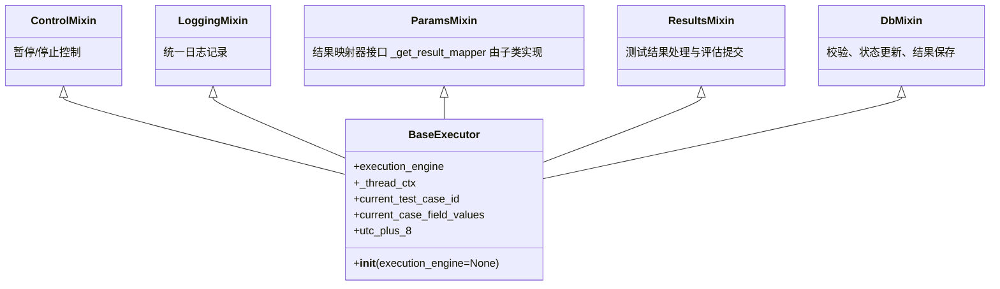
```mermaid
classDiagram
    class BaseExecutor {
        +execution_engine
        +_thread_ctx
        +current_test_case_id
        +current_case_field_values
        +utc_plus_8
        +__init__(execution_engine=None)
    }
    class ControlMixin {
        暂停/停止控制
    }
    class LoggingMixin {
        统一日志记录
    }
    class ParamsMixin {
        结果映射器接口 _get_result_mapper 由子类实现
    }
    class ResultsMixin {
        测试结果处理与评估提交
    }
    class DbMixin {
        校验、状态更新、结果保存
    }
    ControlMixin <|-- BaseExecutor
    LoggingMixin <|-- BaseExecutor
    ParamsMixin <|-- BaseExecutor
    ResultsMixin <|-- BaseExecutor
    DbMixin <|-- BaseExecutor
```

| 成员/方法 | 归属 mixin | 说明 |
|-----------|-----------|------|
| `_thread_ctx`（threading.local） | BaseExecutor | 线程本地上下文，承载 stop/pause 事件（替代 V9.7.10 进程内 `get_task_events(task_id)`） |
| `_check_stop` / `_handle_control` | ControlMixin | 停止/暂停检查；适配器通过注入回调复用（见 3.2 `_check_stop` 适配说明） |
| `_log` | LoggingMixin | 统一日志（实时推送改经 EventBus，见 2.2） |
| `_get_result_mapper` | ParamsMixin | 抽象方法，由子类提供字段映射器 |
| `_save_results` / `_evaluate_result` / `submit_evaluate_case` | ResultsMixin | 结果落库 + gRPC 提交 evaluation_service（不再进程内调用） |
| 校验/状态更新 | DbMixin | 与 task_service 共用事务约定 |

> 【适配说明】：V9.7.10 的 `RealtimeSessionExecutor.__init__(executor)` 挂接宿主执行器取 `_log`/`_result_processor`；V9.7.31 下直接继承 `BaseExecutor`，`_DeviceResultCollectorProxy` 已删除，跨服务数据经各服务 ACL 仓储（`api_test_service/infrastructure/acl/`）获取。

### 2.2 EventBus 与领域事件（消息/事件驱动）

> 真实代码：`shared/utils/redis_pubsub.py` — `RedisPubSub`（单例）、`EventBus`、`EventChannel`、`EventType`、`RedisStore`。**无 MQ**，Redis Pub/Sub 即事件总线。

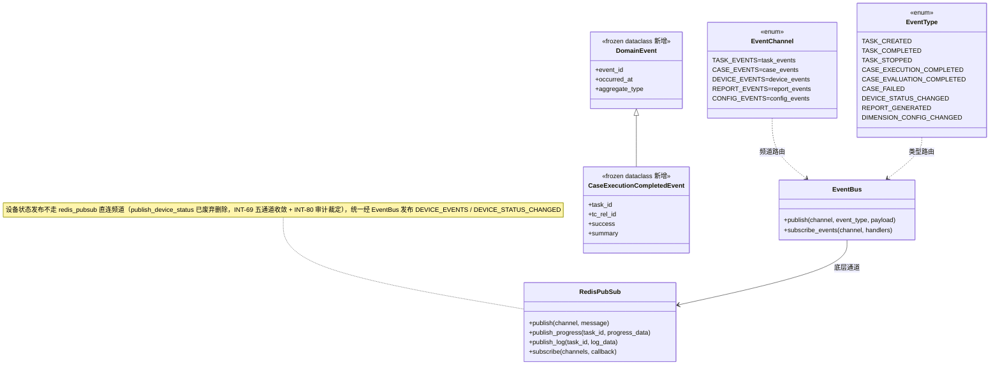
```mermaid
classDiagram
    class EventChannel {
        <<enum>>
        TASK_EVENTS=task_events
        CASE_EVENTS=case_events
        DEVICE_EVENTS=device_events
        REPORT_EVENTS=report_events
        CONFIG_EVENTS=config_events
    }
    class EventType {
        <<enum>>
        TASK_CREATED
        TASK_COMPLETED
        TASK_STOPPED
        CASE_EXECUTION_COMPLETED
        CASE_EVALUATION_COMPLETED
        CASE_FAILED
        DEVICE_STATUS_CHANGED
        REPORT_GENERATED
        DIMENSION_CONFIG_CHANGED
    }
    class RedisPubSub {
        +publish(channel, message)
        +publish_progress(task_id, progress_data)
        +publish_log(task_id, log_data)
        +subscribe(channels, callback)
    }
    note for RedisPubSub "设备状态发布不走 redis_pubsub 直连频道（publish_device_status 已废弃删除，INT-69 五通道收敛 + INT-80 审计裁定），统一经 EventBus 发布 DEVICE_EVENTS / DEVICE_STATUS_CHANGED"
    class EventBus {
        +publish(channel, event_type, payload)
        +subscribe_events(channel, handlers)
    }
    class DomainEvent {
        <<frozen dataclass 新增>>
        +event_id
        +occurred_at
        +aggregate_type
    }
    class CaseExecutionCompletedEvent {
        <<frozen dataclass 新增>>
        +task_id
        +tc_rel_id
        +success
        +summary
    }
    EventBus --> RedisPubSub : 底层通道
    EventChannel ..> EventBus : 频道路由
    EventType ..> EventBus : 类型路由
    DomainEvent <|-- CaseExecutionCompletedEvent
```

**领域事件 frozen dataclass（新增，`shared/domain/events/base.py`）**：`DomainEvent` 基类承载 `event_id / occurred_at / aggregate_type` 公共字段；各服务 `domain/events/` 已有同类实践（如 `api_test_service/domain/events/api_events.py` 的 `APIEvent → APICreated/APIUpdated/APIDeleted`，`audio_service/domain/events/audio_events.py`），新增跨服务事件（用例执行/评估完成）沿用 `@dataclass(frozen=True)` 不可变风格，经 `EventBus.publish(EventChannel.CASE_EVENTS, EventType.CASE_EXECUTION_COMPLETED, payload)` 发布。

**log_and_emit 适配（事件化）**：V9.7.10 `log_and_emit` 在进程内直推 WebSocket；V9.7.31 改为——执行侧 `LoggingMixin` 落库日志 + `EventBus` 发布 → **api_gateway 订阅 Redis 频道后经 Socket.IO 转发前端**。发布侧禁止裸字符串频道/事件名，一律使用 `EventChannel`/`EventType` 枚举。

### 2.3 common_enums.py 新增枚举（（新增））

> 真实代码：`shared/models/common_enums.py`。现有 `ReportStatus/TaskStatus/ReportType/TestType/FieldType/ViewMode/RedisKeyPrefix/EvalTaskStatus`。本节三枚举为（新增），落入同一文件，与 `shared/utils/status_constants.py`（TaskStatus/TaskCaseStatus/ExecutionStatus/EvaluationStatus 及 FINISHED_*/ACTIVE_*/INTERRUPTED_* frozenset）共同构成状态/类型单一来源。

```python
# shared/models/common_enums.py ——（新增）以下三枚举

class DeviceType(str, Enum):
    """被测端类型枚举 — 决定 api_test_service 内执行路由与互斥策略
    （不引入 'realtime_api' TaskType；Realtime 会话由 DeviceType.WEBSOCKET_API 承载）
    """
    PHYSICAL = 'physical'         # 物理设备（E2E / physical API 用例，Redis 分布式锁互斥）
    HTTP_API = 'http_api'         # HTTP API（非实时 / 流式 SSE）
    WEBSOCKET_API = 'websocket_api'  # Realtime API 流式会话（WebSocket 长连接）


class OutputType(str, Enum):
    """API 输出类型枚举 — 对应适配器 AdapterOutput 的产物维度"""
    TEXT = 'text'            # 文本（token 流 / 整段）
    AUDIO = 'audio'          # 音频（PCM / base64 chunk）
    IMAGE = 'image'          # 图片（URL 或 base64）
    VIDEO = 'video'          # 视频帧


class CalibrationStatus(str, Enum):
    """校准状态枚举 — ApiRmsSplMapping / SPLMapping 共用"""
    UNCALIBRATED = 'uncalibrated'
    CALIBRATED = 'calibrated'
```

| 枚举 | 消费方 | 取值语义 |
|------|--------|----------|
| `DeviceType` | task_service `_dispatch_api_case` 路由、`StartAPITestRequest.device_type`（3.4）、api_models `API.device_type` 列（3.3） | physical / realtime |
| `OutputType` | `API.output_types` 列（3.3）、`AdapterOutput` 产物维度、前端展示 | text / audio / image / video |
| `CalibrationStatus` | `api_rms_spl_mappings.calibration_status`（3.3）、前端校准页签 | uncalibrated / calibrated |

> 【适配说明】：V9.7.10 `calibration_status` 为 String 列裸值 `'calibrated'/'uncalibrated'`；V9.7.31 枚举化后 PO 层存原值（snake_case 字符串），Domain/前端读枚举，消除魔法字符串。

### 2.4 分布式协调类

> 真实代码：`shared/utils/distributed_coordinator.py`、`shared/utils/service_registry.py`。

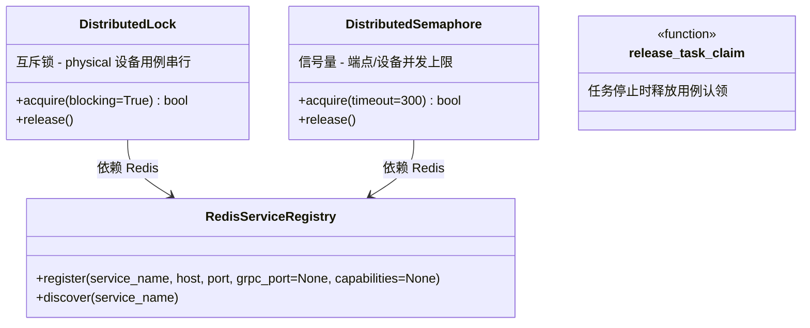
```mermaid
classDiagram
    class DistributedLock {
        +acquire(blocking=True) bool
        +release()
        互斥锁 - physical 设备用例串行
    }
    class DistributedSemaphore {
        +acquire(timeout=300) bool
        +release()
        信号量 - 端点/设备并发上限
    }
    class RedisServiceRegistry {
        +register(service_name, host, port, grpc_port=None, capabilities=None)
        +discover(service_name)
    }
    class release_task_claim {
        <<function>>
        任务停止时释放用例认领
    }
    DistributedLock --> RedisServiceRegistry : 依赖 Redis
    DistributedSemaphore --> RedisServiceRegistry : 依赖 Redis
```

| 类 | 方法（真实签名，snake_case） | 用途 |
|----|------------------------------|------|
| `DistributedLock` | `acquire(blocking=True)` / `release()` | **physical 设备互斥**：同一物理设备同时只允许一个用例执行；锁 key 由 `RedisKeyPrefix` 风格前缀 + device_id 构成，禁止裸字符串拼接 |
| `DistributedSemaphore` | `acquire(timeout=300)` / `release()` | 端点并发上限（如 `EVAL_SEMAPHORE`）；api_test_service replicas:2 下跨副本约束 |
| `RedisServiceRegistry` | `register(...)` / `discover(service_name)` | 多副本服务注册/发现；api_test_service 两副本注册同一 service_name，gRPC 客户端轮询 |
| `release_task_claim`（模块函数） | `release_task_claim(task_id)` | 任务停止时清理由 `DistributedLock`/认领机制占用的资源 |

> 部署形态下的实例标识（worker_instance_id）由部署层注入环境变量，日志与事件负载携带，用于多副本排障；协调逻辑本身只依赖 Redis key，不依赖实例 ID。

---

## 三、api_test_service 类设计

> 服务：api_test_service:5003，**replicas:2**（多副本无状态，协调全走 Redis）；gRPC 契约 `shared/proto/api_test_service.proto::APITestService`。目录分层：`domain/`（聚合/值对象/领域事件/仓储接口）→ `application/`（CQRS 命令/查询 + 执行器 + 适配器）→ `infrastructure/`（PO/ACL/gRPC/事件发布）。

### 3.1 domain 层

#### 3.1.1 API 聚合（扩展）

> 存量代码：`api_test_service/domain/entities/api.py`（`APIAggregate`、`APISnapshot` frozen、`HTTPMethod`、`APIStatus`）；`domain/value_objects/api_config.py`；`domain/services/api_validator.py`。存量方法（`activate/update_url` 等）为 snake_case，随重构统一 camelCase。

**（新增）字段与行为**（对应 3.3 PO 四个新增列 + 映射外键）：

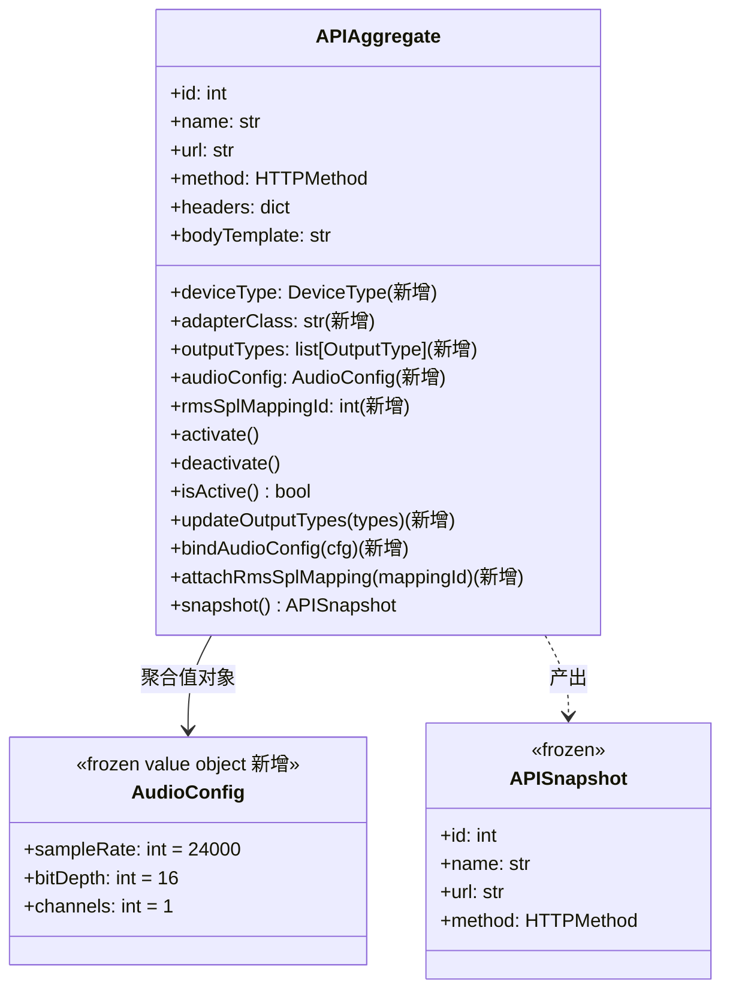
```mermaid
classDiagram
    class APIAggregate {
        +id: int
        +name: str
        +url: str
        +method: HTTPMethod
        +headers: dict
        +bodyTemplate: str
        +deviceType: DeviceType (新增)
        +adapterClass: str (新增)
        +outputTypes: list[OutputType] (新增)
        +audioConfig: AudioConfig (新增)
        +rmsSplMappingId: int (新增)
        +activate()
        +deactivate()
        +isActive() bool
        +updateOutputTypes(types) (新增)
        +bindAudioConfig(cfg) (新增)
        +attachRmsSplMapping(mappingId) (新增)
        +snapshot() APISnapshot
    }
    class AudioConfig {
        <<frozen value object 新增>>
        +sampleRate: int = 24000
        +bitDepth: int = 16
        +channels: int = 1
    }
    class APISnapshot {
        <<frozen>>
        +id: int
        +name: str
        +url: str
        +method: HTTPMethod
    }
    APIAggregate --> AudioConfig : 聚合值对象
    APIAggregate ..> APISnapshot : 产出
```

| 方法（Domain，camelCase） | 类型 | 说明 |
|---------------------------|------|------|
| `updateOutputTypes(types: list[OutputType])` | （新增） | 声明该 API 的输出产物维度，驱动结果采集与前端展示 |
| `bindAudioConfig(cfg: AudioConfig)` | （新增） | 绑定目标音频格式（混音 6 步的格式适配目标）；缺省回退 24kHz/16bit/mono（OpenAI 兼容） |
| `attachRmsSplMapping(mappingId: int)` | （新增） | 指定当前默认 RMS→SPL 映射（对应 PO `rms_spl_mapping_id`） |
| `deviceType / adapterClass` 属性 | （新增） | 路由依据（DeviceType 枚举）与适配器选择依据（adapter_class 提示，最终仍由 Factory 按 (protocol, vendor) 决定） |

#### 3.1.2 ApiRmsSplMapping 聚合（（新增），按 DDD 五层落位）

> 对应 V9.7.10 §5.7a。被测 API 与映射为 1:N；与 E2E `SPLMapping`（设备侧，audio_service）对称。五层落位：

| 层 | 路径（新增） | 内容 |
|----|--------------|------|
| domain/entities | `api_test_service/domain/entities/api_rms_spl_mapping.py` | `ApiRmsSplMappingAggregate`（聚合根，camelCase） |
| domain/value_objects | `api_test_service/domain/value_objects/spl.py` | `CalibrationPoint`（frozen：targetSpl/gainLinear/rmsDbfs）、`SplCurve`（frozen：多点曲线，含 `gainAt(targetSpl)` 插值） |
| application | `api_test_service/application/commands/rms_spl_commands.py` + `handlers/rms_spl_command_handlers.py` | 校准数据写入/状态变更命令 |
| infrastructure/persistence | `api_test_service/infrastructure/persistence/models/api_models.py` | `ApiRmsSplMapping` PO（表 `api_rms_spl_mappings`，见 3.3） |
| infrastructure/repository | `api_test_service/infrastructure/persistence/api_rms_spl_repository.py` | PO↔聚合转换 + 持久化 |

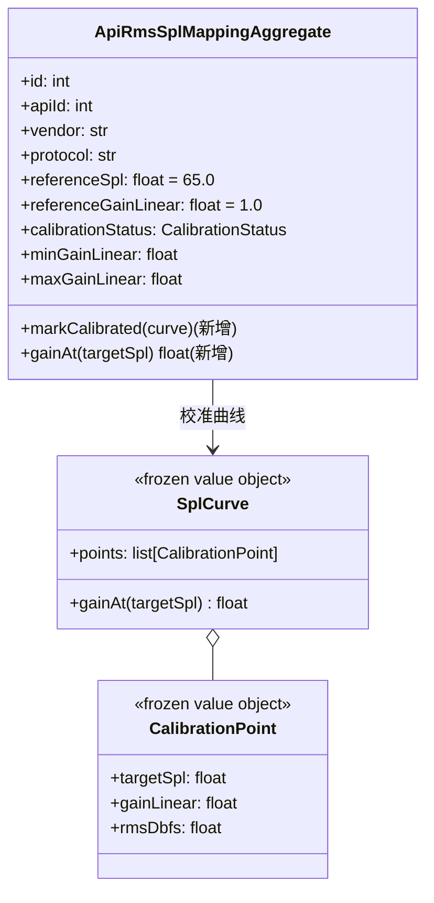
```mermaid
classDiagram
    class ApiRmsSplMappingAggregate {
        +id: int
        +apiId: int
        +vendor: str
        +protocol: str
        +referenceSpl: float = 65.0
        +referenceGainLinear: float = 1.0
        +calibrationStatus: CalibrationStatus
        +minGainLinear: float
        +maxGainLinear: float
        +markCalibrated(curve) (新增)
        +gainAt(targetSpl) float (新增)
    }
    class SplCurve {
        <<frozen value object>>
        +points: list[CalibrationPoint]
        +gainAt(targetSpl) float
    }
    class CalibrationPoint {
        <<frozen value object>>
        +targetSpl: float
        +gainLinear: float
        +rmsDbfs: float
    }
    ApiRmsSplMappingAggregate --> SplCurve : 校准曲线
    SplCurve o-- CalibrationPoint
```

`gainAt` 语义与 V9.7.10 `ApiRmsSplService` 对称：有校准点 → 按 SPL 排序线性插值；仅参考点 → `ref_gain × 10^((target-ref)/20)`；无校准 → 线性近似 `10^((target-65)/20)`；结果受 `min/max_gain_linear` 限幅。

#### 3.1.3 RealtimeEventType — 归一化事件枚举（（新增））

> 对应 V9.7.10 §5.4 OpenAI 事件归一化映射。11 种归一化事件收敛为枚举，供适配器 `_parse_event` 产出、executor 判定、事件日志落库，消除魔法字符串：

```python
# api_test_service/domain/enums/realtime_event_type.py ——（新增）
class RealtimeEventType(str, Enum):
    AI_AUDIO_DELTA = 'ai_audio_delta'              # AI 音频增量（首帧延迟锚点）
    AI_AUDIO_DONE = 'ai_audio_done'                # AI 音频回复完成
    AI_TEXT_DELTA = 'ai_text_delta'                # AI 文本增量
    AI_TEXT_DONE = 'ai_text_done'                  # AI 文本完成
    USER_SPEECH_STARTED = 'user_speech_started'    # 用户开口（barge-in 信号）
    USER_SPEECH_STOPPED = 'user_speech_stopped'
    RESPONSE_CANCELLED = 'response_cancelled'      # 回复被打断取消（barge-in 信号）
    SESSION_CREATED = 'session_created'
    SESSION_UPDATED = 'session_updated'
    ERROR = 'error'
    RAW = 'raw'                                    # 未识别事件原样记录
```

### 3.2 application 层

#### 3.2.1 CQRS 命令/查询

> 存量代码：`application/commands/api_test_commands.py`、`application/queries/api_test_queries.py`、`application/handlers/command_handlers.py`、`application/handlers/query_handlers.py`（CQRS 骨架已具备）。

| 命令/查询 | 状态 | 关键字段 |
|-----------|------|----------|
| `StartAPITestCommand` | 存量扩展（新增 `device_type` 字段） | `task_id`、`device_type: DeviceType`（→ proto `StartAPITestRequest.device_type`，3.4） |
| `CreateAPITestCommand` / `StopAPITestCommand` | 存量 | task_id、test_config |
| `CreateAPIConfigCommand` / `UpdateAPIConfigCommand` / `DeleteAPIConfigCommand` | 存量扩展 | API 配置 CRUD（新增字段透传，见 3.3） |
| `RegisterRmsSplMappingCommand` / `UpdateCalibrationCommand` | （新增） | api_id、校准点集、`CalibrationStatus` 变更 |
| `ListAPIConfigsQuery` / `GetAPIConfigQuery` | 存量 | 分页/详情（camelCase DTO 出参，dto 转换在 infrastructure） |

> 【适配说明】：命令处理器内部经 ACL 仓储（`infrastructure/acl/task_data_acl_repository.py` 等）取 task/case 数据，禁止直连 task_service 的表。

#### 3.2.2 RealtimeSessionExecutor（（新增）执行器）

> 对应 V9.7.10 §5.7，落位 `api_test_service/application/executors/realtime_session_executor.py`（新增）；继承 `BaseExecutor`（2.1）。与存量 `core/api_session_executor.py`（非 realtime 路径）平级，由 `device_type` 路由选择（5.1）。

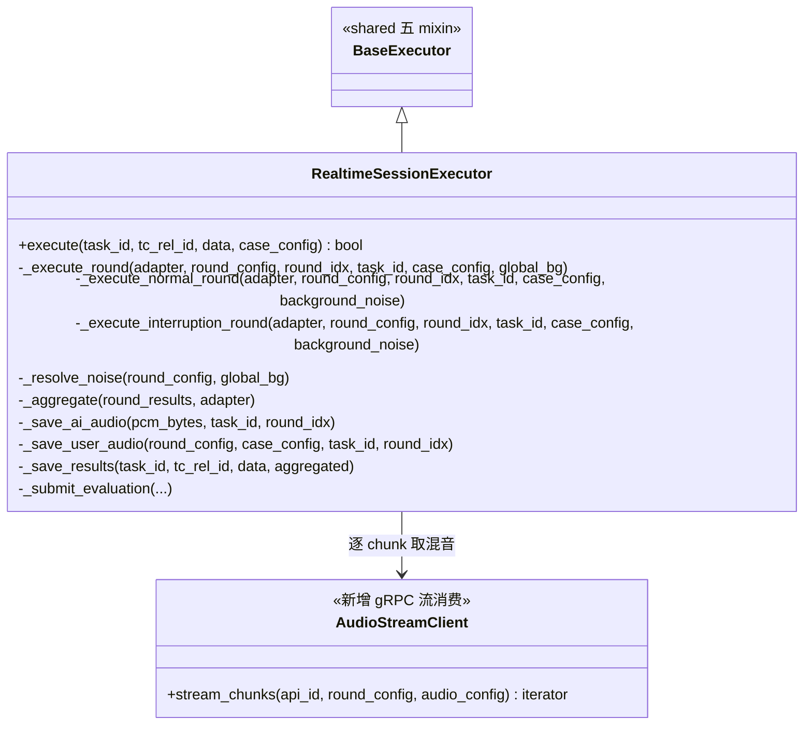
```mermaid
classDiagram
    class RealtimeSessionExecutor {
        +execute(task_id, tc_rel_id, data, case_config) bool
        -_execute_round(adapter, round_config, round_idx, task_id, case_config, global_bg)
        -_execute_normal_round(adapter, round_config, round_idx, task_id, case_config, background_noise)
        -_execute_interruption_round(adapter, round_config, round_idx, task_id, case_config, background_noise)
        -_resolve_noise(round_config, global_bg)
        -_aggregate(round_results, adapter)
        -_save_ai_audio(pcm_bytes, task_id, round_idx)
        -_save_user_audio(round_config, case_config, task_id, round_idx)
        -_save_results(task_id, tc_rel_id, data, aggregated)
        -_submit_evaluation(...)
    }
    class BaseExecutor {
        <<shared 五 mixin>>
    }
    class AudioStreamClient {
        <<新增 gRPC 流消费>>
        +stream_chunks(api_id, round_config, audio_config) iterator
    }
    BaseExecutor <|-- RealtimeSessionExecutor
    RealtimeSessionExecutor --> AudioStreamClient : 逐 chunk 取混音
```

| 方法（Python snake_case） | 说明 |
|---------------------------|------|
| `execute(task_id, tc_rel_id, data, case_config)` | 主流程：建适配器 → `initialize` → `pre_process`（session.update）→ 多轮循环 → `_aggregate` → `_save_results` → `_submit_evaluation` → `teardown` |
| `_execute_round` | 轮次分派：`is_interruption` → 打断轮 / 正常轮 |
| `_execute_normal_round` | 取混音流逐 chunk `adapter.send(chunk, is_audio=True)`（节奏 100ms）→ `commit_input` → `post_process` 等 AI 完整回复 → 从 `adapter.output` 采集评估字段（user_wav/ai_wav/start_ms/end_ms/first_frame_ms/commit_ms/query/answer 等） |
| `_execute_interruption_round` | 等 AI 开始说话（`post_process(is_interruption=True)`）→ `interruption_delay_ms` 延迟 → 推送打断混音 → 5s 窗口检测 barge-in（`user_speech_started`/`response_cancelled`）→ 成功则等 AI 重新回复 |
| `_resolve_noise` | 噪声合并：**轮次级 background_noise > case 级**；混入每轮混音缓冲，不单独推送 |
| `_aggregate` | 轮次聚合：round_count/total_latency/avg_latency/barge_in_total/barge_in_success_rate + `eval_params`（rounds、user_wav、ai_wav、original_topic、enable_llm_eval） |
| `_save_results` | 复用 `APIResultProcessor.create_multi_round_test_result`（`core/api_result_processor.py`） |
| `_submit_evaluation` | gRPC `submit_evaluate_case(task_id, result_id, test_case_id, algorithm_result, eval_params)`（`shared/clients/_grpc_task_data.py:15`），不再进程内调用评估 |

**生产者-消费者与帧/终态分离**：
- **事件队列**：`RealtimeAPIAdapter._recv_loop` 线程为生产者，`_event_queue` 为消费者队列，`recv(timeout)` 阻塞取事件 → executor 永不直接读 WebSocket；
- **帧结果与最终结果分离**：适配器内部维护逐帧列表（`_frame_timestamps/_frame_types/_frame_payloads`），executor 只读聚合后的 `adapter.output`（`AdapterOutput`）——帧级指标（first_frame_ms）与终态指标（ai_audio 总量/文本）互不耦合；
- **barge-in 打断检测**：打断轮在推送后开 5s 检测窗，命中 `RealtimeEventType.USER_SPEECH_STARTED` 或 `RESPONSE_CANCELLED` 即判定打断成功并记录 `barge_in_latency_ms`。

**OpenAI 密钥链（（新增）配置化约定）**：`_build_connect_headers` 按 `case_config.api_key → api_config.meta.api_key → env OPENAI_API_KEY` 三级解析，禁止硬编码密钥。

#### 3.2.3 AudioStreamClient — 混音流消费（（新增），gRPC 客户端侧）

> 【适配说明】：V9.7.10 `AudioStreamOrchestrator.chunk_audio()` 是 api 进程内静态方法（numpy 离线混音）；V9.7.31 混音**下沉 audio_service**（4.1/4.2），api_test_service 侧只保留薄客户端，将 `RenderAudioStream`（server-streaming）返回的 100ms base64 chunk 转交适配器推送。音频文件读取（V9.7.10 `_load_audio_fn` 查 `Audio.file_path`）改由 audio_service 本地完成，跨服务不再传文件路径。

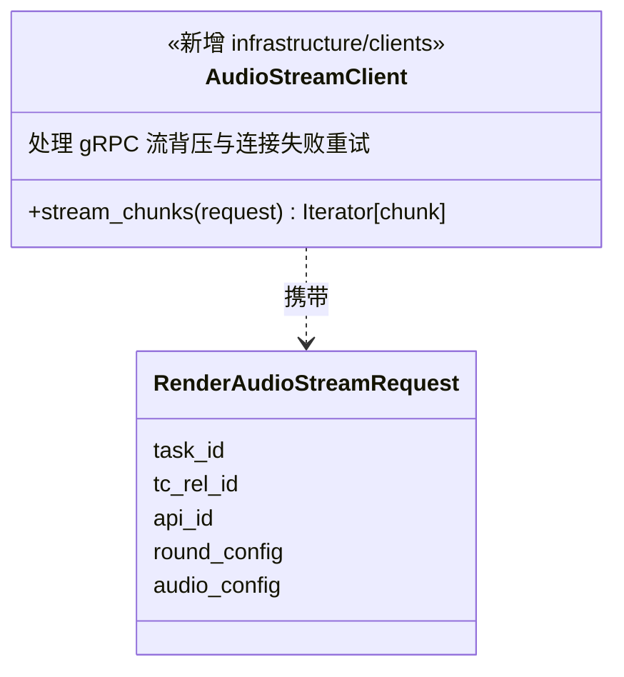
```mermaid
classDiagram
    class AudioStreamClient {
        <<新增 infrastructure/clients>>
        +stream_chunks(request) Iterator[chunk]
        处理 gRPC 流背压与连接失败重试
    }
    class RenderAudioStreamRequest {
        task_id
        tc_rel_id
        api_id
        round_config
        audio_config
    }
    AudioStreamClient ..> RenderAudioStreamRequest : 携带
```

#### 3.2.4 适配器体系（BaseAPIAdapter / HttpAPIAdapter / HttpStreamAdapter / RealtimeAPIAdapter）

> 对应 V9.7.10 §5.1–5.4，落位 `api_test_service/application/adapters/`（（新增）目录；实现层组件，方法保持 Python snake_case）。与 `BaseDeviceDriver` 对称的生命周期：`initialize → pre_process → send → recv → post_process → teardown`。

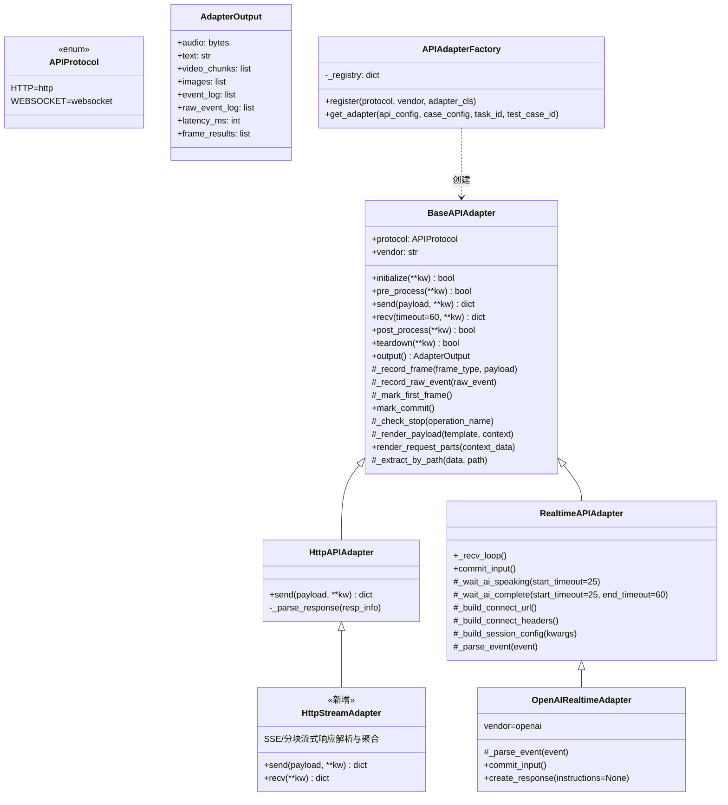
```mermaid
classDiagram
    class APIProtocol {
        <<enum>>
        HTTP=http
        WEBSOCKET=websocket
    }
    class AdapterOutput {
        +audio: bytes
        +text: str
        +video_chunks: list
        +images: list
        +event_log: list
        +raw_event_log: list
        +latency_ms: int
        +frame_results: list
    }
    class BaseAPIAdapter {
        +protocol: APIProtocol
        +vendor: str
        +initialize(**kw) bool
        +pre_process(**kw) bool
        +send(payload, **kw) dict
        +recv(timeout=60, **kw) dict
        +post_process(**kw) bool
        +teardown(**kw) bool
        +output() AdapterOutput
        #_record_frame(frame_type, payload)
        #_record_raw_event(raw_event)
        #_mark_first_frame()
        +mark_commit()
        #_check_stop(operation_name)
        #_render_payload(template, context)
        +render_request_parts(context_data)
        #_extract_by_path(data, path)
    }
    class HttpAPIAdapter {
        +send(payload, **kw) dict
        -_parse_response(resp_info)
    }
    class HttpStreamAdapter {
        <<新增>>
        SSE/分块流式响应解析与聚合
        +send(payload, **kw) dict
        +recv(**kw) dict
    }
    class RealtimeAPIAdapter {
        +_recv_loop()
        +commit_input()
        #_wait_ai_speaking(start_timeout=25)
        #_wait_ai_complete(start_timeout=25, end_timeout=60)
        #_build_connect_url()
        #_build_connect_headers()
        #_build_session_config(kwargs)
        #_parse_event(event)
    }
    class OpenAIRealtimeAdapter {
        vendor=openai
        #_parse_event(event)
        +commit_input()
        +create_response(instructions=None)
    }
    class APIAdapterFactory {
        -_registry: dict
        +register(protocol, vendor, adapter_cls)
        +get_adapter(api_config, case_config, task_id, test_case_id)
    }
    BaseAPIAdapter <|-- HttpAPIAdapter
    HttpAPIAdapter <|-- HttpStreamAdapter
    BaseAPIAdapter <|-- RealtimeAPIAdapter
    RealtimeAPIAdapter <|-- OpenAIRealtimeAdapter
    APIAdapterFactory ..> BaseAPIAdapter : 创建
```

**关键成员/方法表（BaseAPIAdapter）**：

| 成员/方法 | 职责 |
|-----------|------|
| `output` → `AdapterOutput` | executor 唯一读取口：帧结果聚合为最终结果，不暴露厂商字段 |
| `_record_frame / _record_raw_event / _mark_first_frame / mark_commit` | 帧记录四件套：子类 `_parse_event` 调用；`ai_audio_delta` 触发首帧延迟计算（相对 `mark_commit`） |
| `_check_stop(operation_name)` | 【适配说明】：V9.7.10 从 `get_task_events(task_id)` 取进程内 stop/pause Event；V9.7.31 改由宿主 executor 注入检查回调（内部走 BaseExecutor `ControlMixin._check_stop` 线程本地态），适配器不感知进程/副本边界 |
| `_log(level, content, **kw)` | 【适配说明】：V9.7.10 直调 `log_and_emit`；V9.7.31 经 LoggingMixin 落库 + EventBus 发布（2.2），模块名 `APIAdapter[vendor]` |
| `_render_payload / render_request_parts / _replace_placeholders` | 模板渲染：`{{placeholder}}` 替换，headers = meta.headers + case_config.headers 合并 |
| `_extract_by_path(data, path)` | 点路径取值（`a.b.0.c`），厂商响应字段映射基础件 |

**厂商子类职责**（子类只做"厂商字段解读"，其余全部复用基类）：

| 子类 | vendor / protocol | 覆写点 |
|------|-------------------|--------|
| `HttpAPIAdapter` | 通用 / http | `send`（GET 过滤复杂类型）、`_parse_response`（asr/trans/sentence_end/session_end/error_code 映射 + all_responses 流式聚合） |
| `HttpStreamAdapter`（（新增），自 HttpAPIAdapter 拆出流式分支） | 通用 / http | SSE/分块流式：`send` 发起后逐块 `recv`，边收边 `_record_frame`，替代单体版 `_parse_response` 的 all_responses 一次性聚合 |
| `RealtimeAPIAdapter` | 通用 / websocket | `_recv_loop`（事件队列生产者）、`_wait_ai_speaking/_wait_ai_complete`、抽象 `_build_connect_url/_build_connect_headers/_build_session_config/_parse_event` |
| `OpenAIRealtimeAdapter` | openai / websocket | OpenAI 事件 → `RealtimeEventType` 归一化（`response.audio.delta` → base64 解码入 `_ai_audio_chunks` + `_mark_first_frame`；`speech_started`/`response.cancelled` → `barge_in_detected=True`）；`commit_input`/`create_response` |

#### 3.2.5 APIAdapterFactory — 注册表（按 protocol, vendor）

> 对应 V9.7.10 §5.5。注册表 key 为 `(protocol, vendor)` 二元组，vendor 取 `api_config.vendor` 或 `meta.vendor`（缺省 `'default'`）；protocol 由 case_config.protocol 或 endpoint 前缀（ws://、wss://）推断，推断结果收敛为 `APIProtocol` 枚举。

| 注册项 | 值 |
|--------|-----|
| (http, volc_ast) / (http, qwen_llm) | HttpAPIAdapter 子类（vendor 专属字段映射差异） |
| (http, default) | `HttpAPIAdapter` |
| (websocket, openai) / (websocket, openai_realtime) | `OpenAIRealtimeAdapter` |
| 未注册的 websocket vendor | **抛错拒绝**（不回退，防误路由） |
| 未注册的 http vendor | 回退 (http, default) |

> 【适配说明】：V9.7.31 预留 `api_adapter_service:5008`（`adapters/base.py`、`adapters/factory.py`）承接厂商私有协议的远程适配；本地注册表未命中时按配置路由到该服务，本篇不展开。

#### 3.3.1 api_models.py PO 列（（新增）列）

> 真实代码：`api_test_service/infrastructure/persistence/models/api_models.py`（表 `apis`）。现有列：`id/name/vendor/api_url/description/status/meta/algorithm_type/max_process/max_timeout/max_audio_duration/health_score/created_by_user_id/.../api_endpoints` 等。**以下四列 + 外键为（新增）**：

| 列（snake_case） | 类型 | 说明 |
|------------------|------|------|
| `device_type` | String(20)，默认 `'physical'` | 被测端类型，取值 = `DeviceType` 枚举原值；task_service 路由依据 |
| `adapter_class` | String(50)，可空 | 适配器提示（如 `openai_realtime`）；最终仍由 Factory 按 (protocol, vendor) 决定 |
| `audio_config` | JSON，可空 | `{'sample_rate', 'bit_depth', 'channels'}`；空 → 回退 24kHz/16bit/mono |
| `output_types` | JSON，默认 list | `['text','audio',...]`，取值 = `OutputType` 枚举原值 |
| `rms_spl_mapping_id` | Integer FK → `api_rms_spl_mappings.id` | 当前默认 RMS→SPL 映射 |

#### 3.3.2 ApiRmsSplMapping PO（（新增））

> 表 `api_rms_spl_mappings`，落位同文件 `api_test_service/infrastructure/persistence/models/api_models.py`。列结构对齐 V9.7.10 §5.7a：

| 列 | 类型 | 说明 |
|----|------|------|
| `id` / `name` / `description` | Integer PK / String(100) / Text | 映射标识 |
| `api_id` | Integer FK → `apis.id`，非空 | 被测 API 1:N 映射 |
| `vendor` / `protocol` | String(50) / String(20) | 冗余供应商与协议（建映射时的快照） |
| `reference_spl` / `reference_gain_linear` | Float / Float | 单点参考（默认 65.0 / 1.0） |
| `calibration_status` | String(20)，默认 `'uncalibrated'` | 取值 = `CalibrationStatus` 枚举原值 |
| `calibration_data` | JSON | `{'points': [{target_spl, gain_linear, rms_dbfs}, ...]}` |
| `min_gain_linear` / `max_gain_linear` | Float | 增益限幅（默认 0.001 / 10.0） |
| `created_at` / `updated_at` / `deleted` | DateTime / DateTime / Boolean | 审计与逻辑删除（60 天后硬清理，同库约定） |

> 迁移：新增 Alembic 迁移脚本建表 + `apis` 加列（物理列与 V9.7.10 方案一致，属"先重构（PO 归位），再管消费方"路径）。

#### 3.3.3 gRPC 客户端与 ACL 仓储

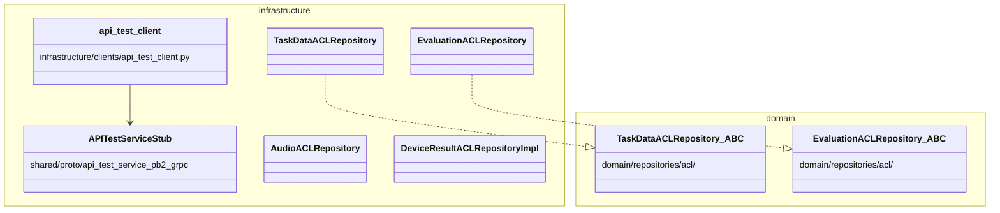
```mermaid
classDiagram
    namespace infrastructure {
        class APITestServiceStub {
            shared/proto/api_test_service_pb2_grpc
        }
        class api_test_client {
            infrastructure/clients/api_test_client.py
        }
        class TaskDataACLRepository
        class EvaluationACLRepository
        class AudioACLRepository
        class DeviceResultACLRepositoryImpl
    }
    namespace domain {
        class TaskDataACLRepository_ABC {
            domain/repositories/acl/
        }
        class EvaluationACLRepository_ABC {
            domain/repositories/acl/
        }
    }
    TaskDataACLRepository ..|> TaskDataACLRepository_ABC
    EvaluationACLRepository ..|> EvaluationACLRepository_ABC
    api_test_client --> APITestServiceStub
```

| 组件 | 真实路径 | 职责 |
|------|----------|------|
| `APITestService` gRPC 契约 | `shared/proto/api_test_service.proto` + `_pb2_grpc.py` | CreateAPITest / StartAPITest / StopAPITest / GetAPITestStatus / API 配置 CRUD / TestAPIConnection |
| gRPC 客户端封装 | `api_test_service/infrastructure/clients/api_test_client.py`、`shared/clients/_grpc_stubs.py`、`shared/clients/grpc_clients.py` | 通道管理、超时/重试 |
| ACL 仓储 | `infrastructure/acl/task_data_acl_repository.py`、`evaluation_acl_repository.py`、`audio_acl_repository.py`、`adapter_acl_repository.py`、`algorithm_acl_repository.py`、`testcase_acl_repository.py`、`device_result_acl_repository_impl.py`（接口在 `domain/repositories/acl/`） | 跨上下文数据唯一入口（task/case 数据、评估提交、音频元数据、设备结果） |
| 评估提交 | `shared/clients/_grpc_task_data.py::submit_evaluate_case(task_id, result_id, test_case_id, algorithm_result, eval_params)` | gRPC → evaluation_service:5004 |

#### 3.3.4 事件发布器（（新增））

```python
# api_test_service/infrastructure/events/api_test_event_publisher.py ——（新增）
class ApiTestEventPublisher:
    """执行/评估事件统一发布口 — 禁止散落各处直接 publish"""

    def publish_case_execution_completed(self, task_id, tc_rel_id, summary): ...
        # EventBus.publish(EventChannel.CASE_EVENTS,
        #                  EventType.CASE_EXECUTION_COMPLETED, payload)

    def publish_case_failed(self, task_id, tc_rel_id, error): ...
        # EventType.CASE_FAILED

    def publish_log(self, task_id, log_data): ...
        # RedisPubSub.publish_log → api_gateway 订阅 → Socket.IO 转发
```

> 【适配说明】：V9.7.10 `log_and_emit(task_id=..., test_case_id=...)` 在单体内直推 WebSocket；V9.7.31 执行器/适配器不再持有任何 WebSocket 引用，全部经此发布器出口，payload 携带 `worker_instance_id` 便于多副本（replicas:2）排障。

#### 3.4 proto 契约扩展与 StartAPITest 全链路

`shared/proto/api_test_service.proto::APITestService` 现有 rpc：`CreateAPITest / StartAPITest / StopAPITest / GetAPITestStatus` + API 配置 CRUD（`CreateAPIConfig/UpdateAPIConfig/DeleteAPIConfig/ListAPIConfigs/GetAPIConfig/TestAPIConnection/StopAPITestConfig`）。

```protobuf
// shared/proto/api_test_service.proto ——（新增）字段
message StartAPITestRequest {
  string task_id = 1;
  string device_type = 2;   // （新增）DeviceType 原值：physical | realtime
}
```

**StartAPITest 全链路时序**：

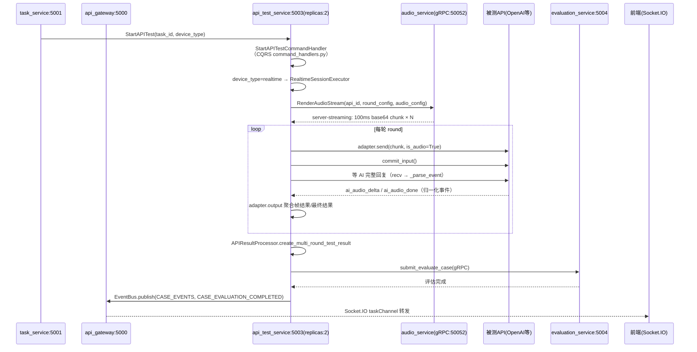
```mermaid
sequenceDiagram
    participant TS as task_service:5001
    participant GW as api_gateway:5000
    participant API as api_test_service:5003(replicas:2)
    participant AUD as audio_service(gRPC:50052)
    participant V as 被测API(OpenAI等)
    participant EV as evaluation_service:5004
    participant FE as 前端(Socket.IO)

    TS->>API: StartAPITest(task_id, device_type)
    API->>API: StartAPITestCommandHandler<br/>（CQRS command_handlers.py）
    API->>API: device_type=realtime → RealtimeSessionExecutor
    API->>AUD: RenderAudioStream(api_id, round_config, audio_config)
    AUD-->>API: server-streaming: 100ms base64 chunk × N
    loop 每轮 round
        API->>V: adapter.send(chunk, is_audio=True)
        API->>V: commit_input()
        API->>V: 等 AI 完整回复（recv → _parse_event）
        V-->>API: ai_audio_delta / ai_audio_done（归一化事件）
        API->>API: adapter.output 聚合帧结果/最终结果
    end
    API->>API: APIResultProcessor.create_multi_round_test_result
    API->>EV: submit_evaluate_case(gRPC)
    EV-->>API: 评估完成
    API->>GW: EventBus.publish(CASE_EVENTS, CASE_EVALUATION_COMPLETED)
    GW-->>FE: Socket.IO taskChannel 转发
```

---

## 四、audio_service 类设计

> 服务：audio_service（gRPC 50052）。现有 gRPC 契约（`shared/proto/audio_service.proto`）：`AudioService`（PlayAudio/StopAudio/MeasureSPL/StartSPL/StopSPL/GetPhysicalDevices/PrepareAudios 等）、`PlaybackService`（StartPlayback/StopPlayback）、`AudioConfigService`（音频 CRUD/上传/转码）。混音相关真实代码：`infrastructure/audio/playback_orchestrator.py`、`infrastructure/audio/audio_timeline.py`、`infrastructure/audio/audio_driver.py`、`infrastructure/audio/spl_service.py`。

### 4.1 RenderAudioStreamServicer（（新增））

> 【适配说明】：V9.7.10 的 API 类混音在 api_test_service 进程内离线完成（`AudioStreamOrchestrator.chunk_audio`）；V9.7.31 将离线混音 6 步下沉至 audio_service，以 **server-streaming** 输出 100ms base64 PCM chunk，api_test_service 经 `AudioStreamClient`（3.2.3）消费。

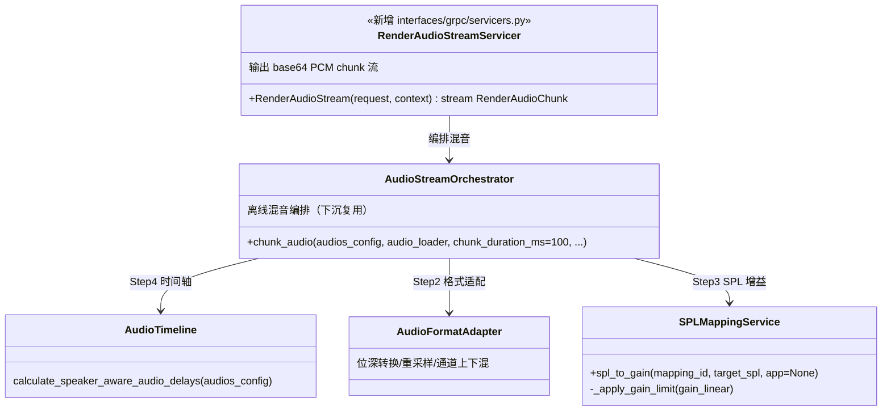
```mermaid
classDiagram
    class RenderAudioStreamServicer {
        <<新增 interfaces/grpc/servicers.py>>
        +RenderAudioStream(request, context) stream RenderAudioChunk
        输出 base64 PCM chunk 流
    }
    class AudioStreamOrchestrator {
        离线混音编排（下沉复用）
        +chunk_audio(audios_config, audio_loader, chunk_duration_ms=100, ...)
    }
    class SPLMappingService {
        +spl_to_gain(mapping_id, target_spl, app=None)
        -_apply_gain_limit(gain_linear)
    }
    class AudioTimeline {
        calculate_speaker_aware_audio_delays(audios_config)
    }
    class AudioFormatAdapter {
        位深转换/重采样/通道上下混
    }
    RenderAudioStreamServicer --> AudioStreamOrchestrator : 编排混音
    AudioStreamOrchestrator --> AudioTimeline : Step4 时间轴
    AudioStreamOrchestrator --> AudioFormatAdapter : Step2 格式适配
    AudioStreamOrchestrator --> SPLMappingService : Step3 SPL 增益
```

| 成员 | 说明 |
|------|------|
| `RenderAudioStream(request, context)`（（新增）proto，server-streaming） | 请求携带 `task_id/tc_rel_id/api_id/round_config/audio_config`；响应流 `RenderAudioChunk{seq, data(base64), duration_ms}` |
| `chunk_duration_ms` | 默认 100ms（24kHz×16bit → 2400 样本/4800 字节每 chunk），由 `api.audio_config` 决定采样参数 |
| 错误语义 | 无可用源/查无映射 → 返回空流而非错误；gRPC 不可用 → `AudioStreamClient` 侧重试（3.2.3） |

### 4.2 AudioStreamOrchestrator — 混音编排（自 playback_orchestrator 体系下沉复用）

> 对应 V9.7.10 §5.6/§5.7b。落位 `audio_service/infrastructure/audio/`（新增模块，紧邻 `playback_orchestrator.py`），**复用同一套时间轴/格式/增益部件**：`audio_timeline.calculate_speaker_aware_audio_delays`（E2E 实时混音同源算法）、格式适配、`spl_service.SPLMappingService`。

**混音 6 步（与 V9.7.10 语义一致）**：

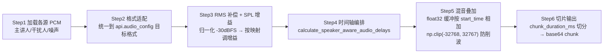
```mermaid
flowchart LR
    A["Step1 加载各源 PCM<br/>主讲人/干扰人/噪声"] --> B["Step2 格式适配<br/>统一到 api.audio_config 目标格式"]
    B --> C["Step3 RMS 补偿 + SPL 增益<br/>归一化 -30dBFS → 按映射调增益"]
    C --> D["Step4 时间轴编排<br/>calculate_speaker_aware_audio_delays"]
    D --> E["Step5 混音叠加<br/>float32 缓冲按 start_time 相加<br/>np.clip(-32768, 32767) 防削波"]
    E --> F["Step6 切片输出<br/>chunk_duration_ms 切分 → base64 chunk"]
```

**关键参数（配置化，拒绝魔法数字）**：

| 常量 | 值 | 来源/回退 |
|------|----|-----------|
| 目标采样率 | 24000 | `api.audio_config.sample_rate`，未配置回退（OpenAI 兼容） |
| 位深 | 16bit（int16） | `api.audio_config.bit_depth` |
| `TARGET_RMS_DBFS` | -30.0 | 与 E2E `audio_driver` 增益补偿基准一致 |
| `chunk_duration_ms` | 100 | 适配器 `_chunk_duration_ms` 对齐 |

**噪声合并优先级（与 E2E playback_orchestrator 一致）**：轮次级 `background_noise` > case 级；`loop=True` 时铺满整个混音缓冲；噪声混入轮次混音，不单独推送。

**E2E vs Realtime 混音/SPL 对照**（V9.7.31 落位视角）：

| 维度 | E2E（物理设备实时链路） | Realtime API（本节，下沉后） |
|------|--------------------------|------------------------------|
| 混音时机 | 实时（audio_driver 回调内逐帧叠加） | 离线（推送前一次性混音完成） |
| 执行进程 | audio_service（播放驱动） | audio_service（RenderAudioStreamServicer） |
| SPL 映射查询 | `SPLMappingService.spl_to_gain(mapping_id, target_spl)`（设备侧映射） | `ApiRmsSplService` 语义（api_id → `api_rms_spl_mappings`，经 audio_service 入参传入或回调） |
| SPL 关联 | PlaybackDevice 1:N SPLMapping | API 1:N ApiRmsSplMapping |
| 校准方式 | 物理校准（播放测试音 + 实测 SPL） | 数字校准（发送已知 RMS + 评估识别效果） |
| 输出 | int16 → 物理播放设备 | int16 → base64 → gRPC 流 → WebSocket chunk |

> 【适配说明】：V9.7.10 `ApiRmsSplService`（api 进程内，按 `api_id` 查库）随混音下沉拆分为两半——插值/限幅算法上移至 `ApiRmsSplMappingAggregate.gainAt`（3.1.2，Domain 层），映射查询由 audio_service 经 ACL/入参完成；`spl_service.py` 的 `SPLMappingService`（设备侧）不动。

### 4.3 SPLMappingService（存量，设备侧）

> 真实代码：`audio_service/infrastructure/audio/spl_service.py` — `class SPLMappingService`，核心方法 `spl_to_gain(mapping_id, target_spl, app=None)`、`_apply_gain_limit(gain_linear)`。为 PlayAudio/MeasureSPL 链路（`AudioService.MeasureSPL`）提供物理音箱声压→增益换算。

| 方法 | 说明 |
|------|------|
| `spl_to_gain(mapping_id, target_spl, app=None)` | 按 `mapping_id` 查 SPLMapping → 校准点插值/单点换算/线性近似（策略与 3.1.2 `gainAt` 对称） |
| `_apply_gain_limit(gain_linear)` | 增益限幅 |

> 【适配说明】：V9.7.10 同名服务按 device 的 `current_spl_mapping_id` 隐式取映射；V9.7.31 显式传 `mapping_id`（调用方由 ACL 查得），服务不再隐式依赖调用上下文。

---

## 五、task_service 类设计

> 服务：task_service:5001。调度编排真实代码：`task_service/core/execution_engine/mixins/task_dispatch.py`（`TaskDispatchMixin`）。

### 5.1 TaskDispatchMixin — device_type 路由扩展（（新增）分支）

**存量方法（真实签名，snake_case）**：

| 方法 | 真实签名 | 现状 |
|------|----------|------|
| `_dispatch_case_by_type` | `(self, task_id, task, tc_rel, session)` | 现按 `task.type == 'api'` 裸字符串分派 |
| `_dispatch_api_case` | `(self, task_id, tc_rel, session)` | `_claim_case` 原子占用（防重复提交）→ `_execute_api_case` |
| `_dispatch_e2e_case` | `(self, task_id, task, tc_rel, session)` | 认领 → `_execute_e2e_case` → 失败 `_handle_e2e_failure` |

**路由扩展设计**【适配说明：在 `_dispatch_api_case` 内按 `device_type` 二次分派；废弃 `task.type`/`test_type` 裸字符串，改用 `TestType`/`DeviceType` 枚举】：

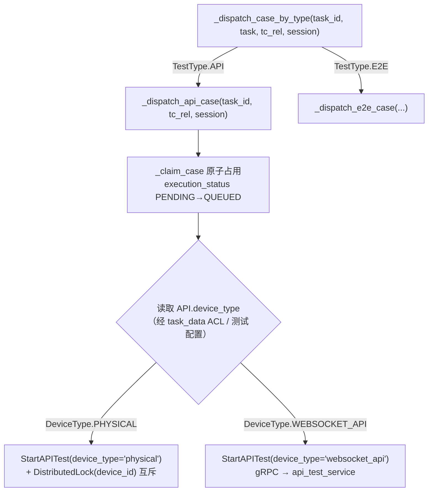
```mermaid
flowchart TD
    A["_dispatch_case_by_type(task_id, task, tc_rel, session)"] -->|TestType.API| B["_dispatch_api_case(task_id, tc_rel, session)"]
    A -->|TestType.E2E| C["_dispatch_e2e_case(...)"]
    B --> B1["_claim_case 原子占用<br/>execution_status PENDING→QUEUED"]
    B1 --> B2{"读取 API.device_type<br/>（经 task_data ACL / 测试配置）"}
    B2 -->|DeviceType.PHYSICAL| D["StartAPITest(device_type='physical')<br/>+ DistributedLock(device_id) 互斥"]
    B2 -->|DeviceType.WEBSOCKET_API| E["StartAPITest(device_type='websocket_api')<br/>gRPC → api_test_service"]
```

| 分派分支 | 互斥/并发策略 | 说明 |
|----------|----------------|------|
| `physical` | `DistributedLock`（Redis，key 含 device_id） | 同一物理设备跨副本串行；锁经 `release_task_claim` 在停止/终态时释放 |
| `realtime` | 无设备锁；受端点级 `DistributedSemaphore` 约束 | WebSocket 长连接由 api_test_service 多副本分摊 |

> 【适配说明】：`device_type` 的获取链路为 task_service 查测试配置（含 `api_id`）→ ACL 读 `apis.device_type`（3.3.1 新增列）→ 写入 `StartAPITestRequest.device_type`；不引入 `'realtime_api'` TaskType，`task_case_relations` 表不动表结构。

### 5.2 TaskCase.device_id（已存在）

> 真实代码：`task_service/infrastructure/persistence/models/task_models.py:111` — `device_id = Column(Integer, comment='关联被测设备ID')`。该列已存在，physical 分派的互斥锁 key 与结果归组直接消费，无需迁移。

---

## 六、前端类设计（Vue3 + TS + Pinia，DDD 四层）

> 分层规则：`views/ + components/`（Presentation，只见 camelCase Domain 与 composables Port）→ `composables/ + store/`（Application，编排用例、缓存 ReadModel）→ `domain/model/ + enums.ts`（Domain，零依赖）→ `infrastructure/ api/ + adapters/ + dto/ + http/`（唯一知道 snake_case 的层）。

### 6.1 SPLMapping 五层模板对照（新页面模板）

> 声压级映射前端已按 DDD 五层落地，作为**测试执行相关新页面（如 Realtime API 配置、校准管理）的模板**：

| 层 | 真实文件 | 职责 |
|----|----------|------|
| Presentation | `frontend/src/views/SPLMapping/SPLMapping.vue` | 只渲染 Domain 模型 + 绑定 composable |
| Application | `frontend/src/views/SPLMapping/SPLMapping.ts::useSplMapping()` | 编排用例、持 Port 引用、派生 UI 状态 |
| Port（Application 侧接口） | `frontend/src/composables/device/splPort.ts` | 依赖倒置边界 |
| Infrastructure API | `frontend/src/infrastructure/api/splApi.ts` | HTTP 调 api_gateway（:5000） |
| Infrastructure Adapter | `frontend/src/infrastructure/adapters/splAdapter.ts` | Port 实现，调用 api |
| Infrastructure DTO | `frontend/src/infrastructure/dto/splDto.ts` | snake_case ↔ camelCase 唯一转换点 |
| Domain | `frontend/src/domain/model/spl.ts` | camelCase 模型，零依赖 |

### 6.2 enums.ts 新增枚举（（新增））

> 真实代码：`frontend/src/domain/enums.ts`。现有 `TaskStatus/TaskType/ExecutionStatus/EvaluationStatus/TestType/RoundMode/ViewMode` 等以 `export const X = {...} as const` + 派生 type 风格定义，**无 DeviceType/OutputType/CalibrationStatus**。新增（沿用 as const 风格，值 = 后端原值，禁止改动）：

```typescript
/** frontend/src/domain/enums.ts ——（新增）*/

/** 被测端类型枚举（值 = 后端 DeviceType 原值） */
export const DeviceType = {
  PHYSICAL: 'physical',
  HTTP_API: 'http_api',
  WEBSOCKET_API: 'websocket_api',
} as const
export type DeviceTypeType = typeof DeviceType[keyof typeof DeviceType]

/** API 输出类型枚举（值 = 后端 OutputType 原值） */
export const OutputType = {
  TEXT: 'text',
  AUDIO: 'audio',
  IMAGE: 'image',
  VIDEO: 'video',
} as const
export type OutputTypeType = typeof OutputType[keyof typeof OutputType]

/** 校准状态枚举（值 = 后端 CalibrationStatus 原值） */
export const CalibrationStatus = {
  UNCALIBRATED: 'uncalibrated',
  CALIBRATED: 'calibrated',
} as const
export type CalibrationStatusType =
  typeof CalibrationStatus[keyof typeof CalibrationStatus]
```

消费点：任务详情/报告页按 `DeviceType` 渲染被测端徽标；API 配置页按 `OutputType` 勾选输出产物；校准页按 `CalibrationStatus` 控制校准入口可用态。状态归类辅助继续复用 `utils/statusUtils.ts`。

### 6.3 taskChannel 事件（Socket.IO）

> 事件链路：微服务 → `EventBus.publish(EventChannel.*)`（Redis）→ **api_gateway:5000 订阅并经 Socket.IO 转发** → 前端 `frontend/src/utils/socket.ts`。前端通道命名与负载约定：

| 通道事件 | 对应后端 EventType | 负载（camelCase） |
|----------|--------------------|-------------------|
| `task:update` | `TASK_CREATED` / `TASK_COMPLETED` / `TASK_STOPPED` | `{ taskId, status, progress, workerInstanceId }` |
| `case:update` | `CASE_EXECUTION_COMPLETED` / `CASE_FAILED` | `{ taskId, tcRelId, success, summary }` |
| `case:evaluation` | `CASE_EVALUATION_COMPLETED` | `{ taskId, tcRelId, resultId }` |
| `device:status` | `DEVICE_STATUS_CHANGED` | `{ deviceId, status }` |
| `log:append` | `RedisPubSub.publish_log` | `{ taskId, level, module, content, ts }` |

> 【适配说明】：V9.7.10 前端直连单体 WebSocket 收 `log_and_emit` 推送；V9.7.31 前端只认 api_gateway 的 Socket.IO（`socket.ts`），不再感知后端服务拓扑；负载字段 camelCase（dto 层已转换）。

---

## 七、关键时序协作

### 7.1 Realtime API 用例执行（含 barge-in 打断轮）

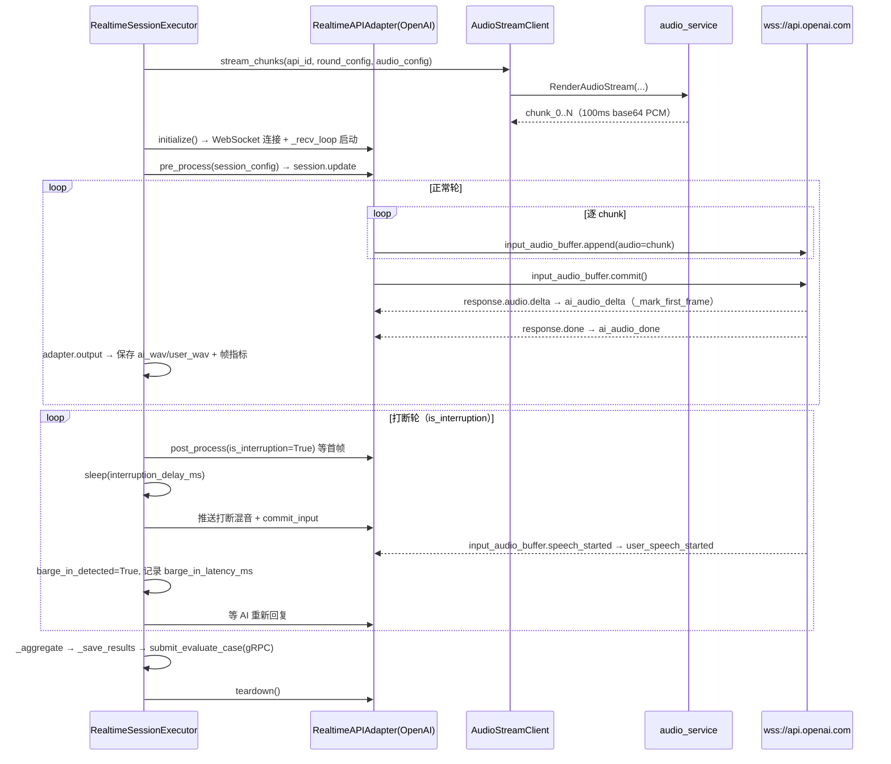
```mermaid
sequenceDiagram
    participant EX as RealtimeSessionExecutor
    participant AD as RealtimeAPIAdapter(OpenAI)
    participant SC as AudioStreamClient
    participant AUD as audio_service
    participant WS as wss://api.openai.com

    EX->>SC: stream_chunks(api_id, round_config, audio_config)
    SC->>AUD: RenderAudioStream(...)
    AUD-->>SC: chunk_0..N（100ms base64 PCM）
    EX->>AD: initialize() → WebSocket 连接 + _recv_loop 启动
    EX->>AD: pre_process(session_config) → session.update
    loop 正常轮
        loop 逐 chunk
            AD->>WS: input_audio_buffer.append(audio=chunk)
        end
        AD->>WS: input_audio_buffer.commit()
        WS-->>AD: response.audio.delta → ai_audio_delta（_mark_first_frame）
        WS-->>AD: response.done → ai_audio_done
        EX->>EX: adapter.output → 保存 ai_wav/user_wav + 帧指标
    end
    loop 打断轮（is_interruption）
        EX->>AD: post_process(is_interruption=True) 等首帧
        EX->>EX: sleep(interruption_delay_ms)
        EX->>AD: 推送打断混音 + commit_input
        WS-->>AD: input_audio_buffer.speech_started → user_speech_started
        EX->>EX: barge_in_detected=True, 记录 barge_in_latency_ms
        EX->>AD: 等 AI 重新回复
    end
    EX->>EX: _aggregate → _save_results → submit_evaluate_case(gRPC)
    EX->>AD: teardown()
```

### 7.2 physical API 用例执行（分布式互斥）

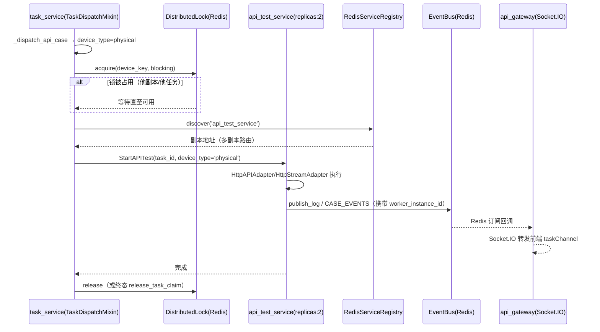
```mermaid
sequenceDiagram
    participant TS as task_service(TaskDispatchMixin)
    participant DL as DistributedLock(Redis)
    participant API as api_test_service(replicas:2)
    participant REG as RedisServiceRegistry
    participant BUS as EventBus(Redis)
    participant GW as api_gateway(Socket.IO)

    TS->>TS: _dispatch_api_case → device_type=physical
    TS->>DL: acquire(device_key, blocking)
    alt 锁被占用（他副本/他任务）
        DL-->>TS: 等待直至可用
    end
    TS->>REG: discover('api_test_service')
    REG-->>TS: 副本地址（多副本路由）
    TS->>API: StartAPITest(task_id, device_type='physical')
    API->>API: HttpAPIAdapter/HttpStreamAdapter 执行
    API->>BUS: publish_log / CASE_EVENTS（携带 worker_instance_id）
    BUS-->>GW: Redis 订阅回调
    GW-->>GW: Socket.IO 转发前端 taskChannel
    API-->>TS: 完成
    TS->>DL: release（或终态 release_task_claim）
```

### 7.3 结果聚合与评估提交

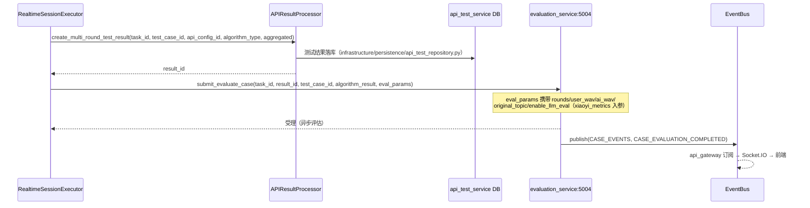
```mermaid
sequenceDiagram
    participant EX as RealtimeSessionExecutor
    participant RP as APIResultProcessor
    participant DB as api_test_service DB
    participant EV as evaluation_service:5004
    participant BUS as EventBus

    EX->>RP: create_multi_round_test_result(task_id, test_case_id, api_config_id, algorithm_type, aggregated)
    RP->>DB: 测试结果落库（infrastructure/persistence/api_test_repository.py）
    RP-->>EX: result_id
    EX->>EV: submit_evaluate_case(task_id, result_id, test_case_id, algorithm_result, eval_params)
    Note over EV: eval_params 携带 rounds/user_wav/ai_wav/<br/>original_topic/enable_llm_eval（xiaoyi_metrics 入参）
    EV-->>EX: 受理（异步评估）
    EV->>BUS: publish(CASE_EVENTS, CASE_EVALUATION_COMPLETED)
    BUS-->>BUS: api_gateway 订阅 → Socket.IO → 前端
```

---

## 八、适配差异清单（V9.7.10 → V9.7.31）

| # | 项 | V9.7.10 | V9.7.31 | 类型 |
|---|----|---------|---------|------|
| 1 | 混音执行位置 | api 进程内 `AudioStreamOrchestrator.chunk_audio` | audio_service `RenderAudioStreamServicer`（server-streaming，100ms base64 chunk） | 下沉（新增） |
| 2 | `RenderAudioStream` proto | 无 | `audio_service.proto` 新增 server-streaming rpc | （新增） |
| 3 | 执行器基座 | 单体 `base_executor.py` | `shared/infrastructure/base_executor/_base.py`：`BaseExecutor = ControlMixin+LoggingMixin+ParamsMixin+ResultsMixin+DbMixin` | 迁移 |
| 4 | 评估调用 | 进程内 `evaluation_service.evaluate_case` | gRPC `submit_evaluate_case`（`shared/clients/_grpc_task_data.py`） | gRPC 化 |
| 5 | 日志/事件推送 | `log_and_emit` 进程内直推 | `EventBus`（EventChannel/EventType 枚举）→ api_gateway → Socket.IO | 事件化（新增发布器） |
| 6 | 停止/暂停 | `get_task_events(task_id)` 进程内 Event | BaseExecutor ControlMixin 线程本地态 + 适配器注入回调 | 适配说明 |
| 7 | 任务类型判断 | `task.type == 'api'` 裸字符串 | `TestType`/`DeviceType` 枚举；`_dispatch_api_case` 内按 device_type 二次分派 | 枚举化（新增） |
| 8 | realtime 表达 | 方案含 realtime 专类 | `DeviceType.WEBSOCKET_API`，**不引入 'realtime_api'**；废弃 task.type/test_type | （新增） |
| 9 | `API` 表 | 单体 models.py | `api_models.py` 新增 `device_type/adapter_class/audio_config/output_types`（+ `rms_spl_mapping_id`） | （新增）列 |
| 10 | `StartAPITestRequest` | 仅 `task_id` | 新增 `device_type` 字段 | （新增） |
| 11 | ApiRmsSplMapping | 单体 SQLAlchemy 模型 + Service 类 | DDD 五层：聚合/值对象/命令/PO/仓储（3.1.2） | 重构落位 |
| 12 | 归一化事件 | 字符串字面量（'ai_audio_delta' 等 11 种） | `RealtimeEventType` 枚举 | （新增） |
| 13 | 流式 HTTP | `HttpAPIAdapter._parse_response` 内 all_responses 聚合 | `HttpStreamAdapter` 独立类（自流式分支拆出） | （新增） |
| 14 | physical 互斥 | 单进程内天然串行 | `DistributedLock`（Redis）+ `release_task_claim` | （新增） |
| 15 | 密钥管理 | `os.environ.get('OPENAI_API_KEY')` | 密钥链 `case_config → meta → env OPENAI_API_KEY` 配置化 | 适配说明 |
| 16 | SPLMappingService | 按 device 隐式取映射 | 显式 `spl_to_gain(mapping_id, target_spl)` | 适配说明 |
| 17 | 前端枚举 | — | `enums.ts` 新增 `DeviceType/OutputType/CalibrationStatus`（as const 风格） | （新增） |
| 18 | 前端通道 | 直连单体 WebSocket | api_gateway Socket.IO taskChannel（6.3 事件表） | 适配说明 |

---

> 本文与《02_架构设计.md》《07_流式推送与结果获取.md》配套；实现顺序遵循"先重构（shared 基座 / PO 归位 / 枚举入 shared），再管消费方（执行器路由 / 前端）"。

