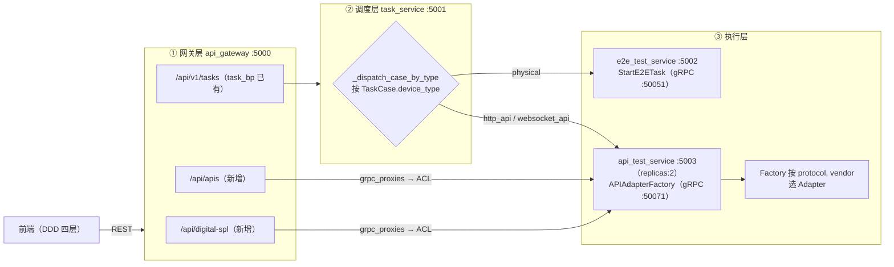
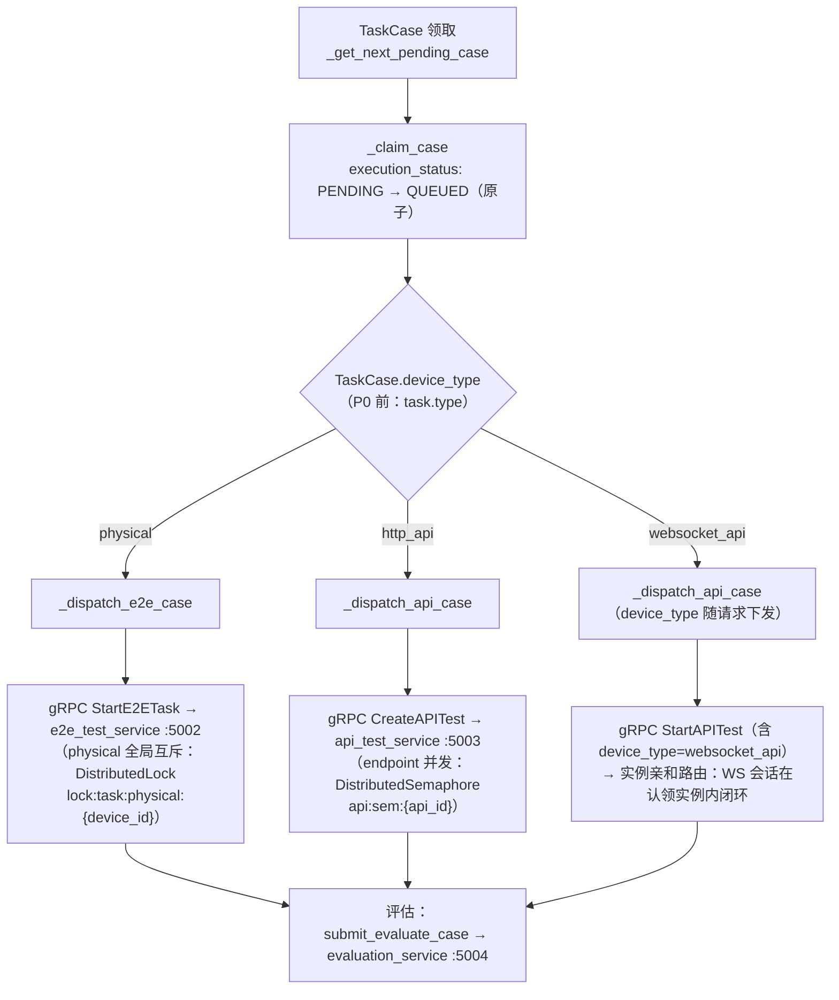
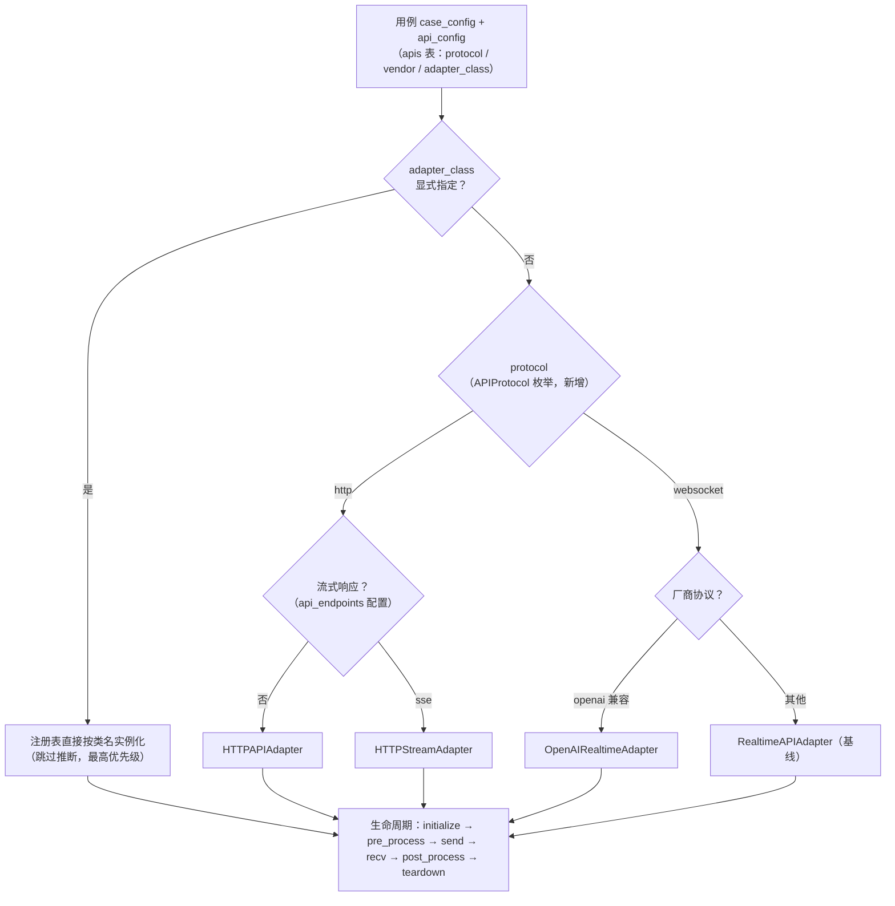

# 路由与废弃（V9.7.31 微服务版）

> **版本**：V9.7.31 v1.0（2026-09-10）
> **适配自**：V9.7.10《05_路由与废弃》v3.0 / v3.1
> **架构基线**：DDD + CQRS + 微服务 + Redis 分布式（无 MQ）

【适配说明】本文档由 V9.7.10 单体版《05_路由与废弃》v3.0/v3.1 适配而来。**设计语义不变**：`device_type` 三层路由（网关 → 调度 → 执行）、`task.type` / `test_type` 废弃、Adapter 注册表路由、迁移时间线。**落位按 V9.7.31 服务边界重组**：调度路由落 task_service（gRPC 跨服务分发），执行路由落 api_test_service（replicas:2），网关路由落 api_gateway（FastAPI `/api/v1/*` 蓝图）。`TaskType` **不新增** `'realtime_api'`——Realtime 语义由 `device_type='websocket_api'` 承载。文中端口、路径、类名均对照 V9.7.31 真实代码核验（`task_service/core/execution_engine/mixins/task_dispatch.py`、`api_test_service/infrastructure/persistence/models/api_models.py`、`shared/proto/*.proto`、`frontend/src/domain/enums.ts` 等）。

---

## 一、路由总表（三层路由）

### 1.1 三层路由总表

| 层 | 职责 | 路由依据 | V9.7.31 落位 | 状态 |
|----|------|---------|--------------|------|
| ① 网关层 | REST 入口分发、协议转换（camelCase ↔ snake_case） | URL 前缀（`/api/digital-spl`、`/api/apis`） | `api_gateway/routes/` + `application/services/` + `infrastructure/grpc_proxies/` | 数字 SPL / API 扩展路由**（新增）** |
| ② 调度层 | 用例级分发（physical / http_api / websocket_api） | `TaskCase.device_type`（P0 迁移自 `task.type`） | `task_service/core/execution_engine/mixins/task_dispatch.py` | 现按 `task.type` 判定，**P0 改造** |
| ③ 执行层 | Adapter 选择（协议 × 供应商） | `protocol` + `vendor`（`adapter_class` 显式覆盖优先） | `api_test_service/infrastructure/adapters/`（P1 新建，自 `api_adapter_service/adapters/` 迁入） | 注册表**（新增）** |



### 1.2 网关层路由表（新增）

V9.7.31 网关为 **FastAPI**（非 Flask Blueprint），路由注册于 `api_gateway/app.py::include_router`（现有 17 个 router，前缀统一 `/api/v1/*`，见 `app.py:151-167`）。本设计新增 / 扩展：

| 路由 | 方法 | 职责 | 蓝图文件 | 下游 gRPC | 状态 |
|------|------|------|---------|-----------|------|
| `/api/digital-spl` | GET / POST / PUT / DELETE | **数字 API 的 RMS→SPL 映射**（`api_rms_spl_mappings` 表）CRUD、`/{id}/calibrate` 多点校准、`/{id}/history`、`/{id}/calibration-data` | `routes/digital_spl_bp.py`（新增，仿照既有 `spl_bp.py`） | `api_test_service` APITestService 配置族扩展：`CreateApiRmsSplMapping` / `UpdateApiRmsSplMapping` / `ListApiRmsSplMappings` / `CalibrateApiRmsSplMapping`（新增 RPC） | **（新增）** |
| `/api/apis` | GET / POST / PUT / DELETE + `/{id}/health` + `/{id}/test-connection` | API 管理路由表，扩展字段：`device_type` / `adapter_class` / `audio_config` / `output_types` / `rms_spl_mapping_id` | `routes/api_bp.py`（**扩展现有**，现状仅有 API 配置 CRUD + 连通性测试） | `api_test_service.proto` 既有 `CreateAPIConfig` / `UpdateAPIConfig` / `ListAPIConfigs` / `TestAPIConnection` | **（新增字段）** |

【适配说明：现有网关已存在 `routes/api_bp.py`（挂 `/api/v1/apis`，API 配置 CRUD）与 `routes/spl_bp.py`（挂 `/api/v1/spl`，**物理设备侧** `spl_mappings` 管理，含 `/by-device/{device_id}` 与校准族接口）。本表新增的 `/api/digital-spl` 与之**对称**：`/api/v1/spl` 管设备声压映射，`/api/digital-spl` 管被测 API 的数字声压映射，二者共用 `CalibrationStatus` 枚举与校准交互模式。生产落地时若沿用 `/api/v1/` 统一前缀，则为 `/api/v1/digital-spl`；路径语义以本表为准。权限沿用 `require_permission` 模式（`spl:read/create/update/delete` → 新增 `digital_spl:*` 权限码，配置化）。】

### 1.3 与源文档（V9.7.10 v3.1）的差异对照

| 源文档章节 | 本文档 | 适配要点 |
|-----------|--------|---------|
| 六、6.1 ExecutionEngine 路由分发 | 二、2.1 ~ 2.3 | 进程内函数调用 → task_service 判定 + gRPC 跨服务分发 |
| 六、6.2 APISessionExecutor 改造 | 二、2.4 | `api_adapter_factory.get_adapter`（进程内）→ `APIAdapterFactory` 注册表路由（执行服务内） |
| 七、废弃清单 | 三、3.1 | 按微服务边界重排，补充分布式化废弃项（进程内锁 / 进程内混音 / 进程内日志推送） |
| 七a、数据库改动 | 三、3.2 ~ 3.3 | 表归属按服务划分（`apis` → api_test_service 域，`task_case_relations` → task_service 域） |
| 八、实施阶段 | 四 | P0~P3 与《02_架构设计.md》第十一章对齐 |

---

## 二、路由决策逻辑

### 2.1 调度层：device_type 路由决策表

判定组件：`task_service/core/execution_engine/mixins/task_dispatch.py`。

| `TaskCase.device_type` | 分派方法 | 下游调用（gRPC） | 执行服务 | 执行器 |
|------------------------|---------|-----------------|---------|--------|
| `physical` | `_dispatch_e2e_case` | `ExecutionService.StartE2ETask`（:50051） | e2e_test_service | `BaseExecutor` 五 Mixin（协同 device_service :50053 / audio_service :50052） |
| `http_api` | `_dispatch_api_case` | `APITestService.CreateAPITest`（:50071） | api_test_service（replicas:2） | `api_session_executor`（HTTP 多轮会话，单轮 = rounds=[1] 特例） |
| `websocket_api` | `_dispatch_api_case` | `APITestService.StartAPITest`（:50071，`StartAPITestRequest` 增 `device_type` / `device_id`——（新增）） | api_test_service | Realtime 会话执行器（WS 长连接**实例内闭环**，见《02_架构设计.md》5.2） |

【适配说明：现核验 `task_dispatch.py` 的 `_dispatch_case_by_type`（第 89 行）仍按 `task.type == 'api'` 魔法字符串判定 → `_dispatch_api_case`，否则 `_dispatch_e2e_case`；`_handle_no_pending_case`（第 35 行）同样依赖 `task.type != 'api'`。`_dispatch_api_case` / `_dispatch_e2e_case` 均先经 `_claim_case` 原子占用（`execution_status: PENDING → QUEUED`）再执行——该占位语义保留。P0 改造为按 `TaskCase.device_type` 三值判定，判定值取自 `DeviceType` 枚举（`shared/models/common_enums.py`，**待新增**），消灭魔法字符串。下游调用现状核验于 `task_service/core/execution_engine/mixins/case_execution.py`：`_execute_api_case`（第 40 行）经 `shared/clients/grpc_clients.get_api_test_service_stub` 调 `CreateAPITest`；`_execute_e2e_case`（第 127 行）经 `grpc_helpers._execute_e2e_case_via_grpc` 调 `StartE2ETask`。随契约演进，API 分发收敛到 `StartAPITest`（携带 device_type，见 2.3）。】

### 2.2 调度层决策流程图



### 2.3 调度层改造（task_dispatch.py：现状 → P0 目标态）

```python
# task_service/core/execution_engine/mixins/task_dispatch.py（P0 目标态）
# 现状：_dispatch_case_by_type 以 task.type == 'api' 判定（魔法字符串，源码第 91 行）

def _dispatch_case_by_type(self, task_id, task, tc_rel, session):
    """按 TaskCase.device_type 分发用例执行（废弃 task.type 判定）"""
    device_type = tc_rel.device_type          # P0 新增列，取值 ∈ DeviceType 枚举
    if device_type == DeviceType.PHYSICAL.value:
        self._dispatch_e2e_case(task_id, task, tc_rel, session)
    elif device_type in (DeviceType.HTTP_API.value, DeviceType.WEBSOCKET_API.value):
        self._dispatch_api_case(task_id, tc_rel, session)   # 内部按 device_type 组装 gRPC 请求
    else:
        # device_type 缺失兜底：记 ERROR 日志并经 EventBus 广播，置 FAILED（禁止静默回退 physical）
        ...
```

配套契约改造（`shared/proto/api_test_service.proto`）：

```protobuf
// StartAPITestRequest 现状仅 { string task_id = 1; }（源码第 46-48 行）
// （新增）device_type / device_id 下发，调度层路由决策随请求传递
message StartAPITestRequest {
  string task_id = 1;
  string device_type = 2;   // （新增）physical / http_api / websocket_api
  int32 device_id = 3;      // （新增）TaskCase.device_id
}
```

【适配说明：`CreateAPITestRequest` 现为 `{ task_id, test_config }`（test_config 为 JSON 字符串，配置经序列化整体下发）；调度侧 `_execute_api_case` 现调 `CreateAPITest`，与《02_架构设计.md》7.2 一致，随契约演进收敛到 `StartAPITest`。`websocket_api` 路径不新增 `TaskType` 枚举成员——`shared/models/common_enums.py` 现无 `TaskType` 类（任务类型仅存于 `Task.type` 列与前端 `enums.ts` 的 `TaskType` type 联合），本设计**维持不引入**，Realtime 语义由 `DeviceType.WEBSOCKET_API` 承载。】

### 2.4 执行层：APIAdapterFactory 注册表路由

执行服务内（api_test_service），Adapter 选择依据 `protocol` × `vendor`，`adapter_class` 显式指定时**优先**：



落位与注册表形态：

| 组成 | V9.7.31 落位 | 状态 |
|------|--------------|------|
| `APIAdapterFactory`（注册表 + 推断） | `api_test_service/infrastructure/adapters/factory.py` | **（新增，P1）** |
| `BaseAPIAdapter`（生命周期模板） | `api_test_service/infrastructure/adapters/base.py` | **（新增，P1）** |
| HTTP / SSE / Realtime 适配实现 | 同目录，按 `APIProtocol` 分型 | **（新增，P1）** |
| 迁移来源 | `api_adapter_service/adapters/`（现核验：`base.py` / `factory.py` / `http_adapter.py` / `sse_adapter.py` / `mock_adapter.py` / `qwen_adapter.py` / `volc_ast_adapter.py`）+ `api_adapter_service/infrastructure/adapters/adapter_registry.py` | P3 随整服务下线迁入 |

【适配说明：V9.7.10 v3.1 的 `api_adapter_factory.get_adapter(api_config, ...)` 为执行器进程内直接调用；V9.7.31 中 Factory 与 Adapter 同在 api_test_service 内（仍是进程内调用，不跨服务），跨服务边界止于 task_service → api_test_service 的 gRPC。`adapter_class` 显式覆盖来自 `apis.adapter_class` 列（（新增），见 3.2），保证厂商私有协议（如 `volc_ast`）可绕过推断直接绑定；`vendor` 推断规则全部配置化于 Adapter 注册表，禁止 if-else 魔法字符串链。】

### 2.5 Realtime（websocket_api）路由附加约束

1. **实例内闭环**：WS 会话由认领实例独占，`task_id → 实例` 绑定经 `RedisStore`（`shared/utils/redis_pubsub.py:203`）落 Redis；`StopAPITest` / `GetAPITestStatus` 经 `RedisServiceRegistry`（`shared/utils/service_registry.py`）亲和路由到持有实例；
2. **音频流供给**：测试音频不再由消费侧（执行器）读取文件自行混音切片，统一经 `audio_service` 的 `RenderAudioStream`（server-streaming，**（新增）** RPC，`shared/proto/audio_service.proto` 现仅有 `AudioService` / `PlaybackService` / `AudioConfigService`，无该 RPC）流式下发，增益换算收敛在 `audio_service/infrastructure/audio/spl_service.py::spl_to_gain`；
3. **互斥与并发**：physical 设备全局互斥走 Redis `DistributedLock`（`shared/utils/distributed_coordinator.py`）；同 endpoint 并发上限走 `DistributedSemaphore`（`api:sem:{api_id}` 已实现于 `api_test_service/core/api_concurrency_manager.py`），上限值入 `shared/config/concurrency_config.json`。

---

## 三、废弃清单

### 3.1 废弃清单总表

| # | 废弃项 | 替代方案 | 影响范围（真实路径） | 阶段 |
|---|--------|---------|---------------------|------|
| 1 | `Task.type` 字段语义（`test_tasks.type`，现值 `api`/`e2e`；`task_models.py:35`） | `TaskCase.device_type` 取代——路由依据从任务级迁至用例级 | `task_service/infrastructure/persistence/models/task_models.py`；`task_service/core/execution_engine/mixins/task_dispatch.py`（`_dispatch_case_by_type` / `_handle_no_pending_case` 两处 `task.type` 判定）；task_service CQRS 读写侧 | P0 迁移 / P3 删列 |
| 2 | `TestCase.test_type` 字段语义（用例区分 api/e2e） | 用例是纯数据（case_config + algorithm_params），不区分类型；`TestType` 枚举（`shared/models/common_enums.py:39`、前端 `frontend/src/domain/enums.ts:58`）随之废弃 | task_service 域用例仓储与查询；api_gateway `routes/testcase_bp.py` 过滤参数；前端用例列表筛选 | P0 迁移 / P3 删列 |
| 3 | `TaskType` 增加 `'realtime_api'`（V9.7.10 方案） | **不引入**。Realtime 语义由 `device_type='websocket_api'` 承载；前端 `enums.ts` 的 `TaskType` type 联合（第 24 行，现核验无 `'realtime_api'`）维持不变 | `shared/models/common_enums.py`、`frontend/src/domain/enums.ts` | 不执行（决策项） |
| 4 | `api_adapter_service`（:5008）**整服务** | 能力并入 api_test_service `infrastructure/adapters/`（Factory + Adapter 迁移）；网关 `grpc_proxies` 切换调用方 | `api_adapter_service/`（`adapters/` 7 个适配文件、`infrastructure/adapters/adapter_registry.py`、`interfaces/grpc/`、`shared/proto/adapter_service.proto`）、`api_gateway/infrastructure/grpc_proxies/`、`run_all.py`、`docker/docker-compose.yml`、`shared/config/service_ports.py` | P3 下线 |
| 5 | 进程内设备互斥 dict（`running_e2e` / `stop_flags` / `pause_flags` 等 ExecutionEngine 内存工作台） | Redis `DistributedLock`（`lock:task:physical:{device_id}`）+ `set_flag` / `clear_flag` / `is_flag_set`（`shared/utils/distributed_coordinator.py`，`RedisKeyPrefix` 枚举扩充） | `task_service/core/execution_engine/__init__.py`、`mixins/scheduler.py`、`mixins/case_execution.py`；api_test_service `_APIEngineAdapter` 内存实现 | P2 |
| 6 | 消费侧混音（执行器读音频文件自行混音/切片，V9.7.10 单体行为） | `audio_service` `RenderAudioStream`（server-streaming，**（新增）** RPC）+ `spl_to_gain` 增益换算收敛 audio_service | `shared/proto/audio_service.proto`、`audio_service/infrastructure/audio/playback_orchestrator.py`、`audio_service/infrastructure/audio/spl_service.py`；api_test_service 音频 ACL 仓储（（新增），`infrastructure/acl/`） | P2 |
| 7 | 直接 `log_and_emit`（进程内日志回调直推前端） | `EventBus.publish`（`shared/utils/redis_pubsub.py:107`，`EventChannel`：`task_events` / `case_events` / `device_events` / `report_events` / `config_events`）→ api_gateway `app.py::_start_redis_subscriber` 订阅 `task_logs` / `task_progress` → Socket.IO 转发（`'/'` 推 `task_progress`，`'/ws/logs'` 推 `task_log`） | 全部执行器日志出口（`shared/infrastructure/base_executor/_base.py` LoggingMixin）、`api_gateway/websocket/socketio_server.py` | P1（随执行器迁移） |
| 8 | 旧轮询取结果接口（单一 `GetAPITestStatus` 轮询拉取全量结果） | frame / summary 双通道：帧记录 `frame_results`（过程证据，`ResultStorage` 落对象存储，路径 `api-test-results/<task_id>/<session_id>/summary.json`）+ 汇总结论 `AdapterOutput`（`DbMixin._save_result` 落库，评估经 gRPC `EvaluateCase`） | `shared/proto/api_test_service.proto`（GetAPITestStatus）、`api_test_service/infrastructure/oss/result_storage.py`、`shared/infrastructure/base_executor/_db_mixin.py`；详见《07_流式推送与结果获取.md》第五章 | P2 |
| 9 | 过渡期执行器文件（`api_test_service/core/api_executor.py` / `api_session_executor.py` / `api_task_runner.py` / `session_context.py`） | 按 DDD 迁移至 `application/services/`（api_session_executor / realtime_session_executor），迁移后 core 侧退役 | `api_test_service/core/`（现核验 7 文件）→ `api_test_service/application/services/` | P1 迁移 / P1 末退役 |

【适配说明：V9.7.10 源文档的 `api_driver.py`（APIDriver）与 `api_adapter.base_url` 配置项，在 V9.7.31 语境下对应 `api_adapter_service` 的远程 Adapter 调用链路（`adapter_service.proto` + 网关 grpc_proxies），随第 4 项整服务下线一并消除，不单列。V9.7.31 中 `api_test_service/core/` 现无 `api_driver.py`（已核验），故不虚构该文件。】

### 3.2 数据库改动（废弃项的落库配套）

#### `apis` 表（api_test_service 域，`api_test_service/infrastructure/persistence/models/api_models.py`）

现核验 API 类已含：`vendor` / `api_url` / `meta`(JSON) / `api_endpoints`(JSON) / `max_process` / `max_timeout` 等；**缺以下四列，标（新增）**：

| 改动 | 说明 |
|------|------|
| 新增 `device_type` 列（**（新增）**） | 被测对象类型（`physical` / `http_api` / `websocket_api`，`DeviceType` 枚举值），Adapter 分型与调度路由的数据源头 |
| 新增 `adapter_class` 列（**（新增）**） | 显式指定 Adapter 类名，`APIAdapterFactory` 注册表最高优先级（见 2.4） |
| 新增 `audio_config` 列 JSON（**（新增）**） | `sample_rate` / `bit_depth` / `channels` / `format` / `chunk_duration_ms` |
| 新增 `output_types` 列 JSON（**（新增）**） | 声明输出类型，值域 `OutputType` 枚举（`AUDIO` / `TEXT` / `VIDEO` / `IMAGE`，**待新增**） |
| 新增 `rms_spl_mapping_id` 列（**（新增）**） | 外键 → `api_rms_spl_mappings.id`，当前默认 RMS→SPL 映射 |

```sql
ALTER TABLE apis ADD COLUMN device_type VARCHAR(20);            -- （新增）
ALTER TABLE apis ADD COLUMN adapter_class VARCHAR(100);         -- （新增）
ALTER TABLE apis ADD COLUMN audio_config JSON;                  -- （新增）
ALTER TABLE apis ADD COLUMN output_types JSON;                  -- （新增）
ALTER TABLE apis ADD COLUMN rms_spl_mapping_id INT;             -- （新增）
ALTER TABLE apis ADD CONSTRAINT fk_api_rms_spl_mapping
    FOREIGN KEY (rms_spl_mapping_id) REFERENCES api_rms_spl_mappings(id);
```

#### `task_case_relations` 表（task_service 域，`task_models.py::TaskCase`）

| 改动 | 说明 |
|------|------|
| 新增 `device_type` 列 | 调度路由判定依据（`physical` / `http_api` / `websocket_api`），迁移自 `task.type` |
| 新增 `device_id` 列 | 关联被测对象 ID（`playback_devices.id` 或 `apis.id`，按 `device_type` 区分）；回填来源为 `task_device_relations.device_id`（`TaskDevice`，已存在）与 `task_api_relations.api_id`（`TaskAPI`，已存在） |

【适配说明：现核验 `TaskCase` 类体（`task_models.py:84-101`）无 `device_type` / `device_id` 列，`device_id` 现存于 `TaskDevice`（task_device_relations）。P0 增列后路由判定读 `tc_rel.device_type`，不再查关联表，也不读 `task.type`。】

```sql
ALTER TABLE task_case_relations ADD COLUMN device_type VARCHAR(20);
ALTER TABLE task_case_relations ADD COLUMN device_id INT;
ALTER TABLE task_case_relations ADD INDEX idx_tc_rel_device (device_type, device_id);
```

#### 新增表：`api_rms_spl_mappings`（与设备侧 `spl_mappings` 对称，关联被测 API）

```sql
CREATE TABLE api_rms_spl_mappings (
    id                 INT AUTO_INCREMENT PRIMARY KEY,
    name               VARCHAR(100) NOT NULL,
    description        TEXT,
    api_id             INT NOT NULL,
    target_spl         FLOAT,                 -- 目标声压级 (dB SPL)
    digital_gain       FLOAT,                 -- 对应数字增益 (dB)
    calibration_status VARCHAR(20) DEFAULT 'uncalibrated',  -- CalibrationStatus 枚举值（新增）
    calibration_data   JSON,                  -- 多点校准 [{spl, gain, measured_rms}]
    created_at         DATETIME DEFAULT (UTC_TIMESTAMP() + INTERVAL 8 HOUR),
    updated_at         DATETIME DEFAULT (UTC_TIMESTAMP() + INTERVAL 8 HOUR)
                          ON UPDATE (UTC_TIMESTAMP() + INTERVAL 8 HOUR),
    FOREIGN KEY (api_id) REFERENCES apis(id),
    INDEX idx_rms_spl_api (api_id)
);
```

#### 删列清理（P3，代码迁移完成后执行）

```sql
ALTER TABLE test_cases DROP INDEX idx_test_case_test_type;
ALTER TABLE test_cases DROP COLUMN test_type;    -- 废弃项 #2
ALTER TABLE test_tasks DROP COLUMN type;         -- 废弃项 #1
```

### 3.3 数据迁移（P0 回填脚本）

```sql
-- 1. 回填 task_case_relations.device_type / device_id（来源：task_api_relations / task_device_relations）
UPDATE task_case_relations tcr
INNER JOIN task_api_relations tap ON tcr.task_id = tap.task_id
SET tcr.device_type = 'http_api', tcr.device_id = tap.api_id;

UPDATE task_case_relations tcr
INNER JOIN task_device_relations tdr ON tcr.task_id = tdr.task_id
SET tcr.device_type = 'physical', tcr.device_id = tdr.device_id
WHERE tcr.device_type IS NULL;

-- 2. 按 api_endpoints 的 url 前缀识别 websocket 类型
UPDATE task_case_relations tcr
SET tcr.device_type = 'websocket_api'
WHERE tcr.device_type = 'http_api'
  AND tcr.device_id IN (
    SELECT id FROM apis
    WHERE JSON_EXTRACT(api_endpoints, '$[0].url') LIKE 'ws%'
  );

-- 3. task.type='merged' 的合并任务不回填 device_type；
--    合并报告逻辑改为按 TaskCase.device_type 聚合（report_service 侧改造）
```

【适配说明：回填后 `device_type` 值一律写入 `DeviceType` 枚举值字面量，读取侧经 `shared/utils/status_constants.py` 同款 frozenset / 枚举判定，禁止散落字符串比较；`websocket` 前缀识别规则（`ws%`）配置化于迁移脚本常量，不在业务代码中复现。】

### 3.4 枚举配套（废弃项的替代载体）

| 枚举 | 成员 | 后端落点 | 前端镜像 | 状态 |
|------|------|---------|---------|------|
| `DeviceType` | `PHYSICAL` / `HTTP_API` / `WEBSOCKET_API` | `shared/models/common_enums.py`（**（新增）**，现核验仅有 `ReportStatus` / `TaskStatus` / `ReportType` / `TestType` / `FieldType` / `ViewMode` / `RedisKeyPrefix` / `EvalTaskStatus`） | `frontend/src/domain/enums.ts`（**（新增）**，现核验无 `DeviceType` / `OutputType` / `CalibrationStatus`） | P0 |
| `APIProtocol` | `HTTP` / `WEBSOCKET` | 同上 | 同上 | P0 |
| `OutputType` | `AUDIO` / `TEXT` / `VIDEO` / `IMAGE` | 同上 | 同上 | P0 |
| `CalibrationStatus` | `CALIBRATED` / `UNCALIBRATED` | 同上 | 同上 | P0 |
| `RealtimeEventType` | 11 个归一化事件（见《07》文档） | 同上 | — | P1 |
| `TestType`（废弃） | `API` / `E2E` | `common_enums.py:39` 随 `test_type` 删列退役 | `enums.ts:58` `TestType` 常量随之删除 | P3 |
| `RedisKeyPrefix`（扩充） | 增 `LOCK_TASK_PHYSICAL`（`lock:task:physical:`）等锁/信号量前缀 | `common_enums.py:65` | — | P2 |

---

## 四、迁移时间线（P0 ~ P3）

与《02_架构设计.md》第十一章实施阶段计划保持一致：

```
P0 —— 数据模型 + 枚举 + 契约（先重构，再管消费方）
 ├── shared/models/common_enums.py 新增 DeviceType / APIProtocol / OutputType / CalibrationStatus，
 │    RedisKeyPrefix 扩充锁前缀；TestType 标记 @deprecated
 ├── task_models.py::TaskCase 增列 device_type / device_id + 回填迁移脚本（3.3）
 ├── api_models.py::API 增列 device_type / adapter_class / audio_config / output_types / rms_spl_mapping_id
 │    + 新建 api_rms_spl_mappings 表
 ├── shared/proto/api_test_service.proto：StartAPITestRequest 增 device_type / device_id（（新增））；
 │    APITestService 增 ApiRmsSpl CRUD RPC（（新增））
 ├── shared/proto/audio_service.proto：RenderAudioStream（server-streaming）（（新增））
 ├── task_dispatch.py::_dispatch_case_by_type 改按 TaskCase.device_type 三值判定（2.3）
 └── frontend/src/domain/enums.ts 镜像新增（TaskType 不加 'realtime_api'）

P1 —— 执行器与 Adapter 体系（api_test_service DDD 落位）
 ├── application/services/api_session_executor.py / realtime_session_executor.py 新建（自 core/ 迁移）
 ├── infrastructure/adapters/ 新建：APIAdapterFactory + BaseAPIAdapter 生命周期
 │    （initialize → pre_process → send → recv → post_process → teardown），
 │    按 protocol, vendor 注册表路由，adapter_class 显式覆盖（2.4）
 ├── 执行器日志出口切换 EventBus（RedisPubSub.publish_log / publish_progress），废弃 log_and_emit 直推
 ├── Realtime 会话绑定元数据落 Redis（RedisStore，task_id → 实例）
 └── core/ 过渡执行器退役（废弃项 #9）

P2 —— Realtime + 流式 + 分布式协同
 ├── RenderAudioStream 落地：audio_service 流式切片下发 + spl_to_gain 换算收敛（废弃项 #6）
 ├── frame / summary 双通道：ResultStorage 落盘 frame_results + AdapterOutput 落库，
 │    GetAPITestStatus 轮询降级为兜底（废弃项 #8）
 ├── physical 互斥升级 Redis DistributedLock（lock:task:physical:{device_id}）（废弃项 #5）
 ├── case_execution.py::_update_endpoint_health 由进程内 dict 改 DistributedSemaphore
 │    （sem:api:endpoint:{host}，上限入 concurrency_config.json 新增 max_per_endpoint）
 └── replicas:2 全链路联调（调度认领、孤儿收养、亲和路由）

P3 —— 下线与清理
 ├── api_adapter_service（:5008）整服务下线：adapters/ 与 adapter_registry.py 迁入
 │    api_test_service/infrastructure/adapters/ 后删除服务目录（废弃项 #4）
 ├── 网关 grpc_proxies 切换调用方；shared/proto/adapter_service.proto 废弃；
 │    run_all.py / docker/docker-compose.yml / shared/config/service_ports.py 移除相关条目
 │    （顺带消除 api_adapter_service 容器内 8000 → 注册 5008 的端口不一致遗留）
 ├── 数据库清理：DROP COLUMN test_cases.test_type / test_tasks.type（3.2）
 ├── 删除 TestType 枚举（后端 + 前端镜像）与全量 task.type / test_type 消费点
 └── 前端：用例列表移除 test_type 筛选；任务路由展示改读 deviceType（camelCase Domain）
```

---

## 附录：与 V9.7.10 源文档的废弃决策差异速查

| 决策点 | V9.7.10 v3.1 | V9.7.31 v1.0 | 理由 |
|--------|--------------|--------------|------|
| Realtime 任务类型 | 引入 `task.type='realtime_api'` | **不引入**，由 `device_type='websocket_api'` 取代 | 任务类型与被测对象类型解耦；避免 TaskType 与 DeviceType 双轴冗余 |
| 路由判定位置 | ExecutionEngine 进程内 `_execute_single_or_multi` | task_service `_dispatch_case_by_type` + gRPC 分发 | 微服务边界；调度中枢独立伸缩 |
| APIExecutor 编排层 | 废弃删除 | core 过渡实现 P1 迁移后退役 | 执行器归位 application/services/ |
| Adapter 微服务 | `api_adapter_service` 已是替代方案 | 反向收敛：整服务下线并入 api_test_service | 减少一跳 gRPC；Adapter 协议细节收敛于执行服务 Infrastructure 层 |
| 设备互斥 | 未涉及（单体进程内） | Redis DistributedLock + 枚举化 key | 多副本部署正确性 |
| 日志推送 | 进程内 log_and_emit | EventBus → 网关 → Socket.IO | 跨进程事件驱动，无 MQ |
| 结果获取 | 单轮询接口 | frame / summary 双通道 | 过程证据与评估结论分离，大字段落盘 |
