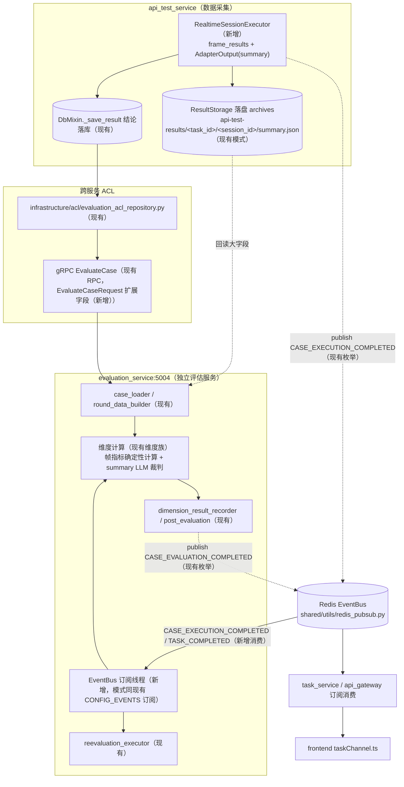
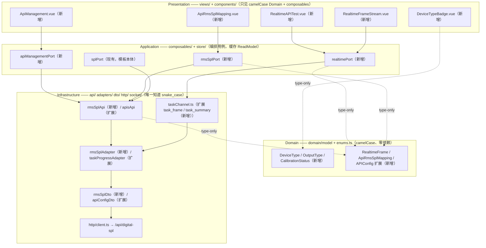

# 06 评估与前端

| 项 | 内容 |
| --- | --- |
| 版本 | v1.0（V9.7.31 适配版，2026-09-10，适配自 V9.7.10《06_评估与前端》v3.0/v3.1） |
| 架构基线 | DDD + CQRS + 微服务 + Redis 分布式（服务间 gRPC + Redis EventBus，无 MQ） |
| 上游索引 | 《Realtime_API_Adapter方案与UseCase文档.md》配套文档清单 · 第 6 篇 |
| 服务落位 | evaluation_service:5004（独立评估服务，EventBus 订阅消费）/ api_test_service:5003（RealtimeSessionExecutor 执行 + 采集）/ audio_service gRPC:50052（SPL 增益供给）/ task_service:5001（device_type 分发）/ api_gateway:5000（/api/digital-spl 蓝图，新增）/ frontend（DDD 四层） |

> 【适配说明】V9.7.10 为单体架构，评估计算（`eval_server` xiaoyi_metrics）与前端（`shared/types` + `utils/api.ts`）同进程同仓；V9.7.31 拆分后，评估独立为 evaluation_service:5004，评估入参经跨服务 gRPC `EvaluateCase` 提交、事件经 Redis EventBus 通知；前端按用户 DDD 四层规则重构（views/components → composables/store → domain → infrastructure），snake_case 唯一收敛在 Infrastructure。设计语义不变：评估维度族、打断口径、三页面对称、SPL 映射。不新建服务、不引入 MQ。

---

## 一、三种执行模式对比

| 维度 | E2E 设备测试（physical） | API 非实时（http_api） | API 流式（http_api + stream） | Realtime 流式（websocket_api） |
|------|-------------|------------|----------|---------------|
| 调度分发 | task_service `task_dispatch` 按 `device_type='physical'` → e2e_test_service | → api_test_service | → api_test_service | → api_test_service |
| 执行服务落位 | `e2e_test_service/core/e2e_service.py`（现有） | `api_test_service/core/`（现有） | `api_test_service/core/`（现有） | `api_test_service/application/services/realtime_session_executor.py`（**新增**） |
| 传输 | 物理播放 + PCM 抓取 | HTTP POST | SSE 流式 | WebSocket 全双工流 |
| 音频 | 文件级 | 文件级 | 100ms chunk 流式 | 100ms chunk 流式 |
| 混音 | `PlaybackOrchestrator`（audio_service，现有） | 整段混音（执行中一次性混好整段，`RenderAudioFile` unary 整文件返回后 POST，见《08_混音与SPL映射.md》） | `RenderAudioStream`（**新增**，gRPC server-streaming） | `RenderAudioStream`（**新增**） |
| SPL 映射 | `audio_service/infrastructure/audio/spl_service.py` `spl_to_gain`（设备侧，现有） | `RmsSplService.spl_to_gain(api_id)`（api_test_service，**新增**） | `RmsSplService.spl_to_gain(api_id)`（api_test_service，**新增**） | 同左 |
| AI 说话检测 | PCM RMS 轮询 | 不需要 | SSE 事件驱动 | WS 归一化事件驱动（`RealtimeEventType`，**新增**枚举） |
| 打断检测 | RMS + sleep 延迟 | 不支持 | SSE 事件 | `user_speech_started` / `response_cancelled`（barge-in 检测窗口） |
| 多轮 | case 模式连续通话 | HTTP session_id | HTTP session_id | 同一 WebSocket 连接 |
| 噪声/干扰 | 物理音箱播放 | 混入完整音频（整段混音后整文件上传） | 混音后流式推送 | 混音后流式推送 |
| 延迟测量 | 录屏首帧 + 时间戳 | HTTP 响应时间 | SSE 首事件时间戳 | 事件时间戳精确到 ms（`first_frame_ms`） |
| 适配层 | `device_driver`（e2e_test_service） | `HttpAPIAdapter` | `HttpStreamAdapter` | `RealtimeAPIAdapter`（api_test_service/infrastructure/adapters/，**新增**） |
| result_type 标记 | `'real-time'` / `'non-real-time'`（既有） | `'api'`（**新增**） | `'api'`（**新增**） | `'realtime'`（**新增**，见 4.2 映射表） |

【适配说明：V9.7.10 三类执行器同进程，由进程内 ExecutionEngine 按 device_type 分发；V9.7.31 分发改由 task_service（:5001）`core/execution_engine/mixins/task_dispatch.py` 跨服务 gRPC 分发，`physical` → e2e_test_service，`http_api`/`websocket_api` → api_test_service（replicas:2，数据面实例内闭环 + `worker_instance_id` 收养）。】

---

## 二、评估架构落位与数据流

### 2.1 落位总则

- 评估全部由 **evaluation_service:5004 独立计算**，adapter/executor 只负责采集数据（音频路径、时间戳、事件日志、帧记录），不参与打分。
- 评估入参走 **gRPC `EvaluateCase`**（`shared/proto/evaluation_service.proto`，现有 RPC，入参扩展见第三章）；执行完成与评估完成走 **Redis EventBus**（`shared/utils/redis_pubsub.py` 的 `EventBus` / `EventChannel` / `EventType`，现有）。
- 帧结果（frame_results）等大字段**不上事件总线**：落对象存储（archives）+ 结论落库，事件 payload 只携带 `task_id / result_id / test_case_id` 指针，消费方按需回读。
- evaluation_service 已有 EventBus 消费先例：`evaluation_service/app.py` lifespan 中订阅 `EventChannel.CONFIG_EVENTS` 的 `DIMENSION_CONFIG_CHANGED` 事件做维度配置热更新（现有代码）。本方案复用同一模式扩展两个消费订阅（**新增**）：

| 订阅（**新增**） | 频道 | 事件（均为现有枚举值） | 消费动作 |
| --- | --- | --- | --- |
| 用例级评估触发 | `EventChannel.CASE_EVENTS` | `EventType.CASE_EXECUTION_COMPLETED` | 按 payload 中 result_id 回读结果，进入维度评估（与 gRPC 同步提交互为冗余，按 result_id 幂等去重） |
| 任务级汇总触发 | `EventChannel.TASK_EVENTS` | `EventType.TASK_COMPLETED` | 触发任务级聚合评估/重评兜底（复用 `application/handlers/reevaluation_executor.py`，现有） |

【适配说明：V9.7.10 评估由执行器进程内直接调用；V9.7.31 执行器（api_test_service）与评估服务分属不同进程，同步 gRPC 提交为主链路，EventBus 订阅为任务级汇总与故障补偿链路，两者以 result_id 幂等去重。】

### 2.2 评估数据流图



### 2.3 评估计算器落位

【适配说明：V9.7.10 计算器族位于 `eval_server/app/services/calculators/xiaoyi_metrics`；V9.7.31 随服务拆分落位 evaluation_service，维度算法语义与入参/出参不变，仅落位变化（均为现有文件）：】

| V9.7.10 落位 | V9.7.31 落位 | 职责 |
| --- | --- | --- |
| 用例装载 | `evaluation_service/domain/services/evaluation_service/case_loader.py` | 装载用例与结果数据 |
| 多轮数据构建 | `evaluation_service/domain/services/evaluation_service/round_data_builder.py` | 构建 `rounds` 多轮文本/音频数据 |
| 维度装载 | `evaluation_service/domain/services/evaluation_service/dimension_loader.py` | 按算法类型装载启用维度 |
| 逐维度评分 | `evaluation_service/domain/services/evaluation_service/dimension_result_recorder.py` | 维度结果落库（`test_result_dimensions`） |
| 收尾聚合 | `evaluation_service/domain/services/evaluation_service/post_evaluation.py` | 汇总、发布完成事件 |
| LLM 端点调度 | `evaluation_service/infrastructure/evaluation_api/`（`endpoint_worker.py` / `task_dispatcher.py` / `payload_builder.py`） | 端点并发、队列、健康检查 |

---

## 三、评估输入字段（adapter/executor 采集 → 评估消费）

### 3.1 gRPC 契约（EvaluateCaseRequest）

现有字段（`shared/proto/evaluation_service.proto`，不动）：`task_id` / `result_id` / `test_case_id` / `algorithm_result`（JSON 序列化算法结果）/ `eval_params`（JSON，含 algorithm_type、test_type、round_number 等）。

扩展字段（**新增**，与《07_流式推送与结果获取.md》第十章一致）：

| 字段（**新增**） | 类型 | 采集方（V9.7.31 落位） | 消费维度 |
| --- | --- | --- | --- |
| `device_type` | string | task_dispatch 下发（`DeviceType`，**新增**枚举） | 通道路由 + result_type 映射 |
| `first_frame_ms` | int | RealtimeSessionExecutor：commit → 首个 `ai_audio_delta` 事件时间戳 | takeover_latency / 帧指标 |
| `event_log` | string(JSON) | `AdapterOutput.event_log`（归一化事件汇总，**新增** dataclass） | barge-in 时序分析 |
| `frame_results` | string(JSON) | `AdapterOutput.frame_results`（帧记录，**新增**） | 帧结果评估（见 4.1） |

### 3.2 评估输入字段全表（保留 V9.7.10 语义，来源列按 V9.7.31 采集方改写）

| 字段 | 类型 | 来源（采集方） | 消费维度 |
|------|------|------|----------|
| `user_wav` | str | 正常轮: 主讲人音频转 wav; 打断轮: 打断人音频转 wav（RealtimeSessionExecutor 采集） | turn_taking / interruption_metrics / non_interactive_latency |
| `ai_wav` | str | `adapter.ai_audio` 收集的 PCM → 转 wav（RealtimeAPIAdapter，**新增**） | turn_taking / interruption_metrics / interruption_judge / rejection_judge |
| `start_ms` | int | 本轮音频推送起始毫秒 | takeover_latency / noise_latency |
| `end_ms` | int | 本轮音频推送结束毫秒 | noise_latency |
| `first_frame_ms` | int | commit → 首个 `ai_audio_delta` 事件时间戳（经 EvaluateCaseRequest 扩展字段传递） | takeover_latency |
| `rounds` | list[dict] | 多轮文本数据，每轮 `{query, answer, question, correct_answer, user_wav, ai_wav}`（`round_data_builder.py` 构建） | turn_taking / high_freq_llm_judge / llm_judge |
| `round_number` | int | 当前轮次索引（0-based），有值=单轮评估，无值=多轮整体（eval_params 既有键） | 所有维度 |
| `original_topic` | str | 原始话题文本（case_config 配置） | interruption_llm |
| `event_log` | list[dict] | adapter 收到的全部归一化事件日志（经 EvaluateCaseRequest 扩展字段传递） | barge-in 分析（补充） |

> **结论不变**：Realtime 模式采集的 `ai_wav`/`user_wav`/`first_frame_ms`/`start_ms`/`end_ms`/`rounds` 完全覆盖评估维度族所有入参需求，无需额外采集；跨服务传递仅增加 4 个 gRPC 扩展字段。

---

## 四、评估维度全览与 result_type 映射

### 4.1 帧结果评估与最终结果评估分离

流式通道产物分两层，评估口径必须分离（与《07_流式推送与结果获取.md》第五章"帧记录/最终结果"持久化分工对应）：

| 评估对象 | 数据源 | 计算形态 | 去向 |
| --- | --- | --- | --- |
| **帧结果评估（逐帧）** | `frame_results`：每帧 `{seq, direction, offset_ms, event_type, ts}` | 确定性指标计算：首帧时延分布、事件完整性、打断时延（`user_speech_started` → `response_cancelled`）、恢复时延（`response_cancelled` → 新 `ai_audio_delta`）。**不进 LLM prompt** | takeover_latency / interruption_metrics 时延项 + 报告时间线 |
| **最终结果评估（summary 汇总）** | `AdapterOutput` 汇总：`text`（合并 delta）、`ai_wav`、`event_log` 摘要、`latency_ms` | 双路 ASR 维度计算 + LLM 裁判（多模态） | llm_judge / interruption_judge / rejection_judge 等语义维度 + 轮结论 |

【适配说明：V9.7.10 帧记录与评估数据混存于同一结果 dict；V9.7.31 明确"帧不进 prompt、summary 进裁判"，帧记录只做确定性指标与过程证据，避免 token 洪峰与不可复现打分。】

### 4.2 result_type 映射表（**新增**）

执行通道 → `result_data.result_type` 的映射收敛为枚举（**新增** `ResultType(str, Enum)` 于 `shared/models/common_enums.py`，与索引文档决策 6 一致）：

| 执行通道（DeviceType，**新增**） | result_type | 评估路径 | 状态 |
| --- | --- | --- | --- |
| `physical`（E2E） | `'real-time'` / `'non-real-time'` | 录音 → 双路 ASR → 维度计算 | 既有取值，**不变** |
| `http_api` | `'api'` | HTTP 响应文本 → llm_judge 等 | **新增**标记 |
| `websocket_api`（Realtime） | `'realtime'` | summary（text/latency/event_log）→ LLM 裁判；frame_results → 确定性帧指标 | **新增**标记 |

> 命名辨析：`result_data.result_type`（通道结果类型，本表）≠ `test_result_dimensions.result_type`（维度结果数据类型 Integer 1:数值/2:布尔/3:文本，见 `evaluation_service/infrastructure/persistence/models/evaluation_models.py`，既有）。两者同名不同概念，后者**不动**。

### 4.3 评估维度全览（task_type → Calculator，语义保留）

| task_type | Calculator 类 | 说明 | Realtime 适配 |
|-----------|--------------|------|---------------|
| `turn_taking` | `TurnTakingCalculator` | 话轮接管主维度，遍历子维度共享 ASR | 正常轮 |
| `tor` | `TorCalculator` | 接话率：用户说完后 AI 是否正确回复 | 正常轮 |
| `false_takeover` | `FalseTakeoverCalculator` | 误接管率：用户停顿期间 AI 是否抢话 | 正常轮 |
| `takeover_latency` | `TakeoverLatencyCalculator` | 接管时延 = AI 首字 - 用户末字；Realtime 侧以 `first_frame_ms` 佐证 | 正常轮 |
| `high_freq_turn_taking` | `HighFreqTurnTakingCalculator` | 高频轮换每轮回复时延（飞花令/成语接龙） | 正常轮（多轮） |
| `high_freq_llm_judge` | `HighFreqLlmJudgeCalculator` | 高频轮换 LLM 裁判：逐轮 pass/fail | 正常轮（多轮） |
| `interruption_metrics` | `InterruptionMetricsCalculator` | 打断时序指标：停得下/恢复得来 + LLM 语义复核 | **打断轮** |
| `non_interactive_latency` | `NonInteractiveLatencyCalculator` | 非交互意图时延：回复期间用户说话 | 正常轮 |
| `noise_latency` | `NoiseLatencyCalculator` | 噪声打断时延：噪声播放期间模型响应 | 背景噪声轮 |
| `rejection_judge` | `RejectionJudgeCalculator` | 拒识场景 LLM 裁判（四分类） | 干扰人轮 |
| `interruption_judge` | `InterruptionJudgeCalculator` | 打断场景 LLM 裁判（四分类） | **打断轮** |
| `llm_judge` | `LlmJudgeCalculator` | 通用 LLM 语义打分 | 所有轮 |

【适配说明：Calculator 类名为 V9.7.10 维度算法族的逻辑名，V9.7.31 按 2.3 节落位收敛进 evaluation_service 的域服务与端点 worker，维度键值（task_type）与打分规则不变。】

---

## 五、打断维度评估与 barge-in 口径

### 5.1 interruption_metrics 入参/出参（Realtime 重点适配，语义保留）

入参：

| 字段 | 类型 | 必填 | Realtime 来源（V9.7.31） |
|------|------|------|--------------|
| `user_wav` | str | 二选一 | 打断人音频 → 转 wav |
| `ai_wav` | str | 二选一 | `adapter.ai_audio` PCM → 转 wav |
| `user_asr` | list/dict | 二选一 | 可选：`event_log` 中 ASR 结果 |
| `model_asr` | list/dict | 二选一 | 可选：同上 |
| `enable_llm_eval` | bool | 否 | 默认 True |
| `original_topic` | str | 否 | case_config 中配置 |

出参（与归一化事件一一对应）：

| 字段 | 说明 | Realtime 对应事件（`RealtimeEventType`，**新增**枚举） |
|------|------|--------------|
| `interruption_success_rate` | 打断成功率 | `barge_in_detected` 聚合（检测窗口内 `user_speech_started` 或 `response_cancelled` 任一） |
| `stop_rate` | 让出率（没说穿） | `response_cancelled` 事件 |
| `resume_rate` | 恢复率 | barge-in 后 `ai_audio_delta` 重现 |
| `avg_stop_latency_s` | 平均打断检查时延(ms) | `user_speech_started` → `response_cancelled` |
| `avg_recovery_latency_s` | 平均打断恢复时延(ms) | `response_cancelled` → 新 `ai_audio_delta` |
| `avg_overlap_s` | 平均双方同时说话时长(ms) | 事件时间戳计算 |
| `n_events` | 有效打断事件数 | 打断轮次数 |
| `per_event` | 每个用户段的结果 | 每轮 round_result |

### 5.2 barge-in 打断场景的评估口径

**核心口径："超时但已开口视为成功"**（《07_流式推送与结果获取.md》第九章异常矩阵的评估侧延伸）：

1. **轮成功判定归执行侧**：`_wait_ai_complete` 起始/收尾窗口超时但已检出 `ai_audio_delta`（已开口）→ 执行侧轮结论为成功；评估侧**不做二次惩罚**，只采信执行侧轮标记（含 `BARGE_IN` 状态与 `barge_in_latency_ms`）。
2. **打断检测判定独立成轴**：检测窗口（`REALTIME_BARGE_IN_DETECT_WINDOW_S`，配置化，**新增**配置键）内未检出打断 → 打断失败标记写入轮结果，但"AI 是否事后恢复回复"由 `_wait_ai_complete` 独立判定，两个结论互不覆盖；评估侧据此分别计算 `interruption_success_rate` 与 `resume_rate`，不相互抹杀。
3. **时延只由事件时间戳推导**：`avg_stop_latency_s` / `avg_recovery_latency_s` 全部取自 `frame_results` 归一化事件时间戳（精确到 ms），不使用评估侧时钟，杜绝跨服务时钟漂移。
4. **语义四分类不因时序降级**：`interruption_judge`（回应/恢复/不确定询问/未知）只依据 `ai_wav` + ASR 时间线上下文，与打断是否在窗口内检出无关——超时已开口的轮次照常进入语义裁判。

| 判定轴 | 数据来源 | 失败语义 |
| --- | --- | --- |
| 轮是否成功（有回复） | 执行侧 `_wait_ai_complete`（"超时但已开口视为成功"） | 未开口 → 轮失败，不进语义评估 |
| 打断是否生效 | 检测窗口内 `user_speech_started` / `response_cancelled` | 未检出 → 打断失败标记，后续轮不受影响 |
| 恢复是否发生 | barge-in 后新 `ai_audio_delta` | 无恢复 → `resume_rate` 计 0，不反向修改打断结论 |
| 语义是否合格 | `interruption_judge` 四分类 | 由 LLM 裁判独立给出 |

---

## 六、三种测试模式 × 评估维度矩阵

| 评估维度 | E2E 设备测试（physical） | HTTP API 测试（http_api） | Realtime API 测试（websocket_api） |
|---------|-------------|---------------|-------------------|
| tor（接话率） | 双路 ASR | 无（HTTP 无音频） | `adapter.ai_audio` → wav + 用户音频 → wav |
| false_takeover（误接管） | 双路 ASR 停顿区间 | 无 | 双路 ASR |
| takeover_latency（接管时延） | 双路 ASR | HTTP 响应时间 | `first_frame_ms`（commit → `ai_audio_delta`） |
| interruption_metrics（打断） | 双路 ASR + LLM 语义复核 | 不支持 | **事件时间线（frame_results）+ 双路 ASR + LLM** |
| interruption_judge（打断裁判） | ai_wav 多模态 LLM | 不支持 | ai_wav 多模态 LLM |
| noise_latency（噪声时延） | start_ms + end_ms + ai_wav | 不支持 | 背景噪声轮 start_ms + ai_wav |
| high_freq_turn_taking | 多轮双路 ASR | 无 | 多轮归一化事件 |
| llm_judge | answer + correct_answer | answer + correct_answer | answer + correct_answer |

---

## 七、评估扩展点：领域事件 frozen dataclass 清单

### 7.1 评估侧现有事件（改造为 frozen，**新增**改动）

`evaluation_service/domain/events/evaluation_events.py` 现有 5 个事件 dataclass，按"领域事件不可变"原则统一加 `frozen=True`（字段不变，仅加冻结，**新增**改动）：

| 事件（现有类，**新增** frozen 改造） | 字段（现有） | 发布时机 |
| --- | --- | --- |
| `CaseEvaluated` | task_id / result_id / test_case_id / dimension_count / success | 单用例评估完成 |
| `DimensionScored` | task_id / result_id / dimension_id / score / dimension_value | 维度评分完成 |
| `ReevaluationSubmitted` | task_id / reevaluate_type / reextract_device_output | 重评估提交 |
| `ReevaluationCompleted` | task_id / success / message | 重评估完成 |
| `DimensionResultDeleted` | result_ids | 维度评估结果删除 |

### 7.2 新增事件（frozen dataclass，**新增**）

```python
# evaluation_service/domain/events/evaluation_events.py（新增）
@dataclass(frozen=True)
class RealtimeRoundEvaluated:
    """Realtime 单轮评估完成事件（新增）"""
    task_id: int
    result_id: int
    test_case_id: str
    round_number: int
    first_frame_ms: int          # 帧指标结论（帧结果评估产物）
    barge_in_detected: bool      # 打断判定（评估口径见 5.2）
    result_type: str             # ResultType.REALTIME（新增枚举）
```

### 7.3 事件与 EventBus 频道映射（全部复用现有枚举，**无需新增 EventType**）

| 事件 | 频道（EventChannel，现有） | 事件类型（EventType，现有） | 发布方 | 消费方 |
| --- | --- | --- | --- | --- |
| 用例执行完成 | `CASE_EVENTS` | `CASE_EXECUTION_COMPLETED` | RealtimeSessionExecutor（**新增**发布） | evaluation_service（**新增**订阅） |
| 用例评估完成 | `CASE_EVENTS` | `CASE_EVALUATION_COMPLETED` | evaluation_service（现有发布点） | task_service / api_gateway（现有订阅） |
| 任务完成 | `TASK_EVENTS` | `TASK_COMPLETED` | task_service（现有发布点） | evaluation_service（**新增**订阅：任务级汇总） |
| 维度配置变更 | `CONFIG_EVENTS` | `DIMENSION_CONFIG_CHANGED` | api_gateway（现有发布点） | evaluation_service（现有订阅，热更新先例） |

【适配说明：V9.7.10 事件为进程内对象传递；V9.7.31 领域事件对象（frozen dataclass）只在服务进程内流转，跨服务只传 EventBus payload（`{event_type, payload}` dict，`EventBus.publish` 现有签名），大字段一律走 gRPC/OSS。】

---

## 八、前端 DDD 四层总览

前端（Vue3 + Vite + TS + Pinia + Socket.IO）按用户 DDD 四层规则落位，**所有新页面以 SPLMapping 五层对称模板为基准**（现有链路：`views/SPLMapping/SPLMapping.vue` + `SPLMapping.ts(useSplMapping)` → `composables/device/splPort.ts` → `infrastructure/api/splApi.ts` → `infrastructure/adapters/splAdapter.ts` → `infrastructure/dto/splDto.ts` → `domain/model/spl.ts`）：



四层铁律（每条新文件必须遵守）：

| 层 | 规则 |
| --- | --- |
| Presentation（views/ + components/） | 只 import camelCase Domain 类型与 composables（Ports），**禁止直连 `@/infrastructure/api`**；不出现任何 snake_case 字段 |
| Application（composables/ + store/） | 编排用例、缓存 ReadModel，只见 Domain；Port 为 Infrastructure 的薄封装（现状模式：`splPort = splApi` 直通，见 `composables/device/splPort.ts`），后续加缓存/编排只改 Port，消费方零改动 |
| Domain（domain/model/ + enums.ts） | camelCase、**零运行时依赖**（仅类型内引用）、**无索引签名兜底**（新模型禁止 `[key: string]: any`） |
| Infrastructure（api/ + adapters/ + dto/ + http/ + socket/） | **唯一**做 snake_case ↔ camelCase 映射；映射止步于 adapter/dto，转换不出本层 |

---

## 九、Presentation 层改动清单

### 9.1 新增页面（均参照 SPLMapping 五层对称模板）

| 新页面 | 文件（**新增**） | 对称模板 | 说明 |
|------|------|------|------|
| Realtime API 测试 | `views/RealtimeAPITest/RealtimeAPITest.vue` + `realtimeApiTest.ts`（+ `realtimeApiTest.steps.ts` / `realtimeApiTest.cases.ts` 拆分） | `views/APITest/APITest.vue` + `apiTest.ts`（含 `apiTest.steps.ts`/`apiTest.cases.ts` 拆分模式，现有） | 5 步流程：选算法 → 选用例 → 选被测 Realtime API（过滤 `DeviceType.WEBSOCKET_API`，**新增**枚举）→ 执行测试 → 查看结果（多模态 + 帧流） |
| API 管理 | `views/ApiManagement/ApiManagement.vue` + `apiManagement.ts` | `views/SPLMapping/SPLMapping.vue` + `SPLMapping.ts` | 从 `views/APITest/apiTest.apiManage.ts`（现有内嵌逻辑）独立成页：被测 API CRUD、健康检查、`adapterClass` / `audioConfig` / `outputTypes` 配置 |
| API RMS SPL 映射管理 | `views/ApiRmsSplMapping/ApiRmsSplMapping.vue` + `apiRmsSplMapping.ts` | `views/SPLMapping/`（设备侧，现有，模板本体） | 关联被测 API 而非播放设备；标定状态用 `CalibrationStatus`（**新增**枚举）；数据走 `rmsSplPort` → `/api/digital-spl`（网关蓝图 `api_gateway/routes/digital_spl_bp.py`，**新增**） |

三页面共享同一套用例（用例不区分类型），差异仅在步骤 3 过滤的 `DeviceType`。

### 9.2 Realtime 任务详情帧流视图（**新增**）

| 文件 | 说明 |
|------|------|
| `components/common/misc/RealtimeFrameStream.vue`（**新增**） | 帧流视图：消费 `onTaskFrame` / `onTaskSummary`（见 12.2）实时渲染；任务详情中展示 `frame_results`（seq/direction/offsetMs/eventType/ts）与 summary（firstFrameMs、bargeIn 判定、resultType） |
| `components/common/misc/RealtimeFrameTimeline.vue`（**新增**） | 帧时间线纯展示组件：按 `RealtimeFrame`（Domain 模型，**新增**）渲染，AI/用户双轨泳道，`response_cancelled` 时刻标注打断线 |
| `components/common/modal/TaskDetailModal.vue`（现有，扩展） | websocket_api 任务详情嵌入 RealtimeFrameStream（按 `DeviceType` 条件渲染） |

### 9.3 组件拆分（**新增**组件）

| 组件 | 说明 |
|------|------|
| `components/common/DeviceTypeBadge.vue`（**新增**） | 被测设备类型徽标：`physical` / `http_api` / `websocket_api`，值只取 `DeviceType` 枚举（**新增**），禁止魔法字符串 |
| `components/common/OutputTypeBadge.vue`（**新增**） | 多模态输出类型徽标（audio/text/video/image，取 `OutputType` 枚举，**新增**） |
| `components/common/CalibrationStatusBadge.vue`（**新增**） | 标定状态徽标（calibrated/uncalibrated，取 `CalibrationStatus` 枚举，**新增**），ApiRmsSplMapping 页与 SPLCalibrationModal 共用 |

### 9.4 现有组件扩展

| 文件 | 改动 |
|------|------|
| `components/common/modal/APIEditModal.vue`（现有） | 新增字段：`adapterClass`（下拉选 adapter）、`audioConfig`（采样率/位深/通道/格式/chunk 时长）、`outputTypes`（多选 `OutputType`）；表单只见 camelCase |
| `components/common/form/APISettingsEditor.vue`（现有） | 同步新增音频参数配置区域 |
| `components/layout/TestExecutionComponent.vue`（现有） | 展示多模态输出（audio/text/video/image）；Realtime 测试展示事件时间线与帧结果（内嵌 RealtimeFrameStream） |
| `components/report/TaskReportPanel.vue`（现有） | 支持多模态输出结果；Realtime 报告展示 barge-in 检测结果、事件日志与帧时间线 |

### 9.5 可复用组件（无需改动）

| 组件（现有） | 说明 |
|------|------|
| `components/layout/ProgressNav.vue` | 步骤进度导航，三页面共用 |
| `components/common/misc/TestStepContainer.vue` | 步骤容器，三页面共用 |
| `components/algorithm/AlgorithmSelectionPanel.vue` | 算法选择面板，三页面共用 |
| `components/common/data/ResourceSelectionGrid.vue` | 资源选择网格（步骤 2 选用例 / 步骤 3 选被测 API） |
| `components/common/data/PaginationComponent.vue` | 分页组件，直接复用 |
| `components/common/modal/BasicModal.vue` | 基础模态窗，直接复用 |
| `components/common/audio/AudioListComponent.vue` / `AudioPlayerModal.vue` | 音频列表/播放器，直接复用 |
| `components/common/misc/UploadProgressCard.vue` | 上传进度卡片，直接复用 |

### 9.6 测试用例管理（改动调整，语义保留）

> 用例不区分类型，三个测试页面共享同一套用例，不引入 `testTypeFilter`。

| 文件（现有） | 改动 |
|------|------|
| `components/common/test-case/TestCaseListContainer.vue` | 保持用例列表统一展示，不新增 testType 过滤 |
| `store/testCaseStore.ts` | `addTestCase` 不传 `type` 字段；不新增 testType 过滤 getter |
| `views/APITest/apiTest.cases.ts` / `views/E2ETest/`（现有） | 不新增 `isApiTestCase()` / `isE2eTestCase()` 之类判断 |

### 9.7 音频导入（改动调整）

| 文件（现有） | 改动 |
|------|------|
| `views/AudioImport/audioImport.ts` | `AudioUploadOptions.testTypes` 废弃：用例导入不选类型（不区分 api/e2e/realtime_api），用例是纯数据 |

---

## 十、Application 层改动清单（composables Ports）

> 模式对齐现有 `composables/device/splPort.ts`（直通薄封装 + camelCase Domain 契约）；views 侧 composable 对齐现有 `views/APITest/apiTest.ts` 拆分模式。

| Port / composable | 文件 | 状态 | 职责（编排的用例） |
|------|------|------|------|
| `splPort` | `composables/device/splPort.ts` | 现有（模板本体，不动） | 设备侧 SPL 映射 |
| `rmsSplPort` | `composables/api/rmsSplPort.ts` | **新增** | API RMS SPL 映射 CRUD/标定（消费 `rmsSplApi`，为 `useApiRmsSplMapping` 的 Port） |
| `apiManagementPort` | `composables/api/apiManagementPort.ts` | **新增** | 被测 API CRUD/健康检查/按协议过滤（消费 `apisApi`，为 `useApiManagement` 的 Port）；`getByProtocol(protocol: DeviceType)` 供三页面步骤 3 复用 |
| `realtimePort` | `composables/task/realtimePort.ts` | **新增** | Realtime 帧流订阅 Port：封装 `taskChannel` 扩展事件（`onTaskFrame`/`onTaskSummary`，见 12.2），对上暴露 `useTaskRealtime(taskId)` 返回 `Ref<RealtimeFrame[]>` + `Ref<RealtimeFrameSummary | null>` |
| `useApiManagement()` | `views/ApiManagement/apiManagement.ts` | **新增** | 页面状态编排，只见 Domain（`APIConfig`） |
| `useApiRmsSplMapping()` | `views/ApiRmsSplMapping/apiRmsSplMapping.ts` | **新增** | 页面状态编排，只见 Domain（`ApiRmsSplMapping`） |
| `useRealtimeApiTest()` | `views/RealtimeAPITest/realtimeApiTest.ts` | **新增** | 五步流程编排，对称 `useApiTest`（apiTest.ts） |
| `useSplMapping()` | `views/SPLMapping/SPLMapping.ts` | 现有（不动） | — |

- ReadModel 缓存策略：Realtime 帧流为任务级会话数据，**不进全局 Pinia store**，由 `realtimePort` 内聚（组件卸载自动退订）；跨页共享诉求出现时再升级为 store，避免过度设计。
- Application 层只 import Domain 类型与 Infrastructure Port，禁止出现 snake_case 字段名。

---

## 十一、Domain 层改动清单

### 11.1 enums.ts 新增枚举（`frontend/src/domain/enums.ts`，全部 **新增**）

```ts
/** 被测设备类型（值 = 后端 DeviceType 原值，禁止改动值）（新增） */
export const DeviceType = {
  PHYSICAL: 'physical',
  HTTP_API: 'http_api',
  WEBSOCKET_API: 'websocket_api',
} as const
export type DeviceTypeType = typeof DeviceType[keyof typeof DeviceType]

/** 多模态输出类型（值 = 后端 OutputType 原值，禁止改动值）（新增） */
export const OutputType = {
  AUDIO: 'audio',
  TEXT: 'text',
  VIDEO: 'video',
  IMAGE: 'image',
} as const
export type OutputTypeType = typeof OutputType[keyof typeof OutputType]

/** SPL 标定状态（值 = 后端 CalibrationStatus 原值，禁止改动值）（新增） */
export const CalibrationStatus = {
  CALIBRATED: 'calibrated',
  UNCALIBRATED: 'uncalibrated',
} as const
export type CalibrationStatusType = typeof CalibrationStatus[keyof typeof CalibrationStatus]
```

- 三枚举为后端 `shared/models/common_enums.py` 新增 `DeviceType` / `OutputType` / `CalibrationStatus` 的**镜像**（后端新增见索引文档 P0 阶段），值必须与后端原值逐字一致。
- `TaskType` **不引入** `'realtime_api'`（保持现状：`enums.ts` 现有联合类型不含该值）——路由靠 `DeviceType`，任务不新增 type。
- 枚举文件保持零依赖：只含常量与派生联合类型，无任何 import。

### 11.2 domain/model 新增/扩展（camelCase，无索引签名兜底）

| 模型 | 文件 | 状态 | 说明 |
|------|------|------|------|
| `AudioConfig` | `domain/model/apiConfig.ts` | **新增** interface | `{ sampleRate, bitDepth, channels, format, chunkMs }`（对应后端 `audio_config` JSON，snake_case 由 adapter 转换） |
| `APIConfig` 扩展 | `domain/model/apiConfig.ts` | 扩展（**新增**字段） | 追加 `adapterClass?: string`、`audioConfig?: AudioConfig`、`outputTypes?: OutputTypeType[]`、`rmsSplMappingId?: string \| number` |
| `ApiRmsSplMapping` | `domain/model/rmsSpl.ts` | **新增** | 镜像 `domain/model/spl.ts`（SPLMapping）结构：`id / name / apiId / apiName / calibrationPoints / targetSpl / calibrationStatus / description / createdAt`，全 camelCase |
| `RealtimeFrame` / `RealtimeFrameSummary` | `domain/model/realtimeFrame.ts` | **新增** | `RealtimeFrame { seq, direction, offsetMs, eventType, ts }`；`RealtimeFrameSummary { roundNumber, firstFrameMs, bargeInDetected?, bargeInLatencyMs?, resultType }` |

- 新模型**禁止**索引签名兜底（不写 `[key: string]: any`）；后端新增字段必须显式声明（对既有 `APISettings` 的索引签名不做追溯修改，不在本次范围）。
- Domain 零依赖：模型只引用 `enums.ts` 的类型，不引用任何 composable/infrastructure。

---

## 十二、Infrastructure 层改动清单

### 12.1 五层对称扩展（与 SPLMapping 五层一一对应）

| 五层 | 设备侧 SPL（现有，模板） | API RMS SPL（**新增**对称链） | 职责 |
|------|------|------|------|
| view + composable | `views/SPLMapping/SPLMapping.vue` + `SPLMapping.ts` | `views/ApiRmsSplMapping/ApiRmsSplMapping.vue` + `apiRmsSplMapping.ts` | 只见 Domain |
| Port | `composables/device/splPort.ts` | `composables/api/rmsSplPort.ts` | 薄封装 |
| api | `infrastructure/api/splApi.ts` | `infrastructure/api/rmsSplApi.ts` | `request('GET', '/digital-spl/mappings')` 等，经 `http/client.ts` 统一发起，最终落在网关 `/api/digital-spl/*`（蓝图 `digital_spl_bp.py`，**新增**） |
| adapter | `infrastructure/adapters/splAdapter.ts` | `infrastructure/adapters/rmsSplAdapter.ts` | snake_case ↔ camelCase **唯一转换点**（`rms_spl_mapping_id → rmsSplMappingId`、`calibration_points → calibrationPoints` 等） |
| dto | `infrastructure/dto/splDto.ts` | `infrastructure/dto/rmsSplDto.ts` | 后端 snake_case 原始结构 |
| model | `domain/model/spl.ts` | `domain/model/rmsSpl.ts` | camelCase Domain |

`apiConfig` 链同步扩展（现有文件，改动）：`infrastructure/api/apisApi.ts` 新增 `getByProtocol(protocol)`；`infrastructure/adapters/apiConfigAdapter.ts` + `infrastructure/dto/apiConfigDto.ts` 扩展 `adapter_class / audio_config / output_types / rms_spl_mapping_id` ↔ camelCase 映射。`tasksApi.create`（`infrastructure/api/tasksApi.ts`）不传 `type` 字段。

### 12.2 taskChannel.ts 扩展（`frontend/src/infrastructure/socket/taskChannel.ts`）

```ts
// TASK_SOCKET_EVENTS（扩展，新增键 frame / summary；既有四键不动）
const TASK_SOCKET_EVENTS = {
  progress: 'task_progress',      // 既有
  log: 'task_log',                // 既有
  subscribe: 'subscribe_task',    // 既有
  unsubscribe: 'unsubscribe_task',// 既有
  frame: 'task_frame',            // （新增）Realtime 帧事件流
  summary: 'task_summary',        // （新增）Realtime 轮/会话汇总
} as const
```

| 导出（**新增**） | 说明 |
|------|------|
| `onTaskFrame(handler: (frame: RealtimeFrame) => void): () => void` | 内部经 `taskProgressAdapter` 扩展的 `toRealtimeFrame`（**新增**）做 snake_case → camelCase，转换不出本层 |
| `onTaskSummary(handler: (summary: RealtimeFrameSummary) => void): () => void` | 同上，`toRealtimeSummary`（**新增**） |

【适配说明：既有 `progress`/`log`/`subscribe`/`unsubscribe` 四事件契约**保持不变**（对应网关 `api_gateway/app.py::_start_redis_subscriber` 现有订阅 `['task_logs', 'task_progress']`）；`task_frame`/`task_summary` 为**新增** Socket 事件，网关侧 `_start_redis_subscriber` 同步扩展订阅 `['task_frames', 'task_summaries']` 频道（RealtimeSessionExecutor 经 EventBus 发布，**新增**）。】

### 12.3 http/client.ts 与 /api/digital-spl

- `frontend/src/infrastructure/http/client.ts`（现有）**本体不改**：`request(method, path)` 统一拼网关前缀；`rmsSplApi` 全部走 `request('GET'/'POST'/'PUT'/'DELETE', '/digital-spl/...')`，最终命中 api_gateway `/api/digital-spl` 蓝图（**新增**，挂在现有 `spl_bp.py` 同级）。
- 后端链路（既有/新增对照）：`rmsSplApi` → api_gateway `/api/digital-spl`（**新增**）→ `api_test_service` gRPC `ApiRmsSplConfigService`（**新增**，`shared/proto/api_test_service.proto`）→ `ApiRmsSplMapping` 聚合（表 `api_rms_spl_mappings`，**新增**）；SPL 增益换算唯一收敛在 `audio_service/infrastructure/audio/spl_service.py`（`SPLMappingService.spl_to_gain`，现有）与 api_test_service `RmsSplService.spl_to_gain(api_id)`（**新增**，同一语义）。
- snake_case 纪律：`/digital-spl` 的请求/响应体为 snake_case，**只有** `rmsSplAdapter`/`rmsSplDto` 知道；Presentation/Application/Domain 全程 camelCase。

---

## 十三、路由与导航

### 13.1 路由（`frontend/src/router/index.ts`，现有文件，**新增**三条）

| 路由（**新增**） | 组件 | meta |
|------|------|------|
| `/RealtimeAPITest` | `views/RealtimeAPITest/RealtimeAPITest.vue` | `{ permission: 'task:execute', title: 'Realtime测试' }`（与 `/APITest` 对称，复用既有权限键） |
| `/ApiManagement` | `views/ApiManagement/ApiManagement.vue` | `{ permission: <api_bp 既有权限键>, title: 'API管理' }`（与 API CRUD 既有权限对齐，落地时以 RBAC 字典为准，不新增权限键） |
| `/ApiRmsSplMapping` | `views/ApiRmsSplMapping/ApiRmsSplMapping.vue` | `{ permission: 'spl:read', title: 'API声压映射' }`（复用设备侧 SPL 既有权限键，保持同族） |

### 13.2 侧边栏导航（`frontend/src/App.vue`，**新增**三项）

```
侧边栏:
  ├── 首页
  ├── 端到端测试      (/E2ETest)
  ├── API 测试        (/APITest)
  ├── Realtime 测试   (/RealtimeAPITest)   ← 新增
  ├── API 管理        (/ApiManagement)     ← 新增
  ├── 测试任务记录    (/tasks)
  ├── 测试报告        (/test-reports)
  ├── 历史报告        (/history-reports)
  ├── 用例管理        (/TestCaseManager)
  ├── 评估维度        (/Evaluation)
  ├── 设备管理        (/Device)
  ├── 导入音频        (/AudioImport)
  ├── 声压级映射      (/SPLMapping)
  ├── API 声压映射    (/ApiRmsSplMapping)  ← 新增
  ├── 算法配置        (/AlgorithmConfig)
  └── 标签管理        (/TagManagement)
```

---

## 十四、前端改动汇总与设计原则

### 14.1 改动汇总

| 类别 | 新文件 | 改动文件（现有） |
|------|:---:|:---:|
| Realtime API 测试页面 | 4（RealtimeAPITest.vue + realtimeApiTest.ts/.steps/.cases） | 0 |
| API 管理页面 | 2（ApiManagement.vue + apiManagement.ts） | 1（apiTest.apiManage.ts 内嵌逻辑迁出） |
| API RMS SPL 映射页面 | 2（ApiRmsSplMapping.vue + apiRmsSplMapping.ts） | 0 |
| Realtime 帧流组件 | 2（RealtimeFrameStream.vue + RealtimeFrameTimeline.vue） | 1（TaskDetailModal.vue 嵌入） |
| 通用组件 | 3（DeviceTypeBadge / OutputTypeBadge / CalibrationStatusBadge） | 0 |
| 现有组件扩展 | 0 | 4（APIEditModal / APISettingsEditor / TestExecutionComponent / TaskReportPanel） |
| Application Ports | 3（rmsSplPort / apiManagementPort / realtimePort） | 0 |
| Domain | 2（rmsSpl.ts / realtimeFrame.ts） | 2（enums.ts 三枚举；apiConfig.ts 扩展） |
| Infrastructure | 3（rmsSplApi / rmsSplAdapter / rmsSplDto） | 4（apisApi / apiConfigAdapter / apiConfigDto / taskChannel.ts） |
| 路由 + 导航 | 0 | 2（router/index.ts / App.vue） |
| 用例管理 + 音频导入 | 0 | 3（TestCaseListContainer / testCaseStore / audioImport.ts，均为"减法"改动） |
| **总计** | **21** | **18** |

### 14.2 设计原则

1. **SPLMapping 五层对称模板**：所有新页面复制 `view+composable → Port → api → adapter → dto → model` 五层对称链，任何一层替换（如加缓存、换通道）不动消费方。
2. **Domain 零依赖**：`enums.ts` 与 `domain/model/*` 不 import 任何其他层；无索引签名兜底。
3. **Infrastructure 唯一映射点**：snake_case ↔ camelCase 只发生在 adapter/dto/taskChannel 通道层；转换不出 Infrastructure。
4. **枚举化、零魔法值**：`DeviceType` / `OutputType` / `CalibrationStatus`（前端 **新增**）与后端 `common_enums.py` 镜像一致；徽标/过滤/路由全部取枚举。
5. **评估与前端解耦**：评估口径（帧/summary 分离、"超时但已开口视为成功"、result_type 映射）由 evaluation_service 独立裁决；前端只消费 EventBus → Socket.IO 推送的结论与帧流，不重复计算。
6. **复用优先**：不新建服务、不引入 MQ、不新建 Pinia store；进度/日志/帧流复用既有 `Redis EventBus → api_gateway → Socket.IO → taskChannel` 链路，仅扩展 `task_frame`/`task_summary` 两个事件（**新增**）。
