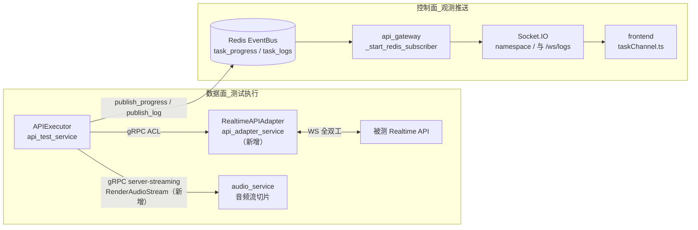
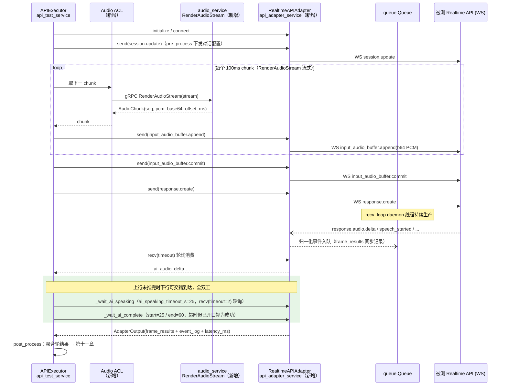
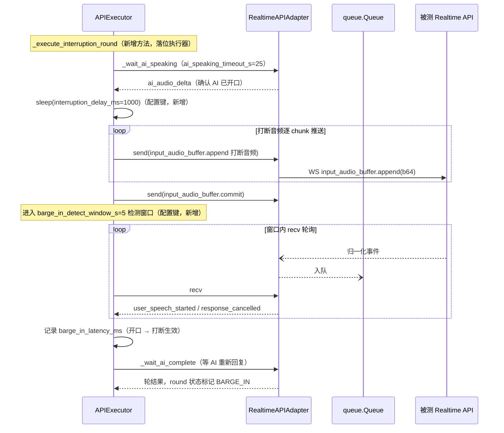
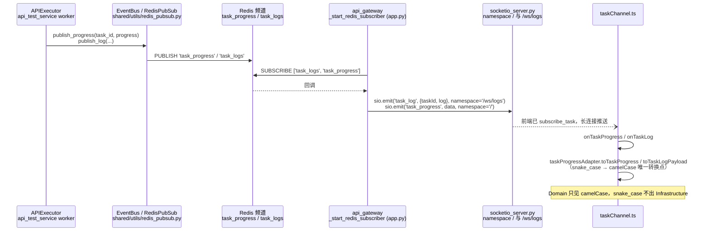
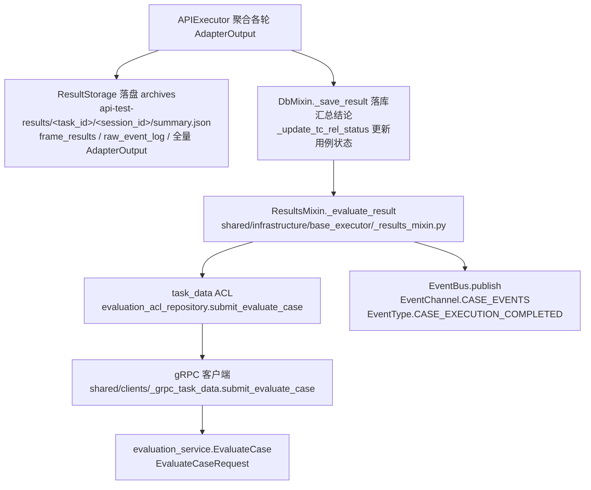

# 07 流式推送与结果获取（Realtime API 通道）

| 项 | 内容 |
| --- | --- |
| 版本 | V9.7.31 v1.0（2026-09-10） |
| 适配自 | V9.7.10《07_流式推送与结果获取》v3.1 |
| 架构基线 | DDD + CQRS + 微服务 + Redis 分布式 |
| 上游索引 | 《Realtime_API_Adapter方案与UseCase文档.md》配套文档清单 · 第 7 篇 |
| 服务落位 | api_adapter_service（数据面 Adapter）/ api_test_service（执行器+评估提交）/ audio_service（音频流供给）/ api_gateway（控制面转发）/ frontend（订阅消费） |

> 【适配说明】V9.7.10 为单体架构，本文全部逻辑位于同一进程；V9.7.31 拆分后，数据面（WS 直连被测 Realtime API）落在 api_adapter_service 的 Adapter 体系内，执行器落位 api_test_service，音频供给落位 audio_service，控制面推送复用 Redis EventBus → api_gateway → Socket.IO 既有链路。设计语义不变：device_type 路由、Adapter 体系、Realtime 全双工执行、SPL 增益映射。不新建服务、不引入 MQ。

---

## 一、通道选型：数据面与控制面分离

流式推送涉及两条完全独立的链路，必须分开建模、分开画图：

- **数据面（测试数据链路）**：执行器 ↔ RealtimeAPIAdapter ↔ 被测 API 的 WebSocket 全双工连接，承载测试音频上行与 AI 音频/文本下行。带宽高、时延敏感、随用例结束即断开。
- **控制面（观测链路）**：执行器 → Redis EventBus → api_gateway 订阅转发 → Socket.IO → 前端 taskChannel。低频、高可靠、任务全程存活。



【适配说明】V9.7.10 控制面经进程内日志回调推送；V9.7.31 执行器与网关分属不同进程，控制面统一收敛到 `shared/utils/redis_pubsub.py` 的 EventBus。选型依据：

| 通道 | 用途 | 选型 | 理由 |
| --- | --- | --- | --- |
| 数据面音频流 | 执行器取测试音频 | gRPC server-streaming `RenderAudioStream`（新增） | 分块流式、背压可控、跨服务必走 gRPC |
| 数据面被测交互 | 音频上行/AI 下行 | WebSocket（被测侧协议，非我方选型） | Realtime 语义要求全双工 |
| 控制面进度/日志 | 前端观测 | Redis EventBus + Socket.IO | 复用现有链路，不引入 MQ |
| 结果评估提交 | 执行器 → 评估 | gRPC `EvaluateCase`（evaluation_service 现有） | ACL 仓储模式 |

---

## 二、生产者-消费者模型与事件队列

Realtime WS 是全双工的：上行（推音频）与下行（收事件）随时交错。为避免"发一段、收一段"的半双工错觉，Adapter 内部保持 V9.7.10 的生产者-消费者结构，落位 `api_adapter_service/infrastructure/adapters/realtime_api_adapter.py`（新增）：

```
┌─ _recv_loop（daemon 线程，生产者）─┐      ┌─ 主执行线程（消费者）─┐
│ ws.recv() → _parse_event()        │ ──>  │ adapter.recv(timeout) │
│ 厂商事件 → 归一化事件 dict         │ 阻塞 │ 从 queue.Queue 取事件  │
│ WS 异常 → {"type":"connection_closed", "error":...} │ 队列 │ 无事件返回 None   │
└───────────────────────────────────┘      └───────────────────────┘
```

设计要点：

1. **daemon 线程**：`_recv_loop` 置为守护线程，主线程结束（teardown）后自动退出，不阻塞用例收尾。
2. **阻塞队列**：`queue.Queue` 承接归一化事件，天然削峰；下行事件洪峰（长回复拆几十个 delta）不会冲垮主循环。
3. **异常入队而非抛出**：WS 断连、解析失败均包装为 `{"type": "connection_closed", "error": ...}` 入队，消费者按事件语义处理，生产者线程永不向主线程抛异常。
4. **事件全集固定**（enum 化，新增 `RealtimeEventType` 于 `shared/models/common_enums.py`）：
   `ai_audio_delta / ai_audio_done / ai_text_delta / ai_text_done / user_speech_started / user_speech_stopped / response_cancelled / error / session.created / session.updated / connection_closed`

【适配说明】V9.7.10 事件 type 为模块内字符串常量；V9.7.31 按"枚举化"规则提升为 `RealtimeEventType(str, Enum)`（新增），魔法字符串清零。

---

## 三、推送方向：WS 指令与音频流供给

### 3.1 下行指令集（执行器 → 被测 API）

| 指令 | 时机 | 载荷 |
| --- | --- | --- |
| `session.update` | pre_process 阶段 | 对话配置（instructions、voice、input_audio_format 等） |
| `input_audio_buffer.append` | 逐 chunk 推流 | base64 编码 PCM（16bit LE mono，采样率 24000，`SAMPLE_RATE=24000`（新增）） |
| `input_audio_buffer.commit` | 一轮音频推完 | — |
| `response.create` | commit 之后 | 显式触发回复（可选，取决于被测 VAD 模式） |

### 3.2 音频流供给：RenderAudioStream（新增）

V9.7.31 中测试音频存于 audio_service，跨服务取流必须走 gRPC。在 `shared/proto/audio_service.proto` 追加 server-streaming 接口（**新增**，现文件仅有 AudioService/PlaybackService/AudioConfigService）：

```protobuf
// （新增）
rpc RenderAudioStream(RenderAudioStreamRequest) returns (stream AudioChunk);
message RenderAudioStreamRequest {
  string task_id = 1;
  string round_id = 2;
  string audio_id = 3;
  int32 chunk_duration_ms = 4;              // 默认 100，见第九章配置键
  float gain_linear = 5;                    // spl_to_gain(mapping_id, target_spl) 换算结果
  bool background_noise = 6;                // 是否叠加底噪
}
message AudioChunk {
  int32 seq = 1;                            // chunk 序号，从 0 起
  bytes pcm_base64 = 2;                     // 16bit LE mono PCM
  int64 offset_ms = 3;                      // 相对轮起点偏移
  bool last = 4;                            // 末帧标记
}
```

服务端实现复用既有编排能力，不另起炉灶：

- `audio_service/infrastructure/audio/playback_orchestrator.py` 的 `PlaybackOrchestrator`：`playback_config_builder`（`resolve_dry_audios` / `build_noise_info` / `build_dry_configs` / `build_interferer_configs` / `resolve_spl_gain`）产出轮配置，`audio_timeline`（`build_audio_timelines` / `get_audio_duration` / `calculate_overlap_time` / `calculate_sequential_delay` 纯函数模块）计算时间线；
- 增益换算复用 `audio_service/infrastructure/audio/spl_service.py` 的 `spl_to_gain(mapping_id, target_spl)`，与 E2E 通道同一 SPL 映射语义；
- 差异仅在"出口"：E2E 走声卡播放，Realtime 通道改为按 `chunk_duration_ms` 切片，经 server-streaming 逐 chunk 下发。

api_test_service 侧经 audio ACL 仓储（`api_test_service/infrastructure/acl/`，与 `evaluation_acl_repository.py` 同层，新增）消费流：执行器逐 chunk 调 `adapter.send(...)`，chunk 间以真实节奏下发，保证被测侧收到的是自然语速音频流。

【适配说明】V9.7.10 执行器直接读本地音频文件并自行切片；V9.7.31 音频资产归 audio_service 所有，api_test_service 零文件依赖，SPL 映射逻辑唯一收敛在 audio_service。

---

## 四、接收方向：事件归一化与消费

消费者侧统一通过 `adapter.recv(timeout)` 取归一化事件。归一化映射止步于 Adapter（防腐层语义），以 OpenAI Realtime 协议为例：

| 厂商事件（OpenAI） | 归一化 type | 语义 |
| --- | --- | --- |
| `response.audio.delta` | `ai_audio_delta` | AI 音频增量（base64 PCM） |
| `response.done` | `ai_audio_done` | 本轮音频回复结束 |
| `response.text.delta` | `ai_text_delta` | AI 文本增量 |
| `response.text.done` | `ai_text_done` | 本轮文本回复结束 |
| `input_audio_buffer.speech_started` | `user_speech_started` | 检测到用户开口（打断信号） |
| `input_audio_buffer.speech_stopped` | `user_speech_stopped` | 用户说话结束 |
| `response.cancelled` | `response_cancelled` | 服务端确认打断、终止当前回复 |
| `error` | `error` | 协议层错误，携带错误详情 |
| `session.created` / `session.updated` | 同名 | 会话生命周期 |
| （WS 断连/异常） | `connection_closed` | 连接终止，携带 error |

归一化事件在入队同时写入 `raw_event_log`（厂商原始事件），供问题回溯；归一化结果写入 `event_log`（评估用）。厂商差异（不同 Realtime 供应商事件名）只允许出现在 `_parse_event` 内，执行器只见 `RealtimeEventType`。

---

## 五、帧结果与最终结果分离

流式通道的产物分两层，职责不同、不可合并：

**1. 帧记录（过程证据）—— `frame_results`**：逐 chunk/逐事件的过程记录，每帧含 `{seq, direction, offset_ms, event_type, ts}`。用途：时延分析、断点回放、与 E2E 录音时间线互证。数据量大，**不进评估 prompt**。

**2. 最终结果（评估输入）—— `AdapterOutput` dataclass（新增，落位 api_adapter_service）**：

```python
@dataclass
class AdapterOutput:
    audio: list[str]          # AI 音频 chunk（base64 PCM）
    text: str                 # AI 文本（合并 delta 得到）
    video_chunks: list        # 预留
    images: list              # 预留
    event_log: list           # 归一化事件汇总
    raw_event_log: list       # 厂商原始事件
    latency_ms: dict          # 首帧/打断/回复等时延
    frame_results: list       # 帧记录（过程证据）
```

持久化分工（对应第十章聚合）：

| 数据 | 去向 | 通道 |
| --- | --- | --- |
| 汇总结论（text/latency/event_log 摘要） | 关系库 | `DbMixin._save_result`（`shared/infrastructure/base_executor/_db_mixin.py`） |
| 大字段全文（frame_results/raw_event_log/AdapterOutput） | 对象存储 | `ResultStorage`（`api_test_service/infrastructure/oss/result_storage.py`，`CATEGORY="archives"`，路径 `api-test-results/<task_id>/<session_id>/summary.json`） |
| 评估入参 | evaluation_service | gRPC `EvaluateCase`（见第十章） |

【适配说明】V9.7.10 单库落库；V9.7.31 遵循"大字段落盘、结论落库"的既有模式，避免 frame_results 撑爆结果表。

---

## 六、正常轮时序



关键点：推流与收流由线程边界解耦，执行器不因等下行而停止上行供给；`latency_ms` 记录首帧时延（commit → 首个 `ai_audio_delta`）。

---

## 七、打断轮时序

打断轮复现真实抢话：AI 说话中途推入打断音频，验证被测能否中断当前回复并重新响应。



打断成功判据（窗口内二者任一）：收到 `user_speech_started`（被测 VAD 检出抢话）或 `response_cancelled`（被测主动终止当前回复）。窗口超时未检出 → 打断失败，标记进入轮结果；AI 是否事后继续回复由 `_wait_ai_complete` 独立判定，两个结论互不覆盖。

---

## 八、控制面：进度与日志事件链

执行器全程经 EventBus 发布进度/日志，前端经 Socket.IO 订阅。此链路为 V9.7.31 既有设施，本文仅声明使用方式：



事实依据（现状代码，非新增）：`api_gateway/app.py` 的 `_start_redis_subscriber` 已订阅 `['task_logs', 'task_progress']` 并按 namespace 转发；`frontend/src/infrastructure/socket/taskChannel.ts` 的 `TASK_SOCKET_EVENTS = { progress: 'task_progress', log: 'task_log', subscribe: 'subscribe_task', unsubscribe: 'unsubscribe_task' }`，`LOG_NAMESPACE = '/ws/logs'`。执行器侧发布复用 `EventBus.publish(channel, event_type, payload)`（`EventChannel.CASE_EVENTS` / `EventType.CASE_EXECUTION_COMPLETED` 等真实枚举）。

【适配说明】V9.7.10 进度推送为进程内回调；V9.7.31 执行器进程与网关进程解耦，必须经 Redis 中转。task_service 如需观测，订阅同一频道即可，无需执行器感知。

---

## 九、异常与超时矩阵

所有超时配置化，落位 `api_test_service/config/config.py`（`class Config(BaseConfig)`，现有仅 `PORT=5003 / GRPC_PORT=50071`，以下键全部**新增**）：

| 配置键（新增） | 默认值 | 含义 |
| --- | --- | --- |
| `REALTIME_RECV_TIMEOUT_S` | 60 | 单次等待归一化事件的上限 |
| `REALTIME_CHUNK_DURATION_MS` | 100 | RenderAudioStream 切片粒度 |
| `REALTIME_INTERRUPTION_DELAY_MS` | 1000 | AI 开口后到推打断音频的固定延时 |
| `REALTIME_BARGE_IN_DETECT_WINDOW_S` | 5 | 打断检测窗口 |
| `REALTIME_AI_SPEAKING_TIMEOUT_S` | 25 | 等 AI 首个 `ai_audio_delta` |
| `REALTIME_AI_COMPLETE_START_TIMEOUT_S` | 25 | 等 AI 回复起始静音判定 |
| `REALTIME_AI_COMPLETE_END_TIMEOUT_S` | 60 | 等回复收尾 |
| `SAMPLE_RATE`（audio_service，新增） | 24000 | PCM 采样率 |

异常矩阵：

| 异常/超时 | 触发条件 | 配置键 | 默认 | 结果语义 |
| --- | --- | --- | --- | --- |
| 收流空闲超时 | `recv(timeout)` 连续空转到 `recv_timeout_s` | `REALTIME_RECV_TIMEOUT_S` | 60 | 判定连接僵死，本轮失败，session 重建 |
| AI 未开口 | commit 后起始窗口内无 `ai_audio_delta` | `REALTIME_AI_SPEAKING_TIMEOUT_S` | 25 | 轮失败：AI 未回复 |
| 回复完成超时（起始） | 已开口但迟迟不进入静音判定 | `REALTIME_AI_COMPLETE_START_TIMEOUT_S` | 25 | **超时但已开口 → 视为已回复，轮成功**（`_wait_ai_complete` 中 `return True` 语义，V9.7.10 注释"超时但已说过，视为已回复"原样保留） |
| 回复完成超时（收尾） | 静音判定后收尾事件迟到 | `REALTIME_AI_COMPLETE_END_TIMEOUT_S` | 60 | 同上：已说过即成功，收尾事件缺失只记 warning |
| 打断未检出 | 检测窗口内无 `user_speech_started`/`response_cancelled` | `REALTIME_BARGE_IN_DETECT_WINDOW_S` | 5 | 打断失败标记写入轮结果；不影响后续轮次 |
| WS 断连 | `_recv_loop` 捕获连接异常 | — | — | `connection_closed` 入队；轮失败，teardown 后按重连策略重建 session |
| 协议错误 | 收到 `error` 事件 | — | — | 记入 `event_log` 与轮结果；致命错误终止用例，非致命仅标记当前轮 |

矩阵设计原则：**"开口"是成功的分界线**。被测已产出音频即证明回复发生，收尾事件迟到属于网络/时序噪声，不应抹杀测试结论；未开口则是被测功能缺陷，必须失败。

---

## 十、结果聚合与评估提交

一轮/一用例执行完毕后的聚合与提交链路（全部真实符号）：



- 入口：`APIExecutor(BaseExecutor)`（`api_test_service/core/api_executor.py`）在结果处理段调用 `_evaluate_result`（真实调用点 line 325 一带）；会话型 `APISessionExecutor`（`api_test_service/core/api_session_executor.py`，组合而非继承 BaseExecutor）直接持有 `_evaluation_acl` 走同一 ACL 方法——两种执行器形态收敛到同一跨服务通道。
- 请求扩展（`shared/proto/evaluation_service.proto` 现有 `EvaluateCase(task_id, result_id, test_case_id, algorithm_result, eval_params)` 之上**新增**字段）：`device_type`（标识 Realtime 通道）、`first_frame_ms`（首帧时延）、`event_log`、`frame_results`（JSON 字符串承载）。评估侧据此可对流式通道做时延与事件完整性评估，而不改变既有评估算法主流程。
- 事件驱动：提交后发布 `EventType.CASE_EXECUTION_COMPLETED`（channel `CASE_EVENTS`），task_service/api_gateway 自行订阅消费，执行器不做进程内等待。

### 重评估时的结果复用

评估重跑（`EvalTaskStatus` 既有枚举驱动，如评分规则变更、人工触发重评）不重放 WS 会话：

1. 判定复用条件：`result_id` 对应记录存在且 `ResultStorage` 中 summary.json 完整（含 `frame_results` + `event_log`）；
2. 复用路径：从落盘/落库读回 AdapterOutput 等价数据 → 直接进入 `ResultsMixin._evaluate_result` → gRPC `EvaluateCase`，跳过第一~七章全部执行动作；
3. 不满足复用条件（数据缺失/结构版本不符）：整用例重测，重新走 Realtime 全双工执行；
4. 复用收益：评估迭代与执行解耦，重评秒级完成，不占用被测 API 配额。

【适配说明】V9.7.10 重评估读本地结果记录；V9.7.31 复用数据源明确为"archives 落盘 + DbMixin 落库"双源，大字段以落盘为准。

---

## 十一、与 E2E 方案对比

| 维度 | Realtime API 通道（本文） | E2E 音频播放采集通道 |
| --- | --- | --- |
| 音频供给 | gRPC `RenderAudioStream`（新增）100ms chunk 流式 | `PlaybackOrchestrator.play_round` 声卡整段播放 |
| SPL 映射 | `spl_to_gain` 同源换算，经请求参数 `gain_linear` 下发 | 同源换算，作用于声卡播放链路 |
| 打断检测 | 协议事件 `user_speech_started` / `response_cancelled` | 回采音频声学检测 |
| 时延测量 | WS 事件时间戳：`first_frame_ms`、`barge_in_latency_ms` | 录音与音频时间线（`audio_timeline`）比对 |
| 结果结构 | `AdapterOutput`（text 直接可得，无转写依赖） | 录音文件 + SPL 数据 + 时间线 |
| 过程证据 | `frame_results` 逐帧事件记录 | 录音原文 + 播放日志 |
| 评估输入 | `EvaluateCase` 扩展字段：`device_type`/`first_frame_ms`/`event_log`/`frame_results`（新增） | `EvaluateCase` 既有字段（algorithm_result/eval_params） |
| 复用能力 | 帧记录落盘，重评估免重放 | 录音归档，重评估免重放 |

两通道共享：音频资产与 SPL 映射（audio_service）、时间线纯函数（`audio_timeline.py`）、评估服务（evaluation_service）、分布式协调（`DistributedLock` / `DistributedSemaphore`，`shared/utils/distributed_coordinator.py`）与 worker_instance_id 收养语义——Realtime 数据面实例（replicas: 2）轮内状态（事件队列、WS 会话）在实例内闭环，任务中断后由持有 `worker_instance_id` 的实例收养续跑，不做跨实例会话迁移。

---

## 十二、关键设计原则

1. **双链路分离**：数据面直连被测、控制面经 EventBus，互不阻塞；控制面故障不影响测试执行。
2. **生产者-消费者**：daemon 线程 + 阻塞队列，收发解耦支撑全双工；异常以事件入队，不跨线程抛出。
3. **事件归一化止步于 Adapter**：厂商差异收敛在 `_parse_event`（ACL/防腐层），执行器只见 `RealtimeEventType` 枚举。
4. **帧记录与最终结果分离**：过程证据（frame_results）可追溯不进评估；结论（AdapterOutput）可直接评估；大字段落盘、结论落库。
5. **超时全部配置化**：八个配置键消灭魔法数字；"超时但已开口视为成功"的语义显式写入矩阵。
6. **跨服务只走 gRPC + ACL 仓储**：audio（RenderAudioStream）、evaluation（EvaluateCase）均经 ACL；snake_case 不出 Infrastructure，前端经 `taskProgressAdapter` 唯一转换。
7. **不新建服务、不引入 MQ**：音频复用 audio_service 编排，进度复用 Redis EventBus + Socket.IO 既有链路，评估复用 evaluation_service 现有 RPC。
