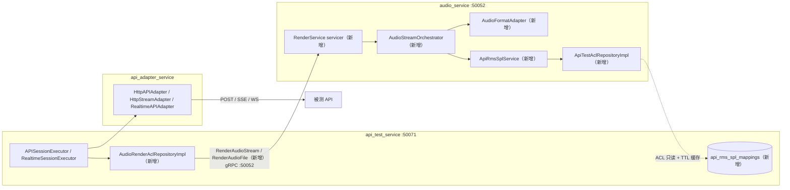
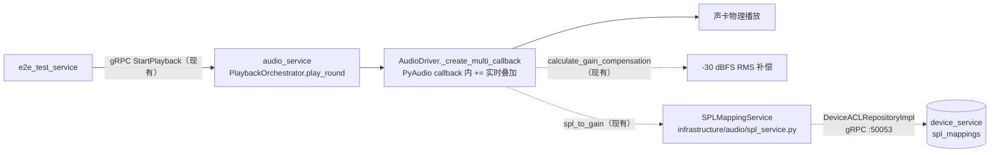

# 08 混音与 SPL 映射

| 项 | 内容 |
| --- | --- |
| 版本 | V9.7.31 v1.1（2026-09-10） |
| 适配自 | V9.7.10《08_混音与SPL映射》v1.1 |
| 架构基线 | DDD + CQRS + 微服务 + Redis 分布式 |
| 上游索引 | 《Realtime_API_Adapter方案与UseCase文档.md》配套文档清单 · 第 8 篇 |
| 服务落位 | audio_service（混音编排+格式适配+SPL 增益，gRPC:50052）/ api_test_service（执行器+映射数据归属，gRPC:50071）/ api_adapter_service（数据面 Adapter 消费）/ device_service（E2E 对照映射数据源，gRPC:50053） |

> 【适配说明】V9.7.10 为单体架构，`AudioStreamOrchestrator` 与三种 executor 同进程直调；V9.7.31 拆分后，混音编排下沉到 audio_service，经新增 gRPC 双出口暴露——`RenderAudioStream`（server-streaming，逐 chunk）与 `RenderAudioFile`（unary，服务端聚合整文件），api_test_service 侧仅保留 gRPC 流消费客户端（ACL 仓储）。三种 API 模式的混音编排语义不变：噪声合并 → 格式适配 → RMS 补偿+SPL 增益 → 时间轴 → 混音 → 切片。SPL 映射数据归属 api_test_service（`api_rms_spl_mappings` 表新增），audio_service 经 ACL 只读+TTL 缓存。E2E 对照链路不变。不新建服务、不引入 MQ。`RenderAudioStream` 的 proto 字段口径与《07_流式推送与结果获取.md》草案完全一致。

**v1.1 变更（承袭自源文档，含 V9.7.31 落位调整）**：

1. 修正：HTTP API（非实时 + 流式）**均支持混音**——非实时混音后服务端聚合整文件，流式混音后切片推送，Realtime 混音后切片 WS 推送。三者共用同一套 `AudioStreamOrchestrator` 编排（落位 audio_service），仅**消费方式**不同。
2. 新增：**格式适配层**（`AudioFormatAdapter`，落位 audio_service）——不同被测 API 的采样率/位深/通道数不同，混音前统一适配到 `api.audio_config` 声明的目标格式（重采样 / 位深转换 / 上混下混）。`api.audio_config` 为 API 聚合**新增列**，经 `StartAPITestRequest`（gRPC 扩展字段，新增）传给 audio_service。

---

## 一、概述

API 类测试（HTTP 非实时、HTTP 流式 SSE、Realtime WebSocket）需要将主讲人音频、干扰人音频、背景噪声**离线混音**后，按被测 API 要求的格式输出。V9.7.31 中混音统一由 audio_service 承担：

| 被测设备 | 混音位置（V9.7.31） | 混音产物 | 消费方式 |
|---------|------|---------|---------|
| HTTP API（非实时） | audio_service `RenderAudioStream` 编排 + 服务端聚合（`RenderAudioFile`，新增） | 完整 PCM（按 `container` 包装） | 经 gRPC 返回整文件 → Adapter 一次性 HTTP POST |
| HTTP API（流式） | audio_service `AudioStreamOrchestrator` 离线混音（新增） | base64 PCM chunk | gRPC 流 → HttpStreamAdapter 逐 chunk SSE 推送 |
| WebSocket API（Realtime） | 同上（同一编排） | base64 PCM chunk | gRPC 流 → RealtimeAPIAdapter 逐 chunk WS 推送 |
| E2E 物理设备（对照，链路不变） | device_service audio_driver callback 实时混音 | int16 帧 → 声卡 | PyAudio 物理播放 |

> **结论**：三种 API 模式的混音编排完全一致（同一 orchestrator、同一 6 步流程），差别只在**消费方式**——非实时整文件，流式/Realtime 逐 chunk。且混音前都经**格式适配**，统一到被测 API 要求的采样率/位深/通道数。

### 跨服务全景（API 类）



【适配说明】V9.7.10 中 executor 直接调用 `AudioStreamOrchestrator.chunk_audio()`；V9.7.31 中该调用变为跨服务 gRPC：执行器只负责**组装请求与消费 chunk**，混音细节全部封在 audio_service 进程内。

### 与 E2E 混音的区别（E2E 对照链路不变）

E2E 链路完全沿用现有代码：`e2e_test_service/infrastructure/acl/playback_acl_repository_impl.py` → `stub.StartPlayback` → audio_service `PlaybackOrchestrator.play_round` → `AudioDriver._create_multi_callback`：



| 维度 | E2E (audio_driver + spl_service) | API 类 (AudioStreamOrchestrator + ApiRmsSplService) |
|------|----------------------------------|-----------------------------------------------------|
| 混音时机 | 实时（PyAudio callback 内逐帧混音） | 离线（audio_service 内一次性混音完成） |
| 混音实现 | `_create_multi_callback` 内 `+=` 叠加 | `np.zeros` + `+=` 叠加（float32 缓冲） |
| 格式适配 | 声卡格式（PyAudio 自动处理） | `AudioFormatAdapter` → `api.audio_config`（重采样/位深/通道） |
| RMS 补偿 | `calculate_gain_compensation` (file→dBFS→gain) | `_rms_compensate` (bytes→numpy→dBFS→gain) |
| SPL 映射 | `SPLMappingService.spl_to_gain` (device→DB) | `ApiRmsSplService.spl_to_gain` (api_id→DB) |
| SPL 关联 | `PlaybackDevice` 1:N `SPLMapping`（device_service） | `API` 1:N `ApiRmsSplMapping`（api_test_service，新增） |
| SPL 校准 | 物理校准（播放测试音 + 实测 SPL） | 数字校准（发送已知 RMS + 评估识别效果） |
| 校准互斥 | 单实例依赖 DB 状态 | Redis `DistributedLock`（`shared/utils/distributed_coordinator.py`，微服务多实例必需） |
| 增益链路 | `effective = audio_gain × GLOBAL_SAFE_GAIN × gain_comp` | `effective = spl_gain × rms_compensate` |
| 输出 | int16 → PyAudio stream | 目标格式 PCM → 整文件 gRPC 返回 / base64 chunk gRPC 流 |
| 防削波 | `np.clip(-32768, 32767)` | `np.clip` 按目标位深满量程 |
| 背景 | 物理设备同时播放 | 混入轮次混音缓冲（不单独推送） |

【适配说明】最后一行"校准互斥"为 V9.7.31 新增维度：单体下校准由 DB 行锁自然串行；微服务多实例下必须显式分布式锁（见 6.5）。

---

## 二、格式适配层（v1.1 新增）

### 2.1 为什么需要

不同被测 API 对输入音频的格式要求不同：

| 被测 API | 采样率 | 位深 | 通道 |
|---------|--------|------|------|
| OpenAI Realtime | 24000 Hz | 16bit (pcm16) | mono |
| 某厂商 A | 16000 Hz | 16bit | mono |
| 某厂商 B | 8000 Hz | 16bit（电话线路） | mono |
| 某厂商 C | 44100 Hz | 24bit | stereo |

而音频库里的素材采样率/位深/通道五花八门（16k/44.1k/48k，16/24/32bit，mono/stereo）。**不同采样率的样本无法直接叠加**，必须先把所有源统一适配到目标格式，再进入 RMS 补偿和混音。

### 2.2 目标格式声明：`api.audio_config`

目标格式挂在被测 API 聚合上（JSON 字段），配置化、无硬编码：

```json
{
  "sample_rate": 24000,
  "bit_depth": "s16",
  "channels": 1,
  "container": "pcm"
}
```

| 字段 | 类型 | 说明 |
|------|------|------|
| `sample_rate` | int | 目标采样率（Hz） |
| `bit_depth` | enum | `s16` / `s24` / `s32`（枚举 `AudioBitDepth`，新增） |
| `channels` | int | 1=mono，2=stereo |
| `container` | enum | `pcm`（裸流）/ `wav`（非实时整文件常用，枚举 `AudioContainer`，新增） |

【适配说明：数据归属与传递链】V9.7.10 中 `audio_config` 是单体 `apis` 表字段；V9.7.31 中：

1. `api_test_service/infrastructure/persistence/models/api_models.py` 的 `API` 聚合**新增** `audio_config` JSON 列（`apis` 表新增列）；
2. `shared/proto/api_test_service.proto` 的 `StartAPITestRequest` **新增**扩展字段透传 `audio_config`（现仅 `task_id`）；
3. 执行器组装 `RenderAudioStreamRequest.target_format`（字段 9）经 gRPC 传给 audio_service，`AudioFormatAdapter.resolve_target_format` 消费——Infrastructure 之外只见 `AudioFormat` 值对象（camelCase），snake_case 仅存在于 gRPC/DTO 边界。

> `audio_config` 未配置时回退默认值（读配置键 `DEFAULT_TARGET_SAMPLE_RATE`/`DEFAULT_TARGET_BIT_DEPTH`/`DEFAULT_TARGET_CHANNELS`，新增，缺省 24000/s16/mono，OpenAI Realtime 兼容格式）。

### 2.3 AudioFormatAdapter

> 文件（新增）：`audio_service/domain/value_objects/audio_format.py`（值对象+枚举）、`audio_service/infrastructure/audio/audio_format_adapter.py`（适配器，与 `audio_driver.py` 同层）

```python
# domain/value_objects/audio_format.py（新增）——零依赖，仅供 Domain/Application 层消费
class AudioBitDepth(Enum):
    S16 = ('s16', 2, 32768)   # (名称, 字节数, 满量程)
    S24 = ('s24', 3, 8388608)
    S32 = ('s32', 4, 2147483648)

class AudioContainer(Enum):
    PCM = 'pcm'
    WAV = 'wav'

@dataclass(frozen=True)
class AudioFormat:
    sample_rate: int
    bit_depth: AudioBitDepth
    channels: int
    container: AudioContainer = AudioContainer.PCM
```

```python
# infrastructure/audio/audio_format_adapter.py（新增）
class AudioFormatAdapter:
    """音频格式适配器：位深转换 → 重采样 → 通道上下混

    适配时机：混音之前（Step 2）——不同采样率的样本无法直接叠加，
    所有源必须先统一到 api.audio_config 声明的目标格式。
    """

    @staticmethod
    def resolve_target_format(audio_config: dict | None) -> AudioFormat:
        """解析 api.audio_config，未配置回退配置键默认值"""

    @staticmethod
    def detect_source_format(pcm: bytes, audio_file) -> AudioFormat:
        """源格式优先级：
        1. audio_file 表元数据（sample_rate/channels/format 字段，现有列）
        2. WAV 头解析（wave/soundfile）
        3. 库内默认（配置键 DEFAULT_TARGET_*，新增）
        """

    @staticmethod
    def adapt(pcm: bytes, src: AudioFormat, dst: AudioFormat) -> bytes:
        """src → dst 转换（固定顺序）：
        1. 位深归一化 → float32 [-1.0, 1.0]
        2. 重采样 src_rate → dst_rate
        3. 通道转换 src_ch → dst_ch
        4. 按目标位深度化
        """

    @staticmethod
    def resample(samples: np.ndarray, src_rate: int, dst_rate: int) -> np.ndarray:
        """重采样：scipy.signal.resample_poly（有理分数重采样，抗混叠）
        上下取整 gcd 化简；采样率相同直接返回"""

    @staticmethod
    def convert_bit_depth(samples: np.ndarray, src: AudioBitDepth, dst: AudioBitDepth) -> np.ndarray:
        """位深转换：先归一化 float32，再量化到目标位深（避免 16→24 直接移位溢出）"""

    @staticmethod
    def convert_channels(samples: np.ndarray, src_ch: int, dst_ch: int) -> np.ndarray:
        """通道转换：
        - 下混 stereo→mono：L/R 均值
        - 上混 mono→stereo：复制（interleaved 排列）
        - N→M 其他组合：抛配置错误（不静默兜底）
        """

    @staticmethod
    def wrap_container(pcm_bytes: bytes, fmt: AudioFormat) -> bytes:
        """按 AudioContainer 包装：pcm 原样 / wav 加头（HTTP 非实时整文件用）"""
```

> **设计原则**：转换顺序固定为「位深 → 采样率 → 通道」。下混发生在重采样之后（对 mono 重采样再扩展，比先重采样双声道再下混节省一半算力）；位深先归一化 float32 再量化，避免截断误差累积。源格式元数据读取 audio_service 现有 `Audio` 持久化模型（`sample_rate`/`channels`/`format` 列已有；`bit_depth` 为**新增**列）。

---

## 三、核心组件

### 3.1 RenderService（gRPC 双出口，新增）

【适配说明：V9.7.10 的 `AudioStreamOrchestrator.chunk_audio()` 进程内函数调用 → V9.7.31 的 gRPC 出口】`shared/proto/audio_service.proto` 现仅有 `AudioService`/`PlaybackService`/`AudioConfigService` 三服务，**新增** `RenderService`（servicer 落位 `audio_service/interfaces/grpc/servicers.py`，端口 50052）。proto 字段 1-6 与《07_流式推送与结果获取.md》草案**完全一致**，7-10 为本文档承载三种 API 模式混音的扩展字段：

```protobuf
service RenderService {
  // 流式：HTTP 流式 SSE / Realtime WS 逐 chunk 消费（server-streaming）
  rpc RenderAudioStream(RenderAudioStreamRequest) returns (stream AudioChunk);
  // 非实时：服务端聚合整文件后一次性返回（unary）
  rpc RenderAudioFile(RenderAudioStreamRequest) returns (RenderAudioFileResponse);
}

message RenderAudioStreamRequest {
  string task_id = 1;
  string round_id = 2;
  string audio_id = 3;
  int32 chunk_duration_ms = 4;      // 切片时长 ms，0 → 配置键 RENDER_CHUNK_DURATION_MS（100）
  float gain_linear = 5;            // 外部增益（可选，1.0=不干预）
  bool background_noise = 6;        // 是否混入背景噪声
  // ---- 以下为 V9.7.31 扩展字段（新增）----
  string audios_config = 7;             // JSON: [{audio_id, type, spl, delay, ...}]
  string background_noise_config = 8;   // JSON: {audio_id, spl, loop, delay}（已按优先级合并）
  string target_format = 9;             // JSON: api.audio_config（目标格式）
  string api_id = 10;                   // 被测 API ID（查 ApiRmsSplMapping）
}

message AudioChunk {
  int32 seq = 1;
  bytes pcm_base64 = 2;
  int64 offset_ms = 3;
  bool last = 4;
}

message RenderAudioFileResponse {
  bool success = 1;
  bytes audio_data = 2;    // 按 container 包装的完整音频（pcm 裸流 / wav）
  int32 sample_rate = 3;
  int32 channels = 4;
  int64 duration_ms = 5;
}
```

服务端内部复用 audio_service 现有组件（不重复造轮子）：

| 现有组件 | 文件 | 复用点 |
| --- | --- | --- |
| `calculate_speaker_aware_audio_delays` / `build_audio_timelines` | `infrastructure/audio/audio_timeline.py` | Step 4 时间轴编排 |
| `resolve_spl_gain` / `build_dry_configs` / `build_interferer_configs` | `infrastructure/audio/playback_config_builder.py` | 源配置解析 |
| `build_noise_info(round_config, case_config)` | `infrastructure/audio/playback_config_builder.py` | 噪声合并（第四章） |
| `SPLMappingService.spl_to_gain` | `infrastructure/audio/spl_service.py` | 仅 E2E 链路，API 链路不用 |

gRPC 客户端装配：`shared/clients/grpc_clients.py` 现有懒加载工厂模式，**新增** `get_render_service_stub`；api_test_service 侧经 `AudioRenderAclRepositoryImpl`（新增，`api_test_service/infrastructure/acl/audio_render_acl_repository.py`）消费——执行器不直接 import stub，遵守 ACL 防腐层。

### 3.2 AudioStreamOrchestrator（下沉到 audio_service，新增）

> 文件（新增）：`audio_service/infrastructure/audio/audio_stream_orchestrator.py`——与现有 `PlaybackOrchestrator`（`infrastructure/audio/playback_orchestrator.py`）同层对称：一个管 E2E 实时播放，一个管 API 离线混音。

负责多源音频的混音编排和切片输出，复用 `audio_timeline.calculate_speaker_aware_audio_delays()` 的时间轴算法。**HTTP 非实时 / HTTP 流式 / Realtime 三种模式共用**（在 RenderService 内部被调用，executor 不再直调）。

```python
class AudioStreamOrchestrator:
    # 常量全部收敛到 audio_service/config/config.py 配置键（新增），拒绝魔法数字
    TARGET_RMS_DBFS = -30.0       # 与 audio_driver.calculate_gain_compensation 一致

    @staticmethod
    def render_stream(
        audios_config: list,          # [{audio_id, type, delay, play_order, spl, ...}]
        audio_loader,                 # 回调 (audio_id) -> bytes PCM
        chunk_duration_ms: int,       # 切片时长（配置键 RENDER_CHUNK_DURATION_MS）
        api_id: str | None,           # 被测 API ID（查 RMS→SPL 映射）
        rms_spl_mapping=None,         # 预加载的映射对象（可选）
        background_noise=None,        # 噪声配置（已按优先级合并）
        target_format: AudioFormat,   # api.audio_config 解析结果
        gain_linear: float = 1.0,     # 外部增益
    ) -> Iterator[AudioChunk]:        # base64 PCM chunk 流（消费方式由调用方决定）

    @staticmethod
    def render_file(...) -> tuple[bytes, AudioFormat, int]:
        # render_stream 聚合 → wrap_container → 整文件（RenderAudioFile 用）
```

> **输出统一为 base64 PCM chunk 流**：
> - `RenderAudioFile`（非实时）：服务端聚合全部 chunk → 按 `container` 包装 → 一次性 gRPC 返回
> - HTTP 流式 / Realtime（`RenderAudioStream`）：gRPC server-streaming 逐 chunk 下发，由 executor 决定推 SSE 还是 WS

### 3.3 ApiRmsSplService（落位 audio_service，新增）

> 文件（新增）：`audio_service/infrastructure/audio/api_rms_spl_service.py`

负责被测 API 的 RMS→SPL 映射，与 E2E 的 `SPLMappingService`（现有，同目录 `spl_service.py`）对称。**三种 API 模式通用**。

```python
class ApiRmsSplService:
    @staticmethod
    def spl_to_gain(api_id: str, target_spl: float) -> float:
        """查 api_id 关联的映射 → 计算 gain（映射经 ACL 跨服务获取）"""

    @staticmethod
    def spl_to_gain_by_mapping(mapping, target_spl: float) -> float:
        """用预加载的映射对象计算 gain（避免重复跨服务查询）"""

    @staticmethod
    def _linear_approx(target_spl: float) -> float:
        """无映射时的线性近似：gain = 10^((target_spl - BASE) / 20)
        BASE 取配置键 SPL_LINEAR_APPROX_BASE_DB（新增，默认 65）"""
```

【适配说明：映射数据跨服务获取】V9.7.10 中 `ApiRmsSplService` 直接查本地 DB；V9.7.31 中映射表归属 api_test_service，audio_service 侧**新增** `infrastructure/acl/api_test_acl_repository.py`：

1. 经 `shared/proto/api_test_service.proto` **新增** unary RPC `GetApiRmsSplMappings(api_id)` 拉取；
2. TTL 缓存（配置键 `API_RMS_SPL_CACHE_TTL_S`，新增）削峰——同一 api_id 的映射在一次任务内基本不变；
3. audio_service 全程只读，写入/校准动作归属 api_test_service（见 6.5）。

---

## 四、噪声合并优先级

```
┌──────────────────────────────────────────────────────────────┐
│                    噪声合并规则                                │
│                                                              │
│  数据源:                                                      │
│    轮次级: round_config.background_noise                      │
│    全局级: case_config.background_noise                       │
│                                                              │
│  优先级:                                                      │
│    1. 轮次级有噪声 → 用轮次级                                │
│    2. 轮次级无噪声 → 用全局级                                │
│    3. 两者都无 → 不混噪声                                    │
│                                                              │
│  合并后: background_noise = {audio_id, spl, loop, ...}       │
│  → 传入 RenderAudioStreamRequest.background_noise_config     │
└──────────────────────────────────────────────────────────────┘
```

【适配说明：合并逻辑落位】V9.7.10 中合并发生在 executor 的 `_resolve_noise()`；V9.7.31 中该规则**复用 audio_service 现有 `build_noise_info(round_config, case_config)`**（`infrastructure/audio/playback_config_builder.py`，同一规则已在 E2E 链路使用），避免同一优先级规则在两个服务各维护一份。执行器侧仅把轮次级/全局级两级配置**原样透传**进 `RenderAudioStreamRequest`（字段 7/8），合并动作统一在 audio_service 完成：

```python
# RenderService servicer 内（audio_service，新增）
def _merge_noise(self, request):
    return build_noise_info(                       # 现有函数复用
        round_config=json.loads(request.audios_config),
        case_config=json.loads(request.background_noise_config or '{}'),
    )
```

### 噪声配置结构

```json
{
  "audio_id": "42",
  "audio_name": "咖啡厅噪声",
  "spl": 55.0,
  "loop": true,
  "delay": 0
}
```

| 字段 | 说明 |
|------|------|
| `audio_id` | 噪声音频文件 ID |
| `spl` | 噪声目标声压级（dB SPL） |
| `loop` | 是否循环铺满整个轮次时长 |
| `delay` | 噪声开始时间偏移（ms），默认 0 = 从轮次开始就混入 |

---

## 五、混音 6 步流程

【适配说明：Step 1-6 全部发生在 audio_service 进程内（RenderService → AudioStreamOrchestrator）；api_test_service 只做"组装请求 + 消费 chunk"，跨服务边界仅在图中 gRPC 箭头处】

```
┌──────────────────────────────────────────────────────────────┐
│           api_test_service（消费侧，仅两步）                    │
│  1. 组装 RenderAudioStreamRequest：                            │
│     audios_config=round.audios, api_id=被测API.id,            │
│     target_format=api.audio_config,                           │
│     background_noise_config={轮次级, 全局级}（透传未合并）      │
│  2. AudioRenderAclRepositoryImpl → gRPC :50052                 │
├──────────────────────── 跨服务边界 ───────────────────────────┤
│           audio_service RenderService（编排侧）                │
│                                                                │
│  输入: audios_config = [                                       │
│    {audio_id:1, type:'speaker',   spl:65, delay:0},           │
│    {audio_id:2, type:'interferer', spl:55, delay:2000},      │
│  ]                                                              │
│  background_noise = build_noise_info(...)  ← 轮次级>全局级     │
│  target_format = api.audio_config                              │
│    = {sample_rate:16000, bit_depth:'s16', channels:1}          │
├──────────────────────────────────────────────────────────────┤
│                                                                │
│  ┌─ Step 1: 加载各源 PCM（主讲人 + 干扰人 + 噪声）────────┐   │
│  │  audio_loader(1) → speaker_pcm    (源格式 44.1k/24bit) │   │
│  │  audio_loader(2) → interferer_pcm (源格式 48k/16bit)   │   │
│  │  audio_loader(3) → noise_pcm      (源格式 44.1k/16bit) │   │
│  │                                                         │   │
│  │  sources = [                                            │   │
│  │    {config, pcm, type:'speaker',   target_spl:65},     │   │
│  │    {config, pcm, type:'interferer', target_spl:55},    │   │
│  │    {config, pcm, type:'noise',      target_spl:45,     │   │
│  │     loop:True},                                        │   │
│  │  ]                                                      │   │
│  └─────────────────────────────────────────────────────────┘   │
│                          │                                     │
│                          ▼                                     │
│  ┌─ Step 2: 格式适配 — 统一到 api.audio_config ──────────┐   │
│  │  对每个 source:                                          │   │
│  │    src_fmt = AudioFormatAdapter.detect_source_format(   │   │
│  │                  pcm, audio_file)                       │   │
│  │    dst_fmt = AudioFormatAdapter.resolve_target_format(  │   │
│  │                  target_format)  # 16k/s16/mono         │   │
│  │    src['pcm'] = AudioFormatAdapter.adapt(               │   │
│  │                    pcm, src_fmt, dst_fmt)               │   │
│  │                                                         │   │
│  │  转换顺序（固定）:                                       │   │
│  │    位深: 24bit → float32 → 16bit                        │   │
│  │    采样率: 44100 → resample_poly → 16000                │   │
│  │    通道: stereo → 下混均值 → mono                       │   │
│  │                                                         │   │
│  │  ★ 混音前必须适配：不同采样率样本无法直接叠加          │   │
│  └─────────────────────────────────────────────────────────┘   │
│                          │                                     │
│                          ▼                                     │
│  ┌─ Step 3: RMS 补偿 + SPL 增益 ────────────────────────┐    │
│  │  对每个 source（已统一格式）:                            │    │
│  │                                                          │    │
│  │  3a. RMS 补偿（归一化到 -30 dBFS）:                      │    │
│  │      rms = sqrt(mean(samples²))                         │    │
│  │      current_db = 20 * log10(rms / 32768)               │    │
│  │      gain_db = -30 - current_db                          │    │
│  │      gain_comp = 10 ^ (gain_db / 20)                    │    │
│  │      samples *= gain_comp                                │    │
│  │                                                          │    │
│  │  3b. SPL 增益（按被测 API 映射调整）:                    │    │
│  │      if rms_spl_mapping:                                 │    │
│  │        gain = ApiRmsSplService.spl_to_gain_by_mapping(  │    │
│  │                    mapping, target_spl)                 │    │
│  │      elif api_id:                                        │    │
│  │        gain = ApiRmsSplService.spl_to_gain(             │    │
│  │                    api_id, target_spl)  # ACL+缓存      │    │
│  │      else:                                               │    │
│  │        gain = _linear_approx(target_spl)                │    │
│  │                                                          │    │
│  │      src['gain_linear'] = gain                           │    │
│  │                                                          │    │
│  │  示例结果（BASE=65dB）:                                  │    │
│  │    speaker(65dB):   gain=10^((65-65)/20)=1.0            │    │
│  │    interferer(55dB): gain=10^((55-65)/20)=0.316         │    │
│  │    noise(45dB):     gain=10^((45-65)/20)=0.1             │    │
│  │    → 相对能量比 = speaker:interferer:noise = 1:0.3:0.1   │    │
│  └─────────────────────────────────────────────────────────┘    │
│                          │                                     │
│                          ▼                                     │
│  ┌─ Step 4: 时间轴编排 — speaker 感知交叠 ───────────────┐    │
│  │  calculate_speaker_aware_audio_delays(audios_config)    │    │
│  │  → timeline = [                                         │    │
│  │    {audio_id:1, start_time_ms:0,    end_time_ms:3000},  │    │
│  │    {audio_id:2, start_time_ms:2000, end_time_ms:4500},  │    │
│  │  ]                                                      │    │
│  │  (噪声不参与时间轴计算，单独按 loop/delay 混入)         │    │
│  │                                                          │    │
│  │  计算总时长（按目标采样率）:                             │    │
│  │    max_end_ms = max(end_time_ms)                        │    │
│  │    total_samples = 16000 * max_end_ms / 1000            │    │
│  │    mix_buffer = np.zeros(total_samples, dtype=float32)  │    │
│  └─────────────────────────────────────────────────────────┘    │
│                          │                                     │
│                          ▼                                     │
│  ┌─ Step 5: 混音叠加 — 按时间轴混入 float32 缓冲 ───────┐    │
│  │  对每个 source:                                          │    │
│  │    samples = int16 → float32（已在 Step 2 统一格式）    │    │
│  │    samples *= gain_linear                               │    │
│  │                                                          │    │
│  │    if type == 'noise' and loop:                         │    │
│  │      # 铺满整个混音缓冲                                  │    │
│  │      for i in range(0, buf_len, len(noise_samples)):    │    │
│  │        mix_buffer[i:end] += noise_samples[:chunk_len]   │    │
│  │    else:                                                 │    │
│  │      # 主讲人/干扰人/非循环噪声 → 按 start_time 混入    │    │
│  │      start_sample = 16000 * start_ms / 1000              │    │
│  │      mix_buffer[start:end] += samples                   │    │
│  │                                                          │    │
│  │  最终: mix_buffer = Σ (各源 × gain)                    │    │
│  │  (立体声目标时按 interleaved 帧对齐混入)                │    │
│  └─────────────────────────────────────────────────────────┘    │
│                          │                                     │
│                          ▼                                     │
│  ┌─ Step 6: 切片输出 — 按目标位深度化 → base64 chunk ───┐     │
│  │  mix_buffer → np.clip(±满量程) → int16 量化             │     │
│  │  chunk_samples = 16000 * 100ms / 1000 = 1600 samples   │     │
│  │  chunk_bytes = 1600 * 2 = 3200 bytes                   │     │
│  │                                                          │     │
│  │  mix_buffer[0:1600]     → base64 → AudioChunk(seq=0)    │     │
│  │  mix_buffer[1600:3200]  → base64 → AudioChunk(seq=1)    │     │
│  │  ...                                                    │     │
│  │  mix_buffer[-1600:]     → base64 → AudioChunk(seq=N,    │     │
│  │                                          last=True)     │     │
│  │  (不足补零到 1600 samples)                              │     │
│  └─────────────────────────────────────────────────────────┘   │
│                          │                                     │
│                          ▼                                     │
│  输出: gRPC stream [AudioChunk(seq=0..N, last)]                │
│  → 消费方式由 executor 决定（回到 api_test_service）:          │
│    - Realtime:  for chunk: adapter.send(chunk) + sleep         │
│    - HTTP 流式: for chunk: SSE 推送                            │
│    - HTTP 非实时: RenderAudioFile 整文件返回 → POST             │
└──────────────────────────────────────────────────────────────┘
```

---

## 六、SPL 映射对称设计

### 6.1 为什么要两套 SPL 映射

| 场景 | E2E 物理设备 | API 类（非实时/流式/Realtime 通用） |
|------|-------------|-------------------------------------|
| 用户配的声压 | 65 dB SPL | 65 dB SPL |
| 实际含义 | 物理音箱在 1m 处产生 65 dB | 数字音频的 RMS 对应 65 dB |
| 需要校准的对象 | **物理音箱**（不同音箱增益不同） | **被测 API**（不同 API 对输入 RMS 处理不同） |
| 映射关联实体 | `PlaybackDevice`（音箱） | `API`（被测 API） |
| 映射关系 | device 1:N SPLMapping | api 1:N ApiRmsSplMapping |
| 映射数据归属（V9.7.31） | device_service（`spl_mappings`，现有） | api_test_service（`api_rms_spl_mappings`，**新增**） |

> 用户在用例里配的是声压（SPL），不是 RMS，也不是在音频文件里配。声压映射在执行时根据被测设备类型查不同的映射表。

### 6.2 SPL 映射模型

```python
# E2E 物理设备映射（现有，归属 device_service 持久化模型）
class SPLMapping(Base):
    __tablename__ = 'spl_mappings'
    id = Column(Integer, primary_key=True)
    playback_device_id = Column(Integer, ForeignKey('playback_devices.id'))
    # device 1:N SPLMapping

# API 类映射（新增，非实时/流式/Realtime 通用）
# 落位：api_test_service/infrastructure/persistence/models/api_models.py
class ApiRmsSplMapping(Base):
    __tablename__ = 'api_rms_spl_mappings'   # api_test_service 新增表
    id = Column(Integer, primary_key=True)
    api_id = Column(Integer, ForeignKey('apis.id'))
    name = Column(String(100))
    description = Column(Text)
    target_spl = Column(Float)           # 目标声压级
    digital_gain = Column(Float)         # 数字增益
    calibration_status = Column(String(20), default='uncalibrated')
    calibration_data = Column(JSON)      # 校准数据
    # api 1:N ApiRmsSplMapping
```

【适配说明：读取路径】audio_service **不直连** api_test_service 的库，经 `ApiTestAclRepositoryImpl`（新增）→ `GetApiRmsSplMappings`（gRPC，新增）+ TTL 缓存只读获取；执行器（api_test_service）可在 `StartAPITestRequest` 处理时预加载映射并随请求字段 7-10 下发，命中 `spl_to_gain_by_mapping` 免二次查询。

### 6.3 增益计算链路

```
E2E 链路（现有，不变）:
  用户配 SPL=65dB
    → SPLMappingService.spl_to_gain(device, 65) → gain_db
      （audio_service/infrastructure/audio/spl_service.py，经 DeviceACLRepositoryImpl
        跨服务查 device_service :50053 的 spl_mappings）
    → effective = audio_gain × GLOBAL_SAFE_GAIN × gain_comp (RMS补偿)
    → PyAudio 播放（AudioDriver._create_multi_callback 内实时叠加）

API 链路（非实时/流式/Realtime 通用，V9.7.31 跨服务版）:
  用户配 SPL=65dB
    → ApiRmsSplService.spl_to_gain(api_id, 65) → gain_linear
      （audio_service，映射经 ACL 从 api_test_service :50071 只读拉取+缓存）
    → samples *= gain_linear × rms_compensate (RMS补偿，-30 dBFS 归一)
    → RenderAudioStream/RenderAudioFile 输出
      → 非实时: 整文件 POST | 流式: SSE chunk | Realtime: WS chunk
```

### 6.4 SPL 未配置时的行为

> 用户在用例导入时，不一定会设定声压级等数据。如果没设定，就将原始音频不变动 RMS 传递给被测 API。

```python
# 无 SPL 配置时 → gain=1.0，原始 RMS 不变（格式适配仍然执行）
if target_spl is None:
    gain_linear = 1.0   # 原始音频不动
else:
    # 有 SPL → 查映射 → 调整增益
    gain_linear = ApiRmsSplService.spl_to_gain(api_id, target_spl)
```

| 场景 | SPL 配置 | RMS 补偿 | SPL 增益 | 最终 gain |
|------|---------|---------|---------|-----------|
| 未配 SPL | 无 | 不补偿 | 1.0 | 1.0（原始不动） |
| 配了 SPL，无映射 | 65 dB | 归一化到 -30 dBFS | `_linear_approx(65)` | `rms_comp × linear` |
| 配了 SPL，有映射 | 65 dB | 归一化到 -30 dBFS | 查映射表 | `rms_comp × mapped_gain` |

### 6.5 校准互斥（V9.7.31 新增）

【适配说明：微服务多实例下，两个 api_gateway/api_test_service 实例可能同时对同一 api_id 发起数字校准（发送已知 RMS + 评估识别效果、回写 `calibration_data`）。V9.7.10 单体依赖进程内互斥即可；V9.7.31 必须显式分布式锁。】

复用现有基础设施 `shared/utils/distributed_coordinator.py` 的 `DistributedLock`（Redis 实现，带 TTL 与重试）：

```python
# api_test_service 校准入口（新增逻辑，写路径只发生在 api_test_service）
from shared.utils.distributed_coordinator import DistributedLock

lock = DistributedLock(
    key=f"calibration:api_rms_spl:{api_id}:{mapping_id}",
    ttl=30,               # 秒，防死锁
    retry_interval=0.1,
    retry_timeout=30,
)
if not lock.acquire():
    raise CalibrationConflictError(...)   # 已有校准在进行
try:
    # 播放已知 RMS 测试音频（经 RenderAudioFile）→ 收集评估结果
    # → 回写 calibration_status / calibration_data（仅 api_test_service 可写）
finally:
    lock.release()
```

| 要点 | 说明 |
| --- | --- |
| 锁粒度 | `api_id + mapping_id` 级，不影响其他 API 并行校准 |
| 锁宿主 | Redis（与 EventBus 同一基础设施），多实例安全 |
| 读写分离 | 校准写路径在 api_test_service；audio_service 只读缓存（TTL 过期后自动刷新） |

---

## 七、executor 中的混音调用

【适配说明：V9.7.10 中三种 executor 直调 `AudioStreamOrchestrator.chunk_audio()`；V9.7.31 中统一改为经 `AudioRenderAclRepositoryImpl`（新增）消费 gRPC，`chunk_audio` 调用体全部下沉到 audio_service。以下伪代码展示消费侧形态。】

### 7.1 RealtimeSessionExecutor（WebSocket，chunk 流式推送）

```python
def _execute_normal_round(self, adapter, round_config, ...):
    # 1. 组装混音请求（噪声两级配置透传，合并在 audio_service 侧 build_noise_info）
    request = build_render_request(          # AudioRenderAclRepositoryImpl 提供
        round_config=round_config,
        background_noise=round_config.get('background_noise'),  # 轮次级
        global_noise=case_config.get('background_noise'),       # 全局级
        api_id=data['api_configs'][0].id,
        target_format=adapter.target_format,   # api.audio_config（经 StartAPITestRequest 下发）
    )

    # 2. 混音 + 切片：gRPC server-streaming（跨服务边界，audio_service :50052）
    for chunk in self._render_acl.render_stream(request):   # AudioChunk(seq, pcm_base64, offset_ms, last)
        # 3. 流式推送（数据面经 api_adapter_service）
        adapter.send(chunk.pcm_base64, is_audio=True)
        time.sleep(request.chunk_duration_ms / 1000)        # 模拟实时速率

    # 4. 标记输入结束
    adapter.commit_input()

    # 5. 等 AI 完整回复
    adapter.post_process(is_interruption=False)
```

```python
def _execute_interruption_round(self, adapter, round_config, ...):
    # 1. 等 AI 开始说话
    adapter.post_process(start_timeout=25, is_interruption=True)

    # 2. 延迟（等 AI 说一会儿）
    time.sleep(round_config.get('interruption_delay_ms', 1000) / 1000)

    # 3. 混音 + 切片（打断音频 + 噪声，同一 gRPC 流式出口）
    request = build_render_request(round_config, ..., target_format=adapter.target_format)
    for chunk in self._render_acl.render_stream(request):
        adapter.send(chunk.pcm_base64, is_audio=True)
        time.sleep(request.chunk_duration_ms / 1000)

    adapter.commit_input()

    # 4. 检测 barge-in（5s 窗口）
    while time.time() - check_start < 5:
        event = adapter.recv(timeout=2)
        if event.get('type') in ('user_speech_started', 'response_cancelled'):
            barge_in_detected = True
            break

    # 5. barge-in 成功则等 AI 重新回复
    if barge_in_detected:
        adapter.post_process(is_interruption=False)
```

### 7.2 APISessionExecutor — HTTP 非实时（整文件上传）

```python
def _execute_non_stream_round(self, adapter, round_config, ...):
    # 1. 组装请求（同一套编排参数）
    request = build_render_request(round_config, ..., target_format=adapter.target_format)

    # 2. 混音 + 服务端聚合：gRPC unary RenderAudioFile（整文件，跨服务边界）
    response = self._render_acl.render_file(request)   # audio_data 按 container 包装

    # 3. 一次性 HTTP POST，等完整 JSON 响应
    adapter.send(response.audio_data, is_audio=True)   # HttpAPIAdapter 内部组装 multipart/base64
    adapter.post_process(is_interruption=False)        # 解析完整响应 → text/image
```

### 7.3 APISessionExecutor — HTTP 流式（SSE chunk 推送）

```python
def _execute_stream_round(self, adapter, round_config, ...):
    # 1. 组装请求（同一套编排参数）
    request = build_render_request(round_config, ..., target_format=adapter.target_format)

    # 2. 混音 + 切片：同一 gRPC server-streaming 出口
    for chunk in self._render_acl.render_stream(request):
        # 3. SSE 流式推送
        adapter.send(chunk.pcm_base64, is_audio=True)
        time.sleep(request.chunk_duration_ms / 1000)

    adapter.commit_input()

    # 4. 边推边收 SSE 事件（audio/text/video/image chunk）
    adapter.post_process(is_interruption=False)
```

> **三种 executor 的差异只在消费方式**：混音编排（噪声合并、格式适配、RMS/SPL、时间轴、混音）全部收敛在 audio_service 的 `RenderService` 后面，api_test_service 无重复代码，也无进程内耦合。

---

## 八、数据流总结

```
用例配置
  │
  ├── round_config.audios = [{audio_id:1, type:'speaker', spl:65},
  │                          {audio_id:2, type:'interferer', spl:55}]
  ├── round_config.background_noise = {audio_id:3, spl:45, loop:true}  ← 轮次级噪声
  ├── case_config.background_noise = {audio_id:99, spl:50, loop:true}  ← 全局噪声
  ├── api.rms_spl_mapping_id = 5       (被测 API 关联的 SPL 映射，api_rms_spl_mappings 新增表)
  └── api.audio_config = {sample_rate:16000, bit_depth:'s16',
                          channels:1, container:'pcm'}  (目标格式，apis 新增列)
          │
          ▼
  api_test_service: StartAPITestRequest（扩展字段，新增）→ 执行器
          │
          ▼
  组装 RenderAudioStreamRequest / RenderAudioFileRequest（字段 1-10）
          │
          │ ===== gRPC :50052（跨服务边界）=====
          ▼
  audio_service: RenderService servicer（新增）
          │
          ├── build_noise_info(...)  ← 轮次级 > 全局级（现有函数复用）
          │
          ▼
  AudioStreamOrchestrator.render_stream（新增）
          │
          ├── Step 1: 加载 PCM（speaker + interferer + noise，源格式各异）
          ├── Step 2: 格式适配（AudioFormatAdapter: 位深→重采样→上下混
          │            统一到 16k/s16/mono）
          ├── Step 3: RMS 补偿 + SPL 增益（ApiRmsSplService 经 ACL+缓存
          │            从 api_test_service :50071 只读拉取映射）
          ├── Step 4: 时间轴编排（speaker 感知交叠，audio_timeline 现有）
          ├── Step 5: 混音叠加（float32 buffer，目标采样率）
          └── Step 6: 切片输出（按目标位深度化 → AudioChunk 流）
                    │
                    ▼
        gRPC stream [AudioChunk(seq=0..N, last)] / RenderAudioFileResponse
          │
          │ ===== gRPC :50071（跨服务边界，回到消费侧）=====
          ▼
  AudioRenderAclRepositoryImpl（api_test_service，新增）
          │
        ┌───────────┼───────────────┐
        ▼           ▼               ▼
  Realtime WS   HTTP SSE 流式   HTTP 非实时
        │           │               │
  for chunk:    for chunk:      RenderAudioFile 整文件
    adapter.send  SSE 推送        → 一次性 POST
    sleep(100ms)
        │           │               │
        ▼           ▼               ▼
  ws.send({type:      event:       multipart/form-data
  "input_audio_       audio_chunk    (audio 文件字段)
   buffer.append",    (base64)
   audio: chunk})
```

---

## 附录：新增配置键汇总

【适配说明：V9.7.10 中切片时长/默认格式/线性近似基准等散落为类常量；V9.7.31 全部收敛为配置键（枚举化+配置化，拒绝魔法数字），落位 `audio_service/config/config.py`（现仅有 `PORT`/`GRPC_PORT`）。】

| 配置键 | 默认值 | 说明 | 落位 |
| --- | --- | --- | --- |
| `RENDER_CHUNK_DURATION_MS` | `100` | 混音切片时长（ms），`RenderAudioStreamRequest.chunk_duration_ms=0` 时的回退 | audio_service/config/config.py（新增） |
| `DEFAULT_TARGET_SAMPLE_RATE` | `24000` | `api.audio_config` 未配置时的目标采样率回退 | audio_service/config/config.py（新增） |
| `DEFAULT_TARGET_BIT_DEPTH` | `s16` | 默认位深（`AudioBitDepth` 枚举值） | audio_service/config/config.py（新增） |
| `DEFAULT_TARGET_CHANNELS` | `1` | 默认通道数（1=mono） | audio_service/config/config.py（新增） |
| `SPL_LINEAR_APPROX_BASE_DB` | `65` | `ApiRmsSplService._linear_approx` 线性近似基准声压（dB） | audio_service/config/config.py（新增） |
| `API_RMS_SPL_CACHE_TTL_S` | `300` | audio_service 侧映射 ACL 只读缓存 TTL（秒） | audio_service/config/config.py（新增） |
| `API_RMS_SPL_CALIBRATION_LOCK_TTL_S` | `30` | 校准互斥 `DistributedLock` TTL（秒） | api_test_service/config（新增） |

> 配套新增项清单（代码落位）：`shared/proto/audio_service.proto` 增 `RenderService`（新增）；`shared/proto/api_test_service.proto` 增 `GetApiRmsSplMappings` RPC 与 `StartAPITestRequest` 扩展字段（新增）；`shared/clients/grpc_clients.py` 增 `get_render_service_stub`（新增）；`audio_service/domain/value_objects/audio_format.py`、`audio_service/infrastructure/audio/audio_format_adapter.py`、`audio_service/infrastructure/audio/audio_stream_orchestrator.py`、`audio_service/infrastructure/audio/api_rms_spl_service.py`、`audio_service/infrastructure/acl/api_test_acl_repository.py`、`api_test_service/infrastructure/acl/audio_render_acl_repository.py`（均新增）；`api_models.py` 增 `audio_config` 列与 `ApiRmsSplMapping` 聚合（新增）。
