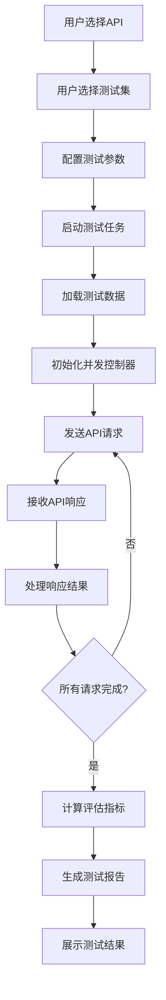
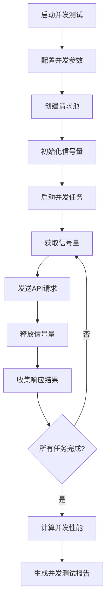
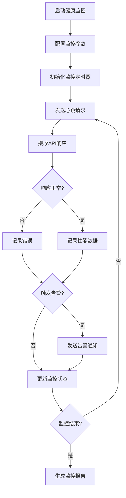

# API测试功能设计文档

## 1. 概述

### 1.1 文档目的

本文档描述智能语音测试系统中API测试（API Test）功能模块的详细设计，包括功能定位、架构设计、核心流程、技术实现和用户界面等方面。API测试功能作为系统的核心测试能力之一，旨在为用户提供测试语音识别和翻译API的性能与准确率的能力，支持批量测试和结果对比分析。

### 1.2 功能定位

API测试功能位于系统测试能力的重要位置，主要解决以下测试场景需求：

- **API性能测试**：测试第三方语音识别和翻译API的响应时间、并发处理能力
- **API准确率测试**：测试API的语音识别和翻译准确率
- **批量测试执行**：支持批量提交测试任务，自动执行并记录结果
- **结果对比分析**：支持多个API的测试结果对比，帮助选择最优API
- **健康状态监控**：实时监控API的可用性和响应质量

该功能适用于API选型、性能优化、服务质量监控等场景，是确保语音API使用效果的重要工具。

### 1.3 术语定义

| 术语 | 解释 |
|------|------|
| API | Application Programming Interface，应用程序编程接口 |
| ASR API | Automatic Speech Recognition API，自动语音识别API |
| TTS API | Text-to-Speech API，文本转语音API |
| MT API | Machine Translation API，机器翻译API |
| QPS | Queries Per Second，每秒查询次数，衡量API性能 |
| RTT | Round-Trip Time，往返时间，衡量网络延迟 |
| SLA | Service Level Agreement，服务等级协议 |
| 并发数 | 同时发送的API请求数量 |
| 超时率 | API请求超时的比例 |

## 2. 系统架构设计

### 2.1 整体架构

API测试功能采用前后端分离的三层架构设计，包含前端展示层、后端服务层和API调用层。

**前端展示层**：基于Vue 3框架构建，提供用户界面、测试配置、实时监控和结果展示功能。前端通过WebSocket与后端建立实时通信，接收测试进度和状态更新。

**后端服务层**：基于Flask框架实现，负责测试任务管理、API调用、结果收集和评估计算。后端通过异步IO处理并发API请求，通过WebSocket向前端推送实时数据。

**API调用层**：负责与第三方语音API的通信，包括请求构建、发送、响应解析和错误处理。支持多种API提供商的不同接口格式，提供统一的调用接口。

### 2.2 核心组件

| 组件 | 职责 | 技术实现 | 通信方式 |
|------|------|----------|----------|
| 前端API测试页面 | 提供测试配置、API选择、进度监控和结果展示 | Vue 3 + WebSocket | WebSocket推送 |
| 后端API测试服务 | 管理测试任务、执行API调用、处理测试结果 | Flask + AsyncIO | HTTP REST + WebSocket |
| API适配器 | 适配不同API提供商的接口格式 | 适配器模式 | 内存计算 |
| 并发控制器 | 控制API请求的并发数和速率 | AsyncIO + 信号量 | 内存计算 |
| 结果收集器 | 收集API响应结果和性能数据 | Flask API | HTTP POST |
| 评估计算器 | 计算API性能和准确率指标 | Python评估库 | 内存计算 |

### 2.3 数据流设计

API测试的数据流设计遵循单向数据流原则，确保数据传输的清晰性和可追踪性。

1. **测试配置数据流**：用户在前端配置测试参数（API、并发数、测试集等）→ 前端通过HTTP POST发送到后端 → 后端解析并存储测试任务

2. **测试执行数据流**：后端分配测试任务 → API调用层构建请求 → 并发控制器发送请求 → 接收API响应 → 结果返回后端

3. **进度更新数据流**：API执行状态变化 → 后端实时捕获 → WebSocket推送到前端 → 前端更新UI展示

4. **结果处理数据流**：后端接收测试结果 → 评估计算模块计算评估指标 → 生成测试报告 → 前端通过HTTP GET获取报告数据

### 2.4 依赖关系

API测试功能依赖以下系统模块：

- **音频管理模块**：提供测试音频文件的存储和检索
- **用例管理模块**：提供测试用例的存储和检索
- **评估系统模块**：提供测试结果的评估计算
- **任务管理模块**：提供测试任务的生命周期管理
- **报告管理模块**：提供测试报告的生成和存储

## 3. 核心功能模块

### 3.1 API管理

#### 3.1.1 API配置管理

API配置管理模块负责第三方语音API的配置和管理。

- **API添加**：支持添加新的API配置，包括API URL、认证信息、请求格式等
- **API编辑**：支持编辑现有API配置
- **API删除**：支持删除不再使用的API配置
- **API测试**：支持测试API连接性和基本功能

#### 3.1.2 API类型支持

API测试功能支持多种类型的语音相关API：

- **ASR API**：自动语音识别API，如百度语音识别、讯飞语音识别等
- **TTS API**：文本转语音API，如百度语音合成、讯飞语音合成等
- **MT API**：机器翻译API，如百度翻译、谷歌翻译等
- **综合API**：同时提供多种功能的API，如阿里云语音服务、腾讯云语音服务等

#### 3.1.3 API健康监控

API健康监控模块负责实时监控API的可用性和响应质量。

- **心跳检测**：定期发送测试请求，检测API是否可用
- **响应时间监控**：监控API的平均响应时间和波动
- **错误率监控**：监控API的错误率和错误类型
- **SLA评估**：根据监控数据评估API的服务等级协议（SLA）合规性

### 3.2 测试配置管理

#### 3.2.1 测试集管理

测试集管理模块负责测试数据的组织和管理。

- **测试集创建**：创建包含多个测试用例的测试集
- **测试集编辑**：编辑现有测试集的内容
- **测试集删除**：删除不再使用的测试集
- **测试集导入导出**：支持测试集的导入导出，便于共享和备份

#### 3.2.2 测试参数配置

测试参数配置模块负责配置API测试的各项参数。

- **并发数配置**：设置同时发送的API请求数量
- **请求间隔配置**：设置API请求之间的时间间隔
- **超时时间配置**：设置API请求的超时时间
- **重试次数配置**：设置API请求失败后的重试次数
- **测试轮数配置**：设置测试执行的轮数

#### 3.2.3 测试环境配置

测试环境配置模块负责配置测试执行的环境参数。

- **网络环境**：设置网络类型（Wi-Fi、移动网络）和代理配置
- **地理区域**：设置API请求的目标区域（不同区域的API性能可能不同）
- **设备信息**：设置请求中包含的设备信息（如设备型号、系统版本）
- **时间窗口**：设置测试执行的时间窗口（如非高峰期）

### 3.3 测试执行管理

#### 3.3.1 测试任务管理

测试任务管理模块负责测试任务的创建、执行、监控和归档。

- **任务创建**：基于用户配置生成测试任务，分配唯一任务ID
- **任务队列**：支持多任务排队执行，智能负载均衡
- **任务监控**：实时监控任务执行状态和进度
- **任务控制**：支持任务暂停、继续、终止操作
- **任务归档**：测试完成后自动归档，支持历史任务查询

#### 3.3.2 并发测试执行

并发测试执行模块负责执行并发API测试。

- **并发控制器**：控制并发请求的数量和速率
- **请求分发器**：分发测试请求到不同的API
- **响应收集器**：收集API响应和错误信息
- **性能监控**：实时监控并发测试的性能指标

#### 3.3.3 批量测试执行

批量测试执行模块负责执行批量API测试。

- **测试数据加载**：加载批量测试数据
- **测试执行调度**：调度测试执行顺序和速率
- **结果实时存储**：实时存储测试结果，避免数据丢失
- **错误处理**：处理测试执行过程中的错误

### 3.4 结果管理与分析

#### 3.4.1 结果收集与存储

结果收集与存储模块负责收集和存储API测试结果。

- **实时收集**：实时收集API响应结果和性能数据
- **数据验证**：验证收集到的数据完整性和格式正确性
- **数据存储**：将测试结果存储到数据库
- **数据索引**：为测试结果创建索引，便于查询和分析

#### 3.4.2 评估指标计算

评估指标计算模块负责计算API测试的评估指标。

- **性能指标**：响应时间、并发数、QPS、超时率等
- **准确率指标**：字错率、词错率、句错率、BLEU分数等
- **可靠性指标**：可用性、稳定性、错误率等
- **成本指标**：API调用成本、资源利用率等

#### 3.4.3 结果对比分析

结果对比分析模块负责对比分析多个API的测试结果。

- **多API对比**：对比不同API的测试结果
- **历史对比**：对比同一API的历史测试结果
- **维度分析**：从多个维度分析API性能和准确率
- **趋势分析**：分析API性能和准确率的变化趋势

#### 3.4.4 报告生成与管理

报告生成与管理模块负责生成和管理API测试报告。

- **报告生成**：生成详细的API测试报告
- **报告格式**：支持PDF、HTML、CSV等多种报告格式
- **报告存储**：将生成的报告存储到系统
- **报告查询**：支持按时间、API、测试类型等条件查询报告

### 3.5 监控与告警

#### 3.5.1 实时监控

实时监控模块负责实时监控API测试的执行情况。

- **执行状态监控**：监控测试执行的状态和进度
- **性能监控**：监控API的实时性能指标
- **错误监控**：监控测试执行过程中的错误
- **资源监控**：监控系统资源的使用情况

#### 3.5.2 告警管理

告警管理模块负责管理API测试的告警规则和通知。

- **告警规则设置**：设置API性能和准确率的告警阈值
- **告警触发**：当API性能或准确率低于阈值时触发告警
- **告警通知**：支持邮件、短信等多种告警通知方式
- **告警历史**：记录告警历史，支持告警分析

## 4. 核心流程图

### 4.1 API测试执行流程



### 4.2 并发测试流程



### 4.3 API健康监控流程



## 5. 用户界面设计

### 5.1 页面布局

API测试页面采用左侧导航+右侧内容区的经典布局，响应式设计适配不同屏幕尺寸。

**顶部导航栏**：显示当前测试任务状态、操作按钮（开始、暂停、停止）
**左侧边栏**：API管理和测试配置区域，包含API列表、测试集管理、参数配置三个标签页
**右侧主内容区**：测试执行监控和结果展示区域，包含进度条、实时日志、结果分析
**底部状态栏**：显示系统状态、网络状态、API状态等

### 5.2 核心界面

#### 5.2.1 API管理界面

**API列表标签页**
- API列表：显示已配置的API列表，包含API名称、类型、状态
- API状态：绿色标识在线，红色标识离线，黄色标识连接中
- API操作：支持添加、编辑、删除、测试API
- API详情：点击API显示详细配置信息和健康状态

**API配置标签页**
- 基本配置：API名称、类型、URL、认证方式
- 请求配置：请求格式、参数模板、 headers配置
- 响应配置：响应格式、结果提取规则
- 高级配置：超时时间、重试次数、代理设置

**API健康监控标签页**
- 健康状态：显示每个API的实时健康状态
- 性能指标：显示API的响应时间、错误率等指标
- 历史趋势：显示API性能的历史变化趋势
- 告警设置：设置API健康状态的告警阈值

#### 5.2.2 测试配置界面

**测试集管理标签页**
- 测试集列表：显示已创建的测试集，包含名称、测试用例数量
- 测试集操作：支持创建、编辑、删除、导入导出测试集
- 测试用例管理：管理测试集内的测试用例
- 测试数据预览：预览测试集的测试数据

**测试参数配置标签页**
- 并发配置：设置并发数、请求间隔、测试时长
- 网络配置：设置网络类型、代理配置、请求超时
- 数据配置：设置测试数据格式、编码方式
- 结果配置：设置结果存储方式、报告生成选项

**测试环境配置标签页**
- 系统环境：设置测试执行的系统环境参数
- 网络环境：模拟不同的网络环境（2G、3G、4G、Wi-Fi）
- 地理环境：模拟不同的地理区域
- 时间环境：设置测试执行的时间窗口

#### 5.2.3 测试执行界面

**进度监控区域**
- 总体进度条：显示整个测试任务的执行进度
- 请求统计：已发送请求数、成功数、失败数
- 时间统计：已执行时间、预计剩余时间
- 性能统计：平均响应时间、QPS、错误率

**实时日志区域**
- 日志流：实时显示测试执行日志
- 日志过滤：按日志级别（INFO、WARN、ERROR）过滤
- 日志搜索：支持关键词搜索日志内容
- 日志导出：支持导出完整日志文件

**API状态区域**
- API连接状态：显示每个API的连接状态
- 响应时间：显示API的实时响应时间
- 错误率：显示API的实时错误率
- 并发数：显示当前的并发请求数

#### 5.2.4 结果展示界面

**结果概览区域**
- 性能指标：响应时间、QPS、并发数、超时率
- 准确率指标：字错率、词错率、句错率、BLEU分数
- 可靠性指标：可用性、稳定性、错误率
- 成本指标：API调用成本、资源利用率

**详细结果区域**
- 测试用例列表：按测试用例展示详细测试结果
- 结果状态：成功、失败、超时状态标识
- API响应：显示API的原始响应和处理结果
- 错误分析：分析测试失败的原因

**对比分析区域**
- API对比：不同API的测试结果对比图表
- 历史对比：同一API的历史测试结果对比
- 维度分析：从多个维度分析API性能和准确率
- 趋势分析：分析API性能和准确率的变化趋势

**报告操作区域**
- 报告生成：生成完整测试报告
- 报告导出：导出为PDF、HTML、CSV格式
- 报告分享：生成分享链接或邮件发送
- 结果保存：保存测试结果到系统

### 5.3 交互设计

#### 5.3.1 操作流程

**API配置流程**
1. 用户在API管理界面点击"添加API"按钮
2. 填写API基本信息（名称、类型、URL等）
3. 配置API请求和响应格式
4. 点击"测试连接"按钮验证API可用性
5. 点击"保存"按钮保存API配置

**测试执行流程**
1. 用户在测试配置界面选择目标API
2. 选择测试集和配置测试参数
3. 点击"开始测试"按钮启动测试任务
4. 系统显示测试执行界面，实时监控测试进度
5. 测试完成后自动切换到结果展示界面

**结果分析流程**
1. 用户在结果展示界面查看测试结果概览
2. 点击"详细结果"查看每个测试用例的详细结果
3. 点击"对比分析"查看多个API的对比结果
4. 点击"生成报告"按钮生成完整测试报告
5. 点击"导出报告"按钮导出报告文件

#### 5.3.2 响应式设计

API测试界面采用响应式设计，适配不同屏幕尺寸：

- **桌面端**（≥1200px）：完整三栏布局，左侧配置区、右侧监控区、底部状态栏
- **平板端**（768px-1199px）：双栏布局，配置区可折叠，监控区优先显示
- **移动端**（<768px）：单栏布局，通过标签页切换不同功能区域

### 5.4 视觉设计

#### 5.4.1 颜色系统

API测试功能采用绿色主题，体现高效、可靠的测试工具属性：

- **主色调**：#52C41A（绿色），用于按钮、进度条、重要状态
- **辅助色**：#F6FFED（浅绿），用于背景、边框、次要元素
- **状态色**：
  - 成功：#52C41A（绿色）
  - 警告：#FAAD14（黄色）
  - 错误：#F5222D（红色）
  - 信息：#1890FF（蓝色）

#### 5.4.2 字体与图标

- **字体**：系统默认无衬线字体，主标题16px，正文14px，小字12px
- **图标**：使用Font Awesome图标库，主要图标包括：
  - 服务器：用于API管理
  - 图表：用于性能分析
  - 网络：用于网络配置
  - 日志：用于日志查看
  - 警告：用于错误告警

#### 5.4.3 布局原则

- **信息层次**：重要信息（性能指标、错误率）优先显示，次要信息（详细配置）可折叠
- **空间利用**：充分利用屏幕空间，避免不必要的留白
- **操作便捷**：常用操作按钮放置在显眼位置，减少操作路径
- **视觉引导**：使用颜色、图标、动画等元素引导用户注意力
- **一致性**：保持与系统其他模块的视觉风格一致

## 6. 技术实现

### 6.1 前端实现

#### 6.1.1 技术栈

- **框架**：Vue 3 + Composition API
- **状态管理**：Pinia（轻量级状态管理）
- **路由**：Vue Router
- **通信**：WebSocket（实时通信） + Axios（HTTP请求）
- **UI组件**：自定义组件 + Element Plus
- **图表库**：ECharts（数据可视化）
- **样式**：SCSS + CSS变量

#### 6.1.2 核心模块

**API管理模块**
- API列表组件：`ApiList.vue`
- API配置组件：`ApiConfig.vue`
- API健康监控组件：`ApiHealthMonitor.vue`

**测试配置模块**
- 测试集管理组件：`TestSuiteManager.vue`
- 测试参数配置组件：`TestParamsConfig.vue`
- 测试环境配置组件：`TestEnvConfig.vue`

**测试执行模块**
- 进度监控组件：`ProgressMonitor.vue`
- 实时日志组件：`RealTimeLog.vue`
- API状态组件：`ApiStatus.vue`

**结果展示模块**
- 结果概览组件：`ResultOverview.vue`
- 详细结果组件：`DetailedResult.vue`
- 对比分析组件：`ComparisonAnalysis.vue`
- 报告生成组件：`ReportGenerator.vue`

#### 6.1.3 关键实现

**并发测试控制**
```javascript
// 并发测试控制
export const useConcurrentTest = () => {
  const concurrentCount = ref(5);
  const requestInterval = ref(100);
  const testDuration = ref(60);
  const isRunning = ref(false);
  const progress = ref(0);
  const results = ref([]);
  
  const startTest = async () => {
    isRunning.value = true;
    progress.value = 0;
    results.value = [];
    
    const totalRequests = concurrentCount.value * (testDuration.value * 1000 / requestInterval.value);
    let completedRequests = 0;
    
    // 创建并发请求池
    const requestPool = [];
    
    for (let i = 0; i < concurrentCount.value; i++) {
      const requestTask = async () => {
        while (completedRequests < totalRequests && isRunning.value) {
          try {
            // 发送API请求
            const result = await sendApiRequest();
            results.value.push(result);
            completedRequests++;
            progress.value = Math.min((completedRequests / totalRequests) * 100, 100);
            
            // 等待请求间隔
            await new Promise(resolve => setTimeout(resolve, requestInterval.value));
          } catch (error) {
            console.error('API request failed:', error);
            completedRequests++;
            progress.value = Math.min((completedRequests / totalRequests) * 100, 100);
          }
        }
      };
      
      requestPool.push(requestTask());
    }
    
    // 等待所有请求完成
    await Promise.all(requestPool);
    isRunning.value = false;
  };
  
  const stopTest = () => {
    isRunning.value = false;
  };
  
  return {
    concurrentCount,
    requestInterval,
    testDuration,
    isRunning,
    progress,
    results,
    startTest,
    stopTest
  };
};
```

**WebSocket实时通信**
```javascript
// WebSocket实时通信
export const useWebSocket = () => {
  const ws = ref(null);
  const isConnected = ref(false);
  const messages = ref([]);
  
  const connect = () => {
    ws.value = new WebSocket('ws://localhost:5000/ws/api-test');
    
    ws.value.onopen = () => {
      isConnected.value = true;
    };
    
    ws.value.onmessage = (event) => {
      const data = JSON.parse(event.data);
      messages.value.push(data);
      
      // 处理不同类型的消息
      if (data.type === 'progress') {
        // 处理进度更新
      } else if (data.type === 'result') {
        // 处理测试结果
      } else if (data.type === 'error') {
        // 处理错误信息
      }
    };
    
    ws.value.onclose = () => {
      isConnected.value = false;
    };
  };
  
  const sendMessage = (message) => {
    if (ws.value && isConnected.value) {
      ws.value.send(JSON.stringify(message));
    }
  };
  
  const disconnect = () => {
    if (ws.value) {
      ws.value.close();
    }
  };
  
  return {
    ws,
    isConnected,
    messages,
    connect,
    sendMessage,
    disconnect
  };
};
```

### 6.2 后端实现

#### 6.2.1 技术栈

- **框架**：Flask + Flask-SocketIO
- **异步处理**：asyncio + aiohttp
- **并发控制**：asyncio.Semaphore
- **数据存储**：SQLite + SQLAlchemy
- **网络通信**：WebSocket + RESTful API
- **HTTP客户端**：aiohttp（异步HTTP客户端）
- **性能监控**：psutil（系统资源监控）

#### 6.2.2 核心模块

**API管理模块**
- `api_manager.py`：API配置管理
- `api_client.py`：API调用客户端
- `api_health.py`：API健康监控

**测试执行模块**
- `test_executor.py`：测试任务执行器
- `concurrent_controller.py`：并发请求控制器
- `result_collector.py`：测试结果收集器

**评估计算模块**
- `evaluator.py`：评估指标计算
- `comparison_analyzer.py`：结果对比分析
- `report_generator.py`：报告生成器

#### 6.2.3 关键实现

**并发API请求**
```python
# 并发API请求实现
import asyncio
import aiohttp
from concurrent.futures import ThreadPoolExecutor

class ConcurrentApiTester:
    """并发API测试器"""
    
    def __init__(self, concurrent_count, request_interval):
        """初始化并发测试器"""
        self.concurrent_count = concurrent_count
        self.request_interval = request_interval
        self.semaphore = asyncio.Semaphore(concurrent_count)
    
    async def test_api(self, api_config, test_data, duration):
        """测试API性能"""
        results = []
        start_time = asyncio.get_event_loop().time()
        end_time = start_time + duration
        
        async with aiohttp.ClientSession() as session:
            tasks = []
            while asyncio.get_event_loop().time() < end_time:
                # 等待信号量
                await self.semaphore.acquire()
                
                # 创建测试任务
                task = asyncio.create_task(
                    self._send_request(session, api_config, test_data, results)
                )
                tasks.append(task)
                
                # 等待请求间隔
                await asyncio.sleep(self.request_interval / 1000)
            
            # 等待所有任务完成
            await asyncio.gather(*tasks)
        
        return results
    
    async def _send_request(self, session, api_config, test_data, results):
        """发送单个API请求"""
        try:
            start_time = asyncio.get_event_loop().time()
            
            # 构建请求
            url = api_config['url']
            headers = api_config.get('headers', {})
            data = self._build_request_data(api_config, test_data)
            
            # 发送请求
            if api_config['method'] == 'GET':
                async with session.get(url, headers=headers, params=data) as response:
                    response_data = await response.json()
            else:
                async with session.post(url, headers=headers, json=data) as response:
                    response_data = await response.json()
            
            end_time = asyncio.get_event_loop().time()
            response_time = (end_time - start_time) * 1000  # 转换为毫秒
            
            # 处理响应
            result = {
                'status': 'success',
                'response_time': response_time,
                'response': response_data,
                'timestamp': start_time
            }
            results.append(result)
            
        except Exception as e:
            end_time = asyncio.get_event_loop().time()
            response_time = (end_time - start_time) * 1000  # 转换为毫秒
            
            result = {
                'status': 'error',
                'response_time': response_time,
                'error': str(e),
                'timestamp': start_time
            }
            results.append(result)
        finally:
            # 释放信号量
            self.semaphore.release()
    
    def _build_request_data(self, api_config, test_data):
        """构建请求数据"""
        # 根据API配置构建请求数据
        # 这里需要根据具体的API类型和格式进行实现
        pass
```

**API健康监控**
```python
# API健康监控实现
import asyncio
import aiohttp
import time

class ApiHealthMonitor:
    """API健康监控"""
    
    def __init__(self, check_interval=60):
        """初始化健康监控"""
        self.check_interval = check_interval
        self.api_status = {}
        self.is_running = False
    
    async def start_monitoring(self, apis):
        """开始监控API健康状态"""
        self.is_running = True
        
        while self.is_running:
            for api in apis:
                await self.check_api_health(api)
            
            await asyncio.sleep(self.check_interval)
    
    async def stop_monitoring(self):
        """停止监控"""
        self.is_running = False
    
    async def check_api_health(self, api):
        """检查单个API的健康状态"""
        api_id = api['id']
        start_time = time.time()
        
        try:
            async with aiohttp.ClientSession() as session:
                # 发送健康检查请求
                url = api['url']
                headers = api.get('headers', {})
                
                async with session.get(url, headers=headers, timeout=5) as response:
                    response_status = response.status
                    response_time = (time.time() - start_time) * 1000  # 转换为毫秒
                    
                    if response_status >= 200 and response_status < 300:
                        status = 'healthy'
                    else:
                        status = 'unhealthy'
        except Exception as e:
            response_time = (time.time() - start_time) * 1000  # 转换为毫秒
            status = 'unhealthy'
            error = str(e)
        
        # 更新API状态
        self.api_status[api_id] = {
            'status': status,
            'response_time': response_time,
            'last_check': time.time(),
            'error': error if 'error' in locals() else None
        }
        
        # 检查是否需要触发告警
        self._check_alert(api, self.api_status[api_id])
    
    def _check_alert(self, api, status):
        """检查是否需要触发告警"""
        # 这里实现告警逻辑
        pass
    
    def get_api_status(self, api_id):
        """获取API的健康状态"""
        return self.api_status.get(api_id, {'status': 'unknown'})
    
    def get_all_status(self):
        """获取所有API的健康状态"""
        return self.api_status
```

## 7. 性能与可靠性设计

### 7.1 性能优化

#### 7.1.1 并发处理

- **异步IO**：使用asyncio和aiohttp实现异步HTTP请求，提高并发处理能力
- **连接池**：使用aiohttp的连接池，减少TCP连接建立的开销
- **请求批处理**：批量发送相似请求，减少网络往返时间
- **内存优化**：使用流式处理大型响应，避免一次性加载到内存

#### 7.1.2 资源管理

- **CPU管理**：限制单个测试的CPU使用率，避免系统过载
- **内存管理**：实时监控内存使用，避免内存泄漏
- **网络管理**：优化网络通信，减少网络延迟
- **磁盘管理**：优化文件IO，减少磁盘读写开销

#### 7.1.3 响应速度

- **前端优化**：使用虚拟滚动处理大量数据，减少DOM操作
- **后端优化**：使用缓存减少重复计算，优化数据库查询
- **WebSocket优化**：使用二进制数据格式，减少传输开销
- **API调用优化**：批量执行API请求，减少请求次数

### 7.2 可靠性设计

#### 7.2.1 错误处理

- **网络错误**：处理网络中断、超时等错误
- **API错误**：处理API返回错误、限流等错误
- **系统错误**：处理系统资源不足、权限不足等错误
- **数据错误**：处理测试数据格式错误、数据缺失等错误

#### 7.2.2 重试机制

- **连接重试**：API连接失败自动重试
- **请求重试**：API请求失败自动重试
- **测试重试**：单个测试用例失败自动重试
- **任务重试**：整个测试任务失败支持手动重试

#### 7.2.3 容错设计

- **API容错**：部分API失败不影响其他API测试
- **请求容错**：部分请求失败不影响其他请求执行
- **网络容错**：网络中断后自动重连，恢复测试
- **存储容错**：测试结果实时保存，避免数据丢失

#### 7.2.4 监控与告警

- **系统监控**：监控CPU、内存、磁盘使用情况
- **网络监控**：监控网络连接质量、延迟
- **API监控**：监控API连接状态、响应时间
- **错误告警**：关键错误实时告警，支持邮件通知

## 8. 安全设计

### 8.1 API安全

- **认证信息保护**：加密存储API认证信息，避免明文存储
- **请求签名**：对API请求进行签名验证，防止请求被篡改
- **访问控制**：基于API密钥的访问控制，防止未授权访问
- **速率限制**：限制API请求速率，防止滥用

### 8.2 数据安全

- **数据加密**：敏感数据传输和存储加密
- **访问控制**：基于角色的访问控制
- **数据脱敏**：测试结果中的敏感信息脱敏处理
- **审计日志**：记录所有操作日志，支持追溯

### 8.3 网络安全

- **传输加密**：WebSocket连接使用WSS加密
- **访问限制**：限制API访问来源，防止未授权访问
- **DDoS防护**：防止恶意请求攻击
- **网络隔离**：测试网络与生产网络隔离

### 8.4 应用安全

- **依赖安全**：定期更新第三方依赖，修复安全漏洞
- **代码安全**：代码审查，防止安全漏洞
- **配置安全**：敏感配置信息加密存储
- **运行安全**：应用运行在沙箱环境中

## 9. 测试与维护

### 9.1 测试策略

#### 9.1.1 单元测试

- **API客户端测试**：测试API调用客户端的功能
- **并发控制器测试**：测试并发请求控制
- **结果收集器测试**：测试测试结果收集
- **评估计算测试**：测试评估指标计算

#### 9.1.2 集成测试

- **前端集成**：测试前端组件交互
- **后端集成**：测试后端模块协作
- **前后端集成**：测试WebSocket通信
- **API集成**：测试与真实API的集成

#### 9.1.3 端到端测试

- **完整流程测试**：测试从配置到报告的完整流程
- **并发测试**：测试并发API请求
- **异常场景测试**：测试各种异常场景的处理
- **性能测试**：测试系统在高负载下的表现

### 9.2 维护策略

#### 9.2.1 监控与日志

- **系统监控**：监控CPU、内存、磁盘使用情况
- **应用监控**：监控应用运行状态、错误率
- **API监控**：监控API连接状态、响应时间
- **日志管理**：集中管理系统日志、应用日志、API调用日志

#### 9.2.2 故障排除

- **故障诊断**：快速定位故障原因
- **故障修复**：及时修复系统故障
- **故障预防**：分析故障原因，预防类似问题
- **知识积累**：建立故障知识库，支持快速解决

#### 9.2.3 版本管理

- **代码版本**：使用Git进行代码版本管理
- **配置版本**：管理API配置的版本
- **测试数据版本**：管理测试数据的版本
- **报告版本**：管理测试报告的版本

#### 9.2.4 升级策略

- **系统升级**：定期升级系统组件和依赖
- **功能升级**：根据用户反馈和需求添加新功能
- **性能升级**：优化系统性能，提高测试效率
- **安全升级**：及时修复安全漏洞

## 10. 未来规划

### 10.1 功能增强

- **更多API类型**：支持更多类型的语音相关API，如语音合成、语音情感分析等
- **智能测试**：使用AI自动生成测试用例，分析测试结果
- **自动化测试**：支持定时执行、触发式执行等自动化场景
- **多环境测试**：支持在不同环境（开发、测试、生产）中测试API

### 10.2 技术演进

- **容器化部署**：支持Docker容器化部署，提高环境一致性
- **云服务集成**：集成云测试服务，扩展测试能力
- **边缘计算**：利用边缘设备提高测试效率
- **低代码配置**：提供可视化配置界面，降低使用门槛

### 10.3 生态建设

- **插件系统**：支持第三方插件扩展功能
- **API开放**：开放API接口，支持与其他系统集成
- **社区建设**：建立用户社区，共享测试经验和资源
- **标准制定**：参与API测试标准制定，推动行业发展

## 11. 结论

API测试功能是智能语音测试系统的核心测试能力之一，通过测试语音识别和翻译API的性能与准确率，为用户提供了一种全面、可靠的API评估方案。本文档详细描述了该功能的设计方案，包括系统架构、核心功能、技术实现、用户界面等方面，为开发团队提供了清晰的实现指导。

随着技术的不断发展和用户需求的不断变化，API测试功能也需要持续演进和优化。通过本文档的指导，开发团队可以快速实现该功能的核心能力，并在此基础上不断扩展和完善，为用户提供更加全面、高效、可靠的API测试解决方案。

## 12. 参考资料

- [aiohttp官方文档](https://docs.aiohttp.org/)
- [asyncio官方文档](https://docs.python.org/3/library/asyncio.html)
- [Flask官方文档](https://flask.palletsprojects.com/)
- [Vue 3官方文档](https://vuejs.org/)
- [WebSocket官方规范](https://websockets.spec.whatwg.org/)
- [API性能测试最佳实践](https://www.guru99.com/api-performance-testing.html)
- [RESTful API设计规范](https://restfulapi.net/)
