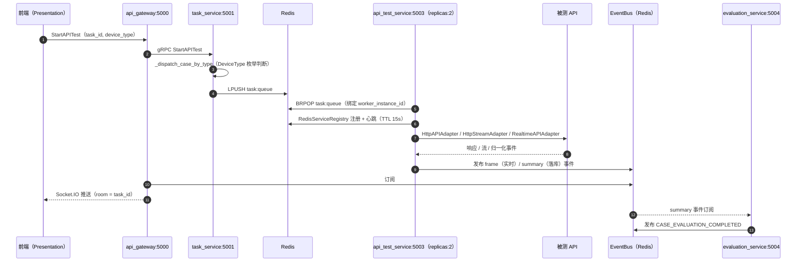
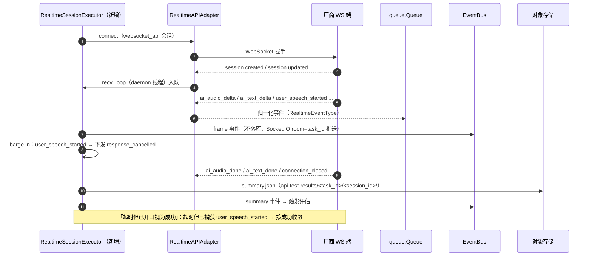
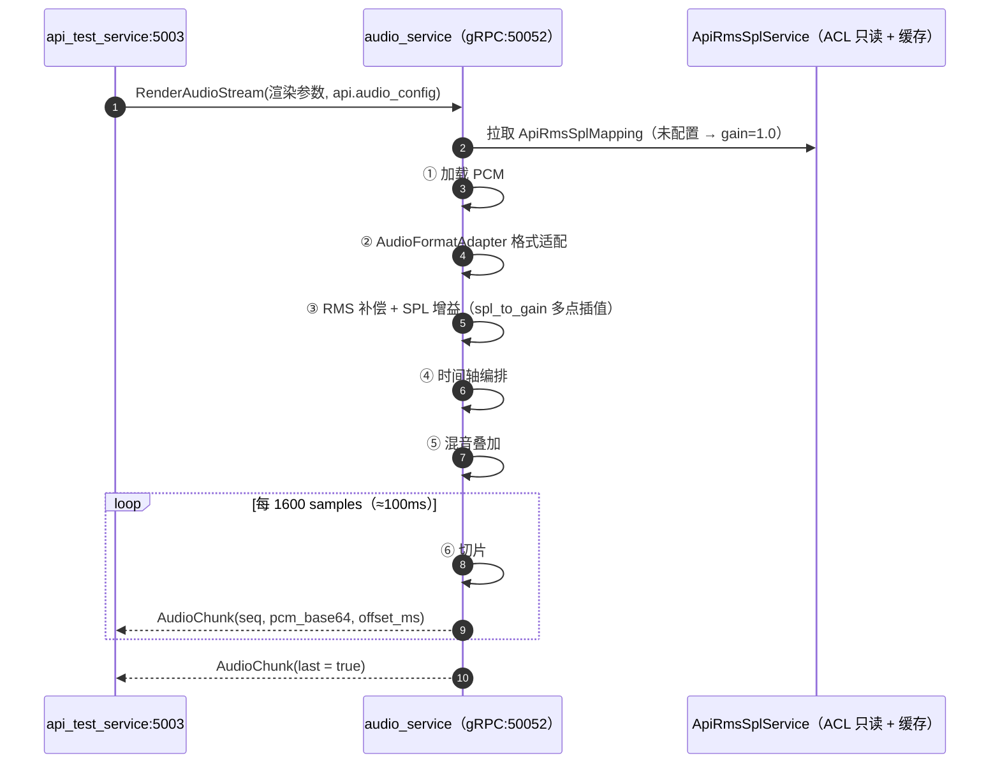

# API测试功能设计文档

| 项目 | 内容 |
| --- | --- |
| 版本 | v3.0（V9.7.31 适配版，2026-09-10，按测试执行 v3.0 设计修订） |
| 所属域 | 测试执行 · API 测试 |
| 口径基准 | 同目录 `01_UseCase总览.md`、`02_架构设计.md`、`05_路由与废弃.md`（如与本篇冲突，以三者为准） |
| 关联文档 | `06_评估与前端.md`、`07_流式推送与结果获取.md`、`08_混音与SPL映射.md` |
| 适用仓库 | `d:\00_code\V9.7.31\Intelligent-Audio-TEST` |

---

## 修订说明（v3.0）

【适配说明】本文档为 V9.7.31 独有旧文档（V9.7.10 无对应文件），原文基于「Flask 单体 + Flask-SocketIO + WebSocket 直连（`ws://localhost:5000/ws/api-test`）+ asyncio 并发压测（ConcurrentApiTester），以 QPS/RTT/SLA 为核心指标」的旧设计。本轮保留"API 测试功能设计"整体定位与 12 章骨架，将全部执行语义替换为「测试执行 v3.0」并落位 V9.7.31 微服务拓扑：

| # | 修订点 | v3.0 语义 |
| --- | --- | --- |
| 1 | 执行路由 | `device_type`（physical / http_api / websocket_api）为唯一路由依据；废弃 `task.type` / `test_type` 字符串判断；`TaskType` 不引入 `'realtime_api'` |
| 2 | 执行链路 | api_gateway:5000 → task_service:5001（`_dispatch_api_case`）→ Redis `task:queue` → api_test_service:5003（replicas:2，`worker_instance_id` 归属 + `RedisServiceRegistry` 心跳 + 孤儿收养）→ `HttpAPIAdapter` / `HttpStreamAdapter` / `RealtimeAPIAdapter` 按 `(protocol, vendor)` 注册表 |
| 3 | 混音 | audio_service gRPC:50052 新增 server-streaming RPC `RenderAudioStream`（新增）；离线混音 6 步 → 100ms base64 chunk；`AudioFormatAdapter` 格式适配到 `api.audio_config` |
| 4 | SPL | `ApiRmsSplMapping` 聚合 + `api_rms_spl_mappings` 表（新增）；`SPLMappingService.spl_to_gain` 多点插值；`/api/digital-spl` 路由（新增）；校准互斥 `DistributedLock` |
| 5 | Realtime | `RealtimeSessionExecutor`（新增）：生产者-消费者事件队列、frame/summary 双通道、barge-in 打断检测、「超时但已开口视为成功」、`RealtimeEventType` 11 种归一化事件（新增枚举） |
| 6 | 事件 | Redis EventBus → api_gateway 订阅 → Socket.IO `task_id` 房间；**不再直连 WebSocket** |
| 7 | 评估 | evaluation_service:5004 经 EventBus 订阅；result_type 映射（`'api'` / `'realtime'` 新增）；`CASE_EVALUATION_COMPLETED` |
| 8 | 数据模型 | `api_models.py` API 类新增 device_type / adapter_class / audio_config / output_types 四列；`StartAPITestRequest` 新增 device_type |
| 9 | 枚举 | `shared/models/common_enums.py` 与 `frontend/src/domain/enums.ts` 同步新增 DeviceType / OutputType / CalibrationStatus |
| 10 | 密钥链 | OpenAI 密钥：case_config → meta → env `OPENAI_API_KEY` 逐级回退 |
| 11 | 前端 | DDD 四层镜像，Infrastructure 唯一知道 snake_case；SPLMapping 五层对称模板为页面模板 |

原文档第 7 章中 QPS / RTT / SLA / 并发压测等通用性能指标**保留**，标注见 7.1 节。

---

## 1. 概述

### 1.1 文档目的

本文档描述 V9.7.31「API 测试」子域的功能设计：以被测 API（HTTP / HTTP 流式 / Realtime WebSocket）为被测对象，在微服务拓扑下完成任务路由、适配器执行、混音下发、SPL 数字增益映射、实时推送与结果评估的端到端设计。本文档是 `01_测试执行/` 文档族的 API 侧专项设计，执行语义遵循 v3.0 总体设计。

### 1.2 功能范围与 UseCase 映射

| UC | 名称 | 本文落位 |
| --- | --- | --- |
| UC-0901 | 被测 API 管理（CRUD + 连接测试） | 3.1 |
| UC-0902 | RMS SPL 映射校准（API 侧数字增益） | 3.5 |
| UC-0903 | 创建任务关联设备（device_type 判定） | 2.4 / 6.2 |
| UC-1001 | 事件隔离（task_id 房间） | 2.6 |
| UC-1002 | frame / summary 双通道 | 3.6 |
| UC-1003 | 新增厂商适配器（注册表扩展点） | 3.2 |

### 1.3 术语表

| 术语 | 含义 |
| --- | --- |
| device_type | 设备/执行类型三值枚举：physical（物理设备）、http_api（HTTP API）、websocket_api（Realtime WS API） |
| adapter_class | API 聚合上的显式适配器类名，非空时在适配器注册表中优先 |
| audio_config | API 聚合上的目标音频格式配置（采样率/位深/声道），供 AudioFormatAdapter 适配 |
| output_types | API 聚合上声明的产出类型集合（OutputType） |
| worker_instance_id | 任务在多副本 api_test_service 中的归属实例标识 |
| frame 通道 | Realtime 会话的实时帧事件流：不落库，仅经 Socket.IO 推送 |
| summary 通道 | Realtime 会话的汇总结果：落库 + 对象存储，触发评估 |
| barge-in | 用户开口打断 AI 播报；由 `user_speech_started` 触发打断检测 |
| RealtimeEventType | Realtime 归一化事件枚举（11 种，新增） |
| RenderAudioStream | audio_service 新增的 server-streaming 混音渲染 RPC（新增） |
| ApiRmsSplMapping | API 侧 RMS→SPL 映射聚合（新增），物理侧对称物为 SPLMapping |
| 孤儿收养 | `_adopt_orphan_tasks`：worker 接管心跳过期实例遗留任务（见 02_架构设计.md） |

### 1.4 架构原则

- DDD + CQRS + 微服务 + Redis 分布式（无 MQ）；先重构（路由/DDL/枚举），再管消费方。
- 枚举化、配置化：禁止魔法数字、魔法字符串、硬编码；端口经 `service_ports.py`、并发参数经 `concurrency_config.json` 管理。
- 分开发/生产环境配置（环境矩阵见 02_架构设计.md）。
- 前端 DDD 四层镜像：Infrastructure 层唯一知道 snake_case。

---

## 2. 系统架构设计

### 2.1 微服务落位【适配说明】

【适配说明】原文档"Flask + Flask-SocketIO 单体三层架构（表现/业务/数据）"废除，落位 V9.7.31 十二服务拓扑；端口统一由 `service_ports.py` 配置化管理，禁止硬编码。

| 服务 | 端口 | 与本文相关的职责 |
| --- | --- | --- |
| api_gateway | 5000 | 鉴权/对外路由；订阅 EventBus → Socket.IO 房间转发 |
| task_service | 5001 | 任务编排：`_dispatch_case_by_type` / `_dispatch_api_case` |
| e2e_test_service | 5002 | physical 链路端到端执行 |
| api_test_service | 5003 | **API 测试执行主体（部署 replicas:2）** |
| evaluation_service | 5004 | 结果评估（经 EventBus 订阅） |
| report_service | 5006 | 报告生成 |
| algorithm_service | 5007 | 算法支撑 |
| api_adapter_service | 5008 | 旧适配服务，其职责由 API 适配器注册表承接，P3 下线【适配说明】 |
| auth_service | 5009 | 认证鉴权 |
| audio_service | gRPC:50052 | 混音（RenderAudioStream）、SPL（spl_to_gain）、播放 |
| device_service | gRPC:50053 | 物理设备管理 |

### 2.2 分层架构

- **后端**：Interface（proto / api_gateway）→ Application（executor / service 编排）→ Domain（聚合 / 枚举，零框架依赖）→ Infrastructure（persistence / adapter / redis / http）。
- **前端**：DDD 四层镜像（见 5.2）。

### 2.3 API 测试执行链路总览


```mermaid
sequenceDiagram
    autonumber
    participant FE as 前端（Presentation）
    participant GW as api_gateway:5000
    participant TS as task_service:5001
    participant R as Redis
    participant API as api_test_service:5003（replicas:2）
    participant EXT as 被测 API
    participant EV as EventBus（Redis）
    participant EVAL as evaluation_service:5004

    FE->>GW: StartAPITest（task_id, device_type）
    GW->>TS: gRPC StartAPITest
    TS->>TS: _dispatch_case_by_type（DeviceType 枚举判断）
    TS->>R: LPUSH task:queue
    API->>R: BRPOP task:queue（绑定 worker_instance_id）
    API->>R: RedisServiceRegistry 注册 + 心跳（TTL 15s）
    API->>EXT: HttpAPIAdapter / HttpStreamAdapter / RealtimeAPIAdapter
    EXT-->>API: 响应 / 流 / 归一化事件
    API->>EV: 发布 frame（实时）/ summary（落库）事件
    GW->>EV: 订阅
    GW-->>FE: Socket.IO 推送（room = task_id）
    EV-->>EVAL: summary 事件订阅
    EVAL->>EV: 发布 CASE_EVALUATION_COMPLETED
```

### 2.4 执行路由：device_type 三值【适配说明】

【适配说明】v3.0 以 `device_type` 为**唯一**路由依据。现状代码为魔法字符串判断，属待消除坏味道：

- 现状：`task_service/core/execution_engine/mixins/task_dispatch.py`
  - L89 `_dispatch_case_by_type`（路由入口，改造后按 `DeviceType` 枚举分派）
  - L91 `if task.type == 'api'`（魔法字符串，废弃）
  - L96 `_dispatch_api_case`（保留，目标：api_test_service）
  - L112 `_dispatch_e2e_case`（保留，目标：e2e_test_service）
  - L35 `task.type != 'api'`（魔法字符串，废弃）
- 数据侧：`task_service/infrastructure/persistence/models/task_models.py` L84 `TaskCase` **已有** `device_id` 列（L111），新增 `device_type` 列。
- 枚举侧：`TaskType` **不引入** `'realtime_api'`；`frontend/src/domain/enums.ts` L24 `TaskType` 保持既有取值，Realtime 语义由 `DeviceType.WEBSOCKET_API` 承担。

路由决策表：

| device_type | 分派方法 | 执行服务 | 适配器 | 说明 |
| --- | --- | --- | --- | --- |
| physical | `_dispatch_e2e_case` | e2e_test_service:5002 | — | 走 audio/device gRPC 物理链路 |
| http_api | `_dispatch_api_case` | api_test_service:5003 | HttpAPIAdapter / HttpStreamAdapter | 一问一答 / 流式 |
| websocket_api | `_dispatch_api_case` | api_test_service:5003 | RealtimeAPIAdapter | WS 长连接，实例内闭环 |

废弃清单（节选，完整 9 项见 `05_路由与废弃.md`）：

1. `task.type == 'api'` / `task.type != 'api'` 字符串判断（task_dispatch.py L91 / L35）；
2. `test_type` 请求参数（proto 请求体）；
3. WebSocket 直连 `ws://localhost:5000/ws/api-test`（改 Socket.IO 房间）；
4. api_adapter_service:5008 独立适配服务（P3 下线）。

### 2.5 多副本执行与任务归属（新增）

- api_test_service 部署 **replicas:2**，经 Redis `task:queue`（LPUSH / BRPOP）消费任务；
- 每个任务绑定 `worker_instance_id`，执行器经 `RedisServiceRegistry`（`shared/utils/service_registry.py` L16）注册，**TTL 15s 心跳**维持存活；
- 孤儿收养 `_adopt_orphan_tasks`：worker 周期扫描心跳过期实例遗留的任务并接管重派（机制详见 02_架构设计.md）；
- Realtime WS 长连接**实例内闭环 + 亲和路由**：会话期间该 task 的事件路由固定到持有连接的实例。

### 2.6 事件通道【适配说明】

【适配说明】废除原文档 Flask-SocketIO 单体内直连 WebSocket 的推送方式，改为 Redis EventBus 中转。

- 基础设施：`shared/utils/redis_pubsub.py` —— `EventChannel`（L21）、`EventType`（L30）、`RedisPubSub`（L51）、`EventBus`（L107）；
- 链路：api_test_service 执行器发布事件 → EventBus → api_gateway 订阅 → Socket.IO 房间（**room = task_id**）→ 前端；
- UC-1001 事件隔离由 task_id 房间实现；
- 频道规划与事件清单详见 `02_架构设计.md`；
- 评估链路复用同一 EventBus（见 3.7 / 6.4）。

---

## 3. 核心功能模块

### 3.1 被测 API 管理（UC-0901）

- gRPC 契约：`shared/proto/api_test_service.proto` 既有 RPC —— `StartAPITest`（L10）、`CreateAPITest`、`CreateAPIConfig`、`UpdateAPIConfig`、`DeleteAPIConfig`、`ListAPIConfigs`、`GetAPIConfig`、`TestAPIConnection`；
- 聚合：`api_test_service/infrastructure/persistence/models/api_models.py` L15 `class API`，既有列：`id / name / vendor / api_url / status / meta / algorithm_type / max_process / max_timeout / max_audio_duration / health_score / api_endpoints`；
- 新增四列：`device_type / adapter_class / audio_config / output_types`（见 6.2）；
- `health_score` 健康分与连接测试沿用，口径见 7.1【保留：通用性能测试口径】。

### 3.2 API 适配器工厂（新增）

- 注册表键：`(protocol, vendor)` 双键注册；`api.adapter_class` 显式指定时**优先**于约定键；
- 内置适配器：
  - **HttpAPIAdapter**：request/response 一问一答（非流式 HTTP）；
  - **HttpStreamAdapter**：HTTP 流式（SSE / chunked）；
  - **RealtimeAPIAdapter**：WebSocket 长连接，厂商事件 → `RealtimeEventType` 归一化；
- 适配器输出统一为 `AdapterOutput`（dataclass，定义见 `07_流式推送与结果获取.md`）；
- UC-1003 扩展点：新增厂商仅需在注册表登记新 `(protocol, vendor)` 条目（或配置 `adapter_class`），不修改执行器；
- 【适配说明】承接旧 api_adapter_service:5008 的适配职责，后者 P3 下线。

### 3.3 会话执行器

- 现状模块：`api_test_service/core/`（api_session_executor.py L33 `class APISessionExecutor`；另有 api_task_runner / api_concurrency_manager / api_executor / api_result_processor / session_context / api_test_service）；
- 骨架：BaseExecutor 五 Mixin —— `ControlMixin / LoggingMixin / ParamsMixin / ResultsMixin / DbMixin`（`shared/infrastructure/base_executor/_base.py`）；
- 新增 `RealtimeSessionExecutor`（`api_test_service/core/realtime_session_executor.py`，待建），见 3.6。

### 3.4 混音与音频下发【适配说明】

- 承载服务：audio_service（gRPC:50052），既有 41 个 RPC（`PlayAudio` / `StopAudio` / `GetPlayStatus` / `GetAudioInfo` / `MeasureSPL` / `StartSPL` / `StopSPL` / `PrepareAudios` / `StartPlayback` / `StopPlayback` 等，`shared/proto/audio_service.proto`）；
- **新增** server-streaming RPC `RenderAudioStream`（现有 proto 无此方法）：

```proto
// shared/proto/audio_service.proto（新增）
rpc RenderAudioStream(RenderAudioStreamRequest) returns (stream AudioChunk);

message AudioChunk {
  int32  seq        = 1;  // 分片序号
  string pcm_base64 = 2;  // PCM 分片（base64）
  int64  offset_ms  = 3;  // 相对时间轴偏移
  bool   last       = 4;  // 终止分片标记
}
```

- 离线混音 6 步（audio_service 进程内完成）：
  1. 加载 PCM 素材；
  2. 格式适配：`AudioFormatAdapter` 按目标 `api.audio_config`（采样率/位深/声道）转换；
  3. RMS 补偿 + SPL 增益：经 `SPLMappingService.spl_to_gain` 多点插值（未配置时 gain = 1.0）；
  4. 多音轨时间轴编排；
  5. 混音叠加；
  6. 切片输出：每 1600 samples（≈ 100ms）一个 chunk → base64；
- 流式下发：`RenderAudioStream` 按 chunk 顺序推送，`last = true` 终止；
- 详见 `08_混音与SPL映射.md`。

### 3.5 SPL 数字增益映射（UC-0902，新增）

- 聚合：`ApiRmsSplMapping` —— API 侧 RMS→SPL 映射，与物理侧 `SPLMapping` **对称设计**（见 08）；
- 表：`api_rms_spl_mappings`（**新增建表**，完整 DDL 以 `05_路由与废弃.md` 为准）；
- 服务：`audio_service/infrastructure/audio/spl_service.py` —— L21 `SPLMappingService`、L34 `spl_to_gain(mapping_id, target_spl)` **多点插值**求增益；未配置映射时 gain = 1.0；
- 数据获取：audio_service 经 ACL **只读拉取**映射数据并本地缓存，不直连业务库；
- 路由：`/api/digital-spl`（**新增**，经 api_gateway 暴露）；
- 校准互斥：`DistributedLock`（`shared/utils/distributed_coordinator.py` L67），

```python
DistributedLock(key=f"calibration:api_rms_spl:{api_id}:{mapping_id}", ttl=30)
```

- 校准状态流转：`CalibrationStatus` 枚举（新增，见 6.4）。

### 3.6 Realtime 实时会话（新增）

- 执行器：`RealtimeSessionExecutor`（待建），**生产者-消费者**事件队列：`_recv_loop` daemon 线程收包 → `queue.Queue` → 主循环消费；
- 归一化事件 11 种（`RealtimeEventType` 枚举，**新增**）：

| 事件 | 说明 |
| --- | --- |
| ai_audio_delta | AI 音频增量帧 |
| ai_audio_done | AI 音频完毕 |
| ai_text_delta | AI 文本增量 |
| ai_text_done | AI 文本完毕 |
| user_speech_started | 用户开口（barge-in 触发源） |
| user_speech_stopped | 用户停顿 |
| response_cancelled | 响应被打断取消 |
| error | 会话错误 |
| session.created | 会话建立 |
| session.updated | 会话参数更新 |
| connection_closed | 连接关闭 |

- frame / summary 双通道（UC-1002）：
  - **frame**：不落库，仅经 EventBus → Socket.IO（room = task_id）实时推送前端渲染；
  - **summary**：会话汇总落库 + 对象存储 `api-test-results/<task_id>/<session_id>/summary.json`，触发评估；
- barge-in 打断检测：捕获 `user_speech_started` 即判定用户开口，经 RealtimeAPIAdapter 下行指令下发 `response_cancelled`；
- 判定规则：**「超时但已开口视为成功」**——会话超时但已捕获 `user_speech_started` 的，按成功收敛，进入 summary 与评估链路；
- 连接管理：WS 长连接实例内闭环 + 亲和路由（见 2.5）。

### 3.7 密钥与配置（新增）

- OpenAI 密钥链（逐级回退）：`case_config`（用例配置）→ `meta`（`api_models.API.meta`）→ 环境变量 `OPENAI_API_KEY`；
- 密钥不落日志、不进报告；密钥解析统一收敛在 Infrastructure 层密钥提供者，Domain 层只见解析结果。

---

## 4. 核心流程图

### 4.1 API 测试任务总流程

见 2.3 时序图。要点：device_type 路由 → 队列消费 → 适配器执行 → 双通道事件 → 评估。

### 4.2 Realtime 流式会话流程（新增）


```mermaid
sequenceDiagram
    autonumber
    participant EXE as RealtimeSessionExecutor（新增）
    participant AD as RealtimeAPIAdapter
    participant V as 厂商 WS 端
    participant Q as queue.Queue
    participant EV as EventBus
    participant ST as 对象存储

    EXE->>AD: connect（websocket_api 会话）
    AD->>V: WebSocket 握手
    V-->>AD: session.created / session.updated
    AD->>EXE: _recv_loop（daemon 线程）入队
    V-->>AD: ai_audio_delta / ai_text_delta / user_speech_started ...
    AD-->>Q: 归一化事件（RealtimeEventType）
    EXE->>EV: frame 事件（不落库，Socket.IO room=task_id 推送）
    EXE->>EXE: barge-in：user_speech_started → 下发 response_cancelled
    V-->>AD: ai_audio_done / ai_text_done / connection_closed
    EXE->>ST: summary.json（api-test-results/<task_id>/<session_id>/）
    EXE->>EV: summary 事件 → 触发评估
    Note over EXE,V: 「超时但已开口视为成功」：超时但已捕获 user_speech_started → 按成功收敛
```

### 4.3 混音流式渲染流程（新增）


```mermaid
sequenceDiagram
    autonumber
    participant API as api_test_service:5003
    participant AU as audio_service（gRPC:50052）
    participant DB as ApiRmsSplService（ACL 只读 + 缓存）

    API->>AU: RenderAudioStream(渲染参数, api.audio_config)
    AU->>DB: 拉取 ApiRmsSplMapping（未配置 → gain=1.0）
    AU->>AU: ① 加载 PCM
    AU->>AU: ② AudioFormatAdapter 格式适配
    AU->>AU: ③ RMS 补偿 + SPL 增益（spl_to_gain 多点插值）
    AU->>AU: ④ 时间轴编排
    AU->>AU: ⑤ 混音叠加
    loop 每 1600 samples（≈100ms）
        AU->>AU: ⑥ 切片
        AU-->>API: AudioChunk(seq, pcm_base64, offset_ms)
    end
    AU-->>API: AudioChunk(last = true)
```

### 4.4 SPL 校准流程（UC-0902，新增）

```mermaid
flowchart TD
    A[发起 API RMS-SPL 校准] --> B{DistributedLock<br/>calibration:api_rms_spl:{api_id}:{mapping_id}<br/>ttl=30}
    B -- 获取失败 --> C[返回校准冲突]
    B -- 获取成功 --> D[采样 RMS / 目标 SPL 点集]
    D --> E[写入 api_rms_spl_mappings<br/>CalibrationStatus 状态流转]
    E --> F[audio_service ACL 缓存刷新]
    F --> G[释放锁]
```

---

## 5. 用户界面设计

### 5.1 页面结构【适配说明】

【适配说明】废除原文档 Flask 模板渲染 + ws 直连页面，落位 Vue3 SPA + DDD 四层。

- `frontend/src/views/APITest/APITest.vue`（已存在）：任务创建（选设备 → 判定 device_type）/ 执行监控（frame 通道）/ 结果查看（summary + 评估）；
- `frontend/src/views/SPLMapping/SPLMapping.vue` + `SPLMapping.ts`：SPL 校准页（对接 `/api/digital-spl`，新增）；
- 页面交互遵循既有 `ViewMode`（`shared/models/common_enums.py` / `frontend/src/domain/enums.ts`）口径。

### 5.2 前端 DDD 四层【适配说明】

```
Presentation    views/ + components/            只见 camelCase Domain + composables（Ports）
Application     composables/ + store/           编排用例，缓存 ReadModel，只见 Domain
Domain          domain/model/ + enums.ts        camelCase、零依赖、无索引签名兜底
Infrastructure  api/ + adapters/ + dto/ + http/ 唯一知道 snake_case
```

### 5.3 实时推送展示

- Socket.IO 客户端按 `room = task_id` 订阅（UC-1001）；
- frame 通道渲染增量内容（文字流 / 音频进度条），对应 `ai_text_delta` / `ai_audio_delta` 等；
- 事件类型在前端以枚举消费（camelCase）；snake_case 报文由 `dto/` + `adapters/` 转换，Presentation 层不感知。

### 5.4 SPLMapping 五层对称模板（新增）

SPLMapping 页面为本轮前端四层的**对称模板**，API 测试页按其铺开：

| 层 | SPLMapping（已存在） | APITest（新增） |
| --- | --- | --- |
| Presentation | `views/SPLMapping/SPLMapping.vue` + `.ts` | `views/APITest/APITest.vue` + `.ts` |
| Application | `composables/device/splPort.ts` | `composables/apiTest/apiPort.ts`（新增） |
| Domain | `domain/model/spl.ts` | `domain/model/apiTest.ts`（新增） |
| Infrastructure | `infrastructure/api/splApi.ts`、`adapters/splAdapter.ts`、`dto/splDto.ts` | `infrastructure/api/apiApi.ts`、`adapters/apiAdapter.ts`、`dto/apiDto.ts`（新增） |

---

## 6. 技术实现

### 6.1 后端模块落位

| 模块路径 | 职责 |
| --- | --- |
| `task_service/core/execution_engine/mixins/task_dispatch.py` | `_dispatch_case_by_type` / `_dispatch_api_case` / `_dispatch_e2e_case`（路由） |
| `api_test_service/core/api_session_executor.py` | L33 `APISessionExecutor`（既有执行器） |
| `api_test_service/core/realtime_session_executor.py` | `RealtimeSessionExecutor`（新增，待建） |
| `audio_service/infrastructure/audio/spl_service.py` | L21 `SPLMappingService`、L34 `spl_to_gain` |
| `shared/utils/redis_pubsub.py` | EventBus / RedisPubSub / EventChannel / EventType |
| `shared/utils/service_registry.py` | L16 `RedisServiceRegistry`（心跳注册） |
| `shared/utils/distributed_coordinator.py` | L67 `DistributedLock`、L153 `DistributedSemaphore` |
| `shared/infrastructure/base_executor/_base.py` | BaseExecutor 五 Mixin |

### 6.2 数据模型【适配说明】

- `api_test_service/infrastructure/persistence/models/api_models.py` L15 `class API` **新增四列**：
  - `device_type`：DeviceType 取值（http_api / websocket_api）；
  - `adapter_class`：显式适配器类名（可空；注册表中优先）；
  - `audio_config`：JSON（目标采样率 / 位深 / 声道，供 AudioFormatAdapter）；
  - `output_types`：JSON（OutputType 集合，声明产出类型）；
- `task_service/infrastructure/persistence/models/task_models.py` L84 `TaskCase`：`device_id` 列**已有**（L111）；`device_type` 列**新增**；
- 新表 `api_rms_spl_mappings`（**新增**）：api 关联的 RMS→SPL 采样点集 + 校准状态 + 审计字段；完整 DDL 以 `05_路由与废弃.md` 为准。

### 6.3 gRPC 契约【适配说明】

- `shared/proto/api_test_service.proto` L46 `StartAPITestRequest`：现状仅 `task_id` → **新增** `device_type`、`device_id`（physical 归属校验用）；示例见 `05_路由与废弃.md`；
- `shared/proto/audio_service.proto`：**新增** `RenderAudioStream`（server-streaming，见 3.4）。

### 6.4 枚举化【适配说明】

- `shared/models/common_enums.py`（既有 ReportStatus / TaskStatus / ReportType / TestType / FieldType / ViewMode / RedisKeyPrefix / EvalTaskStatus 8 枚举）**新增**：
  - `DeviceType`：physical / http_api / websocket_api；
  - `OutputType`：产出类型（text / audio 等）；
  - `CalibrationStatus`：校准状态机；
- **新增** `RealtimeEventType`：11 种归一化事件（见 3.6）；
- 前端 `frontend/src/domain/enums.ts` 同步**新增**三枚举；`TaskType`（L24）**不引入** `'realtime_api'`；
- result_type 映射（评估侧，详见 `06_评估与前端.md`）：

| 执行模式 | result_type |
| --- | --- |
| physical 实时 | `'real-time'`（既有） |
| physical 非实时 | `'non-real-time'`（既有） |
| http_api | `'api'`（新增） |
| websocket_api | `'realtime'`（新增） |

- 魔法字符串清理：现状 `task.type == 'api'`（task_dispatch.py L91）等一律替换为枚举判断（先重构，再管消费方）。

### 6.5 Redis 键规划（配置化，前缀经 `RedisKeyPrefix` 枚举）

| 键 | 用途 |
| --- | --- |
| `task:queue` | 任务队列（LPUSH / BRPOP） |
| `lock:task:physical:{device_id}` | physical 设备互斥 |
| `api:sem:{api_id}` / `sem:api:endpoint:{host}` | 被测端点并发闸（DistributedSemaphore） |
| `calibration:api_rms_spl:{api_id}:{mapping_id}` | SPL 校准互斥锁（ttl=30） |

---

## 7. 性能与可靠性设计

### 7.1 通用性能指标

> 【保留：通用性能测试口径，与本轮 device_type 化改造正交】

本节沿用原文档口径，指标定义、采样方式与阈值不变：

| 指标 | 口径 | 说明 |
| --- | --- | --- |
| QPS | 单位时间成功请求数 | 压测工具口径保留 |
| RTT | 请求往返时延（P50 / P95 / P99） | 保留分位数统计 |
| SLA | 可用性 / 成功率目标 | 保留阈值告警 |
| 并发压测 | ConcurrentApiTester 阶梯加压 | 保留 |
| 健康监控 | ApiHealthMonitor + `health_score` | `api_models.API.health_score` 列沿用 |

上述能力与本轮 device_type 化改造**正交**：路由与适配器层不改变性能指标口径。

### 7.2 v3.0 并发与互斥（新增）

- 被测端点并发闸：`DistributedSemaphore`（`shared/utils/distributed_coordinator.py` L153），键 `api:sem:{api_id}` / `sem:api:endpoint:{host}`；
- physical 设备互斥：`lock:task:physical:{device_id}`（同一物理设备同时仅一个任务）；
- SPL 校准互斥：`calibration:api_rms_spl:{api_id}:{mapping_id}`，ttl=30（见 3.5）；
- 并发参数配置化：`concurrency_config.json`，禁止硬编码。

### 7.3 高可用与容错（新增）

- api_test_service **replicas:2**；worker 心跳 TTL 15s；心跳过期由 `_adopt_orphan_tasks` 孤儿收养接管；
- Realtime 长连接亲和路由，保证会话事件归属一致；
- EventBus 事件消费幂等（task_id + 事件序号去重）；
- Realtime 判定容错：「超时但已开口视为成功」（见 3.6）。

---

## 8. 安全设计

### 8.1 密钥管理（新增）

- OpenAI 密钥链逐级回退：case_config → meta → env `OPENAI_API_KEY`（见 3.7）；
- 密钥与敏感头不出 Infrastructure 层；日志与 summary 报告统一脱敏。

### 8.2 并发与互斥安全

- 分布式锁 / 信号量统一由 `shared/utils/distributed_coordinator.py` 提供，TTL 防死锁；
- 校准、physical 执行、endpoint 并发三类关键资源全部收敛到显式互斥/闸口。

### 8.3 传输与鉴权

- 对外统一经 api_gateway:5000 鉴权（auth_service:5009 签发凭据）；
- 服务间 gRPC 内网互信 + proto 契约校验；Socket.IO 握手鉴权后方可加入 task_id 房间。

### 8.4 数据安全

- summary.json 写对象存储 `api-test-results/<task_id>/<session_id>/summary.json`，按 task/session 隔离；
- frame 通道不落库，降低实时语音/文本的持久化暴露面。

---

## 9. 测试与维护

- **单元测试**：适配器归一化（RealtimeEventType 11 种全覆盖）、`spl_to_gain` 多点插值边界、OpenAI 密钥链回退顺序；
- **集成测试**：api_gateway ↔ task_service ↔ api_test_service 双副本链路；EventBus → Socket.IO 房间隔离（UC-1001）；RenderAudioStream 分片连续性；
- **灰度策略**：device_type 白名单开关，旧 `task.type` 路径并行运行直至废弃清单收尾（先重构，再管消费方）；
- **监控维护**：task:queue 深度、worker 心跳 TTL、锁等待时长、replicas 副本均衡。

---

## 10. 未来规划（P0~P3）

| 阶段 | 内容 | 详见 |
| --- | --- | --- |
| P0 | device_type 路由改造（task_dispatch 枚举化）、DDL（API 四列 / TaskCase 增列 / api_rms_spl_mappings 建表）、三枚举新增、废弃清单落地 | `05_路由与废弃.md` |
| P1 | 适配器注册表（HttpAPI / HttpStream / Realtime）、RealtimeSessionExecutor、RealtimeEventType、RenderAudioStream RPC | `02_架构设计.md`、`07_流式推送与结果获取.md` |
| P2 | ApiRmsSplMapping 校准链路、`/api/digital-spl` 路由、SPLMapping 五层模板铺开至 APITest 页 | `08_混音与SPL映射.md` |
| P3 | api_adapter_service:5008 下线、废弃清单收尾 | `02_架构设计.md` |

排期与完整迁移时间线以 `05_路由与废弃.md` / `02_架构设计.md` 为准。

---

## 11. 结论

v3.0 修订后，API 测试子域从"单体 + WebSocket 直连 + 通用压测"演进为"device_type 三值路由 + 微服务多副本 + 适配器注册表 + EventBus 房间推送 + frame/summary 双通道"的执行体系；混音与 SPL 数字增益由 audio_service 统一承载（RenderAudioStream / spl_to_gain），Realtime 会话获得归一化事件与 barge-in 语义。原文档通用性能口径（QPS / RTT / SLA）保留为正交能力。全部新增项与改造项均已对齐 `01_UseCase总览.md`、`02_架构设计.md`、`05_路由与废弃.md`。

---

## 12. 参考资料

**基准文档（口径冲突时以其为准）**

- `doc/功能设计文档/01_测试执行/01_UseCase总览.md`
- `doc/功能设计文档/01_测试执行/02_架构设计.md`
- `doc/功能设计文档/01_测试执行/05_路由与废弃.md`
- `doc/功能设计文档/01_测试执行/06_评估与前端.md`
- `doc/功能设计文档/01_测试执行/07_流式推送与结果获取.md`
- `doc/功能设计文档/01_测试执行/08_混音与SPL映射.md`

**关键代码路径**

- `shared/proto/api_test_service.proto`（L10 StartAPITest、L46 StartAPITestRequest）
- `shared/proto/audio_service.proto`（RenderAudioStream 新增）
- `shared/models/common_enums.py`（DeviceType / OutputType / CalibrationStatus 新增）
- `shared/utils/redis_pubsub.py`、`shared/utils/service_registry.py`、`shared/utils/distributed_coordinator.py`
- `shared/infrastructure/base_executor/_base.py`
- `task_service/core/execution_engine/mixins/task_dispatch.py`
- `task_service/infrastructure/persistence/models/task_models.py`
- `api_test_service/infrastructure/persistence/models/api_models.py`
- `api_test_service/core/`（api_session_executor.py 等；realtime_session_executor.py 待建）
- `audio_service/infrastructure/audio/spl_service.py`
- `frontend/src/domain/enums.ts`
- `frontend/src/views/APITest/APITest.vue`、`frontend/src/views/SPLMapping/SPLMapping.vue`
- `frontend/src/composables/device/splPort.ts`、`frontend/src/infrastructure/{api,adapters,dto}/spl*.ts`、`frontend/src/domain/model/spl.ts`
