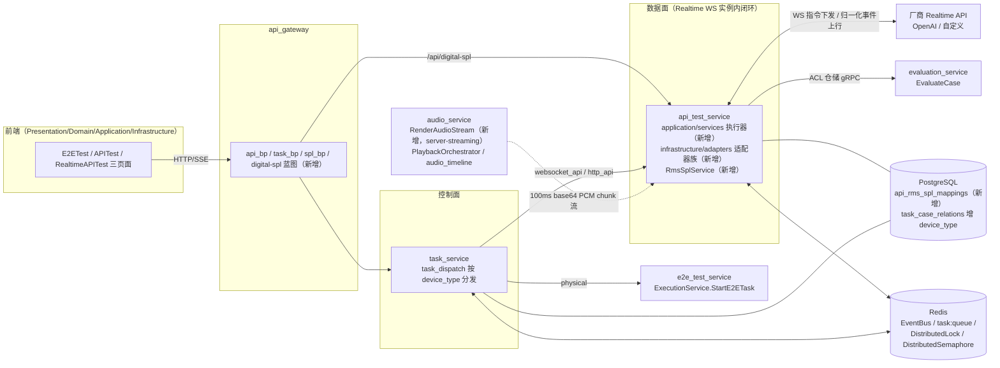

# Realtime API Adapter 方案与 UseCase 文档（V9.7.31 微服务版 · 索引）

> 版本：V9.7.31 v1.0（2026-09-10）｜适配自 V9.7.10《Realtime_API_Adapter方案与UseCase文档》v3.1
>
> 架构基线：DDD + CQRS + 微服务 + Redis 分布式（复用 Redis EventBus + `task:queue`，不引入 MQ）
>
> 定位：本文为**方案概述 + UseCase 索引**。类级细节详见 04，流式推送与结果获取细节详见 07。

---

## 一、方案概述

### 1.1 目标与范围

为语音大模型被测设备提供「API 直连」测试执行模式：在 V9.7.31 微服务版图下，以统一 Adapter 体系接入 `websocket_api`（Realtime 会话）与 `http_api`（请求-响应）两类被测 API，产出**帧结果 + 最终结果**；Realtime 音频流经 audio_service 混音并叠加 SPL 增益补偿后，进入统一的评估与报告链路，与 E2E（`physical` 设备）测试保持对称语义。

设计语义与 V9.7.10 原方案完全一致（device_type 路由、Adapter 体系、Realtime 执行、SPL 映射），仅**落位按服务边界重新分布**；不新建服务、不引入 MQ。

### 1.2 核心决策

| # | 决策 | 说明 |
|:---:|------|------|
| 1 | **device_type 路由，TaskType 不扩** | `task_service` 的 `TaskCase`（表 `task_case_relations`）新增 `device_type` 列（新增），调度按其分发：`websocket_api`/`http_api` → `api_test_service`，`physical` → `e2e_test_service`；前端 `TaskType` 不引入 `'realtime_api'` |
| 2 | **Adapter 族内聚于 api_test_service** | `BaseAPIAdapter`/`HttpAPIAdapter`/`HttpStreamAdapter`/`RealtimeAPIAdapter`/`OpenAIRealtimeAdapter`/`APIAdapterFactory` 全部落位 `api_test_service/infrastructure/adapters/`（新增），`api_adapter_service` 独立服务于 P3 下线 |
| 3 | **执行器继承共享 BaseExecutor** | `RealtimeSessionExecutor`/`APISessionExecutor` 落位 `api_test_service/application/services/`（新增），继承 `shared/infrastructure/base_executor/BaseExecutor`（五 mixin：`ControlMixin`/`LoggingMixin`/`ParamsMixin`/`ResultsMixin`/`DbMixin`） |
| 4 | **混音外置为 gRPC server-streaming** | audio_service 新增 `RenderAudioStream`（复用 `PlaybackOrchestrator`/`audio_timeline`），输出 100ms base64 PCM chunk（`SAMPLE_RATE=24000`，常量配置化）；SPL 增益由 api_test_service 的 `RmsSplService.spl_to_gain(api_id)` 预计算后随混音请求传入，audio_service 不感知 SPL 语义 |
| 5 | **SPL 映射聚合归属 api_test_service** | `ApiRmsSplMapping` 聚合（表 `api_rms_spl_mappings`，新增）走 DDD 五层 + gRPC `ApiRmsSplConfigService`（新增）+ 网关 `/api/digital-spl` 蓝图（新增），与设备侧 SPL 映射（`device_service`，现有 `spl_bp.py`）隔离 |
| 6 | **评估走跨服务 ACL** | `ResultsMixin` → api_test_service ACL 仓储 → `evaluation_service.EvaluateCase`（现有 RPC，`EvaluateCaseRequest` 扩展 `device_type`/`first_frame_ms`/`event_log`/`frame_results`，`result_type='realtime'`） |
| 7 | **数据面实例内闭环 + Redis 分布式协调** | `api_test_service` `replicas:2` 下，Realtime WS 会话数据面在单实例内闭环（不跨实例转发）；`physical` 互斥与同 endpoint 并发控制复用 `shared/utils/distributed_coordinator.py` 的 `DistributedLock`/`DistributedSemaphore`；断点恢复按 `worker_instance_id` 收养 |

### 1.3 与 V9.7.10 原方案的关键差异（适配点）

| 主题 | V9.7.10（单体） | V9.7.31（微服务） |
|------|----------------|-------------------|
| 路由分发 | `ExecutionEngine` 进程内按 `device_type` 分发 | `task_service/core/execution_engine/mixins/task_dispatch.py`（`_dispatch_case_by_type`）按 `device_type` 跨服务 gRPC 分发 |
| Adapter 落位 | 单体 `adapters/` 包 + `api_adapter_service` 雏形 | `api_test_service/infrastructure/adapters/` 六文件（新增），`api_adapter_service` 下线 |
| 执行器 | `RealtimeSessionExecutor` 单体内实现 | `api_test_service/application/services/`（新增），继承 `BaseExecutor` 五 mixin，状态更新/结果保存/评估提交走 `DbMixin`/`ResultsMixin` |
| 混音 | `AudioStreamOrchestrator` 进程内混音 | 拆为 audio_service `RenderAudioStream`（新增，server-streaming）+ 执行器侧流式消费 |
| SPL 映射 | `ApiRmsSplMapping` 与设备 SPL 混在同一模块 | 独立聚合（表 `api_rms_spl_mappings`，新增）+ `ApiRmsSplConfigService`（新增）+ `/api/digital-spl` 蓝图（新增） |
| 任务模型 | 用例关联无设备类型概念 | `task_case_relations` 增 `device_type` 列 + `idx_tc_rel_device` 索引（新增） |
| 评估 | 进程内调用评估 | ACL 仓储跨服务 gRPC：`evaluation_service.proto` 的 `EvaluateCase`（现有，入参扩展） |
| 并发控制 | 进程内信号量 | `DistributedLock`/`DistributedSemaphore`（现有 `distributed_coordinator.py`）+ `worker_instance_id` 收养 |
| 魔法值 | 散落字符串/数字 | 枚举化：`shared/models/common_enums.py` 新增 `DeviceType`/`APIProtocol`/`OutputType`/`CalibrationStatus`；前端 `domain/enums.ts` 镜像（新增） |

### 1.4 总览图（服务边界 + 数据面/控制面）

---

## 二、UseCase 索引

| UC | 名称 | 涉及服务 | 关键落位文件 | 详见 |
|:---:|------|------|------|:---:|
| UC-0901 | 新增被测 API（websocket_api / http_api） | api_test_service、api_gateway | `application/handlers/command_handlers.py`、`domain/value_objects/api_config.py`、`domain/services/api_validator.py`、`infrastructure/persistence/models/api_models.py`（现有 DDD 五层承载 `APITestService.CreateAPIConfig` 等 CRUD）；协议用 `APIProtocol`（新增） | [01_UseCase总览.md](01_UseCase总览.md) |
| UC-0902 | 配置 RMS→SPL 映射（数字被测设备） | api_test_service、api_gateway | `domain/` 下 `ApiRmsSplMapping` 聚合（表 `api_rms_spl_mappings`，新增）；`application/services/` 下 `RmsSplService`（新增，含 `spl_to_gain(api_id)`）；`shared/proto/api_test_service.proto` 增 `ApiRmsSplConfigService`（新增）；`api_gateway/routes/digital_spl_bp.py`（新增）；标定状态用 `CalibrationStatus`（新增） | [01_UseCase总览.md](01_UseCase总览.md)、[04_类设计.md](04_类设计.md) |
| UC-0903 | 创建任务并关联被测设备 | task_service、api_gateway | `task_service/infrastructure/persistence/models/task_models.py` 的 `TaskCase`（表 `task_case_relations`）增 `device_type` 列 + `idx_tc_rel_device` 索引（新增）；`core/execution_engine/mixins/task_dispatch.py` 按 `device_type` 分发（扩展）；`DeviceType`（新增） | [05_路由与分布式.md](05_路由与分布式.md) |
| UC-1001 | 厂商事件字段隔离（归一化） | api_test_service | `infrastructure/adapters/realtime_api_adapter.py`、`openai_realtime_adapter.py`（新增）：厂商原始事件 → 归一化 `type` 映射表 | [04_类设计.md](04_类设计.md)、[07_流式推送与结果获取.md](07_流式推送与结果获取.md) |
| UC-1002 | 保留帧结果与最终结果并提交评估 | api_test_service、evaluation_service | `infrastructure/adapters/realtime_api_adapter.py`（帧结果/最终结果，新增）；`application/services/realtime_session_executor.py`（新增）；`shared/infrastructure/base_executor/_results_mixin.py`（`ResultsMixin`，现有）→ `infrastructure/acl/evaluation_acl_repository.py`（现有）→ `EvaluateCase`（入参扩展，`result_type='realtime'`） | [07_流式推送与结果获取.md](07_流式推送与结果获取.md)、[06_评估与前端.md](06_评估与前端.md) |
| UC-1003 | 新增厂商适配器（扩展点） | api_test_service | `infrastructure/adapters/api_adapter_factory.py`（注册扩展点，新增）、`base_api_adapter.py`（`AdapterOutput` 契约，新增） | [04_类设计.md](04_类设计.md) |

### 关键语义速查

**归一化事件 `type`（全集）**：`ai_audio_delta` / `ai_audio_done` / `ai_text_delta` / `ai_text_done` / `user_speech_started` / `user_speech_stopped` / `response_cancelled` / `error` / `session.created` / `session.updated` / `connection_closed`

**OpenAI 事件映射（示例，全集见 07）**：`response.audio.delta` → `ai_audio_delta`；`input_audio_buffer.speech_started` → `user_speech_started`；`response.cancelled` → `response_cancelled`；`response.done` → `ai_audio_done`

**Realtime WS 下行指令（适配器封装）**：`session.update`、`input_audio_buffer.append`、`input_audio_buffer.commit`、`response.create`

**密钥链（配置化，禁硬编码）**：`case_config → meta → 环境变量 OPENAI_API_KEY`

**分布式恢复**：执行器启动即上报 `worker_instance_id`；实例崩溃后由存活实例按该 ID 收养未完成会话（细节见 05）。

---

## 三、实施阶段

| 阶段 | 内容 | 涉及 |
|:---:|------|------|
| P0 | DB 迁移（`task_case_relations` 增 `device_type` + `idx_tc_rel_device`；新建 `api_rms_spl_mappings`）＋ 枚举（`shared/models/common_enums.py` 增 `DeviceType`/`APIProtocol`/`OutputType`/`CalibrationStatus`，前端 `domain/enums.ts` 镜像）＋ proto（`api_test_service.proto` 增 `ApiRmsSplConfigService`、`audio_service.proto` 增 `RenderAudioStream`、`evaluation_service.proto` 扩展 `EvaluateCaseRequest`） | task_service、api_test_service、audio_service、evaluation_service、shared |
| P1 | adapter 族六文件 + `application/services/` 执行器（`RealtimeSessionExecutor`/`APISessionExecutor`）+ audio_service `RenderAudioStream` + `RmsSplService`；`StartAPITest` 按 `device_type` 分发 | api_test_service、audio_service |
| P2 | 消费方迁移（`task_dispatch` 按 `device_type` 跨服务分发、网关 `/api/digital-spl` 蓝图、前端三页面与枚举消费）＋ 删除废弃实现（废弃清单见 05） | task_service、api_gateway、frontend |
| P3 | `DROP` 单体遗留列 + `api_adapter_service` 下线（服务目录与 `docker/Dockerfile.api_adapter_service` 移除） | api_adapter_service、docker |

---

## 四、配套文档清单

本文档为索引，细则拆分为 7 个子文档（原 V9.7.10 版 08《混音与SPL映射》内容并入 04 与 07）：

| 序号 | 子文档 | 内容说明 |
|:---:|------|------|
| 1 | [01_UseCase总览.md](01_UseCase总览.md) | 核心模型、调用模式、用例结构、被测 API 配置、多模态输出、SPL 处理逻辑、路由总流程图、执行模式对比、UC-0901/0902/0903 详述 |
| 2 | [02_架构设计.md](02_架构设计.md) | 服务边界与数据面/控制面、跨服务 gRPC 契约（ACL 仓储模式）、文件结构、路由分离 |
| 3 | [03_流程图.md](03_流程图.md) | HTTP API 测试流程、Realtime API 测试流程、轮次状态机 |
| 4 | [04_类设计.md](04_类设计.md) | `BaseAPIAdapter`（含 `AdapterOutput`）、`HttpAPIAdapter`/`HttpStreamAdapter`、`RealtimeAPIAdapter`（帧结果/最终结果）、`OpenAIRealtimeAdapter`、`APIAdapterFactory`、`RealtimeSessionExecutor`/`APISessionExecutor`、`ApiRmsSplMapping` 聚合与 `RmsSplService`、混音流程图 |
| 5 | [05_路由与分布式.md](05_路由与分布式.md) | `device_type` 调度分发、数据库改动（`task_case_relations` 增列/索引、`api_rms_spl_mappings` 建表）、分布式锁/信号量与 `worker_instance_id` 收养、废弃清单、实施阶段 |
| 6 | [06_评估与前端.md](06_评估与前端.md) | 三种执行模式对比、评估链路（`ResultsMixin`→ACL→`EvaluateCase`）、前端改动清单（三页面对称、`enums.ts` 镜像、composables Ports） |
| 7 | [07_流式推送与结果获取.md](07_流式推送与结果获取.md) | 归一化事件全集与 OpenAI 映射、WS 指令、`RenderAudioStream` 流式消费（100ms chunk）、帧结果与最终结果持久化、正常轮/打断轮时序、与 E2E 对比 |
