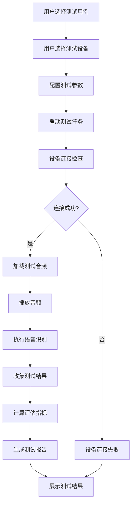
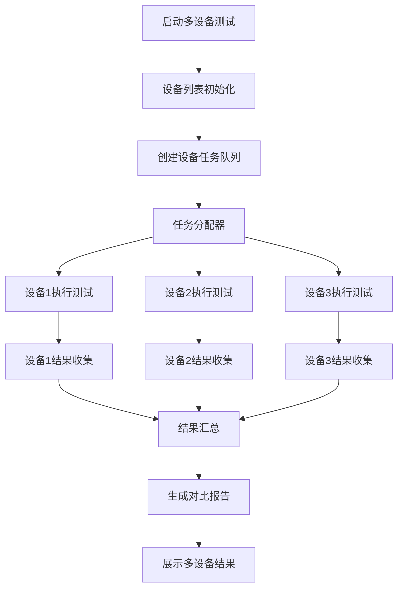
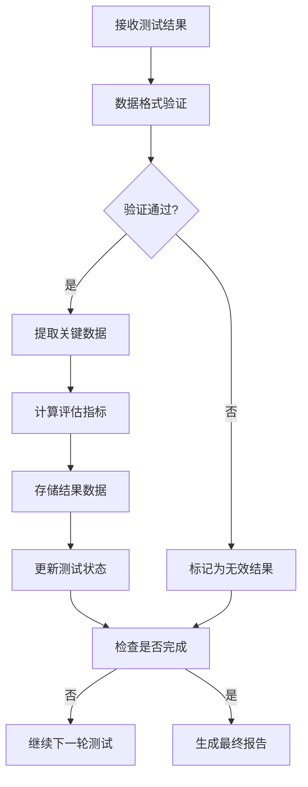

# 端到端测试功能设计文档

## 1. 概述

### 1.1 文档目的

本文档描述智能语音测试系统中端到端测试（E2E Test）功能模块的详细设计，包括功能定位、架构设计、核心流程、技术实现和用户界面等方面。端到端测试功能作为系统的核心测试能力之一，旨在为用户提供在真实设备上执行完整语音测试流程的能力，支持多设备并行测试和实时进度监控。

### 1.2 功能定位

端到端测试功能位于系统测试能力的核心地位，主要解决以下测试场景需求：

- **真实设备验证**：在真实Android和鸿蒙设备上执行语音测试，模拟真实用户使用场景
- **多设备对比**：支持多台设备同时并行测试，快速对比不同设备的表现差异
- **完整流程验证**：执行从音频播放到语音识别、翻译、评估的完整测试流程
- **实时监控**：提供测试执行过程的实时进度和状态监控
- **可视化报告**：生成详细的测试报告，支持数据可视化分析

该功能适用于语音应用开发过程中的功能验证、回归测试、性能评估等场景，是确保语音交互质量的重要工具。

### 1.3 术语定义

| 术语 | 解释 |
|------|------|
| E2E | End-to-End，端到端测试，指在真实设备上执行完整的测试流程 |
| ADB | Android Debug Bridge，Android设备调试桥，用于与Android设备通信 |
| HDC | HarmonyOS Device Connector，鸿蒙设备连接器，用于与鸿蒙设备通信 |
| ASR | Automatic Speech Recognition，自动语音识别 |
| TTS | Text-to-Speech，文本转语音 |
| SPL | Sound Pressure Level，声压级，衡量声音强度的物理量 |
| 干音 | 不含环境噪声的纯净录音，用于标准化测试 |
| 噪声 | 环境背景噪声，用于模拟真实使用场景 |

## 2. 系统架构设计

### 2.1 整体架构

端到端测试功能采用前后端分离的三层架构设计，包含前端展示层、后端服务层和设备执行层。

**前端展示层**：基于Vue 3框架构建，提供用户界面、测试配置、实时监控和结果展示功能。前端通过WebSocket与后端建立实时通信，接收测试进度和状态更新。

**后端服务层**：基于Flask框架实现，负责测试任务管理、设备通信、音频播放控制、结果收集和评估计算。后端通过ADB/HDC与设备建立连接，通过WebSocket向前端推送实时数据。

**设备执行层**：包括Android设备和鸿蒙设备，运行语音应用并接收测试指令。设备执行层通过ADB/HDC接收音频播放指令，通过应用API接收和处理语音输入。

### 2.2 核心组件

| 组件 | 职责 | 技术实现 | 通信方式 |
|------|------|----------|----------|
| 前端E2E测试页面 | 提供测试配置、设备选择、进度监控和结果展示 | Vue 3 + WebSocket | WebSocket推送 |
| 后端E2E测试服务 | 管理测试任务、控制设备通信、处理测试结果 | Flask + ADB/HDC | HTTP REST + WebSocket |
| 设备通信模块 | 与Android/HarmonyOS设备建立连接，执行命令 | ADB/HDC工具链 | 本地进程通信 |
| 音频播放模块 | 控制音频文件播放，支持SPL校准 | Python音频库 | 本地文件操作 |
| 结果收集模块 | 收集设备返回的测试结果和日志 | Flask API | HTTP POST |
| 评估计算模块 | 计算测试结果的评估指标，生成报告 | Python评估库 | 内存计算 |

### 2.3 数据流设计

端到端测试的数据流设计遵循单向数据流原则，确保数据传输的清晰性和可追踪性。

1. **测试配置数据流**：用户在前端配置测试参数（用例、设备、音频等）→ 前端通过HTTP POST发送到后端 → 后端解析并存储测试任务

2. **测试执行数据流**：后端分配测试任务 → 设备通信模块连接目标设备 → 音频播放模块加载并播放音频 → 设备执行语音识别/翻译 → 结果返回后端

3. **进度更新数据流**：设备执行状态变化 → 后端实时捕获 → WebSocket推送到前端 → 前端更新UI展示

4. **结果处理数据流**：后端接收测试结果 → 评估计算模块计算评估指标 → 生成测试报告 → 前端通过HTTP GET获取报告数据

### 2.4 依赖关系

端到端测试功能依赖以下系统模块：

- **设备管理模块**：提供设备连接状态管理和设备信息获取
- **音频管理模块**：提供音频文件存储和元数据管理
- **用例管理模块**：提供测试用例的存储和检索
- **评估系统模块**：提供测试结果的评估计算
- **任务管理模块**：提供测试任务的生命周期管理
- **报告管理模块**：提供测试报告的生成和存储

## 3. 核心功能模块

### 3.1 测试流程管理

#### 3.1.1 四步测试流程

端到端测试采用标准化的四步测试流程，确保测试执行的规范性和一致性。

**第一步：选择用例**
- 支持从用例库中选择单个或多个测试用例
- 支持按测试类型（唤醒词、命令识别、语音识别、多轮对话）筛选
- 支持自定义测试用例集和批量选择

**第二步：选择设备**
- 显示当前在线的Android和鸿蒙设备列表
- 支持设备分组管理和批量选择
- 显示设备基本信息（型号、系统版本、连接状态）
- 支持配置设备测试参数（音量、网络状态等）

**第三步：执行测试**
- 支持启动单设备或多设备并行测试
- 实时显示测试进度和当前执行步骤
- 提供测试暂停、继续、终止控制
- 支持错误自动重试和失败跳过策略

**第四步：查看结果**
- 显示测试结果概览（成功率、平均准确率等）
- 提供详细的测试报告查看
- 支持多设备结果对比分析
- 支持报告导出和分享

#### 3.1.2 测试任务管理

测试任务管理模块负责测试任务的创建、执行、监控和归档。

- **任务创建**：基于用户配置生成测试任务，分配唯一任务ID
- **任务队列**：支持多任务排队执行，智能负载均衡
- **任务监控**：实时监控任务执行状态和进度
- **任务控制**：支持任务暂停、继续、终止操作
- **任务归档**：测试完成后自动归档，支持历史任务查询

### 3.2 设备管理与通信

#### 3.2.1 设备连接管理

设备连接管理模块负责与Android和鸿蒙设备的通信连接。

- **设备发现**：自动发现并列出当前连接的Android和鸿蒙设备
- **设备状态**：实时监控设备在线状态，自动检测设备连接变化
- **设备信息**：获取设备型号、系统版本、屏幕分辨率等基本信息
- **连接维护**：自动重连断开的设备，确保测试稳定性

#### 3.2.2 设备操作控制

设备操作控制模块负责向设备发送测试指令并接收执行结果。

- **音频播放控制**：控制设备音频播放，支持指定音量和播放时长
- **应用操作**：启动目标应用，模拟用户操作（点击、滑动等）
- **状态监控**：监控设备CPU、内存、电池状态
- **日志采集**：采集设备运行日志，用于问题定位

### 3.3 音频播放管理

#### 3.3.1 音频源管理

音频源管理模块负责测试音频的加载和管理。

- **音频选择**：支持从音频库中选择测试音频
- **音频预览**：提供音频文件的预览播放功能
- **音频分组**：支持按测试类型、语言、场景等分组管理
- **音频元数据**：管理音频文件的元数据（时长、采样率、声道等）

#### 3.3.2 播放控制

播放控制模块负责音频的播放参数配置和执行。

- **音量控制**：支持按SPL值设置音频播放音量
- **播放模式**：支持单次播放、循环播放、序列播放等模式
- **播放设备**：支持选择特定的播放设备和声卡通道
- **播放监控**：监控音频播放状态，确保播放完成

### 3.4 结果收集与评估

#### 3.4.1 结果收集

结果收集模块负责从设备获取测试执行结果。

- **实时采集**：实时采集设备返回的测试结果
- **错误处理**：处理设备返回的错误信息和异常状态
- **日志收集**：收集测试执行过程中的详细日志
- **数据验证**：验证收集到的数据完整性和格式正确性

#### 3.4.2 评估计算

评估计算模块负责对测试结果进行评估计算。

- **多维度评估**：支持准确率、召回率、F1分数等多维度评估指标
- **实时计算**：测试完成后立即计算评估指标
- **基准对比**：支持与历史测试结果或基准值进行对比
- **异常检测**：自动检测异常结果并标记

### 3.5 报告生成与管理

#### 3.5.1 报告生成

报告生成模块负责根据测试结果生成详细的测试报告。

- **报告模板**：支持多种报告模板，适应不同测试场景
- **数据可视化**：生成准确率曲线、正态分布、对比图表等
- **详细信息**：包含测试配置、执行过程、结果详情等完整信息
- **多格式支持**：支持PDF、HTML、CSV等多种报告格式

#### 3.5.2 报告管理

报告管理模块负责测试报告的存储和检索。

- **报告存储**：将生成的报告存储到系统数据库
- **报告查询**：支持按时间、设备、测试类型等条件查询报告
- **报告对比**：支持多份报告的对比分析
- **报告导出**：支持将报告导出到本地文件系统

## 4. 核心流程图

### 4.1 测试执行主流程



### 4.2 多设备并行测试流程



### 4.3 测试结果处理流程



## 5. 用户界面设计

### 5.1 页面布局

端到端测试页面采用左侧导航+右侧内容区的经典布局，响应式设计适配不同屏幕尺寸。

**顶部导航栏**：显示当前测试任务状态、操作按钮（开始、暂停、停止）
**左侧边栏**：测试配置区域，包含用例选择、设备选择、参数配置三个标签页
**右侧主内容区**：测试执行监控区域，包含进度条、实时日志、结果预览
**底部状态栏**：显示系统状态、设备连接状态、网络状态等

### 5.2 核心界面

#### 5.2.1 测试配置界面

**用例选择标签页**
- 用例列表：支持表格展示和卡片展示两种模式
- 筛选条件：按测试类型、语言、标签等筛选
- 搜索功能：支持关键词搜索用例名称和描述
- 批量操作：支持多选、批量添加到测试集
- 用例详情：点击用例显示详细信息和预览

**设备选择标签页**
- 设备列表：显示当前在线设备，包含设备名称、型号、系统版本
- 设备状态：绿色标识在线，灰色标识离线，黄色标识连接中
- 设备分组：支持按设备类型、系统版本等分组
- 批量选择：支持多选设备进行并行测试
- 设备详情：点击设备显示详细信息和连接状态

**参数配置标签页**
- 音频配置：选择播放设备、音量设置、SPL值配置
- 测试配置：设置测试轮数、超时时间、重试次数
- 网络配置：设置网络环境（Wi-Fi、移动网络）
- 报告配置：选择报告模板、包含内容、导出格式

#### 5.2.2 测试执行界面

**进度监控区域**
- 总体进度条：显示整个测试任务的执行进度
- 设备进度：每个设备的独立进度条
- 时间统计：已执行时间、预计剩余时间
- 状态显示：当前执行阶段、当前执行的用例

**实时日志区域**
- 日志流：实时显示测试执行日志
- 日志过滤：按日志级别（INFO、WARN、ERROR）过滤
- 日志搜索：支持关键词搜索日志内容
- 日志导出：支持导出完整日志文件

**设备状态区域**
- 设备连接状态：显示每个设备的连接状态
- 设备资源：显示CPU、内存、电池状态
- 网络状态：显示网络连接质量
- 错误提示：实时显示设备错误信息

#### 5.2.3 结果展示界面

**结果概览区域**
- 成功率：测试用例的成功率统计
- 平均准确率：所有测试用例的平均准确率
- 设备对比：不同设备的测试结果对比图表
- 趋势分析：与历史测试结果的趋势对比

**详细结果区域**
- 用例列表：按用例展示详细测试结果
- 结果状态：成功、失败、跳过状态标识
- 评估指标：显示每个用例的详细评估指标
- 异常标记：标记异常结果和潜在问题

**报告操作区域**
- 报告生成：生成完整测试报告
- 报告导出：导出为PDF、HTML、CSV格式
- 报告分享：生成分享链接或邮件发送
- 结果对比：与其他测试结果进行对比

### 5.3 交互设计

#### 5.3.1 操作流程

**开始测试流程**
1. 用户在测试配置界面选择测试用例
2. 选择测试设备（支持多选）
3. 配置测试参数
4. 点击"开始测试"按钮
5. 系统检查设备连接状态
6. 设备连接成功后开始执行测试

**测试监控流程**
1. 测试开始后自动切换到测试执行界面
2. 实时显示测试进度和设备状态
3. 用户可以点击"暂停"按钮暂停测试
4. 暂停后可以点击"继续"按钮恢复测试
5. 可以点击"停止"按钮终止测试

**结果查看流程**
1. 测试完成后自动切换到结果展示界面
2. 显示测试结果概览和详细信息
3. 用户可以点击"生成报告"按钮生成完整报告
4. 可以点击"导出报告"按钮导出报告文件
5. 可以点击"重新测试"按钮重新执行相同配置的测试

#### 5.3.2 响应式设计

端到端测试界面采用响应式设计，适配不同屏幕尺寸：

- **桌面端**（≥1200px）：完整三栏布局，左侧配置区、右侧监控区、底部状态栏
- **平板端**（768px-1199px）：双栏布局，配置区可折叠，监控区优先显示
- **移动端**（<768px）：单栏布局，通过标签页切换不同功能区域

### 5.4 视觉设计

#### 5.4.1 颜色系统

端到端测试功能采用蓝色主题，体现专业、可靠的测试工具属性：

- **主色调**：#1677FF（科技蓝），用于按钮、进度条、重要状态
- **辅助色**：#E6F7FF（浅蓝），用于背景、边框、次要元素
- **状态色**：
  - 成功：#52C41A（绿色）
  - 警告：#FAAD14（黄色）
  - 错误：#F5222D（红色）
  - 信息：#1890FF（蓝色）

#### 5.4.2 字体与图标

- **字体**：系统默认无衬线字体，主标题16px，正文14px，小字12px
- **图标**：使用Font Awesome图标库，主要图标包括：
  - 播放/暂停/停止：用于测试控制
  - 设备：用于设备管理
  - 音频：用于音频管理
  - 图表：用于结果展示
  - 日志：用于日志查看

#### 5.4.3 布局原则

- **信息层次**：重要信息（进度、状态）优先显示，次要信息（详细配置）可折叠
- **空间利用**：充分利用屏幕空间，避免不必要的留白
- **操作便捷**：常用操作按钮放置在显眼位置，减少操作路径
- **视觉引导**：使用颜色、图标、动画等元素引导用户注意力
- **一致性**：保持与系统其他模块的视觉风格一致

## 6. 技术实现

### 6.1 前端实现

#### 6.1.1 技术栈

- **框架**：Vue 3 + Composition API
- **状态管理**：Pinia（轻量级状态管理）
- **路由**：Vue Router
- **通信**：WebSocket（实时通信） + Axios（HTTP请求）
- **UI组件**：自定义组件 + Element Plus
- **图表库**：ECharts（数据可视化）
- **样式**：SCSS + CSS变量

#### 6.1.2 核心模块

**测试配置模块**
- 用例选择组件：`UseCaseSelector.vue`
- 设备选择组件：`DeviceSelector.vue`
- 参数配置组件：`TestConfig.vue`

**测试执行模块**
- 进度监控组件：`ProgressMonitor.vue`
- 实时日志组件：`RealTimeLog.vue`
- 设备状态组件：`DeviceStatus.vue`

**结果展示模块**
- 结果概览组件：`ResultOverview.vue`
- 详细结果组件：`DetailedResult.vue`
- 报告生成组件：`ReportGenerator.vue`

#### 6.1.3 关键实现

**WebSocket连接管理**
```javascript
// WebSocket连接管理
export const useWebSocket = () => {
  const ws = ref(null);
  const isConnected = ref(false);
  
  const connect = () => {
    ws.value = new WebSocket('ws://localhost:5000/ws/e2e');
    
    ws.value.onopen = () => {
      isConnected.value = true;
    };
    
    ws.value.onmessage = (event) => {
      const data = JSON.parse(event.data);
      // 处理实时数据
    };
    
    ws.value.onclose = () => {
      isConnected.value = false;
    };
  };
  
  return {
    ws,
    isConnected,
    connect
  };
};
```

**测试进度监控**
```javascript
// 测试进度计算
export const calculateProgress = (totalCases, completedCases, deviceCount) => {
  const progressPerDevice = completedCases / totalCases;
  return progressPerDevice / deviceCount * 100;
};

// 实时更新进度
watch(
  () => testState.completedCases,
  (newValue) => {
    const progress = calculateProgress(
      testState.totalCases,
      newValue,
      testState.selectedDevices.length
    );
    testState.progress = Math.min(progress, 100);
  }
);
```

### 6.2 后端实现

#### 6.2.1 技术栈

- **框架**：Flask + Flask-SocketIO
- **设备通信**：ADB（Android） + HDC（HarmonyOS）
- **音频处理**：pydub + sounddevice
- **数据存储**：SQLite + SQLAlchemy
- **并发处理**：asyncio + threading
- **网络通信**：WebSocket + RESTful API

#### 6.2.2 核心模块

**设备管理模块**
- `device_manager.py`：管理设备连接和状态
- `adb_controller.py`：Android设备通信控制器
- `hdc_controller.py`：鸿蒙设备通信控制器

**测试执行模块**
- `test_executor.py`：测试任务执行器
- `audio_player.py`：音频播放控制器
- `result_collector.py`：测试结果收集器

**评估计算模块**
- `evaluator.py`：评估指标计算
- `report_generator.py`：报告生成器

#### 6.2.3 关键实现

**多设备并行测试**
```python
# 多设备并行测试实现
import asyncio
from concurrent.futures import ThreadPoolExecutor

async def run_parallel_tests(devices, test_cases):
    """执行多设备并行测试"""
    results = {}
    
    async def run_test(device, test_cases):
        """在单个设备上执行测试"""
        device_id = device['id']
        results[device_id] = []
        
        for case in test_cases:
            # 执行测试
            result = await execute_test(device, case)
            results[device_id].append(result)
            
            # 推送进度更新
            await push_progress_update(device_id, case['id'], 'completed')
    
    # 创建任务
    tasks = []
    for device in devices:
        task = asyncio.create_task(run_test(device, test_cases))
        tasks.append(task)
    
    # 等待所有任务完成
    await asyncio.gather(*tasks)
    
    return results
```

**设备通信**
```python
# Android设备通信实现
import subprocess
import json

class ADBController:
    """ADB设备控制器"""
    
    def connect_device(self, device_id):
        """连接到指定设备"""
        result = subprocess.run(
            ['adb', '-s', device_id, 'shell', 'echo', 'connected'],
            capture_output=True, text=True
        )
        return result.returncode == 0
    
    def install_app(self, device_id, apk_path):
        """安装应用"""
        result = subprocess.run(
            ['adb', '-s', device_id, 'install', apk_path],
            capture_output=True, text=True
        )
        return 'Success' in result.stdout
    
    def launch_app(self, device_id, package_name, activity_name):
        """启动应用"""
        result = subprocess.run(
            ['adb', '-s', device_id, 'shell', 'am', 'start', '-n', 
             f'{package_name}/{activity_name}'],
            capture_output=True, text=True
        )
        return result.returncode == 0
```

### 6.3 设备层实现

#### 6.3.1 Android设备

**ADB命令集**
- 设备管理：`adb devices`, `adb connect`
- 应用管理：`adb install`, `adb uninstall`, `adb shell am start`
- 音频控制：`adb shell media volume`, `adb shell am startservice`
- 日志采集：`adb logcat`, `adb shell dumpsys`

**测试应用**
- 支持自动启动目标应用
- 支持模拟语音输入
- 支持捕获应用输出
- 支持记录系统状态

#### 6.3.2 鸿蒙设备

**HDC命令集**
- 设备管理：`hdc list targets`, `hdc connect`
- 应用管理：`hdc install`, `hdc uninstall`, `hdc shell aa start`
- 音频控制：`hdc shell audio`, `hdc shell media`
- 日志采集：`hdc shell log`, `hdc shell dumpsys`

**测试应用**
- 支持自动启动目标应用
- 支持模拟语音输入
- 支持捕获应用输出
- 支持记录系统状态

## 7. 性能与可靠性设计

### 7.1 性能优化

#### 7.1.1 并行处理

- **设备并行**：支持多设备同时测试，利用系统多核能力
- **任务并行**：测试任务分解为子任务，并行执行
- **IO并行**：使用异步IO处理设备通信和文件操作
- **计算并行**：评估计算使用多线程处理

#### 7.1.2 资源管理

- **内存管理**：实时监控内存使用，避免内存泄漏
- **CPU管理**：限制单个测试的CPU使用率，避免系统过载
- **网络管理**：优化网络通信，减少网络延迟
- **磁盘管理**：优化文件IO，减少磁盘读写开销

#### 7.1.3 响应速度

- **前端优化**：使用虚拟滚动处理大量数据，减少DOM操作
- **后端优化**：使用缓存减少重复计算，优化数据库查询
- **WebSocket优化**：使用二进制数据格式，减少传输开销
- **设备通信优化**：批量执行ADB/HDC命令，减少命令执行次数

### 7.2 可靠性设计

#### 7.2.1 错误处理

- **设备错误**：处理设备连接失败、应用崩溃等错误
- **网络错误**：处理网络中断、超时等错误
- **应用错误**：处理目标应用无响应、异常退出等错误
- **系统错误**：处理系统资源不足、权限不足等错误

#### 7.2.2 重试机制

- **连接重试**：设备连接失败自动重试
- **命令重试**：ADB/HDC命令执行失败自动重试
- **测试重试**：单个测试用例失败自动重试
- **任务重试**：整个测试任务失败支持手动重试

#### 7.2.3 容错设计

- **设备容错**：部分设备失败不影响其他设备测试
- **用例容错**：部分用例失败不影响其他用例执行
- **网络容错**：网络中断后自动重连，恢复测试
- **存储容错**：测试结果实时保存，避免数据丢失

#### 7.2.4 监控与告警

- **系统监控**：监控CPU、内存、磁盘使用情况
- **设备监控**：监控设备连接状态、电池状态
- **网络监控**：监控网络连接质量、延迟
- **错误告警**：关键错误实时告警，支持邮件通知

## 8. 安全设计

### 8.1 设备安全

- **设备认证**：验证设备身份，防止未授权设备接入
- **权限控制**：最小权限原则，只申请必要的设备权限
- **数据隔离**：不同测试任务的数据相互隔离
- **设备保护**：避免对设备系统造成损害

### 8.2 数据安全

- **数据加密**：敏感数据传输和存储加密
- **访问控制**：基于角色的访问控制
- **数据脱敏**：测试结果中的敏感信息脱敏处理
- **审计日志**：记录所有操作日志，支持追溯

### 8.3 网络安全

- **传输加密**：WebSocket连接使用WSS加密
- **访问限制**：限制API访问来源，防止未授权访问
- **DDoS防护**：防止恶意请求攻击
- **网络隔离**：测试网络与生产网络隔离

### 8.4 应用安全

- **依赖安全**：定期更新第三方依赖，修复安全漏洞
- **代码安全**：代码审查，防止安全漏洞
- **配置安全**：敏感配置信息加密存储
- **运行安全**：应用运行在沙箱环境中

## 9. 测试与维护

### 9.1 测试策略

#### 9.1.1 单元测试

- **设备通信模块**：测试ADB/HDC命令执行
- **音频播放模块**：测试音频播放控制
- **结果收集模块**：测试结果数据处理
- **评估计算模块**：测试评估指标计算

#### 9.1.2 集成测试

- **前端集成**：测试前端组件交互
- **后端集成**：测试后端模块协作
- **前后端集成**：测试WebSocket通信
- **设备集成**：测试与真实设备的集成

#### 9.1.3 端到端测试

- **完整流程测试**：测试从配置到报告的完整流程
- **多设备测试**：测试多设备并行执行
- **异常场景测试**：测试各种异常场景的处理
- **性能测试**：测试系统在高负载下的表现

### 9.2 维护策略

#### 9.2.1 监控与日志

- **系统监控**：监控CPU、内存、磁盘使用情况
- **应用监控**：监控应用运行状态、错误率
- **设备监控**：监控设备连接状态、响应时间
- **日志管理**：集中管理系统日志、应用日志、设备日志

#### 9.2.2 故障排除

- **故障诊断**：快速定位故障原因
- **故障修复**：及时修复系统故障
- **故障预防**：分析故障原因，预防类似问题
- **知识积累**：建立故障知识库，支持快速解决

#### 9.2.3 版本管理

- **代码版本**：使用Git进行代码版本管理
- **配置版本**：管理测试配置的版本
- **设备版本**：管理设备固件版本
- **应用版本**：管理目标应用版本

#### 9.2.4 升级策略

- **系统升级**：定期升级系统组件和依赖
- **功能升级**：根据用户反馈和需求添加新功能
- **性能升级**：优化系统性能，提高测试效率
- **安全升级**：及时修复安全漏洞

## 10. 未来规划

### 10.1 功能增强

- **更多设备支持**：支持iOS设备、Windows设备等
- **更多测试类型**：支持视频测试、触觉反馈测试等
- **AI辅助测试**：使用AI生成测试用例，分析测试结果
- **自动化测试**：支持定时执行、触发式执行等自动化场景

### 10.2 技术演进

- **容器化部署**：支持Docker容器化部署，提高环境一致性
- **云服务集成**：集成云测试服务，扩展测试能力
- **边缘计算**：利用边缘设备提高测试效率
- **低代码配置**：提供可视化配置界面，降低使用门槛

### 10.3 生态建设

- **插件系统**：支持第三方插件扩展功能
- **API开放**：开放API接口，支持与其他系统集成
- **社区建设**：建立用户社区，共享测试经验和资源
- **标准制定**：参与语音测试标准制定，推动行业发展

## 11. 结论

端到端测试功能是智能语音测试系统的核心测试能力之一，通过在真实设备上执行完整的语音测试流程，为用户提供了一种全面、可靠的语音应用测试方案。本文档详细描述了该功能的设计方案，包括系统架构、核心功能、技术实现、用户界面等方面，为开发团队提供了清晰的实现指导。

随着技术的不断发展和用户需求的不断变化，端到端测试功能也需要持续演进和优化。通过本文档的指导，开发团队可以快速实现该功能的核心能力，并在此基础上不断扩展和完善，为用户提供更加全面、高效、可靠的语音测试解决方案。

## 12. 参考资料

- [Android Debug Bridge (ADB)官方文档](https://developer.android.com/studio/command-line/adb)
- [HarmonyOS Device Connector (HDC)官方文档](https://developer.harmonyos.com/cn/docs/documentation/doc-guides/hdc-guide-0000001054490281)
- [Flask官方文档](https://flask.palletsprojects.com/)
- [Vue 3官方文档](https://vuejs.org/)
- [WebSocket官方规范](https://websockets.spec.whatwg.org/)
- [语音识别评估标准](https://www.iso.org/standard/71409.html)
- [声压级测量标准](https://www.iec.ch/standard/60651)
