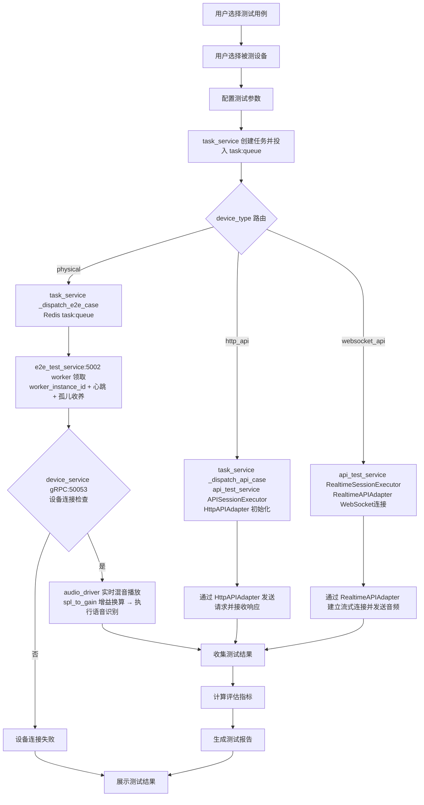
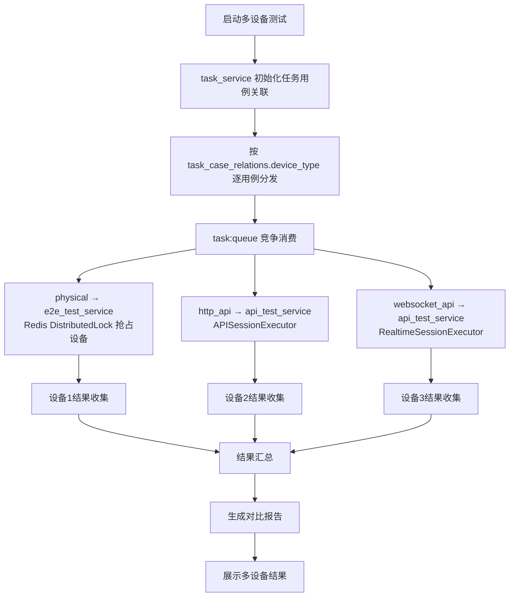
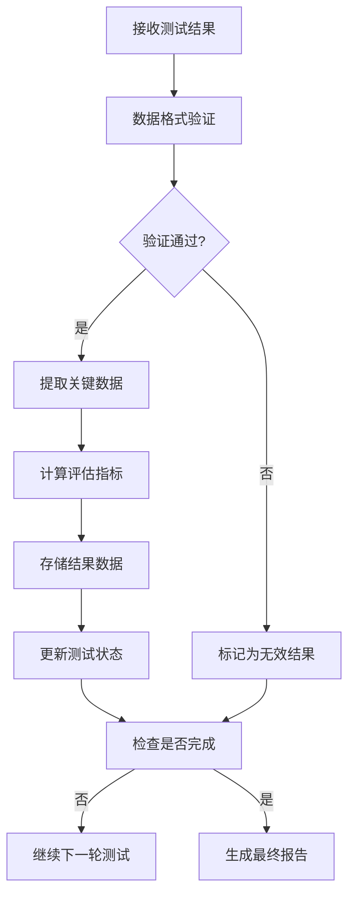

# 端到端测试功能设计文档

> 版本：v3.0（V9.7.31 适配版）| 更新日期：2026-09-10 | 变更说明：同步 V9.7.10 v3.0 语义——用例不再区分类型，E2E 由被测设备 device_type='physical' 决定，废弃 task.type/test_type；执行链路按 V9.7.31 微服务边界落位（task_service 调度 → Redis task:queue → e2e_test_service 执行 → device_service 驱动）

## 1. 概述

### 1.1 文档目的

本文档描述智能语音测试系统中端到端测试（E2E Test）功能模块的详细设计，包括功能定位、架构设计、核心流程、技术实现和用户界面等方面。端到端测试功能作为系统的核心测试能力之一，旨在为用户提供在真实设备上执行完整语音测试流程的能力，支持多设备并行测试和实时进度监控。

> **v3.0 变更说明**：E2E 测试类型的判定方式已变更——不再通过 `task.type='e2e'` 或 `test_type='e2e'` 来区分，而是由 TaskCase 关联的被测设备 `device_type='physical'` 决定。测试用例本身是类型无关的（纯数据），执行模式完全由被测设备类型驱动。`TaskType` **不引入** `'realtime_api'`，其语义由 `device_type` 承载。
>
> 【适配说明】本适配版在保留 v3.0 语义的基础上，将执行链路落位到 V9.7.31 微服务架构：task_service（:5001，`core/execution_engine/mixins/task_dispatch.py` 的 `_dispatch_e2e_case`）将 E2E 用例投入 Redis `task:queue` → e2e_test_service（:5002）worker 领取（`worker_instance_id` 归属 + RedisServiceRegistry 心跳 + 孤儿收养）→ 经 device_service（gRPC:50053）驱动物理设备。枚举统一收敛于 `shared/models/common_enums.py` 与 `shared/utils/status_constants.py`，端口统一由 `shared/config/service_ports.py` 承载。

### 1.2 功能定位

端到端测试功能位于系统测试能力的核心地位，主要解决以下测试场景需求：

- **真实设备验证**：在真实Android和鸿蒙设备上执行语音测试，模拟真实用户使用场景
- **多设备对比**：支持多台设备同时并行测试，快速对比不同设备的表现差异
- **完整流程验证**：执行从音频播放到语音识别、翻译、评估的完整测试流程
- **实时监控**：提供测试执行过程的实时进度和状态监控
- **可视化报告**：生成详细的测试报告，支持数据可视化分析

该功能适用于语音应用开发过程中的功能验证、回归测试、性能评估等场景，是确保语音交互质量的重要工具。

### 1.3 术语定义

| 术语 | 解释 |
|------|------|
| E2E | End-to-End，端到端测试，指在真实设备上执行完整的测试流程 |
| ADB | Android Debug Bridge，Android设备调试桥，用于与Android设备通信 |
| HDC | HarmonyOS Device Connector，鸿蒙设备连接器，用于与鸿蒙设备通信 |
| ASR | Automatic Speech Recognition，自动语音识别 |
| TTS | Text-to-Speech，文本转语音 |
| SPL | Sound Pressure Level，声压级，衡量声音强度的物理量 |
| 干音 | 不含环境噪声的纯净录音，用于标准化测试 |
| 噪声 | 环境背景噪声，用于模拟真实使用场景 |
| device_type | （新增）被测设备类型枚举（physical / http_api / websocket_api），执行路由的唯一依据，落 `shared/models/common_enums.py` |
| gRPC | （新增）V9.7.31 服务间通信协议，跨服务调用一律走 gRPC（ACL 仓储模式隔离 proto 细节） |

## 2. 系统架构设计

### 2.1 整体架构

【适配说明】端到端测试功能在 V9.7.31 中由微服务集群承载，按"前端展示层 / 网关与微服务层 / 设备执行层"三层组织。系统根据 TaskCase 关联的被测设备类型（device_type，取自 `task_case_relations.device_type` 列，新增）路由到不同执行服务：E2E 测试（physical）由 task_service 分发至 e2e_test_service:5002，经 device_service（gRPC:50053）驱动物理设备；HTTP API 测试（http_api）与 WebSocket Realtime API 测试（websocket_api）分发至 api_test_service:5003，分别使用 APIAdapterFactory 创建的 HttpAPIAdapter / HttpStreamAdapter / RealtimeAPIAdapter。

**前端展示层**：基于Vue 3框架构建，提供用户界面、测试配置、实时监控和结果展示功能。前端通过 Socket.IO 与 api_gateway:5000 建立实时通信（按 task_id 房间隔离），接收测试进度和状态更新。

**网关与微服务层**：api_gateway（:5000）负责 REST 聚合与 Socket.IO 事件转发；task_service（:5001）负责测试任务调度与用例分发（`_dispatch_case_by_type` → `_dispatch_e2e_case`）；e2e_test_service（:5002）负责 physical 设备的 E2E 执行；device_service（gRPC:50053）通过 ADB/HDC 驱动物理设备；audio_service（gRPC:50052）提供实时混音增益换算（`SPLMappingService.spl_to_gain`）；evaluation_service（:5004）负责评估计算。各服务经 Redis `task:queue` 领取任务、经 Redis EventBus（`shared/utils/redis_pubsub.py`）发布事件。

**设备执行层**：包括Android设备和鸿蒙设备，运行语音应用并接收测试指令。设备执行层通过 device_service 下发的 ADB/HDC 指令接收音频播放控制，通过应用API接收和处理语音输入。

### 2.2 核心组件

| 组件 | 职责 | 技术实现（V9.7.31 落位） | 通信方式 |
|------|------|----------|----------|
| 前端E2E测试页面 | 提供测试配置、设备选择、进度监控和结果展示 | Vue 3 + Socket.IO | Socket.IO 推送（room=task_id） |
| task_service 调度中枢 | 任务创建、调度循环、按 device_type 分发用例、进度汇总 | task_service:5001 `core/execution_engine/mixins/task_dispatch.py` | Redis task:queue + gRPC |
| e2e_test_service 执行服务 | worker 领取 E2E 用例并执行，多轮循环与结果聚合 | e2e_test_service:5002 `application/services/e2e_executor/executor.py` | gRPC:50051 + Redis EventBus |
| E2EExecutor | 真实设备端到端测试执行器，经 device ACL 仓储控制设备；继承 BaseExecutor（ControlMixin+LoggingMixin+ParamsMixin+ResultsMixin+DbMixin） | e2e_test_service `application/services/e2e_executor/`（preparation / rounds_loop / finalization Mixin） | gRPC（ACL 仓储） |
| APISessionExecutor | HTTP API 测试执行器，通过 api_adapter 发送请求并接收响应 | api_test_service:5003 `core/api_session_executor.py` | HTTP REST |
| RealtimeSessionExecutor | WebSocket Realtime API 测试执行器，通过 RealtimeAPIAdapter 建立流式连接 | api_test_service:5003 | WebSocket（实例内闭环） |
| APIAdapterFactory | API 适配器工厂，根据 device_type 创建对应的适配器实例（HttpAPIAdapter / HttpStreamAdapter / RealtimeAPIAdapter） | api_test_service 适配器注册表 | 内存调用 |
| AudioStreamOrchestrator | 音频流编排器，统一管理音频数据的加载、切分和推送到不同执行器 | api_test_service + audio_service RenderAudioStream（新增 server-streaming RPC） | gRPC + 内存调用 |
| device_service 设备通信 | 与Android/HarmonyOS设备建立连接、执行 ADB/HDC 命令、采集状态 | device_service（gRPC:50053） | gRPC → ADB/HDC 本地进程 |
| audio_service 音频与SPL | E2E 实时混音增益换算（`SPLMappingService.spl_to_gain`）与音频播放编排（audio_driver 实时混音） | audio_service `infrastructure/audio/audio_driver.py`、`spl_service.py`（gRPC:50052） | gRPC |
| 评估计算模块 | 计算测试结果的评估指标，生成报告 | evaluation_service:5004 | gRPC + 内存计算 |

### 2.3 数据流设计

【适配说明】端到端测试的数据流设计遵循单向数据流原则，确保数据传输的清晰性和可追踪性；跨服务数据流全部经 Redis（队列/事件）或 gRPC 流转。

1. **测试配置数据流**：用户在前端配置测试参数（用例、设备、音频等）→ 前端通过 HTTP POST 发送到 api_gateway:5000 → 经 gRPC 转 task_service 落库（`task_case_relations` 携带 device_id + device_type）

2. **测试执行数据流**：task_service 调度循环按 device_type 分发（`_dispatch_e2e_case`）→ Redis `task:queue` → e2e_test_service:5002 worker 领取（`worker_instance_id` 归属校验）→ 经 device_service（gRPC:50053）连接目标设备 → audio_driver 实时混音播放音频 → 设备执行语音识别/翻译 → 结果返回落库

3. **进度更新数据流**：执行服务状态变化 → 发布 Redis EventBus 事件（`EventChannel`/`EventType` 枚举，`shared/utils/redis_pubsub.py`）→ api_gateway:5000 订阅并经 Socket.IO 转发（task_id 房间隔离）→ 前端更新UI展示

4. **结果处理数据流**：e2e_test_service 收集结果 → evaluation_service 计算评估指标 → 生成测试报告 → 前端通过 HTTP GET 经 api_gateway 获取报告数据

### 2.4 依赖关系

【适配说明】端到端测试功能在 V9.7.31 微服务边界下的依赖关系：

- **device_service**（gRPC:50053）：提供设备连接状态管理、设备信息获取与 ADB/HDC 命令执行
- **audio_service**（gRPC:50052）：提供 E2E 实时混音增益换算（SPL → gain）与 API 类离线混音（RenderAudioStream）
- **task_service**（:5001）：提供测试用例与任务关联数据的存储检索、任务生命周期管理
- **evaluation_service**（:5004）：提供测试结果的评估计算
- **shared 基座**：`shared/infrastructure/base_executor/`（BaseExecutor 五 Mixin）、`shared/utils/redis_pubsub.py`（EventBus）、`shared/utils/service_registry.py`（RedisServiceRegistry 服务注册与心跳）、`shared/utils/distributed_coordinator.py`（DistributedLock 物理设备互斥）、`shared/models/common_enums.py` + `shared/utils/status_constants.py`（枚举与状态常量）

## 3. 核心功能模块

### 3.1 测试流程管理

#### 3.1.1 四步测试流程

端到端测试采用标准化的四步测试流程，确保测试执行的规范性和一致性。

**第一步：选择用例**
- 支持从用例库中选择单个或多个测试用例
- 测试用例本身是类型无关的（纯数据：`case_config` + `algorithm_params`），不再区分测试类型
- 支持自定义测试用例集和批量选择

**第二步：选择设备**
- 显示当前在线的设备列表，包含物理设备（Android / 鸿蒙）、HTTP API 设备、WebSocket API 设备
- 被测设备类型决定执行模式：选择物理设备（physical）分发到 e2e_test_service 的 E2EExecutor，选择 HTTP API 设备（http_api）分发到 api_test_service 的 APISessionExecutor，选择 WebSocket API 设备（websocket_api）分发到 RealtimeSessionExecutor；同一任务支持混跑多种 device_type【适配说明】
- 支持设备分组管理和批量选择
- 显示设备基本信息（型号、系统版本、连接状态、设备类型）
- 支持配置设备测试参数（音量、网络状态等）

**第三步：执行测试**
- 支持启动单设备或多设备并行测试
- 实时显示测试进度和当前执行步骤
- 提供测试暂停、继续、终止控制
- 支持错误自动重试和失败跳过策略

**第四步：查看结果**
- 显示测试结果概览（成功率、平均准确率等）
- 提供详细的测试报告查看
- 支持多设备结果对比分析
- 支持报告导出和分享

#### 3.1.2 测试任务管理

测试任务管理模块负责测试任务的创建、执行、监控和归档。

- **任务创建**：基于用户配置生成测试任务，分配唯一任务ID（task_service）
- **任务队列**：支持多任务排队执行，调度器将任务投入 Redis `task:queue`（`task_service/core/execution_engine/mixins/scheduler.py`），执行服务多实例竞争消费，实现负载均衡
- **任务监控**：实时监控任务执行状态和进度（Redis EventBus + Socket.IO 转发）
- **任务控制**：支持任务暂停、继续、终止操作（task_service TaskControl 经 gRPC 下发执行服务）
- **任务归档**：测试完成后自动归档，支持历史任务查询

### 3.2 设备管理与通信

#### 3.2.1 设备连接管理

【适配说明】设备连接管理在 V9.7.31 中由 device_service（gRPC:50053）统一承载，e2e_test_service 经 device ACL 仓储（`infrastructure/acl/device_acl_repository_impl.py`）调用，不再直连设备。

- **设备发现**：自动发现并列出当前连接的Android和鸿蒙设备
- **设备状态**：实时监控设备在线状态，自动检测设备连接变化（device_service 发布 `DEVICE_EVENTS`/`DEVICE_STATUS_CHANGED` 事件）
- **设备信息**：获取设备型号、系统版本、屏幕分辨率等基本信息
- **连接维护**：自动重连断开的设备，确保测试稳定性

#### 3.2.2 设备操作控制

设备操作控制模块负责向设备发送测试指令并接收执行结果。

- **音频播放控制**：控制设备音频播放，支持指定音量和播放时长
- **应用操作**：启动目标应用，模拟用户操作（点击、滑动等）
- **状态监控**：监控设备CPU、内存、电池状态
- **日志采集**：采集设备运行日志，用于问题定位

### 3.3 音频播放管理

#### 3.3.1 音频源管理

音频源管理模块负责测试音频的加载和管理。

- **音频选择**：支持从音频库中选择测试音频
- **音频预览**：提供音频文件的预览播放功能
- **音频分组**：支持按语言、场景等分组管理
- **音频元数据**：管理音频文件的元数据（时长、采样率、声道等）

#### 3.3.2 播放控制

【适配说明】V9.7.31 中 E2E 与 API 类测试的混音链路区分明确：E2E（physical）走 audio_service 的 audio_driver **实时混音**，SPL 值经 `SPLMappingService.spl_to_gain`（`audio_service/infrastructure/audio/spl_service.py`）换算为增益后实时施加；API 类测试走 RenderAudioStream（新增 server-streaming RPC）**离线混音**后推送音频流。两者共用 SPL 映射配置，不共用混音通道。

播放控制模块负责音频的播放参数配置和执行。

- **音量控制**：支持按SPL值设置音频播放音量（E2E 实时换算增益；API 类离线渲染时烘焙）
- **播放模式**：支持单次播放、循环播放、序列播放等模式
- **播放设备**：支持选择特定的播放设备和声卡通道
- **播放监控**：监控音频播放状态，确保播放完成

### 3.4 结果收集与评估

#### 3.4.1 结果收集

【适配说明】结果收集由 e2e_test_service 的 e2e_collector / e2e_aggregator 承载（`application/services/`），结果实时落库并经 Redis EventBus 上报进度。

结果收集模块负责从设备获取测试执行结果。

- **实时采集**：实时采集设备返回的测试结果
- **错误处理**：处理设备返回的错误信息和异常状态
- **日志收集**：收集测试执行过程中的详细日志（经 LoggingMixin 统一采集入库）
- **数据验证**：验证收集到的数据完整性和格式正确性

#### 3.4.2 评估计算

评估计算模块负责对测试结果进行评估计算。

- **多维度评估**：支持准确率、召回率、F1分数等多维度评估指标
- **实时计算**：测试完成后立即计算评估指标
- **基准对比**：支持与历史测试结果或基准值进行对比
- **异常检测**：自动检测异常结果并标记

### 3.5 报告生成与管理

#### 3.5.1 报告生成

报告生成模块负责根据测试结果生成详细的测试报告。

- **报告模板**：支持多种报告模板，适应不同测试场景
- **数据可视化**：生成准确率曲线、正态分布、对比图表等
- **详细信息**：包含测试配置、执行过程、结果详情等完整信息
- **多格式支持**：支持PDF、HTML、CSV等多种报告格式

#### 3.5.2 报告管理

报告管理模块负责测试报告的存储和检索。

- **报告存储**：将生成的报告存储到系统数据库
- **报告查询**：支持按时间、设备、被测设备类型（device_type）等条件查询报告
- **报告对比**：支持多份报告的对比分析
- **报告导出**：支持将报告导出到本地文件系统

## 4. 核心流程图

### 4.1 测试执行主流程


```mermaid
flowchart TD
    A[用户选择测试用例] --> B[用户选择被测设备]
    B --> C[配置测试参数]
    C --> D[task_service 创建任务并投入 task:queue]
    D --> E{device_type 路由}
    E -->|physical| F1[task_service _dispatch_e2e_case<br/>Redis task:queue]
    E -->|http_api| F2[task_service _dispatch_api_case<br/>api_test_service APISessionExecutor<br/>HttpAPIAdapter 初始化]
    E -->|websocket_api| F3[api_test_service RealtimeSessionExecutor<br/>RealtimeAPIAdapter WebSocket连接]
    F1 --> G1[e2e_test_service:5002 worker 领取<br/>worker_instance_id + 心跳 + 孤儿收养]
    G1 --> H1{device_service gRPC:50053<br/>设备连接检查}
    H1 -->|否| I1[设备连接失败]
    H1 -->|是| J1[audio_driver 实时混音播放<br/>spl_to_gain 增益换算 → 执行语音识别]
    F2 --> J2[通过 HttpAPIAdapter 发送请求并接收响应]
    F3 --> J3[通过 RealtimeAPIAdapter 建立流式连接并发送音频]
    J1 --> K[收集测试结果]
    J2 --> K
    J3 --> K
    K --> L[计算评估指标]
    L --> M[生成测试报告]
    M --> N[展示测试结果]
    I1 --> N
```

### 4.2 多设备并行测试流程

【适配说明】多设备并行由 task_service 逐 TaskCase 按 `task_case_relations.device_type` 分发实现；physical 设备为全局独占资源，互斥从进程内 dict 升级为 Redis DistributedLock（`shared/utils/distributed_coordinator.py`）。


```mermaid
flowchart TD
    A[启动多设备测试] --> B[task_service 初始化任务用例关联]
    B --> C[按 task_case_relations.device_type 逐用例分发]
    C --> D[task:queue 竞争消费]
    D --> E1[physical → e2e_test_service<br/>Redis DistributedLock 抢占设备]
    D --> E2[http_api → api_test_service<br/>APISessionExecutor]
    D --> E3[websocket_api → api_test_service<br/>RealtimeSessionExecutor]
    E1 --> F1[设备1结果收集]
    E2 --> F2[设备2结果收集]
    E3 --> F3[设备3结果收集]
    F1 --> G[结果汇总]
    F2 --> G
    F3 --> G
    G --> H[生成对比报告]
    H --> I[展示多设备结果]
```

### 4.3 测试结果处理流程


```mermaid
flowchart TD
    A[接收测试结果] --> B[数据格式验证]
    B --> C{验证通过?}
    C -->|否| D[标记为无效结果]
    C -->|是| E[提取关键数据]
    E --> F[计算评估指标]
    F --> G[存储结果数据]
    G --> H[更新测试状态]
    H --> I[检查是否完成]
    I -->|否| J[继续下一轮测试]
    I -->|是| K[生成最终报告]
    D --> I
```

## 5. 用户界面设计

### 5.1 页面布局

端到端测试页面采用左侧导航+右侧内容区的经典布局，响应式设计适配不同屏幕尺寸。

**顶部导航栏**：显示当前测试任务状态、操作按钮（开始、暂停、停止）
**左侧边栏**：测试配置区域，包含用例选择、设备选择、参数配置三个标签页
**右侧主内容区**：测试执行监控区域，包含进度条、实时日志、结果预览
**底部状态栏**：显示系统状态、设备连接状态、网络状态等

### 5.2 核心界面

#### 5.2.1 测试配置界面

**用例选择标签页**
- 用例列表：支持表格展示和卡片展示两种模式
- 筛选条件：按语言、标签等筛选（用例不再区分测试类型）
- 搜索功能：支持关键词搜索用例名称和描述
- 批量操作：支持多选、批量添加到测试集
- 用例详情：点击用例显示详细信息和预览

**设备选择标签页**
- 设备列表：显示当前在线设备，包含物理设备（Android / 鸿蒙）、HTTP API 设备、WebSocket API 设备
- 设备状态：绿色标识在线，灰色标识离线，黄色标识连接中
- 设备分组：支持按设备类型（physical / http_api / websocket_api）、系统版本等分组
- 批量选择：支持多选设备进行并行测试
- 被测设备类型决定执行模式：物理设备走 E2E（e2e_test_service），HTTP API 设备走 APISessionExecutor，WebSocket API 设备走 RealtimeSessionExecutor（均由 api_test_service 承载）【适配说明】
- 设备详情：点击设备显示详细信息、连接状态和设备类型

**参数配置标签页**
- 音频配置：选择播放设备、音量设置、SPL值配置
- 测试配置：设置测试轮数、超时时间、重试次数
- 网络配置：设置网络环境（Wi-Fi、移动网络）
- 报告配置：选择报告模板、包含内容、导出格式

#### 5.2.2 测试执行界面

**进度监控区域**
- 总体进度条：显示整个测试任务的执行进度
- 设备进度：每个设备的独立进度条
- 时间统计：已执行时间、预计剩余时间
- 状态显示：当前执行阶段、当前执行的用例

**实时日志区域**
- 日志流：实时显示测试执行日志
- 日志过滤：按日志级别（INFO、WARN、ERROR）过滤
- 日志搜索：支持关键词搜索日志内容
- 日志导出：支持导出完整日志文件

**设备状态区域**
- 设备连接状态：显示每个设备的连接状态
- 设备资源：显示CPU、内存、电池状态
- 网络状态：显示网络连接质量
- 错误提示：实时显示设备错误信息

#### 5.2.3 结果展示界面

**结果概览区域**
- 成功率：测试用例的成功率统计
- 平均准确率：所有测试用例的平均准确率
- 设备对比：不同设备的测试结果对比图表
- 趋势分析：与历史测试结果的趋势对比

**详细结果区域**
- 用例列表：按用例展示详细测试结果
- 结果状态：成功、失败、跳过状态标识
- 评估指标：显示每个用例的详细评估指标
- 异常标记：标记异常结果和潜在问题

**报告操作区域**
- 报告生成：生成完整测试报告
- 报告导出：导出为PDF、HTML、CSV格式
- 报告分享：生成分享链接或邮件发送
- 结果对比：与其他测试结果进行对比

### 5.3 交互设计

#### 5.3.1 操作流程

**开始测试流程**
1. 用户在测试配置界面选择测试用例
2. 选择测试设备（支持多选）
3. 配置测试参数
4. 点击"开始测试"按钮
5. 系统检查设备连接状态
6. 设备连接成功后开始执行测试

**测试监控流程**
1. 测试开始后自动切换到测试执行界面
2. 实时显示测试进度和设备状态
3. 用户可以点击"暂停"按钮暂停测试
4. 暂停后可以点击"继续"按钮恢复测试
5. 可以点击"停止"按钮终止测试

**结果查看流程**
1. 测试完成后自动切换到结果展示界面
2. 显示测试结果概览和详细信息
3. 用户可以点击"生成报告"按钮生成完整报告
4. 可以点击"导出报告"按钮导出报告文件
5. 可以点击"重新测试"按钮重新执行相同配置的测试

#### 5.3.2 响应式设计

端到端测试界面采用响应式设计，适配不同屏幕尺寸：

- **桌面端**（≥1200px）：完整三栏布局，左侧配置区、右侧监控区、底部状态栏
- **平板端**（768px-1199px）：双栏布局，配置区可折叠，监控区优先显示
- **移动端**（<768px）：单栏布局，通过标签页切换不同功能区域

### 5.4 视觉设计

#### 5.4.1 颜色系统

端到端测试功能采用蓝色主题，体现专业、可靠的测试工具属性：

- **主色调**：#1677FF（科技蓝），用于按钮、进度条、重要状态
- **辅助色**：#E6F7FF（浅蓝），用于背景、边框、次要元素
- **状态色**：
  - 成功：#52C41A（绿色）
  - 警告：#FAAD14（黄色）
  - 错误：#F5222D（红色）
  - 信息：#1890FF（蓝色）

#### 5.4.2 字体与图标

- **字体**：系统默认无衬线字体，主标题16px，正文14px，小字12px
- **图标**：使用Font Awesome图标库，主要图标包括：
  - 播放/暂停/停止：用于测试控制
  - 设备：用于设备管理
  - 音频：用于音频管理
  - 图表：用于结果展示
  - 日志：用于日志查看

#### 5.4.3 布局原则

- **信息层次**：重要信息（进度、状态）优先显示，次要信息（详细配置）可折叠
- **空间利用**：充分利用屏幕空间，避免不必要的留白
- **操作便捷**：常用操作按钮放置在显眼位置，减少操作路径
- **视觉引导**：使用颜色、图标、动画等元素引导用户注意力
- **一致性**：保持与系统其他模块的视觉风格一致

## 6. 技术实现

### 6.1 前端实现

#### 6.1.1 技术栈

- **框架**：Vue 3 + Composition API
- **状态管理**：Pinia（轻量级状态管理）
- **路由**：Vue Router
- **通信**：Socket.IO（实时通信，room=task_id 房间隔离） + Axios（HTTP请求）【适配说明】
- **UI组件**：自定义组件 + Element Plus
- **图表库**：ECharts（数据可视化）
- **样式**：SCSS + CSS变量

#### 6.1.2 核心模块

**测试配置模块**
- 用例选择组件：`UseCaseSelector.vue`
- 设备选择组件：`DeviceSelector.vue`
- 参数配置组件：`TestConfig.vue`

**测试执行模块**
- 进度监控组件：`ProgressMonitor.vue`
- 实时日志组件：`RealTimeLog.vue`
- 设备状态组件：`DeviceStatus.vue`

**结果展示模块**
- 结果概览组件：`ResultOverview.vue`
- 详细结果组件：`DetailedResult.vue`
- 报告生成组件：`ReportGenerator.vue`

#### 6.1.3 关键实现

**Socket.IO 连接管理**【适配说明：原 WebSocket 直连方案废弃；V9.7.31 中事件统一由 Redis EventBus 汇聚到 api_gateway:5000，经 Socket.IO 按 task_id 房间转发，前端按任务加入对应房间】
```javascript
// Socket.IO 连接管理（api_gateway:5000，room=task_id 房间隔离）
import { io } from 'socket.io-client';

export const useTaskEvents = (taskId) => {
  const socket = ref(null);
  const isConnected = ref(false);

  const connect = () => {
    socket.value = io('http://localhost:5000', {
      transports: ['websocket'],
      query: { task_id: taskId.value }
    });

    socket.value.on('connect', () => {
      // 加入任务房间，接收该任务的进度与日志事件
      socket.value.emit('join', { room: `task:${taskId.value}` });
      isConnected.value = true;
    });

    socket.value.on('task_event', (event) => {
      // 事件类型取自 shared/utils/redis_pubsub.py 的 EventType 枚举
      // 处理 task_progress / case_execution_completed 等实时数据
    });

    socket.value.on('disconnect', () => {
      isConnected.value = false;
    });
  };

  return { socket, isConnected, connect };
};
```

**测试进度监控**
```javascript
// 测试进度计算
export const calculateProgress = (totalCases, completedCases, deviceCount) => {
  const progressPerDevice = completedCases / totalCases;
  return progressPerDevice / deviceCount * 100;
};

// 实时更新进度
watch(
  () => testState.completedCases,
  (newValue) => {
    const progress = calculateProgress(
      testState.totalCases,
      newValue,
      testState.selectedDevices.length
    );
    testState.progress = Math.min(progress, 100);
  }
);
```

### 6.2 后端实现

#### 6.2.1 技术栈

【适配说明】V9.7.31 后端由 12 个微服务组成，端到端测试相关服务的技术栈如下：

- **框架**：Flask（HTTP） + gRPC（服务间通信，`shared/proto` 契约 + ACL 仓储模式）
- **设备通信**：device_service 承载 ADB（Android） + HDC（HarmonyOS），gRPC:50053 对外暴露
- **音频处理**：audio_service 承载（audio_driver 实时混音 + spl_service 增益换算），gRPC:50052
- **数据存储**：PostgreSQL + SQLAlchemy（各服务独立持久化）
- **分布式协同**：Redis（task:queue 队列 + EventBus 发布订阅 + DistributedLock 分布式锁 + RedisServiceRegistry 服务注册）
- **实时推送**：api_gateway Socket.IO（room=task_id 房间隔离）
- **环境区分**：开发环境 run_all.py 本地编排；生产环境 docker/docker-compose.yml 容器编排

#### 6.2.2 核心模块

**task_service 调度模块**（:5001）
- `core/execution_engine/mixins/scheduler.py`：调度主循环，`task:queue` 队列定义（TASK_QUEUE_KEY）
- `core/execution_engine/mixins/task_dispatch.py`：用例分发 Mixin——`_dispatch_case_by_type` 按 device_type 路由，`_dispatch_e2e_case` 分发 E2E 用例，`_claim_case` 原子占用
- `core/execution_engine/mixins/`：Progress / TaskControl / CaseExecution / TaskRunner 等五 Mixin 体系

**e2e_test_service 执行模块**（:5002）
- `application/services/e2e_executor/executor.py`：E2E 端到端测试执行器，经 device ACL 仓储控制真实设备
- `application/services/e2e_executor/preparation_mixin.py` / `rounds_loop_mixin.py` / `finalization_mixin.py`：准备 / 多轮循环 / 收尾 Mixin
- `application/services/e2e_device_manager.py`：设备管理与 physical 设备互斥
- `application/services/e2e_collector.py` / `e2e_aggregator.py`：结果收集与聚合
- `infrastructure/acl/device_acl_repository_impl.py`：device_service gRPC 访问隔离

**api_test_service 执行模块**（:5003，replicas:2）
- `core/api_session_executor.py`：HTTP API 测试执行器，通过 api_adapter 发送请求并接收响应
- `core/api_executor.py` / `api_task_runner.py` / `session_context.py`：任务池与会话上下文
- `api_adapter_factory.py`：API 适配器工厂，根据 device_type 创建对应的适配器实例
- `http_api_adapter.py`：HTTP API 适配器，处理同步 HTTP 请求/响应
- `http_stream_adapter.py`：HTTP 流式适配器，处理流式 HTTP 响应
- `realtime_api_adapter.py`：WebSocket Realtime API 适配器，处理流式连接（实例内闭环）
- `audio_stream_orchestrator.py`：音频流编排器，统一管理音频数据加载、切分和推送

**device_service 设备模块**（gRPC:50053）
- `adb_controller.py`：Android设备通信控制器
- `hdc_controller.py`：鸿蒙设备通信控制器
- `application/commands/playback_command_service.py`：音频播放指令编排

**audio_service 音频模块**（gRPC:50052）
- `infrastructure/audio/audio_driver.py`：E2E 实时混音驱动
- `infrastructure/audio/spl_service.py`：`SPLMappingService.spl_to_gain` SPL→增益换算
- RenderAudioStream：API 类离线混音 server-streaming RPC（新增）

**shared 执行器基座与基础设施**
- `shared/infrastructure/base_executor/_base.py`：BaseExecutor = ControlMixin + LoggingMixin + ParamsMixin + ResultsMixin + DbMixin 五 Mixin（新增）
- `shared/utils/redis_pubsub.py`：Redis EventBus，`EventChannel`/`EventType` 枚举（新增）
- `shared/utils/service_registry.py`：RedisServiceRegistry 服务注册与心跳（新增）
- `shared/utils/distributed_coordinator.py`：DistributedLock 分布式锁，physical 设备互斥（新增）
- `shared/models/common_enums.py` + `shared/utils/status_constants.py`：枚举与状态常量统一承载
- `shared/config/service_ports.py`：端口配置化承载

**评估计算模块**
- evaluation_service（:5004）：评估指标计算
- `report_generator.py`：报告生成器

#### 6.2.3 关键实现

**按 device_type 分发与 E2E 执行链路**【适配说明：原"进程内多设备并行"实现废弃；V9.7.31 中分发落 task_service，执行落 e2e_test_service，跨服务经 Redis 队列与 gRPC】
```python
# task_service/core/execution_engine/mixins/task_dispatch.py（节选语义）
class TaskDispatchMixin:
    def _dispatch_case_by_type(self, task_id, task, tc_rel, session):
        """根据被测设备类型分发用例执行（device_type 是唯一路由依据）"""
        if task_case_relations_device_type(tc_rel) == DeviceType.HTTP_API:
            self._dispatch_api_case(task_id, tc_rel, session)      # → api_test_service:5003
        else:
            self._dispatch_e2e_case(task_id, task, tc_rel, session)  # → Redis task:queue → e2e_test_service:5002

    def _dispatch_e2e_case(self, task_id, task, tc_rel, session):
        """E2E 用例：原子占用后投入 Redis 队列，由 e2e_test_service worker 领取"""
        claimed = self._claim_case(task_id, tc_rel.id, session)    # UPDATE ... WHERE status=PENDING
        if claimed != 1:
            session.rollback()
            return
        session.commit()
        success = self._execute_e2e_case(task_id, tc_rel.id)       # 经 gRPC/队列到达 e2e_test_service

# e2e_test_service worker 领取语义（伪代码）
def worker_loop(service: E2EExecutionService):
    registry = RedisServiceRegistry(...)          # shared/utils/service_registry.py：注册 + 心跳
    worker_id = service.worker_instance_id
    while True:
        job = redis.brpop('task:queue')           # task_service/core/execution_engine/mixins/scheduler.py 定义
        if not claim_with_owner(job, worker_id):  # worker_instance_id 归属校验
            continue
        try:
            execute_e2e(job)                      # 经 device ACL → device_service(gRPC:50053) 驱动物理设备
        except WorkerDiedError:
            adopt_orphan_jobs(worker_id)          # 孤儿收养：接管失联 worker 的在途用例
```

**physical 设备互斥**（新增）
```python
# shared/utils/distributed_coordinator.py：物理设备全局独占，进程内 dict 互斥废弃
from shared.utils.distributed_coordinator import DistributedLock

lock = DistributedLock(name=f'device:{device_id}', ttl=300)
if lock.acquire(blocking=False):
    try:
        run_e2e_on_device(device_id)   # 持锁执行
    finally:
        lock.release()
```

**设备通信**（落位 device_service，e2e_test_service 经 device ACL 仓储调用）
```python
# device_service 内 ADB 控制器（原后端直连实现迁入 device_service，统一由 gRPC:50053 暴露）
import subprocess

class ADBController:
    """ADB设备控制器（device_service）"""
    
    def connect_device(self, device_id):
        """连接到指定设备"""
        result = subprocess.run(
            ['adb', '-s', device_id, 'shell', 'echo', 'connected'],
            capture_output=True, text=True
        )
        return result.returncode == 0
    
    def install_app(self, device_id, apk_path):
        """安装应用"""
        result = subprocess.run(
            ['adb', '-s', device_id, 'install', apk_path],
            capture_output=True, text=True
        )
        return 'Success' in result.stdout
    
    def launch_app(self, device_id, package_name, activity_name):
        """启动应用"""
        result = subprocess.run(
            ['adb', '-s', device_id, 'shell', 'am', 'start', '-n', 
             f'{package_name}/{activity_name}'],
            capture_output=True, text=True
        )
        return result.returncode == 0
```

### 6.3 设备层实现

【适配说明】以下 ADB/HDC 命令集在 V9.7.31 中全部落位 device_service（gRPC:50053）实现，e2e_test_service 经 device ACL 仓储远程调用，前端与调度服务不直接接触 ADB/HDC 工具链。

#### 6.3.1 Android设备

**ADB命令集**
- 设备管理：`adb devices`, `adb connect`
- 应用管理：`adb install`, `adb uninstall`, `adb shell am start`
- 音频控制：`adb shell media volume`, `adb shell am startservice`
- 日志采集：`adb logcat`, `adb shell dumpsys`

**测试应用**
- 支持自动启动目标应用
- 支持模拟语音输入
- 支持捕获应用输出
- 支持记录系统状态

#### 6.3.2 鸿蒙设备

**HDC命令集**
- 设备管理：`hdc list targets`, `hdc connect`
- 应用管理：`hdc install`, `hdc uninstall`, `hdc shell aa start`
- 音频控制：`hdc shell audio`, `hdc shell media`
- 日志采集：`hdc shell log`, `hdc shell dumpsys`

**测试应用**
- 支持自动启动目标应用
- 支持模拟语音输入
- 支持捕获应用输出
- 支持记录系统状态

## 7. 性能与可靠性设计

### 7.1 性能优化

#### 7.1.1 并行处理

- **设备并行**：支持多设备同时测试，task_service 逐用例分发、执行服务并行消费
- **任务并行**：`task:queue` 多实例竞争消费（api_test_service replicas:2），天然水平扩展
- **IO并行**：使用异步IO处理设备通信和文件操作
- **计算并行**：评估计算由 evaluation_service 独立承载，多线程处理

#### 7.1.2 资源管理

- **内存管理**：实时监控内存使用，避免内存泄漏
- **CPU管理**：限制单个测试的CPU使用率，避免系统过载
- **网络管理**：优化网络通信，减少网络延迟
- **磁盘管理**：优化文件IO，减少磁盘读写开销

#### 7.1.3 响应速度

- **前端优化**：使用虚拟滚动处理大量数据，减少DOM操作
- **后端优化**：使用缓存减少重复计算，优化数据库查询
- **WebSocket优化**：使用二进制数据格式，减少传输开销
- **设备通信优化**：批量执行ADB/HDC命令，减少命令执行次数

### 7.2 可靠性设计

#### 7.2.1 错误处理

- **设备错误**：处理设备连接失败、应用崩溃等错误
- **网络错误**：处理网络中断、超时等错误
- **应用错误**：处理目标应用无响应、异常退出等错误
- **系统错误**：处理系统资源不足、权限不足等错误

#### 7.2.2 重试机制

- **连接重试**：设备连接失败自动重试
- **命令重试**：ADB/HDC命令执行失败自动重试
- **测试重试**：单个测试用例失败自动重试
- **任务重试**：整个测试任务失败支持手动重试
- **分发重试**（新增）：worker 执行异常时用例重新投回 `task:queue`，由其他实例竞争消费

#### 7.2.3 容错设计

- **设备容错**：部分设备失败不影响其他设备测试
- **用例容错**：部分用例失败不影响其他用例执行
- **worker 容错**（新增）：e2e_test_service worker 经 RedisServiceRegistry 心跳保活，实例宕机后其在途用例由其他实例孤儿收养，任务不丢失
- **网络容错**：网络中断后自动重连，恢复测试
- **存储容错**：测试结果实时保存，避免数据丢失

#### 7.2.4 监控与告警

- **系统监控**：监控CPU、内存、磁盘使用情况
- **设备监控**：监控设备连接状态、电池状态
- **网络监控**：监控网络连接质量、延迟
- **错误告警**：关键错误实时告警，支持邮件通知

## 8. 安全设计

### 8.1 设备安全

- **设备认证**：验证设备身份，防止未授权设备接入
- **权限控制**：最小权限原则，只申请必要的设备权限
- **数据隔离**：不同测试任务的数据相互隔离
- **设备保护**：避免对设备系统造成损害

### 8.2 数据安全

- **数据加密**：敏感数据传输和存储加密
- **访问控制**：基于角色的访问控制
- **数据脱敏**：测试结果中的敏感信息脱敏处理
- **审计日志**：记录所有操作日志，支持追溯

### 8.3 网络安全

- **传输加密**：Socket.IO 连接使用 WSS 加密
- **访问限制**：限制API访问来源，防止未授权访问
- **DDoS防护**：防止恶意请求攻击
- **网络隔离**：测试网络与生产网络隔离

### 8.4 应用安全

- **依赖安全**：定期更新第三方依赖，修复安全漏洞
- **代码安全**：代码审查，防止安全漏洞
- **配置安全**：敏感配置信息加密存储
- **运行安全**：应用运行在沙箱环境中

## 9. 测试与维护

### 9.1 测试策略

#### 9.1.1 单元测试

- **设备通信模块**：测试ADB/HDC命令执行
- **音频播放模块**：测试音频播放控制
- **结果收集模块**：测试结果数据处理
- **评估计算模块**：测试评估指标计算

#### 9.1.2 集成测试

- **前端集成**：测试前端组件交互
- **后端集成**：测试后端模块协作
- **前后端集成**：测试WebSocket通信
- **设备集成**：测试与真实设备的集成

#### 9.1.3 端到端测试

- **完整流程测试**：测试从配置到报告的完整流程
- **多设备测试**：测试多设备并行执行
- **异常场景测试**：测试各种异常场景的处理
- **性能测试**：测试系统在高负载下的表现

### 9.2 维护策略

#### 9.2.1 监控与日志

- **系统监控**：监控CPU、内存、磁盘使用情况
- **应用监控**：监控应用运行状态、错误率
- **设备监控**：监控设备连接状态、响应时间
- **日志管理**：集中管理系统日志、应用日志、设备日志

#### 9.2.2 故障排除

- **故障诊断**：快速定位故障原因
- **故障修复**：及时修复系统故障
- **故障预防**：分析故障原因，预防类似问题
- **知识积累**：建立故障知识库，支持快速解决

#### 9.2.3 版本管理

- **代码版本**：使用Git进行代码版本管理
- **配置版本**：管理测试配置的版本
- **设备版本**：管理设备固件版本
- **应用版本**：管理目标应用版本

#### 9.2.4 升级策略

- **系统升级**：定期升级系统组件和依赖
- **功能升级**：根据用户反馈和需求添加新功能
- **性能升级**：优化系统性能，提高测试效率
- **安全升级**：及时修复安全漏洞

## 10. 未来规划

### 10.1 功能增强

- **更多设备支持**：支持iOS设备、Windows设备等
- **更多测试类型**：支持视频测试、触觉反馈测试等
- **AI辅助测试**：使用AI生成测试用例，分析测试结果
- **自动化测试**：支持定时执行、触发式执行等自动化场景

### 10.2 技术演进

- **容器化部署**：支持Docker容器化部署，提高环境一致性
- **云服务集成**：集成云测试服务，扩展测试能力
- **边缘计算**：利用边缘设备提高测试效率
- **低代码配置**：提供可视化配置界面，降低使用门槛

### 10.3 生态建设

- **插件系统**：支持第三方插件扩展功能
- **API开放**：开放API接口，支持与其他系统集成
- **社区建设**：建立用户社区，共享测试经验和资源
- **标准制定**：参与语音测试标准制定，推动行业发展

## 11. 结论

端到端测试功能是智能语音测试系统的核心测试能力之一，通过在真实设备上执行完整的语音测试流程，为用户提供了一种全面、可靠的语音应用测试方案。本文档详细描述了该功能的设计方案，包括系统架构、核心功能、技术实现、用户界面等方面，为开发团队提供了清晰的实现指导。

随着技术的不断发展和用户需求的不断变化，端到端测试功能也需要持续演进和优化。通过本文档的指导，开发团队可以快速实现该功能的核心能力，并在此基础上不断扩展和完善，为用户提供更加全面、高效、可靠的语音测试解决方案。

## 12. 参考资料

- [Android Debug Bridge (ADB)官方文档](https://developer.android.com/studio/command-line/adb)
- [HarmonyOS Device Connector (HDC)官方文档](https://developer.harmonyos.com/cn/docs/documentation/doc-guides/hdc-guide-0000001054490281)
- [Flask官方文档](https://flask.palletsprojects.com/)
- [Vue 3官方文档](https://vuejs.org/)
- [WebSocket官方规范](https://websockets.spec.whatwg.org/)
- [语音识别评估标准](https://www.iso.org/standard/71409.html)
- [声压级测量标准](https://www.iec.ch/standard/60651)
