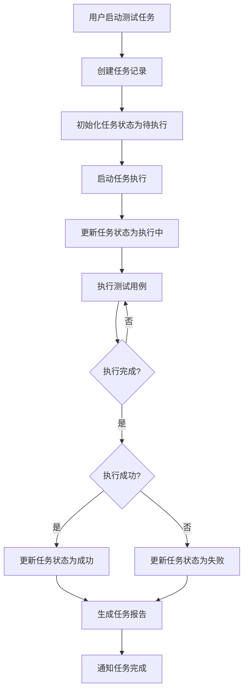
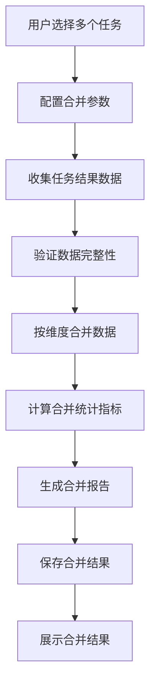
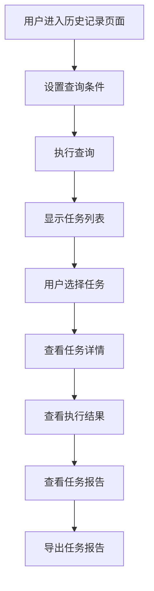

# 任务管理功能设计文档

## 1. 概述

### 1.1 文档目的

本文档描述智能语音测试系统中任务管理（Tasks）功能模块的详细设计，包括功能定位、架构设计、核心流程、技术实现和用户界面等方面。任务管理功能作为系统的核心管理能力之一，旨在为用户提供查看和管理测试任务执行记录的能力，支持历史查询、结果回溯和任务合并。

### 1.2 功能定位

任务管理功能位于系统测试执行管理的核心位置，主要解决以下测试场景需求：

- **任务集中管理**：统一管理端到端测试任务和API测试任务
- **历史记录查询**：支持按时间、状态、类型等维度查询历史任务
- **结果回溯**：支持查看历史任务的详细执行结果和报告
- **任务合并**：支持多任务结果合并与对比分析
- **状态监控**：实时监控任务的执行状态和进度
- **统计分析**：提供任务执行情况的统计和分析

该功能适用于测试任务管理、结果分析、报告生成等场景，是确保测试执行效率和可追溯性的重要工具。

### 1.3 术语定义

| 术语 | 解释 |
|------|------|
| 测试任务 | 一次完整的测试执行过程，包含多个测试用例 |
| 任务状态 | 测试任务的执行状态，如待执行、执行中、成功、失败等 |
| 任务类型 | 测试任务的类型，如端到端测试、API测试等 |
| 任务合并 | 将多个测试任务的结果合并分析的过程 |
| 结果回溯 | 查看历史任务执行结果的过程 |
| 任务日志 | 测试任务执行过程中产生的日志信息 |
| 任务报告 | 测试任务执行完成后生成的报告 |
| 任务统计 | 测试任务执行情况的统计数据 |

## 2. 系统架构设计

### 2.1 整体架构

任务管理功能采用前后端分离的三层架构设计，包含前端展示层、后端服务层和数据存储层。

**前端展示层**：基于Vue 3框架构建，提供用户界面、任务管理、历史查询和任务合并功能。前端通过WebSocket与后端建立实时通信，接收任务执行进度和状态更新。

**后端服务层**：基于Flask框架实现，负责任务管理、状态更新、结果处理和任务合并。后端通过异步IO处理任务执行，通过WebSocket向前端推送实时数据。

**数据存储层**：负责任务数据的存储和管理，包括任务基本信息、执行状态、结果数据和关联关系。使用PostgreSql数据库存储结构化数据。

### 2.2 核心组件

| 组件 | 职责 | 技术实现 | 通信方式 |
|------|------|----------|----------|
| 前端任务管理页面 | 提供用户界面、任务管理、历史查询和任务合并 | Vue 3 + WebSocket | WebSocket推送 |
| 后端任务管理服务 | 负责任务管理、状态更新、结果处理和任务合并 | Flask + SQLAlchemy | HTTP REST + WebSocket |
| 任务存储管理 | 负责任务数据的存储和管理 | PostgreSql + SQLAlchemy | 数据库操作 |
| 任务执行管理 | 负责任务的执行、监控和控制 | Flask + asyncio | 异步通信 |
| 任务合并处理 | 负责多任务结果的合并和分析 | Flask + Pandas | 内存计算 |
| 结果处理 | 负责任务结果的处理和存储 | Flask + SQLAlchemy | 数据库操作 |
| 报告生成 | 负责任务执行报告的生成 | Flask + Jinja2 | 模板渲染 |

### 2.3 数据流设计

任务管理功能的数据流设计遵循单向数据流原则，确保数据传输的清晰性和可追溯性。

1. **任务执行数据流**：前端启动测试任务 → 后端创建任务记录 → 后端执行任务 → 前端通过WebSocket接收执行状态和进度 → 任务执行完成 → 后端更新任务状态和结果 → 前端显示任务结果

2. **历史查询数据流**：前端发起历史任务查询 → 后端查询数据库 → 后端返回任务列表 → 前端显示任务列表 → 前端点击查看任务详情 → 后端返回任务详情 → 前端显示任务详情

3. **任务合并数据流**：前端选择多个任务进行合并 → 后端获取任务结果 → 后端合并结果数据 → 后端生成合并报告 → 前端显示合并结果和报告

4. **统计分析数据流**：前端发起统计分析请求 → 后端查询任务数据 → 后端计算统计指标 → 后端返回统计结果 → 前端显示统计图表

### 2.4 依赖关系

任务管理功能依赖以下系统模块：

- **测试执行模块**：用于启动和控制测试执行
- **结果处理模块**：用于处理测试执行结果
- **报告管理模块**：用于生成测试报告
- **评估系统模块**：用于计算测试评估指标
- **用例管理模块**：用于获取测试用例信息
- **设备管理模块**：用于获取设备信息

## 3. 核心功能模块

### 3.1 任务管理

#### 3.1.1 任务创建与执行

任务创建与执行模块负责测试任务的创建和执行。

**任务创建**
- 支持基于测试用例创建任务
- 支持基于测试集创建任务
- 支持批量创建任务
- 支持设置任务参数（如设备、并发数等）

**任务执行**
- 支持启动任务执行
- 支持暂停任务执行
- 支持终止任务执行
- 支持任务执行重试

**任务监控**
- 实时监控任务执行状态
- 实时监控任务执行进度
- 实时监控任务执行日志
- 实时监控任务执行错误

#### 3.1.2 任务状态管理

任务状态管理模块负责测试任务的状态管理。

**状态定义**
- 待执行（Pending）：任务已创建但尚未执行
- 执行中（Running）：任务正在执行中
- 成功（Success）：任务执行成功
- 失败（Failed）：任务执行失败
- 暂停（Paused）：任务执行被暂停
- 终止（Stopped）：任务执行被终止

**状态转换**
- 待执行 → 执行中：任务开始执行
- 执行中 → 成功：任务执行完成且全部成功
- 执行中 → 失败：任务执行过程中出现错误
- 执行中 → 暂停：用户暂停任务执行
- 暂停 → 执行中：用户恢复任务执行
- 执行中 → 终止：用户终止任务执行

**状态通知**
- 任务状态变更时通过WebSocket通知前端
- 任务执行完成时发送通知（如邮件）
- 任务执行失败时发送告警通知

#### 3.1.3 任务详情管理

任务详情管理模块负责测试任务的详情管理。

**基本信息**
- 任务名称、类型、创建时间、开始时间、结束时间
- 任务创建者、执行设备、测试用例数量
- 任务状态、执行结果统计

**执行详情**
- 执行步骤记录
- 执行日志
- 错误信息
- 执行时间统计

**结果详情**
- 测试用例执行结果
- 评估指标计算结果
- 设备性能数据
- 系统资源使用情况

### 3.2 历史记录管理

#### 3.2.1 任务列表管理

任务列表管理模块负责历史任务的列表管理。

**任务列表**
- 显示历史任务的基本信息
- 支持按状态、类型、时间等排序
- 支持分页显示
- 支持批量选择

**任务筛选**
- 按时间范围筛选
- 按状态筛选
- 按类型筛选
- 按设备筛选
- 按创建者筛选

**任务搜索**
- 支持关键词搜索任务名称、描述等
- 支持高级搜索（多条件组合）
- 支持搜索结果保存

#### 3.2.2 任务详情查看

任务详情查看模块负责历史任务的详情查看。

**基本信息查看**
- 任务基本信息
- 执行参数
- 执行环境信息

**执行过程查看**
- 执行步骤记录
- 执行日志查看
- 错误信息查看
- 执行时间线

**结果详情查看**
- 测试用例执行结果列表
- 评估指标详情
- 设备性能数据
- 系统资源使用情况

**报告查看**
- 生成任务执行报告
- 查看任务执行报告
- 导出任务执行报告

#### 3.2.3 任务结果回溯

任务结果回溯模块负责历史任务结果的回溯。

**结果查询**
- 按测试用例查询结果
- 按设备查询结果
- 按评估维度查询结果

**结果分析**
- 结果统计分析
- 结果趋势分析
- 结果对比分析
- 结果异常分析

**结果导出**
- 导出结果为Excel、CSV等格式
- 导出结果为JSON格式
- 导出结果为PDF报告

### 3.3 任务合并

#### 3.3.1 合并配置

合并配置模块负责多任务合并的配置。

**任务选择**
- 支持选择多个任务进行合并
- 支持按条件筛选任务
- 支持保存合并配置

**合并参数配置**
- 选择合并维度（如设备、时间、类型等）
- 配置合并规则
- 配置结果分析参数

**合并报告配置**
- 配置报告模板
- 配置报告内容
- 配置报告格式

#### 3.3.2 合并执行

合并执行模块负责多任务合并的执行。

**数据收集**
- 收集选中任务的结果数据
- 验证数据完整性
- 处理数据格式

**数据合并**
- 按配置的维度合并数据
- 处理数据冲突
- 计算合并统计指标

**结果分析**
- 分析合并结果
- 生成对比图表
- 识别异常数据

#### 3.3.3 合并结果管理

合并结果管理模块负责合并结果的管理。

**结果查看**
- 查看合并结果详情
- 查看合并结果统计
- 查看合并结果对比

**结果导出**
- 导出合并结果为Excel、CSV等格式
- 导出合并结果为PDF报告
- 导出合并结果为JSON格式

**结果存储**
- 保存合并结果
- 管理合并历史
- 支持合并结果的查询和分析

### 3.4 统计与分析

#### 3.4.1 执行统计

执行统计模块负责任务执行情况的统计。

**基本统计**
- 任务总数、成功数、失败数
- 平均执行时间
- 成功率、失败率
- 按类型统计

**时间统计**
- 按日统计执行情况
- 按周统计执行情况
- 按月统计执行情况
- 执行趋势分析

**设备统计**
- 按设备统计执行情况
- 设备成功率对比
- 设备执行时间对比
- 设备性能分析

#### 3.4.2 结果分析

结果分析模块负责任务执行结果的分析。

**评估指标分析**
- 准确率分析
- 召回率分析
- F1分数分析
- 其他评估指标分析

**异常分析**
- 异常用例分析
- 异常设备分析
- 异常时间分析
- 异常模式识别

**趋势分析**
- 评估指标趋势
- 成功率趋势
- 执行时间趋势
- 设备性能趋势

#### 3.4.3 报表生成

报表生成模块负责生成统计报表。

**日报表**
- 每日执行情况统计
- 每日结果分析
- 每日异常分析

**周报表**
- 每周执行情况统计
- 每周结果分析
- 每周趋势分析

**月报表**
- 每月执行情况统计
- 每月结果分析
- 每月趋势分析

**自定义报表**
- 按自定义时间范围生成报表
- 按自定义维度生成报表
- 按自定义指标生成报表

### 3.5 搜索与筛选

#### 3.5.1 高级搜索

高级搜索模块负责任务的高级搜索。

**搜索条件**
- 任务名称、描述
- 执行时间范围
- 任务状态
- 任务类型
- 执行设备
- 创建者
- 测试用例

**搜索操作**
- 支持多条件组合搜索
- 支持条件的与、或、非逻辑
- 支持保存搜索条件
- 支持搜索结果排序

**搜索结果**
- 显示搜索结果列表
- 支持分页显示
- 支持导出搜索结果
- 支持批量操作搜索结果

#### 3.5.2 智能筛选

智能筛选模块负责任务的智能筛选。

**快速筛选**
- 最近7天的任务
- 最近30天的任务
- 执行失败的任务
- 执行中的任务

**常用筛选**
- 按任务类型筛选
- 按设备类型筛选
- 按结果状态筛选
- 按执行时间筛选

**自定义筛选**
- 支持创建自定义筛选条件
- 支持保存自定义筛选条件
- 支持管理自定义筛选条件

## 4. 核心流程图

### 4.1 任务执行流程



### 4.2 任务合并流程



### 4.3 历史查询流程



## 5. 用户界面设计

### 5.1 页面布局

任务管理功能页面采用左侧导航+右侧内容区的经典布局，响应式设计适配不同屏幕尺寸。

**顶部导航栏**：显示当前操作状态、搜索框、批量操作按钮
**左侧边栏**：任务管理和统计分析导航，支持展开/折叠
**右侧主内容区**：任务列表和详情展示，包含操作按钮
**底部状态栏**：显示选中任务数量、总数等统计信息

### 5.2 核心界面

#### 5.2.1 任务列表界面

**任务列表标签页**
- 任务表格：显示任务名称、类型、状态、开始时间、结束时间、执行结果等
- 排序功能：支持按时间、状态、类型等排序
- 筛选功能：支持按状态、类型、时间等筛选
- 搜索功能：支持关键词搜索任务
- 批量操作：支持选择多个任务进行批量操作

**任务状态标签页**
- 状态统计：显示不同状态的任务数量
- 状态分布：使用饼图显示状态分布
- 状态筛选：点击状态快速筛选对应任务

**任务操作标签页**
- 启动按钮：启动任务执行
- 暂停按钮：暂停任务执行
- 终止按钮：终止任务执行
- 重试按钮：重试失败任务
- 查看按钮：查看任务详情

#### 5.2.2 任务详情界面

**基本信息标签页**
- 任务名称、类型、状态
- 创建时间、开始时间、结束时间
- 创建者、执行设备
- 测试用例数量、执行结果统计

**执行详情标签页**
- 执行步骤：显示执行的详细步骤
- 执行日志：显示执行过程的详细日志
- 错误信息：显示执行过程中的错误
- 执行时间线：可视化显示执行时间线

**结果详情标签页**
- 测试用例执行结果列表
- 评估指标详情
- 设备性能数据
- 系统资源使用情况

**报告标签页**
- 任务执行报告预览
- 报告导出选项
- 报告分享选项

#### 5.2.3 任务合并界面

**任务选择标签页**
- 任务列表：显示可选择的任务
- 任务筛选：支持按条件筛选任务
- 任务选择：支持选择多个任务
- 选择预览：显示已选择的任务数量和列表

**合并配置标签页**
- 合并维度：选择按哪个维度合并
- 合并规则：配置合并的具体规则
- 报告配置：配置合并报告的内容和格式

**合并执行标签页**
- 合并进度：显示合并执行的进度
- 合并日志：显示合并过程的详细日志
- 错误处理：显示合并过程中的错误

**合并结果标签页**
- 合并结果概览：显示合并的总体结果
- 详细结果：显示合并的详细结果
- 对比分析：显示不同任务的结果对比
- 报告导出：导出合并报告

#### 5.2.4 统计分析界面

**执行统计标签页**
- 执行情况：显示任务执行的基本统计
- 时间分布：显示任务执行的时间分布
- 类型分布：显示任务执行的类型分布
- 设备分布：显示任务执行的设备分布

**结果分析标签页**
- 评估指标：显示评估指标的统计和分析
- 异常分析：显示异常情况的统计和分析
- 趋势分析：显示指标的变化趋势

**报表生成标签页**
- 报表类型：选择要生成的报表类型
- 时间范围：选择报表的时间范围
- 报表内容：配置报表的具体内容
- 报表导出：导出生成的报表

### 5.3 交互设计

#### 5.3.1 操作流程

**任务执行流程**
1. 用户在任务列表中选择任务
2. 点击"启动"按钮启动任务执行
3. 系统显示任务执行详情页面
4. 实时显示任务执行状态和进度
5. 任务执行完成后显示执行结果
6. 用户可以查看详细结果和报告

**任务详情查看流程**
1. 用户在任务列表中选择任务
2. 点击"查看"按钮进入任务详情页面
3. 在详情页面查看基本信息、执行详情、结果详情和报告
4. 可以导出任务报告

**任务合并流程**
1. 用户在任务列表中选择多个任务
2. 点击"合并"按钮进入合并配置页面
3. 配置合并参数和报告选项
4. 点击"执行合并"按钮执行合并
5. 系统显示合并结果页面
6. 用户可以查看合并结果和导出报告

**统计分析流程**
1. 用户进入统计分析页面
2. 选择统计维度和时间范围
3. 系统显示统计结果和图表
4. 用户可以生成和导出报表

#### 5.3.2 响应式设计

任务管理界面采用响应式设计，适配不同屏幕尺寸：

- **桌面端**（≥1200px）：完整三栏布局，左侧导航、右侧任务列表和详情
- **平板端**（768px-1199px）：双栏布局，导航可折叠，任务列表优先显示
- **移动端**（<768px）：单栏布局，通过标签页切换不同功能区域

### 5.4 视觉设计

#### 5.4.1 颜色系统

任务管理功能采用蓝色主题，体现专业、可靠的管理工具属性：

- **主色调**：#1890FF（蓝色），用于按钮、重要状态、高亮显示
- **辅助色**：#E6F7FF（浅蓝），用于背景、边框、次要元素
- **状态色**：
  - 成功：#52C41A（绿色）
  - 失败：#F5222D（红色）
  - 执行中：#1890FF（蓝色）
  - 待执行：#FAAD14（黄色）
  - 暂停：#722ED1（紫色）
  - 终止：#8C8C8C（灰色）

#### 5.4.2 字体与图标

- **字体**：系统默认无衬线字体，主标题16px，正文14px，小字12px
- **图标**：使用Font Awesome图标库，主要图标包括：
  - 任务：用于任务管理
  - 执行：用于任务执行
  - 暂停：用于任务暂停
  - 终止：用于任务终止
  - 报告：用于任务报告
  - 合并：用于任务合并
  - 统计：用于统计分析

#### 5.4.3 布局原则

- **信息层次**：重要信息（任务状态、执行结果）优先显示，次要信息（详细配置）可折叠
- **空间利用**：充分利用屏幕空间，避免不必要的留白
- **操作便捷**：常用操作按钮放置在显眼位置，减少操作路径
- **视觉引导**：使用颜色、图标、动画等元素引导用户注意力
- **一致性**：保持与系统其他模块的视觉风格一致

## 6. 技术实现

### 6.1 前端实现

#### 6.1.1 技术栈

- **框架**：Vue 3 + Composition API
- **状态管理**：Pinia（轻量级状态管理）
- **路由**：Vue Router
- **通信**：WebSocket（实时通信） + Axios（HTTP请求）
- **UI组件**：自定义组件 + Element Plus
- **表格组件**：Element Plus Table
- **图表库**：ECharts（数据可视化）
- **样式**：SCSS + CSS变量

#### 6.1.2 核心模块

**任务管理模块**
- 任务列表组件：`TaskList.vue`
- 任务详情组件：`TaskDetail.vue`
- 任务操作组件：`TaskOperations.vue`

**任务合并模块**
- 任务选择组件：`TaskSelector.vue`
- 合并配置组件：`MergeConfig.vue`
- 合并执行组件：`MergeExecutor.vue`
- 合并结果组件：`MergeResult.vue`

**统计分析模块**
- 执行统计组件：`ExecutionStats.vue`
- 结果分析组件：`ResultAnalysis.vue`
- 报表生成组件：`ReportGenerator.vue`

#### 6.1.3 关键实现

**任务列表处理**
```javascript
// 任务列表处理
export const useTaskList = () => {
  const tasks = ref([]);
  const loading = ref(false);
  const error = ref(null);
  const pagination = ref({
    currentPage: 1,
    pageSize: 20,
    total: 0
  });
  const filters = ref({
    status: null,
    type: null,
    startDate: null,
    endDate: null,
    search: ''
  });
  
  const fetchTasks = async () => {
    loading.value = true;
    error.value = null;
    
    try {
      const response = await axios.get('/api/tasks', {
        params: {
          page: pagination.value.currentPage,
          page_size: pagination.value.pageSize,
          ...filters.value
        }
      });
      
      tasks.value = response.data.items;
      pagination.value.total = response.data.total;
    } catch (err) {
      error.value = err.message;
    } finally {
      loading.value = false;
    }
  };
  
  const handlePageChange = (page) => {
    pagination.value.currentPage = page;
    fetchTasks();
  };
  
  const handleSizeChange = (size) => {
    pagination.value.pageSize = size;
    pagination.value.currentPage = 1;
    fetchTasks();
  };
  
  const handleFilterChange = () => {
    pagination.value.currentPage = 1;
    fetchTasks();
  };
  
  const refreshList = () => {
    fetchTasks();
  };
  
  // 初始加载
  fetchTasks();
  
  return {
    tasks,
    loading,
    error,
    pagination,
    filters,
    handlePageChange,
    handleSizeChange,
    handleFilterChange,
    refreshList
  };
};
```

**任务合并处理**
```javascript
// 任务合并处理
export const useTaskMerge = () => {
  const selectedTasks = ref([]);
  const mergeConfig = ref({
    dimension: 'device',
    includeDetails: true,
    generateReport: true
  });
  const isMerging = ref(false);
  const mergeProgress = ref(0);
  const mergeResult = ref(null);
  
  const selectTask = (taskId, selected) => {
    if (selected) {
      if (!selectedTasks.value.includes(taskId)) {
        selectedTasks.value.push(taskId);
      }
    } else {
      selectedTasks.value = selectedTasks.value.filter(id => id !== taskId);
    }
  };
  
  const executeMerge = async () => {
    if (selectedTasks.value.length < 2) {
      return {
        success: false,
        message: '请至少选择两个任务进行合并'
      };
    }
    
    isMerging.value = true;
    mergeProgress.value = 0;
    mergeResult.value = null;
    
    try {
      const response = await axios.post('/api/tasks/merge', {
        task_ids: selectedTasks.value,
        config: mergeConfig.value
      });
      
      mergeResult.value = response.data;
      return {
        success: true,
        message: '任务合并成功'
      };
    } catch (error) {
      return {
        success: false,
        message: error.message
      };
    } finally {
      isMerging.value = false;
    }
  };
  
  const clearSelection = () => {
    selectedTasks.value = [];
  };
  
  return {
    selectedTasks,
    mergeConfig,
    isMerging,
    mergeProgress,
    mergeResult,
    selectTask,
    executeMerge,
    clearSelection
  };
};
```

### 6.2 后端实现

#### 6.2.1 技术栈

- **框架**：Flask + Flask-SocketIO
- **数据库**：PostgreSql + SQLAlchemy
- **ORM**：SQLAlchemy
- **网络通信**：WebSocket + RESTful API
- **数据序列化**：Marshmallow
- **异步处理**：asyncio
- **任务队列**：Celery
- **报表生成**：Jinja2 + WeasyPrint

#### 6.2.2 核心模块

**任务管理模块**
- 任务CRUD：`task_controller.py`
- 任务执行：`task_executor.py`
- 任务状态：`task_status.py`

**任务合并模块**
- 任务选择：`task_selector.py`
- 合并处理：`merge_processor.py`
- 合并结果：`merge_result.py`

**统计分析模块**
- 执行统计：`execution_stats.py`
- 结果分析：`result_analysis.py`
- 报表生成：`report_generator.py`

#### 6.2.3 关键实现

**任务管理**
```python
# 任务管理
from flask import Blueprint, request, jsonify
from flask_jwt_extended import jwt_required
from app.models import Task, TaskStatus, TestCase
from app.schemas import TaskSchema
from app.extensions import db
from app.tasks import task_executor

api = Blueprint('tasks', __name__, url_prefix='/api/tasks')

task_schema = TaskSchema()
tasks_schema = TaskSchema(many=True)

@api.route('/', methods=['GET'])
def get_tasks():
    """获取任务列表"""
    # 分页参数
    page = request.args.get('page', 1, type=int)
    page_size = request.args.get('page_size', 20, type=int)
    
    # 筛选参数
    status = request.args.get('status')
    type = request.args.get('type')
    start_date = request.args.get('start_date')
    end_date = request.args.get('end_date')
    search = request.args.get('search')
    
    # 构建查询
    query = Task.query
    
    if status:
        query = query.filter_by(status=status)
    
    if type:
        query = query.filter_by(type=type)
    
    if start_date:
        query = query.filter(Task.created_at >= start_date)
    
    if end_date:
        query = query.filter(Task.created_at <= end_date)
    
    if search:
        query = query.filter(Task.name.ilike(f'%{search}%'))
    
    # 执行查询
    pagination = query.order_by(Task.created_at.desc()).paginate(page=page, per_page=page_size, error_out=False)
    tasks = pagination.items
    
    # 序列化结果
    result = tasks_schema.dump(tasks)
    
    return jsonify({
        'items': result,
        'total': pagination.total,
        'page': page,
        'page_size': page_size
    })

@api.route('/<int:id>', methods=['GET'])
def get_task(id):
    """获取任务详情"""
    task = Task.query.get(id)
    if not task:
        return jsonify({'error': '任务不存在'}), 404
    
    # 序列化结果
    result = task_schema.dump(task)
    
    return jsonify(result)

@api.route('/<int:id>/start', methods=['POST'])
def start_task(id):
    """启动任务执行"""
    task = Task.query.get(id)
    if not task:
        return jsonify({'error': '任务不存在'}), 404
    
    if task.status != TaskStatus.PENDING:
        return jsonify({'error': '任务状态不允许启动'}), 400
    
    # 更新任务状态
    task.status = TaskStatus.RUNNING
    db.session.commit()
    
    # 异步执行任务
    task_executor.delay(task.id)
    
    return jsonify({
        'success': True,
        'message': '任务已开始执行',
        'task_id': task.id
    })

@api.route('/<int:id>/stop', methods=['POST'])
def stop_task(id):
    """终止任务执行"""
    task = Task.query.get(id)
    if not task:
        return jsonify({'error': '任务不存在'}), 404
    
    if task.status != TaskStatus.RUNNING:
        return jsonify({'error': '任务状态不允许终止'}), 400
    
    # 更新任务状态
    task.status = TaskStatus.STOPPED
    db.session.commit()
    
    return jsonify({
        'success': True,
        'message': '任务已终止',
        'task_id': task.id
    })

@api.route('/<int:id>/pause', methods=['POST'])
def pause_task(id):
    """暂停任务执行"""
    task = Task.query.get(id)
    if not task:
        return jsonify({'error': '任务不存在'}), 404
    
    if task.status != TaskStatus.RUNNING:
        return jsonify({'error': '任务状态不允许暂停'}), 400
    
    # 更新任务状态
    task.status = TaskStatus.PAUSED
    db.session.commit()
    
    return jsonify({
        'success': True,
        'message': '任务已暂停',
        'task_id': task.id
    })

@api.route('/<int:id>/resume', methods=['POST'])
def resume_task(id):
    """恢复任务执行"""
    task = Task.query.get(id)
    if not task:
        return jsonify({'error': '任务不存在'}), 404
    
    if task.status != TaskStatus.PAUSED:
        return jsonify({'error': '任务状态不允许恢复'}), 400
    
    # 更新任务状态
    task.status = TaskStatus.RUNNING
    db.session.commit()
    
    # 继续执行任务
    task_executor.delay(task.id)
    
    return jsonify({
        'success': True,
        'message': '任务已恢复执行',
        'task_id': task.id
    })
```

**任务合并**
```python
# 任务合并
from flask import Blueprint, request, jsonify
from app.models import Task
from app.extensions import db
import pandas as pd

api = Blueprint('task_merge', __name__, url_prefix='/api/tasks')

@api.route('/merge', methods=['POST'])
def merge_tasks():
    """合并多个任务的结果"""
    data = request.get_json()
    
    task_ids = data.get('task_ids', [])
    config = data.get('config', {})
    
    if len(task_ids) < 2:
        return jsonify({'error': '请至少选择两个任务进行合并'}), 400
    
    # 验证任务是否存在
    tasks = Task.query.filter(Task.id.in_(task_ids)).all()
    if len(tasks) != len(task_ids):
        return jsonify({'error': '部分任务不存在'}), 404
    
    # 验证任务状态
    for task in tasks:
        if task.status not in ['SUCCESS', 'FAILED']:
            return jsonify({'error': '只能合并已完成的任务'}), 400
    
    try:
        # 收集任务结果数据
        results = []
        for task in tasks:
            # 获取任务结果
            task_results = get_task_results(task.id)
            results.append({
                'task_id': task.id,
                'task_name': task.name,
                'task_type': task.type,
                'results': task_results
            })
        
        # 按维度合并数据
        merge_dimension = config.get('dimension', 'device')
        merged_data = merge_task_results(results, merge_dimension)
        
        # 计算合并统计指标
        stats = calculate_merge_stats(merged_data)
        
        # 生成合并报告
        report = generate_merge_report(merged_data, stats, config)
        
        # 保存合并结果
        merge_result = save_merge_result(merged_data, stats, report, task_ids)
        
        return jsonify({
            'success': True,
            'result': merge_result,
            'stats': stats,
            'report_url': f'/api/tasks/merge/{merge_result.id}/report'
        })
    
    except Exception as e:
        return jsonify({'error': str(e)}), 500

def get_task_results(task_id):
    """获取任务的结果数据"""
    # 这里实现获取任务结果的逻辑
    # 从数据库或文件中读取任务结果
    return []

def merge_task_results(results, dimension):
    """按维度合并任务结果"""
    # 这里实现按维度合并任务结果的逻辑
    # 使用pandas进行数据合并和处理
    return []

def calculate_merge_stats(merged_data):
    """计算合并统计指标"""
    # 这里实现计算合并统计指标的逻辑
    return {}

def generate_merge_report(merged_data, stats, config):
    """生成合并报告"""
    # 这里实现生成合并报告的逻辑
    return {}

def save_merge_result(merged_data, stats, report, task_ids):
    """保存合并结果"""
    # 这里实现保存合并结果的逻辑
    return {}
```

## 7. 性能与可靠性设计

### 7.1 性能优化

#### 7.1.1 数据库优化

- **索引优化**：为常用查询字段（如状态、类型、时间）创建索引
- **查询优化**：使用懒加载和分页，避免一次性加载大量数据
- **批量操作**：使用数据库事务和批量SQL语句，减少数据库操作次数
- **缓存机制**：使用Redis缓存常用数据，减少数据库查询

#### 7.1.2 前端优化

- **虚拟滚动**：使用虚拟滚动处理大量任务列表，减少DOM操作
- **防抖节流**：对搜索和筛选操作使用防抖节流，减少请求次数
- **组件懒加载**：使用Vue的异步组件，按需加载组件
- **状态管理**：使用Pinia的持久化存储，减少重复请求

#### 7.1.3 后端优化

- **异步处理**：使用asyncio和Celery处理异步任务，提高并发能力
- **连接池**：使用数据库连接池，减少连接建立的开销
- **缓存**：使用缓存减少重复计算和数据库查询
- **文件处理**：使用流式处理大文件，减少内存使用

### 7.2 可靠性设计

#### 7.2.1 错误处理

- **数据库错误**：处理数据库连接失败、事务回滚等错误
- **网络错误**：处理网络中断、超时等错误
- **业务错误**：处理业务逻辑错误、参数验证错误等
- **系统错误**：处理系统资源不足、权限不足等错误

#### 7.2.2 重试机制

- **任务执行重试**：任务执行失败自动重试
- **网络重试**：网络请求失败自动重试
- **数据库重试**：数据库操作失败自动重试

#### 7.2.3 容错设计

- **任务执行容错**：部分测试用例失败不影响整个任务
- **网络容错**：网络中断后自动重连，恢复任务执行
- **存储容错**：任务结果实时保存，避免数据丢失
- **处理容错**：处理过程中系统崩溃后支持恢复处理

#### 7.2.4 监控与告警

- **系统监控**：监控CPU、内存、磁盘使用情况
- **任务监控**：监控任务执行状态、进度和错误
- **数据库监控**：监控数据库连接、查询性能
- **错误告警**：关键错误实时告警，支持邮件通知

## 8. 安全设计

### 8.1 数据安全

- **数据加密**：敏感数据传输和存储加密
- **访问控制**：基于角色的访问控制，限制用户权限
- **数据脱敏**：任务结果中的敏感信息脱敏处理
- **审计日志**：记录所有操作日志，支持追溯

### 8.2 操作安全

- **操作验证**：验证用户操作的合法性和权限
- **批量操作限制**：限制单次批量操作的数量，防止系统过载
- **任务执行限制**：限制并发执行的任务数量，防止系统过载
- **资源限制**：限制任务执行的资源使用，防止系统过载

### 8.3 网络安全

- **传输加密**：WebSocket连接使用WSS加密
- **访问限制**：限制API访问来源，防止未授权访问
- **CSRF防护**：防止跨站请求伪造攻击
- **XSS防护**：防止跨站脚本攻击

### 8.4 应用安全

- **依赖安全**：定期更新第三方依赖，修复安全漏洞
- **代码安全**：代码审查，防止安全漏洞
- **配置安全**：敏感配置信息加密存储
- **运行安全**：应用运行在沙箱环境中

## 9. 测试与维护

### 9.1 测试策略

#### 9.1.1 单元测试

- **任务管理测试**：测试任务的CRUD操作
- **任务执行测试**：测试任务的执行流程
- **任务合并测试**：测试任务合并的逻辑
- **统计分析测试**：测试统计分析的计算

#### 9.1.2 集成测试

- **前后端集成**：测试前端组件与后端API的交互
- **数据库集成**：测试与数据库的交互
- **任务执行集成**：测试任务执行与其他模块的集成
- **报表生成集成**：测试报表生成功能

#### 9.1.3 端到端测试

- **完整流程测试**：测试从任务创建到执行、结果查看的完整流程
- **任务合并测试**：测试多任务合并的完整流程
- **统计分析测试**：测试统计分析的完整流程
- **异常场景测试**：测试各种异常场景的处理

### 9.2 维护策略

#### 9.2.1 监控与日志

- **系统监控**：监控CPU、内存、磁盘使用情况
- **任务监控**：监控任务执行状态、进度和错误
- **数据库监控**：监控数据库连接、查询性能
- **日志管理**：集中管理系统日志、应用日志、任务执行日志

#### 9.2.2 故障排除

- **故障诊断**：快速定位故障原因
- **故障修复**：及时修复系统故障
- **故障预防**：分析故障原因，预防类似问题
- **知识积累**：建立故障知识库，支持快速解决

#### 9.2.3 版本管理

- **代码版本**：使用Git进行代码版本管理
- **配置版本**：管理系统配置的版本
- **数据版本**：管理任务数据的版本
- **报表版本**：管理报表模板的版本

#### 9.2.4 升级策略

- **系统升级**：定期升级系统组件和依赖
- **功能升级**：根据用户反馈和需求添加新功能
- **性能升级**：优化系统性能，提高处理效率
- **安全升级**：及时修复安全漏洞

## 10. 未来规划

### 10.1 功能增强

- **智能任务调度**：使用AI自动调度任务执行，优化资源使用
- **任务预测**：基于历史数据预测任务执行时间和结果
- **任务优化**：自动优化任务执行策略，提高执行效率
- **任务推荐**：基于历史数据推荐任务执行方案

### 10.2 技术演进

- **容器化部署**：支持Docker容器化部署，提高环境一致性
- **云服务集成**：集成云服务，扩展计算和存储能力
- **低代码配置**：提供可视化配置界面，降低使用门槛
- **API开放**：开放API接口，支持与其他系统集成

### 10.3 生态建设

- **插件系统**：支持第三方插件扩展功能
- **模板共享**：支持任务模板的共享和下载
- **社区建设**：建立用户社区，共享任务执行经验
- **标准制定**：参与任务管理标准制定，推动行业发展

## 11. 结论

任务管理功能是智能语音测试系统的核心管理能力之一，通过提供统一管理测试任务执行记录的能力，为用户的测试工作提供了重要的管理工具。本文档详细描述了该功能的设计方案，包括系统架构、核心功能、技术实现、用户界面等方面，为开发团队提供了清晰的实现指导。

随着技术的不断发展和用户需求的不断变化，任务管理功能也需要持续演进和优化。通过本文档的指导，开发团队可以快速实现该功能的核心能力，并在此基础上不断扩展和完善，为用户提供更加全面、高效、可靠的任务管理解决方案。

## 12. 参考资料

- [Vue 3官方文档](https://vuejs.org/)
- [Flask官方文档](https://flask.palletsprojects.com/)
- [SQLAlchemy官方文档](https://www.sqlalchemy.org/)
- [Celery官方文档](https://docs.celeryq.dev/)
- [ECharts官方文档](https://echarts.apache.org/)
- [任务管理最佳实践](https://www.atlassian.com/blog/productivity/how-to-manage-tasks-effectively)
- [测试执行管理标准](https://www.iso.org/standard/71409.html)
