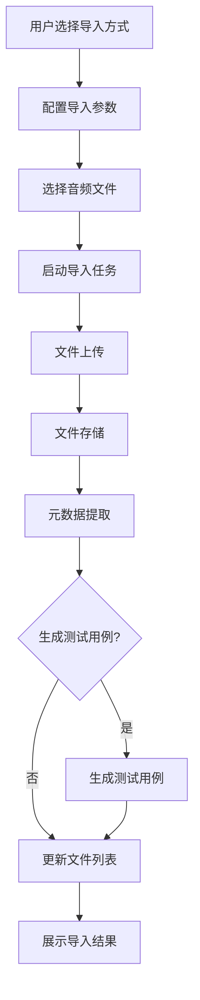
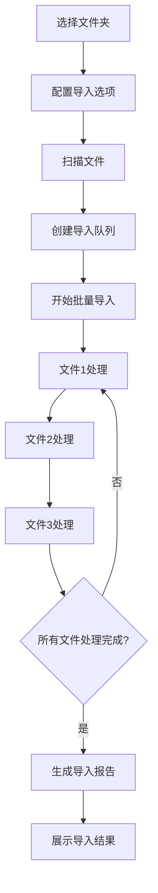
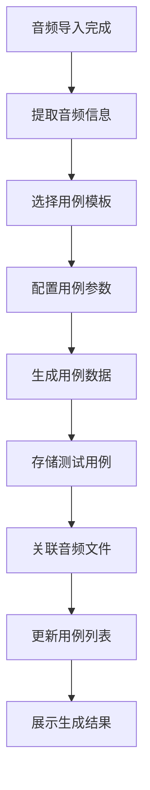

# 音频导入功能设计文档

## 1. 概述

### 1.1 文档目的

本文档描述智能语音测试系统中音频导入功能（AudioImport）模块的详细设计，包括功能定位、架构设计、核心流程、技术实现和用户界面等方面。音频导入功能作为系统的基础支撑能力之一，旨在为用户提供灵活、高效的音频文件管理能力，支持多种音频导入方式和自动生成测试用例。

### 1.2 功能定位

音频导入功能位于系统数据管理的基础位置，主要解决以下测试场景需求：

- **多种导入方式**：支持本地上传、URL导入和文件夹批量导入
- **批量操作**：支持批量音频文件的导入和管理
- **自动生成用例**：导入音频时可选择自动生成测试用例
- **音频管理**：提供音频预览、格式转换和元数据编辑功能
- **声压级配置**：支持设置音频文件的声压级（SPL）

该功能适用于测试数据准备、用例创建、音频管理等场景，是确保测试数据质量的重要工具。

### 1.3 术语定义

| 术语  | 解释                                  |
| --- | ----------------------------------- |
| 干音  | 不含环境噪声的纯净录音，用于标准化测试                 |
| 噪声  | 环境背景噪声，用于模拟真实使用场景                   |
| 提示音 | 用于引导用户操作的音频，如"请开始说话"                |
| SPL | Sound Pressure Level，声压级，衡量声音强度的物理量 |
| 采样率 | 音频采样的频率，单位为Hz，如44100Hz              |
| 声道数 | 音频的声道数量，如单声道、立体声                    |
| 位深度 | 音频采样的位深度，如16位、24位                   |
| 比特率 | 音频数据的传输速率，单位为kbps                   |
| 元数据 | 描述音频文件的数据，如标题、艺术家、时长等               |

## 2. 系统架构设计

### 2.1 整体架构

音频导入功能采用前后端分离的三层架构设计，包含前端展示层、后端服务层和文件处理层。

**前端展示层**：基于Vue 3框架构建，提供用户界面、导入配置、实时监控和音频管理功能。前端通过WebSocket与后端建立实时通信，接收导入进度和状态更新。

**后端服务层**：基于Flask框架实现，负责音频文件管理、导入处理、元数据提取和测试用例生成。后端通过异步IO处理文件上传和处理，通过WebSocket向前端推送实时数据。

**文件处理层**：负责音频文件的物理存储、格式转换、元数据提取和音频分析。支持多种音频格式的处理和转换。

### 2.2 核心组件

| 组件       | 职责                    | 技术实现               | 通信方式                  |
| -------- | --------------------- | ------------------ | --------------------- |
| 前端音频导入页面 | 提供用户界面、导入配置、实时监控和音频管理 | Vue 3 + WebSocket  | WebSocket推送           |
| 后端音频管理服务 | 负责音频文件管理、导入处理、元数据提取   | Flask + SQLAlchemy | HTTP REST + WebSocket |
| 文件上传处理   | 处理音频文件的上传和存储          | Flask Uploads      | HTTP POST             |
| 音频格式转换   | 支持不同音频格式的转换           | pydub + ffmpeg     | 本地进程                  |
| 元数据提取    | 提取音频文件的元数据信息          | mutagen            | 本地库调用                 |
| 测试用例生成   | 根据音频文件自动生成测试用例        | Flask + SQLAlchemy | 内存计算                  |
| 音频预览服务   | 提供音频文件的预览播放功能         | Flask + WebSocket  | WebSocket             |

### 2.3 数据流设计

音频导入功能的数据流设计遵循单向数据流原则，确保数据传输的清晰性和可追踪性。

1. **导入配置数据流**：用户在前端配置导入参数（导入方式、目标文件夹、生成用例选项等）→ 前端通过HTTP POST发送到后端 → 后端解析并存储导入配置
2. **文件上传数据流**：用户选择文件 → 前端通过HTTP POST或WebSocket发送文件 → 后端接收并存储文件 → 文件处理层处理文件
3. **处理进度数据流**：文件处理状态变化 → 后端实时捕获 → WebSocket推送到前端 → 前端更新UI展示
4. **结果处理数据流**：文件处理完成 → 后端生成文件元数据 → 数据库存储元数据 → 前端通过HTTP GET获取文件列表

### 2.4 依赖关系

音频导入功能依赖以下系统模块：

- **用例管理模块**：用于自动生成测试用例
- **声压级映射模块**：用于音频文件的声压级配置
- **设备管理模块**：用于音频播放设备的配置
- **任务管理模块**：用于导入任务的生命周期管理

## 3. 核心功能模块

### 3.1 音频导入管理

#### 3.1.1 多途径导入

音频导入功能支持多种导入途径，满足不同场景的需求。

**本地上传**

- 支持通过文件选择器选择本地音频文件
- 支持拖拽文件到指定区域上传
- 支持批量选择多个文件上传
- 支持上传进度显示和错误处理

**URL导入**

- 支持通过URL地址下载音频文件
- 支持批量URL导入
- 支持URL格式验证和错误处理
- 支持下载进度显示

**文件夹批量导入**

- 支持选择本地文件夹批量导入
- 支持递归导入子文件夹
- 支持按文件类型筛选
- 支持导入进度显示和错误处理

#### 3.1.2 导入配置管理

导入配置管理模块负责配置音频导入的各项参数。

**目标文件夹配置**

- 支持选择或创建目标文件夹
- 支持按音频类型自动分类
- 支持设置文件夹权限

**音频类型配置**

- 支持设置音频类型（干音、噪声、提示音）
- 支持按文件命名规则自动识别类型
- 支持批量类型设置

**测试用例配置**

- 支持设置是否自动生成测试用例
- 支持选择测试用例类型
- 支持设置测试参数模板

**声压级配置**

- 支持设置音频文件的声压级（SPL）
- 支持批量设置SPL值
- 支持SPL校准数据导入

### 3.2 音频文件管理

#### 3.2.1 文件存储管理

文件存储管理模块负责音频文件的物理存储和组织。

**存储结构**

- 采用分层目录结构存储音频文件
- 按音频类型、日期等分类存储
- 支持自定义存储路径

**文件命名**

- 支持自动生成文件名
- 支持保留原始文件名
- 支持文件名冲突处理

**文件版本**

- 支持文件版本管理
- 支持文件历史记录
- 支持版本回滚

#### 3.2.2 元数据管理

元数据管理模块负责音频文件元数据的提取和管理。

**元数据提取**

- 自动提取音频文件的基本元数据（时长、采样率、声道数等）
- 支持提取音频文件的标签元数据（标题、艺术家、专辑等）
- 支持自定义元数据字段

**元数据编辑**

- 支持编辑音频文件的元数据
- 支持批量编辑元数据
- 支持元数据模板应用

**元数据搜索**

- 支持按元数据字段搜索音频文件
- 支持高级搜索条件
- 支持搜索结果排序和过滤

#### 3.2.3 音频预览与播放

音频预览与播放模块负责音频文件的预览和播放功能。

**音频预览**

- 支持音频文件的实时预览
- 支持播放控制（播放、暂停、停止、进度调节）
- 支持音量控制

**播放设备配置**

- 支持选择音频播放设备
- 支持配置播放参数（采样率、缓冲区大小等）
- 支持测试播放设备

**播放历史**

- 记录音频文件的播放历史
- 支持查看最近播放的文件
- 支持播放历史统计

### 3.3 音频处理

#### 3.3.1 格式转换

格式转换模块负责音频文件格式的转换。

**支持的格式**

- 输入格式：MP3、WAV、FLAC、AAC、OGG、WMA等
- 输出格式：MP3、WAV、FLAC、AAC等

**转换参数**

- 支持设置目标采样率
- 支持设置目标声道数
- 支持设置目标位深度
- 支持设置目标比特率

**批量转换**

- 支持批量选择音频文件进行转换
- 支持设置转换队列
- 支持转换进度显示

#### 3.3.2 音频分析

音频分析模块负责音频文件的分析和处理。

**音频特征分析**

- 分析音频的频谱特征
- 分析音频的能量分布
- 分析音频的时域特征

**音频质量评估**

- 评估音频的信噪比
- 评估音频的动态范围
- 评估音频的频率响应

**音频处理**

- 支持音频降噪
- 支持音频增益调整
- 支持音频剪辑

#### 3.3.3 声压级管理

声压级管理模块负责音频文件的声压级配置和管理。

**SPL校准**

- 支持音频文件的SPL校准
- 支持批量SPL校准
- 支持SPL校准数据导入导出

**SPL计算**

- 根据数字增益计算实际SPL
- 支持不同距离的SPL换算
- 支持SPL曲线可视化

**SPL应用**

- 支持按SPL值调整音频播放音量
- 支持不同SPL场景的快速切换
- 支持SPL历史记录

### 3.4 测试用例生成

#### 3.4.1 自动生成用例

自动生成用例模块负责根据音频文件自动生成测试用例。

**用例模板管理**

- 支持创建和管理用例模板
- 支持按测试类型分类模板
- 支持模板参数配置

**用例生成规则**

- 支持按音频类型生成对应测试用例
- 支持按文件名规则生成用例名称
- 支持批量生成用例

**用例关联**

- 建立音频文件与测试用例的关联
- 支持用例的批量修改
- 支持用例的版本管理

#### 3.4.2 用例配置管理

用例配置管理模块负责配置自动生成的测试用例参数。

**测试类型配置**

- 支持设置测试用例的类型（唤醒词、命令识别、语音识别等）
- 支持按音频类型自动选择测试类型
- 支持批量设置测试类型

**测试参数配置**

- 支持设置测试用例的播放设备
- 支持设置测试用例的音量和SPL值
- 支持设置测试用例的重复次数

**评估配置**

- 支持设置测试用例的评估维度
- 支持设置评估参数
- 支持批量评估配置

### 3.5 批量操作管理

#### 3.5.1 批量导入

批量导入模块负责批量音频文件的导入处理。

**导入队列管理**

- 支持创建和管理导入队列
- 支持导入任务的暂停、继续和取消
- 支持导入任务的优先级设置

**导入进度监控**

- 实时显示导入进度
- 显示导入速度和预计剩余时间
- 显示导入成功和失败的文件数量

**导入错误处理**

- 处理导入过程中的错误
- 记录错误信息和原因
- 支持错误文件的重试

#### 3.5.2 批量管理

批量管理模块负责批量音频文件的管理操作。

**批量选择**

- 支持按条件批量选择音频文件
- 支持全选和反选
- 支持批量操作的撤销和重做

**批量操作**

- 支持批量移动音频文件
- 支持批量删除音频文件
- 支持批量复制音频文件
- 支持批量重命名音频文件

**批量属性修改**

- 支持批量修改音频文件的元数据
- 支持批量修改音频文件的类型
- 支持批量修改音频文件的SPL值

## 4. 核心流程图

### 4.1 音频导入主流程



### 4.2 批量导入流程



### 4.3 自动生成测试用例流程



## 5. 用户界面设计

### 5.1 页面布局

音频导入功能页面采用左侧导航+右侧内容区的经典布局，响应式设计适配不同屏幕尺寸。

**顶部导航栏**：显示当前导入任务状态、操作按钮（开始、暂停、停止）
**左侧边栏**：音频管理和导入配置区域，包含音频列表、导入配置、批量操作三个标签页
**右侧主内容区**：导入执行监控和音频预览区域，包含进度条、实时日志、音频播放器
**底部状态栏**：显示系统状态、存储空间、导入速度等

### 5.2 核心界面

#### 5.2.1 音频导入界面

**导入方式选择标签页**

- 本地上传：文件选择器和拖拽区域
- URL导入：URL输入框和批量URL导入
- 文件夹导入：文件夹选择器和递归导入选项

**导入配置标签页**

- 目标文件夹：选择或创建目标文件夹
- 音频类型：设置音频类型（干音、噪声、提示音）
- 测试用例：设置是否自动生成测试用例及参数
- 声压级：设置音频文件的声压级

**导入执行标签页**

- 导入进度：显示导入进度条和速度
- 导入日志：实时显示导入过程日志
- 错误处理：显示导入错误和处理建议
- 完成统计：显示导入成功和失败的文件数量

#### 5.2.2 音频管理界面

**音频列表标签页**

- 音频文件列表：显示音频文件的名称、类型、时长、大小等
- 排序功能：支持按名称、类型、时长、大小等排序
- 筛选功能：支持按类型、格式、时长等筛选
- 搜索功能：支持关键词搜索音频文件

**音频详情标签页**

- 基本信息：显示音频文件的基本信息（名称、大小、路径等）
- 技术信息：显示音频文件的技术参数（采样率、声道数、位深度等）
- 元数据：显示和编辑音频文件的元数据
- 关联信息：显示关联的测试用例和设备

**音频预览标签页**

- 音频播放器：播放、暂停、停止、进度调节
- 音量控制：音量滑块和静音按钮
- 播放设备：选择音频播放设备
- 播放历史：显示最近播放的音频文件

#### 5.2.3 批量操作界面

**批量选择标签页**

- 文件列表：支持复选框选择多个文件
- 全选功能：支持全选和反选
- 条件选择：支持按条件批量选择文件
- 选择预览：显示已选择的文件数量和列表

**批量操作标签页**

- 操作类型：移动、复制、删除、重命名
- 目标位置：选择目标文件夹
- 操作参数：设置操作的具体参数
- 操作执行：执行批量操作并显示进度

**批量属性修改标签页**

- 属性类型：元数据、类型、SPL值等
- 属性值：设置要修改的属性值
- 应用范围：选择要应用修改的文件
- 修改执行：执行批量属性修改并显示结果

### 5.3 交互设计

#### 5.3.1 操作流程

**音频导入流程**

1. 用户在导入方式选择界面选择导入方式（本地、URL、文件夹）
2. 配置导入参数（目标文件夹、音频类型、测试用例生成选项）
3. 选择要导入的音频文件或输入URL
4. 点击"开始导入"按钮启动导入任务
5. 系统显示导入进度和日志
6. 导入完成后显示导入结果统计

**音频管理流程**

1. 用户在音频列表界面浏览音频文件
2. 点击音频文件查看详情
3. 使用搜索和筛选功能找到目标音频文件
4. 点击音频文件进行预览播放
5. 编辑音频文件的元数据和属性

**批量操作流程**

1. 用户在批量选择界面选择多个音频文件
2. 选择要执行的批量操作类型
3. 配置操作参数
4. 点击"执行操作"按钮开始批量操作
5. 系统显示操作进度和结果

#### 5.3.2 响应式设计

音频导入界面采用响应式设计，适配不同屏幕尺寸：

- **桌面端**（≥1200px）：完整三栏布局，左侧导航、右侧内容、底部状态栏
- **平板端**（768px-1199px）：双栏布局，导航可折叠，内容区优先显示
- **移动端**（<768px）：单栏布局，通过标签页切换不同功能区域

### 5.4 视觉设计

#### 5.4.1 颜色系统

音频导入功能采用青色主题，体现专业、高效的音频管理工具属性：

- **主色调**：#2FC2BF（青色），用于按钮、进度条、重要状态
- **辅助色**：#E6FFFB（浅青），用于背景、边框、次要元素
- **状态色**：
  - 成功：#52C41A（绿色）
  - 警告：#FAAD14（黄色）
  - 错误：#F5222D（红色）
  - 信息：#1890FF（蓝色）

#### 5.4.2 字体与图标

- **字体**：系统默认无衬线字体，主标题16px，正文14px，小字12px
- **图标**：使用Font Awesome图标库，主要图标包括：
  - 音乐：用于音频文件和音频管理
  - 上传：用于文件上传
  - 文件夹：用于文件夹管理
  - 播放器：用于音频预览
  - 批处理：用于批量操作

#### 5.4.3 布局原则

- **信息层次**：重要信息（导入进度、音频列表）优先显示，次要信息（详细配置）可折叠
- **空间利用**：充分利用屏幕空间，避免不必要的留白
- **操作便捷**：常用操作按钮放置在显眼位置，减少操作路径
- **视觉引导**：使用颜色、图标、动画等元素引导用户注意力
- **一致性**：保持与系统其他模块的视觉风格一致

## 6. 技术实现

### 6.1 前端实现

#### 6.1.1 技术栈

- **框架**：Vue 3 + Composition API
- **状态管理**：Pinia（轻量级状态管理）
- **路由**：Vue Router
- **通信**：WebSocket（实时通信） + Axios（HTTP请求）
- **UI组件**：自定义组件 + Element Plus
- **文件上传**：Vue Upload Component
- **音频处理**：Web Audio API
- **样式**：SCSS + CSS变量

#### 6.1.2 核心模块

**导入管理模块**

- 导入方式选择组件：`ImportMethodSelector.vue`
- 导入配置组件：`ImportConfig.vue`
- 导入执行组件：`ImportExecutor.vue`

**音频管理模块**

- 音频列表组件：`AudioList.vue`
- 音频详情组件：`AudioDetail.vue`
- 音频预览组件：`AudioPlayer.vue`

**批量操作模块**

- 批量选择组件：`BatchSelector.vue`
- 批量操作组件：`BatchOperation.vue`
- 批量属性修改组件：`BatchPropertyEditor.vue`

#### 6.1.3 关键实现

**文件上传处理**

```javascript
// 文件上传处理
export const useFileUpload = () => {
  const files = ref([]);
  const uploadProgress = ref(0);
  const isUploading = ref(false);
  const uploadError = ref(null);
  
  const uploadFiles = async (fileList, config) => {
    isUploading.value = true;
    uploadProgress.value = 0;
    uploadError.value = null;
    
    try {
      const formData = new FormData();
      fileList.forEach(file => {
        formData.append('files', file);
      });
      
      // 添加配置参数
      Object.entries(config).forEach(([key, value]) => {
        formData.append(key, value);
      });
      
      const response = await axios.post('/api/audio/import', formData, {
        headers: {
          'Content-Type': 'multipart/form-data'
        },
        onUploadProgress: (progressEvent) => {
          uploadProgress.value = Math.round(
            (progressEvent.loaded / progressEvent.total) * 100
          );
        }
      });
      
      files.value = response.data.files;
      return response.data;
    } catch (error) {
      uploadError.value = error.message;
      throw error;
    } finally {
      isUploading.value = false;
    }
  };
  
  const cancelUpload = () => {
    // 实现上传取消逻辑
  };
  
  return {
    files,
    uploadProgress,
    isUploading,
    uploadError,
    uploadFiles,
    cancelUpload
  };
};
```

**音频预览功能**

```javascript
// 音频预览功能
export const useAudioPlayer = () => {
  const audio = ref(null);
  const isPlaying = ref(false);
  const currentTime = ref(0);
  const duration = ref(0);
  const volume = ref(1);
  const isMuted = ref(false);
  
  const initAudio = () => {
    if (!audio.value) {
      audio.value = new Audio();
      
      audio.value.addEventListener('timeupdate', () => {
        currentTime.value = audio.value.currentTime;
      });
      
      audio.value.addEventListener('loadedmetadata', () => {
        duration.value = audio.value.duration;
      });
      
      audio.value.addEventListener('ended', () => {
        isPlaying.value = false;
        currentTime.value = 0;
      });
      
      audio.value.addEventListener('error', (error) => {
        console.error('Audio error:', error);
      });
    }
  };
  
  const playAudio = (audioUrl) => {
    initAudio();
    
    if (audio.value.src !== audioUrl) {
      audio.value.src = audioUrl;
    }
    
    audio.value.play().then(() => {
      isPlaying.value = true;
    }).catch(error => {
      console.error('Play error:', error);
    });
  };
  
  const pauseAudio = () => {
    if (audio.value) {
      audio.value.pause();
      isPlaying.value = false;
    }
  };
  
  const stopAudio = () => {
    if (audio.value) {
      audio.value.pause();
      audio.value.currentTime = 0;
      isPlaying.value = false;
      currentTime.value = 0;
    }
  };
  
  const setVolume = (newVolume) => {
    if (audio.value) {
      volume.value = newVolume;
      audio.value.volume = newVolume;
      isMuted.value = newVolume === 0;
    }
  };
  
  const toggleMute = () => {
    if (audio.value) {
      isMuted.value = !isMuted.value;
      audio.value.muted = isMuted.value;
    }
  };
  
  const seekTo = (time) => {
    if (audio.value) {
      audio.value.currentTime = time;
      currentTime.value = time;
    }
  };
  
  return {
    isPlaying,
    currentTime,
    duration,
    volume,
    isMuted,
    playAudio,
    pauseAudio,
    stopAudio,
    setVolume,
    toggleMute,
    seekTo
  };
};
```

### 6.2 后端实现

#### 6.2.1 技术栈

- **框架**：Flask + Flask-SocketIO
- **文件处理**：Flask-Uploads + Werkzeug
- **音频处理**：pydub + ffmpeg
- **元数据提取**：mutagen
- **数据库**：PostgreSql + SQLAlchemy
- **网络通信**：WebSocket + RESTful API
- **异步处理**：asyncio

#### 6.2.2 核心模块

**导入处理模块**

- 文件上传处理：`upload_handler.py`
- URL下载处理：`url_downloader.py`
- 文件夹扫描处理：`folder_scanner.py`

**音频管理模块**

- 音频存储管理：`audio_storage.py`
- 元数据管理：`metadata_manager.py`
- 音频预览服务：`audio_preview.py`

**处理模块**

- 格式转换：`format_converter.py`
- 音频分析：`audio_analyzer.py`
- SPL管理：`spl_manager.py`

**用例生成模块**

- 用例模板管理：`case_template_manager.py`
- 用例生成器：`case_generator.py`

#### 6.2.3 关键实现

**音频文件处理**

```python
# 音频文件处理
import os
import mutagen
from pydub import AudioSegment
from flask import current_app

class AudioProcessor:
    """音频处理器"""
    
    def __init__(self):
        self.upload_folder = current_app.config['UPLOAD_FOLDER']
    
    def process_audio(self, file_path):
        """处理音频文件"""
        # 提取元数据
        metadata = self.extract_metadata(file_path)
        
        # 分析音频特征
        features = self.analyze_audio(file_path)
        
        # 生成缩略图
        thumbnail_path = self.generate_thumbnail(file_path)
        
        return {
            'metadata': metadata,
            'features': features,
            'thumbnail_path': thumbnail_path
        }
    
    def extract_metadata(self, file_path):
        """提取音频文件元数据"""
        try:
            audio = mutagen.File(file_path)
            if audio:
                metadata = {
                    'format': audio.info.format,
                    'duration': audio.info.length,
                    'sample_rate': audio.info.sample_rate,
                    'channels': getattr(audio.info, 'channels', 1),
                    'bit_depth': getattr(audio.info, 'bits_per_sample', 16),
                    'bitrate': getattr(audio.info, 'bitrate', 0) // 1000
                }
                
                # 提取标签信息
                if hasattr(audio, 'tags') and audio.tags:
                    metadata['title'] = audio.tags.get('title', [''])[0]
                    metadata['artist'] = audio.tags.get('artist', [''])[0]
                    metadata['album'] = audio.tags.get('album', [''])[0]
                
                return metadata
        except Exception as e:
            current_app.logger.error(f"Error extracting metadata: {e}")
        
        return {
            'format': os.path.splitext(file_path)[1][1:],
            'duration': 0,
            'sample_rate': 0,
            'channels': 1,
            'bit_depth': 16,
            'bitrate': 0
        }
    
    def analyze_audio(self, file_path):
        """分析音频特征"""
        try:
            audio = AudioSegment.from_file(file_path)
            
            features = {
                'duration': len(audio) / 1000,  # 转换为秒
                'sample_width': audio.sample_width * 8,  # 转换为位
                'frame_rate': audio.frame_rate,
                'channels': audio.channels
            }
            
            return features
        except Exception as e:
            current_app.logger.error(f"Error analyzing audio: {e}")
        
        return {
            'duration': 0,
            'sample_width': 16,
            'frame_rate': 44100,
            'channels': 1
        }
    
    def generate_thumbnail(self, file_path):
        """生成音频波形缩略图"""
        # 这里实现音频波形缩略图生成逻辑
        # 使用librosa和matplotlib生成波形图
        return None
    
    def convert_format(self, file_path, target_format, output_path):
        """转换音频格式"""
        try:
            audio = AudioSegment.from_file(file_path)
            audio.export(output_path, format=target_format)
            return True
        except Exception as e:
            current_app.logger.error(f"Error converting format: {e}")
            return False
```

**测试用例生成**

```python
# 测试用例生成
from datetime import datetime
from flask import current_app

class CaseGenerator:
    """测试用例生成器"""
    
    def __init__(self, db):
        self.db = db
    
    def generate_cases(self, audio_files, case_type, config):
        """生成测试用例"""
        cases = []
        
        for audio_file in audio_files:
            case = self._generate_case(audio_file, case_type, config)
            if case:
                cases.append(case)
        
        # 批量添加测试用例
        if cases:
            self.db.session.add_all(cases)
            self.db.session.commit()
        
        return cases
    
    def _generate_case(self, audio_file, case_type, config):
        """生成单个测试用例"""
        from app.models import TestCase
        
        try:
            # 生成用例名称
            case_name = self._generate_case_name(audio_file, case_type)
            
            # 创建测试用例
            case = TestCase(
                name=case_name,
                type=case_type,
                audio_file_id=audio_file.id,
                device_id=config.get('device_id'),
                volume=config.get('volume', 100),
                spl=config.get('spl', 80),
                repeat_count=config.get('repeat_count', 1),
                created_at=datetime.utcnow()
            )
            
            return case
        except Exception as e:
            current_app.logger.error(f"Error generating case: {e}")
            return None
    
    def _generate_case_name(self, audio_file, case_type):
        """生成用例名称"""
        # 从音频文件名提取用例名称
        base_name = os.path.splitext(os.path.basename(audio_file.file_path))[0]
        case_name = f"{case_type}_{base_name}"
        return case_name
    
    def get_case_template(self, case_type):
        """获取用例模板"""
        from app.models import CaseTemplate
        
        template = CaseTemplate.query.filter_by(type=case_type).first()
        if template:
            return template.to_dict()
        
        # 返回默认模板
        return {
            'device_id': None,
            'volume': 100,
            'spl': 80,
            'repeat_count': 1,
            'evaluation_dimensions': []
        }
```

## 7. 性能与可靠性设计

### 7.1 性能优化

#### 7.1.1 文件处理优化

- **异步处理**：使用异步IO处理文件上传和处理，提高并发能力
- **分块上传**：支持大文件分块上传，避免超时和内存溢出
- **并行处理**：支持多文件并行处理，提高处理速度
- **缓存机制**：缓存音频文件的元数据和分析结果，减少重复计算

#### 7.1.2 存储优化

- **文件压缩**：对音频文件进行适当压缩，减少存储空间
- **存储结构**：优化文件存储结构，提高文件检索速度
- **索引优化**：为音频文件元数据创建索引，加速搜索和筛选
- **清理机制**：定期清理临时文件和过期文件，释放存储空间

#### 7.1.3 响应速度

- **前端优化**：使用虚拟滚动处理大量文件列表，减少DOM操作
- **后端优化**：使用缓存减少重复计算，优化数据库查询
- **WebSocket优化**：使用二进制数据格式，减少传输开销
- **文件传输优化**：使用断点续传，支持大文件传输

### 7.2 可靠性设计

#### 7.2.1 错误处理

- **文件错误**：处理文件格式错误、文件损坏等错误
- **网络错误**：处理网络中断、超时等错误
- **系统错误**：处理系统资源不足、权限不足等错误
- **数据错误**：处理元数据格式错误、数据缺失等错误

#### 7.2.2 重试机制

- **上传重试**：文件上传失败自动重试
- **处理重试**：文件处理失败自动重试
- **导入重试**：导入任务失败支持手动重试
- **下载重试**：URL下载失败自动重试

#### 7.2.3 容错设计

- **文件容错**：部分文件失败不影响其他文件处理
- **网络容错**：网络中断后自动重连，恢复上传
- **存储容错**：文件存储采用冗余设计，避免数据丢失
- **处理容错**：处理过程中系统崩溃后支持恢复处理

#### 7.2.4 监控与告警

- **系统监控**：监控CPU、内存、磁盘使用情况
- **网络监控**：监控网络连接质量、带宽
- **文件监控**：监控文件上传和处理状态
- **错误告警**：关键错误实时告警，支持邮件通知

## 8. 安全设计

### 8.1 文件安全

- **文件验证**：验证上传文件的类型和大小，防止恶意文件
- **文件隔离**：上传文件存储在隔离目录，防止路径遍历攻击
- **权限控制**：设置文件和目录的最小权限，防止未授权访问
- **病毒扫描**：对上传文件进行病毒扫描，防止恶意代码

### 8.2 数据安全

- **数据加密**：敏感数据传输和存储加密
- **访问控制**：基于角色的访问控制
- **数据脱敏**：音频文件中的敏感信息脱敏处理
- **审计日志**：记录所有文件操作日志，支持追溯

### 8.3 网络安全

- **传输加密**：WebSocket连接使用WSS加密
- **访问限制**：限制API访问来源，防止未授权访问
- **DDoS防护**：限制文件上传速率，防止滥用
- **CSRF防护**：防止跨站请求伪造攻击

### 8.4 应用安全

- **依赖安全**：定期更新第三方依赖，修复安全漏洞
- **代码安全**：代码审查，防止安全漏洞
- **配置安全**：敏感配置信息加密存储
- **运行安全**：应用运行在沙箱环境中

## 9. 测试与维护

### 9.1 测试策略

#### 9.1.1 单元测试

- **文件处理测试**：测试文件上传、下载、存储功能
- **音频处理测试**：测试音频格式转换、元数据提取功能
- **用例生成测试**：测试测试用例生成功能
- **API测试**：测试后端API的功能和性能

#### 9.1.2 集成测试

- **前端集成**：测试前端组件交互
- **后端集成**：测试后端模块协作
- **前后端集成**：测试WebSocket通信
- **文件系统集成**：测试与文件系统的交互

#### 9.1.3 端到端测试

- **完整流程测试**：测试从导入到管理的完整流程
- **批量操作测试**：测试批量文件处理功能
- **大文件测试**：测试大文件上传和处理
- **异常场景测试**：测试各种异常场景的处理

### 9.2 维护策略

#### 9.2.1 监控与日志

- **系统监控**：监控CPU、内存、磁盘使用情况
- **文件监控**：监控文件存储使用情况
- **网络监控**：监控网络连接质量、带宽
- **日志管理**：集中管理系统日志、应用日志、文件操作日志

#### 9.2.2 故障排除

- **故障诊断**：快速定位故障原因
- **故障修复**：及时修复系统故障
- **故障预防**：分析故障原因，预防类似问题
- **知识积累**：建立故障知识库，支持快速解决

#### 9.2.3 版本管理

- **代码版本**：使用Git进行代码版本管理
- **配置版本**：管理导入配置的版本
- **文件版本**：管理音频文件的版本
- **模板版本**：管理测试用例模板的版本

#### 9.2.4 升级策略

- **系统升级**：定期升级系统组件和依赖
- **功能升级**：根据用户反馈和需求添加新功能
- **性能升级**：优化系统性能，提高处理效率
- **安全升级**：及时修复安全漏洞

## 10. 未来规划

### 10.1 功能增强

- **更多导入方式**：支持从云存储（如阿里云OSS、腾讯云COS）导入音频文件
- **智能分类**：使用AI自动分类音频文件，识别音频内容和类型
- **音频增强**：提供音频降噪、均衡器等音频增强功能
- **批量编辑**：支持更丰富的批量编辑功能，如批量添加水印

### 10.2 技术演进

- **容器化部署**：支持Docker容器化部署，提高环境一致性
- **云服务集成**：集成云存储服务，扩展存储能力
- **边缘计算**：利用边缘设备提高音频处理效率
- **低代码配置**：提供可视化配置界面，降低使用门槛

### 10.3 生态建设

- **插件系统**：支持第三方插件扩展功能，如音频分析插件
- **API开放**：开放API接口，支持与其他系统集成
- **社区建设**：建立用户社区，共享音频资源和测试用例
- **标准制定**：参与音频测试标准制定，推动行业发展

## 11. 结论

音频导入功能是智能语音测试系统的基础支撑能力之一，通过提供灵活、高效的音频文件管理能力，为用户的测试工作提供了重要的数据基础。本文档详细描述了该功能的设计方案，包括系统架构、核心功能、技术实现、用户界面等方面，为开发团队提供了清晰的实现指导。

随着技术的不断发展和用户需求的不断变化，音频导入功能也需要持续演进和优化。通过本文档的指导，开发团队可以快速实现该功能的核心能力，并在此基础上不断扩展和完善，为用户提供更加全面、高效、可靠的音频管理解决方案。

## 12. 参考资料

- [pydub官方文档](https://pydub.com/)
- [mutagen官方文档](https://mutagen.readthedocs.io/)
- [Flask官方文档](https://flask.palletsprojects.com/)
- [Vue 3官方文档](https://vuejs.org/)
- [Web Audio API规范](https://www.w3.org/TR/webaudio/)
- [音频文件格式标准](https://www.iana.org/assignments/media-types/media-types.xhtml)
- [声压级测量标准](https://www.iec.ch/standard/60651)

